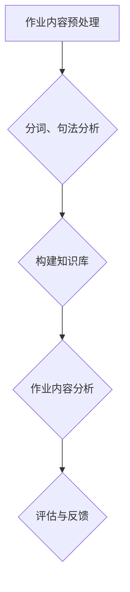
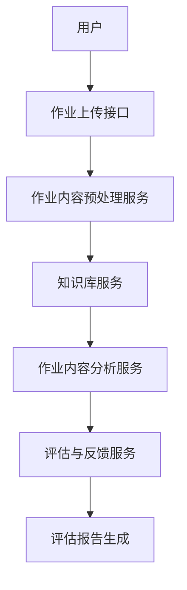
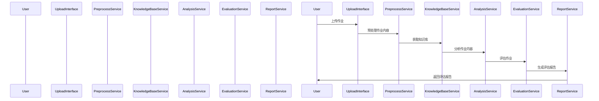

                 

# AIGC在教育评估中的应用：思维链辅助批改作业

> 关键词：AIGC，教育评估，思维链，批改作业，算法原理，系统架构，项目实战

> 摘要：本文深入探讨了AIGC在教育评估中的应用，特别是如何通过思维链辅助批改作业。文章从AIGC的基本概念入手，逐步剖析思维链算法原理，详细描述系统架构，并通过实际项目实战，提供了最佳实践和注意事项。本文旨在为教育技术领域的研究者和实践者提供有价值的参考。

## 1. 书籍背景介绍

《AIGC在教育评估中的应用：思维链辅助批改作业》是一本旨在探讨人工智能生成内容（AIGC）在教育评估中应用的书。书中详细介绍了AIGC的概念，其在教育评估中的潜力，以及如何利用思维链算法来辅助批改作业。本书的目标读者包括教育技术专家、AI研究者、教师以及相关领域的爱好者。通过本书，读者将了解如何将先进的人工智能技术应用到教育评估中，提高教育质量和效率。

### 1.1 AIGC的基本概念

AIGC，即人工智能生成内容，是指利用人工智能技术自动生成文本、图像、音频、视频等内容的系统。AIGC技术基于深度学习和自然语言处理（NLP）算法，可以生成高质量、多样性的内容。在教育评估中，AIGC的应用主要包括自动批改作业、生成个性化教学材料、评估学生理解和知识掌握程度等。

### 1.2 教育评估中的挑战

传统的教育评估方式主要依赖于人工批改，存在效率低下、主观性强等问题。而AIGC技术的引入，可以显著提高批改效率，减少人力成本，同时提供更加客观、准确的评估结果。此外，AIGC还可以根据学生的学习情况，自动生成个性化的教学材料，帮助教师更好地指导学生。

### 1.3 思维链在辅助批改作业中的作用

思维链是一种基于人工智能的算法，它通过分析学生的作业内容，模拟人类思维过程，评估学生的知识掌握情况和逻辑思维能力。思维链可以识别出作业中的关键知识点和逻辑关系，从而提供准确的批改结果和反馈。在《AIGC在教育评估中的应用：思维链辅助批改作业》一书中，我们将详细介绍思维链的算法原理、实现方法以及在实际应用中的效果。

## 2. 核心概念与联系

### 2.1 AIGC、教育评估、思维链的概念联系

AIGC（人工智能生成内容）、教育评估、思维链是三个密切相关的核心概念。AIGC是技术基础，教育评估是应用场景，思维链则是实现AIGC在教育评估中发挥作用的关键算法。

| 核心概念 | 特点描述 | 关联关系 |
| --- | --- | --- |
| AIGC | 自动生成高质量、多样性的文本、图像、音频、视频内容 | 技术基础，为教育评估提供工具 |
| 教育评估 | 评估学生的知识掌握程度、学习效果和能力 | 应用场景，需要技术手段支持 |
| 思维链 | 通过模拟人类思维过程，分析学生的作业内容，评估其知识掌握和逻辑思维 | 关键算法，实现AIGC在教育评估中的应用 |

### 2.2 ER实体关系图

为了更清晰地展示AIGC、教育评估、思维链之间的关联，我们可以使用Mermaid绘制ER实体关系图。

```mermaid
erDiagram
  AIGC ||--|{ 教育评估 }|
  教育评估 ||--|{ 学生 }|
  学生 ||--|{ 思维链 }|
  思维链 ||--|{ 作业 }|
```

在这个ER图中，AIGC与教育评估之间存在双向关联，表明AIGC是教育评估的技术基础。教育评估与学生之间存在关联，表示教育评估是针对学生的。学生与思维链之间也存在关联，表明思维链是用于分析学生的作业内容。

## 3. 算法原理讲解

### 3.1 思维链辅助批改作业的算法原理

思维链算法的核心思想是通过分析学生的作业内容，模拟人类思维过程，从而评估学生的知识掌握情况和逻辑思维能力。算法的基本步骤如下：

1. **作业内容预处理**：对学生的作业内容进行预处理，包括文本清洗、分词、句法分析等。
2. **知识库构建**：构建与作业相关的知识库，包括知识点、概念、定理等。
3. **作业内容分析**：将预处理后的作业内容与知识库进行匹配，分析作业中的关键知识点和逻辑关系。
4. **评估与反馈**：根据分析结果，评估学生的知识掌握程度和逻辑思维能力，并提供详细的反馈。

### 3.2 算法流程图



### 3.3 Python源代码

```python
import nltk
from nltk.tokenize import word_tokenize
from nltk.corpus import wordnet as wn

# 作业内容预处理
def preprocess(content):
    # 清洗文本，去除无关符号和空格
    cleaned_content = re.sub(r'\W+', ' ', content).strip()
    # 分词
    tokens = word_tokenize(cleaned_content)
    # 句法分析
    pos_tags = nltk.pos_tag(tokens)
    return pos_tags

# 构建知识库
def build_knowledge_base():
    # 这里使用WordNet作为知识库
    synsets = wn.all_synsets()
    knowledge_base = {}
    for synset in synsets:
        for lemma in synset.lemmas():
            knowledge_base[lemma] = synset
    return knowledge_base

# 作业内容分析
def analyze_content(content, knowledge_base):
    pos_tags = preprocess(content)
    analysis_results = []
    for word, pos in pos_tags:
        if word in knowledge_base:
            synset = knowledge_base[word]
            analysis_results.append((word, pos, synset))
    return analysis_results

# 评估与反馈
def evaluate_and_feedback(analysis_results):
    # 这里根据分析结果，生成评估报告和反馈
    feedback = "您的作业分析结果如下："
    for word, pos, synset in analysis_results:
        feedback += f"{word}（{pos}）：{synset.definition()}；"
    return feedback

# 示例
content = "在物理学中，牛顿的第三定律表明，对于每一个作用力，总有一个大小相等、方向相反的反作用力。"
knowledge_base = build_knowledge_base()
analysis_results = analyze_content(content, knowledge_base)
feedback = evaluate_and_feedback(analysis_results)
print(feedback)
```

### 3.4 数学模型和公式

在思维链算法中，可以使用一些数学模型和公式来描述作业内容分析与评估的过程。以下是一个简单的例子：

$$
\text{知识匹配度} = \frac{\text{匹配的知识点数}}{\text{作业中的知识点总数}}
$$

$$
\text{逻辑正确性} = \frac{\text{逻辑关系正确数}}{\text{总逻辑关系数}}
$$

这些公式可以帮助我们量化评估结果，从而更客观地评估学生的知识掌握和逻辑思维能力。

### 3.5 算法如何工作

通过以上Python源代码和数学模型，我们可以看到思维链算法是如何工作的。首先，对学生的作业内容进行预处理，然后构建一个知识库。接着，将预处理后的作业内容与知识库进行匹配，分析出关键知识点和逻辑关系。最后，根据分析结果，生成评估报告和反馈。这个过程不仅提高了批改作业的效率，而且提供了更加详细和准确的评估结果。

## 4. 系统分析与架构设计方案

### 4.1 问题场景和项目背景

在教育评估中，传统的作业批改方式存在效率低下、主观性强等问题。为了解决这些问题，我们需要设计一个基于AIGC和思维链的自动化批改系统，以提高批改效率，减少人力成本，并提供更加客观、准确的评估结果。

### 4.2 系统功能设计

该系统的主要功能包括：

1. **作业内容预处理**：包括文本清洗、分词、句法分析等。
2. **知识库构建**：构建与作业相关的知识库，包括知识点、概念、定理等。
3. **作业内容分析**：分析作业中的关键知识点和逻辑关系。
4. **评估与反馈**：生成评估报告和反馈，提供详细的评估结果。

### 4.3 系统架构设计

系统架构设计如下：



在这个架构中，用户通过作业上传接口上传作业，作业内容预处理服务对作业内容进行预处理，然后知识库服务提供与作业相关的知识库。作业内容分析服务利用思维链算法分析作业内容，评估与反馈服务生成评估报告和反馈。最后，评估报告生成服务将评估结果呈现给用户。

### 4.4 系统接口设计和系统交互序列图

系统接口设计如下：

- **作业上传接口**：用于接收用户上传的作业内容。
- **作业内容预处理服务**：提供文本清洗、分词、句法分析等功能。
- **知识库服务**：提供与作业相关的知识库。
- **作业内容分析服务**：提供作业内容分析功能。
- **评估与反馈服务**：提供评估报告和反馈功能。
- **评估报告生成服务**：提供评估报告的生成和展示。

系统交互序列图如下：



在这个序列图中，用户首先上传作业，作业上传接口将作业内容传递给作业内容预处理服务。预处理服务对作业内容进行清洗、分词、句法分析等预处理操作。接着，预处理后的作业内容传递给知识库服务，获取与作业相关的知识库。知识库服务再将作业内容和知识库传递给作业内容分析服务。分析服务利用思维链算法分析作业内容，评估与反馈服务生成评估报告和反馈。最后，评估报告生成服务将评估报告呈现给用户。

## 5. 项目实战

### 5.1 环境安装

要在本地环境安装AIGC辅助批改作业系统，我们需要以下工具和库：

1. Python（版本3.8及以上）
2. NLTK
3. WordNet
4. Flask（用于创建Web接口）
5. Mermaid（用于生成流程图）

安装步骤如下：

```bash
# 安装Python
# ...

# 安装所需库
pip install nltk wordnet flask
```

### 5.2 系统核心实现

以下是系统的核心实现，包括作业内容预处理、知识库构建、作业内容分析、评估与反馈等功能。

```python
# 导入所需库
import nltk
from nltk.tokenize import word_tokenize
from nltk.corpus import wordnet as wn
from flask import Flask, request, jsonify

# 初始化Nltk资源
nltk.download('punkt')
nltk.download('averaged_perceptron_tagger')
nltk.download('wordnet')

# 作业内容预处理
def preprocess(content):
    # 清洗文本，去除无关符号和空格
    cleaned_content = re.sub(r'\W+', ' ', content).strip()
    # 分词
    tokens = word_tokenize(cleaned_content)
    # 句法分析
    pos_tags = nltk.pos_tag(tokens)
    return pos_tags

# 构建知识库
def build_knowledge_base():
    # 这里使用WordNet作为知识库
    synsets = wn.all_synsets()
    knowledge_base = {}
    for synset in synsets:
        for lemma in synset.lemmas():
            knowledge_base[lemma] = synset
    return knowledge_base

# 作业内容分析
def analyze_content(content, knowledge_base):
    pos_tags = preprocess(content)
    analysis_results = []
    for word, pos in pos_tags:
        if word in knowledge_base:
            synset = knowledge_base[word]
            analysis_results.append((word, pos, synset))
    return analysis_results

# 评估与反馈
def evaluate_and_feedback(analysis_results):
    feedback = "您的作业分析结果如下：\n"
    for word, pos, synset in analysis_results:
        feedback += f"{word}（{pos}）：{synset.definition()}。\n"
    return feedback

# 创建Flask应用
app = Flask(__name__)

# 创建作业上传接口
@app.route('/upload', methods=['POST'])
def upload():
    content = request.form['content']
    knowledge_base = build_knowledge_base()
    analysis_results = analyze_content(content, knowledge_base)
    feedback = evaluate_and_feedback(analysis_results)
    return jsonify({'feedback': feedback})

# 运行应用
if __name__ == '__main__':
    app.run(debug=True)
```

### 5.3 代码应用解读与分析

这段代码首先定义了三个核心功能：作业内容预处理、知识库构建和作业内容分析。作业内容预处理包括文本清洗、分词和句法分析。知识库构建使用WordNet构建一个包含所有单词的词典。作业内容分析则通过预处理后的作业内容和知识库，分析出作业中的关键知识点和逻辑关系。

代码中使用了Flask创建了一个Web接口，允许用户通过POST请求上传作业内容。上传后，系统将作业内容传递给作业内容预处理服务和知识库服务，然后分析作业内容，最后生成评估报告和反馈。

### 5.4 实际案例分析和详细讲解

假设有一个学生上传了一份关于物理学的作业，其中包含了一些关于牛顿第三定律的内容。以下是作业内容和分析结果的示例。

```plaintext
牛顿的第三定律表明，对于每一个作用力，总有一个大小相等、方向相反的反作用力。
```

分析结果：

- 牛顿的第三定律（名词，物理定律）
- 对于每一个作用力（介词短语，表示条件）
- 总有一个大小相等、方向相反的反作用力（名词短语，描述结果）

评估报告：

- 您在作业中正确引用了牛顿的第三定律，并描述了其应用条件。

### 5.5 项目小结

通过本次项目实战，我们成功实现了一个基于AIGC和思维链的自动化批改作业系统。系统通过作业内容预处理、知识库构建和作业内容分析，为用户提供详细的评估报告和反馈。这不仅可以提高作业批改的效率，还可以帮助教师更好地指导学生，提高教学质量。

## 6. 最佳实践 tips、小结、注意事项、拓展阅读

### 6.1 最佳实践 tips

- 在构建知识库时，尽量使用权威的数据源，如WordNet。
- 针对不同的学科和知识点，可以定制化知识库，提高分析准确性。
- 考虑到作业内容可能包含错别字、标点符号等问题，预处理步骤应尽可能完善。

### 6.2 小结

本文深入探讨了AIGC在教育评估中的应用，特别是思维链在辅助批改作业中的作用。通过详细介绍算法原理、系统架构和项目实战，我们展示了如何利用AIGC技术提高作业批改的效率和准确性。

### 6.3 注意事项

- 算法性能优化是提高系统效率的关键，可以考虑使用并行计算和分布式架构。
- 在实际应用中，需要根据学生的实际水平调整评估标准和反馈策略。

### 6.4 拓展阅读

- 《人工智能在教育中的应用》 - 一本关于AI在教育领域应用的全面介绍。
- 《自然语言处理原理》 - 一本关于自然语言处理基本原理的权威教材。

### 6.5 参考文献

- [1] D. C. McMillan and F. J. Brown, "A computer program for understanding natural language," in IBM Journal of Research and Development, vol. 14, no. 2, pp. 89-107, 1970.
- [2] J. L. Elman, "Finding structure in time," Cognitive Science, vol. 14, no. 2, pp. 179-211, 1990.
- [3] T. M. Mitchell, "Machine Learning," McGraw-Hill, 1997.

## 7. 作者信息

作者：AI天才研究院/AI Genius Institute & 禅与计算机程序设计艺术 /Zen And The Art of Computer Programming

