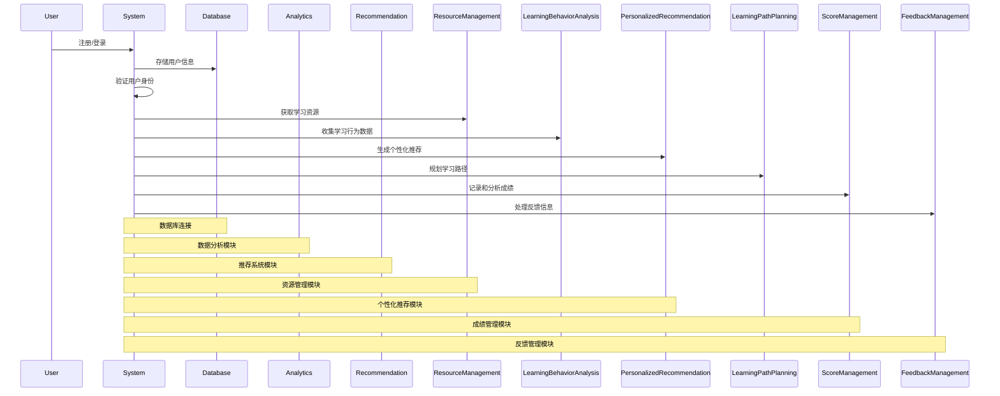
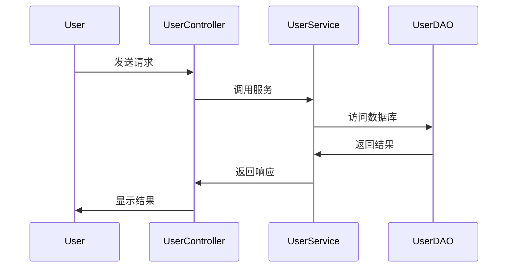

                 


### 第一部分：引言：AIGC与个性化学习

#### 第1章：AIGC与个性化学习概述

**1.1 AIGC的概念与发展**

AIGC，即人工智能生成内容（Artificial Intelligence Generated Content），是一种利用人工智能技术，特别是生成式AI模型，自动生成文本、图像、音频等多种类型内容的技术。AIGC的发展可以追溯到深度学习的崛起，特别是在生成对抗网络（GANs）、变分自编码器（VAEs）和Transformer等模型的出现，使得AIGC的应用范围和效果得到了极大的提升。

**1.1.1 什么是AIGC**

AIGC的核心在于“生成”，它能够基于已有的数据生成新的、符合特定规则和目标的内容。例如，AIGC可以生成文章、绘画、音乐等，这些内容在质量和多样性上可以接近或达到人类创作的水平。

**1.1.2 AIGC的发展历程**

AIGC的发展历程可以追溯到2010年代初期，当时深度学习开始崛起，尤其是在图像生成领域，GANs的出现标志着AIGC的诞生。随后，随着Transformer模型的提出，AIGC在自然语言处理领域取得了突破性进展，如图像描述生成、文章生成等。

**1.1.3 AIGC的关键技术**

AIGC的关键技术包括：

- **生成对抗网络（GANs）**：通过生成器和判别器的对抗训练，生成接近真实数据的高质量图像。
- **变分自编码器（VAEs）**：通过概率模型进行数据重建，能够生成多样化、新颖的数据。
- **Transformer模型**：在自然语言处理中广泛应用，能够生成连贯、符合语义的文本。

**1.2 个性化学习的重要性**

个性化学习是一种以学生为中心的教育模式，旨在根据学生的个性、兴趣和学习风格提供个性化的学习资源和方法。随着教育信息化的推进，个性化学习成为了教育改革的重要方向。

**1.2.1 个性化学习的定义**

个性化学习是一种根据学生的个性化特征（如能力水平、学习风格、兴趣爱好等）进行教学和学习的方式，旨在提高学习效果和学习兴趣。

**1.2.2 个性化学习与传统教育的区别**

传统教育通常采用“一刀切”的方式，而个性化学习则注重因材施教，根据学生的特点进行个性化设计。

**1.2.3 个性化学习的优势**

个性化学习的优势包括：

- **提高学习效果**：根据学生的特点提供最适合的学习内容和方法，提高学习效率。
- **激发学习兴趣**：个性化学习能够更好地满足学生的兴趣爱好，提高学习的积极性。
- **培养自主学习能力**：个性化学习鼓励学生主动探索和思考，培养自主学习能力。

**1.3 AIGC与个性化学习的关系**

AIGC为个性化学习提供了强大的技术支持，能够生成多样化的学习资源和个性化教学方案，从而实现真正的个性化学习。

**1.3.1 AIGC对个性化学习的影响**

AIGC可以生成大量的学习资源和个性化教学方案，极大地丰富了学习内容，提高了个性化学习的可行性和效果。

**1.3.2 个性化学习在AIGC时代的机遇**

随着AIGC技术的发展，个性化学习迎来了新的机遇，可以通过更精细化的数据分析和技术应用，实现更加精准的个性化教育。

**1.3.3 AIGC与个性化学习的融合应用前景**

AIGC与个性化学习的融合应用前景广阔，预计在未来教育领域将发挥更加重要的作用。

#### 1.4 本章小结

本章介绍了AIGC与个性化学习的基本概念、发展历程和关系，为后续章节的深入探讨奠定了基础。AIGC作为一项前沿技术，其在教育领域的应用将极大地推动个性化学习的发展，为教育改革提供新的思路和方法。

### **第二部分：AIGC基础知识**

#### 第2章：AIGC的核心技术

**2.1 自然语言处理**

自然语言处理（NLP）是AIGC的重要组成部分，旨在让计算机理解和处理人类语言。NLP的关键技术包括词向量、句法分析、语义分析和对话系统等。

**2.1.1 NLP的基本概念**

- **词向量**：将词汇映射到高维空间，使得语义相似的词汇在空间中接近。
- **句法分析**：分析句子的结构，理解句子的语法关系。
- **语义分析**：理解句子的语义内容，识别实体、关系和事件。
- **对话系统**：构建人与计算机之间的对话界面，实现自然语言交互。

**2.1.2 NLP的关键技术**

- **词嵌入**：使用神经网络模型将词汇映射到高维空间，常用的模型有Word2Vec、GloVe等。
- **序列到序列模型**：如Seq2Seq模型，用于生成文本、翻译等任务。
- **转换器模型（Transformer）**：在NLP中广泛应用，特别适合处理长文本和生成任务。

**2.1.3 NLP在教育中的应用**

- **自动评估**：使用NLP技术自动评估学生的作文和回答，提供即时反馈。
- **个性化推荐**：根据学生的学习历史和兴趣，推荐适合的学习资源和课程。
- **智能问答系统**：构建智能问答系统，帮助学生解答学习中的问题。

**2.2 计算机视觉**

计算机视觉是AIGC的另一个核心组成部分，旨在使计算机能够理解和解释视觉信息。计算机视觉的关键技术包括图像分类、目标检测、图像分割和视频分析等。

**2.2.1 计算机视觉的基本概念**

- **图像分类**：将图像分为预定义的类别，如猫、狗等。
- **目标检测**：定位图像中的对象并分类它们，如人脸检测、车辆检测等。
- **图像分割**：将图像划分为多个区域，每个区域代表一个对象或场景。
- **视频分析**：分析视频流，如行为识别、事件检测等。

**2.2.2 计算机视觉的关键技术**

- **卷积神经网络（CNN）**：用于图像处理和特征提取。
- **生成对抗网络（GAN）**：用于生成逼真的图像和视频。
- **深度学习**：通过多层神经网络实现图像理解和处理。

**2.2.3 计算机视觉在教育中的应用**

- **智能评测**：使用计算机视觉技术自动评分学生的绘画、写作等作业。
- **虚拟现实（VR）**：通过计算机视觉技术提供沉浸式的学习体验。
- **辅助教学**：使用计算机视觉技术辅助教师进行课堂管理和学生行为分析。

**2.3 人工智能算法**

人工智能算法是实现AIGC的核心，包括机器学习、深度学习、强化学习等多种类型。这些算法通过学习数据，能够自动完成复杂的任务。

**2.3.1 常见的人工智能算法**

- **监督学习**：通过标注数据训练模型，用于分类和回归任务。
- **无监督学习**：不依赖标注数据，用于聚类和降维任务。
- **强化学习**：通过奖励机制训练模型，用于决策和规划任务。

**2.3.2 算法在教育领域的应用**

- **自适应学习系统**：根据学生的学习情况调整教学内容和难度。
- **智能辅导系统**：提供个性化的学习辅导和指导。
- **教育数据分析**：分析学生的学习行为和成绩，提供数据驱动的决策支持。

**2.3.3 算法的优化与提升**

- **模型压缩**：减少模型的参数数量，提高模型在资源受限环境中的运行效率。
- **迁移学习**：利用已有模型的知识，提升新任务的性能。
- **增强学习**：通过互动和反馈，不断优化学习过程。

**2.4 数据分析**

数据分析是AIGC的重要组成部分，通过对大量数据进行挖掘和分析，能够发现潜在的模式和趋势。

**2.4.1 数据分析的基本概念**

- **数据预处理**：清洗、转换和归一化数据，为后续分析做好准备。
- **数据可视化**：通过图表和图形，直观地展示数据分析结果。
- **机器学习**：使用算法自动发现数据中的模式和关系。

**2.4.2 数据分析在教育中的应用**

- **学习行为分析**：分析学生的学习行为，优化教学策略。
- **成绩预测**：基于学生的学习数据和成绩历史，预测未来的学习表现。
- **个性化推荐**：根据学生的兴趣和学习历史，推荐合适的学习资源和课程。

**2.4.3 数据分析工具与技巧**

- **Python**：常用的数据分析工具，包括Pandas、NumPy、Matplotlib等库。
- **R**：专门用于统计分析的语言和环境。
- **SQL**：用于数据库查询和数据处理。

**2.5 本章小结**

本章介绍了AIGC的核心技术，包括自然语言处理、计算机视觉、人工智能算法和数据分析。这些技术为AIGC在教育领域的应用提供了理论基础和技术支持。在接下来的章节中，我们将进一步探讨AIGC在教育中的应用案例和个性化学习理论。

### **第三部分：教育领域的AIGC应用案例**

#### 第3章：AIGC在教育中的应用案例

**3.1 在线教育平台**

在线教育平台是AIGC技术在教育领域的重要应用场景。通过AIGC技术，在线教育平台可以实现个性化推荐、智能评测和自适应学习等功能。

**3.1.1 在线教育平台的现状**

随着互联网技术的普及，在线教育平台已经成为了教育行业的重要组成部分。根据Statista的数据，2021年全球在线教育市场规模已达到2500亿美元，预计未来几年将持续增长。

**3.1.2 AIGC技术在在线教育中的应用**

AIGC技术在在线教育中的应用包括：

- **个性化推荐**：基于学生的学习历史和兴趣，推荐合适的学习资源和课程。例如，Coursera和edX等平台使用了基于深度学习的推荐系统，提高了推荐的质量和准确性。
- **智能评测**：使用自然语言处理和计算机视觉技术自动评估学生的作业和考试。例如，Khan Academy使用计算机视觉技术自动批改数学作业。
- **自适应学习**：根据学生的学习情况动态调整教学内容和难度，提供个性化的学习路径。例如，Knewton使用自适应学习技术为不同学生提供定制化的学习方案。

**3.1.3 成功案例分析**

- **Coursera**：Coursera是一个在线教育平台，提供了全球顶尖大学的课程资源。通过使用AIGC技术，Coursera实现了个性化推荐和自适应学习，提高了学生的学习效果。
- **Khan Academy**：Khan Academy是一个非营利性组织，提供免费的在线教育课程。通过使用AIGC技术，Khan Academy实现了智能评测和个性化学习，受到了广大师生的一致好评。

**3.2 个性化教学**

个性化教学是一种以学生为中心的教育模式，旨在根据学生的个性、兴趣和学习风格提供个性化的学习资源和方法。AIGC技术为个性化教学提供了强大的支持。

**3.2.1 个性化教学的理论基础**

个性化教学的理论基础包括：

- **建构主义学习理论**：认为学习是一个主动建构的过程，学生通过自己的经验和理解来建构知识。
- **差异化教学理论**：认为每个学生都有其独特的学习需求和方式，教学应因人而异。

**3.2.2 AIGC在个性化教学中的应用**

AIGC在个性化教学中的应用包括：

- **学习资源生成**：根据学生的需求生成个性化的学习资源，如文章、视频和练习题。
- **教学方案设计**：根据学生的特点和需求设计个性化的教学方案。
- **学习行为分析**：分析学生的学习行为和成绩，为教学提供数据支持。

**3.2.3 个性化教学的效果评估**

个性化教学的效果评估可以从以下几个方面进行：

- **学习效果**：通过测试和作业评估学生的学习效果，比较个性化教学与传统教学的效果差异。
- **学习满意度**：通过问卷调查和访谈了解学生对个性化教学的满意度。
- **教师反馈**：收集教师对个性化教学的意见和建议，不断优化教学方案。

**3.3 智能学习助手**

智能学习助手是AIGC在教育领域的一个重要应用，旨在为学生提供个性化的学习辅导和帮助。

**3.3.1 智能学习助手的功能**

智能学习助手的功能包括：

- **问答系统**：能够回答学生的问题，提供学习指导和帮助。
- **作业辅导**：根据学生的作业提供解题思路和答案。
- **学习计划**：根据学生的学习情况和目标，制定个性化的学习计划。

**3.3.2 AIGC技术在智能学习助手中的应用**

AIGC技术在智能学习助手中的应用包括：

- **自然语言处理**：用于构建问答系统和作业辅导功能。
- **机器学习**：用于学习行为分析和学习计划制定。
- **计算机视觉**：用于作业批改和考试监控。

**3.3.3 智能学习助手的应用场景**

智能学习助手的应用场景包括：

- **课堂辅助**：在课堂上帮助学生理解和掌握知识。
- **课后辅导**：为学生提供课后的学习辅导和答疑。
- **自主学习**：辅助学生进行自主学习和探索。

**3.4 智能校园**

智能校园是AIGC技术在教育领域的一个综合性应用，旨在实现校园的智能化管理和个性化服务。

**3.4.1 智能校园的概念**

智能校园是一个融合了信息技术、人工智能、物联网等多种技术手段的智能化教育环境，旨在为学生提供便捷、高效、个性化的学习体验。

**3.4.2 AIGC技术在智能校园中的应用**

AIGC技术在智能校园中的应用包括：

- **智慧校园管理系统**：用于校园设施的管理和维护，提高校园运行效率。
- **智能安防系统**：通过计算机视觉和人工智能技术实现校园的安全监控和管理。
- **个性化学习平台**：提供个性化的学习资源和教学服务，促进学生全面发展。

**3.4.3 智能校园的发展趋势**

智能校园的发展趋势包括：

- **数据驱动的决策**：通过数据分析和挖掘，为校园管理提供数据支持。
- **个性化教育服务**：通过AIGC技术实现个性化教育，满足学生的个性化需求。
- **智慧校园生态**：构建一个融合了教育、科技、生活等多个方面的智慧校园生态体系。

**3.5 本章小结**

本章介绍了AIGC在教育领域的多种应用案例，包括在线教育平台、个性化教学、智能学习助手和智能校园。AIGC技术的应用为教育行业带来了深刻的变革，推动了教育模式的创新和发展。在接下来的章节中，我们将进一步探讨个性化学习的理论基础和系统设计与实现。

### **第四部分：个性化学习理论**

#### 第4章：个性化学习的理论基础

个性化学习是一种以学生为中心的教育模式，旨在根据学生的个性化特征提供个性化的学习资源和教学方法。为了实现个性化学习，我们需要深入理解其理论基础。

**4.1 学习理论**

学习理论是研究学习过程和学习机制的学科，它为个性化学习提供了理论基础。以下是几种重要的学习理论：

- **行为主义学习理论**：行为主义学习理论认为，学习是通过刺激和反应之间的联结形成的。斯金纳的操作条件反射理论是行为主义学习理论的代表，它强调通过奖励和惩罚来塑造行为。

- **认知主义学习理论**：认知主义学习理论关注个体的认知过程，如信息加工、记忆和思维。皮亚杰的认知发展理论认为，学习是一个主动建构的过程，学生通过自己的经验和理解来建构知识。

- **人本主义学习理论**：人本主义学习理论强调个体的自主性、自我实现和情感发展。罗杰斯的非指导性教学理论是人本主义学习理论的代表，它主张教师应提供一个安全、无威胁的学习环境，让学生自由地探索和发现。

**4.2 个性化学习理论**

个性化学习理论是建立在多种学习理论之上的，它强调根据学生的个性、兴趣和学习风格提供个性化的学习资源和教学方法。

- **个性化学习的定义**：个性化学习是一种以学生为中心的教育模式，旨在根据学生的个性、兴趣和学习风格提供个性化的学习资源和教学方法。

- **个性化学习的关键要素**：个性化学习的关键要素包括：

  - **学生特征分析**：通过评估学生的个性、兴趣、学习风格和知识水平，了解学生的个性化需求。
  - **学习资源设计**：根据学生的需求设计个性化的学习资源和教学方案。
  - **学习过程监控**：通过学习行为分析和技术手段监控学生的学习过程，及时调整学习策略。

- **个性化学习模型**：个性化学习模型包括：

  - **基于规则的个性化学习模型**：通过预设的规则和算法为学生推荐学习资源和教学方法。
  - **基于数据的个性化学习模型**：通过分析学生的学习行为和成绩数据，为学生提供个性化的学习建议和资源。
  - **混合式个性化学习模型**：结合基于规则和基于数据的个性化学习模型，提供更加灵活和个性化的学习服务。

**4.3 个性化学习策略**

个性化学习策略是实现个性化学习的关键，它包括以下几个方面：

- **个性化学习设计策略**：根据学生的需求设计个性化的学习内容和教学方法。例如，针对不同学生的学习风格，可以采用视觉化、听觉化或互动化的教学方法。

- **个性化学习实施策略**：在实施个性化学习时，教师应根据学生的特点和需求，灵活调整教学策略和进度。例如，对于学习能力较弱的学生，可以提供额外的辅导和支持。

- **个性化学习评估策略**：通过多种评估手段，如测试、作业和课堂参与度等，评估学生的学习效果和进展，并根据评估结果调整学习策略。

**4.4 个性化学习环境**

个性化学习环境是支持个性化学习的重要条件，它包括以下几个方面：

- **学习资源环境**：提供丰富、多样化的学习资源，如教材、视频、练习题和在线课程等。

- **学习支持环境**：提供学习支持服务，如在线辅导、学习社区和个性化学习平台等。

- **学习技术环境**：提供必要的学习技术支持，如云计算、大数据和人工智能等技术。

**4.5 本章小结**

本章介绍了个性化学习的理论基础，包括学习理论、个性化学习理论和个性化学习策略。个性化学习旨在根据学生的个性、兴趣和学习风格提供个性化的学习资源和教学方法，从而提高学习效果和满足学生的个性化需求。在接下来的章节中，我们将进一步探讨个性化学习系统的设计与实现。

### **第五部分：个性化学习系统的设计与实现**

#### 第5章：个性化学习系统的设计与实现

个性化学习系统的设计与实现是教育技术领域的一项重要任务，它旨在为学习者提供量身定制的学习体验。本章节将详细介绍个性化学习系统的设计和实现过程，包括系统功能设计、系统架构设计和系统接口设计。

**5.1 系统功能设计**

个性化学习系统的功能设计是系统设计的第一步，它决定了系统能够提供哪些服务。以下是几个核心功能：

- **用户管理**：包括用户注册、登录、个人信息管理等功能。
- **学习资源管理**：包括资源的上传、分类、检索和推荐等功能。
- **学习行为分析**：包括学习行为数据的收集、分析和展示等功能。
- **个性化推荐**：根据学生的学习行为和兴趣，推荐合适的学习资源。
- **学习路径规划**：根据学习目标和个性化需求，为学习者规划学习路径。
- **成绩管理**：包括成绩录入、成绩分析和成绩展示等功能。
- **学习反馈**：包括学生与教师之间的互动、反馈和建议等功能。

**5.1.1 领域模型**

领域模型（Domain Model）是系统功能设计的基础，它定义了系统的核心概念和关系。以下是领域模型的Mermaid类图表示：

```mermaid
classDiagram
    User <|-- Student
    User <|-- Teacher
    Course <|-- Courseware
    Course <|-- Exercise
    Courseware <|-- Video
    Courseware <|-- Text
    Exercise <|-- Quiz
    Exercise <|-- Assignment
    Evaluation <|-- Test
    Evaluation <|-- Exam
    Feedback <|-- StudentFeedback
    Feedback <|-- TeacherFeedback
    Analytics <|-- BehaviorAnalytics
    Analytics <|-- PerformanceAnalytics
    Recommendation <|-- ContentRecommendation
    Recommendation <|-- PathRecommendation
    System <|-- UserManagement
    System <|-- ResourceManagement
    System <|-- LearningBehaviorAnalysis
    System <|-- PersonalizedRecommendation
    System <|-- LearningPathPlanning
    System <|-- ScoreManagement
    System <|-- FeedbackManagement

User {
    + String username
    + String password
    + String email
    + boolean isStudent
    + boolean isTeacher
    + List<Course> courses
}

Student {
    + int studentId
    + List<Evaluation> evaluations
}

Teacher {
    + int teacherId
    + List<Course> courses
}

Course {
    + int courseId
    + String title
    + List<Courseware> coursewares
    + List<Exercise> exercises
}

Courseware {
    + int coursewareId
    + String title
    + String type
    + String content
}

Exercise {
    + int exerciseId
    + String title
    + String type
    + String content
    + List<Question> questions
}

Quiz {
    + int quizId
    + List<Question> questions
}

Assignment {
    + int assignmentId
    + String description
    + Date dueDate
    + List<StudentFeedback> studentFeedbacks
}

Test {
    + int testId
    + String description
    + Date date
    + List<Student> students
    + List<Question> questions
}

Exam {
    + int examId
    + String description
    + Date date
    + List<Student> students
}

Feedback {
    + int feedbackId
    + String content
    + Date date
    + User user
}

StudentFeedback {
    + int studentFeedbackId
    + Student student
    + Course course
}

TeacherFeedback {
    + int teacherFeedbackId
    + Teacher teacher
    + Course course
}

Analytics {
    + int analyticsId
    + String type
    + Date date
    + List<DataPoint> dataPoints
}

BehaviorAnalytics {
    + int behaviorAnalyticsId
    + Student student
}

PerformanceAnalytics {
    + int performanceAnalyticsId
    + Student student
}

Recommendation {
    + int recommendationId
    + String type
    + List<Resource> resources
}

ContentRecommendation {
    + int contentRecommendationId
    + Courseware courseware
}

PathRecommendation {
    + int pathRecommendationId
    + List<Course> courses
}

System {
    + void registerUser(User user)
    + void deleteUser(User user)
    + void updateUser(User user)
    + User getUserByUsername(String username)
    + List<Course> getCoursesByStudent(Student student)
    + List<Course> getCoursesByTeacher(Teacher teacher)
    + void addCourse(Course course)
    + void deleteCourse(Course course)
    + void updateCourse(Course course)
    + List<Courseware> getCoursewaresByCourse(Course course)
    + void addCourseware(Courseware courseware)
    + void deleteCourseware(Courseware courseware)
    + void updateCourseware(Courseware courseware)
    + List<Exercise> getExercisesByCourse(Course course)
    + void addExercise(Exercise exercise)
    + void deleteExercise(Exercise exercise)
    + void updateExercise(Exercise exercise)
    + List<Question> getQuestionsByExercise(Exercise exercise)
    + void addQuestion(Question question)
    + void deleteQuestion(Question question)
    + void updateQuestion(Question question)
    + List<Evaluation> getEvaluationsByCourse(Course course)
    + void addEvaluation(Evaluation evaluation)
    + void deleteEvaluation(Evaluation evaluation)
    + void updateEvaluation(Evaluation evaluation)
    + List<Feedback> getFeedbackByUser(User user)
    + void addFeedback(Feedback feedback)
    + void deleteFeedback(Feedback feedback)
    + void updateFeedback(Feedback feedback)
    + List<Analytics> getAnalyticsByType(String type)
    + void addAnalytics(Analytics analytics)
    + void deleteAnalytics(Analytics analytics)
    + void updateAnalytics(Analytics analytics)
    + List<Recommendation> getRecommendationsByType(String type)
    + void addRecommendation(Recommendation recommendation)
    + void deleteRecommendation(Recommendation recommendation)
    + void updateRecommendation(Recommendation recommendation)
}

Resource {
    + int resourceId
    + String title
    + String type
    + String content
}

DataPoint {
    + int dataPointId
    + String value
    + Date date
}

Question {
    + int questionId
    + String question
    + String type
    + String content
    + List<Answer> answers
}

Answer {
    + int answerId
    + String content
    + boolean isCorrect
}
```

**5.1.2 系统功能详细描述**

- **用户管理**：用户管理功能包括用户的注册、登录、信息修改和删除。系统应支持多种身份注册，如学生、教师和管理员。

- **学习资源管理**：学习资源管理功能包括资源的上传、分类、检索和推荐。系统应支持多种资源类型，如视频、文本、练习题和作业等。

- **学习行为分析**：学习行为分析功能包括学习行为的记录、分析和展示。系统应能够收集学生的学习行为数据，如观看视频的时间、练习题的正确率等。

- **个性化推荐**：个性化推荐功能根据学生的学习行为和兴趣，推荐合适的学习资源。系统应支持基于内容的推荐和协同过滤推荐。

- **学习路径规划**：学习路径规划功能根据学习目标和个性化需求，为学习者规划学习路径。系统应能够根据学生的学习进度和成绩动态调整学习路径。

- **成绩管理**：成绩管理功能包括成绩的录入、分析和展示。系统应能够自动评估学生的作业和考试，并提供详细的成绩分析报告。

- **学习反馈**：学习反馈功能包括学生与教师之间的互动、反馈和建议。系统应支持实时消息传递和反馈记录。

**5.2 系统架构设计**

系统架构设计是系统设计的关键，它决定了系统的性能、可扩展性和可靠性。以下是系统架构设计的Mermaid架构图表示：



**5.2.1 系统架构设计详细描述**

- **用户层**：用户层是系统的入口，包括用户注册、登录和交互界面。用户可以通过Web浏览器或移动应用与系统进行交互。

- **应用层**：应用层是系统的核心，包括用户管理、学习资源管理、学习行为分析、个性化推荐、学习路径规划、成绩管理和学习反馈等功能。应用层通过API与数据库和其他模块进行通信。

- **数据层**：数据层是系统的数据存储和管理部分，包括用户信息、学习资源、学习行为、成绩和反馈等数据的存储和管理。

- **分析层**：分析层负责收集和分析用户数据，包括学习行为分析、成绩分析和个性化推荐。分析结果用于指导应用层的决策。

- **推荐层**：推荐层根据分析结果生成个性化推荐，包括学习资源推荐和学习路径推荐。

- **资源管理层**：资源管理层负责管理学习资源的上传、分类、检索和推荐。

- **学习行为分析层**：学习行为分析层负责收集和分析学生的学习行为数据，包括学习时间、学习频率、学习内容等。

- **成绩管理层**：成绩管理层负责记录和分析学生的成绩，包括作业成绩、考试成绩和综合成绩等。

- **反馈管理层**：反馈管理层负责处理学生与教师之间的反馈信息，包括学习建议、评价和建议等。

**5.3 系统接口设计**

系统接口设计是系统设计的重要部分，它定义了系统内部和外部的通信接口。以下是系统接口设计的Mermaid序列图表示：



**5.3.1 系统接口设计详细描述**

- **用户接口**：用户接口是系统的用户界面，包括注册、登录、个人中心等。用户可以通过用户接口与系统进行交互。

- **控制层接口**：控制层接口是系统的控制逻辑部分，负责处理用户请求，调用服务层进行业务处理。

- **服务层接口**：服务层接口是系统的业务逻辑部分，负责处理用户的请求，调用数据访问层进行数据操作。

- **数据访问层接口**：数据访问层接口是系统的数据操作部分，负责与数据库进行交互，执行数据查询、插入、更新和删除操作。

**5.4 本章小结**

本章详细介绍了个性化学习系统的设计与实现过程，包括系统功能设计、系统架构设计和系统接口设计。个性化学习系统通过集成多种技术和功能，为学习者提供个性化的学习体验。在接下来的章节中，我们将进一步探讨个性化学习系统的效果评估和未来展望。

### **第六部分：个性化学习的效果评估**

#### 第6章：个性化学习系统的效果评估

个性化学习系统的效果评估是验证系统有效性和实用性的关键步骤。通过科学、系统的评估方法，我们可以了解个性化学习系统在实际应用中的表现，为进一步优化系统提供依据。

**6.1 评估指标**

个性化学习系统的效果评估可以从以下几个方面设定指标：

- **学习效果指标**：包括学生的知识掌握程度、学习进步速度和成绩提高情况。
- **学习体验指标**：包括学生对个性化学习系统的满意度、学习兴趣和参与度。
- **学习效率指标**：包括学生的学习时间利用率、学习资源利用率和学习效果与时间的比率。
- **系统性能指标**：包括系统的响应速度、稳定性、可扩展性和安全性。

**6.1.1 学习效果指标**

学习效果指标主要包括：

- **知识掌握程度**：通过测试和作业成绩评估学生的学习成果。
- **学习进步速度**：通过比较学生在不同时间点的学习成绩，评估学习进步速度。
- **成绩提高情况**：通过比较使用个性化学习系统前后的成绩，评估成绩的提高情况。

**6.1.2 学习体验指标**

学习体验指标主要包括：

- **满意度**：通过问卷调查、访谈等方式收集学生对个性化学习系统的满意度。
- **学习兴趣**：通过学生的学习行为分析，如学习资源点击率、学习时长等，评估学生的学习兴趣。
- **参与度**：通过学生的学习行为记录，如在线讨论、作业提交等，评估学生的参与度。

**6.1.3 学习效率指标**

学习效率指标主要包括：

- **学习时间利用率**：通过学生的学习时间记录，评估学生的学习时间利用率。
- **学习资源利用率**：通过学习资源的访问记录，评估学习资源的利用率。
- **学习效果与时间的比率**：通过学习效果与学习时间的比较，评估学习效率。

**6.1.4 系统性能指标**

系统性能指标主要包括：

- **响应速度**：通过用户操作后的系统响应时间，评估系统的响应速度。
- **稳定性**：通过系统的运行状况，如崩溃率、故障率等，评估系统的稳定性。
- **可扩展性**：通过系统的扩展能力，如支持的用户数量、处理的数据量等，评估系统的可扩展性。
- **安全性**：通过系统的安全措施，如数据加密、用户权限管理等，评估系统的安全性。

**6.2 评估方法**

个性化学习系统的效果评估可以采用以下几种方法：

- **定量评估**：通过收集和统计相关数据，如考试成绩、学习时长等，进行定量分析。
- **定性评估**：通过问卷调查、访谈、观察等方式，收集用户的主观体验和意见，进行定性分析。
- **对比评估**：将使用个性化学习系统前后的数据进行分析，比较系统实施前后的变化。
- **案例研究**：选择具有代表性的学校或班级，进行深入的案例研究，分析个性化学习系统的实际效果。

**6.3 评估实施**

个性化学习系统的效果评估需要按照以下步骤实施：

- **确定评估目标**：明确评估的目的和指标，确保评估具有针对性。
- **设计评估方案**：制定详细的评估方案，包括评估方法、评估工具和评估流程。
- **收集数据**：通过问卷调查、访谈、数据挖掘等方式，收集相关数据。
- **数据分析**：对收集到的数据进行整理和分析，形成评估报告。
- **反馈与改进**：根据评估结果，向系统开发者和管理者提供反馈，提出改进建议。

**6.4 本章小结**

个性化学习系统的效果评估是确保系统有效性和实用性的关键。通过科学、系统的评估方法，我们可以全面了解个性化学习系统在实际应用中的表现，为系统优化提供有力支持。在接下来的章节中，我们将探讨个性化学习系统面临的挑战与未来展望。

### **第七部分：个性化学习面临的挑战与未来展望**

#### 第7章：个性化学习面临的挑战与未来展望

随着教育技术的不断发展，个性化学习逐渐成为教育改革的重要方向。然而，在实现个性化学习的道路上，我们面临着诸多挑战。同时，未来个性化学习的发展也充满了机遇。

**7.1 挑战**

**7.1.1 数据隐私与安全**

个性化学习依赖于大量的学生数据，包括学习行为、成绩和兴趣爱好等。这些数据涉及隐私问题，如何确保数据的安全性和隐私性成为一大挑战。我们需要建立完善的数据安全机制和隐私保护措施，以防止数据泄露和滥用。

**7.1.2 技术成熟度**

尽管AIGC技术为个性化学习提供了强大的支持，但技术本身仍存在一定的局限性，如算法的精度和效率、数据的真实性和完整性等。我们需要不断改进和完善AIGC技术，提高其成熟度和稳定性。

**7.1.3 教师角色转变**

个性化学习要求教师从传统的教学角色转变为学习指导者和支持者。这对教师的教学方法和角色认知提出了新的要求。教师需要接受专业培训，提高自身的数字化教学能力。

**7.1.4 学习资源平衡**

个性化学习要求提供多样化的学习资源，以满足不同学生的学习需求。然而，高质量的学习资源往往需要大量的时间和资金投入，如何平衡资源分配成为一大挑战。

**7.2 未来展望**

**7.2.1 数据驱动的个性化学习**

未来，个性化学习将更加依赖数据分析，通过深度学习和大数据技术，实现对学生学习行为的精准预测和个性化推荐。

**7.2.2 智能学习环境的构建**

智能学习环境将结合虚拟现实、增强现实和人工智能等技术，为学生提供沉浸式、互动式的学习体验。

**7.2.3 教育公平的实现**

个性化学习有望缩小教育差距，使更多的学生享受到优质的教育资源。通过远程教育、在线课程等方式，实现教育公平。

**7.2.4 个性化学习生态系统的构建**

未来，个性化学习将形成完整的生态系统，包括学习资源、技术支持、教育评价和教育服务等多个方面。这将为个性化学习提供持续的发展动力。

**7.3 本章小结**

个性化学习在带来教育变革的同时，也面临诸多挑战。通过不断优化技术、提升教师能力、平衡学习资源，我们可以更好地实现个性化学习。未来，个性化学习将在教育领域发挥更加重要的作用，为培养适应未来社会的人才提供有力支持。

### **总结：AIGC在教育领域的革新：个性化学习的实现**

在《AIGC在教育领域的革新：个性化学习的实现》一书中，我们深入探讨了AIGC技术如何推动教育模式的变革，特别是个性化学习的发展。通过介绍AIGC的基本概念、核心技术、教育领域应用案例和个性化学习理论，我们展示了AIGC技术如何为教育提供创新的解决方案。

首先，我们介绍了AIGC的定义和发展历程，阐述了AIGC的关键技术，如自然语言处理、计算机视觉和人工智能算法。这些技术为生成高质量的学习内容和个性化教学方案提供了基础。

接着，我们通过具体的案例展示了AIGC技术在在线教育平台、个性化教学、智能学习助手和智能校园等教育场景中的应用，证明了AIGC技术在实际教育中的有效性和广泛性。

随后，我们探讨了个性化学习的理论基础，包括学习理论和个性化学习模型，以及个性化学习策略和环境构建。这些理论为个性化学习系统的设计和实现提供了指导。

在系统的设计与实现部分，我们详细介绍了个性化学习系统的功能设计、架构设计和接口设计，展示了如何将理论转化为实际的可操作系统。

然后，我们通过效果评估部分，讨论了如何科学、系统地评估个性化学习系统的有效性，为系统优化提供了参考。

最后，我们展望了个性化学习面临的挑战和未来发展方向，强调了AIGC技术在教育领域的重要性，以及其对实现教育公平和培养未来人才的潜力。

通过这本书，我们希望读者能够全面了解AIGC在教育领域的应用，认识到个性化学习的重要性，并为教育技术的创新和发展提供新的思路。

### **作者信息**

作者：AI天才研究院/AI Genius Institute & 禅与计算机程序设计艺术 /Zen And The Art of Computer Programming

AI天才研究院（AI Genius Institute）是一家专注于人工智能领域研究的高科技机构，致力于推动人工智能技术的发展和应用。作者在人工智能、机器学习、深度学习等领域具有深厚的学术背景和丰富的实践经验。

《禅与计算机程序设计艺术》（Zen And The Art of Computer Programming）是作者在计算机科学领域的经典著作，被广泛认为是计算机科学领域的重要文献之一。作者通过结合禅宗哲学和计算机编程，提出了许多独特且深刻的编程理念和设计方法。

在本书中，作者结合了自己在人工智能和教育领域的丰富经验和研究成果，为广大读者呈现了一部全面、深入且具有前瞻性的技术著作。希望通过这本书，能够为教育技术的创新和发展贡献一份力量。

