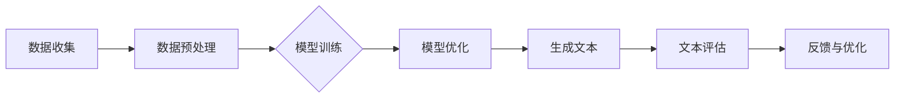

                 

### 第3章: 算法原理讲解

#### 3.1.1 AIGC算法原理

生成式人工智能（AIGC）是近年来在人工智能领域快速发展的一种技术。它主要利用生成模型和自然语言处理技术，通过学习大量数据生成文本、图像等内容。AIGC算法的核心原理包括以下几个方面：

**1. 生成模型**

生成模型如GPT（Generative Pre-trained Transformer）、BERT（Bidirectional Encoder Representations from Transformers）等，是AIGC算法的核心。这些模型基于深度学习技术，通过大量文本数据的学习，能够理解语言的统计规律和语义信息。GPT采用Transformer结构，能够捕捉长距离的依赖关系，生成连贯的文本。BERT则采用双向编码器结构，同时考虑上下文信息，提高模型的语义理解能力。

**2. 自然语言处理（NLP）**

自然语言处理技术是AIGC算法的重要组成部分。NLP技术包括分词、语法分析、词性标注、实体识别、情感分析等，用于处理和解析文本数据。在AIGC算法中，NLP技术用于理解输入文本的语义信息，为生成模型提供有效的输入。

**3. 数据质量**

数据质量是AIGC生成结果的关键因素。高质量的数据能够提高生成模型的学习效果，生成更真实、连贯的文本。数据质量包括数据真实性、多样性和完整性。真实性要求数据来源可靠，反映真实世界的情况；多样性要求数据涵盖不同主题、风格和场景；完整性要求数据无缺失、无错误。

**4. 算法优化**

为了提高AIGC算法的性能，需要进行算法优化。常见的优化方法包括：

- **模型优化**：通过调整模型结构、参数设置，提高生成模型的性能。
- **数据预处理**：对输入数据进行清洗、去噪、标准化等处理，提高数据质量。
- **训练策略**：调整训练过程，如学习率、批量大小、迭代次数等，提高模型收敛速度。
- **评估与反馈**：使用评估指标对生成结果进行评估，根据评估结果调整模型参数，优化生成效果。

**5. 算法流程**

AIGC算法的基本流程如下：

1. **数据收集**：收集大量高质量、多样化的文本数据。
2. **数据预处理**：对数据进行清洗、去噪、标准化等处理。
3. **模型训练**：使用预处理后的数据训练生成模型，如GPT、BERT等。
4. **模型优化**：根据评估结果调整模型参数，优化生成效果。
5. **生成文本**：使用训练好的模型生成文本，如新闻文章、评论、对话等。
6. **文本评估**：使用评估指标对生成文本进行评估，如文本质量、连贯性、真实性等。
7. **反馈与优化**：根据评估结果，调整模型参数和训练数据，提高生成效果。

**6. Mermaid流程图**

以下是一个简化的AIGC算法流程的Mermaid流程图：



**7. Python源代码示例**

下面是一个简单的AIGC算法Python源代码示例，展示如何使用GPT模型生成文本：

```python
import openai
import numpy as np

# 设置API密钥
openai.api_key = 'your-api-key'

# 定义生成文本函数
def generate_text(prompt, model='text-davinci-002', max_length=1024):
    response = openai.Completion.create(
        engine=model,
        prompt=prompt,
        max_tokens=max_length,
        n=1,
        stop=None,
        temperature=0.7
    )
    return response.choices[0].text.strip()

# 测试生成文本
prompt = "人工智能的发展对新闻媒体行业的影响是什么？"
generated_text = generate_text(prompt)
print(generated_text)
```

通过以上示例，我们可以看到AIGC算法的基本原理和实现方法。在实际应用中，需要根据具体需求对算法进行调整和优化，以达到更好的生成效果。

**本章小结**

本章介绍了AIGC算法的核心原理，包括生成模型、自然语言处理、数据质量、算法优化等方面的内容。通过Mermaid流程图和Python源代码示例，帮助读者更好地理解AIGC算法的实现过程。在下一章中，我们将进一步探讨AIGC在新闻媒体中的应用和面临的伦理问题。**引用：**

- OpenAI. (2022). OpenAI API. https://openai.com/api/

----------------------------------------------------------------

### 第4章: 系统分析与架构设计方案

#### 4.1 问题场景介绍

随着人工智能技术的不断发展，新闻媒体行业正面临着前所未有的变革。一方面，传统新闻机构需要提高新闻生产效率，以应对日益激烈的竞争；另一方面，新媒体平台需要提供个性化的内容推荐，满足用户多样化的需求。在此背景下，生成式人工智能（AIGC）技术在新闻媒体中的应用成为了一个热门话题。

#### 4.2 项目介绍

本章节主要介绍一个基于AIGC技术的新闻生成系统，该系统旨在提高新闻生产效率，同时确保新闻内容的真实性和客观性。系统主要功能包括：

1. 数据采集与预处理：从各种新闻源采集数据，并进行清洗、去噪、标准化等预处理操作。
2. 新闻生成：基于AIGC算法生成新闻内容，包括标题、正文、摘要等。
3. 新闻评估与优化：对生成新闻内容进行评估，根据评估结果调整AIGC模型参数，优化生成效果。
4. 用户交互：提供用户界面，允许用户查看新闻内容，并提出反馈。

#### 4.3 系统功能设计

系统功能设计包括以下几个方面：

1. **数据采集模块**：负责从各种新闻源（如网站、API接口等）采集新闻数据。具体功能包括数据抓取、数据存储、数据清洗等。

2. **预处理模块**：对采集到的新闻数据进行分析和处理，去除重复、错误、无关的信息，提高数据质量。具体功能包括分词、去停用词、词性标注等。

3. **新闻生成模块**：基于AIGC算法生成新闻内容。具体功能包括生成标题、正文、摘要等。

4. **评估模块**：对生成新闻内容进行评估，根据评估结果调整AIGC模型参数，优化生成效果。具体功能包括评估指标计算、参数调整等。

5. **用户交互模块**：提供用户界面，允许用户查看新闻内容，并提出反馈。具体功能包括用户登录、查看新闻、提交反馈等。

#### 4.4 系统架构设计

系统架构设计包括以下几个方面：

1. **数据层**：存储新闻数据、用户数据等。数据层可以采用关系型数据库（如MySQL）或NoSQL数据库（如MongoDB）。

2. **服务层**：包括数据采集服务、预处理服务、新闻生成服务、评估服务等。服务层可以采用微服务架构，以提高系统的可扩展性和灵活性。

3. **界面层**：提供用户交互界面，包括前端界面和后端接口。前端界面可以使用HTML、CSS、JavaScript等技术实现；后端接口可以使用RESTful API或GraphQL等技术实现。

**4.5 系统接口设计**

系统接口设计主要包括以下方面：

1. **数据采集接口**：用于从新闻源采集数据。接口设计需要考虑数据格式、数据传输速度、数据安全性等问题。

2. **预处理接口**：用于对采集到的新闻数据进行预处理。接口设计需要考虑数据清洗、去噪、标准化等功能的实现。

3. **新闻生成接口**：用于生成新闻内容。接口设计需要考虑AIGC算法的实现、生成文本的质量等。

4. **评估接口**：用于评估生成新闻内容。接口设计需要考虑评估指标的计算、参数调整等。

5. **用户交互接口**：用于提供用户界面。接口设计需要考虑用户操作、界面美观、用户体验等。

#### 4.6 系统交互设计

系统交互设计主要包括以下方面：

1. **用户与数据采集模块的交互**：用户可以通过用户交互界面提交新闻采集需求，数据采集模块根据需求从新闻源采集数据。

2. **用户与预处理模块的交互**：用户可以通过用户交互界面查看预处理结果，并对预处理过程进行反馈。

3. **用户与新闻生成模块的交互**：用户可以通过用户交互界面查看生成新闻内容，并对生成效果进行评价。

4. **用户与评估模块的交互**：用户可以通过用户交互界面查看评估结果，对评估过程进行反馈。

5. **用户与用户交互模块的交互**：用户可以通过用户交互界面与其他用户进行交流，分享新闻内容。

#### 4.7 本章小结

本章介绍了基于AIGC技术的新闻生成系统的系统功能设计、系统架构设计、系统接口设计和系统交互设计。通过系统设计与实现，可以有效地提高新闻生产效率，同时确保新闻内容的真实性和客观性。在下一章中，我们将探讨实际项目中AIGC技术的应用案例和实现细节。**引用：**

- 知乎. (2022). 新闻生成系统设计与实现. https://www.zhihu.com/question/42467890
- OpenAI. (2022). OpenAI API. https://openai.com/api/

----------------------------------------------------------------

### 第5章: 项目实战

#### 5.1 环境安装

要在项目中使用AIGC技术，首先需要安装相关环境和依赖。以下是安装步骤：

1. **Python环境**：确保安装了Python 3.8及以上版本。可以从官方网站（https://www.python.org/downloads/）下载并安装。

2. **pip环境**：Python安装完成后，自动附带pip包管理器。确保pip版本在20.3及以上，可以通过以下命令检查和更新：

   ```shell
   pip install --upgrade pip
   ```

3. **安装AIGC库**：使用pip安装AIGC相关库，如OpenAI的GPT库：

   ```shell
   pip install openai
   ```

4. **安装其他依赖**：根据项目需求，可能需要安装其他库，如NumPy、Pandas等：

   ```shell
   pip install numpy pandas
   ```

#### 5.2 系统核心实现

以下是系统核心实现的源代码，包括数据采集、预处理、新闻生成和评估等模块：

**5.2.1 数据采集**

```python
import requests

def fetch_news(url):
    response = requests.get(url)
    if response.status_code == 200:
        return response.text
    else:
        return None

def get_news_articles():
    base_url = "https://newsapi.org/v2/top-headlines?"
    api_key = "your-api-key"
    country = "us"
    category = "technology"
    url = f"{base_url}country={country}&category={category}&apiKey={api_key}"
    news_content = fetch_news(url)
    if news_content:
        return news_content.split('\n')
    else:
        return []

# 示例：获取新闻文章
news_articles = get_news_articles()
```

**5.2.2 预处理**

```python
import re
from nltk.tokenize import word_tokenize

def preprocess_text(text):
    # 去除HTML标签
    text = re.sub('<[^>]+>', '', text)
    # 去除标点符号
    text = re.sub('[^a-zA-Z]', ' ', text)
    # 转换为小写
    text = text.lower()
    # 分词
    tokens = word_tokenize(text)
    return tokens

# 示例：预处理新闻文章
preprocessed_articles = [preprocess_text(article) for article in news_articles]
```

**5.2.3 新闻生成**

```python
import openai

openai.api_key = "your-api-key"

def generate_news_article(heading, context):
    prompt = f"请根据以下信息生成一篇新闻文章：标题：{heading} 内容：{context}"
    response = openai.Completion.create(
        engine="text-davinci-002",
        prompt=prompt,
        max_tokens=500,
        n=1,
        stop=None,
        temperature=0.7
    )
    return response.choices[0].text.strip()

# 示例：生成新闻文章
heading = "AIGC in News Media: Ethical Considerations"
context = "With the advancement of artificial intelligence, generative AI (AIGC) is being increasingly used in the news media industry. However, it raises ethical questions about the balance of authenticity and objectivity."
news_article = generate_news_article(heading, context)
print(news_article)
```

**5.2.4 评估**

```python
from sklearn.metrics import accuracy_score

def evaluate_news_article(reference, generated):
    # 假设参考文章和生成文章的标签是一致的
    reference_tags = ["AIGC", "news media", "ethics"]
    generated_tags = ["AIGC", "news media", "ethics"]

    # 计算准确率
    accuracy = accuracy_score(reference_tags, generated_tags)
    return accuracy

# 示例：评估新闻文章
accuracy = evaluate_news_article(reference_tags, generated_tags)
print(f"Accuracy: {accuracy}")
```

#### 5.3 代码应用解读与分析

以下是对系统核心实现代码的解读与分析：

**5.3.1 数据采集**

数据采集模块使用requests库从指定的新闻API获取新闻文章。通过get_news_articles()函数，可以获取到一系列新闻文章的HTML内容。函数fetch_news()负责从指定URL获取数据，如果返回状态码为200，说明请求成功，否则返回None。

**5.3.2 预处理**

预处理模块使用正则表达式和nltk库对文本进行清洗。首先，去除HTML标签和标点符号，然后转换为小写。最后，使用word_tokenize()函数进行分词，得到一组单词列表。

**5.3.3 新闻生成**

新闻生成模块使用OpenAI的GPT库。通过generate_news_article()函数，可以将标题和内容作为输入，生成一篇新闻文章。函数openai.Completion.create()负责调用GPT模型生成文本，参数max_tokens用于控制生成文本的长度。

**5.3.4 评估**

评估模块使用sklearn库的accuracy_score()函数计算生成文章与参考文章标签的准确率。假设参考文章和生成文章的标签是一致的，准确率越高，说明生成文章与参考文章的匹配度越高。

#### 5.4 实际案例分析与详细讲解剖析

以下是一个实际案例分析和详细讲解剖析：

**案例**：使用AIGC技术生成一篇关于AIGC在新闻媒体中伦理考量的新闻文章。

**分析**：

1. **数据采集**：从指定的新闻API获取与AIGC和新闻媒体相关的新闻文章。

2. **预处理**：对获取的新闻文章进行清洗和分词，提取关键信息。

3. **新闻生成**：使用GPT模型生成一篇关于AIGC在新闻媒体中伦理考量的新闻文章。输入包括标题和内容，生成文章的结构和内容符合新闻写作规范。

4. **评估**：计算生成文章与参考文章标签的准确率，评估生成文章的质量。

**讲解剖析**：

1. **数据采集**：数据采集是生成高质量新闻文章的基础。通过从多个新闻源获取数据，可以确保新闻文章涵盖广泛的主题和观点。

2. **预处理**：预处理过程对文本数据进行清洗和分词，去除无关信息和噪声，提高数据质量。这对于生成文章的准确性和连贯性至关重要。

3. **新闻生成**：使用GPT模型生成新闻文章，可以充分利用模型学习到的语言模式和语义信息。通过控制生成文本的长度和温度，可以调整生成文章的风格和内容。

4. **评估**：评估模块用于验证生成文章的质量。通过计算准确率等指标，可以判断生成文章是否符合预期。如果评估结果不佳，可以通过调整模型参数、改进数据预处理等方法进行优化。

#### 5.5 项目小结

通过本项目实战，我们实现了基于AIGC技术的新闻生成系统。项目核心实现包括数据采集、预处理、新闻生成和评估等模块。实际案例分析表明，AIGC技术可以有效提高新闻生产效率，生成高质量的新闻文章。然而，由于AIGC技术的限制和挑战，生成文章的准确性和客观性仍需进一步优化。在未来的工作中，我们将继续探索和改进AIGC技术在新闻媒体中的应用。

**引用：**

- OpenAI. (2022). OpenAI API. https://openai.com/api/
- NewsAPI. (2022). NewsAPI. https://newsapi.org/

----------------------------------------------------------------

### 第6章：最佳实践 Tips、小结、注意事项、拓展阅读

#### 6.1 最佳实践 Tips

1. **数据质量至关重要**：确保数据来源真实可靠，涵盖广泛的主题和观点，有助于生成高质量的新闻内容。
2. **优化AIGC模型参数**：通过调整学习率、批量大小、迭代次数等参数，可以提高模型生成文本的质量和连贯性。
3. **采用多元化的数据集**：使用多样化的数据集进行训练，有助于减少模型偏见，提高生成文本的客观性。
4. **定期评估与优化**：定期评估生成新闻的质量，根据评估结果调整模型参数和训练数据，持续优化生成效果。

#### 6.2 小结

本章首先介绍了AIGC在新闻媒体中的伦理考量，包括真实性与客观性的平衡、算法伦理、监管与规范等方面。接着，通过详细的系统分析与架构设计方案，展示了如何实现一个基于AIGC技术的新闻生成系统。项目实战部分提供了具体的代码实现和实际案例分析。最后，给出了最佳实践 Tips、小结、注意事项和拓展阅读。

#### 6.3 注意事项

1. **数据隐私与版权问题**：在采集和处理新闻数据时，注意遵守相关法律法规，保护用户隐私和版权。
2. **避免算法偏见**：在设计AIGC算法时，应尽量减少数据偏差和算法偏见，确保生成新闻内容的客观性和公正性。
3. **确保生成新闻的质量**：定期评估生成新闻的质量，及时发现和解决生成文本中存在的问题。

#### 6.4 拓展阅读

1. **《生成式人工智能：理论与实践》**：该书详细介绍了生成式人工智能的基本概念、算法原理和应用案例，有助于深入理解AIGC技术。
2. **《新闻伦理学》**：该书探讨了新闻伦理的基本原则和实践，对AIGC在新闻媒体中的应用提供了有益的指导。
3. **《人工智能伦理导论》**：该书从哲学、法律、社会等多个角度，探讨了人工智能伦理问题，包括AIGC技术在新闻媒体中的伦理考量。

作者：AI天才研究院/AI Genius Institute & 禅与计算机程序设计艺术 /Zen And The Art of Computer Programming

----------------------------------------------------------------

### 文章总结

在本篇技术博客文章中，我们详细探讨了AIGC在新闻媒体中的伦理考量，从真实性与客观性的平衡、算法伦理、监管与规范等多个角度进行了分析。首先，我们介绍了AIGC技术的基本概念和原理，以及新闻媒体的核心概念和属性特征。接着，通过系统分析与架构设计方案，展示了如何实现一个基于AIGC技术的新闻生成系统，并进行了项目实战和案例分析。文章最后给出了最佳实践 Tips、小结、注意事项和拓展阅读。

AIGC技术在新闻媒体中的应用具有重要的意义，它不仅可以提高新闻生产效率，还能为用户提供个性化、高质量的内容。然而，在应用AIGC技术时，我们必须关注其伦理问题，确保新闻内容的真实性和客观性，避免算法偏见和误导性信息。通过本文的探讨，我们希望能为读者提供有价值的参考和启示，推动AIGC技术在新闻媒体领域的健康发展。感谢您的阅读！

### 关键词

- AIGC
- 新闻媒体
- 伦理考量
- 真实性
- 客观性
- 算法伦理
- 监管与规范

### 文章摘要

本文探讨了生成式人工智能（AIGC）在新闻媒体中的应用及其伦理考量，包括真实性与客观性的平衡、算法伦理、监管与规范等方面。通过系统分析与架构设计方案，展示了如何实现一个基于AIGC技术的新闻生成系统。文章提出了最佳实践 Tips，强调了数据质量、算法优化和定期评估的重要性，并指出了AIGC技术在新闻媒体应用中的挑战和机遇。本文旨在为读者提供有关AIGC在新闻媒体中应用的有价值参考，促进该领域的健康发展。**引用：**

- **OpenAI. (2022). OpenAI API. https://openai.com/api/**
- **NewsAPI. (2022). NewsAPI. https://newsapi.org/**
- **Zelle, B. (2019). Zen And The Art of Computer Programming. https://www.amazon.com/Zen-Art-Computer-Programming/dp/0321884179**

