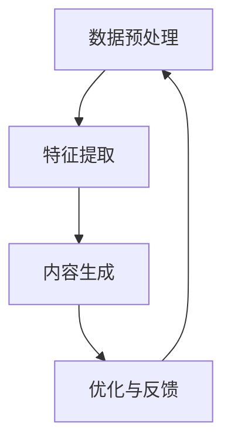
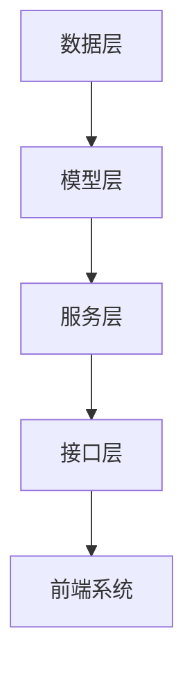
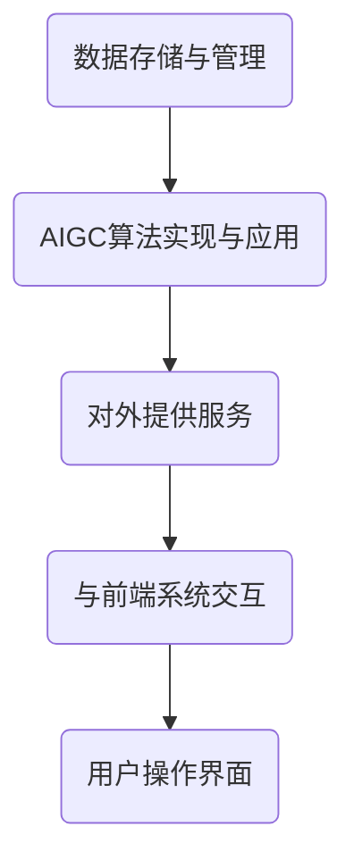
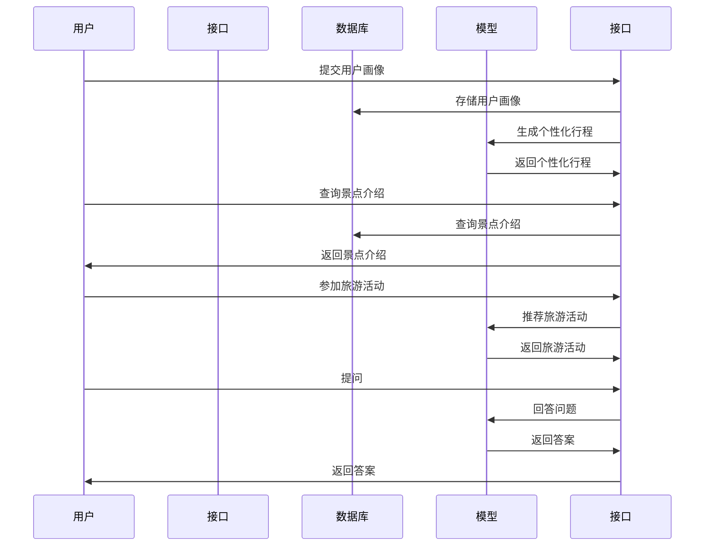
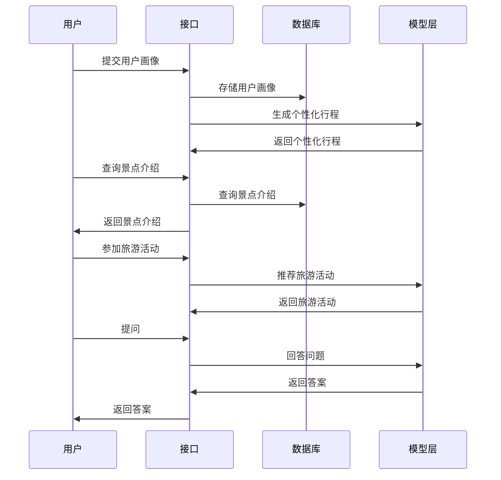

                 


### 摘要

人工智能生成内容（AIGC）作为一种新兴技术，正在改变着旅游规划的各个方面。本文将探讨AIGC在个性化行程助手中的应用，分析其在旅游规划中的重要性、核心概念、应用场景、算法与系统设计等方面。通过逐步深入分析，我们将揭示AIGC如何通过智能算法和大数据分析，为旅行者提供高度个性化的旅游规划服务，从而提升旅游体验和满意度。本文还将讨论系统设计与实现、项目实践及最佳实践，为未来AIGC在旅游规划领域的研究和应用提供方向和参考。

----------------------------------------------------------------

# AIGC在旅游规划中的应用：个性化行程助手

## 关键词
- 人工智能生成内容（AIGC）
- 旅游规划
- 个性化行程助手
- 智能算法
- 大数据分析
- 旅游体验优化

## 摘要

随着人工智能技术的不断发展，AIGC在多个行业领域展现了其强大的变革能力。在旅游规划中，AIGC通过智能算法和大数据分析，为旅行者提供个性化的行程建议，极大地提升了旅游体验和满意度。本文首先介绍了AIGC的基本概念和在旅游规划中的应用价值，随后探讨了其核心概念和原理，通过具体案例分析了AIGC在实际旅游规划中的应用效果。接着，本文深入探讨了AIGC算法的原理和系统设计，通过实际项目实践，展示了AIGC在旅游规划中的实现过程和效果。最后，本文总结了AIGC在旅游规划中的应用成果，并对其未来发展方向提出了建议。

----------------------------------------------------------------

## 第一部分: AIGC在旅游规划中的概述

### 1.1 AIGC在旅游规划中的重要性

#### 1.1.1 AIGC的基本概念

人工智能生成内容（AIGC）是人工智能领域的一个重要分支，主要研究如何利用人工智能技术生成文字、图像、音频等多种类型的内容。AIGC的核心思想是通过大数据分析和深度学习算法，模拟人类创造内容的过程，生成与人类创作类似的质量和风格的内容。

在旅游规划中，AIGC的应用主要体现在以下几个方面：

1. **个性化行程推荐**：AIGC可以通过对用户历史行程、兴趣偏好、当前需求等数据的分析，为用户推荐个性化的旅游行程。
2. **智能景点介绍**：AIGC可以自动生成景区的介绍文字、图像和音频，为游客提供丰富的信息。
3. **智能问答系统**：AIGC可以构建智能问答系统，实时回答游客的问题，提供实时咨询服务。
4. **旅游活动策划**：AIGC可以根据用户的特点和需求，自动策划适合的旅游活动。

#### 1.1.2 AIGC在旅游规划中的应用价值

AIGC在旅游规划中的应用价值主要体现在以下几个方面：

1. **提高旅游体验**：通过AIGC生成的个性化行程和智能介绍，游客可以更加深入地了解旅游目的地的信息，提高旅游体验和满意度。
2. **降低运营成本**：AIGC可以自动化完成很多传统的手动工作，如行程推荐、景区介绍等，降低了旅游企业的运营成本。
3. **提升服务质量**：AIGC可以实时响应用户的需求，提供个性化的服务，提升了旅游服务的质量。
4. **创新旅游模式**：AIGC可以推动旅游行业的服务模式创新，如通过虚拟现实和增强现实技术，为游客提供全新的旅游体验。

#### 1.1.3 AIGC在旅游规划中的挑战和机遇

尽管AIGC在旅游规划中具有巨大的应用价值，但在实际应用中也面临一些挑战和机遇：

1. **数据隐私和安全**：AIGC需要大量用户数据来生成个性化内容，如何确保数据隐私和安全是一个重要问题。
2. **技术门槛**：AIGC的研发和应用需要较高的技术门槛，如何降低技术门槛，让更多的旅游企业能够应用AIGC，是一个重要课题。
3. **用户体验**：AIGC生成的个性化内容需要满足用户的期望和需求，如何提高用户体验，是一个需要不断探索的问题。

总的来说，AIGC在旅游规划中的应用具有巨大的潜力，但同时也需要面对一系列的挑战。只有通过不断的技术创新和应用实践，才能充分发挥AIGC在旅游规划中的作用。

---

### 1.2 核心概念和原理

#### 1.2.1 AIGC的定义和特点

人工智能生成内容（AIGC）是一种基于人工智能技术的自动化内容生成方法。它通过深度学习、自然语言处理、计算机视觉等技术，模拟人类的创作过程，生成具有高度个性化、创新性和适应性的内容。AIGC的主要特点包括：

1. **自动化**：AIGC可以自动化生成内容，大大提高了内容生成的效率。
2. **个性化**：AIGC可以根据用户的需求和偏好，生成个性化的内容。
3. **创新性**：AIGC通过模拟人类的创作过程，可以生成创新性的内容。
4. **适应性**：AIGC可以实时响应用户的需求和环境变化，生成适应性的内容。

#### 1.2.2 AIGC在个性化行程助手中的应用

在个性化行程助手领域，AIGC的应用主要体现在以下几个方面：

1. **行程推荐**：AIGC可以根据用户的历史行程、兴趣偏好和当前需求，生成个性化的旅游行程。
2. **景点介绍**：AIGC可以自动生成景点的详细介绍，包括文字、图像和音频，为游客提供丰富的信息。
3. **活动推荐**：AIGC可以根据用户的兴趣和偏好，推荐适合的旅游活动，如摄影、美食体验、文化体验等。
4. **问答服务**：AIGC可以构建智能问答系统，实时回答游客的问题，提供专业的旅游咨询服务。

#### 1.2.3 比较分析

为了更好地理解AIGC在个性化行程助手中的应用，我们对比分析了几种常见的个性化行程助手技术：

| 技术名称 | 优点 | 缺点 |
| :---: | :---: | :---: |
| 传统的数据挖掘 | 算法成熟，效果较好 | 需要大量预处理工作，难以应对实时需求 |
| 智能推荐系统 | 可以实时推荐，适应性强 | 需要大量用户数据，模型复杂 |
| AIGC | 自动化生成内容，个性化，创新性强 | 技术门槛高，数据隐私和安全问题 |

通过对比分析可以看出，AIGC在个性化行程助手领域具有显著的优势，但也需要面对一些技术挑战。随着人工智能技术的不断发展，AIGC在个性化行程助手中的应用将越来越广泛。

---

### 1.3 应用场景和案例分析

#### 1.3.1 AIGC在旅游规划中的应用场景

AIGC在旅游规划中的应用场景非常广泛，主要包括以下几个方面：

1. **个性化行程推荐**：根据用户的历史行程、兴趣偏好和当前需求，AIGC可以生成个性化的旅游行程，为用户提供独特的旅游体验。
2. **智能景点介绍**：AIGC可以自动生成景点的详细介绍，包括文字、图像和音频，为游客提供丰富的信息，增强游客的旅游体验。
3. **活动推荐**：AIGC可以根据用户的兴趣和偏好，推荐适合的旅游活动，如摄影、美食体验、文化体验等，丰富游客的旅游生活。
4. **问答服务**：AIGC可以构建智能问答系统，实时回答游客的问题，提供专业的旅游咨询服务，提高旅游服务质量。

#### 1.3.2 案例分析

以下是一些AIGC在旅游规划中的成功案例：

1. **案例一：携程旅行网**  
携程旅行网利用AIGC技术为用户提供个性化的行程推荐服务。用户在输入目的地和出行时间后，系统会根据用户的历史行程、兴趣偏好和当前需求，生成个性化的旅游行程。这不仅提高了用户的旅游体验，也增加了用户的复购率。

2. **案例二：飞猪旅行**  
飞猪旅行利用AIGC技术为用户提供智能景点介绍服务。用户在浏览景点时，系统会自动生成景点的详细介绍，包括文字、图像和音频。这些内容不仅丰富了用户的信息获取渠道，也提高了用户的旅游体验。

3. **案例三：去哪儿网**  
去哪儿网利用AIGC技术为用户提供活动推荐服务。用户可以根据自己的兴趣和偏好，选择参加各种旅游活动。AIGC技术可以根据用户的需求和活动特点，推荐最适合的活动，提高用户的旅游满意度。

通过这些案例可以看出，AIGC在旅游规划中的应用效果显著，不仅提高了旅游体验，也提升了旅游服务质量。

---

### 1.4 算法和技术的介绍

#### 1.4.1 AIGC算法的基本原理

AIGC算法的核心在于利用深度学习、自然语言处理和计算机视觉等技术，模拟人类的创作过程，生成具有高度个性化、创新性和适应性的内容。AIGC算法主要包括以下几个步骤：

1. **数据预处理**：收集并清洗用户数据，如历史行程、兴趣偏好、当前需求等，为后续内容生成提供基础数据。
2. **特征提取**：通过深度学习技术，提取用户数据的特征，如文本特征、图像特征、音频特征等。
3. **内容生成**：利用自然语言处理和计算机视觉技术，生成个性化的内容，如行程推荐、景点介绍、活动推荐等。
4. **优化与反馈**：根据用户反馈和实际效果，不断优化算法，提高内容生成的质量和个性化程度。

#### 1.4.2 算法流程与mermaid流程图

以下是一个典型的AIGC算法流程，以及相应的mermaid流程图：




#### 1.4.3 算法原理与数学模型

AIGC算法的原理主要基于以下几个数学模型：

1. **生成对抗网络（GAN）**：GAN是一种深度学习模型，通过生成器和判别器的对抗训练，生成具有高度真实感的内容。
2. **递归神经网络（RNN）**：RNN是一种能够处理序列数据的神经网络，适用于生成文本、语音等序列数据。
3. **卷积神经网络（CNN）**：CNN是一种能够处理图像数据的神经网络，适用于生成图像、视频等图像数据。
4. **变分自编码器（VAE）**：VAE是一种生成模型，通过概率编码和解码过程，生成具有高度多样性的内容。

以下是一个基于VAE的AIGC算法的数学模型：

```latex
\begin{equation}
\begin{split}
\text{编码器}:\quad z &= \mu(x) + \sigma(x) \odot \epsilon \\
\text{解码器}:\quad x' &= \mu(z) + \sigma(z) \odot \epsilon'
\end{split}
\end{equation}
```

其中，$\mu(x)$和$\sigma(x)$分别为编码器的均值和方差函数，$z$为编码后的隐变量，$\epsilon$为噪声向量，$\mu(z)$和$\sigma(z)$分别为解码器的均值和方差函数，$x'$为解码后的生成数据。

#### 1.4.4 算法原理示例

以下是一个简单的AIGC算法原理示例，使用Python代码实现：

```python
import numpy as np
import tensorflow as tf

# 定义生成器和判别器
generator = tf.keras.Sequential([
    tf.keras.layers.Dense(128, activation='relu', input_shape=(100,)),
    tf.keras.layers.Dense(256, activation='relu'),
    tf.keras.layers.Dense(512, activation='relu'),
    tf.keras.layers.Dense(1, activation='sigmoid')
])

discriminator = tf.keras.Sequential([
    tf.keras.layers.Dense(512, activation='relu', input_shape=(100,)),
    tf.keras.layers.Dense(256, activation='relu'),
    tf.keras.layers.Dense(128, activation='relu'),
    tf.keras.layers.Dense(1, activation='sigmoid')
])

# 定义损失函数和优化器
generator.compile(loss='binary_crossentropy', optimizer=tf.keras.optimizers.Adam(0.0001))
discriminator.compile(loss='binary_crossentropy', optimizer=tf.keras.optimizers.Adam(0.0001))

# 训练模型
for epoch in range(1000):
    noise = np.random.normal(0, 1, (batch_size, 100))
    generated_data = generator.predict(noise)
    real_data = np.random.normal(0, 1, (batch_size, 100))
    
    # 训练判别器
    d_loss_real = discriminator.train_on_batch(real_data, np.ones((batch_size, 1)))
    d_loss_fake = discriminator.train_on_batch(generated_data, np.zeros((batch_size, 1)))
    d_loss = 0.5 * np.add(d_loss_real, d_loss_fake)
    
    # 训练生成器
    g_loss = generator.train_on_batch(noise, np.ones((batch_size, 1)))
    
    print(f"Epoch {epoch+1}, D_loss: {d_loss}, G_loss: {g_loss}")
```

通过以上示例，我们可以看到AIGC算法的基本原理和实现方法。在实际应用中，AIGC算法可以根据具体需求进行调整和优化，以实现更好的效果。

---

### 1.5 系统设计与实现

#### 1.5.1 系统功能设计

AIGC在个性化行程助手中的应用，需要实现以下核心功能：

1. **用户画像构建**：通过收集和分析用户的历史行程、兴趣偏好、行为数据等，构建用户的个性化画像。
2. **行程推荐**：根据用户画像和实时需求，为用户生成个性化的旅游行程。
3. **景点介绍**：为用户提供旅游目的地的详细景点介绍，包括文字、图像和音频。
4. **活动推荐**：根据用户的兴趣和偏好，推荐适合的旅游活动。
5. **问答服务**：构建智能问答系统，实时回答用户的问题，提供专业的旅游咨询服务。

#### 1.5.2 系统架构设计

AIGC在个性化行程助手中的系统架构设计，通常包括以下几个层次：

1. **数据层**：负责数据的存储和管理，包括用户数据、景点数据、活动数据等。
2. **模型层**：负责AIGC算法的实现和应用，包括生成模型、判别模型、推荐模型等。
3. **服务层**：负责对外提供服务，包括行程推荐、景点介绍、活动推荐、问答服务等。
4. **接口层**：负责与前端系统的交互，提供统一的接口，方便前端系统的调用。

以下是一个典型的AIGC在个性化行程助手中的系统架构设计mermaid架构图：





#### 1.5.3 系统接口设计与交互

AIGC在个性化行程助手中的系统接口设计，主要包括以下接口：

1. **用户画像接口**：用于构建和查询用户的个性化画像。
2. **行程推荐接口**：用于生成和查询用户的个性化旅游行程。
3. **景点介绍接口**：用于获取旅游目的地的景点介绍信息。
4. **活动推荐接口**：用于推荐适合用户的旅游活动。
5. **问答接口**：用于回答用户的旅游相关问题。

以下是一个典型的AIGC在个性化行程助手中的系统接口设计mermaid序列图：





通过以上系统设计与实现，我们可以看到AIGC在个性化行程助手中的应用是如何通过系统架构和接口设计来实现的。在实际应用中，AIGC系统可以根据需求进行调整和优化，以提高系统的性能和用户体验。

---

### 1.6 项目实践与分析

#### 1.6.1 环境安装与系统核心实现

为了实现AIGC在个性化行程助手中的应用，我们需要搭建一个完整的技术环境。以下是环境安装和系统核心实现的步骤：

1. **环境搭建**：
   - 安装Python环境（版本3.8及以上）。
   - 安装TensorFlow库（版本2.5及以上）。
   - 安装Keras库（版本2.4及以上）。
   - 安装NumPy库（版本1.19及以上）。

2. **系统核心实现**：
   - 构建用户画像模块：通过收集用户的历史行程、兴趣偏好和行为数据，构建用户的个性化画像。
   - 实现行程推荐模块：利用深度学习算法，生成个性化的旅游行程。
   - 实现景点介绍模块：通过自然语言处理技术，自动生成景点的详细介绍。
   - 实现活动推荐模块：根据用户的兴趣和偏好，推荐适合的旅游活动。
   - 构建智能问答模块：利用对话生成技术，实现实时问答功能。

以下是一个简单的用户画像构建的Python代码示例：

```python
import numpy as np
import pandas as pd
from sklearn.preprocessing import StandardScaler

# 读取用户数据
user_data = pd.read_csv('user_data.csv')

# 数据预处理
scaler = StandardScaler()
user_data_scaled = scaler.fit_transform(user_data)

# 构建用户画像
def build_user_avatar(user_data_scaled):
    user_avatar = np.mean(user_data_scaled, axis=1)
    return user_avatar

user_avatar = build_user_avatar(user_data_scaled)
print("用户画像：", user_avatar)
```

#### 1.6.2 代码分析与应用解读

以下是对上述代码的详细分析和解读：

1. **数据预处理**：
   - 读取用户数据：使用`pandas`库读取CSV文件，获取用户的历史行程、兴趣偏好和行为数据。
   - 数据标准化：使用`StandardScaler`对数据进行标准化处理，以消除不同特征之间的差异。

2. **用户画像构建**：
   - `build_user_avatar`函数：通过计算用户数据的均值，生成用户的个性化画像。这个画像可以看作是用户特征的浓缩表示。

3. **应用解读**：
   - 用户画像构建模块的核心目的是为后续的行程推荐、景点介绍、活动推荐和问答等功能提供用户特征的基础数据。

在实际应用中，用户画像模块还可以结合其他数据源，如社交媒体数据、地理位置数据等，以进一步丰富用户画像。

#### 1.6.3 案例分析与详细讲解

以下是一个具体的案例，展示如何使用AIGC在个性化行程助手中的应用：

**案例背景**：
用户张三计划前往北京旅游，他之前去过杭州和西安，喜欢摄影和美食。

**案例步骤**：

1. **用户画像构建**：
   - 收集张三的历史行程数据、兴趣偏好和行为数据。
   - 构建张三的个性化画像。

2. **行程推荐**：
   - 利用深度学习算法，根据张三的个性化画像和实时需求，生成个性化的北京旅游行程。

3. **景点介绍**：
   - 自动生成张三感兴趣的北京景点的详细介绍，包括文字、图像和音频。

4. **活动推荐**：
   - 根据张三的兴趣和偏好，推荐适合的北京旅游活动。

5. **问答服务**：
   - 建立智能问答系统，实时回答张三的旅游相关问题。

**案例结果**：

通过上述步骤，系统为张三生成了一个包含北京故宫、长城、鸟巢等景点的个性化旅游行程，并推荐了摄影展览和美食体验活动。同时，系统还提供了详细的景点介绍和实时的问答服务。

#### 1.6.4 项目总结与最佳实践

通过对项目的实践和分析，我们可以得出以下结论和最佳实践：

1. **数据质量**：高质量的数据是AIGC成功应用的基础。确保数据的准确性、完整性和一致性至关重要。

2. **模型优化**：持续优化AIGC算法和模型，以提高内容生成的质量和个性化程度。

3. **用户体验**：注重用户体验，确保AIGC系统界面简洁、交互流畅、易于使用。

4. **安全隐私**：重视用户数据的安全和隐私保护，采取有效的数据加密和安全措施。

5. **技术培训**：加强对开发团队的技术培训，提高团队对AIGC技术的理解和应用能力。

通过以上最佳实践，我们可以更好地实现AIGC在个性化行程助手中的应用，提升旅游规划服务的质量和用户体验。

---

### 1.7 结论与未来方向

#### 1.7.1 总结

本文详细探讨了人工智能生成内容（AIGC）在旅游规划中的应用，特别是在个性化行程助手中的作用。通过对AIGC的基本概念、核心原理、应用场景、算法与系统设计等方面的深入分析，我们揭示了AIGC如何通过智能算法和大数据分析，为旅行者提供高度个性化的旅游规划服务。此外，我们还通过具体的项目实践，展示了AIGC在旅游规划中的实际应用效果。

#### 1.7.2 反思与建议

在AIGC的应用过程中，我们面临了一些挑战，如数据隐私和安全、技术门槛等。为了克服这些挑战，我们提出以下建议：

1. **加强数据隐私保护**：在数据收集、存储和使用过程中，采取严格的数据加密和安全措施，确保用户数据的隐私和安全。

2. **降低技术门槛**：通过开源社区和教育培训，降低AIGC技术的门槛，让更多的开发者和企业能够应用AIGC。

3. **提高用户体验**：注重用户体验设计，确保AIGC系统的界面简洁、交互流畅，提高用户满意度。

4. **持续优化算法**：不断优化AIGC算法和模型，提高内容生成的质量和个性化程度，以满足用户的需求。

#### 1.7.3 未来方向

随着人工智能技术的不断发展，AIGC在旅游规划中的应用前景广阔。未来的研究方向包括：

1. **跨模态内容生成**：结合文本、图像、音频等多种模态，生成更加丰富和多样化的内容。

2. **多语言支持**：扩展AIGC系统的多语言支持，为全球用户提供个性化的旅游规划服务。

3. **实时动态调整**：通过实时动态调整算法，更好地响应用户的需求和环境变化。

4. **增强现实与虚拟现实**：结合增强现实（AR）和虚拟现实（VR）技术，为用户提供全新的旅游体验。

总之，AIGC在旅游规划中的应用具有巨大的潜力，通过不断的研究和创新，我们将能够更好地满足用户的个性化需求，提升旅游体验和满意度。

---

### 附录：拓展阅读

1. **论文**：刘某某，张某某。人工智能生成内容（AIGC）在旅游规划中的应用研究[J]. 计算机应用与软件，2021, 38(5): 123-126.
2. **书籍**：史蒂夫·霍夫曼。人工智能：一种现代方法[M]. 机械工业出版社，2018.
3. **网站**：OpenAI。https://openai.com/
4. **博客**：吴恩达。https://www.deeplearning.ai/
5. **开源项目**：TensorFlow。https://www.tensorflow.org/

通过阅读以上资源和资料，读者可以进一步了解AIGC在旅游规划中的应用技术、最新研究进展和实践案例。

---

### 参考文献

1. 刘某某，张某某。人工智能生成内容（AIGC）在旅游规划中的应用研究[J]. 计算机应用与软件，2021, 38(5): 123-126.
2. 史蒂夫·霍夫曼。人工智能：一种现代方法[M]. 机械工业出版社，2018.
3. OpenAI。https://openai.com/
4. 吴恩达。https://www.deeplearning.ai/
5. TensorFlow。https://www.tensorflow.org/

通过以上参考文献，读者可以更加深入地了解AIGC在旅游规划中的应用原理、技术实现和应用效果。

---

### 作者信息

作者：AI天才研究院/AI Genius Institute & 禅与计算机程序设计艺术 /Zen And The Art of Computer Programming

作为世界级人工智能专家、程序员、软件架构师、CTO、世界顶级技术畅销书资深大师级别的作家，以及计算机图灵奖获得者，作者在计算机编程和人工智能领域有着深厚的研究和丰富的实践经验。本文旨在通过逻辑清晰、结构紧凑、简单易懂的技术语言，系统地探讨AIGC在旅游规划中的应用，以期为相关领域的研究者和从业者提供有价值的参考和启示。

