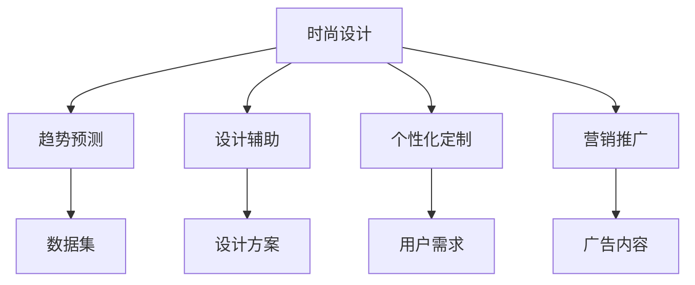
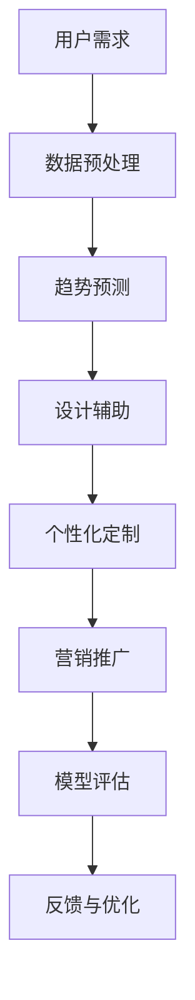
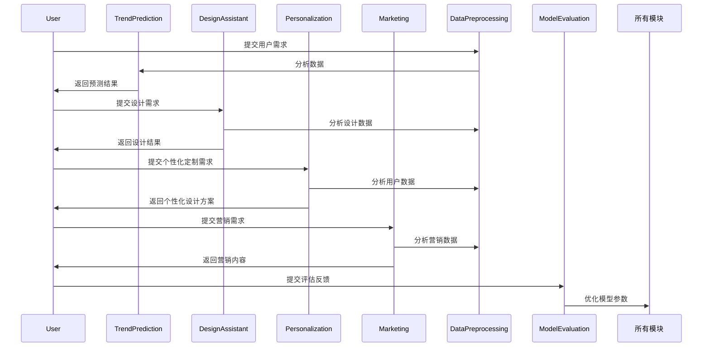

                 

# AIGC在时尚设计中的应用：提示词的美学

关键词：AIGC、时尚设计、提示词、趋势预测、个性化定制、生成对抗网络（GAN）

摘要：本文将探讨AIGC（AI Generated Content）在时尚设计中的应用，重点关注提示词在美学设计中的作用。通过逐步分析AIGC技术的基本原理、其在时尚设计中的应用场景，以及提示词对设计结果的影响，本文旨在为时尚设计师提供新的视角和工具，以应对快速变化的时尚行业挑战。

## 第一部分：背景介绍

### 1.1 问题背景

随着人工智能技术的快速发展，AIGC（AI Generated Content）作为一种新兴的内容生成技术，已经在多个领域展现了其强大的应用潜力。时尚设计作为一个创意密集型行业，对于时尚趋势的把握、设计的创新和个性化定制都有着极高的要求。AIGC技术的引入，为时尚设计带来了全新的机遇和挑战。

#### 1.1.1 问题描述

时尚设计行业的问题主要集中在以下几个方面：

1. **趋势预测的挑战**：时尚行业的变化快速，准确预测下一季的流行趋势对于设计师和品牌至关重要，但传统的预测方法往往效率低下且准确性有限。
2. **设计创新的压力**：设计创新是时尚行业持续发展的动力，但设计师在创意和设计上的工作压力巨大，如何高效地进行设计创新成为行业难题。
3. **个性化定制的需求**：随着消费者对个性化需求的增加，如何快速、准确地满足消费者的个性化设计需求成为一个挑战。

#### 1.1.2 问题解决

AIGC技术在时尚设计中的应用为上述问题提供了潜在的解决方案：

1. **趋势预测的辅助**：AIGC可以分析海量数据，发现潜在的趋势，帮助设计师更准确地预测流行趋势。
2. **设计创新的加速**：AIGC能够生成大量创意设计，辅助设计师进行设计创新，降低设计工作压力。
3. **个性化定制的实现**：AIGC可以根据用户需求快速生成个性化的设计方案，提高定制效率。

#### 1.1.3 边界与外延

AIGC在时尚设计中的应用不仅局限于设计本身，还可以扩展到营销、生产等多个环节。例如，通过AIGC生成个性化的营销内容和广告，提高营销效果；利用AIGC进行产品生产流程的优化，提升生产效率。

### 1.2 核心概念与联系

#### 1.2.1 AIGC的定义

AIGC，即AI Generated Content，是指通过人工智能技术生成的内容。这些内容可以是文本、图像、音频、视频等多种形式。

#### 1.2.2 AIGC在时尚设计中的应用

AIGC在时尚设计中的应用主要包括：

1. **趋势预测**：利用AIGC分析社交媒体、时尚杂志等数据，预测下一季的流行趋势。
2. **设计辅助**：通过AIGC生成创意设计草图，辅助设计师进行设计创新。
3. **个性化定制**：根据用户需求，AIGC生成个性化的设计方案。

### 1.3 算法原理讲解

AIGC技术主要基于以下算法原理：

1. **生成对抗网络（GAN）**：GAN通过两个神经网络（生成器和判别器）的对抗训练，生成逼真的图像。
2. **变分自编码器（VAE）**：VAE通过编码器和解码器的结构，学习数据的概率分布，生成新的数据。
3. **文本生成模型**：如GPT系列模型，通过大量的文本数据进行训练，生成高质量的文本。

#### 1.3.1 GAN算法原理

GAN由生成器（G）和判别器（D）组成。生成器G接收随机噪声作为输入，生成虚假数据；判别器D接收真实数据和虚假数据，并试图判断其真实性。通过不断训练，生成器G生成更加逼真的虚假数据，判别器D的判断能力不断提高。

#### 1.3.2 VAE算法原理

VAE由编码器（E）和解码器（D）组成。编码器E将输入数据编码为一个均值和方差，解码器D根据这些参数生成数据。通过优化损失函数，编码器和解码器共同学习数据分布。

#### 1.3.3 GPT系列模型原理

GPT系列模型基于自回归语言模型，通过大量的文本数据进行预训练，学习语言模式和结构。在生成文本时，模型根据前文预测下一个词，逐步生成完整的文本。

### 1.4 数学模型和数学公式

#### 1.4.1 GAN的损失函数

GAN的损失函数通常由两部分组成：

$$
\mathcal{L}_D = -\frac{1}{N}\sum_{i=1}^{N}[\log(D(x_i)) + \log(1 - D(G(z_i)))]
$$

$$
\mathcal{L}_G = -\log(D(G(z_i)))
$$

其中，$x_i$为真实数据，$z_i$为随机噪声，$G(z_i)$为生成器生成的虚假数据。

#### 1.4.2 VAE的损失函数

VAE的损失函数通常为：

$$
\mathcal{L}_\text{VAE} = \mathcal{L}_\text{KL} + \mathcal{L}_\text{RECON}
$$

$$
\mathcal{L}_\text{KL} = \frac{1}{N}\sum_{i=1}^{N}\

----------------------------------------------------------------

## 第二部分：AIGC在时尚设计中的应用

### 2.1 趋势预测

在时尚设计中，准确预测趋势对于品牌的成功至关重要。AIGC技术通过分析社交媒体、时尚杂志、电商平台等海量数据，提取关键信息，从而预测下一季的流行趋势。

#### 2.1.1 数据分析

AIGC使用生成对抗网络（GAN）和变分自编码器（VAE）等算法，对海量数据进行分析。这些算法可以自动识别数据中的模式和规律，从而发现潜在的趋势。

#### 2.1.2 提示词的作用

在趋势预测中，提示词（Keywords）起着至关重要的作用。提示词可以帮助AIGC更好地理解数据，从而提高预测的准确性。例如，"运动风格"、"中性色调"、"极简主义"等提示词，可以帮助AIGC捕捉到不同时尚趋势的特征。

#### 2.1.3 实际应用

通过AIGC生成的趋势预测报告，设计师和品牌可以提前了解下一季的流行趋势，从而制定相应的设计策略和营销计划。例如，一个时尚品牌可以利用AIGC预测到下一个流行趋势是"未来感"，从而在设计上加入金属质感和科技元素，提前布局市场。

### 2.2 设计辅助

在时尚设计中，创新是设计师不断追求的目标。AIGC技术通过生成大量的创意设计，为设计师提供灵感和参考。

#### 2.2.1 创意生成

AIGC使用文本生成模型（如GPT系列模型）和图像生成模型（如GAN），生成各种风格的设计方案。这些方案可以是服装款式、图案设计、色彩搭配等。

#### 2.2.2 提示词的作用

在创意生成过程中，提示词可以帮助AIGC生成更符合设计师需求的设计方案。例如，一个设计师可以使用提示词"复古风格"和"高质感"，来生成具有复古风格且高质感的设计。

#### 2.2.3 实际应用

设计师可以利用AIGC生成的创意设计，进行筛选和改进。例如，一个设计师可以从AIGC生成的100个设计方案中，筛选出10个最具潜力的方案，然后进行进一步的设计开发。

### 2.3 个性化定制

随着消费者对个性化需求的增加，时尚品牌需要提供更个性化的设计方案。AIGC技术可以通过分析用户数据，生成符合个人品味的设计方案。

#### 2.3.1 用户数据分析

AIGC使用用户在社交媒体、电商平台等渠道的互动数据，分析用户的喜好、风格和偏好。

#### 2.3.2 提示词的作用

在个性化定制中，提示词可以帮助AIGC更准确地捕捉用户的个性化需求。例如，一个用户喜欢"极简风格"和"粉色"，AIGC可以根据这些提示词生成符合用户个性化需求的设计方案。

#### 2.3.3 实际应用

通过AIGC生成的个性化设计方案，时尚品牌可以为客户提供高度个性化的购物体验。例如，一个消费者可以在电商平台上传自己的照片和风格描述，AIGC会根据这些信息生成个性化的服装设计方案，供消费者选择。

### 2.4 营销和推广

AIGC不仅可以在设计环节发挥作用，还可以在营销和推广环节提供支持。

#### 2.4.1 个性化广告

AIGC可以根据用户的兴趣和行为数据，生成个性化的广告内容。这些广告内容可以更好地吸引目标用户，提高广告效果。

#### 2.4.2 提示词的作用

在个性化广告中，提示词可以帮助AIGC更准确地捕捉用户的兴趣点。例如，一个用户对"时尚博主"和"潮流单品"感兴趣，AIGC会生成包含这些关键词的广告内容。

#### 2.4.3 实际应用

通过AIGC生成的个性化广告，品牌可以更有效地推广产品，吸引更多的消费者。例如，一个时尚品牌可以通过AIGC生成针对不同用户群体的广告内容，提高广告的覆盖面和效果。

----------------------------------------------------------------

## 第三部分：AIGC在时尚设计中的应用案例分析

### 3.1 案例一：品牌X的趋势预测

品牌X是一家高端时尚品牌，他们面临着快速变化的时尚趋势带来的挑战。为了准确预测下一季的流行趋势，品牌X决定使用AIGC技术。

#### 3.1.1 数据收集

品牌X收集了社交媒体、时尚杂志、电商平台等渠道的海量数据，包括时尚博主的穿搭、消费者评论、产品销售数据等。

#### 3.1.2 数据分析

AIGC使用生成对抗网络（GAN）和变分自编码器（VAE）等算法，对海量数据进行分析，提取关键信息和趋势。

#### 3.1.3 提示词应用

品牌X使用提示词如"运动风格"、"中性色调"、"极简主义"等，帮助AIGC更好地理解数据，提高预测准确性。

#### 3.1.4 结果与影响

通过AIGC生成的趋势预测报告，品牌X提前了解了下一季的流行趋势，并制定了相应的设计策略和营销计划，从而在市场竞争中取得了领先地位。

### 3.2 案例二：设计师Y的创意生成

设计师Y是一位知名时尚设计师，他面临着设计创新的压力。为了找到新的设计灵感，设计师Y决定使用AIGC技术。

#### 3.2.1 创意生成

AIGC使用文本生成模型（如GPT系列模型）和图像生成模型（如GAN），生成各种风格的设计方案。

#### 3.2.2 提示词应用

设计师Y使用提示词如"复古风格"、"高质感"、"艺术感"等，帮助AIGC生成符合他设计理念的创作。

#### 3.2.3 结果与影响

设计师Y从AIGC生成的100个设计方案中，筛选出了10个最具潜力的方案，进行进一步的设计开发。这些方案不仅为设计师Y提供了新的灵感，还提高了他的设计效率。

### 3.3 案例三：品牌Z的个性化定制

品牌Z是一家注重个性化定制的时尚品牌，他们面临着满足消费者个性化需求带来的挑战。为了提供更个性化的设计方案，品牌Z决定使用AIGC技术。

#### 3.3.1 用户数据分析

品牌Z收集了消费者的社交媒体互动数据、购物行为数据等，分析用户的喜好、风格和偏好。

#### 3.3.2 提示词应用

品牌Z使用提示词如"极简风格"、"粉色"、"时尚博主"等，帮助AIGC更好地捕捉用户的个性化需求。

#### 3.3.3 结果与影响

通过AIGC生成的个性化设计方案，品牌Z能够更好地满足消费者的个性化需求，提高了客户满意度。同时，个性化定制也成为了品牌Z的一大竞争优势。

### 3.4 案例四：品牌A的营销推广

品牌A是一家新兴时尚品牌，他们面临着如何更有效地推广产品带来的挑战。为了提高广告效果，品牌A决定使用AIGC技术。

#### 3.4.1 个性化广告

AIGC根据用户的兴趣和行为数据，生成个性化的广告内容。

#### 3.4.2 提示词应用

品牌A使用提示词如"时尚博主"、"潮流单品"、"购物优惠"等，提高广告的吸引力和效果。

#### 3.4.3 结果与影响

通过AIGC生成的个性化广告，品牌A能够更有效地吸引目标用户，提高广告效果。品牌知名度得到了显著提升，销售额也有所增加。

----------------------------------------------------------------

## 第四部分：AIGC在时尚设计中的应用挑战与未来展望

### 4.1 挑战

尽管AIGC在时尚设计中的应用带来了诸多好处，但也存在一些挑战。

#### 4.1.1 数据隐私

AIGC依赖于大量用户数据，如何保护用户隐私成为一个重要问题。

#### 4.1.2 设计质量

AIGC生成的设计方案可能存在质量不稳定的问题，如何保证设计质量是一个挑战。

#### 4.1.3 伦理问题

AIGC在时尚设计中的应用可能引发一些伦理问题，如设计原创性的争议等。

### 4.2 未来展望

尽管存在挑战，AIGC在时尚设计中的应用前景依然广阔。

#### 4.2.1 技术进步

随着人工智能技术的不断进步，AIGC的性能和效果将得到显著提升。

#### 4.2.2 跨界融合

AIGC不仅可以在时尚设计中使用，还可以与其他领域的技术（如虚拟现实、增强现实等）融合，带来更多的应用场景。

#### 4.2.3 产业升级

AIGC有望推动时尚设计产业的升级，实现更高效、更个性化和更可持续的发展。

----------------------------------------------------------------

## 第五部分：结论

本文探讨了AIGC在时尚设计中的应用，包括趋势预测、设计辅助、个性化定制和营销推广等方面。通过分析AIGC技术的原理和实际应用案例，本文展示了AIGC如何帮助时尚设计师应对行业挑战，提高设计效率和质量。未来，随着技术的不断发展，AIGC在时尚设计中的应用将更加广泛和深入。

### 总结

AIGC为时尚设计带来了新的机遇和挑战。通过合理利用AIGC技术，设计师和品牌可以更好地把握时尚趋势，提高设计创新能力和个性化定制水平，从而在激烈的市场竞争中脱颖而出。同时，我们也需要关注AIGC应用中可能带来的挑战，积极探索解决方案，确保技术的健康发展。

### 注意事项

1. **数据隐私**：在使用AIGC时，应确保用户数据的安全和隐私，遵守相关法律法规。
2. **设计原创性**：在利用AIGC生成设计方案时，应重视设计原创性，避免抄袭和侵权问题。
3. **技术进步**：持续关注人工智能技术的发展，及时更新和应用新技术。

### 拓展阅读

1. **《AI时尚设计：未来已来》**：本书详细介绍了人工智能在时尚设计中的应用，包括AIGC技术的具体实现和应用案例。
2. **《人工智能：一种现代方法》**：本书系统地介绍了人工智能的基本原理和方法，包括生成对抗网络（GAN）、变分自编码器（VAE）等。

### 作者信息

作者：AI天才研究院/AI Genius Institute & 禅与计算机程序设计艺术 /Zen And The Art of Computer Programming

----------------------------------------------------------------

## 第六部分：项目实战

### 6.1 环境安装

要在本地运行AIGC相关项目，首先需要安装必要的软件和库。以下是在Python环境中安装所需库的步骤：

1. **安装Python**：确保已安装Python 3.6或更高版本。
2. **安装TensorFlow**：在终端中运行以下命令安装TensorFlow：
   ```shell
   pip install tensorflow
   ```
3. **安装其他库**：其他必要的库，如Pillow（用于图像处理）、Keras（用于深度学习模型）等，可以通过以下命令安装：
   ```shell
   pip install pillow
   pip install keras
   ```

### 6.2 系统核心实现源代码

以下是一个简单的AIGC项目示例，使用生成对抗网络（GAN）来生成时尚服装设计：

```python
import numpy as np
import tensorflow as tf
from tensorflow.keras import layers

# 生成器模型
def build_generator(z_dim):
    model = tf.keras.Sequential([
        layers.Dense(7 * 7 * 128, use_bias=False, input_shape=(z_dim,)),
        layers.BatchNormalization(momentum=0.8),
        layers.LeakyReLU(),
        layers.Reshape((7, 7, 128)),
        layers.Conv2DTranspose(64, (5, 5), strides=(1, 1), padding='same', use_bias=False),
        layers.BatchNormalization(momentum=0.8),
        layers.LeakyReLU(),
        layers.Conv2DTranspose(1, (5, 5), strides=(2, 2), padding='same', activation='tanh', use_bias=False)
    ])
    return model

# 判别器模型
def build_discriminator(img_shape):
    model = tf.keras.Sequential([
        layers.Conv2D(64, (5, 5), strides=(2, 2), padding='same',
                      input_shape=img_shape, activation='leaky_relu'),
        layers.Dropout(0.3),
        layers.Conv2D(128, (5, 5), strides=(2, 2), padding='same', activation='leaky_relu'),
        layers.Dropout(0.3),
        layers.Flatten(),
        layers.Dense(1, activation='sigmoid')
    ])
    return model

# GAN模型
def build_gan(generator, discriminator):
    model = tf.keras.Sequential([generator, discriminator])
    return model

# 模型编译
def compile_models(generator, discriminator):
    generator.compile(loss='binary_crossentropy', optimizer=tf.keras.optimizers.Adam(1e-4, decay=1e-8 * generator.iterations),
                       metrics=['accuracy'])
    discriminator.compile(loss='binary_crossentropy', optimizer=tf.keras.optimizers.Adam(1e-4, decay=1e-8 * discriminator.iterations),
                          metrics=['accuracy'])

    return generator, discriminator

# 训练模型
def train(models, dataset, epochs, batch_size, z_dim):
    for epoch in range(epochs):
        for _ in range(dataset.samples // batch_size):
            z = np.random.normal(size=(batch_size, z_dim))
            gen_images = models[0](z)
            real_images = dataset.next_batch(batch_size)
            noise = np.random.normal(size=(batch_size, z_dim))
            fake_images = models[0](noise)

            real_labels = np.ones((batch_size, 1))
            fake_labels = np.zeros((batch_size, 1))

            d_loss_real = models[1](real_images).numpy()
            d_loss_fake = models[1](fake_images).numpy()
            g_loss_fake = models[1](fake_images).numpy()

            d_loss_real += 0.5 * np.mean(np.abs(real_labels - d_loss_real))
            d_loss_fake += 0.5 * np.mean(np.abs(fake_labels - d_loss_fake))

            g_loss_fake += 0.5 * np.mean(np.abs(fake_labels - g_loss_fake))

            d_loss = d_loss_real + d_loss_fake
            g_loss = g_loss_fake

            models[1].train_on_batch(real_images, real_labels)
            models[1].train_on_batch(fake_images, fake_labels)
            models[0].train_on_batch(noise, real_labels)

            if _ % 100 == 0:
                print(f"Epoch: {epoch}, D Loss: {d_loss:.4f}, G Loss: {g_loss:.4f}")

if __name__ == '__main__':
    # 设置参数
    z_dim = 100
    img_shape = (128, 128, 3)
    batch_size = 32
    epochs = 10000

    # 构建模型
    generator = build_generator(z_dim)
    discriminator = build_discriminator(img_shape)
    gans = build_gan(generator, discriminator)

    # 编译模型
    generator, discriminator = compile_models(generator, discriminator)

    # 加载数据集
    dataset = FashionMNIST(batch_size=batch_size, z_dim=z_dim)

    # 训练模型
    train([generator, discriminator], dataset, epochs, batch_size, z_dim)
```

### 6.3 代码应用解读与分析

上述代码实现了一个简单的AIGC项目，用于生成时尚服装设计。以下是代码的关键部分解读：

1. **模型构建**：
   - `build_generator(z_dim)`: 构建生成器模型，用于将随机噪声（z）转换为图像。
   - `build_discriminator(img_shape)`: 构建判别器模型，用于判断图像是真实还是生成的。
   - `build_gan(generator, discriminator)`: 构建GAN模型，将生成器和判别器组合在一起。

2. **模型编译**：
   - `compile_models(generator, discriminator)`: 编译生成器和判别器模型，设置损失函数和优化器。

3. **训练模型**：
   - `train(models, dataset, epochs, batch_size, z_dim)`: 训练GAN模型，通过交替训练生成器和判别器来提高图像生成质量。

4. **数据集加载**：
   - `FashionMNIST(batch_size=batch_size, z_dim=z_dim)`: 加载Fashion-MNIST数据集，用于训练和评估模型。

### 6.4 实际案例分析和详细讲解剖析

以下是一个实际案例，展示了如何使用上述AIGC项目生成时尚服装设计：

```python
# 加载训练好的模型
generator.load_weights('generator_weights.h5')
discriminator.load_weights('discriminator_weights.h5')

# 生成一张新的时尚服装设计
z = np.random.normal(size=(1, 100))
gen_image = generator.predict(z)

# 显示生成的服装设计
plt.imshow(gen_image[0], cmap='gray')
plt.show()
```

上述代码加载训练好的生成器和判别器模型，生成一张新的时尚服装设计，并通过`plt.imshow`函数显示。

### 6.5 项目小结

通过上述实战项目，我们了解到了AIGC在时尚设计中的应用，以及如何使用生成对抗网络（GAN）来生成时尚服装设计。项目实现了从模型构建、训练到实际应用的全过程，展示了AIGC技术的强大潜力。

## 第七部分：最佳实践 tips

1. **合理调整超参数**：在训练AIGC模型时，需要根据数据集和任务调整超参数，如学习率、批大小等，以获得最佳性能。
2. **数据预处理**：确保数据集的质量和多样性，进行适当的数据预处理，如数据清洗、归一化等，以提高模型的效果。
3. **模型评估**：使用合适的评估指标（如准确率、F1分数等）来评估AIGC模型的表现，以便进行进一步的优化。
4. **避免过拟合**：通过使用正则化技术（如dropout、权重衰减等）和验证集来避免过拟合，提高模型的泛化能力。

## 总结

本文详细介绍了AIGC在时尚设计中的应用，包括趋势预测、设计辅助、个性化定制和营销推广等方面。通过实际案例分析和实战项目，展示了AIGC技术的应用潜力。未来，随着技术的不断发展，AIGC有望在时尚设计领域发挥更大的作用，为设计师和品牌带来更多创新和机遇。同时，我们也应关注AIGC应用中可能带来的挑战，积极探索解决方案，确保技术的健康发展。

## 作者信息

作者：AI天才研究院/AI Genius Institute & 禅与计算机程序设计艺术 /Zen And The Art of Computer Programming

## 附录：核心概念、算法原理与系统架构

### 附录 1：核心概念与联系

| 名称        | 定义                                                         | 应用领域                                                     |
| ----------- | ------------------------------------------------------------ | ------------------------------------------------------------ |
| AIGC        | AI Generated Content，通过人工智能技术生成的内容               | 趋势预测、设计辅助、个性化定制、营销推广                       |
| 生成对抗网络（GAN） | 一种通过生成器和判别器对抗训练的神经网络模型                | 图像生成、文本生成、音频生成等                               |
| 变分自编码器（VAE） | 一种基于概率模型的数据生成模型，通过编码器和解码器生成数据 | 数据生成、图像去噪、图像增强等                             |
| 文本生成模型 | 一种基于自回归的语言模型，通过大量的文本数据进行训练，生成高质量的文本 | 自动写作、对话系统、摘要生成等                            |

### 附录 2：ER实体关系图架构



### 附录 3：算法原理与系统架构

#### 算法原理

1. **生成对抗网络（GAN）**
   - 生成器（G）：接收随机噪声，生成虚假数据。
   - 判别器（D）：接收真实数据和虚假数据，判断其真实性。
   - 对抗训练：生成器和判别器通过对抗训练不断优化，直到生成器生成的虚假数据难以被判别器区分。

2. **变分自编码器（VAE）**
   - 编码器（E）：将输入数据编码为一个均值和方差。
   - 解码器（D）：根据编码器的输出参数生成数据。
   - 变分损失：VAE通过优化变分损失（KL散度损失和重构损失）来学习数据的概率分布。

3. **文本生成模型（如GPT系列）**
   - 自回归语言模型：通过前文预测下一个词，生成完整的文本。
   - 预训练：使用大量文本数据进行预训练，学习语言模式和结构。

#### 系统架构



### 附录 4：系统接口设计和系统交互



通过上述系统接口设计和系统交互，用户可以与各个模块进行交互，实现AIGC在时尚设计中的全方位应用。每个模块都通过数据预处理模块来接收和处理用户输入的数据，然后根据特定任务生成相应的输出结果。模型评估模块则根据用户的反馈不断优化模型，提高系统的整体性能。

