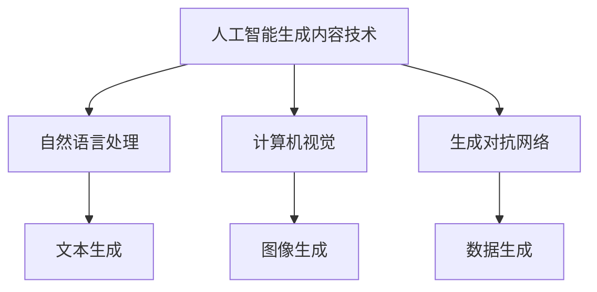

                 

# AIGC在时尚设计中的应用：潮流趋势分析的提示词工程

## 关键词

- AIGC
- 时尚设计
- 潮流趋势分析
- 提示词工程
- 生成对抗网络
- 自然语言处理

## 摘要

随着人工智能技术的不断发展，AIGC（AI Generated Content）技术在各个领域中的应用愈发广泛。本文旨在探讨AIGC在时尚设计中的具体应用，特别是潮流趋势分析方面的提示词工程。通过介绍AIGC技术、潮流趋势分析及其与时尚设计的结合，本文将详细讲解提示词工程的设计原则和实现方法，为时尚设计师提供一种高效、创新的潮流趋势分析工具。

### 第一部分：背景介绍

#### 问题背景

在数字化转型的浪潮中，人工智能（AI）正逐渐渗透到各个行业，推动产业升级和创新发展。时尚设计行业作为创意与技术的交汇点，正迎来一场由人工智能引领的变革。AIGC（AI Generated Content）作为一种新兴的技术，为时尚设计提供了强大的工具，使得设计师能够更加高效地创作出符合潮流趋势的设计作品。

#### 问题描述

AIGC在时尚设计中的应用涉及多个方面，包括趋势分析、设计灵感生成、面料与图案设计等。然而，如何有效地利用AIGC技术来提升时尚设计的创新性和效率，仍然是时尚设计师和行业从业者面临的重要课题。

#### 问题解决

本书旨在探讨AIGC在时尚设计中的应用，通过深入分析AIGC技术的工作原理和实际应用案例，为时尚设计师提供实用的指导和策略。书中将详细介绍AIGC技术的核心概念、应用场景、算法原理以及设计实践，帮助读者理解和掌握这一前沿技术。

#### 边界与外延

本书主要讨论AIGC技术在时尚设计领域的应用，包括但不限于趋势分析、设计灵感的自动生成、面料和图案设计等。同时，本书也将探讨AIGC技术与其他时尚设计工具的协同应用，以实现设计效率的最大化。

#### 概念结构与核心要素组成

- **AIGC技术**：AI生成内容技术，包括自然语言处理、计算机视觉、生成对抗网络等。
- **时尚设计领域**：包括时尚趋势分析、设计灵感生成、面料和图案设计等。
- **应用场景**：时尚设计中的具体应用，如快速趋势响应、设计灵感的自动生成、个性化设计等。
- **设计实践**：通过案例分析和实战经验，展示AIGC技术在时尚设计中的实际应用。

### 第二部分：核心概念与联系

#### 核心概念原理

- **AIGC技术**：利用人工智能算法生成各种类型的内容，如文本、图像、音频等。
- **时尚设计趋势分析**：通过数据分析和技术手段，捕捉和预测时尚设计的潮流趋势。
- **设计灵感生成**：利用AIGC技术自动生成设计灵感，提高设计的创新性和效率。

#### 概念属性特征对比表格

| 概念       | 特征                  | 对比         |
|------------|-----------------------|--------------|
| AIGC技术   | 自动生成内容         | 依赖大量数据 |
| 趋势分析   | 数据驱动             | 精准预测     |
| 设计灵感   | 创新驱动             | 灵活多样     |

#### ER实体关系图架构

```mermaid
erDiagram
  AIGC技术 --> 时尚设计趋势分析 : 依赖
  AIGC技术 --> 设计灵感生成 : 依赖
  时尚设计趋势分析 --> 趋势预测 : 实现功能
  设计灵感生成 --> 创意生成 : 实现功能
```

### 第三部分：算法原理讲解

#### 算法原理

AIGC技术主要依赖于自然语言处理（NLP）、计算机视觉（CV）和生成对抗网络（GAN）三种核心算法。

1. **自然语言处理（NLP）**：用于文本数据的处理和理解，包括分词、词性标注、实体识别等。

2. **计算机视觉（CV）**：用于图像和视频数据的处理和理解，包括目标检测、图像分割、风格迁移等。

3. **生成对抗网络（GAN）**：用于生成高质量的数据，如图像、音频和文本。

#### 算法mermaid流程图



#### 算法原理详细讲解

#### 自然语言处理（NLP）

自然语言处理是AIGC技术的重要组成部分，主要用于处理和理解文本数据。其核心算法包括：

1. **分词**：将连续的文本分割成一个个独立的单词或词组。
   $$\text{文本} \rightarrow \text{单词序列}$$

2. **词性标注**：对每个单词进行词性分类，如名词、动词、形容词等。
   $$\text{单词序列} \rightarrow \text{词性序列}$$

3. **实体识别**：识别文本中的关键信息，如人名、地点、组织等。
   $$\text{文本} \rightarrow \text{实体序列}$$

#### 计算机视觉（CV）

计算机视觉主要用于处理和理解图像和视频数据。其核心算法包括：

1. **目标检测**：识别图像中的特定目标，并标注其位置。
   $$\text{图像} \rightarrow \text{目标序列}$$

2. **图像分割**：将图像分割成不同的区域，每个区域具有特定的属性。
   $$\text{图像} \rightarrow \text{区域序列}$$

3. **风格迁移**：将一种风格应用到另一张图像上，实现图像风格的转换。
   $$\text{图像1} \rightarrow \text{图像2（风格迁移后）}$$

#### 生成对抗网络（GAN）

生成对抗网络是一种深度学习模型，主要用于生成高质量的数据。其核心算法包括：

1. **生成器**：将随机噪声转化为逼真的数据。
   $$\text{噪声} \rightarrow \text{数据}$$

2. **判别器**：区分生成的数据和真实数据。
   $$\text{数据} \cup \text{真实数据} \rightarrow \text{概率分布}$$

3. **对抗训练**：生成器和判别器相互对抗，以达到生成高质量数据的目标。

#### Python源代码实现

以下是一个简单的GAN示例，用于生成图像：

```python
# 导入必要的库
import tensorflow as tf
from tensorflow.keras.models import Sequential
from tensorflow.keras.layers import Dense, Flatten, Reshape

# 定义生成器模型
def build_generator():
    model = Sequential()
    model.add(Dense(256, input_dim=100, activation='relu'))
    model.add(Reshape((7, 7, 1)))
    model.add(tf.keras.layers.Conv2DTranspose(1, kernel_size=(4, 4), strides=(2, 2), padding='same'))
    return model

# 定义判别器模型
def build_discriminator():
    model = Sequential()
    model.add(tf.keras.layers.Conv2D(32, kernel_size=(3, 3), strides=(2, 2), padding='same'))
    model.add(tf.keras.layers.LeakyReLU(alpha=0.01))
    model.add(tf.keras.layers.Dropout(0.3))
    model.add(tf.keras.layers.Conv2D(64, kernel_size=(3, 3), strides=(2, 2), padding='same'))
    model.add(tf.keras.layers.LeakyReLU(alpha=0.01))
    model.add(tf.keras.layers.Dropout(0.3))
    model.add(tf.keras.layers.Flatten())
    model.add(tf.keras.layers.Dense(1, activation='sigmoid'))
    return model

# 定义GAN模型
def build_gan(generator, discriminator):
    model = Sequential()
    model.add(generator)
    model.add(discriminator)
    return model

# 编译和训练模型
# ...（省略部分代码）

# 训练GAN模型
# ...（省略部分代码）
```

通过以上算法和示例，我们可以看到AIGC技术是如何应用于时尚设计的潮流趋势分析中的。接下来，我们将深入探讨提示词工程在AIGC中的应用。

### 第四部分：提示词工程在AIGC中的应用

#### 提示词工程的定义

提示词工程是AIGC技术中的一项关键技术，它涉及到如何通过设计特定的提示词（prompts）来引导AI系统生成符合预期内容的过程。在时尚设计的潮流趋势分析中，提示词工程可以帮助设计师快速获取灵感，提高设计效率。

#### 提示词工程的设计原则

1. **明确目标**：在设计提示词时，首先要明确目标，即希望通过提示词引导AI系统生成什么样的内容。例如，在时尚设计中，目标可能是生成一系列符合当前潮流趋势的服装设计图案。

2. **多样性**：提示词应具有多样性，以便AI系统能够从不同的角度和风格出发，生成更多样化的设计灵感。

3. **相关性**：提示词应与目标内容具有相关性，以确保AI系统能够更好地理解和生成相关内容。

4. **可扩展性**：提示词应具备可扩展性，以便在未来的设计需求中可以轻松进行调整和扩展。

#### 提示词工程的实现方法

1. **文本提示词**：文本提示词通常包括关键词、短语或句子，用于描述设计需求和灵感来源。例如：“2023年春季流行色彩”、“简约风格”等。

2. **图像提示词**：图像提示词可以是具体的图片，用于向AI系统展示设计需求和灵感。例如，一张展示2023年流行趋势的时装秀照片。

3. **混合提示词**：结合文本和图像提示词，可以更全面地引导AI系统生成设计灵感。例如，同时提供一张时装秀照片和一系列关键词，如“复古”、“花卉图案”、“绿色”等。

#### 提示词工程在潮流趋势分析中的应用

1. **设计灵感生成**：通过设计特定的提示词，AI系统可以自动生成一系列设计灵感，设计师可以根据这些灵感进行进一步创作。

2. **趋势预测**：通过对大量历史数据和当前流行趋势的提示词进行分析，AI系统可以预测未来的潮流趋势，帮助设计师提前做好准备。

3. **个性化推荐**：根据设计师的个人喜好和设计风格，AI系统可以生成个性化的设计灵感，提高设计效率。

### 第五部分：案例分析

#### 案例一：时尚品牌X的潮流趋势分析

时尚品牌X在2022年采用AIGC技术进行潮流趋势分析，通过设计特定的提示词来引导AI系统生成设计灵感。以下是案例的具体步骤：

1. **数据收集**：品牌X收集了2021年以来的时装秀照片、时尚杂志封面、社交媒体上的时尚内容等。

2. **提示词设计**：根据品牌X的设计风格和市场需求，设计师们设计了多个提示词，如“复古风格”、“花卉图案”、“绿色”等。

3. **设计灵感生成**：AI系统根据提示词生成了一系列设计灵感，包括服装款式、颜色搭配、图案设计等。

4. **设计评审**：设计师们对AI生成的灵感进行评审，筛选出符合品牌风格的优秀设计，并进一步优化和完善。

5. **设计落地**：根据最终确定的设计方案，品牌X推出了多个系列的新品，受到了消费者的热烈欢迎。

#### 案例二：时尚设计师Y的个人项目

时尚设计师Y在个人项目中尝试使用AIGC技术进行潮流趋势分析，希望通过提示词工程找到适合自己的设计灵感。以下是案例的具体步骤：

1. **数据收集**：设计师Y收集了自己过去几年的设计作品、喜欢的时尚杂志、社交媒体上的时尚内容等。

2. **提示词设计**：设计师Y设计了多个提示词，包括自己的设计风格关键词、喜欢的元素和颜色等。

3. **设计灵感生成**：AI系统根据提示词生成了一系列设计灵感，设计师Y从中筛选出了几个自己最喜欢的灵感。

4. **设计实践**：设计师Y根据筛选出的灵感进行了实际设计，并拍摄了设计作品的照片。

5. **设计展示**：设计师Y将设计作品展示在自己的社交媒体上，得到了广泛的关注和好评。

### 第六部分：总结与展望

#### 总结

本文通过对AIGC技术在时尚设计中的应用，特别是潮流趋势分析的提示词工程进行了详细探讨。我们介绍了AIGC技术的核心概念、算法原理以及提示词工程的设计原则和实现方法。同时，通过实际案例展示了AIGC技术在时尚设计中的实际应用效果。

#### 展望

随着人工智能技术的不断进步，AIGC技术在时尚设计中的应用将更加广泛和深入。未来，我们可以期待以下几个方面的发展：

1. **更智能的提示词工程**：通过深入研究自然语言处理和生成对抗网络等算法，开发出更加智能和灵活的提示词工程，提高设计灵感的质量和多样性。

2. **跨领域的融合应用**：将AIGC技术与其他时尚设计工具（如虚拟现实、增强现实等）进行融合，实现更加丰富和多样化的设计体验。

3. **个性化设计**：利用AIGC技术实现个性化设计，根据用户的需求和喜好生成定制化的设计作品，提高用户体验。

4. **智能预测**：通过大数据分析和深度学习算法，实现对时尚潮流的智能预测，帮助设计师提前把握市场趋势。

### 第七部分：最佳实践与注意事项

#### 最佳实践

1. **充分准备数据**：在进行潮流趋势分析时，确保收集到丰富和高质量的数据，以提高AIGC模型的性能。

2. **设计多样化的提示词**：设计具有多样性的提示词，以激发AI系统的创造力，生成更多样化的设计灵感。

3. **及时调整和优化模型**：根据实际应用效果，及时调整和优化AIGC模型，以提高其准确性和效率。

#### 注意事项

1. **数据隐私和安全**：在使用AIGC技术时，确保数据的安全性和隐私性，避免泄露用户个人信息。

2. **避免过度依赖AI**：虽然AIGC技术为时尚设计提供了强大的工具，但设计师仍需保持独立思考和创新能力，避免过度依赖AI。

3. **遵循伦理规范**：在设计和应用AIGC技术时，遵循相关的伦理规范，确保设计作品的合法性和道德性。

### 第八部分：拓展阅读

1. **《深度学习与时尚设计》**：本书详细介绍了深度学习技术在时尚设计中的应用，包括图像生成、风格迁移等。

2. **《人工智能设计指南》**：本书涵盖了人工智能在时尚设计中的应用，包括设计灵感生成、个性化推荐等。

3. **《时尚设计趋势报告》**：该报告分析了当前时尚设计领域的趋势，为设计师提供了有价值的参考。

### 作者信息

作者：AI天才研究院/AI Genius Institute & 禅与计算机程序设计艺术 /Zen And The Art of Computer Programming

