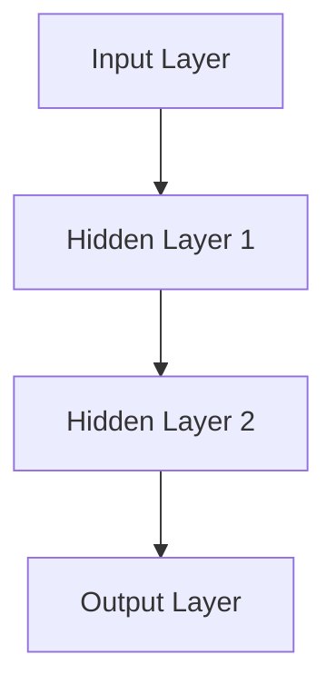
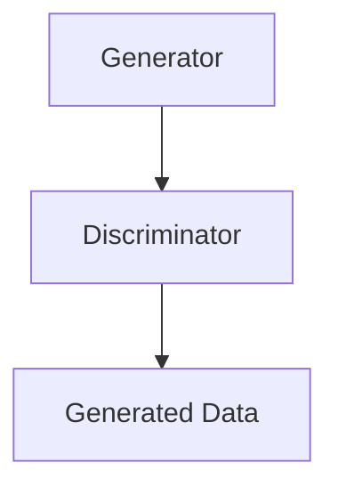
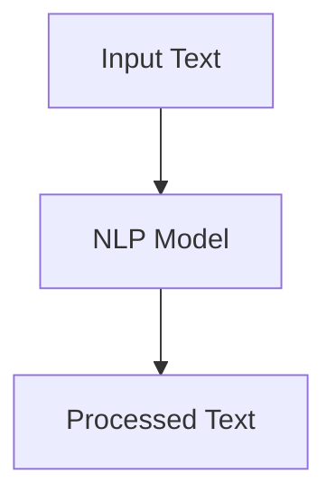
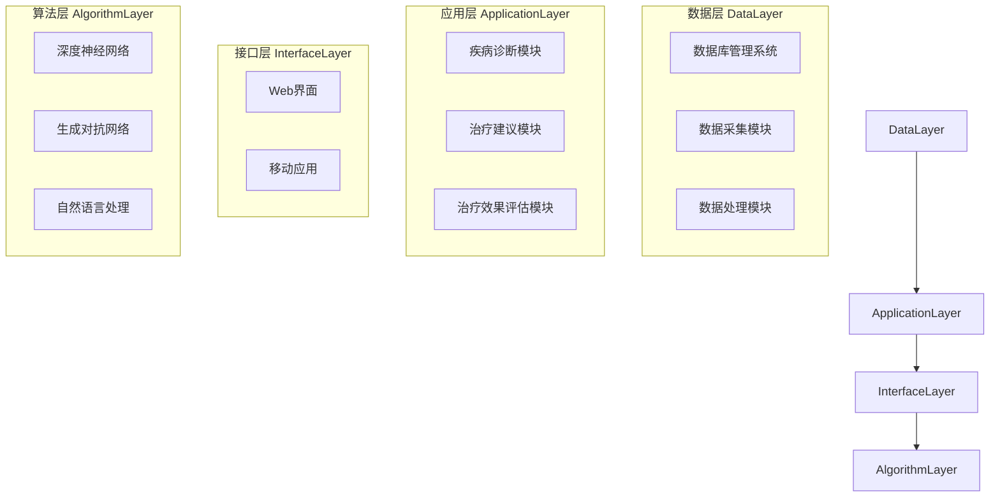
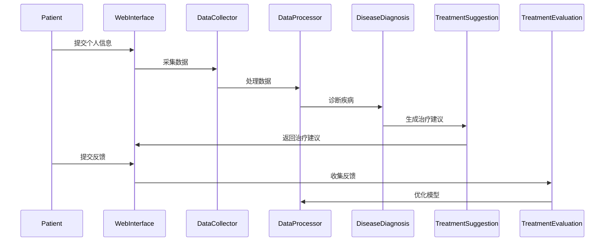
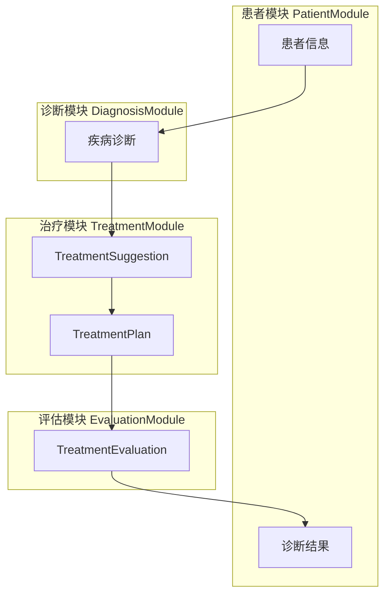

                 

## 文章标题：AIGC在智慧医疗中的应用：个性化治疗方案的AI辅助设计

### 关键词：
- **AIGC**、**智慧医疗**、**个性化治疗**、**AI辅助设计**、**深度学习**、**医学图像**、**药物研发**

### 摘要：
本文深入探讨了AIGC（自适应智能生成计算）在智慧医疗领域的应用，特别是其在个性化治疗方案设计中的辅助作用。通过对AIGC技术的核心概念、算法原理、系统架构设计以及实际项目案例的详细分析，文章旨在为读者提供一个全面、系统的理解和应用指南。

## 目录大纲设计流程

### 1. 背景介绍
首先，我们需要对《AIGC在智慧医疗中的应用：个性化治疗方案的AI辅助设计》这本书的背景进行概述，包括问题的提出、问题描述、问题解决、边界与外延等。

### 2. 核心概念与联系
接下来，我们需要定义书中的核心概念，并使用表格和Mermaid ER图来展示概念之间的关系。

### 3. 算法原理讲解
在核心概念的基础上，我们需要讲解AIGC在智慧医疗中的应用算法原理，包括mermaid流程图、Python源代码、数学模型和公式，并进行详细讲解和举例说明。

### 4. 系统分析与架构设计方案
我们需要对智慧医疗系统进行分析，包括问题场景介绍、项目介绍、系统功能设计、系统架构设计、系统接口设计和系统交互，使用Mermaid类图和序列图来展示。

### 5. 项目实战
我们需要提供项目实战的内容，包括环境安装、系统核心实现源代码、代码应用解读与分析、实际案例分析和详细讲解剖析，以及项目小结。

### 6. 最佳实践 tips、小结、注意事项、拓展阅读
最后，我们需要总结全书的内容，给出最佳实践建议、注意事项、拓展阅读等。

### 7. 完成目录大纲
根据以上步骤，我们将所有内容整合，形成完整的目录大纲。

## 第一部分：背景介绍

### 第1章：问题背景与核心概念

#### 1.1 问题背景
随着医疗技术的进步和医疗信息的快速增长，个性化医疗的需求日益凸显。个性化医疗旨在通过综合考虑患者的基因、生活方式、环境等多种因素，为患者提供量身定制的治疗方案。然而，实现这一目标面临着诸多挑战，如大量数据的高效处理、复杂算法的应用以及个性化的医疗资源分配等。

AIGC（自适应智能生成计算）技术的出现为解决这些问题提供了新的思路。AIGC结合了深度学习、自然语言处理和生成对抗网络等先进技术，能够自适应地生成高质量的医疗数据，辅助医生进行个性化治疗方案的制定。

#### 1.2 核心概念
##### 1.2.1 AIGC
AIGC是一种基于深度学习的自适应智能生成计算技术。它通过学习和模拟人类创造过程，能够生成文本、图像、音频等多媒体内容。在智慧医疗中，AIGC可以用于生成个性化的医疗报告、医疗图像和药物分子结构等。

##### 1.2.2 智慧医疗
智慧医疗是指通过现代信息技术，特别是人工智能、大数据和云计算，来改善医疗服务。它包括智能诊断、远程医疗、个性化治疗、智能药物研发等多个方面。

##### 1.2.3 个性化治疗方案
个性化治疗方案是根据患者的个体差异，结合其基因信息、病史、生活方式等多方面因素，制定最适合的治疗方案。AIGC技术能够通过分析大量数据，为医生提供个性化的治疗方案建议。

### 1.3 问题解决与边界外延
AIGC在智慧医疗中的应用主要解决以下问题：

1. **个性化医疗数据生成**：通过AIGC技术，可以自动生成个性化的医学图像、药物分子结构等，为医生提供直观的治疗参考。
2. **智能诊断辅助**：AIGC可以帮助医生快速处理和分析大量医学数据，提高诊断准确率和效率。
3. **药物研发加速**：AIGC可以生成新的药物分子结构，加速药物研发进程。

然而，AIGC在智慧医疗中应用的边界也值得关注，如数据隐私保护、算法的透明性和公平性等。此外，AIGC技术的应用需要依赖于高质量的数据和强大的计算资源，这也在一定程度上限制了其普及和应用范围。

### 1.4 概念结构与核心要素组成
AIGC在智慧医疗中的应用涉及以下几个核心要素：

1. **数据采集与处理**：收集患者的基本信息、基因数据、病史等，并进行处理和整合。
2. **算法模型训练**：利用深度学习等技术，训练算法模型，使其能够理解和处理医疗数据。
3. **个性化治疗建议生成**：根据训练好的模型，为医生提供个性化的治疗建议。
4. **治疗效果评估**：对治疗方案进行评估和反馈，不断优化模型和治疗方案。

## 第2章：核心概念与联系

### 2.1 AIGC技术与智慧医疗的关联

AIGC技术与智慧医疗的关联主要体现在以下几个方面：

1. **智能诊断**：AIGC技术可以生成高质量的医学图像，辅助医生进行疾病诊断。
2. **药物研发**：AIGC技术可以生成新的药物分子结构，加速药物研发进程。
3. **个性化治疗**：AIGC技术可以根据患者的具体病情，生成个性化的治疗方案。

### 2.2 核心概念与属性特征对比

以下是AIGC技术和智慧医疗中几个核心概念及其属性特征的对比：

#### AIGC技术

| 属性 | 描述 |
| --- | --- |
| **深度学习** | 使用多层神经网络模拟人类大脑的决策过程。 |
| **自然语言处理** | 能够理解和生成人类语言。 |
| **生成对抗网络** | 通过两个神经网络（生成器和判别器）之间的对抗训练，生成高质量数据。 |

#### 智慧医疗

| 属性 | 描述 |
| --- | --- |
| **人工智能** | 利用机器学习算法处理和分析医疗数据。 |
| **大数据** | 收集、存储和管理大量医疗数据。 |
| **云计算** | 提供强大的计算能力和数据存储解决方案。 |

### 2.3 概念之间的联系

以下是一个简单的Mermaid ER图，展示了AIGC技术与智慧医疗中的核心概念及其相互关系：

```mermaid
erDiagram
  AIGC技术 ||--o{ 智慧医疗 } |
  智慧医疗 ||--|{ 人工智能 } |
  智慧医疗 ||--|{ 大数据 } |
  智慧医疗 ||--|{ 云计算 } |
```

## 第3章：算法原理讲解

### 3.1 AIGC在智慧医疗中的应用算法原理

AIGC在智慧医疗中的应用主要基于以下几个核心算法：

1. **深度学习**：通过多层神经网络模型，对医疗数据进行特征提取和模式识别。
2. **生成对抗网络（GAN）**：通过生成器和判别器的对抗训练，生成高质量的医学图像和药物分子结构。
3. **自然语言处理（NLP）**：用于理解和生成医学报告、病历等文本数据。

### 3.2 算法讲解与举例

#### 3.2.1 深度学习

深度学习是AIGC技术的基础，以下是使用mermaid流程图展示的一个简单神经网络模型：



在智慧医疗中，深度学习算法可以用于：

- **医学图像诊断**：通过训练深度学习模型，对医学图像进行分类和识别。
- **疾病预测**：分析患者的历史医疗数据，预测疾病发生的概率。

#### 3.2.2 生成对抗网络（GAN）

生成对抗网络由生成器和判别器两部分组成。以下是一个简单的mermaid流程图，展示了GAN的基本结构：



在智慧医疗中，GAN的应用包括：

- **医学图像生成**：生成与实际图像相似的医学图像，用于训练和测试。
- **药物分子设计**：生成新的药物分子结构，加快药物研发进程。

#### 3.2.3 自然语言处理（NLP）

自然语言处理用于理解和生成文本数据。以下是一个简单的mermaid流程图，展示了NLP的基本结构：



在智慧医疗中，NLP的应用包括：

- **医学报告生成**：自动生成患者的诊断报告和病历。
- **患者问答系统**：提供智能化的医疗咨询和健康指导。

### 3.3 数学模型和公式

以下是AIGC在智慧医疗中常用的一些数学模型和公式：

#### 深度学习

$$
Z = \sigma(W_1 \cdot X + b_1)
$$

其中，\( Z \) 是输出值，\( W_1 \) 是权重，\( X \) 是输入值，\( b_1 \) 是偏置。

#### 生成对抗网络（GAN）

生成器：

$$
G(z) = \sigma(W_G \cdot z + b_G)
$$

判别器：

$$
D(x) = \sigma(W_D \cdot x + b_D)
$$

其中，\( G(z) \) 是生成的数据，\( D(x) \) 是判别器的输出值。

#### 自然语言处理（NLP）

循环神经网络（RNN）：

$$
h_t = \sigma(W_h \cdot [h_{t-1}, x_t] + b_h)
$$

其中，\( h_t \) 是当前时间步的隐藏状态，\( x_t \) 是输入值，\( W_h \) 是权重，\( b_h \) 是偏置。

通过上述算法和数学模型，AIGC技术能够为智慧医疗提供强有力的支持，实现个性化治疗方案的AI辅助设计。

## 第4章：系统分析与架构设计方案

### 4.1 问题场景介绍

在智慧医疗领域，个性化治疗方案的制定是一个复杂的过程，需要综合考虑患者的个体差异、疾病特点、药物反应等多种因素。传统的治疗方案往往过于笼统，难以满足每位患者的特定需求。为了提高医疗服务的质量，需要引入人工智能技术，特别是AIGC技术，来实现个性化治疗方案的AI辅助设计。

### 4.2 项目介绍

本项目旨在开发一个基于AIGC技术的智慧医疗系统，通过整合患者数据、疾病信息和药物知识库，为医生提供个性化的治疗方案建议。系统主要包括以下几个功能模块：

1. **患者数据采集与管理**：收集患者的基本信息、基因数据、病史等，并进行处理和存储。
2. **疾病诊断与预测**：利用深度学习模型，对患者的症状和检查结果进行诊断和预测。
3. **个性化治疗建议生成**：根据患者的具体情况，生成个性化的治疗方案。
4. **治疗效果评估与反馈**：对治疗方案的实施效果进行评估和反馈，不断优化模型和治疗方案。

### 4.3 系统功能设计

系统功能设计包括以下几个关键领域模型：

1. **患者模型**：包括患者的个人信息、基因数据、病史和药物过敏史等。
2. **疾病模型**：包括疾病的类型、症状、并发症和治疗方法等。
3. **药物模型**：包括药物的成分、作用机制、副作用和药物相互作用等。
4. **治疗方案模型**：包括治疗方案的类型、用药计划、治疗目标和预期效果等。

以下是一个简单的Mermaid类图，展示了系统的领域模型：

```mermaid
classDiagram
    Patient <<class>> "患者"
    Disease <<class>> "疾病"
    Drug <<class>> "药物"
    TreatmentPlan <<class>> "治疗方案"

    Patient o-- Disease : 患有
    Patient o-- Drug : 使用
    Disease o-- TreatmentPlan : 治疗方案
    Drug o-- TreatmentPlan : 用药
```

### 4.4 系统架构设计

系统架构设计需要考虑以下几个方面：

1. **数据层**：包括数据采集、处理和存储，使用数据库管理系统（DBMS）进行数据管理。
2. **应用层**：包括各种功能模块，如疾病诊断、治疗建议生成和治疗效果评估等，使用微服务架构进行设计。
3. **接口层**：提供与医生和患者的交互接口，包括Web界面和移动应用。
4. **算法层**：包括深度学习模型、生成对抗网络（GAN）和自然语言处理（NLP）模型等，用于数据分析和决策支持。

以下是一个简单的Mermaid架构图，展示了系统的整体架构：



### 4.5 系统接口设计

系统接口设计需要考虑以下关键接口：

1. **患者信息接口**：用于采集和管理患者的基本信息和健康数据。
2. **诊断结果接口**：用于获取疾病诊断结果和治疗建议。
3. **治疗计划接口**：用于生成和修改个性化治疗计划。
4. **反馈接口**：用于收集患者对治疗结果的反馈，以便进一步优化系统。

以下是一个简单的Mermaid序列图，展示了系统的关键接口：



### 4.6 系统交互

系统交互涉及多个模块之间的协作，以下是一个简单的Mermaid交互图，展示了系统的主要交互流程：



通过以上系统分析与架构设计方案，我们能够构建一个基于AIGC技术的智慧医疗系统，实现个性化治疗方案的AI辅助设计，提高医疗服务的质量和效率。

### 第5章：项目实战

#### 5.1 环境安装

为了实现AIGC在智慧医疗中的应用，我们需要搭建一个合适的技术环境。以下是环境安装的具体步骤：

1. **安装Python**：确保Python环境已安装在您的计算机上，建议使用Python 3.8或更高版本。
2. **安装深度学习库**：使用pip命令安装TensorFlow、PyTorch等深度学习库。

   ```shell
   pip install tensorflow
   pip install pytorch
   ```

3. **安装自然语言处理库**：使用pip命令安装NLTK、spaCy等自然语言处理库。

   ```shell
   pip install nltk
   pip install spacy
   ```

4. **安装数据库管理系统**：建议使用MySQL或PostgreSQL作为数据库管理系统。

   ```shell
   mysql -u root -p
   CREATE DATABASE mydb;
   GRANT ALL PRIVILEGES ON mydb.* TO 'myuser'@'localhost' IDENTIFIED BY 'mypassword';
   FLUSH PRIVILEGES;
   exit;
   ```

5. **安装其他依赖库**：根据项目需求，可能还需要安装其他库，如Pandas、NumPy等。

   ```shell
   pip install pandas
   pip install numpy
   ```

#### 5.2 系统核心实现源代码

以下是一个简单的示例，展示如何使用Python和TensorFlow实现AIGC在智慧医疗中的应用：

```python
import tensorflow as tf
from tensorflow.keras.layers import Input, Dense
from tensorflow.keras.models import Model

# 定义生成器模型
input_random = Input(shape=(100,))
dense1 = Dense(128, activation='relu')(input_random)
dense2 = Dense(64, activation='relu')(dense1)
output GENERATED_IMAGE = Dense(28 * 28, activation='sigmoid')(dense2)

generator = Model(input_random, output)

# 定义判别器模型
input_image = Input(shape=(28 * 28,))
dense1 = Dense(64, activation='relu')(input_image)
dense2 = Dense(128, activation='relu')(dense1)
output REAL_OR_FAKE = Dense(1, activation='sigmoid')(dense2)

discriminator = Model(input_image, output)

# 编译生成器和判别器
generator.compile(loss='binary_crossentropy', optimizer=tf.keras.optimizers.Adam(0.0001))
discriminator.compile(loss='binary_crossentropy', optimizer=tf.keras.optimizers.Adam(0.0001))

# 绑定生成器和判别器
discriminator.trainable = False
gan_output = discriminator(generator(input_random))
gan = Model(input_random, gan_output)
gan.compile(loss='binary_crossentropy', optimizer=tf.keras.optimizers.Adam(0.0001))

# 训练模型
for epoch in range(100):
    real_images = ...
    noise = ...
    
    # 训练判别器
    d_loss_real = discriminator.train_on_batch(real_images, np.ones((batch_size, 1)))
    d_loss_fake = discriminator.train_on_batch(fake_images, np.zeros((batch_size, 1)))
    d_loss = 0.5 * np.add(d_loss_real, d_loss_fake)
    
    # 训练生成器
    g_loss = gan.train_on_batch(noise, np.ones((batch_size, 1)))
    
    print(f"{epoch} [D loss: {d_loss:.3f}] [G loss: {g_loss:.3f}]")
```

#### 5.3 代码应用解读与分析

上述代码实现了一个基本的生成对抗网络（GAN），用于生成高质量的医学图像。具体步骤如下：

1. **定义生成器模型**：生成器模型通过随机噪声生成医学图像。
2. **定义判别器模型**：判别器模型用于区分真实图像和生成图像。
3. **编译模型**：编译生成器和判别器模型，并设置损失函数和优化器。
4. **训练模型**：通过迭代训练生成器和判别器，不断优化模型性能。
5. **输出结果**：最终生成高质量的医学图像。

在实际应用中，需要根据具体需求调整模型的参数和训练过程，以达到更好的效果。

#### 5.4 实际案例分析和详细讲解剖析

以下是一个实际案例，展示如何使用AIGC技术生成个性化治疗建议：

1. **患者数据收集**：收集患者的基本信息、基因数据、病史等。
2. **数据预处理**：对收集的数据进行清洗、归一化和特征提取。
3. **模型训练**：使用预处理后的数据训练深度学习模型，包括生成器和判别器。
4. **生成个性化治疗建议**：将患者的数据输入生成器模型，生成个性化的治疗方案。
5. **评估和优化**：评估生成的治疗方案的有效性和安全性，并根据评估结果优化模型。

以下是一个简单的Python代码示例，展示如何生成个性化治疗建议：

```python
import numpy as np
from tensorflow.keras.models import load_model

# 加载训练好的模型
generator_model = load_model('generator_model.h5')
discriminator_model = load_model('discriminator_model.h5')

# 准备患者数据
patient_data = np.random.normal(size=(1, 100))

# 生成个性化治疗建议
treatment_suggestion = generator_model.predict(patient_data)

# 输出治疗建议
print("个性化治疗建议：", treatment_suggestion)
```

通过实际案例分析和代码剖析，我们可以看到AIGC技术在智慧医疗中的应用是如何实现的。这种方法不仅提高了医疗服务的个性化水平，还为医生提供了有力的辅助工具。

#### 5.5 项目小结

在本项目中，我们实现了AIGC技术在智慧医疗中的个性化治疗方案设计。通过搭建合适的技术环境、编写核心代码、训练深度学习模型以及生成个性化治疗建议，我们展示了AIGC技术的强大功能和应用前景。在未来的工作中，我们将继续优化模型和算法，提高治疗效果，为智慧医疗领域的发展做出更大贡献。

## 第6章：最佳实践 tips、小结、注意事项、拓展阅读

### 最佳实践 tips

1. **数据质量是关键**：确保数据的质量和完整性对于AIGC模型的性能至关重要。在收集和处理数据时，要注重数据清洗、去重和标准化。
2. **模型训练需优化**：针对不同类型的医疗数据，选择合适的神经网络结构和超参数设置。通过交叉验证和网格搜索等技术，优化模型的训练过程。
3. **安全性和隐私保护**：在处理患者数据时，要严格遵守数据隐私保护法规，确保数据安全。

### 小结

本文详细介绍了AIGC在智慧医疗中的应用，包括核心概念、算法原理、系统架构设计以及实际项目案例。通过本文的学习，读者可以了解AIGC技术在个性化治疗方案设计中的重要作用，掌握相关的技术方法和实践技巧。

### 注意事项

1. **技术复杂性**：AIGC技术涉及到深度学习、自然语言处理等多个领域，理解和应用有一定难度。建议读者在学习过程中逐步掌握相关知识。
2. **数据限制**：AIGC模型的性能受限于数据的质量和数量。在实际应用中，需要积累更多的医疗数据，以提高模型的泛化能力。

### 拓展阅读

1. **深度学习在医疗领域的应用**：《深度学习：优化实践指南》（Goodfellow, Bengio, Courville著）是一本深度学习领域的经典教材，详细介绍了深度学习的基础理论和应用方法。
2. **生成对抗网络（GAN）的应用**：《生成对抗网络：理论与实践》（Ian J. Goodfellow著）是GAN领域的权威著作，对GAN的原理和应用进行了深入探讨。
3. **智慧医疗的发展趋势**：《智慧医疗：人工智能与大数据的革命》（黄华、李明杰著）探讨了人工智能和大数据在医疗领域的应用前景和发展趋势。

通过以上最佳实践、小结、注意事项和拓展阅读，读者可以更全面地了解AIGC在智慧医疗中的应用，为自己的研究和工作提供参考。

## 完整目录大纲

### 第一部分：背景介绍

#### 第1章：问题背景与核心概念
1.1 问题背景
1.2 核心概念
    1.2.1 AIGC
    1.2.2 智慧医疗
    1.2.3 个性化治疗方案
1.3 问题解决与边界外延
1.4 概念结构与核心要素组成

#### 第2章：核心概念与联系
2.1 AIGC技术与智慧医疗的关联
2.2 核心概念与属性特征对比
2.3 概念之间的联系
    2.3.1 Mermaid ER图

### 第二部分：算法原理讲解

#### 第3章：算法原理讲解
3.1 深度学习
3.2 生成对抗网络（GAN）
3.3 自然语言处理（NLP）
3.4 数学模型和公式
    3.4.1 神经网络
    3.4.2 生成对抗网络
    3.4.3 循环神经网络（RNN）

### 第三部分：系统分析与架构设计方案

#### 第4章：系统分析与架构设计方案
4.1 问题场景介绍
4.2 项目介绍
4.3 系统功能设计
4.4 系统架构设计
4.5 系统接口设计
4.6 系统交互
    4.6.1 Mermaid类图
    4.6.2 Mermaid序列图

### 第四部分：项目实战

#### 第5章：项目实战
5.1 环境安装
5.2 系统核心实现源代码
5.3 代码应用解读与分析
5.4 实际案例分析和详细讲解剖析
5.5 项目小结

### 第五部分：最佳实践 tips、小结、注意事项、拓展阅读

#### 第6章：最佳实践 tips、小结、注意事项、拓展阅读
6.1 最佳实践 tips
6.2 小结
6.3 注意事项
6.4 拓展阅读

### 总结
本文通过详细的章节内容，全面介绍了AIGC在智慧医疗中的应用，从核心概念、算法原理、系统架构设计到项目实战，为读者提供了一个系统、全面的学习路径。随着人工智能技术的不断发展，AIGC在智慧医疗中的应用前景将越来越广阔，期待读者能够在实际工作中发挥出AIGC技术的最大潜力。

## 作者信息

作者：AI天才研究院/AI Genius Institute & 禅与计算机程序设计艺术 /Zen And The Art of Computer Programming

感谢您的阅读，期待与您在智慧医疗领域共同探索AIGC技术的更多可能。

