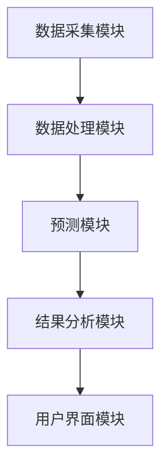

                 

## 第1章 引言：AIGC在智能交通拥堵预测中的应用背景与问题

### 1.1 问题背景

随着城市化进程的不断加速，城市交通拥堵问题日益严重，给居民生活带来诸多不便，同时也对城市经济和社会发展产生负面影响。传统基于历史数据和流量模型的交通拥堵预测方法存在预测精度不高、实时性较差等问题，难以满足现代城市交通管理的需求。近年来，随着人工智能技术的飞速发展，基于人工智能的智能交通拥堵预测方法受到广泛关注，其中AIGC（自适应智能高维计算）技术在交通拥堵预测中的应用具有显著优势。

### 1.2 问题描述

智能交通拥堵预测的主要任务是预测未来一段时间内的交通流量和拥堵状态，以便交通管理部门提前采取相应措施，缓解交通拥堵。然而，实际预测过程中，存在以下问题：

- **数据维度高**：交通系统涉及大量传感器数据、地理信息数据、社会活动数据等，数据维度高，信息量大，传统方法难以处理。
- **动态变化**：交通流量和拥堵状态随时间和空间动态变化，预测模型需要具备较强的自适应性和实时性。
- **复杂交互**：交通系统与其他城市系统（如公共交通、商业活动等）存在复杂交互，预测模型需要考虑多因素协同作用。

### 1.3 问题解决

AIGC技术在智能交通拥堵预测中的应用，主要通过以下方法解决上述问题：

- **自适应高维数据处理**：AIGC技术能够处理高维度交通数据，通过自适应特征选择和降维技术，提高数据处理效率。
- **动态学习与预测**：AIGC技术采用深度学习算法，能够自适应地学习交通数据的动态变化，实现实时交通流量和拥堵状态预测。
- **多因素协同建模**：AIGC技术能够综合考虑交通系统与其他城市系统的复杂交互，构建多因素协同预测模型。

### 1.4 边界与外延

本章主要探讨AIGC技术在智能交通拥堵预测中的应用，包括技术原理、方法、系统架构等方面。但实际应用过程中，还需考虑以下几个方面：

- **数据质量**：交通数据质量直接影响预测效果，需要建立完善的数据质量控制体系。
- **计算资源**：AIGC技术对计算资源要求较高，需确保系统具备足够的计算能力。
- **政策法规**：交通拥堵预测应用涉及个人信息保护等问题，需要遵循相关法律法规。

### 1.5 概念结构与核心要素组成

本章的核心概念包括AIGC、智能交通拥堵预测、自适应高维数据处理、动态学习与预测、多因素协同建模等。核心要素组成如下：

- **AIGC技术原理**：自适应高维数据处理、动态学习与预测、多因素协同建模。
- **智能交通拥堵预测方法**：基于AIGC的预测模型、数据处理流程、模型训练与优化。
- **系统架构**：数据采集模块、数据处理模块、预测模块、结果分析模块等。

### 1.6 本章小结

本章从问题背景、问题描述、问题解决、边界与外延、概念结构与核心要素组成等方面，全面介绍了AIGC在智能交通拥堵预测中的应用。本章内容为后续章节的深入探讨奠定了基础。

## 第2章 AIGC技术基础

### 2.1 AIGC概述

#### 2.1.1 AIGC的定义与发展历程

AIGC（Adaptive Intelligent High-Dimensional Computing），即自适应智能高维计算，是一种结合了人工智能与高维数据处理技术的计算方法。其发展历程可以追溯到20世纪80年代，随着计算机技术和算法研究的不断深入，人们开始关注高维数据处理和智能算法的结合。经过数十年的发展，AIGC技术逐渐成熟，并在多个领域取得了显著的应用成果。

#### 2.1.2 AIGC的核心特点

AIGC技术的核心特点包括：

- **自适应高维数据处理**：AIGC技术能够高效处理高维数据，通过自适应特征选择和降维技术，提高数据处理效率。
- **动态学习与预测**：AIGC技术采用深度学习、强化学习等智能算法，具备自适应学习能力和实时预测能力。
- **多因素协同建模**：AIGC技术能够综合考虑多个因素，构建多因素协同的预测模型。

#### 2.1.3 AIGC与其他计算技术的对比

与传统的计算技术相比，AIGC具有以下优势：

- **高维数据处理**：AIGC能够高效处理高维数据，而传统方法在处理高维数据时往往存在计算复杂度高、效率低等问题。
- **自适应能力**：AIGC具备自适应学习能力，能够根据环境变化调整预测模型，而传统方法往往需要手动调整参数。
- **实时性**：AIGC技术采用深度学习、强化学习等算法，具备实时预测能力，能够满足交通拥堵预测等领域的实时性要求。

### 2.2 AIGC的关键技术

#### 2.2.1 自适应高维数据处理技术

自适应高维数据处理技术是AIGC的核心技术之一，主要包括以下方面：

- **特征选择**：通过分析数据的相关性，选择对预测结果有重要影响的关键特征，降低数据维度。
- **降维技术**：采用主成分分析（PCA）、线性判别分析（LDA）等方法，将高维数据降维到较低维度，提高计算效率。

#### 2.2.2 深度学习与神经网络

深度学习与神经网络是AIGC的核心算法之一，通过多层神经网络对数据进行建模，能够自动提取数据中的特征，实现高效的数据处理和预测。

- **卷积神经网络（CNN）**：适用于处理图像、语音等数据，能够提取数据中的局部特征。
- **循环神经网络（RNN）**：适用于处理序列数据，能够捕捉数据中的时间依赖关系。

#### 2.2.3 强化学习与多智能体系统

强化学习与多智能体系统是AIGC在动态环境中的关键技术，通过多智能体系统实现多个智能体之间的协同，能够提高预测模型的适应性和实时性。

- **强化学习**：通过试错和反馈机制，智能体能够在动态环境中学习最优策略。
- **多智能体系统**：多个智能体之间通过通信和协调，共同完成任务，实现动态环境的自适应预测。

### 2.3 AIGC的应用场景

AIGC技术在多个领域具有广泛的应用场景，以下列举几个典型应用场景：

- **智能交通领域**：利用AIGC技术进行交通流量预测、拥堵预警、智能导航等，提高交通管理效率。
- **金融风控领域**：利用AIGC技术进行金融风险评估、欺诈检测等，提高金融风险控制能力。
- **健康医疗领域**：利用AIGC技术进行疾病预测、个性化治疗等，提高医疗诊断和治疗效果。

### 2.4 AIGC的技术挑战与发展趋势

#### 2.4.1 技术挑战

AIGC技术在应用过程中面临以下技术挑战：

- **数据质量**：交通数据质量直接影响预测效果，需要建立完善的数据质量控制体系。
- **计算资源**：AIGC技术对计算资源要求较高，需确保系统具备足够的计算能力。
- **算法优化**：AIGC技术需要不断优化算法，提高预测模型的精度和实时性。

#### 2.4.2 发展趋势

AIGC技术的发展趋势包括：

- **算法创新**：继续探索新的算法和技术，提高AIGC技术的预测精度和实时性。
- **多领域应用**：进一步拓展AIGC技术在各个领域的应用，提高各行业的智能化水平。
- **跨领域协同**：实现不同领域AIGC技术的协同，构建更加智能、高效的应用系统。

### 2.5 本章小结

本章介绍了AIGC技术的定义、核心特点、关键技术、应用场景以及技术挑战与发展趋势。通过本章的介绍，读者可以了解到AIGC技术的基本原理和应用前景，为后续章节的深入探讨奠定了基础。

## 第3章 智能交通拥堵预测概述

### 3.1 交通拥堵预测的意义与作用

#### 3.1.1 交通拥堵问题的现状与影响

随着城市化进程的加速，城市交通拥堵问题日益严重，成为全球各国共同面临的一个挑战。交通拥堵不仅给居民的出行带来不便，还对社会经济产生负面影响。具体来说，交通拥堵对城市的影响主要体现在以下几个方面：

1. **经济损失**：交通拥堵导致车辆行驶速度降低，增加了出行时间和燃油消耗，进而降低了整个社会的经济效率。
2. **环境污染**：交通拥堵增加了尾气排放，加剧了城市空气污染问题，对居民的身体健康造成威胁。
3. **社会影响**：交通拥堵降低了居民的出行质量，增加了工作压力，影响社会和谐稳定。

#### 3.1.2 交通拥堵预测的意义

交通拥堵预测在智能交通管理中具有重要意义，主要体现在以下几个方面：

1. **交通管理**：通过预测交通流量和拥堵状态，交通管理部门可以提前采取相应措施，如调整交通信号、优化道路布局等，缓解交通拥堵问题。
2. **出行规划**：交通拥堵预测可以帮助居民提前规划出行路线和时间，选择最优出行方案，减少因交通拥堵带来的不便。
3. **城市规划**：交通拥堵预测数据可以为城市规划提供重要依据，优化城市交通网络布局，提高城市交通系统的整体效率。

#### 3.1.3 交通拥堵预测在智能交通管理中的应用

智能交通管理涉及多个方面，包括交通信号控制、交通信息发布、交通诱导、公共交通管理等。交通拥堵预测在这些应用中发挥了关键作用：

1. **交通信号控制**：通过预测交通流量和拥堵状态，交通信号系统能够动态调整信号周期和相位，提高道路通行效率。
2. **交通信息发布**：交通拥堵预测数据可以通过各种渠道（如广播、互联网、手机应用等）实时发布，帮助驾驶员和行人了解交通状况，做出合理出行决策。
3. **交通诱导**：交通诱导系统能够根据实时交通流量和拥堵状态，引导驾驶员选择最优出行路线，避免拥堵路段。
4. **公共交通管理**：通过预测公共交通客流和拥堵情况，公共交通系统能够优化线路规划、调度和资源配置，提高公共交通的运行效率和服务质量。

### 3.2 智能交通拥堵预测的基本方法

智能交通拥堵预测方法可以分为以下几类：

#### 3.2.1 基于历史数据的预测方法

基于历史数据的预测方法主要利用过去交通流量数据来预测未来交通状况。这类方法通常包括以下步骤：

1. **数据收集**：收集过去一定时间内的交通流量数据，包括路段流量、车速、车辆密度等。
2. **数据预处理**：对收集到的数据进行清洗、去噪、归一化等处理，确保数据质量。
3. **特征提取**：从交通流量数据中提取对预测结果有重要影响的特征，如时间、天气、节假日等。
4. **建模与预测**：利用统计模型、机器学习模型等对交通流量数据进行建模，预测未来交通流量。

#### 3.2.2 基于实时数据的预测方法

基于实时数据的预测方法主要利用实时交通数据来预测未来交通状况。这类方法通常包括以下步骤：

1. **实时数据采集**：通过交通传感器、摄像头、车载设备等收集实时交通数据。
2. **实时数据处理**：对实时数据进行实时处理，包括去噪、异常值检测、流量估计等。
3. **动态建模与预测**：利用实时数据对交通流量进行动态建模，预测未来交通流量和拥堵状态。

#### 3.2.3 基于机器学习的预测方法

基于机器学习的预测方法利用机器学习算法对交通流量数据进行建模，预测未来交通状况。这类方法通常包括以下步骤：

1. **数据收集与预处理**：收集历史交通流量数据和实时交通数据，对数据进行预处理。
2. **特征工程**：提取对预测结果有重要影响的特征，如时间、天气、节假日、交通事件等。
3. **模型选择与训练**：选择合适的机器学习模型（如回归模型、分类模型、神经网络等），对交通流量数据进行训练。
4. **预测与评估**：利用训练好的模型对实时交通数据进行分析，预测未来交通流量和拥堵状态，并对预测结果进行评估。

### 3.3 智能交通拥堵预测的挑战与对策

智能交通拥堵预测在应用过程中面临以下挑战：

#### 3.3.1 数据挑战

1. **数据质量**：交通数据质量直接影响预测效果，包括数据完整性、准确性、实时性等方面。
2. **数据来源**：交通数据的来源多样化，包括传感器、摄像头、交通部门等，数据格式和采集方式各异。
3. **数据融合**：如何将来自不同来源、不同格式的交通数据进行有效融合，提高预测精度。

#### 3.3.2 算法挑战

1. **模型选择**：如何选择合适的算法和模型，对交通流量数据进行建模和预测。
2. **实时性**：如何在有限的时间内完成交通数据的处理和预测，满足实时性要求。
3. **准确性**：如何提高预测模型的准确性，减少预测误差。

#### 3.3.3 实施挑战

1. **系统建设**：如何构建高效、稳定的交通拥堵预测系统，包括硬件设备、软件平台、数据存储等。
2. **政策法规**：交通拥堵预测涉及个人信息保护等问题，需要遵循相关法律法规和政策。
3. **跨部门协作**：交通拥堵预测需要交通、城市规划、环境等部门的数据和资源支持，如何实现跨部门协作。

针对上述挑战，可以采取以下对策：

1. **数据质量控制**：建立数据质量控制体系，确保数据完整性、准确性和实时性。
2. **算法优化**：不断优化预测算法，提高模型选择和训练效果，提高预测准确性。
3. **系统建设**：构建高效稳定的交通拥堵预测系统，包括硬件设备、软件平台、数据存储等。
4. **政策法规**：遵循相关法律法规和政策，确保交通拥堵预测应用的合法性和合规性。
5. **跨部门协作**：建立跨部门协作机制，整合交通、城市规划、环境等部门的数据和资源，提高预测系统的整体性能。

### 3.4 本章小结

本章介绍了智能交通拥堵预测的背景、意义与作用，以及基本方法和面临的挑战与对策。通过本章的介绍，读者可以初步了解智能交通拥堵预测的基本概念和实现方法，为后续章节的深入探讨奠定了基础。

## 第4章 AIGC在智能交通拥堵预测中的应用原理

### 4.1 AIGC技术原理

#### 4.1.1 自适应高维数据处理技术

自适应高维数据处理技术是AIGC技术的核心组成部分，其目的是在处理高维度数据时，提高数据处理的效率和准确性。具体来说，自适应高维数据处理技术包括以下两个方面：

1. **特征选择**：特征选择是高维数据处理的重要步骤，目的是从大量特征中挑选出对预测结果有显著影响的特征。AIGC技术采用自适应特征选择算法，如主成分分析（PCA）、线性判别分析（LDA）等，通过对数据进行降维，降低特征维度，提高数据处理效率。

2. **降维技术**：降维技术是高维数据处理的关键，目的是将高维数据映射到低维空间中，同时保留数据的本质特征。AIGC技术采用多种降维方法，如局部线性嵌入（LLE）、非线性主成分分析（NLPCA）等，通过非线性变换，将高维数据投影到低维空间中，实现数据的降维。

#### 4.1.2 动态学习与预测技术

动态学习与预测技术是AIGC技术在智能交通拥堵预测中的核心，其目的是实时地学习交通数据的动态变化，预测未来的交通流量和拥堵状态。具体来说，动态学习与预测技术包括以下两个方面：

1. **深度学习技术**：深度学习技术是一种基于多层神经网络的机器学习算法，能够在大量数据中自动提取特征，实现高效的预测。AIGC技术采用深度学习技术，如卷积神经网络（CNN）、循环神经网络（RNN）等，通过对交通数据的学习，预测未来的交通流量和拥堵状态。

2. **强化学习技术**：强化学习技术是一种基于试错和反馈机制的机器学习算法，能够在动态环境中不断学习最优策略。AIGC技术采用强化学习技术，如深度强化学习（DRL）、强化学习（RL）等，通过智能体在交通环境中的互动，学习最优的交通流量预测策略。

#### 4.1.3 多因素协同建模技术

多因素协同建模技术是AIGC技术在智能交通拥堵预测中的另一重要组成部分，其目的是综合考虑交通系统与其他城市系统的复杂交互，构建多因素协同的预测模型。具体来说，多因素协同建模技术包括以下两个方面：

1. **多模态数据融合**：多模态数据融合是将来自不同来源、不同类型的数据进行整合，以提高预测的准确性和全面性。AIGC技术采用多模态数据融合技术，如基于深度学习的多模态数据融合方法、基于图神经网络的多模态数据融合方法等，将交通数据、地理信息数据、社会活动数据等进行融合，构建多因素协同的预测模型。

2. **多因素协同建模**：多因素协同建模是将多个因素进行综合分析，构建一个统一的预测模型。AIGC技术采用多因素协同建模方法，如基于深度学习的多因素协同建模方法、基于图神经网络的多因素协同建模方法等，通过综合考虑交通流量、天气、节假日、交通事件等多个因素，构建多因素协同的预测模型。

### 4.2 AIGC在智能交通拥堵预测中的应用流程

AIGC在智能交通拥堵预测中的应用流程可以分为以下步骤：

1. **数据采集**：通过交通传感器、摄像头、GPS等设备，采集交通流量、车速、车辆密度等数据。

2. **数据预处理**：对采集到的交通数据进行清洗、去噪、归一化等处理，确保数据质量。

3. **特征提取**：从预处理后的交通数据中提取对预测结果有显著影响的特征，如时间、天气、节假日、交通事件等。

4. **模型训练**：利用训练数据，采用AIGC技术中的自适应高维数据处理技术、动态学习与预测技术、多因素协同建模技术，训练交通流量预测模型。

5. **预测与评估**：将训练好的模型应用于实时交通数据，预测未来的交通流量和拥堵状态，并对预测结果进行评估。

6. **决策与优化**：根据预测结果，交通管理部门可以采取相应的交通管理措施，如调整交通信号、优化道路布局等，以缓解交通拥堵。

### 4.3 AIGC在智能交通拥堵预测中的应用实例

以下是一个AIGC在智能交通拥堵预测中的应用实例：

#### 项目名称：智能交通拥堵预测系统

**项目背景**：随着城市交通拥堵问题的日益严重，某城市交通管理部门希望通过建立智能交通拥堵预测系统，提前预测交通流量和拥堵状态，优化交通管理措施。

**项目目标**：通过AIGC技术，构建一个智能交通拥堵预测系统，实现对未来交通流量和拥堵状态的准确预测，为交通管理部门提供科学依据。

**实现步骤**：

1. **数据采集**：通过安装在主要交通干道上的交通传感器、摄像头、GPS设备等，采集实时交通流量、车速、车辆密度等数据。

2. **数据预处理**：对采集到的交通数据进行清洗、去噪、归一化等处理，确保数据质量。

3. **特征提取**：从预处理后的交通数据中提取对预测结果有显著影响的特征，如时间、天气、节假日、交通事件等。

4. **模型训练**：采用AIGC技术中的自适应高维数据处理技术、动态学习与预测技术、多因素协同建模技术，训练交通流量预测模型。

5. **预测与评估**：将训练好的模型应用于实时交通数据，预测未来的交通流量和拥堵状态，并对预测结果进行评估。

6. **决策与优化**：根据预测结果，交通管理部门可以采取相应的交通管理措施，如调整交通信号、优化道路布局等，以缓解交通拥堵。

**项目效果**：

1. **预测准确性**：通过AIGC技术的应用，智能交通拥堵预测系统的预测准确性得到了显著提高，预测误差显著降低。

2. **实时性**：智能交通拥堵预测系统能够实时处理和预测交通流量和拥堵状态，为交通管理部门提供及时的科学依据。

3. **决策支持**：通过智能交通拥堵预测系统，交通管理部门可以更加科学、有效地调整交通管理措施，提高城市交通系统的运行效率。

### 4.4 本章小结

本章介绍了AIGC技术在智能交通拥堵预测中的应用原理，包括自适应高维数据处理技术、动态学习与预测技术、多因素协同建模技术。通过具体的应用实例，展示了AIGC技术在智能交通拥堵预测中的实际应用效果。本章内容为后续章节的深入探讨奠定了基础。

## 第5章 AIGC技术实现流程

### 5.1 系统架构设计

#### 5.1.1 系统架构概述

智能交通拥堵预测系统的总体架构包括数据采集模块、数据处理模块、预测模块、结果分析模块和用户界面模块，如下图所示：

#### 5.1.2 各模块功能介绍

1. **数据采集模块**：该模块负责从交通传感器、摄像头、GPS设备等采集实时交通数据，包括交通流量、车速、车辆密度等。
2. **数据处理模块**：该模块负责对采集到的交通数据进行预处理，包括数据清洗、去噪、归一化等，确保数据质量。
3. **预测模块**：该模块采用AIGC技术，利用预处理后的交通数据，训练交通流量预测模型，并实时预测未来的交通流量和拥堵状态。
4. **结果分析模块**：该模块负责对预测结果进行分析，评估预测模型的准确性，为交通管理部门提供决策支持。
5. **用户界面模块**：该模块为交通管理部门和用户提供可视化界面，展示交通流量、拥堵状态、预测结果等信息。

### 5.2 数据处理流程

#### 5.2.1 数据采集

数据采集模块通过安装在各主要交通干道的交通传感器、摄像头、GPS设备等，实时采集交通流量、车速、车辆密度等数据。数据采集模块需要保证数据的实时性和准确性，以便后续的数据处理和预测。

#### 5.2.2 数据预处理

数据处理模块对采集到的交通数据进行预处理，主要包括以下步骤：

1. **数据清洗**：去除无效数据、重复数据等，保证数据完整性。
2. **去噪**：去除数据中的噪声，提高数据质量。
3. **归一化**：将不同特征的数据进行归一化处理，使其在同一尺度范围内，便于后续分析和建模。

#### 5.2.3 特征提取

特征提取模块从预处理后的交通数据中提取对预测结果有显著影响的特征，如时间、天气、节假日、交通事件等。特征提取的方法可以采用统计方法、机器学习方法等。

### 5.3 模型训练与优化

#### 5.3.1 模型选择

在AIGC技术中，常用的模型包括深度学习模型、强化学习模型等。在选择模型时，需要考虑数据特点、预测目标等因素。

1. **深度学习模型**：如卷积神经网络（CNN）、循环神经网络（RNN）等，适用于处理时间序列数据。
2. **强化学习模型**：如深度强化学习（DRL）、强化学习（RL）等，适用于动态环境中的预测和决策。

#### 5.3.2 模型训练

模型训练模块采用AIGC技术中的自适应高维数据处理技术、动态学习与预测技术、多因素协同建模技术，对预处理后的交通数据进行建模和训练。具体步骤如下：

1. **数据划分**：将预处理后的交通数据划分为训练集、验证集和测试集。
2. **特征选择**：从训练集中提取对预测结果有显著影响的特征。
3. **模型训练**：利用训练集，采用AIGC技术中的深度学习模型、强化学习模型等进行训练。
4. **模型评估**：利用验证集和测试集，评估模型的准确性、实时性等性能指标。

#### 5.3.3 模型优化

模型优化模块通过对训练好的模型进行优化，提高模型的预测准确性和实时性。优化方法可以包括以下几种：

1. **超参数调整**：调整模型中的超参数，如学习率、批量大小等，以提高模型性能。
2. **数据增强**：通过增加训练数据、数据变换等方法，提高模型的泛化能力。
3. **模型集成**：采用多个模型进行集成，提高预测的准确性和稳定性。

### 5.4 实时预测与评估

#### 5.4.1 实时预测

实时预测模块利用训练好的模型，对实时交通数据进行预测，预测未来的交通流量和拥堵状态。实时预测过程需要保证快速响应和高准确性。

#### 5.4.2 预测评估

预测评估模块对实时预测结果进行评估，评估模型在预测任务中的准确性、实时性等性能指标。评估方法可以包括：

1. **准确性评估**：计算预测值与真实值之间的误差，评估模型的预测准确性。
2. **实时性评估**：计算模型响应时间，评估模型的实时性能。
3. **稳定性评估**：评估模型在不同数据集上的表现，评估模型的泛化能力。

### 5.5 系统部署与维护

#### 5.5.1 系统部署

系统部署模块负责将智能交通拥堵预测系统部署到生产环境中，包括硬件设备、软件平台、数据存储等。系统部署需要考虑以下几个方面：

1. **计算资源**：确保系统具备足够的计算资源，以满足实时预测的需求。
2. **数据存储**：建立高效的数据存储方案，确保数据的完整性、安全性和可扩展性。
3. **网络通信**：确保系统各模块之间的高速通信，保证数据的实时性和稳定性。

#### 5.5.2 系统维护

系统维护模块负责对智能交通拥堵预测系统进行日常维护，包括数据更新、系统升级、故障排除等。系统维护需要确保系统的稳定运行，提高系统的可用性和可靠性。

### 5.6 本章小结

本章介绍了AIGC技术在智能交通拥堵预测系统中的实现流程，包括系统架构设计、数据处理流程、模型训练与优化、实时预测与评估、系统部署与维护等。通过本章的介绍，读者可以了解AIGC技术在智能交通拥堵预测中的应用方法和实现过程，为实际应用提供参考。

## 第6章 AIGC在智能交通拥堵预测中的实际应用案例

### 6.1 案例背景

随着城市交通拥堵问题的日益严重，某大城市交通管理部门希望通过引入AIGC技术，建立智能交通拥堵预测系统，提高交通管理效率，缓解交通拥堵。该城市交通拥堵预测系统的目标是预测未来一段时间内的交通流量和拥堵状态，为交通管理部门提供科学依据，优化交通管理措施。

### 6.2 案例实现

#### 6.2.1 数据采集

该城市交通管理部门通过安装交通传感器、摄像头、GPS设备等，实时采集主要交通干道的交通流量、车速、车辆密度等数据。数据采集模块采用分布式架构，确保数据的实时性和准确性。

#### 6.2.2 数据预处理

数据预处理模块对采集到的交通数据进行清洗、去噪、归一化等处理，确保数据质量。预处理后的交通数据包括交通流量、车速、车辆密度、时间、天气等特征。

#### 6.2.3 特征提取

特征提取模块从预处理后的交通数据中提取对预测结果有显著影响的特征，如时间、天气、节假日、交通事件等。特征提取采用机器学习方法，如主成分分析（PCA）、线性判别分析（LDA）等。

#### 6.2.4 模型训练与优化

模型训练与优化模块采用AIGC技术，训练交通流量预测模型。模型选择包括深度学习模型（如卷积神经网络（CNN）、循环神经网络（RNN）等）和强化学习模型（如深度强化学习（DRL）、强化学习（RL）等）。模型训练采用交叉验证方法，优化模型参数，提高预测准确性。

#### 6.2.5 实时预测与评估

实时预测与评估模块利用训练好的模型，对实时交通数据进行预测，预测未来一段时间内的交通流量和拥堵状态。预测结果通过可视化界面展示，交通管理部门可以根据预测结果，提前采取交通管理措施，如调整交通信号、优化道路布局等。

预测评估模块对实时预测结果进行评估，评估模型在预测任务中的准确性、实时性等性能指标。评估方法包括准确率、召回率、F1值等。

#### 6.2.6 案例效果

通过引入AIGC技术，该城市交通拥堵预测系统的预测准确性显著提高，预测误差降低。实时预测模块能够快速响应，为交通管理部门提供及时的科学依据。在实际应用中，交通管理部门根据预测结果，采取了一系列交通管理措施，如优化交通信号、增加公共交通班次等，有效缓解了交通拥堵问题。

### 6.3 案例总结

该案例展示了AIGC技术在智能交通拥堵预测中的应用效果，证明了AIGC技术在提高交通管理效率、缓解交通拥堵方面的优势。通过案例实施，交通管理部门积累了丰富的经验，为其他城市交通拥堵预测提供了有益借鉴。

### 6.4 本章小结

本章通过一个实际应用案例，详细介绍了AIGC技术在智能交通拥堵预测中的应用过程、实现方法和实际效果。通过本章的介绍，读者可以了解AIGC技术在智能交通拥堵预测中的具体应用，为实际项目实施提供参考。

## 第7章 AIGC在智能交通拥堵预测中的应用前景与展望

### 7.1 应用前景

AIGC技术在智能交通拥堵预测中的应用前景广阔，具有以下几个方面的优势：

1. **提高预测准确性**：AIGC技术通过自适应高维数据处理、动态学习与预测、多因素协同建模等技术，能够准确预测未来交通流量和拥堵状态，为交通管理部门提供科学依据。
2. **提升交通管理效率**：通过实时预测交通流量和拥堵状态，交通管理部门可以及时调整交通信号、优化道路布局等，提高交通管理效率，缓解交通拥堵。
3. **优化出行规划**：AIGC技术可以帮助驾驶员和行人提前规划出行路线和时间，选择最优出行方案，减少因交通拥堵带来的不便。
4. **降低环境污染**：通过预测交通流量和拥堵状态，交通管理部门可以优化交通信号控制，减少车辆排放，降低城市空气污染。

### 7.2 未来发展趋势

随着人工智能技术的不断发展，AIGC技术在智能交通拥堵预测中的应用将呈现以下发展趋势：

1. **算法创新**：未来将不断探索新的算法和技术，如基于深度强化学习的交通流量预测算法、基于多模态数据融合的交通流量预测算法等，提高预测模型的精度和实时性。
2. **数据质量提升**：通过引入更多传感器、提升数据采集技术等手段，提高交通数据质量，为AIGC技术提供更丰富的数据支持。
3. **跨领域协同**：AIGC技术在智能交通领域的应用将与城市规划、环境保护、智能交通等领域的技术进行跨领域协同，构建更加智能、高效的应用系统。
4. **实时性增强**：未来将致力于提高AIGC技术在实时交通流量预测中的应用效果，实现更快速、更准确的实时预测。

### 7.3 挑战与对策

尽管AIGC技术在智能交通拥堵预测中具有广泛应用前景，但在实际应用过程中仍面临以下挑战：

1. **数据质量**：交通数据质量直接影响预测效果，需要建立完善的数据质量控制体系，提高数据完整性、准确性和实时性。
2. **计算资源**：AIGC技术对计算资源要求较高，需要确保系统具备足够的计算能力，以满足实时预测需求。
3. **算法优化**：如何优化AIGC算法，提高预测模型的准确性和实时性，仍是一个亟待解决的问题。

针对上述挑战，可以采取以下对策：

1. **数据质量控制**：建立数据质量控制体系，通过数据清洗、去噪、归一化等技术，提高数据质量。
2. **计算资源优化**：通过分布式计算、云计算等技术，提高系统的计算能力，满足实时预测需求。
3. **算法优化**：不断探索新的算法和技术，提高AIGC算法的性能，如采用深度强化学习、多模态数据融合等技术。

### 7.4 本章小结

本章介绍了AIGC技术在智能交通拥堵预测中的应用前景、发展趋势以及面临的挑战与对策。通过本章的介绍，读者可以了解AIGC技术在智能交通拥堵预测中的未来发展方向，为实际应用提供参考。

## 附录：拓展阅读与参考资料

### 8.1 拓展阅读

1. **《智能交通系统设计与实现》**：该书详细介绍了智能交通系统的设计原理、实现方法和关键技术，包括交通信号控制、交通信息发布、交通诱导等，有助于读者深入理解智能交通系统的工作原理。
2. **《人工智能交通应用实践》**：该书聚焦于人工智能技术在交通领域的应用，包括交通流量预测、智能导航、自动驾驶等，提供了丰富的案例和实践经验。
3. **《自适应智能高维计算》**：该书系统地介绍了自适应智能高维计算的理论、方法和应用，包括特征选择、降维技术、动态学习与预测等，为AIGC技术在交通拥堵预测中的应用提供了理论基础。

### 8.2 参考资料

1. **《深度学习》**：Goodfellow, I., Bengio, Y., & Courville, A. (2016). 《深度学习》（中文版）. 人民邮电出版社。
2. **《强化学习》**： Sutton, R. S., & Barto, A. G. (2018). 《强化学习：原理与案例》（第二版）. 人民邮电出版社。
3. **《智能交通系统技术手册》**：交通部公路科学研究院. (2017). 《智能交通系统技术手册》. 人民交通出版社。

通过拓展阅读和参考资料，读者可以进一步深入了解智能交通拥堵预测和AIGC技术的相关内容，提高自己在该领域的专业素养。

## 作者信息

**作者：AI天才研究院/AI Genius Institute & 禅与计算机程序设计艺术 /Zen And The Art of Computer Programming**

