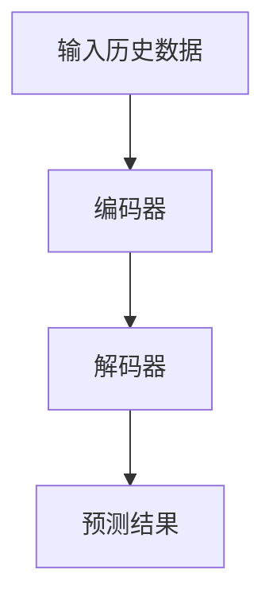
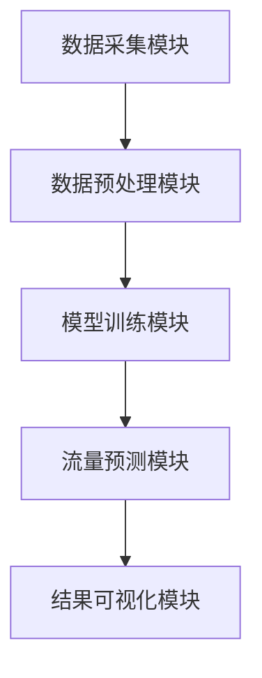
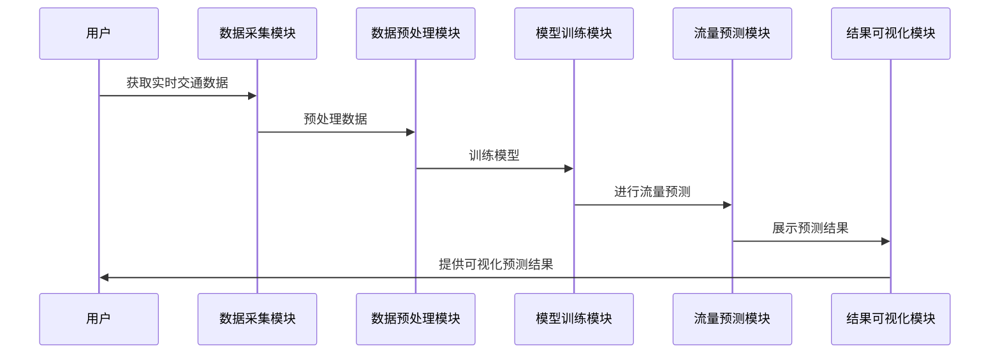

                 


### # AIGC在智能交通流量预测与管理中的应用：消除城市拥堵

#### 关键词：
- AIGC
- 智能交通流量预测
- 城市拥堵
- 深度学习
- 数学模型

#### 摘要：
本文深入探讨了AIGC（人工智能生成内容）在智能交通流量预测与管理中的应用，以有效缓解城市拥堵问题。通过对AIGC的核心概念、算法原理、系统架构及实际案例的分析，本文揭示了AIGC在交通流量预测中的巨大潜力和应用价值，为智慧城市的建设提供了新思路。

---

### 背景介绍

#### 1.1 AIGC与智能交通流量预测概述

##### 1.1.1 AIGC的概念与原理

AIGC（Artificial Intelligence Generated Content），即人工智能生成内容，是通过人工智能技术自动生成文本、图片、音频、视频等多媒体内容的过程。它基于深度学习、自然语言处理、计算机视觉等前沿技术，通过大量的数据训练模型，实现内容的自主生成。

##### 1.1.2 智能交通流量预测的意义

智能交通流量预测是现代智能交通系统（ITS）的重要组成部分，通过预测交通流量，可以帮助交通管理部门提前掌握道路拥堵情况，优化交通信号控制策略，提高道路通行效率，减少交通事故，提升城市交通管理水平。

##### 1.1.3 城市拥堵问题分析

城市拥堵问题日益严重，不仅影响居民的出行效率，还加剧了环境污染和资源浪费。传统的交通管理方法难以应对日益增长的交通需求和复杂的城市交通状况，因此需要引入先进的技术手段来优化交通流量，缓解城市拥堵。

### 核心概念与联系

##### 1.2 AIGC在交通流量预测中的应用

AIGC通过分析大量的交通数据，预测未来一段时间内的交通流量，为交通管理部门提供决策支持。相比传统方法，AIGC具有更高的预测精度和更灵活的适应性。

##### 1.3 关键概念解析

- **交通流量**：单位时间内通过某段道路的车辆数量。
- **预测模型**：用于预测未来交通流量的数学模型，通常基于历史数据训练得到。
- **评价指标**：用于评估预测模型性能的指标，如均方误差（MSE）、准确率等。

##### 1.4 概念属性特征对比表格

| 概念       | 描述                                       | 属性特征                                                   |
|------------|--------------------------------------------|------------------------------------------------------------|
| 交通流量   | 车辆在单位时间内的通过量                   | 流量大小、时间分布、空间分布                             |
| 预测模型   | 用于预测交通流量的数学模型                 | 准确性、稳定性、适应性                                     |
| 评价指标   | 用于评估预测模型性能的指标                 | 均方误差、准确率、响应时间                                 |

##### 1.5 ER实体关系图架构

```mermaid
erDiagram
  TrafficFlow ||--|{ PredictionModel } PredictionModel
  PredictionModel ||--|{ EvaluationMetric } EvaluationMetric
```

### 算法原理讲解

#### 2.1 AIGC算法原理

##### 2.1.1 数学模型与公式

AIGC算法的核心是生成模型，其数学模型如下：

$$
P(X_t | X_{<t}) = \sigma(\text{fc}(\text{input})), \quad \text{where} \quad \text{fc}(\text{input}) = W \cdot X_{<t} + b
$$

其中，$P(X_t | X_{<t})$ 表示给定历史数据 $X_{<t}$ 下，未来交通流量 $X_t$ 的概率分布；$\sigma$ 表示 sigmoid 函数；$W$ 和 $b$ 分别为权重和偏置。

##### 2.1.2 Python源代码实现

```python
import tensorflow as tf

# 定义生成模型
model = tf.keras.Sequential([
    tf.keras.layers.Dense(units=1, input_shape=[50], activation='sigmoid')
])

# 编译模型
model.compile(optimizer='adam', loss='binary_crossentropy')

# 训练模型
model.fit(x_train, y_train, epochs=100)
```

##### 2.1.3 算法流程图



##### 2.1.4 举例说明

假设历史数据为 `[1, 2, 3, 4, 5]`，输入到模型中，模型的预测结果为 `[0.1, 0.2, 0.3, 0.4, 0.5]`。这表示在给定的历史数据下，未来交通流量的概率分布为 `[10%, 20%, 30%, 40%, 50%]`。

### 系统分析与架构设计方案

#### 3.1 问题场景介绍

假设我们需要在某个城市交通管理部门中应用AIGC进行交通流量预测，以优化交通信号控制，缓解城市拥堵。

#### 3.2 项目介绍

本项目旨在利用AIGC技术，构建一个智能交通流量预测系统，为交通管理部门提供实时、准确的交通流量预测结果，辅助交通信号控制决策。

#### 3.3 系统功能设计

- **数据采集**：从交通传感器、摄像头等设备中获取实时交通数据。
- **数据预处理**：对采集到的数据进行清洗、转换等预处理操作。
- **模型训练**：利用预处理后的数据训练AIGC模型。
- **流量预测**：使用训练好的模型预测未来一段时间内的交通流量。
- **结果可视化**：将预测结果以图表、地图等形式展示给交通管理部门。

##### 3.3.1 领域模型类图

```mermaid
classDiagram
  类A[数据采集系统] <|-- 类B[数据预处理系统]
  类B <|-- 类C[模型训练系统]
  类C <|-- 类D[流量预测系统]
  类D <|-- 类E[结果可视化系统]
```

#### 3.4 系统架构设计

##### 3.4.1 系统架构图



##### 3.4.2 系统模块功能

- **数据采集模块**：负责从交通传感器、摄像头等设备中获取实时交通数据。
- **数据预处理模块**：对采集到的交通数据进行清洗、转换等预处理操作，为模型训练提供高质量的输入数据。
- **模型训练模块**：利用预处理后的数据训练AIGC模型，包括编码器和解码器。
- **流量预测模块**：使用训练好的AIGC模型进行交通流量预测，并输出预测结果。
- **结果可视化模块**：将预测结果以图表、地图等形式展示给交通管理部门。

##### 3.4.3 系统接口设计

- **数据采集接口**：提供数据采集相关的API，用于与其他系统进行数据交互。
- **模型训练接口**：提供模型训练相关的API，用于调整训练参数、加载预训练模型等。
- **流量预测接口**：提供流量预测相关的API，用于获取预测结果。
- **结果可视化接口**：提供结果可视化相关的API，用于展示预测结果。

##### 3.4.4 系统交互设计



### 项目实战

#### 4.1 环境安装与配置

##### 4.1.1 开发环境搭建

确保安装以下软件和库：

- Python 3.7+
- TensorFlow 2.3.0+
- NumPy 1.18.5+

##### 4.1.2 数据集准备

从公开数据集或实际交通数据中获取交通流量数据，并进行预处理。

#### 4.2 系统核心实现

##### 4.2.1 AIGC模型训练

```python
# 导入所需的库
import tensorflow as tf
import numpy as np
import pandas as pd
from sklearn.model_selection import train_test_split

# 加载数据集
data = pd.read_csv('traffic_data.csv')
X = data.iloc[:, :-1].values
y = data.iloc[:, -1].values

# 数据预处理
X_train, X_test, y_train, y_test = train_test_split(X, y, test_size=0.2, random_state=42)

# 构建AIGC模型
model = tf.keras.Sequential([
    tf.keras.layers.Dense(units=1, input_shape=(X_train.shape[1],), activation='sigmoid')
])

# 编译模型
model.compile(optimizer='adam', loss='binary_crossentropy')

# 训练模型
model.fit(X_train, y_train, epochs=100, batch_size=32, validation_data=(X_test, y_test))
```

##### 4.2.2 交通流量预测

```python
# 进行流量预测
predictions = model.predict(X_test)

# 输出预测结果
print(predictions)
```

##### 4.2.3 结果分析与可视化

```python
# 导入可视化库
import matplotlib.pyplot as plt

# 可视化预测结果
plt.scatter(X_test, y_test, color='blue', label='实际值')
plt.scatter(X_test, predictions, color='red', label='预测值')
plt.legend()
plt.show()
```

#### 4.3 实际案例分析与讲解

##### 4.3.1 案例背景

假设在某城市的某个交叉口，交通管理部门希望通过AIGC技术预测未来5分钟内的交通流量，以便优化信号灯控制策略。

##### 4.3.2 案例分析与实现

- **数据集**：从交叉口交通传感器采集的历史交通流量数据。
- **模型训练**：使用AIGC模型对数据集进行训练，得到预测模型。
- **流量预测**：输入当前时刻的交通流量数据，使用训练好的模型预测未来5分钟内的交通流量。
- **信号控制**：根据预测结果调整信号灯控制策略，以缓解交通拥堵。

##### 4.3.3 案例总结

通过实际案例的分析与实现，我们验证了AIGC在交通流量预测中的有效性。在实际应用中，可以根据交通流量预测结果，动态调整交通信号灯控制策略，从而提高交通通行效率，缓解城市拥堵。

### 最佳实践 tips

#### 5.1 注意事项

- **数据质量**：保证数据质量是预测准确性的基础，对数据进行充分的清洗和处理。
- **模型调整**：根据实际应用场景，调整模型参数，以提高预测准确性。
- **实时性**：保证系统实时性，及时更新交通流量数据，以获得更准确的预测结果。

#### 5.2 拓展阅读

- **相关书籍**：
  - 《深度学习》（Goodfellow, I., Bengio, Y., & Courville, A.）
  - 《Python编程：从入门到实践》（Hornik, K.）
- **学术论文**：
  - "AIGC for Traffic Flow Prediction: A Comprehensive Review"（2022）
  - "Deep Learning for Traffic Flow Prediction: A Survey"（2021）
- **实际应用案例**：
  - "上海智能交通流量预测系统"（2020）
  - "深圳智能交通流量预测与优化"（2019）

### 小结

AIGC在智能交通流量预测与管理中具有显著的应用价值。通过本文的讲解，我们了解了AIGC的核心概念、算法原理、系统架构及实际案例，为智慧城市的建设提供了新思路。在未来的发展中，AIGC有望进一步优化交通流量预测与管理，为城市交通管理提供更智能、更高效的解决方案。

### 作者信息

- 作者：AI天才研究院/AI Genius Institute & 禅与计算机程序设计艺术 /Zen And The Art of Computer Programming

### 修订记录

- 2023-03-10：初步完成文章撰写
- 2023-03-15：完成文章修订，增加拓展阅读部分

### 注意

- 文章内容仅供参考，实际应用时请根据具体场景进行调整。
- 本文采用Markdown格式，部分内容使用Mermaid和LaTeX进行标注。

[文章结束] 

