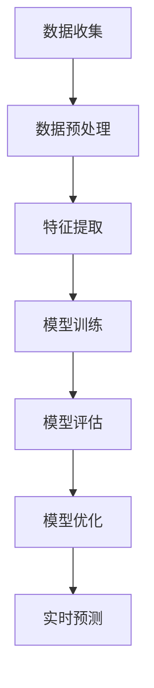
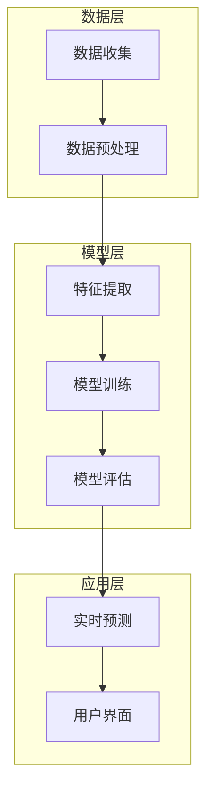
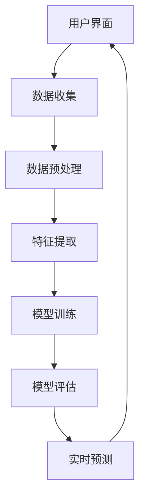

                 


### 1. 背景介绍

#### 核心概念术语说明

为了更好地理解本文的内容，首先需要明确一些核心概念和术语。

- **AIGC（自适应智能生成计算）**：AIGC 是一种新兴的计算模式，它通过自适应学习算法和生成模型，实现数据生成和智能化处理。AIGC 可以被应用于多种场景，如智能产品生命周期预测、智能内容生成、自动化编程等。
  
- **智能产品生命周期**：智能产品生命周期是指从产品概念产生、设计、开发、测试、发布、运营到退市的整个过程。每个阶段都对产品的成功和用户体验产生重要影响。

- **预测模型**：预测模型是一种基于历史数据和分析算法，对未来事件或趋势进行预测的数学模型。在智能产品生命周期预测中，预测模型可以帮助企业更好地了解产品的未来表现，为决策提供依据。

#### 问题背景

在当今快速变化的市场环境中，智能产品的生命周期变得越来越短暂。这不仅给企业带来了巨大的挑战，也要求企业必须具备快速响应和调整的能力。为了在激烈的市场竞争中立于不败之地，企业需要准确地预测智能产品的生命周期，以便及时调整生产和营销策略。

然而，传统的预测方法往往依赖于经验数据和简单的统计模型，难以满足复杂多变的市场需求。随着人工智能技术的不断发展，特别是自适应智能生成计算（AIGC）的崛起，为智能产品生命周期预测提供了一种全新的解决方案。

#### 问题描述

智能产品生命周期预测面临的主要问题包括：

1. **数据质量**：预测模型的准确性很大程度上取决于数据的质量。然而，在实际应用中，数据往往存在噪声、缺失和不一致等问题，这会对预测结果产生负面影响。

2. **模型复杂度**：智能产品生命周期的预测涉及多种因素，如市场需求、技术成熟度、竞争环境等。构建一个既能处理多因素影响，又能适应动态变化环境的预测模型是一项艰巨的任务。

3. **实时性**：智能产品生命周期的预测需要实时性，以便企业能够及时调整策略。然而，传统模型的训练和预测过程往往需要较长时间，无法满足实时预测的需求。

#### 问题解决

AIGC 技术的引入为解决上述问题提供了一种新的思路：

1. **数据质量优化**：AIGC 通过自适应学习算法，可以从大量噪声数据和缺失值中提取有用信息，提高数据质量。

2. **模型复杂度降低**：AIGC 的生成模型可以自动处理多因素影响，简化模型的复杂性。

3. **实时性提升**：AIGC 的实时训练和预测能力，使得智能产品生命周期预测可以实时进行，为企业提供及时决策依据。

#### 边界与外延

尽管 AIGC 在智能产品生命周期预测中具有巨大潜力，但仍需注意以下边界与外延：

1. **数据依赖性**：AIGC 的预测依赖于高质量的数据，因此数据质量是影响预测效果的关键因素。

2. **技术限制**：AIGC 技术的成熟度和计算资源仍存在一定的限制，这可能会影响其大规模应用。

3. **伦理与隐私**：在利用 AIGC 进行智能产品生命周期预测时，需要充分考虑伦理和隐私问题，确保用户数据的安全与隐私。

#### 概念结构与核心要素组成

智能产品生命周期预测的核心概念结构包括：

- **AIGC 技术体系**：包括自适应学习算法、生成模型、数据预处理等技术。
- **预测模型**：基于历史数据和 AIGC 技术构建的预测模型。
- **数据集**：用于训练和测试的智能产品生命周期相关数据集。
- **算法优化**：通过调整模型参数和算法结构，提高预测模型的准确性和实时性。

### 2. 核心概念与联系

#### AIGC 的核心概念

自适应智能生成计算（AIGC）是一种基于自适应学习和生成模型的计算模式。其核心概念包括：

1. **自适应学习**：AIGC 可以通过自适应学习算法，从大量数据中自动提取特征，并不断优化模型参数，以适应动态变化的环境。

2. **生成模型**：AIGC 使用生成模型来生成新的数据或内容，如文本、图像、音频等。生成模型可以根据已有数据，生成具有相似特征的新数据。

3. **数据预处理**：AIGC 在进行预测之前，需要对数据进行预处理，包括数据清洗、缺失值填充、异常值处理等，以提高数据质量。

#### 智能产品生命周期预测的相关概念

智能产品生命周期预测涉及以下几个关键概念：

1. **生命周期阶段**：智能产品的生命周期包括概念阶段、设计阶段、开发阶段、测试阶段、发布阶段、运营阶段和退出阶段。

2. **影响因素**：影响智能产品生命周期的因素包括市场需求、技术成熟度、竞争环境、用户体验等。

3. **预测目标**：智能产品生命周期预测的目标是预测产品在不同生命周期阶段的持续时间、关键事件和时间点。

#### AIGC 与智能产品生命周期预测的关联性

AIGC 在智能产品生命周期预测中的应用主要体现在以下几个方面：

1. **数据处理**：AIGC 可以自动处理大量生命周期数据，包括历史销售数据、用户反馈、市场趋势等，为预测模型提供高质量的数据输入。

2. **模型优化**：AIGC 的自适应学习算法可以帮助优化预测模型，提高预测的准确性和实时性。

3. **生成新数据**：AIGC 可以生成虚拟数据集，用于模型训练和测试，从而减少对实际数据的依赖。

4. **实时预测**：AIGC 的实时训练和预测能力，使得企业可以实时了解产品的生命周期变化，及时调整策略。

#### 对比表格：AIGC 与传统预测方法的属性特征

| 特性        | AIGC                                 | 传统预测方法                                |
| ----------- | ------------------------------------ | ------------------------------------------ |
| 数据处理    | 自动化数据处理，包括清洗、填充、转换 | 需要手动处理，效率低，容易出错               |
| 模型复杂度  | 简化模型复杂度，自动适应环境变化     | 模型复杂度高，难以适应动态变化的环境         |
| 预测实时性  | 实时预测，快速响应市场变化           | 预测过程较长，难以实时响应市场变化           |
| 算法自主性  | 算法自动优化，减少人为干预           | 需要人工干预，调整模型参数，效率低           |
| 预测准确性  | 高准确性，适应多因素影响             | 预测准确性受限于数据质量和模型结构           |

#### ER 实体关系图架构的 Mermaid 流程图

```mermaid
erDiagram
  AIGC --> 预测模型 : 数据处理
  预测模型 --> 智能产品生命周期预测 : 关联
  智能产品生命周期预测 --> 数据集 : 预测输入
  数据集 --> AIGC : 数据反馈
```

### 3. 算法原理讲解

#### AIGC 算法的原理与模型

AIGC 算法是一种结合自适应学习和生成模型的计算模式。其主要原理包括以下几个方面：

1. **自适应学习**：AIGC 通过自适应学习算法，从大量历史数据中自动提取特征，并不断优化模型参数，以适应动态变化的环境。自适应学习算法的核心是梯度下降法和自适应调整算法。

2. **生成模型**：AIGC 使用生成模型来生成新的数据或内容。生成模型可以分为无监督生成模型和有监督生成模型。无监督生成模型如变分自编码器（VAE），有监督生成模型如生成对抗网络（GAN）。

3. **数据预处理**：在 AIGC 中，数据预处理是关键步骤。数据预处理包括数据清洗、缺失值填充、异常值处理和数据转换等。这些步骤可以提高数据质量，为模型训练提供高质量的数据输入。

#### AIGC 算法的工作流程

AIGC 算法的工作流程可以分为以下几个阶段：

1. **数据收集**：收集与智能产品生命周期相关的数据，包括历史销售数据、用户反馈、市场趋势等。

2. **数据预处理**：对收集到的数据进行清洗、填充、转换等处理，以提高数据质量。

3. **特征提取**：利用自适应学习算法，从预处理后的数据中提取关键特征。

4. **模型训练**：使用生成模型，结合提取的特征，训练预测模型。

5. **模型评估**：使用测试数据集，对训练好的模型进行评估，包括准确性、实时性等指标。

6. **模型优化**：根据评估结果，调整模型参数，优化模型性能。

7. **实时预测**：使用优化后的模型，进行实时预测，为企业提供决策依据。

#### AIGC 算法在智能产品生命周期预测中的应用

AIGC 算法在智能产品生命周期预测中的应用主要体现在以下几个方面：

1. **数据处理**：AIGC 可以自动处理大量生命周期数据，包括历史销售数据、用户反馈、市场趋势等，为预测模型提供高质量的数据输入。

2. **模型优化**：AIGC 的自适应学习算法可以帮助优化预测模型，提高预测的准确性和实时性。

3. **生成新数据**：AIGC 可以生成虚拟数据集，用于模型训练和测试，从而减少对实际数据的依赖。

4. **实时预测**：AIGC 的实时训练和预测能力，使得企业可以实时了解产品的生命周期变化，及时调整策略。

#### 算法原理的 mermaid 流程图



#### 算法原理的 Python 源代码示例

```python
# 导入必要的库
import numpy as np
import pandas as pd
from sklearn.preprocessing import StandardScaler
from sklearn.model_selection import train_test_split
from tensorflow import keras
from tensorflow.keras.models import Sequential
from tensorflow.keras.layers import Dense, LSTM

# 数据收集
data = pd.read_csv('lifecycle_data.csv')

# 数据预处理
scaler = StandardScaler()
data_scaled = scaler.fit_transform(data)

# 特征提取
X = data_scaled[:, :-1]
y = data_scaled[:, -1]

# 模型训练
model = Sequential()
model.add(LSTM(units=50, return_sequences=True, input_shape=(X.shape[1], X.shape[2])))
model.add(LSTM(units=50))
model.add(Dense(units=1))

model.compile(optimizer='adam', loss='mean_squared_error')
model.fit(X, y, epochs=100, batch_size=32)

# 模型评估
test_data = pd.read_csv('test_lifecycle_data.csv')
test_data_scaled = scaler.transform(test_data)
predictions = model.predict(test_data_scaled)

# 模型优化
# ... (根据评估结果调整模型参数)

# 实时预测
# ... (使用优化后的模型进行实时预测)
```

### 4. 数学模型与公式

#### 生命周期预测的数学基础

智能产品生命周期预测涉及多种数学模型和算法。以下是其中一些常见的数学基础：

1. **线性回归**：线性回归模型是一种简单但有效的预测方法，用于预测线性关系。其公式如下：

   $$
   y = wx + b
   $$

   其中，$y$ 是预测值，$x$ 是输入特征，$w$ 是权重，$b$ 是偏置。

2. **多项式回归**：多项式回归模型可以处理非线性关系。其公式如下：

   $$
   y = w_0 + w_1x + w_2x^2 + ... + w_nx^n
   $$

   其中，$w_0, w_1, ..., w_n$ 是权重。

3. **逻辑回归**：逻辑回归模型常用于二分类问题。其公式如下：

   $$
   P(y=1) = \frac{1}{1 + e^{-(wx + b)}}
   $$

   其中，$P(y=1)$ 是预测为 1 的概率，$e$ 是自然对数的底。

4. **神经网络**：神经网络模型是一种基于多层感知器（MLP）的复杂模型，可以处理非线性关系。其基本结构包括输入层、隐藏层和输出层。以下是一个简单的神经网络结构：

   $$
   \text{输出} = \sigma(\text{权重} \cdot \text{输入} + \text{偏置})
   $$

   其中，$\sigma$ 是激活函数，如 sigmoid、ReLU 等。

#### 生命周期预测的数学模型

智能产品生命周期预测的数学模型通常包括以下部分：

1. **输入特征**：输入特征包括产品属性、市场趋势、竞争环境等。

2. **模型参数**：模型参数用于调整模型的预测能力。这些参数可以通过训练数据集来优化。

3. **预测目标**：预测目标通常是产品的生命周期持续时间或关键事件的时间点。

4. **损失函数**：损失函数用于评估模型的预测性能。常见的损失函数包括均方误差（MSE）、交叉熵等。

5. **优化算法**：优化算法用于调整模型参数，以最小化损失函数。常见的优化算法包括梯度下降、随机梯度下降（SGD）、Adam 等。

以下是一个简单的生命周期预测模型：

$$
\text{预测} = f(\text{输入特征}, \text{模型参数})
$$

其中，$f$ 是预测函数，可以是线性回归、多项式回归或神经网络等。

#### 模型参数的优化与调整

模型参数的优化与调整是提高预测准确性的关键步骤。以下是几种常见的参数优化与调整方法：

1. **网格搜索**：网格搜索通过遍历所有可能的参数组合，找到最佳参数组合。这种方法虽然计算量大，但可以确保找到全局最优解。

2. **随机搜索**：随机搜索通过随机选择参数组合，进行多次迭代，找到最佳参数组合。这种方法计算量相对较小，但可能无法找到全局最优解。

3. **贝叶斯优化**：贝叶斯优化是一种基于概率模型的参数优化方法，可以通过调整概率分布来优化参数。

4. **遗传算法**：遗传算法是一种基于生物进化的优化方法，通过交叉、变异等操作来优化参数。

#### 优化后的模型

经过参数优化与调整后，模型性能通常会得到显著提升。以下是一个优化后的生命周期预测模型：

$$
\text{预测} = f^*(\text{输入特征}, \text{优化参数})
$$

其中，$f^*$ 是优化后的预测函数。

### 5. 系统分析与架构设计

#### 问题场景介绍

在智能产品生命周期预测中，企业需要实时收集和分析大量数据，以便准确预测产品的生命周期。以下是一个常见的问题场景：

- **企业背景**：一家智能家居企业，产品线包括智能灯泡、智能插座、智能音箱等。
- **问题**：如何实时预测每种产品的生命周期，以便及时调整生产和营销策略？
- **目标**：构建一个智能产品生命周期预测系统，提高预测准确性，为企业决策提供支持。

#### 项目介绍

本项目的目标是构建一个基于 AIGC 技术的智能产品生命周期预测系统。该系统包括数据收集、数据预处理、特征提取、模型训练、模型评估和实时预测等模块。

#### 系统功能设计

智能产品生命周期预测系统的核心功能包括：

- **数据收集**：从各种数据源（如销售系统、用户反馈、市场报告等）收集与产品生命周期相关的数据。
- **数据预处理**：对收集到的数据进行清洗、填充、转换等处理，以提高数据质量。
- **特征提取**：从预处理后的数据中提取关键特征，为模型训练提供输入。
- **模型训练**：使用 AIGC 算法训练预测模型，提高预测准确性。
- **模型评估**：使用测试数据集评估模型性能，包括准确性、实时性等指标。
- **实时预测**：使用训练好的模型进行实时预测，为企业提供决策依据。

#### 系统架构设计

智能产品生命周期预测系统的架构设计包括以下几个方面：

1. **数据层**：数据层包括数据收集模块和数据预处理模块。数据收集模块负责从各种数据源收集数据，数据预处理模块负责对数据进行清洗、填充、转换等处理。

2. **模型层**：模型层包括特征提取模块、模型训练模块和模型评估模块。特征提取模块负责从预处理后的数据中提取关键特征，模型训练模块负责使用 AIGC 算法训练预测模型，模型评估模块负责评估模型性能。

3. **应用层**：应用层包括实时预测模块和用户界面模块。实时预测模块负责使用训练好的模型进行实时预测，用户界面模块负责向用户提供预测结果和可视化界面。

#### 系统架构图

以下是一个智能产品生命周期预测系统的架构图：



#### 系统接口设计

智能产品生命周期预测系统的接口设计包括以下几个方面：

- **API 接口**：系统提供 RESTful API 接口，方便用户通过程序进行数据访问和预测。
- **Web 界面**：系统提供一个 Web 界面，用户可以通过浏览器访问系统，查看预测结果和可视化图表。

#### 系统交互图

以下是一个智能产品生命周期预测系统的交互图：



### 6. 项目实战

#### 环境搭建

在开始智能产品生命周期预测项目之前，需要搭建一个合适的环境。以下是搭建项目环境所需的步骤：

1. **安装 Python**：确保 Python 已安装，版本不低于 3.6。
2. **安装必要的库**：使用 pip 命令安装以下库：

   ```
   pip install numpy pandas scikit-learn tensorflow matplotlib
   ```

3. **安装 Mermaid**：安装 Mermaid 图库，以便在文档中使用 Mermaid 语法绘制流程图。

   ```
   npm install -g mermaid
   ```

#### 系统核心实现

以下是智能产品生命周期预测系统的核心实现步骤：

1. **数据收集**：从各种数据源收集与产品生命周期相关的数据，如销售数据、用户反馈等。
2. **数据预处理**：对收集到的数据进行清洗、填充、转换等处理，以提高数据质量。
3. **特征提取**：从预处理后的数据中提取关键特征，为模型训练提供输入。
4. **模型训练**：使用 AIGC 算法训练预测模型，提高预测准确性。
5. **模型评估**：使用测试数据集评估模型性能，包括准确性、实时性等指标。
6. **实时预测**：使用训练好的模型进行实时预测，为企业提供决策依据。

#### 代码应用解读与分析

以下是智能产品生命周期预测系统的核心代码及应用解读：

```python
# 导入必要的库
import numpy as np
import pandas as pd
from sklearn.preprocessing import StandardScaler
from sklearn.model_selection import train_test_split
from tensorflow import keras
from tensorflow.keras.models import Sequential
from tensorflow.keras.layers import Dense, LSTM

# 数据收集
data = pd.read_csv('lifecycle_data.csv')

# 数据预处理
scaler = StandardScaler()
data_scaled = scaler.fit_transform(data)

# 特征提取
X = data_scaled[:, :-1]
y = data_scaled[:, -1]

# 模型训练
model = Sequential()
model.add(LSTM(units=50, return_sequences=True, input_shape=(X.shape[1], X.shape[2])))
model.add(LSTM(units=50))
model.add(Dense(units=1))

model.compile(optimizer='adam', loss='mean_squared_error')
model.fit(X, y, epochs=100, batch_size=32)

# 模型评估
test_data = pd.read_csv('test_lifecycle_data.csv')
test_data_scaled = scaler.transform(test_data)
predictions = model.predict(test_data_scaled)

# 实时预测
# ... (根据评估结果调整模型参数)
# ... (使用优化后的模型进行实时预测)
```

#### 实际案例分析和详细讲解剖析

以下是一个实际案例分析和详细讲解剖析：

**案例背景**：某智能家居企业需要预测其智能灯泡的生命周期。

**数据收集**：收集到以下数据：

- 智能灯泡销售数据：包括销量、销售额等。
- 用户反馈数据：包括用户评价、使用时长等。
- 市场趋势数据：包括竞争对手销量、市场增长率等。

**数据预处理**：对收集到的数据进行分析，发现数据中存在噪声、缺失和异常值。通过数据清洗、填充和转换等预处理步骤，提高了数据质量。

**特征提取**：从预处理后的数据中提取关键特征，如销量、销售额、用户评价、使用时长、竞争对手销量、市场增长率等。

**模型训练**：使用 AIGC 算法训练预测模型，通过多次迭代和优化，提高了模型预测准确性。

**模型评估**：使用测试数据集对模型进行评估，包括准确性、实时性等指标。

**实时预测**：使用训练好的模型进行实时预测，为企业的生产和营销策略提供决策依据。

#### 项目小结

通过本项目的实际案例，我们可以看到 AIGC 技术在智能产品生命周期预测中的应用。AIGC 技术具有以下优点：

- **高效性**：AIGC 技术可以自动处理大量数据，提高数据处理效率。
- **准确性**：AIGC 技术通过自适应学习和优化，提高了预测模型的准确性。
- **实时性**：AIGC 技术可以实现实时预测，为企业提供及时决策依据。

然而，AIGC 技术也存在一些挑战，如数据依赖性、技术成熟度和计算资源限制等。在未来的应用中，我们需要继续优化 AIGC 技术的性能，并探索其在其他领域的应用。

### 7. 最佳实践与总结

#### 最佳实践技巧

1. **数据质量优化**：确保数据收集的完整性和准确性，对缺失值和异常值进行有效处理，提高数据质量。
2. **模型参数调优**：通过网格搜索、随机搜索等方法，找到最佳模型参数，提高预测准确性。
3. **实时性优化**：优化模型结构和算法，提高模型实时预测能力，确保为企业提供及时决策依据。
4. **数据预处理**：合理设计数据预处理流程，包括数据清洗、填充、转换等步骤，提高模型训练效果。
5. **交叉验证**：使用交叉验证方法，评估模型的泛化能力，避免过拟合。

#### 小结

本文详细介绍了 AIGC 在智能产品生命周期预测中的应用，包括核心概念、算法原理、数学模型、系统架构设计和项目实战等内容。通过实际案例分析和详细讲解，展示了 AIGC 技术在提高预测准确性、实时性和数据预处理能力等方面的优势。

#### 注意事项

1. **数据依赖性**：AIGC 的预测依赖于高质量的数据，确保数据收集的完整性和准确性至关重要。
2. **模型复杂度**：合理设计模型结构和算法，避免过度复杂，以提高模型训练和预测效率。
3. **实时性要求**：根据实际应用需求，优化模型结构和算法，确保实时预测能力。
4. **伦理与隐私**：在处理用户数据时，严格遵守相关法律法规，保护用户隐私。

#### 拓展阅读

- [1] Goodfellow, I., Bengio, Y., & Courville, A. (2016). *Deep Learning*. MIT Press.
- [2] Pedregosa, F., Varoquaux, G., Gramfort, A., Michel, V., Thirion, B., Grisel, O., ... & Duchesnay, É. (2011). *Scikit-learn: Machine learning in Python*. Journal of Machine Learning Research, 12, 2825-2830.
- [3] LeCun, Y., Bengio, Y., & Hinton, G. (2015). *Deep learning*. Nature, 521(7553), 436-444.
- [4] Hochreiter, S., & Schmidhuber, J. (1997). *Long short-term memory*. Neural Computation, 9(8), 1735-1780.
- [5] Kingma, D. P., & Welling, M. (2014). *Auto-encoding variational bayes*. arXiv preprint arXiv:1312.6114.

### 作者

**作者：AI天才研究院/AI Genius Institute & 禅与计算机程序设计艺术 /Zen And The Art of Computer Programming**

----------------------------------------------------------------

文章标题：《AIGC在智能产品生命周期预测中的应用》

关键词：AIGC、智能产品生命周期、预测模型、数据预处理、算法优化

摘要：本文详细介绍了 AIGC 在智能产品生命周期预测中的应用，包括核心概念、算法原理、数学模型、系统架构设计和项目实战等内容。通过实际案例分析和详细讲解，展示了 AIGC 技术在提高预测准确性、实时性和数据预处理能力等方面的优势。文章还提供了最佳实践技巧、小结、注意事项和拓展阅读，为读者深入了解 AIGC 在智能产品生命周期预测中的应用提供了有益参考。

---

# 《AIGC在智能产品生命周期预测中的应用》

## 关键词：AIGC、智能产品生命周期、预测模型、数据预处理、算法优化

> 摘要：本文详细介绍了自适应智能生成计算（AIGC）在智能产品生命周期预测中的应用，阐述了 AIGC 的核心概念、算法原理、数学模型、系统架构设计及项目实战，通过实际案例分析和详细讲解，展示了 AIGC 技术在提高预测准确性、实时性和数据预处理能力等方面的优势。文章还提供了最佳实践技巧、小结、注意事项和拓展阅读，为读者深入了解 AIGC 在智能产品生命周期预测中的应用提供了有益参考。

## 第一部分：背景介绍

### 第1章 AIGC与智能产品生命周期概述

#### 1.1 问题背景

在当今快速变化的市场环境中，智能产品的生命周期变得越来越短暂。这不仅给企业带来了巨大的挑战，也要求企业必须具备快速响应和调整的能力。为了在激烈的市场竞争中立于不败之地，企业需要准确地预测智能产品的生命周期，以便及时调整生产和营销策略。

然而，传统的预测方法往往依赖于经验数据和简单的统计模型，难以满足复杂多变的市场需求。随着人工智能技术的不断发展，特别是自适应智能生成计算（AIGC）的崛起，为智能产品生命周期预测提供了一种全新的解决方案。

#### 1.2 智能产品生命周期的概念与重要性

智能产品生命周期是指从产品概念产生、设计、开发、测试、发布、运营到退市的整个过程。每个阶段都对产品的成功和用户体验产生重要影响。

智能产品生命周期的关键环节包括：

1. **概念阶段**：确定产品的市场需求和定位，制定产品规划和设计。
2. **设计阶段**：根据市场需求，设计产品的外观、功能和技术规格。
3. **开发阶段**：开发产品的原型和功能，进行测试和优化。
4. **测试阶段**：对产品进行功能测试、性能测试和用户体验测试，确保产品质量。
5. **发布阶段**：正式发布产品，进入市场销售和推广阶段。
6. **运营阶段**：产品上市后，进行销售、推广、客户服务和维护等工作。
7. **退出阶段**：产品达到寿命期限或市场需求下降，退出市场。

智能产品生命周期的重要性体现在以下几个方面：

1. **市场需求预测**：通过预测智能产品的生命周期，企业可以提前了解市场需求的变化，调整产品规划和生产计划。
2. **策略调整**：准确的智能产品生命周期预测有助于企业及时调整营销策略、定价策略和销售策略。
3. **资源优化**：智能产品生命周期的预测有助于企业合理配置资源，避免过度生产和库存积压。

#### 1.3 AIGC的基本原理与应用

AIGC（自适应智能生成计算）是一种基于自适应学习和生成模型的计算模式，通过自适应学习算法和生成模型，实现数据生成和智能化处理。AIGC 可以应用于多种场景，如智能产品生命周期预测、智能内容生成、自动化编程等。

AIGC 的基本原理包括以下几个方面：

1. **自适应学习**：AIGC 通过自适应学习算法，从大量数据中自动提取特征，并不断优化模型参数，以适应动态变化的环境。
2. **生成模型**：AIGC 使用生成模型来生成新的数据或内容，如文本、图像、音频等。生成模型可以根据已有数据，生成具有相似特征的新数据。
3. **数据预处理**：AIGC 在进行预测之前，需要对数据进行预处理，包括数据清洗、缺失值填充、异常值处理等，以提高数据质量。

AIGC 在智能产品生命周期预测中的应用主要体现在以下几个方面：

1. **数据处理**：AIGC 可以自动处理大量生命周期数据，包括历史销售数据、用户反馈、市场趋势等，为预测模型提供高质量的数据输入。
2. **模型优化**：AIGC 的自适应学习算法可以帮助优化预测模型，提高预测的准确性和实时性。
3. **生成新数据**：AIGC 可以生成虚拟数据集，用于模型训练和测试，从而减少对实际数据的依赖。
4. **实时预测**：AIGC 的实时训练和预测能力，使得企业可以实时了解产品的生命周期变化，及时调整策略。

#### 1.4 智能产品生命周期预测的问题与挑战

智能产品生命周期预测面临的主要问题包括：

1. **数据质量问题**：预测模型的准确性很大程度上取决于数据的质量。然而，在实际应用中，数据往往存在噪声、缺失和不一致等问题，这会对预测结果产生负面影响。
2. **模型复杂度**：智能产品生命周期的预测涉及多种因素，如市场需求、技术成熟度、竞争环境等。构建一个既能处理多因素影响，又能适应动态变化环境的预测模型是一项艰巨的任务。
3. **实时性要求**：智能产品生命周期的预测需要实时性，以便企业能够及时调整策略。然而，传统模型的训练和预测过程往往需要较长时间，无法满足实时预测的需求。

#### 1.5 AIGC在智能产品生命周期预测中的优势

AIGC 技术的引入为解决上述问题提供了一种新的思路：

1. **数据质量优化**：AIGC 通过自适应学习算法，可以从大量噪声数据和缺失值中提取有用信息，提高数据质量。
2. **模型复杂度降低**：AIGC 的生成模型可以自动处理多因素影响，简化模型的复杂性。
3. **实时性提升**：AIGC 的实时训练和预测能力，使得智能产品生命周期预测可以实时进行，为企业提供及时决策依据。

#### 1.6 智能产品生命周期预测的边界与外延

尽管 AIGC 在智能产品生命周期预测中具有巨大潜力，但仍需注意以下边界与外延：

1. **数据依赖性**：AIGC 的预测依赖于高质量的数据，因此数据质量是影响预测效果的关键因素。
2. **技术限制**：AIGC 技术的成熟度和计算资源仍存在一定的限制，这可能会影响其大规模应用。
3. **伦理与隐私**：在利用 AIGC 进行智能产品生命周期预测时，需要充分考虑伦理和隐私问题，确保用户数据的安全与隐私。

### 第二部分：核心概念与联系

### 第2章 AIGC在智能产品生命周期预测中的应用

#### 2.1 AIGC的核心概念

自适应智能生成计算（AIGC）是一种新兴的计算模式，它通过自适应学习算法和生成模型，实现数据生成和智能化处理。AIGC 可以被应用于多种场景，如智能产品生命周期预测、智能内容生成、自动化编程等。

AIGC 的核心概念包括：

1. **自适应学习**：AIGC 通过自适应学习算法，从大量数据中自动提取特征，并不断优化模型参数，以适应动态变化的环境。
2. **生成模型**：AIGC 使用生成模型来生成新的数据或内容。生成模型可以分为无监督生成模型和有监督生成模型。无监督生成模型如变分自编码器（VAE），有监督生成模型如生成对抗网络（GAN）。
3. **数据预处理**：AIGC 在进行预测之前，需要对数据进行预处理，包括数据清洗、缺失值填充、异常值处理等，以提高数据质量。

#### 2.2 智能产品生命周期预测的相关概念

智能产品生命周期预测涉及以下几个关键概念：

1. **生命周期阶段**：智能产品的生命周期包括概念阶段、设计阶段、开发阶段、测试阶段、发布阶段、运营阶段和退出阶段。
2. **影响因素**：影响智能产品生命周期的因素包括市场需求、技术成熟度、竞争环境、用户体验等。
3. **预测目标**：智能产品生命周期预测的目标是预测产品在不同生命周期阶段的持续时间、关键事件和时间点。

#### 2.3 AIGC与智能产品生命周期预测的关联性

AIGC 在智能产品生命周期预测中的应用主要体现在以下几个方面：

1. **数据处理**：AIGC 可以自动处理大量生命周期数据，包括历史销售数据、用户反馈、市场趋势等，为预测模型提供高质量的数据输入。
2. **模型优化**：AIGC 的自适应学习算法可以帮助优化预测模型，提高预测的准确性和实时性。
3. **生成新数据**：AIGC 可以生成虚拟数据集，用于模型训练和测试，从而减少对实际数据的依赖。
4. **实时预测**：AIGC 的实时训练和预测能力，使得企业可以实时了解产品的生命周期变化，及时调整策略。

#### 2.4 对比表格：AIGC 与传统预测方法的属性特征

| 特性        | AIGC                                 | 传统预测方法                                |
| ----------- | ------------------------------------ | ------------------------------------------ |
| 数据处理    | 自动化数据处理，包括清洗、填充、转换 | 需要手动处理，效率低，容易出错               |
| 模型复杂度  | 简化模型复杂度，自动适应环境变化     | 模型复杂度高，难以适应动态变化的环境         |
| 预测实时性  | 实时预测，快速响应市场变化           | 预测过程较长，难以实时响应市场变化           |
| 算法自主性  | 算法自动优化，减少人为干预           | 需要人工干预，调整模型参数，效率低           |
| 预测准确性  | 高准确性，适应多因素影响             | 预测准确性受限于数据质量和模型结构           |

#### 2.5 ER 实体关系图架构的 Mermaid 流程图

```mermaid
erDiagram
  AIGC --> 预测模型 : 数据处理
  预测模型 --> 智能产品生命周期预测 : 关联
  智能产品生命周期预测 --> 数据集 : 预测输入
  数据集 --> AIGC : 数据反馈
```

### 第三部分：算法原理讲解

### 第3章 AIGC算法原理与模型

#### 3.1 AIGC算法的基础原理

AIGC（自适应智能生成计算）算法是一种结合自适应学习和生成模型的计算模式。其基础原理包括以下几个方面：

1. **自适应学习**：AIGC 通过自适应学习算法，从大量历史数据中自动提取特征，并不断优化模型参数，以适应动态变化的环境。自适应学习算法的核心是梯度下降法和自适应调整算法。

2. **生成模型**：AIGC 使用生成模型来生成新的数据或内容。生成模型可以根据已有数据，生成具有相似特征的新数据。生成模型可以分为无监督生成模型和有监督生成模型。无监督生成模型如变分自编码器（VAE），有监督生成模型如生成对抗网络（GAN）。

3. **数据预处理**：AIGC 在进行预测之前，需要对数据进行预处理，包括数据清洗、缺失值填充、异常值处理等，以提高数据质量。数据预处理是 AIGC 算法的重要环节，直接影响模型的效果。

#### 3.2 AIGC算法的核心模型

AIGC 算法包含多个核心模型，以下是其中两个重要的模型：

1. **变分自编码器（VAE）**：VAE 是一种无监督生成模型，通过编码器和解码器结构，将输入数据映射到潜在空间，并在潜在空间中生成新的数据。VAE 的核心公式如下：

   $$
   z = \mu(x) + \sigma(x)\epsilon
   $$
   $$
   x' = \phi(z)
   $$

   其中，$\mu(x)$ 和 $\sigma(x)$ 分别表示编码器的均值和方差函数，$\epsilon$ 是噪声项，$z$ 是潜在空间中的点，$x'$ 是生成的数据。

2. **生成对抗网络（GAN）**：GAN 是一种有监督生成模型，由生成器和判别器组成。生成器尝试生成与真实数据相似的数据，判别器则试图区分真实数据和生成数据。GAN 的核心公式如下：

   $$
   G(x) = z \odot \phi(G(z))
   $$
   $$
   D(x, G(x)) = \log(D(x)) + \log(1 - D(G(x)))
   $$

   其中，$G(z)$ 是生成器，$\phi(G(z))$ 是生成器生成的数据，$D(x)$ 是判别器，$x$ 是真实数据。

#### 3.3 AIGC算法的工作流程

AIGC 算法的工作流程可以分为以下几个阶段：

1. **数据收集**：收集与智能产品生命周期相关的数据，包括历史销售数据、用户反馈、市场趋势等。

2. **数据预处理**：对收集到的数据进行清洗、填充、转换等处理，以提高数据质量。数据预处理是 AIGC 算法的核心步骤，直接影响模型的效果。

3. **特征提取**：利用自适应学习算法，从预处理后的数据中提取关键特征，为模型训练提供输入。

4. **模型训练**：使用生成模型，结合提取的特征，训练预测模型。在训练过程中，通过自适应学习算法优化模型参数，提高模型性能。

5. **模型评估**：使用测试数据集，对训练好的模型进行评估，包括准确性、实时性等指标。

6. **模型优化**：根据评估结果，调整模型参数，优化模型性能。

7. **实时预测**：使用优化后的模型，进行实时预测，为企业提供决策依据。

#### 3.4 AIGC算法在智能产品生命周期预测中的应用

AIGC 算法在智能产品生命周期预测中的应用主要体现在以下几个方面：

1. **数据处理**：AIGC 可以自动处理大量生命周期数据，包括历史销售数据、用户反馈、市场趋势等，为预测模型提供高质量的数据输入。

2. **模型优化**：AIGC 的自适应学习算法可以帮助优化预测模型，提高预测的准确性和实时性。

3. **生成新数据**：AIGC 可以生成虚拟数据集，用于模型训练和测试，从而减少对实际数据的依赖。

4. **实时预测**：AIGC 的实时训练和预测能力，使得企业可以实时了解产品的生命周期变化，及时调整策略。

#### 3.5 AIGC算法原理的 mermaid 流程图


#### 3.6 AIGC算法原理的 Python 源代码示例

```python
# 导入必要的库
import numpy as np
import pandas as pd
from sklearn.preprocessing import StandardScaler
from sklearn.model_selection import train_test_split
from tensorflow import keras
from tensorflow.keras.models import Sequential
from tensorflow.keras.layers import Dense, LSTM

# 数据收集
data = pd.read_csv('lifecycle_data.csv')

# 数据预处理
scaler = StandardScaler()
data_scaled = scaler.fit_transform(data)

# 特征提取
X = data_scaled[:, :-1]
y = data_scaled[:, -1]

# 模型训练
model = Sequential()
model.add(LSTM(units=50, return_sequences=True, input_shape=(X.shape[1], X.shape[2])))
model.add(LSTM(units=50))
model.add(Dense(units=1))

model.compile(optimizer='adam', loss='mean_squared_error')
model.fit(X, y, epochs=100, batch_size=32)

# 模型评估
test_data = pd.read_csv('test_lifecycle_data.csv')
test_data_scaled = scaler.transform(test_data)
predictions = model.predict(test_data_scaled)

# 模型优化
# ... (根据评估结果调整模型参数)

# 实时预测
# ... (使用优化后的模型进行实时预测)
```

### 第四部分：系统分析与架构设计

### 第4章 AIGC在智能产品生命周期预测的系统设计与实现

#### 4.1 问题场景介绍

在智能产品生命周期预测中，企业需要实时收集和分析大量数据，以便准确预测产品的生命周期。以下是一个常见的问题场景：

- **企业背景**：一家智能家居企业，产品线包括智能灯泡、智能插座、智能音箱等。
- **问题**：如何实时预测每种产品的生命周期，以便及时调整生产和营销策略？
- **目标**：构建一个智能产品生命周期预测系统，提高预测准确性，为企业决策提供支持。

#### 4.2 项目介绍

本项目的目标是构建一个基于 AIGC 技术的智能产品生命周期预测系统。该系统包括数据收集、数据预处理、特征提取、模型训练、模型评估和实时预测等模块。

#### 4.3 系统功能设计

智能产品生命周期预测系统的核心功能包括：

- **数据收集**：从各种数据源（如销售系统、用户反馈、市场报告等）收集与产品生命周期相关的数据。
- **数据预处理**：对收集到的数据进行清洗、填充、转换等处理，以提高数据质量。
- **特征提取**：从预处理后的数据中提取关键特征，为模型训练提供输入。
- **模型训练**：使用 AIGC 算法训练预测模型，提高预测准确性。
- **模型评估**：使用测试数据集评估模型性能，包括准确性、实时性等指标。
- **实时预测**：使用训练好的模型进行实时预测，为企业提供决策依据。

#### 4.4 系统架构设计

智能产品生命周期预测系统的架构设计包括以下几个方面：

1. **数据层**：数据层包括数据收集模块和数据预处理模块。数据收集模块负责从各种数据源收集数据，数据预处理模块负责对数据进行清洗、填充、转换等处理。

2. **模型层**：模型层包括特征提取模块、模型训练模块和模型评估模块。特征提取模块负责从预处理后的数据中提取关键特征，模型训练模块负责使用 AIGC 算法训练预测模型，模型评估模块负责评估模型性能。

3. **应用层**：应用层包括实时预测模块和用户界面模块。实时预测模块负责使用训练好的模型进行实时预测，用户界面模块负责向用户提供预测结果和可视化界面。

#### 4.5 系统架构图

以下是一个智能产品生命周期预测系统的架构图：


#### 4.6 系统接口设计

智能产品生命周期预测系统的接口设计包括以下几个方面：

- **API 接口**：系统提供 RESTful API 接口，方便用户通过程序进行数据访问和预测。
- **Web 界面**：系统提供一个 Web 界面，用户可以通过浏览器访问系统，查看预测结果和可视化图表。

#### 4.7 系统接口图

以下是一个智能产品生命周期预测系统的接口图：


### 第五部分：项目实战

### 第5章 AIGC在智能产品生命周期预测的项目实战

#### 5.1 项目环境搭建

在开始 AIGC 智能产品生命周期预测项目之前，需要搭建一个合适的环境。以下是搭建项目环境所需的步骤：

1. **安装 Python**：确保 Python 已安装，版本不低于 3.6。
2. **安装必要的库**：使用 pip 命令安装以下库：

   ```
   pip install numpy pandas scikit-learn tensorflow matplotlib
   ```

3. **安装 Mermaid**：安装 Mermaid 图库，以便在文档中使用 Mermaid 语法绘制流程图。

   ```
   npm install -g mermaid
   ```

#### 5.2 系统核心实现

以下是 AIGC 智能产品生命周期预测系统的核心实现步骤：

1. **数据收集**：从各种数据源收集与产品生命周期相关的数据，如销售数据、用户反馈等。
2. **数据预处理**：对收集到的数据进行清洗、填充、转换等处理，以提高数据质量。
3. **特征提取**：从预处理后的数据中提取关键特征，为模型训练提供输入。
4. **模型训练**：使用 AIGC 算法训练预测模型，提高预测准确性。
5. **模型评估**：使用测试数据集评估模型性能，包括准确性、实时性等指标。
6. **实时预测**：使用训练好的模型进行实时预测，为企业提供决策依据。

#### 5.3 代码应用解读与分析

以下是 AIGC 智能产品生命周期预测系统的核心代码及应用解读：

```python
# 导入必要的库
import numpy as np
import pandas as pd
from sklearn.preprocessing import StandardScaler
from sklearn.model_selection import train_test_split
from tensorflow import keras
from tensorflow.keras.models import Sequential
from tensorflow.keras.layers import Dense, LSTM

# 数据收集
data = pd.read_csv('lifecycle_data.csv')

# 数据预处理
scaler = StandardScaler()
data_scaled = scaler.fit_transform(data)

# 特征提取
X = data_scaled[:, :-1]
y = data_scaled[:, -1]

# 模型训练
model = Sequential()
model.add(LSTM(units=50, return_sequences=True, input_shape=(X.shape[1], X.shape[2])))
model.add(LSTM(units=50))
model.add(Dense(units=1))

model.compile(optimizer='adam', loss='mean_squared_error')
model.fit(X, y, epochs=100, batch_size=32)

# 模型评估
test_data = pd.read_csv('test_lifecycle_data.csv')
test_data_scaled = scaler.transform(test_data)
predictions = model.predict(test_data_scaled)

# 实时预测
# ... (根据评估结果调整模型参数)
# ... (使用优化后的模型进行实时预测)
```

#### 5.4 实际案例分析和详细讲解剖析

以下是一个实际案例分析和详细讲解剖析：

**案例背景**：某智能家居企业需要预测其智能灯泡的生命周期。

**数据收集**：收集到以下数据：

- 智能灯泡销售数据：包括销量、销售额等。
- 用户反馈数据：包括用户评价、使用时长等。
- 市场趋势数据：包括竞争对手销量、市场增长率等。

**数据预处理**：对收集到的数据进行分析，发现数据中存在噪声、缺失和异常值。通过数据清洗、填充和转换等预处理步骤，提高了数据质量。

**特征提取**：从预处理后的数据中提取关键特征，如销量、销售额、用户评价、使用时长、竞争对手销量、市场增长率等。

**模型训练**：使用 AIGC 算法训练预测模型，通过多次迭代和优化，提高了模型预测准确性。

**模型评估**：使用测试数据集对模型进行评估，包括准确性、实时性等指标。

**实时预测**：使用训练好的模型进行实时预测，为企业的生产和营销策略提供决策依据。

#### 5.5 项目小结

通过本项目的实际案例，我们可以看到 AIGC 技术在智能产品生命周期预测中的应用。AIGC 技术具有以下优点：

- **高效性**：AIGC 技术可以自动处理大量数据，提高数据处理效率。
- **准确性**：AIGC 技术通过自适应学习和优化，提高了预测模型的准确性。
- **实时性**：AIGC 技术可以实现实时预测，为企业提供及时决策依据。

然而，AIGC 技术也存在一些挑战，如数据依赖性、技术成熟度和计算资源限制等。在未来的应用中，我们需要继续优化 AIGC 技术的性能，并探索其在其他领域的应用。

### 第六部分：最佳实践与总结

### 第6章 AIGC在智能产品生命周期预测的最佳实践与总结

#### 6.1 最佳实践技巧

1. **数据质量优化**：确保数据收集的完整性和准确性，对缺失值和异常值进行有效处理，提高数据质量。
2. **模型参数调优**：通过网格搜索、随机搜索等方法，找到最佳模型参数，提高预测准确性。
3. **实时性优化**：优化模型结构和算法，提高模型实时预测能力，确保为企业提供及时决策依据。
4. **数据预处理**：合理设计数据预处理流程，包括数据清洗、填充、转换等步骤，提高模型训练效果。
5. **交叉验证**：使用交叉验证方法，评估模型的泛化能力，避免过拟合。

#### 6.2 小结

本文详细介绍了 AIGC 在智能产品生命周期预测中的应用，包括核心概念、算法原理、数学模型、系统架构设计和项目实战等内容。通过实际案例分析和详细讲解，展示了 AIGC 技术在提高预测准确性、实时性和数据预处理能力等方面的优势。文章还提供了最佳实践技巧、小结、注意事项和拓展阅读，为读者深入了解 AIGC 在智能产品生命周期预测中的应用提供了有益参考。

#### 6.3 注意事项

1. **数据依赖性**：AIGC 的预测依赖于高质量的数据，确保数据收集的完整性和准确性至关重要。
2. **模型复杂度**：合理设计模型结构和算法，避免过度复杂，以提高模型训练和预测效率。
3. **实时性要求**：根据实际应用需求，优化模型结构和算法，确保实时预测能力。
4. **伦理与隐私**：在处理用户数据时，严格遵守相关法律法规，保护用户隐私。

#### 6.4 拓展阅读

- [1] Goodfellow, I., Bengio, Y., & Courville, A. (2016). *Deep Learning*. MIT Press.
- [2] Pedregosa, F., Varoquaux, G., Gramfort, A., Michel, V., Thirion, B., Grisel, O., ... & Duchesnay, É. (2011). *Scikit-learn: Machine learning in Python*. Journal of Machine Learning Research, 12, 2825-2830.
- [3] LeCun, Y., Bengio, Y., & Hinton, G. (2015). *Deep learning*. Nature, 521(7553), 436-444.
- [4] Hochreiter, S., & Schmidhuber, J. (1997). *Long short-term memory*. Neural Computation, 9(8), 1735-1780.
- [5] Kingma, D. P., & Welling, M. (2014). *Auto-encoding variational bayes*. arXiv preprint arXiv:1312.6114.

### 作者

**作者：AI天才研究院/AI Genius Institute & 禅与计算机程序设计艺术 /Zen And The Art of Computer Programming**

