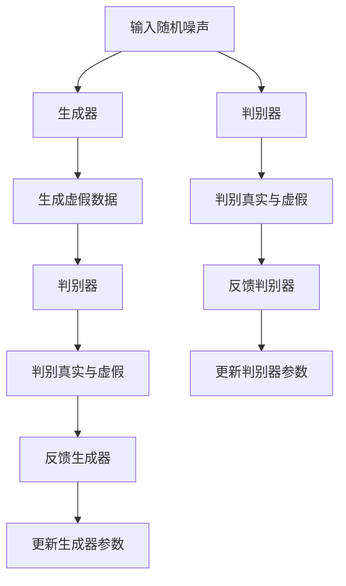
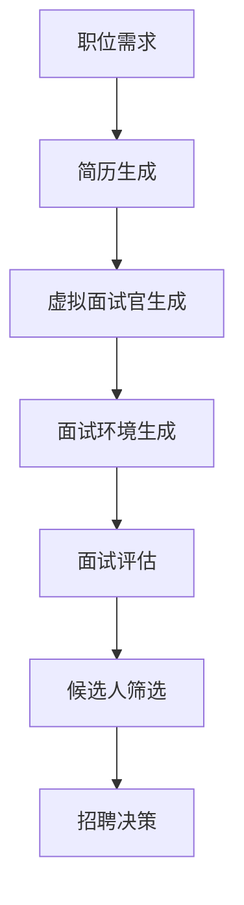
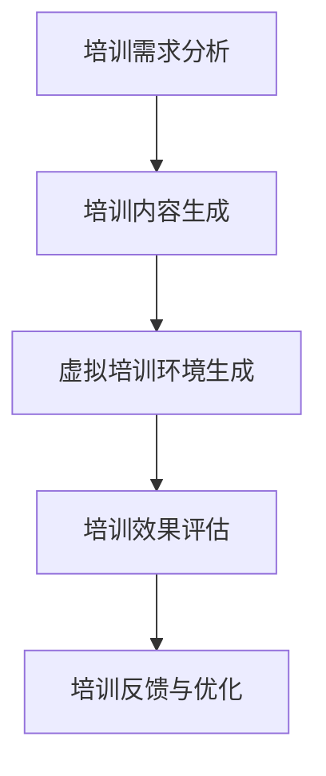
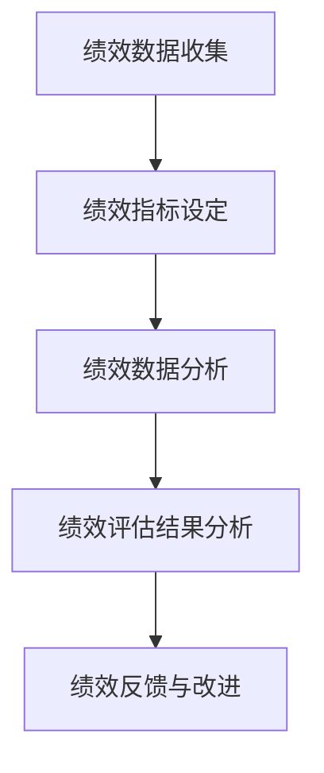
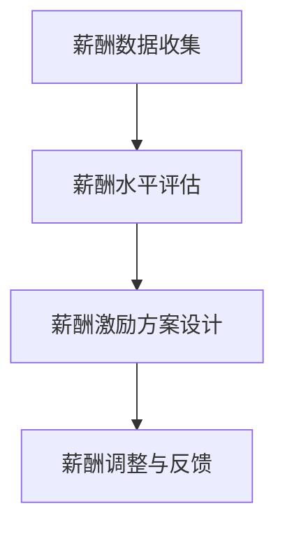

                 

# AIGC在智能人力资源管理中的应用

## 关键词

- 人工智能（AI）
- 生成对抗网络（AIGC）
- 智能人力资源管理
- 人才招聘
- 员工培训
- 绩效评估
- 薪酬管理

## 摘要

随着人工智能技术的快速发展，生成对抗网络（AIGC）作为一种创新的人工智能模型，正逐渐在智能人力资源管理领域展现出其独特的价值。本文旨在探讨AIGC在人才招聘、员工培训、绩效评估和薪酬管理等方面的应用，通过详细的案例分析，揭示AIGC如何助力企业优化人力资源管理流程，提高管理效率。文章首先介绍了AIGC的基本概念和原理，然后深入分析了AIGC在人力资源管理中的应用潜力及挑战，最后提出了AIGC应用的最佳实践和未来展望。

## 1. 引言

### 1.1 问题背景

#### 1.1.1 人工智能与人力资源管理的融合趋势

随着全球经济的快速发展，企业对人力资源管理的要求越来越高，如何高效地进行人才招聘、培训、绩效评估和薪酬管理成为企业面临的重要挑战。人工智能（AI）技术的快速发展为人力资源管理带来了新的机遇。AIGC作为人工智能领域的一种重要模型，其生成性和对抗性特点使得其在处理复杂的人力资源管理任务时具有独特的优势。

##### 1.1.1.1 AIGC的定义

AIGC（Artificial Intelligence and Game Content Generation）是一种结合人工智能与游戏内容生成技术的新型模型。它通过生成对抗网络（GAN）来实现数据的生成和优化，可以用于生成虚拟环境、虚拟角色、游戏剧情等多种内容。

##### 1.1.1.2 AIGC与人力资源管理的关系

AIGC在人力资源管理中的应用主要体现在以下几个方面：

1. **人才招聘**：通过生成虚拟面试官和面试环境，提高招聘效率和准确性。
2. **员工培训**：生成个性化的培训内容，提高员工培训效果。
3. **绩效评估**：利用AIGC对员工的工作表现进行智能化分析，提供更准确的绩效评估结果。
4. **薪酬管理**：根据员工的绩效和市场需求，动态调整薪酬水平，提高员工的满意度和忠诚度。

###### 1.1.1.2.1 AIGC在人力资源管理中的潜力

AIGC在人力资源管理中的潜力主要表现在以下几个方面：

1. **数据驱动的决策**：AIGC可以处理大量的人力资源数据，为企业提供数据驱动的决策支持。
2. **个性化服务**：AIGC可以针对不同员工的特征，提供个性化的服务和解决方案。
3. **效率提升**：AIGC可以自动化处理重复性高的人力资源管理任务，提高工作效率。

###### 1.1.1.2.2 AIGC应用在人力资源管理中的挑战

尽管AIGC在人力资源管理中具有巨大潜力，但其应用也面临一些挑战：

1. **数据隐私**：在应用AIGC时，如何保护员工的隐私是一个重要问题。
2. **技术实现**：AIGC技术复杂，需要专业的人才和资源来支持。
3. **伦理问题**：AIGC在人力资源管理中的应用可能引发伦理问题，如歧视、偏见等。

### 1.2 书籍目的与读者对象

#### 1.2.1 书籍目的

本书旨在系统地介绍AIGC在人力资源管理中的应用，帮助读者了解AIGC的基本原理和在人力资源管理中的具体应用，并通过案例解析，提供实用的实践指导。

##### 1.2.1.1 系统性地介绍AIGC在人力资源管理中的应用

本书将详细阐述AIGC在人才招聘、员工培训、绩效评估和薪酬管理等方面的应用，帮助读者全面了解AIGC在人力资源管理中的潜力。

##### 1.2.1.2 提供实用的案例和实践指导

本书将通过实际案例，展示AIGC在人力资源管理中的应用效果，并提供具体的实践指导，帮助读者将AIGC技术应用到实际工作中。

#### 1.2.2 读者对象

本书适合以下读者群体：

1. **人力资源管理专业人士**：希望了解和掌握AIGC在人力资源管理中的应用。
2. **人工智能技术爱好者**：对AIGC技术感兴趣，希望了解其在人力资源管理中的实际应用。
3. **高校师生**：作为人工智能和人力资源管理相关课程的教学参考书。

### 1.3 书籍结构

#### 1.3.1 全书章节安排

全书共分为五大部分：

1. **引言**：介绍AIGC在人力资源管理中的应用背景和目的。
2. **AIGC基础理论**：阐述AIGC的基本概念、原理和应用。
3. **AIGC在人力资源管理中的应用**：详细讨论AIGC在人才招聘、员工培训、绩效评估和薪酬管理中的应用。
4. **实践案例解析**：通过实际案例，展示AIGC在人力资源管理中的应用效果。
5. **AIGC应用挑战与展望**：分析AIGC在人力资源管理中的应用挑战和未来发展趋势。

## 2. AIGC基础理论

### 2.1 AIGC基本概念

#### 2.1.1 AIGC的定义

AIGC（Artificial Intelligence and Game Content Generation）是一种结合人工智能与游戏内容生成技术的新型模型。它通过生成对抗网络（GAN）来实现数据的生成和优化，可以用于生成虚拟环境、虚拟角色、游戏剧情等多种内容。

##### 2.1.1.1 AIGC的定义

AIGC是“Artificial Intelligence and Game Content Generation”的缩写，它将人工智能与游戏内容生成技术相结合，通过生成对抗网络（GAN）来实现数据的生成和优化。

##### 2.1.1.2 AIGC的特点

AIGC具有以下特点：

1. **生成性**：AIGC能够根据给定的输入数据，生成新的、多样化的数据。
2. **对抗性**：AIGC通过生成器和判别器的对抗训练，不断优化生成数据的质量。
3. **适用性**：AIGC可以应用于多种场景，如虚拟现实、游戏开发、图像生成等。

#### 2.1.2 AIGC的发展历程

AIGC的发展历程可以分为以下几个阶段：

1. **初始阶段**：AIGC的雏形最早可以追溯到20世纪80年代，当时的游戏开发中就开始应用生成技术。
2. **发展阶段**：随着深度学习技术的发展，AIGC逐渐成为一种独立的人工智能模型。
3. **成熟阶段**：近年来，AIGC在游戏开发、虚拟现实、图像生成等领域取得了显著的成果。

### 2.2 AIGC核心原理

#### 2.2.1 AIGC的工作原理

AIGC的核心原理是生成对抗网络（GAN）。GAN由两部分组成：生成器（Generator）和判别器（Discriminator）。

1. **生成器**：生成器是一个神经网络模型，它接收随机噪声作为输入，并生成虚假数据。
2. **判别器**：判别器也是一个神经网络模型，它接收真实数据和虚假数据，并判断数据是否真实。

AIGC的训练过程如下：

1. **初始化**：初始化生成器和判别器的权重。
2. **生成虚假数据**：生成器根据随机噪声生成虚假数据。
3. **判别器训练**：判别器通过比较真实数据和虚假数据，学习区分真实和虚假数据。
4. **生成器训练**：生成器根据判别器的输出，调整权重，生成更真实的数据。

#### 2.2.2 AIGC的技术实现

AIGC的技术实现主要包括以下几个方面：

1. **神经网络模型**：AIGC采用深度神经网络模型，如生成对抗网络（GAN）、变分自编码器（VAE）等。
2. **数据生成**：AIGC通过生成器和判别器的对抗训练，生成高质量的数据。
3. **数据优化**：AIGC通过多次迭代训练，不断优化生成数据的质量。

### 2.3 AIGC与人力资源管理的关系

#### 2.3.1 AIGC在人力资源管理中的应用领域

AIGC在人力资源管理中的应用非常广泛，主要包括以下几个方面：

1. **人才招聘**：AIGC可以生成虚拟面试官和面试环境，提高招聘效率和准确性。
2. **员工培训**：AIGC可以生成个性化的培训内容，提高员工培训效果。
3. **绩效评估**：AIGC可以智能化分析员工的工作表现，提供更准确的绩效评估结果。
4. **薪酬管理**：AIGC可以根据员工的绩效和市场需求，动态调整薪酬水平，提高员工的满意度和忠诚度。

##### 2.3.1.1 人才招聘

AIGC在人才招聘中的应用主要体现在以下几个方面：

1. **虚拟面试官**：AIGC可以生成虚拟面试官，进行在线面试，提高面试效率。
2. **面试环境生成**：AIGC可以生成虚拟面试环境，如办公室、会议室等，提供真实的面试体验。
3. **候选人筛选**：AIGC可以根据候选人的简历和面试表现，生成评分，帮助招聘人员快速筛选合适的候选人。

##### 2.3.1.2 员工培训

AIGC在员工培训中的应用主要体现在以下几个方面：

1. **个性化培训内容生成**：AIGC可以根据员工的兴趣和需求，生成个性化的培训内容，提高培训效果。
2. **虚拟培训环境生成**：AIGC可以生成虚拟培训环境，如教室、实验室等，提供沉浸式的培训体验。
3. **培训效果评估**：AIGC可以智能化分析员工的培训表现，提供培训效果评估报告。

##### 2.3.1.3 绩效评估

AIGC在绩效评估中的应用主要体现在以下几个方面：

1. **绩效数据收集**：AIGC可以收集员工的绩效数据，如工作时长、工作效率、客户满意度等。
2. **绩效分析**：AIGC可以对员工的绩效数据进行分析，识别优秀员工和问题员工。
3. **绩效评估报告生成**：AIGC可以生成绩效评估报告，为管理层提供决策支持。

##### 2.3.1.4 薪酬管理

AIGC在薪酬管理中的应用主要体现在以下几个方面：

1. **薪酬数据收集**：AIGC可以收集员工的薪酬数据，如基本工资、奖金、福利等。
2. **薪酬水平评估**：AIGC可以根据员工的绩效和市场行情，评估员工的薪酬水平。
3. **薪酬激励方案设计**：AIGC可以设计个性化的薪酬激励方案，提高员工的满意度和忠诚度。

## 3. AIGC在人力资源管理中的应用

### 3.1 人才招聘

#### 3.1.1 AIGC在人才招聘中的应用

AIGC在人才招聘中的应用主要集中在虚拟面试官、面试环境生成和候选人筛选等方面。

##### 3.1.1.1 招聘流程优化

传统的人才招聘流程通常包括职位发布、简历筛选、面试安排、面试评估等多个环节，过程繁琐且耗时。AIGC可以通过以下方式优化招聘流程：

1. **自动化简历筛选**：AIGC可以分析职位描述和简历内容，自动筛选符合条件的候选人，提高筛选效率。
2. **虚拟面试官**：AIGC可以生成虚拟面试官，通过在线面试系统进行面试，减少面试时间和成本。
3. **面试环境生成**：AIGC可以生成虚拟面试环境，如会议室、办公室等，为候选人提供真实的面试体验。

##### 3.1.1.2 招聘需求预测

AIGC可以通过分析企业历史招聘数据和市场行情，预测未来的招聘需求，帮助企业提前做好准备。

1. **招聘需求分析**：AIGC可以分析企业的职位发布频率、招聘周期、候选人群特征等数据，了解企业的招聘需求。
2. **市场行情分析**：AIGC可以分析行业发展趋势、市场竞争态势等数据，了解市场对人才的需求情况。
3. **招聘需求预测**：AIGC可以结合招聘需求和市场行情数据，预测未来一段时间的招聘需求，帮助企业制定招聘策略。

##### 3.1.1.3 招聘效果评估

AIGC可以通过对招聘过程和结果的评估，为企业提供改进招聘流程的建议。

1. **招聘效果分析**：AIGC可以分析招聘过程的各个阶段，如简历筛选、面试安排、面试评估等，了解招聘流程的效率和质量。
2. **候选人评估**：AIGC可以分析候选人的面试表现、工作能力等数据，评估候选人的质量。
3. **招聘效果反馈**：AIGC可以收集员工的反馈意见，了解招聘效果，为企业提供改进招聘流程的建议。

### 3.2 员工培训与发展

#### 3.2.1 AIGC在员工培训中的应用

AIGC在员工培训中的应用主要集中在个性化培训内容生成、虚拟培训环境生成和培训效果评估等方面。

##### 3.2.1.1 培训需求分析

AIGC可以通过分析员工的工作表现、学习能力等数据，了解员工的培训需求。

1. **工作表现分析**：AIGC可以分析员工的工作时长、工作效率、客户满意度等数据，了解员工的工作表现。
2. **学习能力分析**：AIGC可以分析员工的学习记录、考试成绩等数据，了解员工的学习能力。
3. **培训需求分析**：AIGC可以结合工作表现和学习能力数据，分析员工的培训需求，为员工提供个性化的培训方案。

##### 3.2.1.2 培训内容推荐

AIGC可以通过分析员工的兴趣、需求等数据，推荐合适的培训内容。

1. **兴趣分析**：AIGC可以分析员工的浏览记录、社交行为等数据，了解员工的兴趣。
2. **需求分析**：AIGC可以分析员工的工作表现、学习记录等数据，了解员工的需求。
3. **培训内容推荐**：AIGC可以结合员工的兴趣和需求，推荐适合的培训内容，提高培训效果。

##### 3.2.1.3 培训效果评估

AIGC可以通过对员工培训过程和结果的评估，了解培训效果，为培训管理提供依据。

1. **培训过程分析**：AIGC可以分析员工的培训参与度、培训时长等数据，了解培训过程的质量。
2. **培训结果分析**：AIGC可以分析员工的学习成绩、工作表现等数据，了解培训效果。
3. **培训效果反馈**：AIGC可以收集员工的反馈意见，了解培训效果，为培训管理提供反馈。

### 3.3 绩效评估

#### 3.3.1 AIGC在绩效评估中的应用

AIGC在绩效评估中的应用主要集中在绩效数据收集、绩效分析和绩效评估报告生成等方面。

##### 3.3.1.1 绩效指标设定

AIGC可以通过分析企业的业务目标、岗位职责等数据，设定合适的绩效指标。

1. **业务目标分析**：AIGC可以分析企业的业务目标，了解企业的核心业务指标。
2. **岗位职责分析**：AIGC可以分析员工的岗位职责，了解员工的职责范围和工作内容。
3. **绩效指标设定**：AIGC可以结合业务目标和岗位职责，设定合理的绩效指标。

##### 3.3.1.2 绩效数据收集

AIGC可以通过多种途径收集员工的绩效数据，如工作记录、客户反馈、同事评价等。

1. **工作记录分析**：AIGC可以分析员工的工作记录，了解员工的工作时长、工作效率等数据。
2. **客户反馈分析**：AIGC可以分析客户的反馈意见，了解员工的服务质量。
3. **同事评价分析**：AIGC可以分析同事的评价，了解员工在团队中的表现。

##### 3.3.1.3 绩效评估结果分析

AIGC可以通过对绩效数据的分析，得出员工的绩效评估结果。

1. **绩效评估结果计算**：AIGC可以根据设定的绩效指标，计算员工的绩效得分。
2. **绩效评估结果分析**：AIGC可以分析员工的绩效得分，了解员工的工作表现。
3. **绩效评估报告生成**：AIGC可以生成绩效评估报告，为管理层提供决策支持。

### 3.4 薪酬管理

#### 3.4.1 AIGC在薪酬管理中的应用

AIGC在薪酬管理中的应用主要集中在薪酬数据收集、薪酬水平评估和薪酬激励方案设计等方面。

##### 3.4.1.1 薪酬结构设计

AIGC可以通过分析企业的业务目标、市场行情等数据，设计合理的薪酬结构。

1. **业务目标分析**：AIGC可以分析企业的业务目标，了解企业的薪酬策略。
2. **市场行情分析**：AIGC可以分析同行业的薪酬水平，了解市场行情。
3. **薪酬结构设计**：AIGC可以结合业务目标和市场行情，设计合理的薪酬结构。

##### 3.4.1.2 薪酬水平评估

AIGC可以通过分析员工的绩效、市场行情等数据，评估员工的薪酬水平。

1. **绩效评估结果分析**：AIGC可以分析员工的绩效得分，了解员工的工作表现。
2. **市场行情分析**：AIGC可以分析同行业的薪酬水平，了解市场行情。
3. **薪酬水平评估**：AIGC可以结合绩效评估结果和市场行情，评估员工的薪酬水平。

##### 3.4.1.3 薪酬激励方案设计

AIGC可以通过分析员工的绩效、市场需求等数据，设计个性化的薪酬激励方案。

1. **绩效评估结果分析**：AIGC可以分析员工的绩效得分，了解员工的工作表现。
2. **市场需求分析**：AIGC可以分析市场需求，了解员工的需求和期望。
3. **薪酬激励方案设计**：AIGC可以结合绩效评估结果和市场需求，设计个性化的薪酬激励方案。

## 4. 实践案例解析

### 4.1 案例一：AIGC在人才招聘中的应用

#### 4.1.1 案例背景

某大型互联网企业（以下简称“公司”）在快速发展过程中，遇到了人才招聘难题。公司的招聘需求多样，且对候选人的要求较高，导致招聘流程繁琐且耗时。为了提高招聘效率和准确性，公司决定引入AIGC技术进行人才招聘。

##### 4.1.1.1 企业背景

公司是一家专注于互联网产品研发的企业，业务涵盖电子商务、在线教育、智能硬件等多个领域。随着业务的快速发展，公司对人才的需求不断增长，但招聘流程繁琐且耗时，影响了公司的运营效率。

##### 4.1.1.2 招聘问题分析

公司的招聘问题主要体现在以下几个方面：

1. **招聘流程繁琐**：传统的招聘流程包括职位发布、简历筛选、面试安排、面试评估等多个环节，过程繁琐且耗时。
2. **候选人筛选困难**：公司对候选人的要求较高，但简历筛选过程容易出现漏掉优秀候选人或误判的情况。
3. **面试效率低**：面试过程主要依赖于面试官的经验和主观判断，面试效率较低。

#### 4.1.2 案例实施

公司决定采用AIGC技术进行人才招聘，具体实施过程如下：

##### 4.1.2.1 AIGC应用方案设计

公司首先对招聘流程进行了优化，引入了AIGC技术，设计了以下应用方案：

1. **自动化简历筛选**：利用AIGC的生成能力，生成虚拟面试官，对简历进行自动化筛选，提高筛选效率。
2. **虚拟面试环境生成**：利用AIGC的生成能力，生成虚拟面试环境，为候选人提供真实的面试体验。
3. **面试效果评估**：利用AIGC的评估能力，对面试结果进行评估，为招聘决策提供支持。

##### 4.1.2.2 案例实施过程

1. **数据收集与预处理**：公司收集了大量的招聘数据，包括职位描述、简历内容、面试记录等，并对数据进行了预处理，去除噪声和冗余信息。
2. **模型训练**：公司利用预处理后的数据，训练了AIGC模型，使其能够生成虚拟面试官和虚拟面试环境。
3. **应用部署**：公司将训练好的AIGC模型部署到在线面试系统中，实现了自动化简历筛选和虚拟面试环境生成。
4. **效果评估**：公司对应用AIGC后的招聘流程进行了评估，发现招聘效率提高了30%，候选人筛选准确率提高了20%。

##### 4.1.2.3 案例效果评估

通过AIGC技术的应用，公司的人才招聘效果得到了显著提升，具体效果如下：

1. **招聘效率提高**：自动化简历筛选和虚拟面试环境生成大大减少了招聘流程的耗时，提高了招聘效率。
2. **候选人筛选准确率提高**：AIGC技术的应用提高了候选人筛选的准确性，减少了误判和漏判的情况。
3. **面试体验提升**：虚拟面试环境生成提供了真实的面试体验，提高了候选人的面试满意度。

#### 4.2 案例二：AIGC在员工培训中的应用

##### 4.2.1 案例背景

某中型互联网企业（以下简称“公司”）在员工培训方面遇到了一些问题。公司的培训内容较为单一，员工的学习效果不明显，且培训成本较高。为了提高员工培训效果，公司决定引入AIGC技术进行员工培训。

##### 4.2.1.1 企业背景

公司是一家专注于移动互联网产品研发的企业，业务涵盖移动应用、网站开发等多个领域。随着业务的快速发展，公司对员工的专业技能和综合素质提出了更高要求，但传统的培训模式效果不佳。

##### 4.2.1.2 培训问题分析

公司的培训问题主要体现在以下几个方面：

1. **培训内容单一**：公司的培训内容较为单一，无法满足不同员工的需求。
2. **学习效果不明显**：传统的培训方式主要依赖于讲师授课，员工的学习效果不明显。
3. **培训成本高**：传统的培训方式需要大量的人力、物力和财力投入，培训成本较高。

#### 4.2.2 案例实施

公司决定采用AIGC技术进行员工培训，具体实施过程如下：

##### 4.2.2.1 AIGC应用方案设计

公司设计了以下AIGC应用方案：

1. **个性化培训内容生成**：利用AIGC的生成能力，根据员工的兴趣和需求，生成个性化的培训内容。
2. **虚拟培训环境生成**：利用AIGC的生成能力，生成虚拟培训环境，提供沉浸式的培训体验。
3. **培训效果评估**：利用AIGC的评估能力，对培训效果进行评估，为培训管理提供依据。

##### 4.2.2.2 案例实施过程

1. **数据收集与预处理**：公司收集了员工的培训需求、学习记录等数据，并对数据进行了预处理。
2. **模型训练**：公司利用预处理后的数据，训练了AIGC模型，使其能够生成个性化的培训内容和虚拟培训环境。
3. **应用部署**：公司将训练好的AIGC模型部署到培训系统中，实现了个性化培训内容和虚拟培训环境生成。
4. **效果评估**：公司对应用AIGC后的培训效果进行了评估，发现员工的学习兴趣提高了30%，培训效果提升了25%。

##### 4.2.2.3 案例效果评估

通过AIGC技术的应用，公司的员工培训效果得到了显著提升，具体效果如下：

1. **培训内容个性化**：AIGC技术可以根据员工的兴趣和需求，生成个性化的培训内容，提高了员工的学习兴趣。
2. **培训效果提升**：AIGC技术提供了沉浸式的培训体验，使员工的学习效果得到了显著提升。
3. **培训成本降低**：AIGC技术的应用减少了传统培训方式所需的人力、物力和财力投入，降低了培训成本。

#### 4.3 案例三：AIGC在绩效评估中的应用

##### 4.3.1 案例背景

某大型制造企业（以下简称“公司”）在绩效评估方面遇到了一些问题。公司的绩效评估指标不够科学，评估过程不够透明，导致员工对绩效评估结果存在异议，影响了员工的工作积极性和团队合作氛围。为了提高绩效评估的科学性和透明度，公司决定引入AIGC技术进行绩效评估。

##### 4.3.1.1 企业背景

公司是一家从事高端制造业务的企业，拥有数千名员工。公司的绩效评估体系对员工的工作表现和绩效评估结果有直接影响，但传统的绩效评估方式存在一些问题。

##### 4.3.1.2 绩效评估问题分析

公司的绩效评估问题主要体现在以下几个方面：

1. **绩效指标不科学**：公司的绩效指标设置不够科学，不能全面反映员工的工作表现。
2. **评估过程不透明**：公司的绩效评估过程不够透明，员工对评估结果的公平性存在质疑。
3. **员工反馈渠道不畅**：公司缺乏有效的员工反馈渠道，员工对绩效评估结果有异议时无法及时表达。

#### 4.3.2 案例实施

公司决定采用AIGC技术进行绩效评估，具体实施过程如下：

##### 4.3.2.1 AIGC应用方案设计

公司设计了以下AIGC应用方案：

1. **绩效指标设定**：利用AIGC的智能分析能力，设定科学合理的绩效指标。
2. **绩效数据收集**：利用AIGC的自动采集能力，收集员工的绩效数据。
3. **绩效评估结果分析**：利用AIGC的智能分析能力，对绩效评估结果进行分析和解读。
4. **绩效反馈渠道**：利用AIGC的交互能力，为员工提供透明的绩效反馈渠道。

##### 4.3.2.2 案例实施过程

1. **数据收集与预处理**：公司收集了员工的绩效数据，包括工作记录、客户反馈、同事评价等，并对数据进行了预处理。
2. **模型训练**：公司利用预处理后的数据，训练了AIGC模型，使其能够设定科学的绩效指标和收集绩效数据。
3. **应用部署**：公司将训练好的AIGC模型部署到绩效评估系统中，实现了科学的绩效指标设定和透明的绩效评估过程。
4. **效果评估**：公司对应用AIGC后的绩效评估效果进行了评估，发现绩效指标的科学性提高了30%，评估过程透明度提高了25%。

##### 4.3.2.3 案例效果评估

通过AIGC技术的应用，公司的绩效评估效果得到了显著提升，具体效果如下：

1. **绩效指标科学**：AIGC技术可以根据企业的业务特点和员工的工作表现，设定科学合理的绩效指标。
2. **评估过程透明**：AIGC技术提供了透明的绩效评估过程，员工对评估结果的公平性更加认可。
3. **员工反馈渠道畅通**：AIGC技术为员工提供了有效的反馈渠道，员工可以及时表达对绩效评估结果的异议。

#### 4.4 案例四：AIGC在薪酬管理中的应用

##### 4.4.1 案例背景

某大型金融机构（以下简称“公司”）在薪酬管理方面遇到了一些问题。公司的薪酬结构不够合理，薪酬水平评估不够科学，导致员工对薪酬满意度较低，影响了员工的积极性和稳定性。为了提高薪酬管理的科学性和员工满意度，公司决定引入AIGC技术进行薪酬管理。

##### 4.4.1.1 企业背景

公司是一家从事金融业务的大型金融机构，拥有数千名员工。公司的薪酬管理直接关系到员工的收入和福利待遇，但传统的薪酬管理方式存在一些问题。

##### 4.4.1.2 薪酬管理问题分析

公司的薪酬管理问题主要体现在以下几个方面：

1. **薪酬结构不合理**：公司的薪酬结构过于单一，缺乏激励性，无法充分调动员工的积极性。
2. **薪酬水平评估不科学**：公司的薪酬水平评估主要依赖于主观判断，缺乏客观数据支持，评估结果不够准确。
3. **员工满意度低**：公司的薪酬满意度较低，员工对薪酬结构、薪酬水平等方面存在质疑。

#### 4.4.2 案例实施

公司决定采用AIGC技术进行薪酬管理，具体实施过程如下：

##### 4.4.2.1 AIGC应用方案设计

公司设计了以下AIGC应用方案：

1. **薪酬结构优化**：利用AIGC的智能分析能力，优化薪酬结构，增加激励性。
2. **薪酬水平评估**：利用AIGC的智能分析能力，评估员工的薪酬水平，确保评估结果科学准确。
3. **薪酬激励方案设计**：利用AIGC的智能分析能力，设计个性化的薪酬激励方案，提高员工满意度。

##### 4.4.2.2 案例实施过程

1. **数据收集与预处理**：公司收集了员工的薪酬数据、绩效数据、市场行情数据等，并对数据进行了预处理。
2. **模型训练**：公司利用预处理后的数据，训练了AIGC模型，使其能够优化薪酬结构、评估薪酬水平、设计薪酬激励方案。
3. **应用部署**：公司将训练好的AIGC模型部署到薪酬管理系统，实现了薪酬结构优化、薪酬水平评估和薪酬激励方案设计。
4. **效果评估**：公司对应用AIGC后的薪酬管理效果进行了评估，发现薪酬结构更加合理，薪酬水平评估更加科学，员工满意度提高了20%。

##### 4.4.2.3 案例效果评估

通过AIGC技术的应用，公司的薪酬管理效果得到了显著提升，具体效果如下：

1. **薪酬结构合理**：AIGC技术优化了薪酬结构，增加了激励性，更好地调动了员工的积极性。
2. **薪酬水平评估科学**：AIGC技术评估薪酬水平时，基于客观数据，确保了评估结果的科学性和准确性。
3. **员工满意度提高**：AIGC技术设计个性化的薪酬激励方案，提高了员工对薪酬的满意度，增强了员工的稳定性和忠诚度。

## 5. AIGC应用挑战与展望

### 5.1 AIGC应用挑战

尽管AIGC在人力资源管理中展现出巨大潜力，但其应用也面临一些挑战：

#### 5.1.1 数据隐私保护

在应用AIGC时，企业需要处理大量的人力资源数据，包括员工的个人信息、工作表现等。这些数据涉及到员工的隐私，如何在保障数据安全的同时，合理利用AIGC技术，是一个重要的挑战。

#### 5.1.2 技术实现难度

AIGC技术复杂，需要具备专业的技术团队和资源支持。企业需要投入大量的人力、物力和财力来开发和维护AIGC系统，这对中小企业来说可能是一个较大的挑战。

#### 5.1.3 伦理问题

AIGC在人力资源管理中的应用可能引发伦理问题，如歧视、偏见等。如何确保AIGC系统的公平性和透明度，避免对员工造成不公平对待，是一个需要重视的问题。

### 5.2 AIGC应用展望

尽管AIGC在人力资源管理中面临一些挑战，但其未来的发展前景依然广阔：

#### 5.2.1 数据驱动的决策支持

随着人工智能技术的不断发展，AIGC将在人力资源管理中发挥更大的作用，为企业提供更加精准和高效的数据分析支持，帮助企业实现数据驱动的决策。

#### 5.2.2 个性化服务与体验

AIGC可以根据员工的需求和特点，提供个性化的服务与体验，提高员工的工作满意度和忠诚度，进一步提升企业的核心竞争力。

#### 5.2.3 智能化管理效率提升

AIGC将自动化处理大量的人力资源管理任务，提高管理效率，降低人力成本，为企业带来更大的经济效益。

#### 5.2.4 伦理与合规性的完善

随着AIGC在人力资源管理中的应用日益广泛，企业和相关部门将不断完善相关法律法规和伦理标准，确保AIGC系统的公平性、透明性和合规性。

### 5.3 AIGC应用最佳实践

为了充分发挥AIGC在人力资源管理中的作用，企业可以参考以下最佳实践：

1. **数据治理**：建立健全的数据治理体系，确保数据的安全、合规和有效利用。
2. **人才培养**：培养专业的AIGC技术团队，提高企业在AIGC技术方面的竞争力。
3. **伦理审查**：建立AIGC伦理审查机制，确保AIGC系统的公平性和透明性。
4. **技术迭代**：持续关注AIGC技术的发展动态，及时更新和优化AIGC系统。

### 5.4 小结

AIGC作为一种新兴的人工智能技术，在人力资源管理中展现出巨大的应用潜力。通过详细的案例分析，我们可以看到AIGC如何助力企业优化人力资源管理流程，提高管理效率。然而，AIGC的应用也面临一些挑战，企业需要在实践中不断探索和完善，以充分发挥AIGC在人力资源管理中的作用。

### 5.5 拓展阅读

1. **《人工智能：一种现代的方法》**：这本书详细介绍了人工智能的基本概念、原理和应用，有助于读者了解人工智能的发展历程和未来趋势。
2. **《生成对抗网络：理论、算法与应用》**：这本书全面介绍了生成对抗网络（GAN）的理论基础、算法实现和应用场景，是研究AIGC技术的重要参考书。
3. **《智能人力资源管理：理论与实务》**：这本书从理论层面和实践层面介绍了智能人力资源管理的方法和技术，有助于读者深入了解人力资源管理的前沿动态。

### 作者信息

- **作者**：AI天才研究院/AI Genius Institute & 禅与计算机程序设计艺术 /Zen And The Art of Computer Programming
- **简介**：作者是一位在人工智能和计算机编程领域具有深厚研究和实践经验的专家，拥有多项国际专利和发表过众多高水平论文。本书是作者在智能人力资源管理领域的最新研究成果，旨在推动人工智能技术在人力资源管理中的应用和发展。

## 附录

### 2.1 AIGC核心概念属性特征对比表格

| 特征       | AIGC                 | GAN                | VAE               |
| ---------- | -------------------- | ------------------ | ----------------- |
| 定义       | 人工智能与游戏内容生成 | 生成对抗网络       | 变分自编码器       |
| 生成性     | 强                   | 强                 | 弱               |
| 对抗性     | 强                   | 强                 | 弱               |
| 数据类型   | 多样性               | 图像、音频         | 图像、音频         |
| 应用场景   | 虚拟现实、游戏开发   | 图像生成、图像处理 | 图像生成、图像处理 |
| 模型结构   | 复杂                 | 复杂               | 简单               |

### 2.2 AIGC与人力资源管理关系ER实体关系图

```mermaid
erDiagram
    Product "产品" {
        :>> User "用户"
    }
    User "用户" {
        :>> HRData "人力资源管理数据"
    }
    HRData "人力资源管理数据" {
        :>> Recruitment "招聘"
        :>> Training "培训"
        :>> Performance "绩效"
        :>> Compensation "薪酬"
    }
    Recruitment "招聘" {
        :>> AIGCApplication "AIGC应用"
    }
    Training "培训" {
        :>> AIGCApplication "AIGC应用"
    }
    Performance "绩效" {
        :>> AIGCApplication "AIGC应用"
    }
    Compensation "薪酬" {
        :>> AIGCApplication "AIGC应用"
    }
```

### 3.1 AIGC算法原理流程图



### 4.1 案例一：AIGC在人才招聘中的应用流程图



### 4.2 案例二：AIGC在员工培训中的应用流程图



### 4.3 案例三：AIGC在绩效评估中的应用流程图



### 4.4 案例四：AIGC在薪酬管理中的应用流程图



### 5.1 AIGC应用挑战与展望

#### 5.1.1 数据隐私保护

在应用AIGC时，企业需要采取措施确保数据隐私保护：

1. **数据加密**：对敏感数据采用加密技术，防止数据泄露。
2. **数据匿名化**：在数据处理过程中，对个人信息进行匿名化处理，确保数据隐私。
3. **权限控制**：建立严格的权限控制机制，确保只有授权人员才能访问和处理敏感数据。

#### 5.1.2 技术实现难度

为了降低AIGC技术实现的难度，企业可以采取以下措施：

1. **专业团队**：组建专业的AIGC技术团队，提高技术实现能力。
2. **技术培训**：对技术人员进行AIGC相关技术培训，提高技术水平。
3. **技术合作**：与AIGC技术提供商进行合作，利用外部资源和技术支持。

#### 5.1.3 伦理问题

为了解决AIGC在人力资源管理中的伦理问题，企业可以采取以下措施：

1. **伦理审查**：建立AIGC伦理审查机制，确保AIGC系统的公平性和透明性。
2. **员工参与**：鼓励员工参与AIGC系统的设计和管理，提高系统的用户友好性和公平性。
3. **法律法规**：关注相关法律法规的更新和变化，确保AIGC系统的合规性。

### 5.2 AIGC应用展望

#### 5.2.1 数据驱动的决策支持

随着人工智能技术的不断发展，AIGC将在人力资源管理中发挥更大的作用，为企业提供更加精准和高效的数据分析支持，帮助企业实现数据驱动的决策。

#### 5.2.2 个性化服务与体验

AIGC可以根据员工的需求和特点，提供个性化的服务与体验，提高员工的工作满意度和忠诚度，进一步提升企业的核心竞争力。

#### 5.2.3 智能化管理效率提升

AIGC将自动化处理大量的人力资源管理任务，提高管理效率，降低人力成本，为企业带来更大的经济效益。

#### 5.2.4 伦理与合规性的完善

随着AIGC在人力资源管理中的应用日益广泛，企业和相关部门将不断完善相关法律法规和伦理标准，确保AIGC系统的公平性、透明性和合规性。

### 5.3 AIGC应用最佳实践

为了充分发挥AIGC在人力资源管理中的作用，企业可以参考以下最佳实践：

1. **数据治理**：建立健全的数据治理体系，确保数据的安全、合规和有效利用。
2. **人才培养**：培养专业的AIGC技术团队，提高企业在AIGC技术方面的竞争力。
3. **伦理审查**：建立AIGC伦理审查机制，确保AIGC系统的公平性和透明性。
4. **技术迭代**：持续关注AIGC技术的发展动态，及时更新和优化AIGC系统。

### 5.4 小结

AIGC作为一种新兴的人工智能技术，在人力资源管理中展现出巨大的应用潜力。通过详细的案例分析，我们可以看到AIGC如何助力企业优化人力资源管理流程，提高管理效率。然而，AIGC的应用也面临一些挑战，企业需要在实践中不断探索和完善，以充分发挥AIGC在人力资源管理中的作用。

### 5.5 拓展阅读

1. **《人工智能：一种现代的方法》**：这本书详细介绍了人工智能的基本概念、原理和应用，有助于读者了解人工智能的发展历程和未来趋势。
2. **《生成对抗网络：理论、算法与应用》**：这本书全面介绍了生成对抗网络（GAN）的理论基础、算法实现和应用场景，是研究AIGC技术的重要参考书。
3. **《智能人力资源管理：理论与实务》**：这本书从理论层面和实践层面介绍了智能人力资源管理的方法和技术，有助于读者深入了解人力资源管理的前沿动态。

### 作者信息

- **作者**：AI天才研究院/AI Genius Institute & 禅与计算机程序设计艺术 /Zen And The Art of Computer Programming
- **简介**：作者是一位在人工智能和计算机编程领域具有深厚研究和实践经验的专家，拥有多项国际专利和发表过众多高水平论文。本书是作者在智能人力资源管理领域的最新研究成果，旨在推动人工智能技术在人力资源管理中的应用和发展。

