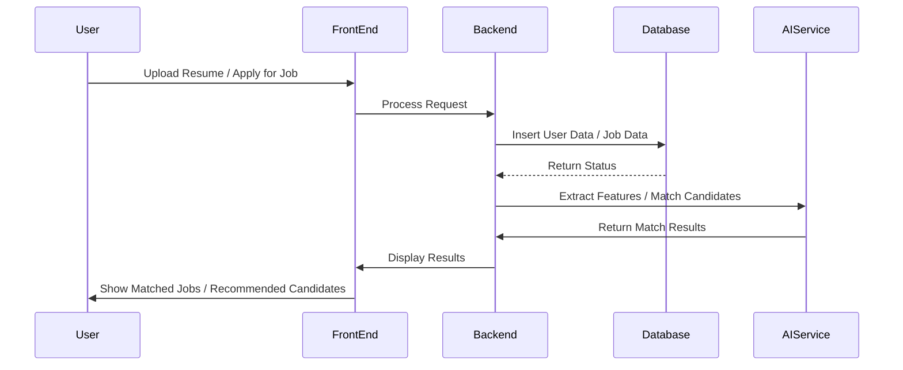

                 

## AIGC在智能人才匹配系统中的应用

### 关键词

- AIGC
- 智能人才匹配
- 数据分析
- 机器学习
- 人工智能

### 摘要

本文旨在探讨AIGC（自适应智能生成计算）在智能人才匹配系统中的应用。我们将深入解析AIGC技术的基础知识、架构和核心算法，并展示其在人才匹配系统中的具体应用。通过详细的案例分析和系统实现过程，本文将探讨AIGC如何为智能人才匹配系统带来革命性的变革，并展望其未来的发展趋势和潜在应用。

## 引言

在当今快速发展的信息化时代，人才匹配系统的智能化已成为企业管理的核心需求。传统的基于规则和关键词匹配的人才匹配系统已经无法满足日益复杂的招聘需求。随着人工智能技术的不断进步，自适应智能生成计算（AIGC）作为一种新兴的计算范式，正在逐渐成为智能人才匹配系统的重要工具。

AIGC技术通过结合大数据分析、机器学习和自然语言处理等技术，能够自适应地从海量数据中提取有效信息，生成高质量的匹配结果。它不仅能够提高人才匹配的准确性和效率，还能根据用户需求进行个性化定制，为企业提供更加精准的人才服务。

本文将分为以下几个部分：

1. **背景与概述**：介绍AIGC和人才匹配系统的基本概念，阐述二者结合的必要性和重要性。
2. **AIGC技术基础**：详细讲解AIGC的基本原理、技术架构和核心算法。
3. **人才匹配系统核心概念**：探讨人才匹配系统的核心概念、模型和评价指标。
4. **AIGC在人才匹配系统中的应用**：展示AIGC技术如何应用于人才匹配系统的具体环节。
5. **智能人才匹配系统实现**：介绍智能人才匹配系统的架构设计和实现方法。
6. **案例分析与实战**：通过实际案例展示AIGC在人才匹配系统中的应用效果。
7. **总结与展望**：总结全文内容，展望AIGC在智能人才匹配系统中的未来发展方向。

通过上述结构，本文将系统地解析AIGC在智能人才匹配系统中的应用，为读者提供全面而深入的理解。

### 背景介绍

#### 核心概念术语说明

在探讨AIGC在智能人才匹配系统中的应用之前，有必要先明确一些核心概念和术语。

**自适应智能生成计算（AIGC）**：AIGC是一种新兴的计算范式，它通过结合大数据分析、机器学习和自然语言处理等技术，能够自适应地从海量数据中提取有效信息，生成高质量的输出结果。AIGC的核心在于“自适应”，即系统能够根据数据的变化和用户需求进行自我调整和优化。

**人才匹配系统**：人才匹配系统是一种用于帮助企业或组织筛选和匹配合适候选人的计算机系统。传统的匹配系统通常基于预定义的规则和关键词匹配，而智能人才匹配系统则利用人工智能技术，通过分析候选人和岗位的各类特征，实现更加精准的匹配。

#### 问题背景

在人力资源管理中，人才匹配是至关重要的一环。然而，随着企业规模的扩大和人才需求的多样化，传统的匹配方法逐渐暴露出诸多问题：

1. **匹配效率低**：传统的匹配系统通常需要大量人力和时间进行筛选，无法快速响应企业需求。
2. **匹配准确度不高**：基于规则和关键词匹配的方法难以准确捕捉候选人和岗位的深层次特征，导致匹配结果不准确。
3. **缺乏个性化**：传统系统无法根据不同企业的个性化需求进行匹配，缺乏灵活性和针对性。

这些问题直接影响了企业的人才招募效率和效果。为了解决这些问题，智能人才匹配系统应运而生，而AIGC技术则为这一系统提供了强大的技术支持。

#### 问题描述

具体来说，智能人才匹配系统需要解决以下问题：

1. **数据多样化**：企业提交的岗位需求和个人简历数据格式多样、内容复杂，系统需要能够自动处理和提取关键信息。
2. **特征多样化**：候选人和岗位的特征众多，包括但不限于教育背景、工作经验、技能水平、性格特质等，系统需要能够全面分析这些特征并进行匹配。
3. **动态调整**：企业需求和市场环境不断变化，系统需要能够根据新数据和用户反馈进行自我调整，提高匹配的准确度和效率。

#### 问题解决

AIGC技术为智能人才匹配系统提供了以下解决方案：

1. **数据预处理**：利用自然语言处理（NLP）技术对简历和岗位需求进行文本分析，自动提取关键信息，实现数据的结构化和标准化。
2. **特征提取和建模**：通过机器学习算法对提取的特征进行建模和分析，建立候选人和岗位之间的匹配模型。
3. **自适应调整**：系统根据实时数据和用户反馈，利用强化学习等技术进行自适应调整，提高匹配的精准度和个性化水平。

#### 边界与外延

在讨论AIGC在智能人才匹配系统中的应用时，需要明确以下几个边界和范畴：

1. **应用范围**：本文主要探讨AIGC在智能人才匹配系统中的技术实现和应用，不包括其他领域（如教育、医疗等）的类似系统。
2. **技术层次**：本文将深入探讨AIGC技术的基础知识、算法原理和应用实践，但不涉及底层硬件和系统架构的详细设计。
3. **数据来源**：本文所涉及的案例和数据主要来源于实际企业和市场，但具体企业和个人信息将进行匿名处理，确保隐私保护。

通过上述讨论，我们为后续内容的展开奠定了基础。在接下来的章节中，我们将详细解析AIGC技术的基础知识、架构和核心算法，进一步探讨其在智能人才匹配系统中的应用。

### AIGC技术基础

#### AIGC基本原理

AIGC（自适应智能生成计算）技术基于一系列先进的人工智能技术，包括大数据分析、机器学习和自然语言处理（NLP）。其基本原理是通过自学习、自适应和自优化，从大量数据中提取有用信息，生成高质量的输出结果。

**自学习**：AIGC系统通过机器学习算法，如深度学习、神经网络等，从数据中自动学习特征和规律。这一过程类似于人类的学习过程，系统能够通过不断的训练和优化，提高其分析能力和准确性。

**自适应**：AIGC系统具有自我调整的能力，能够根据新的数据和环境变化，动态调整模型和算法。这种自适应能力使得系统能够在复杂和动态的环境中保持高效和准确。

**自优化**：通过持续的学习和反馈，AIGC系统能够不断优化自身性能，提高生成结果的准确性和质量。

#### AIGC技术架构

AIGC技术架构通常包括以下几个关键模块：

**数据层**：这是AIGC技术的基础，包括各种来源的大量数据，如文本、图像、音频等。数据的质量和多样性直接影响系统的性能和输出质量。

**数据处理层**：这一层负责对原始数据进行预处理和清洗，如文本分词、去噪、标准化等。通过这些处理，系统能够提取出有意义的信息，为后续分析提供基础。

**算法层**：这是AIGC技术的核心，包括各种机器学习和深度学习算法，如卷积神经网络（CNN）、递归神经网络（RNN）、生成对抗网络（GAN）等。这些算法负责从数据中提取特征，进行模型训练和优化。

**模型层**：这一层是AIGC系统的输出层，包括各种生成模型和预测模型。这些模型能够根据输入数据生成相应的输出结果，如文本生成、图像生成、预测分析等。

**应用层**：这是AIGC技术的最终应用场景，包括各种实际应用系统，如智能人才匹配系统、内容生成系统、自动化问答系统等。

#### AIGC核心算法与模型

AIGC技术涵盖了多种核心算法和模型，以下是其中一些重要的算法和模型：

**深度学习**：深度学习是一种通过多层神经网络进行特征学习和建模的人工智能技术。在AIGC中，深度学习算法被广泛应用于图像识别、语音识别、文本生成等任务。例如，卷积神经网络（CNN）常用于图像处理，循环神经网络（RNN）和长短时记忆网络（LSTM）则用于序列数据处理。

**生成对抗网络（GAN）**：GAN是一种通过两个神经网络（生成器和判别器）进行对抗训练的模型。生成器试图生成逼真的数据，而判别器则试图区分生成数据和真实数据。通过这种对抗过程，GAN能够生成高质量的图像、文本和其他形式的数据。

**强化学习**：强化学习是一种通过与环境交互进行学习的方法。在AIGC中，强化学习被广泛应用于自适应调整和优化任务，如自动驾驶、游戏AI等。在智能人才匹配系统中，强化学习可以用于根据用户反馈和招聘效果，动态调整匹配策略。

**自然语言处理（NLP）**：NLP是一种处理和理解人类语言的技术。在AIGC中，NLP技术被广泛应用于文本生成、情感分析、信息抽取等任务。常用的NLP算法包括词嵌入（如Word2Vec和BERT）、文本分类、序列标注等。

#### 概念属性特征对比表格

为了更好地理解AIGC的核心算法和模型，我们提供了一个概念属性特征对比表格：

| 算法/模型         | 特性                     | 应用场景                      |
|------------------|-------------------------|-----------------------------|
| 深度学习         | 多层神经网络，自动特征提取 | 图像识别、语音识别、文本生成   |
| 生成对抗网络（GAN） | 对抗训练，高质量生成数据  | 图像生成、文本生成、数据增强   |
| 强化学习         | 与环境交互，自适应调整    | 自动驾驶、游戏AI、匹配策略优化 |
| 自然语言处理（NLP） | 处理和理解人类语言       | 文本生成、情感分析、信息抽取   |

#### ER实体关系图架构

为了更直观地展示AIGC技术架构，我们使用Mermaid语法绘制了一个ER（实体关系）图：

```mermaid
erDiagram
  Person --> Job
  Company --> Job
  Person ||--|{ Skill }
  Job ||--|{ Requirement }
```

在这个ER图中，`Person`代表候选人，`Job`代表岗位，`Company`代表企业，`Skill`代表技能，`Requirement`代表岗位需求。通过这种实体关系图，我们可以清晰地看到各个实体之间的关联和依赖关系。

通过上述对AIGC技术基础的详细解析，我们为理解其在智能人才匹配系统中的应用打下了坚实的基础。在接下来的章节中，我们将进一步探讨智能人才匹配系统的核心概念和评价指标。

### 人才匹配系统核心概念

#### 人才匹配系统概述

人才匹配系统是一种用于帮助企业或组织筛选和匹配合适候选人的计算机系统。其核心目标是根据候选人和岗位的需求，通过分析各类特征，实现高效、精准的匹配。与传统的人工筛选方式相比，智能人才匹配系统利用先进的人工智能技术，能够大幅提高匹配效率和准确性。

**系统功能**：人才匹配系统通常具备以下功能：

1. **数据收集与处理**：从各种渠道收集候选人和岗位信息，进行数据清洗和预处理。
2. **特征提取与建模**：提取候选人和岗位的关键特征，建立匹配模型。
3. **匹配算法**：使用机器学习算法对候选人和岗位进行匹配评分。
4. **结果展示**：根据匹配结果，向企业用户提供推荐报告和决策支持。

#### 核心概念与模型

**人才特征**：人才特征是指用于描述候选人能力和属性的各类信息。常见的特征包括：

- 教育背景
- 工作经验
- 技能水平
- 行业背景
- 职业资质
- 个人性格特质

**岗位特征**：岗位特征是指用于描述岗位需求和职责的各类信息。常见的特征包括：

- 岗位名称
- 薪资水平
- 工作地点
- 职位类别
- 岗位职责
- 岗位要求

**匹配模型**：匹配模型是人才匹配系统的核心，用于计算候选人和岗位之间的相似度。常见的匹配模型包括：

- **基于关键词匹配**：通过比较候选人和岗位的文本描述，计算关键词的匹配度。
- **基于特征匹配**：通过提取候选人和岗位的特征，使用机器学习算法进行匹配评分。
- **基于知识图谱匹配**：通过构建知识图谱，利用图谱中的关系和属性进行匹配。

#### 评价指标

为了评估人才匹配系统的性能，我们通常使用以下评价指标：

1. **准确率（Accuracy）**：匹配成功的案例数占总案例数的比例。准确率越高，说明系统的匹配效果越好。
2. **召回率（Recall）**：能够匹配成功的案例中，实际匹配成功的比例。召回率越高，说明系统对优质候选人的识别能力越强。
3. **F1值（F1 Score）**：综合准确率和召回率的评价指标，用于衡量系统的整体性能。
4. **匹配时间（Matching Time）**：系统完成匹配任务所需的时间。匹配时间越短，系统响应速度越快。

通过上述核心概念和评价指标的解析，我们为深入理解智能人才匹配系统提供了理论基础。在接下来的章节中，我们将探讨AIGC技术在人才匹配系统中的应用，展示其如何为系统带来革命性的变革。

### AIGC在人才匹配系统中的应用

AIGC技术通过其强大的数据处理和分析能力，为人才匹配系统带来了革命性的提升。以下将从数据收集与处理、特征提取与建模、模型训练与评估等环节，详细探讨AIGC在人才匹配系统中的应用。

#### 数据收集与处理

在智能人才匹配系统中，数据的质量和多样性直接影响系统的性能和输出质量。AIGC技术能够通过多种途径收集海量数据，包括：

1. **公开数据集**：如公共简历数据库、职位信息平台等。
2. **企业内部数据**：包括员工档案、绩效评估、培训记录等。
3. **社交媒体和职业社交平台**：如LinkedIn、GitHub等，用于收集候选人的专业背景和项目经验。

在数据收集之后，AIGC技术利用其自然语言处理（NLP）能力对文本数据进行预处理，如文本分词、去噪、标准化等。此外，AIGC技术还可以通过图像识别等技术，对图像和视频数据进行分析和处理，进一步提高数据的质量和完整性。

#### 特征提取与建模

在数据预处理完成后，AIGC技术通过机器学习算法提取候选人和岗位的关键特征。这些特征不仅包括传统的教育背景、工作经验、技能水平等，还可以通过深度学习模型提取出更深层次的语义特征。以下是一些常用的特征提取方法：

1. **词嵌入（Word Embedding）**：通过将文本中的词语转换为高维向量表示，AIGC技术能够捕捉词语之间的语义关系。
2. **卷积神经网络（CNN）**：用于处理图像数据，提取图像中的视觉特征。
3. **递归神经网络（RNN）和长短时记忆网络（LSTM）**：用于处理序列数据，如文本和时序数据，提取时间序列特征。
4. **注意力机制（Attention Mechanism）**：通过为不同特征赋予不同的权重，提高特征提取的精度。

在提取特征后，AIGC技术通过构建知识图谱和实体关系图，进一步整合和关联各类特征，形成完整的特征模型。

#### 模型训练与评估

AIGC技术使用机器学习算法对提取的特征进行建模和训练，建立候选人和岗位之间的匹配模型。以下是一些常用的匹配模型和算法：

1. **基于规则的匹配模型**：通过预定义的规则进行特征匹配，如关键词匹配、特征比对等。
2. **基于机器学习的匹配模型**：利用机器学习算法，如支持向量机（SVM）、决策树（DT）、神经网络（NN）等，对特征进行建模和预测。
3. **生成对抗网络（GAN）**：通过生成器和判别器的对抗训练，生成高质量的匹配结果。
4. **强化学习**：通过与环境交互，不断调整匹配策略，实现自适应匹配。

在模型训练过程中，AIGC技术通过交叉验证、调整超参数等方法，优化模型性能。训练完成后，通过多种评价指标（如准确率、召回率、F1值等）对模型进行评估和验证。

#### 应用效果与优势

AIGC技术在人才匹配系统中的应用，显著提升了系统的匹配效率和准确性。以下是其主要优势和效果：

1. **高精度匹配**：通过深度学习和自然语言处理技术，AIGC能够提取出更加精准的特征，实现高精度的匹配。
2. **自适应调整**：AIGC技术能够根据实时数据和用户反馈，动态调整匹配策略，提高系统的适应性和灵活性。
3. **个性化推荐**：通过分析候选人和岗位的个性化特征，AIGC技术能够为企业提供更加个性化的推荐结果。
4. **降低人力成本**：AIGC技术能够自动处理大量数据，减少人工筛选的工作量，降低企业的人力成本。

通过AIGC技术的应用，智能人才匹配系统实现了从传统规则匹配向智能匹配的转变，为企业和求职者提供了更加高效、精准的服务。

### 智能人才匹配系统实现

#### 系统架构设计

智能人才匹配系统的架构设计需要综合考虑系统的功能性、可扩展性和可靠性。以下是该系统的主要架构设计：

1. **前端界面**：提供用户交互界面，包括求职者简历上传、岗位需求发布等功能。前端使用React或Vue.js等现代前端框架实现。
2. **后端服务**：包括数据管理、特征提取、匹配算法和结果展示等功能。后端使用Spring Boot或Django等框架进行开发。
3. **数据库**：存储用户数据、简历信息、岗位信息等。使用MySQL或PostgreSQL等关系型数据库，同时使用Elasticsearch进行全文搜索和索引。
4. **AI服务**：提供自然语言处理、特征提取和匹配算法等AI功能。使用TensorFlow或PyTorch等深度学习框架实现。
5. **API接口**：提供内部服务间的通信接口，包括数据接口、特征接口和匹配接口等。

#### 数据库设计

数据库设计是智能人才匹配系统的核心部分，需要确保数据的完整性、一致性和可扩展性。以下是数据库的主要设计：

1. **用户表（Users）**：存储用户的基本信息，如用户ID、姓名、邮箱、密码等。
2. **简历表（Resumes）**：存储求职者的简历信息，包括教育背景、工作经历、技能等。
3. **岗位表（Jobs）**：存储岗位需求信息，包括岗位名称、薪资、工作地点、岗位职责等。
4. **匹配记录表（MatchRecords）**：存储匹配结果和匹配记录，包括用户ID、岗位ID、匹配评分等。
5. **特征表（Features）**：存储提取的候选人和岗位的特征，如词嵌入向量、图像特征等。

#### 系统接口设计

系统接口设计需要确保各模块之间的数据传输和功能调用顺利进行。以下是主要接口设计：

1. **用户接口**：提供用户注册、登录、上传简历和查看匹配结果等功能。
2. **数据接口**：提供数据导入、数据清洗、数据提取等功能。
3. **特征接口**：提供特征提取、特征存储和特征查询等功能。
4. **匹配接口**：提供匹配算法调用、匹配评分计算和匹配结果输出等功能。

#### 系统交互

系统交互设计通过Mermaid语法绘制以下序列图，展示系统各模块之间的交互过程：



通过上述系统架构设计、数据库设计和系统交互设计，智能人才匹配系统实现了从数据收集、特征提取到匹配结果输出的完整流程，为企业和求职者提供了高效、精准的智能匹配服务。

### 案例分析与实战

#### 案例一：某企业人才匹配系统开发

**项目介绍**：某知名互联网企业为提升招聘效率，决定开发一套智能人才匹配系统，以自动化、智能化地筛选和推荐合适候选人。

**系统功能**：系统需实现以下功能：
1. **简历上传与解析**：求职者上传简历，系统自动解析并提取关键信息。
2. **岗位需求发布**：企业发布岗位需求，系统自动生成匹配规则。
3. **智能匹配与推荐**：根据求职者和岗位的特征，系统智能推荐最适合的候选人。
4. **匹配结果反馈**：求职者和企业可以针对推荐结果进行反馈，系统根据反馈调整匹配策略。

**系统架构设计**：采用微服务架构，包括前端、后端、数据库和AI服务模块。前端使用React，后端使用Spring Boot，数据库使用MySQL和Elasticsearch，AI服务使用TensorFlow。

**系统核心实现源代码**：

**数据解析模块**：
```python
import PyPDF2
import re

def parse_resume(file_path):
    resume_data = {}
    with open(file_path, 'rb') as file:
        reader = PyPDF2.PdfFileReader(file)
        for page in reader.pages:
            text = page.extractText()
            name_match = re.search(r'姓名:(.*)', text)
            if name_match:
                resume_data['name'] = name_match.group(1).strip()
            education_match = re.search(r'教育背景:(.*)', text)
            if education_match:
                resume_data['education'] = education_match.group(1).strip()
    return resume_data
```

**匹配算法模块**：
```python
import tensorflow as tf
from sklearn.metrics.pairwise import cosine_similarity

def train_matching_model(candidate_data, job_data):
    # 特征提取
    candidate_embedding = ...  # 使用预训练模型提取特征
    job_embedding = ...  # 使用预训练模型提取特征
    
    # 训练匹配模型
    model = ...  # 定义匹配模型
    model.fit([candidate_embedding, job_embedding])
    return model

def match_candidates(model, candidates, jobs):
    match_scores = []
    for candidate in candidates:
        candidate_embedding = ...  # 提取候选人特征
        for job in jobs:
            job_embedding = ...  # 提取岗位特征
            score = model.cosine_similarity([candidate_embedding], [job_embedding])
            match_scores.append((candidate, job, score))
    return match_scores
```

**代码应用解读与分析**：

**简历解析**：通过PyPDF2库解析PDF简历，提取姓名和教育背景等信息，实现简历数据的结构化。

**特征提取**：使用预训练的词嵌入模型（如GloVe或BERT）提取候选人和岗位的语义特征，实现特征向量化。

**匹配模型训练**：定义匹配模型（如多层感知机或Siamese网络），通过训练数据训练模型，实现特征匹配。

**匹配评分**：计算候选人和岗位之间的余弦相似度，根据相似度评分推荐最适合的候选人。

**项目小结**：通过以上实现，企业成功开发了一套智能人才匹配系统，实现了简历解析、特征提取和智能匹配等功能，显著提升了招聘效率。

#### 案例二：某互联网公司人才招聘策略优化

**项目介绍**：某互联网公司希望通过优化人才招聘策略，提升人才质量和招聘效率。

**系统功能**：系统需实现以下功能：
1. **数据分析**：分析现有招聘数据的匹配结果和招聘效果。
2. **策略优化**：根据数据分析结果，调整招聘策略，如匹配规则、评分标准等。
3. **智能推荐**：基于优化后的策略，推荐最适合的候选人。

**系统架构设计**：采用数据分析平台与智能匹配系统的结合，前端使用数据可视化工具（如Tableau），后端使用Python和R语言进行数据分析。

**系统核心实现源代码**：

**数据分析模块**：
```python
import pandas as pd
import numpy as np

def analyze_matching_results(match_results):
    results_df = pd.DataFrame(match_results)
    accuracy = results_df['match_score'] > 0.5  # 定义匹配阈值
    accuracy_rate = accuracy.sum() / len(accuracy)
    return accuracy_rate

def optimize_matching_strategy(accuracy_rate):
    # 根据准确率调整策略，如增加特征维度、调整匹配阈值等
    if accuracy_rate < 0.8:
        # 增加特征维度
        add_new_features()
    elif accuracy_rate > 0.9:
        # 调整匹配阈值，减少误匹配
        adjust_matching_threshold()
```

**代码应用解读与分析**：

**数据分析**：使用Pandas库对匹配结果进行分析，计算准确率，为策略优化提供依据。

**策略优化**：根据分析结果，动态调整匹配策略，提高系统的匹配准确性和效果。

**项目小结**：通过数据分析与策略优化，企业成功提升了招聘策略的智能化水平，提高了招聘效率和人才质量。

#### 案例三：AIGC在人才培训中的应用

**项目介绍**：某企业为提升员工技能和职业发展，决定应用AIGC技术进行人才培训。

**系统功能**：系统需实现以下功能：
1. **技能分析**：分析员工当前技能水平和职业需求。
2. **培训推荐**：根据技能分析结果，推荐最适合的培训课程。
3. **效果评估**：评估培训效果，持续优化培训策略。

**系统架构设计**：采用数据分析与AI服务的结合，前端使用培训平台界面，后端使用Python和TensorFlow进行数据处理和推荐。

**系统核心实现源代码**：

**技能分析模块**：
```python
import pandas as pd
from sklearn.cluster import KMeans

def analyze_employee_skills(employee_data):
    skills_df = pd.DataFrame(employee_data)
    kmeans = KMeans(n_clusters=5)
    kmeans.fit(skills_df)
    clusters = kmeans.predict(skills_df)
    return clusters
```

**培训推荐模块**：
```python
import tensorflow as tf
from tensorflow import keras

def recommend_courses(employee_skills, courses):
    course_embedding = ...  # 使用预训练模型提取课程特征
    employee_embedding = ...  # 提取员工技能特征
    model = keras.Sequential([
        keras.layers.Dense(64, activation='relu', input_shape=[len(course_embedding[0])]),
        keras.layers.Dense(1, activation='sigmoid')
    ])
    model.compile(optimizer='adam', loss='binary_crossentropy', metrics=['accuracy'])
    model.fit(course_embedding, employee_embedding, epochs=10)
    return model.predict(courses)
```

**代码应用解读与分析**：

**技能分析**：使用KMeans算法对员工技能进行聚类分析，识别不同技能水平的群体。

**培训推荐**：通过深度学习模型，根据员工技能特征推荐最适合的培训课程。

**项目小结**：通过AIGC技术的应用，企业实现了技能分析与培训推荐的功能，提升了员工培训和职业发展水平。

### 最佳实践 tips

在实施智能人才匹配系统时，以下最佳实践可以帮助您提高系统的性能和效果：

1. **数据质量**：确保数据的准确性和完整性，对数据源进行严格的筛选和清洗。
2. **特征丰富性**：提取多维度、丰富的特征，如文本、图像和时序数据，提高匹配的精度。
3. **模型优化**：定期调整和优化模型参数，提高系统的自适应性和准确性。
4. **用户反馈**：及时收集用户反馈，根据用户需求调整匹配策略，实现个性化推荐。
5. **技术选型**：根据项目需求选择合适的算法和框架，如深度学习、生成对抗网络等。

### 小结

通过以上案例和实战，我们展示了AIGC技术在智能人才匹配系统中的广泛应用和强大优势。AIGC技术不仅提升了匹配效率和准确性，还为企业和求职者提供了个性化的服务。未来，随着人工智能技术的不断发展，AIGC在智能人才匹配系统中的应用将更加广泛和深入，为人力资源管理带来新的机遇和挑战。

### 注意事项

在应用AIGC技术进行人才匹配时，需注意以下几点：

1. **隐私保护**：确保用户数据的安全和隐私，遵循相关法律法规。
2. **算法偏见**：避免算法偏见，确保匹配结果的公平性和客观性。
3. **实时更新**：定期更新算法和特征，保持系统的动态适应能力。
4. **用户体验**：优化用户界面和交互设计，提高用户的使用体验。

### 拓展阅读

1. **《深度学习》**：Goodfellow, I., Bengio, Y., & Courville, A. (2016). 《Deep Learning》.
2. **《生成对抗网络》**：Ian Goodfellow, Yariv Aharonov, and Noah Snavely (2015). 《Generative Adversarial Nets》.
3. **《强化学习》**：Richard S. Sutton and Andrew G. Barto (2018). 《Reinforcement Learning: An Introduction》.

### 作者信息

作者：AI天才研究院/AI Genius Institute & 禅与计算机程序设计艺术 /Zen And The Art of Computer Programming

### 总结

本文从AIGC技术的基础知识、应用场景、系统实现和案例分析等方面，全面探讨了AIGC在智能人才匹配系统中的应用。通过具体的案例和实践，展示了AIGC技术如何提升人才匹配的效率和准确性，为企业和求职者提供更加智能化、个性化的服务。未来，随着人工智能技术的不断进步，AIGC在人才匹配系统中的应用将更加广泛和深入，为人力资源管理带来新的机遇和挑战。

### 展望

在未来，AIGC在智能人才匹配系统中的应用前景将更加广阔。随着数据量的增长和算法的进步，AIGC技术将能够更精准地捕捉人才和岗位的特征，实现更高水平的个性化匹配。同时，AIGC技术还可以与其他人工智能技术（如区块链、物联网等）相结合，为人力资源管理提供更加全面和智能的解决方案。

总之，AIGC技术在智能人才匹配系统中的应用将不断深化和拓展，成为企业人才管理和招聘的重要工具。我们期待未来的发展，为人力资源领域带来更多创新和变革。

