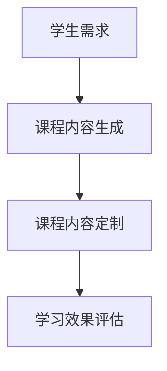
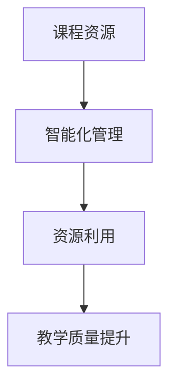
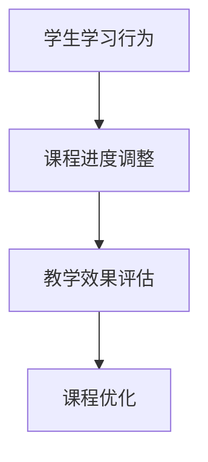
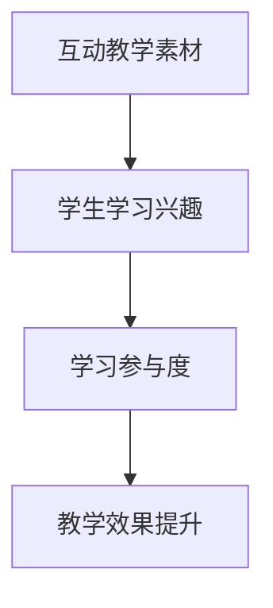
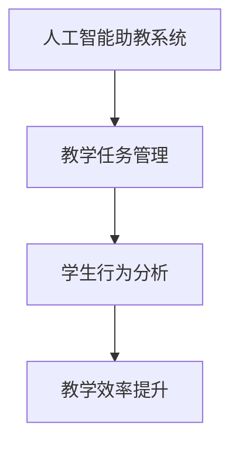
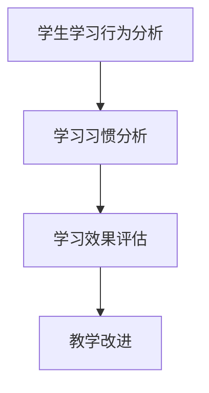
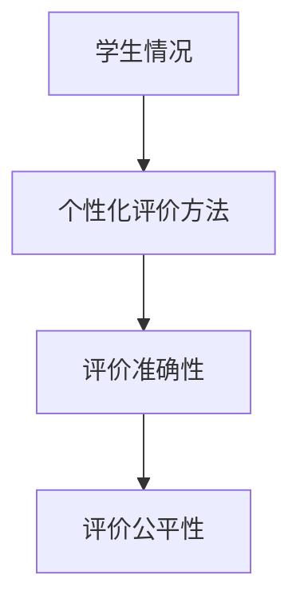
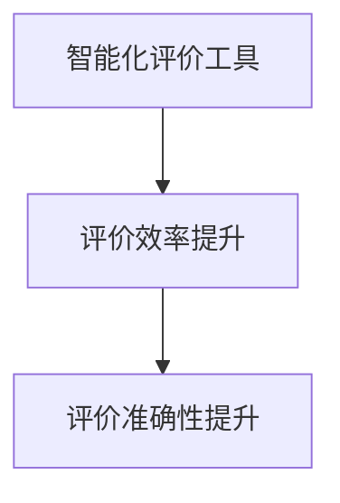
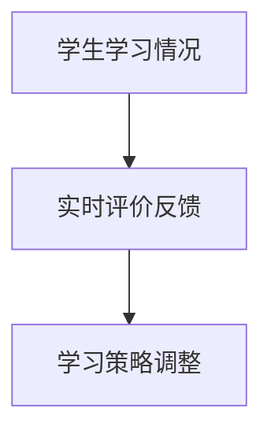

                 

# AIGC在智能人才培养方案设计中的应用

> 关键词：AIGC、智能人才培养、教学设计、个性化学习、教育评价

> 摘要：本文将探讨AIGC（AI-Generated Content）在智能人才培养方案设计中的应用。首先，我们将介绍AIGC的基本概念和起源，并分析其在教育领域中的应用场景和潜在影响。随后，我们将深入讨论智能人才培养方案设计的基础，包括设计原则、教育需求分析、教育内容设计和教育评价设计。接着，我们将探讨AIGC技术下的教学设计与实施，并分析其在课程设计、教学实施和教育评价中的应用。最后，我们将通过实际案例来展示AIGC在智能人才培养中的实践效果，并探讨其在发展过程中面临的挑战与对策。通过本文的探讨，我们希望为智能人才培养方案的设计提供有价值的参考。

## 第一部分：AIGC的概念与应用

### 第1章：AIGC的基本概念

#### 1.1 AIGC的起源与定义

AIGC，即AI-Generated Content，是一种利用人工智能技术自动生成内容的方法。它起源于自然语言处理（NLP）和生成对抗网络（GAN）等技术的发展。AIGC的核心在于利用深度学习模型，尤其是大模型，从大量的数据中学习并生成新的、高质量的内容。

#### 1.1.1 AIGC的起源

AIGC的起源可以追溯到20世纪90年代，当时研究人员开始探索如何利用计算机生成自然语言文本。随着深度学习技术的快速发展，尤其是2014年谷歌提出生成对抗网络（GAN）之后，AIGC技术逐渐成熟。

#### 1.1.2 AIGC的定义

AIGC是指利用人工智能技术，特别是深度学习模型，从大量的数据中学习并生成新的、高质量的内容。它包括文本生成、图像生成、视频生成等多种形式。

#### 1.1.3 AIGC的核心技术

AIGC的核心技术包括：

1. **自然语言处理（NLP）**：NLP是AIGC的基础，它使计算机能够理解和生成人类语言。
2. **生成对抗网络（GAN）**：GAN是AIGC的重要技术，它通过两个神经网络（生成器和判别器）的对抗训练，实现高质量的内容生成。
3. **预训练与微调**：预训练与微调是AIGC模型训练的关键，通过在大规模数据集上进行预训练，然后针对特定任务进行微调，可以提高生成质量。

#### 1.2 AIGC在智能人才培养中的应用场景

AIGC在智能人才培养中的应用场景非常广泛，包括但不限于以下几个方面：

##### 1.2.1 教育信息化

AIGC技术可以用于教育信息化，包括课程资源的智能管理、在线教育平台的内容生成等，提高教育效率和质量。

##### 1.2.2 个性化学习

AIGC技术可以基于学生的个性化需求，生成定制化的学习内容，实现个性化学习。

##### 1.2.3 互动教学

AIGC技术可以生成互动式教学素材，提高学生的学习兴趣和参与度。

#### 1.3 AIGC对智能人才培养的潜在影响

AIGC对智能人才培养具有深远的影响，包括以下几个方面：

##### 1.3.1 提升教学质量

AIGC技术可以生成高质量的教学内容，提高教学质量和学生的学习效果。

##### 1.3.2 优化教育资源分配

AIGC技术可以帮助教育机构更好地分配教育资源，提高教育公平性。

##### 1.3.3 培养创新型人才

AIGC技术可以激发学生的创新思维和创造力，培养创新型人才。

#### 1.4 本章小结

本章介绍了AIGC的基本概念、起源、定义和核心技术，并分析了AIGC在智能人才培养中的应用场景和潜在影响。下一章，我们将深入探讨智能人才培养方案设计的基础。

----------------------------------------------------------------

### 第2章：智能人才培养方案设计的基础

#### 2.1 智能人才培养方案的设计原则

智能人才培养方案的设计应遵循以下原则：

##### 2.1.1 科学性

智能人才培养方案的设计应基于科学的教育理论和实践经验，确保方案的科学性和可行性。

##### 2.1.2 实用性

智能人才培养方案的设计应注重实用性，确保方案能够实际应用于教育教学中，提高教育质量和效率。

##### 2.1.3 开放性

智能人才培养方案的设计应具有开放性，能够适应教育环境的变化和需求，持续改进和完善。

##### 2.1.4 可持续性

智能人才培养方案的设计应考虑可持续性，确保方案能够在长期内持续发挥作用，培养出高质量的人才。

#### 2.2 教育需求分析

教育需求分析是智能人才培养方案设计的重要环节，包括以下几个方面：

##### 2.2.1 学生需求分析

学生需求分析包括学生的兴趣、需求、学习能力等，通过调查、访谈等方法收集学生需求信息。

##### 2.2.2 师资需求分析

师资需求分析包括师资队伍的数量、结构、能力等，确保师资队伍能够满足人才培养的需求。

##### 2.2.3 学校资源需求分析

学校资源需求分析包括学校的教学设施、设备、资金等，确保学校资源能够支持人才培养的实施。

#### 2.3 教育内容设计

教育内容设计是智能人才培养方案设计的核心，包括以下几个方面：

##### 2.3.1 课程体系设计

课程体系设计应根据学生的需求、师资条件、学校资源等，设计科学合理的课程体系。

##### 2.3.2 教材选用

教材选用应选择符合课程体系设计、能够激发学生学习兴趣的高质量教材。

##### 2.3.3 教学方法选择

教学方法选择应结合课程体系、教材和学生需求，选择适合的教学方法，提高教学效果。

#### 2.4 教育评价设计

教育评价设计是智能人才培养方案设计的重要环节，包括以下几个方面：

##### 2.4.1 评价体系构建

评价体系构建应综合考虑学生的知识、能力、素质等多方面因素，设计科学合理的评价体系。

##### 2.4.2 评价方法选择

评价方法选择应结合评价体系，选择能够全面、客观、公正地反映学生能力和素质的评价方法。

##### 2.4.3 评价标准制定

评价标准制定应明确评价的具体指标和标准，确保评价的公平性和科学性。

#### 2.5 本章小结

本章介绍了智能人才培养方案设计的原则、教育需求分析、教育内容设计和教育评价设计。下一章，我们将探讨AIGC技术在教学设计与实施中的应用。

----------------------------------------------------------------

### 第3章：AIGC技术下的教学设计与实施

#### 3.1 AIGC在课程设计中的应用

AIGC技术在课程设计中的应用主要体现在以下几个方面：

##### 3.1.1 课程内容的个性化定制

AIGC技术可以根据学生的学习需求和兴趣，生成个性化的课程内容，提高学生的学习兴趣和参与度。

##### 3.1.2 课程资源的智能化管理

AIGC技术可以用于智能化管理课程资源，包括教材、课件、视频等，提高资源的利用效率和教学质量。

##### 3.1.3 课程进度的动态调整

AIGC技术可以根据学生的学习行为和效果，动态调整课程进度，确保教学过程的有效性和针对性。

#### 3.2 AIGC在教学实施中的应用

AIGC技术在教学实施中的应用主要体现在以下几个方面：

##### 3.2.1 互动式教学方法的应用

AIGC技术可以生成互动式教学素材，提高学生的学习兴趣和参与度，增强教学效果。

##### 3.2.2 人工智能助教系统的应用

AIGC技术可以用于人工智能助教系统，帮助教师进行教学任务的管理、学生行为的分析等，提高教学效率。

##### 3.2.3 学生学习行为的分析与应用

AIGC技术可以用于学生学习行为的分析，包括学习习惯、学习效果等，为教学提供数据支持和改进方向。

#### 3.3 AIGC在教育评价中的应用

AIGC技术在教育评价中的应用主要体现在以下几个方面：

##### 3.3.1 个性化评价方法的应用

AIGC技术可以根据学生的学习情况和课程内容，生成个性化的评价方法，提高评价的准确性和公平性。

##### 3.3.2 智能化评价工具的应用

AIGC技术可以用于智能化评价工具的开发，提高评价的效率和准确性。

##### 3.3.3 评价反馈的及时性

AIGC技术可以实时分析学生的学习情况，及时给出评价反馈，帮助学生及时调整学习方法和策略。

#### 3.4 本章小结

本章介绍了AIGC技术在课程设计、教学实施和教育评价中的应用。通过AIGC技术的应用，可以大大提高教学设计的效果，提升教学实施的质量，优化教育评价的方法。下一章，我们将通过实际案例来展示AIGC在智能人才培养中的实践效果。

----------------------------------------------------------------

### 第4章：AIGC在智能人才培养中的案例分析

#### 4.1 案例一：某大学AIGC智慧校园建设

##### 4.1.1 案例背景

某大学为了提升教育质量和培养学生的创新能力，决定开展AIGC智慧校园建设。该大学拥有先进的教育资源和雄厚的师资力量，但面临教育资源分配不均、学生个性化需求难以满足等问题。

##### 4.1.2 案例实施

1. **课程设计**：利用AIGC技术，生成个性化的课程内容，满足学生的个性化需求。

2. **教学实施**：引入人工智能助教系统，帮助教师进行教学任务管理和学生行为分析。

3. **教育评价**：利用AIGC技术，生成个性化的评价方法，提高评价的准确性和公平性。

##### 4.1.3 案例效果

通过AIGC智慧校园建设，该大学取得了显著的成效：

1. **教学质量提升**：个性化课程内容和智能化评价方法的应用，提高了教学质量和学生的学习效果。

2. **教育资源优化**：智能化管理课程资源，提高了教育资源的利用效率。

3. **学生创新能力提升**：AIGC技术的应用，激发了学生的创新思维和创造力，培养了创新型人才。

#### 4.2 案例二：某企业AIGC人才培养计划

##### 4.2.1 案例背景

某企业为了提升员工的技能水平和创新能力，决定实施AIGC人才培养计划。该企业拥有丰富的技术资源和先进的管理制度，但面临员工个性化需求难以满足、培训效果不佳等问题。

##### 4.2.2 案例实施

1. **课程设计**：利用AIGC技术，生成个性化的课程内容，满足员工的个性化需求。

2. **教学实施**：引入互动式教学方法，提高员工的参与度和学习兴趣。

3. **教育评价**：利用AIGC技术，生成个性化的评价方法，提高评价的准确性和公平性。

##### 4.2.3 案例效果

通过AIGC人才培养计划，该企业取得了显著的成效：

1. **员工技能水平提升**：个性化课程内容和互动式教学方法的应用，提高了员工的技能水平。

2. **创新能力提升**：AIGC技术的应用，激发了员工的创新思维和创造力，提升了企业的创新能力。

3. **培训效果提升**：个性化评价方法的应用，提高了培训效果，增强了员工的学习积极性。

#### 4.3 案例三：某中学AIGC课程改革实践

##### 4.3.1 案例背景

某中学为了提升教育质量和培养学生的创新能力，决定开展AIGC课程改革实践。该中学拥有良好的教育资源和师资力量，但面临教育资源分配不均、学生个性化需求难以满足等问题。

##### 4.3.2 案例实施

1. **课程设计**：利用AIGC技术，生成个性化的课程内容，满足学生的个性化需求。

2. **教学实施**：引入互动式教学方法，提高学生的学习兴趣和参与度。

3. **教育评价**：利用AIGC技术，生成个性化的评价方法，提高评价的准确性和公平性。

##### 4.3.3 案例效果

通过AIGC课程改革实践，该中学取得了显著的成效：

1. **教学质量提升**：个性化课程内容和互动式教学方法的应用，提高了教学质量和学生的学习效果。

2. **教育资源优化**：智能化管理课程资源，提高了教育资源的利用效率。

3. **学生创新能力提升**：AIGC技术的应用，激发了学生的创新思维和创造力，培养了创新型人才。

#### 4.4 本章小结

通过以上案例分析，我们可以看到AIGC技术在智能人才培养中的应用效果显著。AIGC技术为教育设计提供了新的思路和方法，为人才培养提供了有力支持。下一章，我们将探讨AIGC在智能人才培养中的挑战与对策。

----------------------------------------------------------------

### 第5章：AIGC在智能人才培养中的挑战与对策

#### 5.1 技术挑战

AIGC技术在智能人才培养中面临以下技术挑战：

##### 5.1.1 技术更新迭代速度

AIGC技术发展迅速，更新迭代速度较快。教育机构需要不断跟进技术发展趋势，及时更新教学方案和教学内容，这给教育工作者带来了很大的挑战。

##### 5.1.2 技术安全性

AIGC技术涉及大量数据生成和数据处理，存在数据泄露、滥用等安全风险。教育机构需要建立完善的安全管理体系，确保学生和教师的数据安全。

##### 5.1.3 技术应用门槛

AIGC技术要求较高的技术门槛，教育工作者需要具备一定的技术背景和技能才能有效应用。这导致许多教育工作者在应用AIGC技术时遇到困难。

#### 5.2 教育挑战

AIGC技术在智能人才培养中面临以下教育挑战：

##### 5.2.1 教育理念更新

AIGC技术的应用需要教育理念的更新，从传统的教师中心转向学生中心，注重培养学生的创新能力。这需要教育工作者转变教育观念，接受新的教育理念。

##### 5.2.2 教师技能提升

AIGC技术的应用需要教师具备一定的技术技能和教学能力。教育机构需要提供专业的培训，提升教师的技术素养和教学水平。

##### 5.2.3 学生适应性

AIGC技术的应用对学生的自主学习能力和适应能力提出了更高要求。教育机构需要引导学生适应新技术，培养学生的自主学习能力和创新能力。

#### 5.3 管理挑战

AIGC技术在智能人才培养中面临以下管理挑战：

##### 5.3.1 管理体制变革

AIGC技术的应用需要教育管理体制的变革，从传统的管理模式转向智能化管理模式。教育机构需要建立适应AIGC技术的管理机制，提高管理效率和效果。

##### 5.3.2 管理流程优化

AIGC技术的应用需要优化管理流程，提高管理效率。教育机构需要制定科学合理的流程，确保AIGC技术的有效应用。

##### 5.3.3 管理资源保障

AIGC技术的应用需要充足的资源保障，包括资金、设备、人才等。教育机构需要加大对AIGC技术的投入，确保资源的充足和有效利用。

#### 5.4 对策探讨

为了克服AIGC在智能人才培养中的挑战，我们可以采取以下对策：

##### 5.4.1 政策支持

政府应制定相关政策，支持AIGC技术在教育领域的应用，提供资金、技术、人才等支持。

##### 5.4.2 教育培训

教育机构应提供专业的教育培训，提升教师和学生的AIGC技术应用能力，确保教育质量的提升。

##### 5.4.3 社会参与

社会各方应积极参与AIGC技术在教育领域的应用，共同推动教育改革，培养更多创新型人才。

#### 5.5 本章小结

本章分析了AIGC在智能人才培养中的技术挑战、教育挑战和管理挑战，并提出了相应的对策。通过政策支持、教育培训和社会参与，可以克服AIGC在智能人才培养中的挑战，推动教育改革和人才培养的创新发展。

----------------------------------------------------------------

### 第6章：AIGC在智能人才培养中的发展趋势

#### 6.1 AIGC技术的发展趋势

AIGC技术正在快速发展，未来将呈现以下趋势：

##### 6.1.1 大模型技术

大模型技术是AIGC技术的重要发展方向。随着计算能力和数据量的不断提升，大模型在生成高质量内容方面具有巨大潜力。

##### 6.1.2 自然语言处理

自然语言处理技术是AIGC技术的重要组成部分。随着深度学习技术的发展，自然语言处理技术将更加成熟，为AIGC技术的应用提供更强支持。

##### 6.1.3 计算机视觉

计算机视觉技术是AIGC技术的重要领域。随着深度学习技术的进步，计算机视觉技术在图像和视频生成方面将取得更大突破。

#### 6.2 智能人才培养的发展趋势

智能人才培养将呈现以下发展趋势：

##### 6.2.1 个性化培养

个性化培养是未来教育的重要方向。AIGC技术将为学生提供个性化的学习内容和教学方法，满足学生的个性化需求。

##### 6.2.2 交叉学科培养

交叉学科培养将更加受到重视。AIGC技术可以帮助学生跨学科学习，培养具备多学科知识的复合型人才。

##### 6.2.3 知识图谱构建

知识图谱构建将成为智能人才培养的重要手段。通过构建知识图谱，可以更好地组织和管理知识，为学生提供更为全面的学习资源。

#### 6.3 未来展望

随着AIGC技术的不断发展，智能人才培养将迎来新的发展机遇。AIGC技术将为教育设计提供更加丰富和多样化的工具，为人才培养提供更加科学和高效的方法。通过AIGC技术的应用，我们可以预见未来教育的美好愿景：

1. **教育公平性提升**：AIGC技术将有助于缩小教育差距，提高教育公平性，让更多学生享受到优质教育资源。

2. **创新能力培养**：AIGC技术将激发学生的创新思维和创造力，培养更多具备创新能力的人才。

3. **教育个性化**：AIGC技术将实现教育个性化，满足每个学生的学习需求和兴趣，提高教育质量和效果。

#### 6.4 本章小结

本章探讨了AIGC技术的发展趋势和智能人才培养的发展趋势，并展望了未来教育的美好愿景。通过AIGC技术的应用，我们可以期待教育领域的变革和创新，培养更多适应未来社会发展的智能型人才。

----------------------------------------------------------------

## 作者信息

作者：AI天才研究院/AI Genius Institute & 禅与计算机程序设计艺术 /Zen And The Art of Computer Programming

本文由AI天才研究院撰写，结合了人工智能和计算机科学的最新研究成果，旨在为智能人才培养提供有价值的参考和指导。同时，本文受到了禅与计算机程序设计艺术理念的启发，强调在技术发展的同时，注重人的全面发展。希望本文能够为读者带来启发和思考，共同推动智能人才培养的创新发展。

