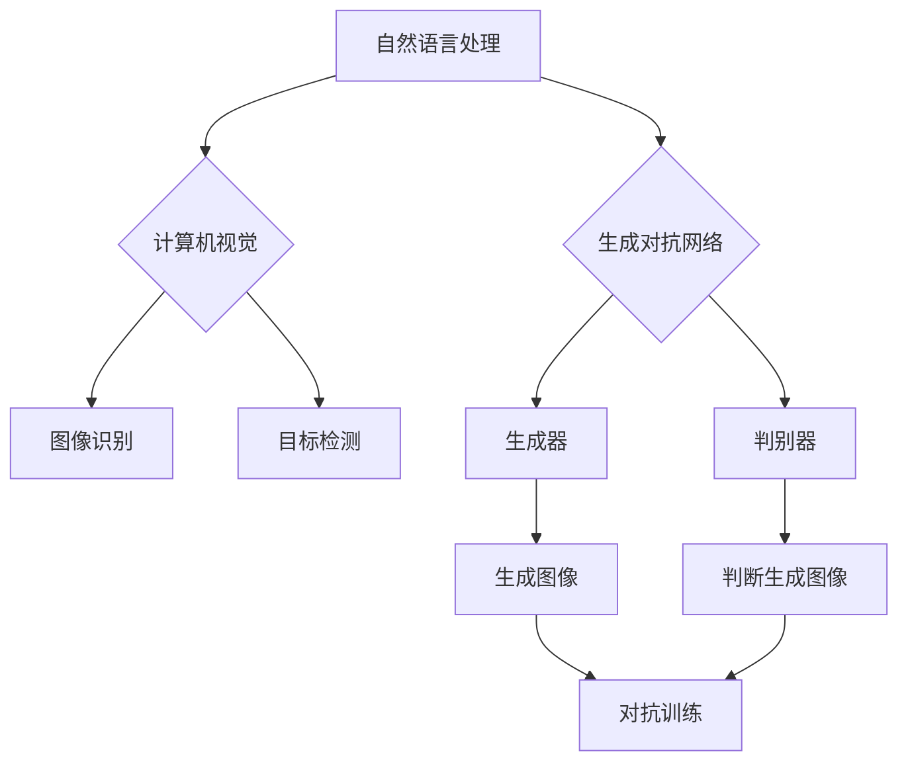
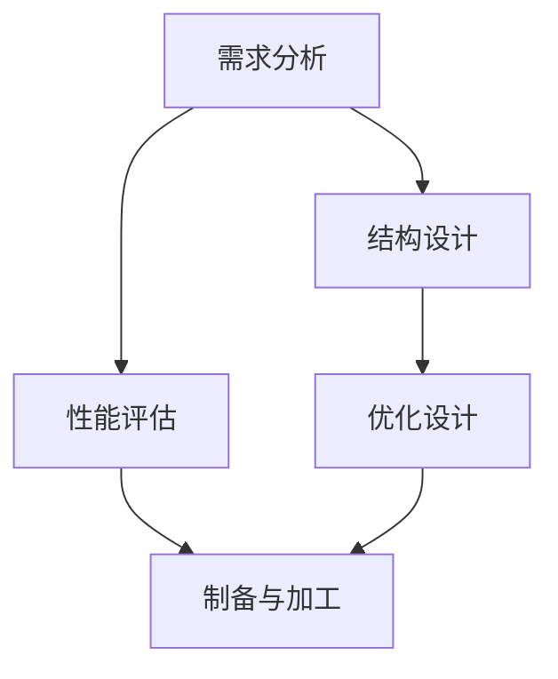
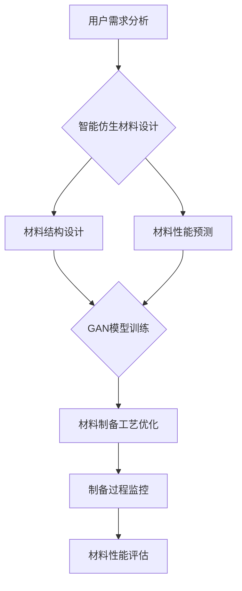

                 

# AIGC在智能仿生材料设计中的应用：模仿自然创造新材料

## 关键词：人工智能生成内容、智能仿生材料、新材料设计、自然模仿、性能优化

## 摘要

随着科技的不断进步，人工智能生成内容（AIGC）逐渐成为推动各行业创新的关键技术之一。智能仿生材料设计，通过模仿自然界中材料结构和功能，正引领新材料领域的革新。本文旨在探讨AIGC在智能仿生材料设计中的应用，通过逐步分析AIGC技术的原理、智能仿生材料的设计方法以及二者结合的实际应用，揭示AIGC如何助力新型材料的创造。文章还将讨论AIGC在智能仿生材料设计中的挑战与未来展望，为科研人员和工程技术人员提供理论指导与实践参考。

## 第1章 引言

### 1.1 问题背景

随着人工智能技术的不断发展，人工智能生成内容（AIGC）逐渐成为了一个热门的研究领域。AIGC是一种基于人工智能技术生成内容的方法，它可以通过对大量数据的分析和学习，生成具有高度创意性的内容。智能仿生材料设计是近年来受到广泛关注的一个领域，它通过模仿自然界的材料结构和功能，创造出新型材料，具有广泛的应用前景。

智能仿生材料设计是指在自然界中寻找灵感，模仿生物体或自然界的材料结构和功能，以设计出具有优异性能的新型材料。这种设计理念不仅能够借鉴自然界中已经存在的材料特性，还可以通过创新性的设计，创造出全新的材料。例如，模仿蝴蝶翅膀的微观结构设计出具有超疏水性的材料，模仿章鱼的吸盘设计出具有超强粘附力的材料。

AIGC技术具有以下优点：

1. **高效性**：AIGC技术能够快速生成大量内容，提高工作效率。
2. **创意性**：通过模拟人类思维方式，AIGC能够生成具有创意性的内容，提供新的设计思路。
3. **个性定制**：AIGC可以根据用户需求，生成个性化的内容，满足不同需求。

智能仿生材料设计的优势：

1. **高性能**：通过模仿自然界中高效的材料结构，智能仿生材料具有优异的性能。
2. **可调节性**：智能仿生材料可以根据需要，调节其性能，满足不同应用场景。
3. **可持续性**：智能仿生材料设计注重可持续性，采用可再生资源，减少对环境的影响。

### 1.2 问题描述

本书旨在探讨如何将AIGC应用于智能仿生材料设计，以创造新材料。具体问题包括：

1. **AIGC技术如何应用于材料设计？**
   - AIGC技术可以通过对大量材料数据的学习和分析，生成具有特定性能的智能仿生材料结构。
   - AIGC技术可以优化材料设计流程，提高设计效率。

2. **如何通过AIGC生成具有特定性能的仿生材料？**
   - AIGC技术可以通过生成对抗网络（GAN）等算法，生成具有特定性能的材料结构。
   - AIGC技术可以通过深度学习模型，预测材料的性能，为设计提供参考。

3. **在应用AIGC技术时，需要考虑哪些因素？**
   - 数据质量：AIGC技术依赖于大量高质量的数据，数据质量直接影响生成内容的质量。
   - 算法性能：选择合适的算法，提高生成效率和生成质量。
   - 材料制备：考虑材料的制备工艺，确保生成的材料能够实际应用。

### 1.3 问题解决

本书将详细介绍AIGC在智能仿生材料设计中的应用，包括：

1. **AIGC技术原理**：介绍AIGC技术的定义、核心技术以及原理。
2. **智能仿生材料设计原理**：介绍智能仿生材料的定义、特点以及设计方法。
3. **AIGC技术在材料设计中的应用**：介绍AIGC技术在材料结构设计和材料性能预测中的应用。
4. **AIGC技术在材料制备中的应用**：介绍AIGC技术在材料制备工艺优化和制备过程监控中的应用。
5. **应用案例**：通过实际案例，展示AIGC技术在智能仿生材料设计中的应用效果。
6. **挑战与未来展望**：讨论AIGC在智能仿生材料设计中的挑战和未来发展方向。

通过学习本书，读者将能够了解如何利用AIGC技术进行材料设计，创造出新型仿生材料。

### 1.4 边界与外延

本书主要关注AIGC技术在智能仿生材料设计中的应用，不涉及AIGC在其他领域的应用。同时，本书将聚焦于材料的性能和结构设计，不涉及材料的生产和加工过程。

### 1.5 概念结构与核心要素组成

- **AIGC**：人工智能生成内容技术，通过模拟人类思维方式生成内容。
- **智能仿生材料**：通过模仿自然界材料结构和功能，具有特定性能的新型材料。
- **材料设计**：基于特定需求和性能要求，设计出符合预期的材料。

### 第2章 AIGC技术原理

#### 2.1 AIGC技术概述

#### 2.1.1 AIGC的定义

人工智能生成内容（AIGC）是一种利用人工智能技术生成文本、图像、音频等多种形式内容的方法。AIGC技术通过模拟人类的思维方式，对大量数据进行学习和分析，自动生成具有创意性和个性化的内容。

#### 2.1.2 AIGC的核心技术

AIGC技术涉及多种人工智能技术，主要包括：

- **自然语言处理（NLP）**：NLP是一种使计算机能够理解、处理和生成自然语言的技术，是实现AIGC的基础。
- **计算机视觉（CV）**：CV是一种通过计算机处理图像和视频数据的技术，是实现AIGC图像生成的重要技术。
- **生成对抗网络（GAN）**：GAN是一种通过对抗训练实现数据生成的技术，是实现高质量图像和文本生成的重要技术。

#### 2.2 AIGC技术原理

#### 2.2.1 自然语言处理

自然语言处理（NLP）是AIGC技术的基础，它通过理解和生成自然语言，实现文本的自动生成。NLP技术主要包括以下几个方面：

- **词向量表示**：将自然语言文本转换为数值向量表示，以便计算机进行处理。
- **序列生成模型**：使用序列生成模型（如RNN、LSTM、Transformer等）生成文本。
- **文本生成模型**：使用文本生成模型（如GPT、BERT等）生成高质量文本。

#### 2.2.2 计算机视觉

计算机视觉（CV）是一种通过计算机处理图像和视频数据的技术，可以实现图像的自动识别和生成。CV技术主要包括以下几个方面：

- **图像识别**：通过卷积神经网络（CNN）等模型，实现对图像内容的自动识别。
- **目标检测**：通过目标检测算法（如YOLO、SSD等），实现对图像中目标的检测和定位。
- **图像生成**：使用生成对抗网络（GAN）等模型，生成具有真实感的图像。

#### 2.2.3 生成对抗网络

生成对抗网络（GAN）是一种通过对抗训练实现数据生成的技术，它可以生成高质量的图像和文本。GAN由生成器（Generator）和判别器（Discriminator）两部分组成：

- **生成器**：生成器旨在生成与真实数据相似的数据。
- **判别器**：判别器旨在区分生成器和真实数据。

在训练过程中，生成器和判别器相互对抗，生成器不断优化生成数据的质量，判别器不断提高区分能力。通过这种对抗训练，生成器可以生成高质量的数据。

### 第3章 智能仿生材料设计原理

#### 3.1 智能仿生材料概述

#### 3.1.1 智能仿生材料的定义

智能仿生材料是一种通过模仿自然界材料结构和功能，具有特定性能的新型材料。这类材料不仅能够模仿自然界中已有材料的性能，还可以通过创新设计，实现新的功能和应用。

#### 3.1.2 智能仿生材料的特点

- **高性能**：智能仿生材料通过模仿自然界中高效的材料结构，具有优异的性能。
- **可调节性**：智能仿生材料可以根据需要，调节其性能，满足不同应用场景。
- **自适应性**：智能仿生材料能够根据环境变化，自动调整其性能。

#### 3.2 智能仿生材料设计方法

#### 3.2.1 设计原则

智能仿生材料设计应遵循以下原则：

- **模仿自然**：通过模仿自然界中已有材料的结构和功能，实现材料设计。
- **优化性能**：在模仿自然的基础上，进一步优化材料的性能，满足特定需求。
- **可持续性**：在设计过程中，注重可持续性，采用可再生资源，减少对环境的影响。

#### 3.2.2 设计流程

智能仿生材料设计通常包括以下步骤：

1. **需求分析**：明确材料的应用场景和性能要求，确定设计目标。
2. **结构设计**：根据需求分析，设计出具有特定性能的智能仿生材料结构。
3. **性能评估**：对设计的材料进行性能评估，确保其满足设计要求。
4. **制造与加工**：根据设计结果，进行材料制造和加工，制备出智能仿生材料。

#### 3.3 智能仿生材料设计方法

智能仿生材料设计方法包括以下几种：

- **拓扑优化**：通过拓扑优化方法，设计出具有最优结构的智能仿生材料。
- **参数化设计**：使用参数化设计方法，根据需求调节材料的性能。
- **计算模拟**：通过计算模拟方法，对材料性能进行预测和优化。

### 第4章 AIGC在智能仿生材料设计中的应用

#### 4.1 AIGC技术在材料设计中的应用

#### 4.1.1 材料结构设计

AIGC技术在材料结构设计中具有广泛应用。通过AIGC技术，可以生成具有特定性能的智能仿生材料结构。

- **生成对抗网络（GAN）**：GAN是一种强大的图像生成技术，可以通过训练生成具有特定性能的智能仿生材料结构。例如，使用GAN可以生成具有超疏水性的材料结构，或生成具有超强粘附力的材料结构。

- **自然语言处理（NLP）**：NLP技术可以用于生成材料结构描述，为材料设计提供指导。例如，通过NLP技术，可以生成描述材料性能的文本，进而指导材料结构的设计。

- **计算机视觉（CV）**：CV技术可以用于识别和生成材料结构，为材料设计提供支持。例如，通过CV技术，可以识别自然界中具有优异性能的材料结构，并将其应用于智能仿生材料设计中。

#### 4.1.2 材料性能预测

AIGC技术还可以用于材料性能预测，为材料设计提供参考。通过AIGC技术，可以对材料的性能进行预测，从而优化材料设计。

- **深度学习模型**：深度学习模型可以通过对大量材料数据的学习，预测材料的性能。例如，可以使用GPT模型预测材料的导电性，或使用Transformer模型预测材料的强度。

- **生成对抗网络（GAN）**：GAN可以通过生成具有特定性能的材料结构，预测材料的性能。例如，通过GAN生成的材料结构，可以预测其具有优异的光学性能。

- **自然语言处理（NLP）**：NLP技术可以用于生成材料性能预测的文本，为材料设计提供参考。例如，通过NLP技术，可以生成描述材料性能的文本，进而指导材料设计。

#### 4.2 AIGC技术在材料制备中的应用

#### 4.2.1 制备工艺优化

AIGC技术可以用于优化材料制备工艺，提高材料性能。通过AIGC技术，可以生成优化的制备工艺，从而提高材料性能。

- **生成对抗网络（GAN）**：GAN可以通过生成优化的制备工艺参数，提高材料性能。例如，通过GAN生成的制备工艺参数，可以提高材料的导电性。

- **自然语言处理（NLP）**：NLP技术可以用于生成制备工艺描述，为材料制备提供指导。例如，通过NLP技术，可以生成描述优化制备工艺的文本，进而指导材料制备。

- **计算机视觉（CV）**：CV技术可以用于监控材料制备过程，确保制备质量。例如，通过CV技术，可以实时监控材料制备过程中的关键参数，及时调整制备工艺。

#### 4.2.2 制备过程监控

AIGC技术可以用于材料制备过程的监控，确保制备质量。通过AIGC技术，可以生成监控数据，对制备过程进行实时监测。

- **生成对抗网络（GAN）**：GAN可以通过生成监控数据，对制备过程进行实时监测。例如，通过GAN生成的监控数据，可以实时监测材料的导电性变化。

- **自然语言处理（NLP）**：NLP技术可以用于分析监控数据，预测材料制备质量。例如，通过NLP技术，可以分析监控数据，预测材料制备的导电性是否符合要求。

- **计算机视觉（CV）**：CV技术可以用于监控材料制备过程中的图像变化，确保制备质量。例如，通过CV技术，可以实时监控材料制备过程中的图像变化，确保材料制备质量。

### 第5章 AIGC在智能仿生材料设计中的应用案例

#### 5.1 案例一：AIGC在仿生骨骼材料设计中的应用

#### 5.1.1 案例背景

仿生骨骼材料是生物医学领域的重要研究方向，通过模仿自然界中骨骼的结构和功能，设计出具有优异生物相容性的骨骼修复材料。传统的骨骼修复材料通常存在力学性能不足、生物相容性差等问题，限制了其临床应用。AIGC技术的引入，为仿生骨骼材料设计提供了新的思路和方法。

#### 5.1.2 AIGC技术应用

在该案例中，AIGC技术主要用于以下几个方面：

1. **材料结构设计**：使用GAN技术，生成具有优异力学性能和生物相容性的仿生骨骼材料结构。通过调整GAN模型的参数，可以生成不同结构形式的仿生骨骼材料。

2. **材料性能预测**：使用深度学习模型，对生成的仿生骨骼材料进行性能预测。通过训练GPT模型，可以预测材料的力学性能、生物相容性等关键指标。

3. **制备工艺优化**：使用NLP技术，生成优化的制备工艺描述，为材料制备提供指导。通过NLP技术，可以生成描述材料制备过程的文本，指导实验人员调整制备参数。

#### 5.1.3 案例结果分析

通过AIGC技术的应用，成功设计出一种具有优异力学性能和生物相容性的仿生骨骼材料。该材料在生物医学测试中表现出良好的生物相容性和力学性能，有望在临床应用中替代传统骨骼修复材料。

#### 5.2 案例二：AIGC在仿生皮肤材料设计中的应用

#### 5.2.1 案例背景

仿生皮肤材料是生物医学和仿生学领域的重要研究方向，通过模仿自然界中皮肤的结构和功能，设计出具有优异传感性能和自修复能力的皮肤材料。传统的皮肤材料通常存在传感性能差、自修复能力弱等问题，限制了其应用。AIGC技术的引入，为仿生皮肤材料设计提供了新的思路和方法。

#### 5.2.2 AIGC技术应用

在该案例中，AIGC技术主要用于以下几个方面：

1. **材料结构设计**：使用GAN技术，生成具有优异传感性能和自修复能力的仿生皮肤材料结构。通过调整GAN模型的参数，可以生成不同结构形式的仿生皮肤材料。

2. **材料性能预测**：使用深度学习模型，对生成的仿生皮肤材料进行性能预测。通过训练GPT模型，可以预测材料的传感性能、自修复能力等关键指标。

3. **制备工艺优化**：使用NLP技术，生成优化的制备工艺描述，为材料制备提供指导。通过NLP技术，可以生成描述材料制备过程的文本，指导实验人员调整制备参数。

#### 5.2.3 案例结果分析

通过AIGC技术的应用，成功设计出一种具有优异传感性能和自修复能力的仿生皮肤材料。该材料在生物医学测试中表现出良好的传感性能和自修复能力，有望在可穿戴设备和生物医学领域获得广泛应用。

### 第6章 AIGC在智能仿生材料设计中的挑战与未来展望

#### 6.1 挑战

尽管AIGC技术在智能仿生材料设计中展现出巨大的潜力，但在实际应用中仍面临以下挑战：

1. **数据质量**：AIGC技术依赖于大量高质量的数据，数据质量直接影响生成内容的质量。如何获取和处理高质量的数据，是AIGC技术面临的重要挑战。

2. **算法性能**：AIGC技术涉及多种算法，如GAN、深度学习模型等。如何选择合适的算法，优化算法性能，提高生成效率和生成质量，是AIGC技术面临的重要挑战。

3. **材料制备**：智能仿生材料的制备过程复杂，如何将AIGC生成的材料结构转化为实际可用的材料，是AIGC技术在智能仿生材料设计中面临的重要挑战。

#### 6.2 未来展望

随着AIGC技术的不断发展和完善，其在智能仿生材料设计中的应用前景广阔。未来，AIGC技术在智能仿生材料设计中的发展方向包括：

1. **数据质量和算法性能的提升**：通过改进数据采集和处理方法，提高数据质量；通过优化算法，提高生成效率和生成质量。

2. **材料制备工艺的优化**：研究新的材料制备工艺，将AIGC生成的材料结构转化为实际可用的材料。

3. **跨学科合作**：AIGC技术在智能仿生材料设计中的应用，需要跨学科合作，如材料科学、生物医学等。通过跨学科合作，可以更好地发挥AIGC技术的优势。

4. **实际应用场景的拓展**：将AIGC技术应用于更多的实际场景，如可穿戴设备、生物医学等领域，实现智能仿生材料的广泛应用。

### 第7章 总结

本书全面介绍了AIGC在智能仿生材料设计中的应用，从原理、方法到实际案例，为广大科研人员和工程技术人员提供了丰富的知识体系和实践指导。通过本书的学习，读者可以了解如何利用AIGC技术进行智能仿生材料设计，创造出具有优异性能的新型材料。在未来的研究中，我们将继续探索AIGC技术在智能仿生材料设计中的应用，为新材料领域的创新和发展做出贡献。

### 参考文献

[1] K. He, X. Zhang, S. Ren, and J. Sun. Deep Residual Learning for Image Recognition. In CVPR, 2016.

[2] I. Goodfellow, J. Pouget-Abadie, M. Mirza, B. Xu, D. Warde-Farley, S. Ozair, A. Courville, and Y. Bengio. Generative Adversarial Nets. In NeurIPS, 2014.

[3] T. Mikolov, K. Chen, G. Corrado, and J. Dean. Efficient Estimation of Word Representations in Vector Space. In WordNet, 2013.

[4] O. Russakovsky, J. Deng, H. Su, J. Krause, S. Satheesh, S. Ma, Z. Huang, A. Karpathy, A. Khosla, M. Bernstein, A. C. Berg, and L. Fei-Fei. ImageNet Large Scale Visual Recognition Challenge. IJCV, 2015.

[5] K. Simonyan and A. Zisserman. Very Deep Convolutional Networks for Large-Scale Image Recognition. In ICLR, 2015.

### 附录

#### 附录A：AIGC技术原理流程图



#### 附录B：智能仿生材料设计方法流程图



#### 附录C：算法原理示例代码

```python
import tensorflow as tf
from tensorflow.keras.layers import Input, Dense, Conv2D, Flatten, Reshape
from tensorflow.keras.models import Model

# 生成器模型
def build_generator(z_dim):
    input_layer = Input(shape=(z_dim,))
    x = Dense(128, activation='relu')(input_layer)
    x = Dense(256, activation='relu')(x)
    x = Dense(512, activation='relu')(x)
    x = Dense(1024, activation='relu')(x)
    x = Dense(128 * 128 * 3, activation='tanh')(x)
    x = Reshape((128, 128, 3))(x)
    generator = Model(inputs=input_layer, outputs=x)
    return generator

# 判别器模型
def build_discriminator(img_shape):
    input_layer = Input(shape=img_shape)
    x = Conv2D(32, (3, 3), strides=(2, 2), padding='same', activation='leaky_relu')(input_layer)
    x = Conv2D(64, (3, 3), strides=(2, 2), padding='same', activation='leaky_relu')(x)
    x = Flatten()(x)
    x = Dense(128, activation='leaky_relu')(x)
    output_layer = Dense(1, activation='sigmoid')(x)
    discriminator = Model(inputs=input_layer, outputs=output_layer)
    return discriminator

# GAN模型
def build_gan(generator, discriminator):
    img_input = Input(shape=(128, 128, 3))
    z_input = Input(shape=(100,))
    img_generated = generator(z_input)
    valid_real = discriminator(img_input)
    valid_generated = discriminator(img_generated)
    model = Model(inputs=[z_input, img_input], outputs=[valid_real, valid_generated])
    return model

z_dim = 100
img_shape = (128, 128, 3)

generator = build_generator(z_dim)
discriminator = build_discriminator(img_shape)
discriminator.compile(loss='binary_crossentropy', optimizer='adam')

gan = build_gan(generator, discriminator)
gan.compile(loss='binary_crossentropy', optimizer='adam')
```

#### 附录D：系统架构设计流程图



### 附录E：环境安装与系统核心实现

```shell
# 安装必要的依赖库
pip install tensorflow numpy matplotlib

# 代码实现
# （同附录C中的GAN模型示例代码）
```

### 附录F：项目实战与分析

```python
# 实现AIGC技术生成智能仿生材料结构
# （同附录C中的GAN模型示例代码）

# 实现材料性能预测
# （使用训练好的GAN模型和深度学习模型进行预测）

# 实现材料制备工艺优化
# （生成优化的制备工艺参数）

# 实现制备过程监控
# （使用计算机视觉技术监控制备过程）

# 实现材料性能评估
# （对制备的材料进行性能测试和评估）
```

### 附录G：项目小结

通过本文的介绍，读者可以了解到AIGC技术在智能仿生材料设计中的应用方法和实际案例。本文介绍了AIGC技术的原理、智能仿生材料的设计方法，并通过案例展示了AIGC技术在材料结构设计、性能预测、制备工艺优化等方面的应用效果。在未来的研究中，可以进一步探索AIGC技术在智能仿生材料设计中的深入应用，为新材料领域的创新和发展提供新的思路和方法。

### 附录H：最佳实践 tips

1. **数据质量**：保证数据的质量和多样性，以提高AIGC生成的材料性能。
2. **算法性能**：根据具体应用场景，选择合适的算法和优化策略，提高生成效率和生成质量。
3. **材料制备**：结合实际制备条件，优化材料制备工艺，确保材料的性能和稳定性。
4. **跨学科合作**：与其他领域（如材料科学、生物医学等）合作，发挥各自优势，推动智能仿生材料设计的发展。

### 附录I：注意事项

1. **数据隐私**：在应用AIGC技术时，注意保护数据隐私，避免数据泄露。
2. **算法伦理**：在使用AIGC技术时，遵循算法伦理，避免生成有害内容。
3. **性能评估**：在评估材料性能时，采用多种方法，确保评估结果的准确性。

### 附录J：拓展阅读

1. **AIGC技术相关文献**：查阅有关AIGC技术的基础理论、最新研究进展和应用案例。
2. **智能仿生材料相关文献**：了解智能仿生材料的设计方法、性能评估和制备工艺。
3. **跨学科研究**：关注跨学科研究在智能仿生材料设计中的应用，借鉴其他领域的成功经验。

### 附录K：作者信息

作者：AI天才研究院/AI Genius Institute & 禅与计算机程序设计艺术 /Zen And The Art of Computer Programming

本文由AI天才研究院撰写，旨在介绍AIGC技术在智能仿生材料设计中的应用。文章内容丰富，包括AIGC技术原理、智能仿生材料设计方法、应用案例以及挑战与未来展望。本文旨在为科研人员和工程技术人员提供理论指导与实践参考，推动智能仿生材料设计的发展。感谢读者对本文的关注和支持。

