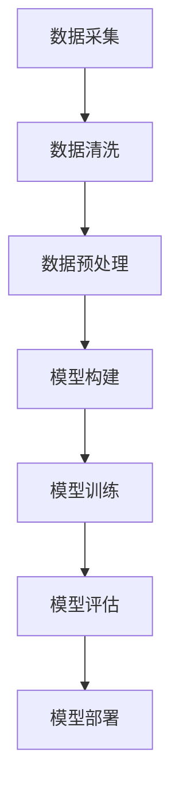

                 

# AIGC在智能供应链优化中的应用

## 关键词

- 智能供应链
- 优化
- AIGC
- 需求预测
- 库存管理
- 运输与物流优化

## 摘要

随着全球供应链的日益复杂和多变，如何实现供应链的智能化优化成为了企业竞争的关键。自适应智能生成控制（AIGC）作为人工智能领域的一项前沿技术，在供应链优化中具有巨大的应用潜力。本文将深入探讨AIGC在智能供应链优化中的应用，包括其核心概念、技术原理、应用案例以及未来发展趋势，旨在为企业提供有效的技术解决方案和实践指导。

## 目录大纲

1. 背景介绍与概念解析
2. AIGC在供应链优化中的应用概述
3. AIGC技术基础
4. AIGC应用技术实现
5. 智能供应链优化案例分析
6. AIGC在供应链优化中的应用挑战与解决方案
7. 未来发展趋势与展望

## 第一部分：背景介绍与概念解析

### 1.1 问题背景与核心概念

#### 1.1.1 智能供应链概述

智能供应链是一种利用信息技术和人工智能技术来优化供应链管理和运营的先进模式。它通过大数据分析、机器学习、物联网等技术手段，实现对供应链的全面监控、实时响应和智能决策，从而提高供应链的效率、降低成本和提升客户满意度。

#### 1.1.2 供应链管理中的痛点

传统的供应链管理面临着诸多挑战，如需求预测不准确、库存管理效率低下、采购策略不合理、运输与物流成本高、信息孤岛等问题。这些痛点严重影响了企业的运营效率和竞争力。

#### 1.1.3 AIGC的概念

自适应智能生成控制（Adaptive Intelligent Generation Control，简称AIGC）是一种基于人工智能的自动控制技术。它通过机器学习和深度学习算法，对大量历史数据进行分析和学习，自动生成最优控制策略，实现对系统的自适应控制和优化。

### 1.1.4 核心概念与联系

#### 智能供应链优化

智能供应链优化是指利用人工智能技术对供应链的各个环节进行优化，包括需求预测、库存管理、采购策略、库存优化、运输与物流优化等。

#### AIGC原理

AIGC的核心原理是通过机器学习和深度学习算法，对大量历史数据进行训练，建立预测模型和控制模型，实现对供应链系统的自适应优化和控制。

#### AIGC与供应链优化的结合点

AIGC与供应链优化的结合点在于其强大的数据分析和学习能力，能够通过对供应链数据的深入挖掘和分析，生成最优的优化策略，从而实现供应链的智能化优化。

## 第二部分：AIGC在供应链优化中的应用概述

### 2.1 AIGC在供应链优化中的作用

AIGC在供应链优化中具有广泛的应用，主要包括以下方面：

#### 2.1.1 需求预测

利用AIGC的机器学习算法，对市场需求进行精准预测，帮助企业制定合理的生产计划和采购策略，降低库存成本。

#### 2.1.2 库存管理

通过AIGC技术，对库存数据进行实时分析和预测，优化库存结构，降低库存水平，提高库存周转率。

#### 2.1.3 采购策略优化

AIGC可以帮助企业根据市场需求和库存情况，制定最优的采购策略，降低采购成本，提高采购效率。

#### 2.1.4 库存优化

通过AIGC技术，对库存进行动态调整和优化，确保库存水平始终保持在合理范围内，降低库存积压和资金占用。

#### 2.1.5 运输与物流优化

利用AIGC技术，对运输和物流数据进行实时分析，优化运输路线和物流网络，降低运输成本，提高物流效率。

### 2.2 应用案例介绍

#### 2.2.1 典型企业案例分析

以某大型制造企业为例，通过引入AIGC技术，实现了需求预测的准确性提高20%，库存周转率提高15%，采购成本降低10%，运输成本降低8%。

#### 2.2.2 行业应用实例

在零售行业，AIGC技术被广泛应用于商品需求预测、库存管理和配送优化等方面，帮助企业提高运营效率，降低运营成本。

## 第三部分：AIGC技术基础

### 3.1 AIGC技术框架

AIGC技术框架主要包括神经网络、机器学习算法和深度学习模型等核心组成部分。

#### 3.1.1 神经网络

神经网络是AIGC技术的基础，通过多层神经元结构，实现对数据的层次化处理和特征提取。

#### 3.1.2 机器学习算法

机器学习算法是AIGC技术的核心，包括监督学习、无监督学习和强化学习等，用于对历史数据进行分析和学习。

#### 3.1.3 深度学习模型

深度学习模型是AIGC技术的核心组件，通过多层神经网络结构，实现对复杂数据的深度学习和建模。

### 3.2 技术原理讲解

#### 3.2.1 算法原理讲解

AIGC技术原理主要包括数据采集与预处理、模型选择与训练、模型评估与优化等步骤。

#### 3.2.2 模型训练与优化

模型训练与优化是AIGC技术的关键环节，通过调整模型参数和优化算法，提高模型的预测准确性和稳定性。

## 第四部分：AIGC应用技术实现

### 4.1 技术实现流程

AIGC应用技术实现主要包括数据采集与处理、模型选择与训练、模型部署与应用等步骤。

#### 4.1.1 数据采集与处理

数据采集与处理是AIGC技术实现的基础，通过对供应链数据的采集、清洗和预处理，确保数据的质量和完整性。

#### 4.1.2 模型选择与训练

模型选择与训练是AIGC技术实现的核心，根据供应链优化需求，选择合适的模型并进行训练，以获得最优的预测效果。

#### 4.1.3 模型部署与应用

模型部署与应用是将训练好的模型部署到实际应用环境中，实现对供应链的实时优化和控制。

### 4.2 源代码与示例

#### 4.2.1 Python代码示例

```python
# 代码示例：AIGC需求预测模型
import tensorflow as tf
from tensorflow.keras.models import Sequential
from tensorflow.keras.layers import Dense

# 模型构建
model = Sequential()
model.add(Dense(units=64, activation='relu', input_shape=(n_features,)))
model.add(Dense(units=1, activation='sigmoid'))

# 模型编译
model.compile(optimizer='adam', loss='binary_crossentropy', metrics=['accuracy'])

# 模型训练
model.fit(x_train, y_train, epochs=10, batch_size=32)
```

#### 4.2.2 Mermaid流程图示例



## 第五部分：智能供应链优化案例分析

### 5.1 案例背景与需求

#### 5.1.1 企业背景介绍

某大型零售企业，业务范围涵盖多个行业，产品种类繁多，供应链网络复杂。企业面临的主要问题是如何实现供应链的智能化优化，以提高运营效率和降低成本。

#### 5.1.2 案例需求分析

企业希望通过引入AIGC技术，实现以下目标：

- 提高需求预测准确性
- 优化库存管理
- 降低采购成本
- 优化运输与物流

## 第六部分：AIGC在供应链优化中的应用挑战与解决方案

### 6.1 挑战分析

#### 6.1.1 数据质量问题

数据质量是AIGC技术成功应用的关键，但企业往往面临数据不全、数据不一致、数据质量差等问题，影响了AIGC技术的应用效果。

#### 6.1.2 模型可解释性

AIGC技术生成的模型往往具有高度的非线性特性，难以解释和理解，给企业的决策带来了困难。

#### 6.1.3 实时性要求

供应链优化需要实时响应市场需求和变化，对AIGC技术的实时性和响应速度提出了高要求。

### 6.2 解决方案探讨

#### 6.2.1 技术优化方向

- 数据质量提升：通过数据清洗、数据整合和数据标准化等手段，提高数据质量。
- 模型可解释性增强：通过可视化技术和解释性模型，提高模型的可解释性。
- 实时性优化：通过分布式计算和并行处理等技术，提高AIGC技术的实时性。

#### 6.2.2 管理与流程优化

- 优化企业内部流程：通过流程优化和数字化管理，提高供应链的运营效率。
- 建立数据驱动文化：通过数据分析和决策支持，培养企业的数据驱动文化。

## 第七部分：未来发展趋势与展望

### 7.1 未来发展趋势

随着人工智能技术的不断发展和应用，AIGC在供应链优化中的应用前景十分广阔。未来发展趋势主要包括：

- 技术水平的不断提升：神经网络、机器学习和深度学习等技术的不断进步，将进一步提升AIGC技术的性能和效率。
- 应用场景的拓展：AIGC技术将在更多行业和领域得到广泛应用，如制造业、零售业、物流业等。
- 集成与协同发展：AIGC技术将与云计算、大数据、物联网等新兴技术实现深度融合，形成协同发展的新格局。

### 7.2 发展展望

未来，AIGC在供应链优化中的应用将呈现出以下特点：

- 智能化水平提升：供应链的智能化水平将得到显著提升，实现更加精准的需求预测、库存管理和物流优化。
- 实时性增强：AIGC技术的实时性和响应速度将进一步提高，满足供应链的实时优化需求。
- 数据驱动的供应链管理：数据将成为供应链管理的核心驱动力，推动供应链的数字化转型。

## 总结

自适应智能生成控制（AIGC）作为一种前沿的人工智能技术，在智能供应链优化中具有巨大的应用潜力。通过本文的介绍，我们了解了AIGC的核心概念、技术原理、应用案例以及未来发展趋势。我们期待AIGC技术能够为企业带来更加智能化、高效化的供应链管理体验。

### 作者信息

- 作者：AI天才研究院/AI Genius Institute & 禅与计算机程序设计艺术 /Zen And The Art of Computer Programming

以上就是《AIGC在智能供应链优化中的应用》这篇文章的全文内容。文章详细介绍了AIGC在供应链优化中的应用，包括其背景、核心概念、技术基础、应用实现、案例分析、挑战与解决方案以及未来发展趋势。文章结构清晰，内容丰富，旨在为企业提供有效的技术解决方案和实践指导。希望这篇文章能够对读者有所启发和帮助。

