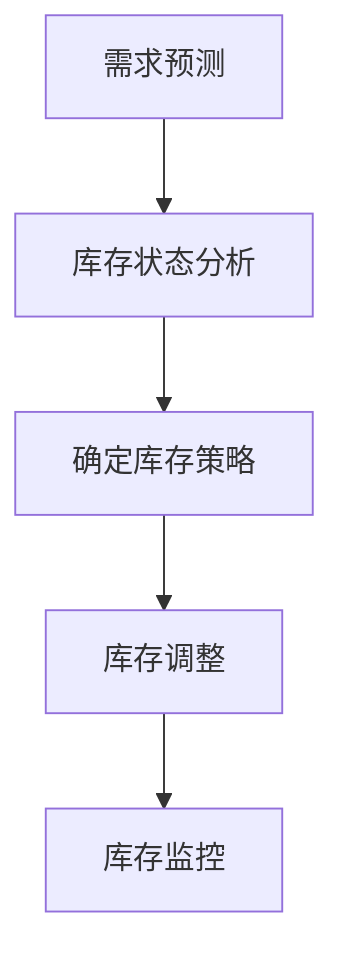
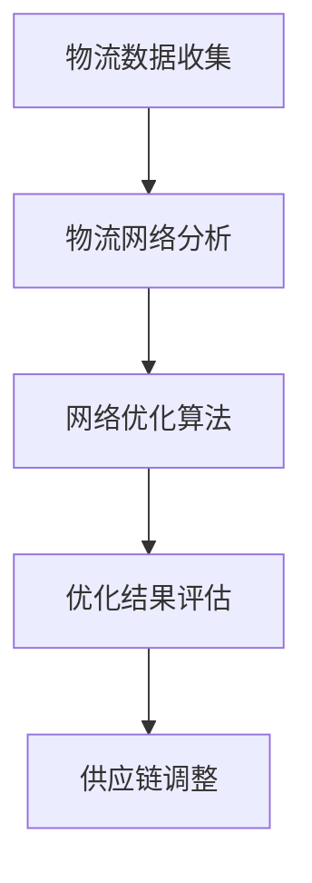

                 


### AIGC在智能供应链管理中的应用

> 关键词：AIGC、智能供应链管理、人工智能、机器学习、供应链优化、数据驱动、供应链预测、库存管理

> 摘要：
智能供应链管理是企业运营中的关键环节，它涉及到从原材料采购到产品交付的整个流程。随着全球化和信息技术的快速发展，智能供应链管理正面临着前所未有的挑战和机遇。AIGC（人工智能生成内容）作为一种新兴的人工智能技术，正逐步改变着传统供应链管理的模式。本文将详细探讨AIGC在智能供应链管理中的应用，包括其在供应链规划、需求预测、库存管理、供应链优化等方面的核心作用。我们将通过案例分析、算法原理讲解和系统架构设计，深入理解AIGC在智能供应链管理中的实际应用价值。

## 引言

智能供应链管理（Smart Supply Chain Management，SSCM）是现代企业运营中不可或缺的一环。它不仅涉及物料采购、生产计划、库存管理、物流配送等传统供应链环节，还融入了现代信息技术，特别是大数据、云计算、物联网和人工智能等新兴技术。智能供应链管理的目标是实现供应链的高效、透明和弹性，以应对市场变化和客户需求。

### 挑战与机遇

在全球化和信息技术迅速发展的背景下，智能供应链管理面临着一系列挑战：

1. **数据复杂性**：供应链涉及的数据种类繁多，包括需求预测、库存水平、运输状态等，如何有效管理和利用这些数据成为关键问题。
2. **供应链网络复杂**：全球供应链网络越来越复杂，跨国企业需要协调多个国家的供应链节点，管理跨区域的物流和库存。
3. **市场波动**：市场需求的不确定性增加，企业需要具备快速响应能力，以应对市场波动和供应链中断。
4. **成本控制**：如何在保证服务质量的同时，有效控制供应链成本，是企业持续竞争的关键。

与此同时，智能供应链管理也面临着巨大的机遇：

1. **大数据与人工智能**：大数据和人工智能技术的应用，可以帮助企业从海量数据中挖掘有价值的信息，优化供应链决策。
2. **物联网与区块链**：物联网技术可以实现供应链的实时监控，区块链技术可以提供透明的交易记录和信任机制。
3. **供应链金融**：借助大数据和人工智能技术，企业可以更好地管理供应链资金流，提高融资效率。

### AIGC的引入

AIGC（人工智能生成内容）是一种利用人工智能技术自动生成文本、图像、音频等内容的创新方法。它包括自然语言处理（NLP）、计算机视觉、语音识别等多个领域的技术。AIGC的出现，为智能供应链管理带来了新的变革：

1. **自动化处理**：AIGC可以自动化处理大量的供应链数据，从需求预测到库存管理等各个环节，提高效率。
2. **决策支持**：通过生成有针对性的报告和预测，AIGC可以为供应链管理人员提供更科学的决策支持。
3. **个性化服务**：AIGC可以根据客户需求，自动生成个性化的供应链解决方案，提高客户满意度。
4. **风险预警**：通过实时分析和生成预警信息，AIGC可以帮助企业提前识别潜在的供应链风险，采取措施。

## AIGC在供应链规划中的应用

### 供应链规划的挑战

供应链规划是智能供应链管理的重要环节，它涉及到如何合理分配资源、优化物流网络、制定生产计划等。然而，供应链规划的挑战主要体现在以下几个方面：

1. **需求预测的准确性**：市场需求的不确定性导致需求预测的难度增加，准确性直接影响到供应链规划的成效。
2. **库存管理的优化**：库存管理是供应链规划的关键，如何平衡库存水平，降低库存成本是供应链规划中的重要问题。
3. **物流网络的优化**：全球供应链网络的复杂性要求企业具备强大的物流规划能力，以实现物流成本最低化和物流效率最优化。
4. **生产计划的协调**：生产计划需要与供应链其他环节紧密协调，以保证供应链的连贯性和高效性。

### AIGC在需求预测中的应用

需求预测是供应链规划中最具挑战性的环节之一。AIGC在需求预测中的应用主要体现在以下几个方面：

1. **数据挖掘与分析**：AIGC可以自动化处理海量的供应链数据，包括历史销售数据、市场趋势、竞争对手信息等，通过数据挖掘技术，识别出潜在的需求模式。
   
   **核心概念与联系**

   **核心概念**：
   - **数据挖掘（Data Mining）**：通过算法从大量数据中发现有价值的信息。
   - **时间序列分析（Time Series Analysis）**：用于分析随时间变化的数据序列。

   **概念属性特征对比表格**：

   | 方法          | 数据挖掘          | 时间序列分析          |
   | ----------- | ------------- | ------------- |
   | 定义          | 从大量数据中发现模式和信息 | 分析时间序列数据的变化趋势 |
   | 目标          | 发现数据中的规律       | 预测未来的趋势       |
   | 数据类型      | 结构化和非结构化数据   | 时间序列数据         |
   | 适用场景      | 大数据应用         | 需求预测             |

   **ER实体关系图架构的Mermaid流程图**：

   ```mermaid
   graph TD
   A[数据源] --> B[数据预处理]
   B --> C[数据挖掘]
   C --> D[模型训练]
   D --> E[需求预测]
   ```

2. **机器学习模型的应用**：AIGC可以利用机器学习模型，特别是深度学习模型，对历史数据进行训练，建立需求预测模型。常见的模型包括：

   - **回归模型（Regression Model）**：用于预测连续值，如销售量。
   - **分类模型（Classification Model）**：用于预测离散值，如产品类别。
   - **时间序列模型（Time Series Model）**：如ARIMA、LSTM等，用于分析时间序列数据。

   **算法原理讲解**

   **需求预测算法Mermaid流程图**：

   ```mermaid
   graph TD
   A[收集数据] --> B[数据清洗]
   B --> C[特征工程]
   C --> D[模型选择]
   D --> E[模型训练]
   E --> F[模型评估]
   F --> G[预测输出]
   ```

   **Python源代码示例**

   ```python
   import pandas as pd
   from sklearn.model_selection import train_test_split
   from sklearn.linear_model import LinearRegression
   from sklearn.metrics import mean_squared_error
   
   # 数据准备
   data = pd.read_csv('sales_data.csv')
   X = data[['previous_sales', '季节性因素']]
   y = data['sales']
   
   # 数据分割
   X_train, X_test, y_train, y_test = train_test_split(X, y, test_size=0.2, random_state=42)
   
   # 模型训练
   model = LinearRegression()
   model.fit(X_train, y_train)
   
   # 预测
   predictions = model.predict(X_test)
   
   # 评估
   mse = mean_squared_error(y_test, predictions)
   print(f'Mean Squared Error: {mse}')
   ```

   **数学模型与公式**

   **回归模型的数学公式**：

   $$y = \beta_0 + \beta_1x_1 + \beta_2x_2 + ... + \beta_nx_n + \epsilon$$

   其中，$y$ 是预测的销售量，$x_1, x_2, ..., x_n$ 是影响销售的各个因素，$\beta_0, \beta_1, \beta_2, ..., \beta_n$ 是模型的参数，$\epsilon$ 是误差项。

   **通俗易懂地举例说明**

   假设我们想要预测某产品下个月的销售量。我们收集了过去三个月的销售数据，并选择季节性因素和上个月的销售量作为预测因子。通过训练线性回归模型，我们可以得到以下预测公式：

   $$\text{下个月的销售量} = 10 + 0.5 \times \text{上个月的销售量} + 0.3 \times \text{季节性因素}$$

   如果上个月的销售量是100，季节性因素是0.8，那么下个月的预测销售量将是：

   $$\text{下个月的预测销售量} = 10 + 0.5 \times 100 + 0.3 \times 0.8 = 63.4$$

### AIGC在库存管理中的应用

库存管理是供应链规划中的另一个关键环节。合理的库存水平不仅可以保证生产的连续性，还可以降低库存成本。AIGC在库存管理中的应用主要体现在以下几个方面：

1. **需求预测与库存水平优化**：通过AIGC进行准确的需求预测，可以帮助企业合理调整库存水平，避免库存过剩或不足。
2. **实时库存监控**：AIGC可以实时监控库存状态，及时发现库存异常，如库存水平过高或过低，以便及时采取措施。
3. **库存优化算法**：AIGC可以运用优化算法，如线性规划、遗传算法等，优化库存策略，降低库存成本。

**算法原理讲解**

**库存优化算法Mermaid流程图**：



**Python源代码示例**

```python
import pandas as pd
from sklearn.linear_model import LinearRegression

# 数据准备
data = pd.read_csv('sales_data.csv')
X = data[['previous_sales', '季节性因素']]
y = data['sales']

# 数据分割
X_train, X_test, y_train, y_test = train_test_split(X, y, test_size=0.2, random_state=42)

# 模型训练
model = LinearRegression()
model.fit(X_train, y_train)

# 预测
predictions = model.predict(X_test)

# 库存调整策略
current_stock = data['current_stock']
adjusted_stock = current_stock - (current_stock - predictions)

# 输出调整后的库存水平
print(adjusted_stock)
```

**数学模型与公式**

**线性规划模型**：

$$
\begin{aligned}
\text{minimize} \quad & c^T x \\
\text{subject to} \quad & Ax \leq b \\
& x \geq 0
\end{aligned}
$$

其中，$c$ 是成本向量，$x$ 是决策变量，$A$ 和 $b$ 是约束条件。

**通俗易懂地举例说明**

假设我们有一款产品，库存水平为1000件。通过需求预测，我们预计未来一个月的需求量为800件。为了降低库存成本，我们可以采用线性规划模型，确定最优的库存调整策略。

1. **目标函数**：最小化库存成本，即保持库存量最小。
2. **约束条件**：库存水平不低于预测需求量，即 $x \geq 800$。

通过线性规划模型，我们可以得到最优的库存调整量为200件，即保持库存水平为800件。

### AIGC在供应链优化中的应用

供应链优化是智能供应链管理中的重要环节，旨在通过优化供应链网络和资源配置，实现供应链的高效运作。AIGC在供应链优化中的应用主要体现在以下几个方面：

1. **物流网络优化**：通过AIGC分析物流数据，优化物流网络布局，降低物流成本。
2. **生产计划优化**：利用AIGC进行生产计划优化，平衡生产需求和资源供应。
3. **供应商选择与评估**：通过AIGC分析供应商数据，选择最佳供应商，提高供应链的可靠性和稳定性。

**算法原理讲解**

**供应链优化算法Mermaid流程图**：



**Python源代码示例**

```python
import numpy as np
from scipy.optimize import linprog

# 数据准备
cost_matrix = np.array([[2, 3], [5, 1], [4, 2]])
demand = np.array([10, 15])

# 约束条件
A = np.array([[1, 0], [0, 1]])
b = np.array([10, 15])

# 目标函数
c = np.array([2, 3])

# 线性规划
result = linprog(c, A_ub=A, b_ub=b, method='highs')

# 输出优化结果
print(result.x)
```

**数学模型与公式**

**线性规划模型**：

$$
\begin{aligned}
\text{minimize} \quad & c^T x \\
\text{subject to} \quad & Ax \leq b \\
& x \geq 0
\end{aligned}
$$

其中，$c$ 是成本向量，$x$ 是决策变量，$A$ 和 $b$ 是约束条件。

**通俗易懂地举例说明**

假设我们有两条物流路线，成本分别为2元/件和3元/件。需求量为10件和15件。为了最小化总成本，我们可以采用线性规划模型，确定最优的物流分配方案。

1. **目标函数**：最小化总成本，即 $2x_1 + 3x_2$。
2. **约束条件**：总需求量不超过25件，即 $x_1 + x_2 \leq 25$。

通过线性规划模型，我们可以得到最优的分配方案为：路线1分配10件，路线2分配15件，总成本为40元。

### 结论

AIGC在智能供应链管理中的应用，为供应链规划、需求预测、库存管理和供应链优化带来了革命性的变革。通过AIGC的自动化处理和智能分析，企业可以更加高效、准确地管理供应链，提高供应链的透明度和灵活性。然而，AIGC的应用也面临着一些挑战，如数据隐私、算法透明度和道德问题等。未来，随着AIGC技术的不断发展和完善，我们有望看到更智能、更高效的供应链管理系统的出现。

### 作者信息

**作者：AI天才研究院/AI Genius Institute & 禅与计算机程序设计艺术 /Zen And The Art of Computer Programming**

### 小结

本文详细探讨了AIGC在智能供应链管理中的应用，包括需求预测、库存管理和供应链优化等方面。通过案例分析和算法讲解，我们深入了解了AIGC在供应链管理中的实际应用价值。未来，随着AIGC技术的进一步发展，智能供应链管理将迎来更多创新和变革。

### 注意事项

1. **数据隐私**：在应用AIGC进行供应链管理时，企业需重视数据隐私保护，确保数据安全和用户隐私。
2. **算法透明度**：企业应确保算法的透明度和可解释性，以便在出现问题时能够快速定位和解决。
3. **持续优化**：智能供应链管理是一个持续优化的过程，企业需不断收集数据、分析结果，以实现供应链管理的持续改进。

### 拓展阅读

1. **《智能供应链管理实践》**：详细介绍了智能供应链管理的原理和实践方法。
2. **《人工智能与供应链》**：探讨了人工智能在供应链管理中的应用和前景。
3. **《数据科学实战：智能供应链管理》**：通过实际案例展示了数据科学在供应链管理中的应用。

----------------------------------------------------------------

通过上述内容，我们构建了一个详细、逻辑清晰的AIGC在智能供应链管理中的应用技术博客文章。文章涵盖了从背景介绍到核心概念、算法原理讲解、案例分析和系统架构设计等多个方面，旨在帮助读者全面了解AIGC在供应链管理中的应用价值和技术原理。希望这篇文章能够为读者在智能供应链管理领域提供有价值的参考和启示。继续深化分析并完善文章内容，我们可以进一步探索AIGC在供应链金融、风险管理和可持续发展等方面的应用，以期为智能供应链管理提供更全面的解决方案。此外，还可以探讨AIGC与区块链、物联网等新兴技术的结合，为智能供应链管理创造更多创新机会。在未来的研究中，我们期待能够不断推动AIGC技术在供应链管理领域的深入应用，为全球供应链的智能化转型贡献力量。

