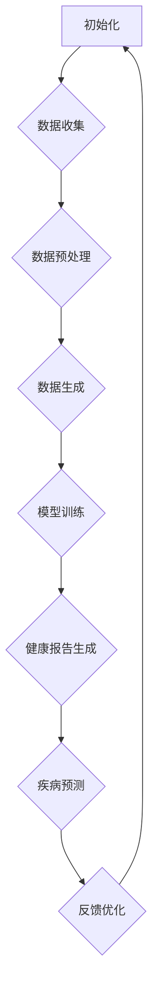
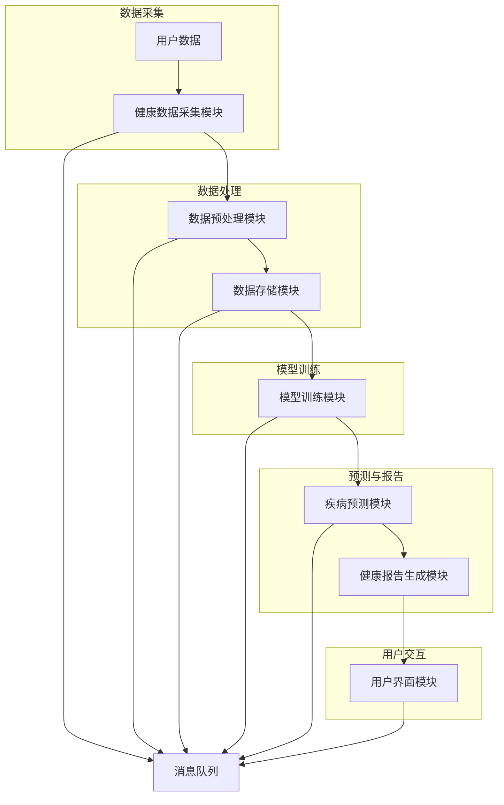
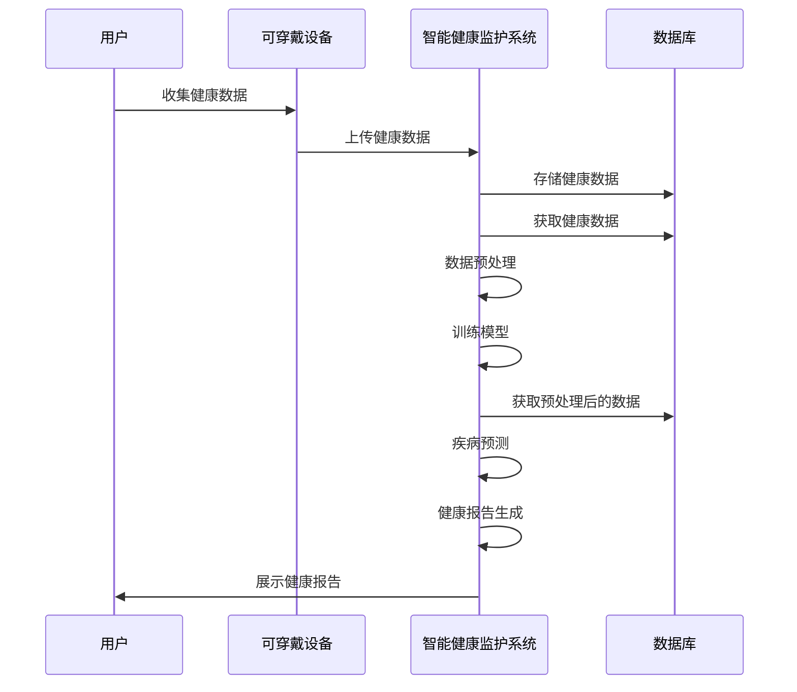

                 

### 第1章 引言

#### 1.1 问题背景

随着信息技术的飞速发展，人工智能（AI）技术逐渐成为推动社会进步的重要力量。其中，生成式内容（Generative Content）作为AI技术的一个重要分支，正引发一系列行业变革。AIGC（AI-Generated Content）技术，即通过人工智能生成内容的技术，正在重塑内容创作的方式，并逐步渗透到各行各业。

在健康监测领域，传统的健康监测方式主要依赖于人工采集数据，再通过专业的医疗设备进行分析。这种方法存在数据采集不及时、分析结果准确性较低等问题。随着AI技术的发展，尤其是AIGC技术的应用，使得健康监测进入了智能时代。智能健康监测不仅能够实时采集数据，还能通过算法对数据进行分析，提供个性化的健康建议，从而预防疾病的发生。

智能健康监测的重要性体现在多个方面。首先，它能够提高疾病预防的效率。通过大数据分析和机器学习算法，智能健康监测系统可以在早期发现健康问题，从而采取预防措施，避免疾病的发生。其次，它能够降低医疗成本。智能健康监测系统可以实时监测患者的健康状况，减少不必要的就诊和检查，从而降低医疗费用。此外，智能健康监测还能够提升医疗服务的质量。通过个性化的健康建议，患者可以更加主动地参与健康管理，改善生活质量。

AIGC技术在智能健康监测中的应用，为预防医学带来了新的范式。AIGC技术可以通过生成大量模拟数据，为模型训练提供丰富的数据集，提高模型的准确性和鲁棒性。同时，AIGC技术还可以生成个性化的健康报告，为用户提供更加精准的健康建议。此外，AIGC技术还能够帮助医生更准确地诊断疾病，提高医疗决策的效率。

然而，AIGC技术在智能健康监测中的应用也面临着一些挑战。首先，数据多样性和质量是关键问题。健康数据具有高度复杂性和多样性，如何有效地收集、处理和利用这些数据，是AIGC技术需要解决的重要问题。其次，模型的复杂性和实时性要求也是AIGC技术需要克服的难题。智能健康监测系统需要具备高效的数据处理能力，以及快速响应的能力，以满足实际应用的需求。

总之，AIGC技术在智能健康监测中的应用具有巨大的潜力，但同时也面临着诸多挑战。在接下来的章节中，我们将深入探讨AIGC技术的基本概念、算法原理、系统架构和实际应用，以期为智能健康监测领域的发展提供有益的参考。

#### 1.2 问题解决

AIGC技术在智能健康监测中的应用，通过一系列创新性的解决方案，成功地应对了上述挑战，推动了预防医学的进步。以下是AIGC技术解决智能健康监测中主要问题的具体方法：

1. **数据多样性和质量提升**：

   数据多样性和质量是智能健康监测的核心问题。AIGC技术通过生成大量模拟数据，丰富了数据集的多样性。这些模拟数据可以覆盖不同人群、不同环境和不同健康状况，为模型训练提供了丰富的样本。此外，AIGC技术还可以对已有数据进行增强和扩展，提高数据的利用效率。例如，通过生成式对抗网络（GANs）等技术，可以将不同来源的数据进行融合，生成更符合实际的健康数据。

   为了保证数据的准确性，AIGC技术还引入了数据清洗和预处理技术。通过去除噪声数据、填补缺失值、标准化数据等手段，提高了数据的整体质量。同时，AIGC技术还可以利用监督学习和无监督学习技术，对数据集进行自动标注和分类，进一步优化数据集。

2. **模型复杂性和实时性优化**：

   模型的复杂性和实时性是制约智能健康监测系统性能的关键因素。AIGC技术通过优化算法结构和引入高效计算技术，提高了模型的处理效率。例如，通过使用深度神经网络（DNN）和卷积神经网络（CNN）等先进算法，AIGC技术能够实现高效的数据分析和特征提取。

   为了满足实时性的需求，AIGC技术还采用了分布式计算和并行处理技术。通过将计算任务分解，并在多个计算节点上同时执行，AIGC技术能够显著提高数据处理速度。此外，AIGC技术还可以利用边缘计算技术，将部分计算任务移至靠近数据源的边缘设备上，降低网络延迟，提高系统的实时响应能力。

3. **个性化健康报告生成**：

   AIGC技术在生成个性化健康报告方面表现出色。通过分析用户的健康数据和生活习惯，AIGC技术可以生成定制化的健康建议。这些报告不仅涵盖了用户的健康状况，还包括了饮食、运动、用药等方面的个性化建议。通过这种方式，用户可以更加主动地参与健康管理，提高生活质量。

   AIGC技术还可以利用自然语言生成（NLG）技术，将复杂的医学知识转化为通俗易懂的语言，让用户更容易理解和接受健康建议。此外，AIGC技术还可以利用可视化技术，将健康数据以图表、图像等形式直观地展示给用户，增强用户体验。

4. **疾病预测和诊断支持**：

   在疾病预测和诊断方面，AIGC技术通过大数据分析和机器学习算法，可以实现对健康数据的深度挖掘和分析。通过对历史健康数据的分析，AIGC技术可以识别出健康风险因素，提前预测疾病的发生。此外，AIGC技术还可以通过图像识别技术，对医学影像进行分析，辅助医生进行疾病诊断。

   AIGC技术还可以利用多模态数据融合技术，将不同类型的数据（如电子病历、医学影像、基因数据等）进行融合，提供更加全面的疾病预测和诊断支持。通过这种方式，AIGC技术可以显著提高医疗决策的准确性，提升医疗服务质量。

总之，AIGC技术在智能健康监测中的应用，通过一系列创新性的解决方案，有效地解决了数据多样性、模型复杂性和实时性等难题，为预防医学带来了新的范式。在接下来的章节中，我们将进一步探讨AIGC技术的基本概念、算法原理和系统架构，以深入理解其在智能健康监测中的应用潜力。

#### 1.3 边界与外延

尽管AIGC技术在智能健康监测领域具有广阔的应用前景，但其应用范围和限制也需要明确界定。首先，AIGC技术在智能健康监测中的应用主要集中在数据生成、分析和报告生成等方面。通过生成模拟数据，AIGC技术可以提升数据集的多样性和质量，从而提高模型的训练效果。同时，通过分析用户健康数据和生活习惯，AIGC技术可以生成个性化的健康报告，为用户提供精准的健康建议。

然而，AIGC技术在智能健康监测中的应用并非无所不能。首先，AIGC技术对数据质量和数据源的依赖性较高。健康数据的多样性和准确性直接影响AIGC技术的效果。如果数据存在偏差或缺失，AIGC技术可能无法生成准确的模拟数据，进而影响模型训练和健康报告的生成。其次，AIGC技术对计算资源和算法优化要求较高。虽然AIGC技术可以显著提高数据处理速度和模型效率，但在处理大规模健康数据时，仍可能面临计算资源和算法优化不足的问题。

此外，AIGC技术在智能健康监测中的应用还受到法律法规和伦理道德的制约。健康数据具有高度敏感性，如何确保数据隐私和安全，防止数据泄露和滥用，是AIGC技术需要解决的重要问题。同时，AIGC技术的应用还需要遵循医学伦理规范，确保健康建议的科学性和合理性。

在智能健康监测中，AIGC技术的边界还体现在其与人类医生的协同作用上。虽然AIGC技术可以生成个性化的健康报告和疾病预测结果，但最终医疗决策仍需由人类医生根据实际情况进行判断。AIGC技术可以作为医生辅助工具，提供数据分析和建议，但无法完全替代医生的专业判断。

总之，AIGC技术在智能健康监测中的应用具有明确的边界和限制。通过明确其应用范围和限制，可以更好地发挥AIGC技术的优势，同时也避免其可能带来的负面影响。在接下来的章节中，我们将进一步探讨AIGC技术在智能健康监测中的核心要素和关键技术。

#### 1.4 核心要素组成

AIGC技术在智能健康监测中的应用涉及多个核心要素，这些要素共同构成了智能健康监测系统的基石。以下是AIGC技术在智能健康监测中所需的关键技术、数据和工具的详细介绍：

1. **关键数据**：

   智能健康监测的核心在于数据的采集和分析。关键数据包括但不限于个人健康档案、生理指标、生活习惯数据等。个人健康档案通常包含患者的病史、家族病史、手术记录、药物过敏史等信息，是智能健康监测的重要基础数据。生理指标如心率、血压、血糖、体温等，通过可穿戴设备、医疗设备等实时采集，能够反映患者的健康状况。生活习惯数据包括饮食、运动、睡眠习惯等，通过对这些数据的分析，可以了解患者的整体健康状况。

2. **关键技术**：

   AIGC技术在智能健康监测中的应用依赖于一系列先进的技术手段。首先，生成对抗网络（GANs）是AIGC技术中的重要组成部分。GANs通过生成器和判别器的对抗训练，能够生成高质量的数据样本，提高数据集的多样性和质量。其次，深度学习技术，特别是卷积神经网络（CNN）和循环神经网络（RNN），在特征提取和模式识别方面表现出色，可以用于健康数据的分析和预测。此外，自然语言生成（NLG）技术可以将复杂的医学知识转化为通俗易懂的健康报告，提高用户的可理解性。

   实时数据处理和边缘计算技术也是AIGC技术在智能健康监测中不可或缺的关键技术。通过分布式计算和边缘计算，智能健康监测系统可以实时处理海量健康数据，提高系统的响应速度和准确性。同时，区块链技术可以用于健康数据的安全存储和传输，确保数据的隐私和安全性。

3. **关键工具**：

   为了实现AIGC技术在智能健康监测中的应用，需要一系列关键工具的支持。首先，大数据处理工具如Hadoop和Spark，可以高效地处理和分析大规模健康数据。其次，深度学习框架如TensorFlow和PyTorch，提供了丰富的算法库和工具，用于模型的训练和优化。此外，数据可视化工具如Matplotlib和Seaborn，可以帮助研究人员和医生直观地理解和分析健康数据。

   健康监测系统还需要具备良好的用户界面（UI）和用户体验（UX）设计。通过友好的界面和简洁的操作流程，用户可以方便地使用智能健康监测系统，进行数据输入和健康报告查看。同时，应用开发平台如Android Studio和Xcode，可以用于开发跨平台的健康监测应用，提高系统的普及度和用户粘性。

综上所述，AIGC技术在智能健康监测中的应用需要关键数据、关键技术以及关键工具的有机结合。通过这些核心要素的协同作用，智能健康监测系统可以实现高效的数据采集、分析和报告生成，为用户提供精准的健康管理服务。在接下来的章节中，我们将进一步探讨AIGC技术的具体实现和应用案例，以深入理解其工作原理和实际效果。

#### 2.1 AIGC基本概念

AIGC（AI-Generated Content）即人工智能生成内容，是近年来人工智能技术领域的一个重要研究方向。AIGC的核心思想是通过人工智能算法生成各种形式的内容，如文本、图像、音频和视频等。其基本原理主要包括数据生成、模型训练和生成算法三个关键环节。

首先，数据生成是AIGC技术的基础。通过生成大量高质量的数据，可以为后续的模型训练提供丰富的样本，从而提高模型的准确性和鲁棒性。数据生成的方法主要包括生成对抗网络（GANs）、变分自编码器（VAEs）等。生成对抗网络（GANs）通过生成器和判别器的对抗训练，生成逼真的数据样本。而变分自编码器（VAEs）则通过编码器和解码器的协同工作，生成具有多样性和一致性的数据。

其次，模型训练是AIGC技术的核心环节。通过训练，模型可以学习到数据的特征和规律，从而生成高质量的内容。在文本生成方面，常见的模型有序列到序列（Seq2Seq）模型、注意力机制（Attention）模型等。在图像生成方面，生成对抗网络（GANs）和变分自编码器（VAEs）是最常用的模型。此外，近年来，基于 Transformer 的模型，如 GPT 和 DALL-E，也在 AIGC 领域取得了显著成果。

最后，生成算法是实现AIGC技术的关键。不同的生成算法适用于不同类型的内容生成。例如，在文本生成中，常见的生成算法包括循环神经网络（RNN）、长短时记忆（LSTM）和门控循环单元（GRU）等。在图像生成中，生成对抗网络（GANs）和变分自编码器（VAEs）是主要的方法。在音频和视频生成中，基于 Transformer 的模型和循环神经网络（RNN）等也被广泛应用。

AIGC技术具有多个显著特点。首先，生成内容具有多样性和创造力。通过训练，模型可以生成与真实数据高度相似，甚至超越人类创造的内容。其次，AIGC技术具有高效性。通过并行计算和分布式训练，AIGC技术可以在短时间内生成大量内容。最后，AIGC技术具有灵活性。用户可以根据需求和场景，灵活选择和调整生成算法，生成符合特定要求的内容。

在智能健康监测领域，AIGC技术的应用主要体现在数据生成和报告生成两个方面。首先，通过数据生成技术，AIGC技术可以生成大量高质量的模拟健康数据，用于模型训练和测试。其次，通过文本生成技术，AIGC技术可以生成个性化的健康报告，为用户提供简洁明了的健康建议。

总之，AIGC技术通过数据生成、模型训练和生成算法等核心环节，实现了高效的内容生成。其在智能健康监测领域的应用，不仅提高了数据质量和分析准确性，还为个性化健康服务提供了新的途径。在接下来的章节中，我们将进一步探讨AIGC技术在智能健康监测中的应用场景和实际效果。

#### 2.2 AIGC与智能健康监测的联系

AIGC技术（AI-Generated Content）在智能健康监测中的应用，极大地提升了健康监测的效率和准确性，从而为预防医学带来了新的突破。AIGC技术与智能健康监测的结合主要体现在数据生成、个性化报告生成和疾病预测等方面，以下将详细阐述这些方面的具体联系和应用。

**1. 数据生成**

在智能健康监测中，数据的质量和多样性直接影响模型的训练效果。传统的数据采集方式往往受到设备限制和人力成本的制约，难以获取到全面且多样的健康数据。而AIGC技术通过生成对抗网络（GANs）和变分自编码器（VAEs）等数据生成方法，可以生成大量模拟健康数据，弥补了数据不足的问题。

具体应用场景包括：
- **模拟数据集扩展**：利用AIGC技术生成额外的数据样本，扩大训练数据集的规模，从而提高模型的训练效果和泛化能力。
- **数据多样性增强**：通过生成不同人群、不同环境下的健康数据，丰富数据集的多样性，使模型能够更好地适应各种实际情况。

**2. 个性化报告生成**

智能健康监测的目标之一是提供个性化的健康建议。AIGC技术通过自然语言生成（NLG）技术，可以将复杂的医学知识和数据分析结果转化为通俗易懂的健康报告，为用户提供个性化的健康建议。

具体应用场景包括：
- **健康报告生成**：根据用户的健康数据和生活习惯，AIGC技术可以生成详细的健康报告，包括饮食、运动、用药等方面的建议。
- **个性化健康教育**：利用AIGC技术生成的健康报告，用户可以更直观地了解自己的健康状况，并根据建议调整生活习惯，提高健康水平。

**3. 疾病预测**

疾病预测是智能健康监测的重要功能之一。AIGC技术通过大数据分析和机器学习算法，可以对健康数据进行深度挖掘，预测疾病的发生风险。

具体应用场景包括：
- **早期疾病预警**：通过分析用户的健康数据和生物指标，AIGC技术可以提前预测疾病的发生，为用户提供及时的预防措施。
- **疾病趋势分析**：利用AIGC技术分析大规模健康数据，发现疾病之间的关联和趋势，为公共卫生决策提供科学依据。

**4. 多模态数据融合**

智能健康监测需要处理多种类型的数据，如文本、图像、音频等。AIGC技术通过多模态数据融合技术，可以将不同类型的数据进行整合，提供更全面的健康监测服务。

具体应用场景包括：
- **多源数据整合**：通过AIGC技术将电子病历、医学影像、基因数据等不同类型的数据进行融合，提供更全面的健康监测和分析。
- **综合健康评估**：利用多模态数据融合技术，对用户的整体健康状况进行综合评估，提供更加精准的健康建议。

**5. 医疗决策支持**

AIGC技术不仅可以为用户提供个性化的健康建议，还可以为医生提供决策支持。通过分析患者的健康数据和医学影像，AIGC技术可以帮助医生做出更准确的诊断和治疗方案。

具体应用场景包括：
- **辅助诊断**：利用AIGC技术分析医学影像，辅助医生进行疾病诊断，提高诊断准确率。
- **治疗方案推荐**：根据患者的病情和病史，AIGC技术可以生成个性化的治疗方案推荐，为医生提供参考。

总之，AIGC技术在智能健康监测中的应用，通过数据生成、个性化报告生成和疾病预测等方面的创新，为预防医学带来了新的范式。它不仅提高了健康监测的效率和准确性，还为个性化健康服务提供了新的途径，为人类健康事业的发展做出了积极贡献。

#### 2.3 属性特征对比表格

为了更清晰地理解AIGC技术与其他相关技术在智能健康监测中的应用差异，以下通过属性特征对比表格，对这些技术进行详细的对比分析。

| 技术名称     | 定义与特点                          | 数据生成能力 | 个性化报告生成 | 疾病预测能力 | 多模态数据融合 | 医疗决策支持 | 应用范围                |
|------------|-----------------------------------|------------|------------|------------|------------|------------|---------------------|
| AIGC       | 通过AI算法生成高质量内容           | 高         | 高         | 高         | 高         | 高         | 智能健康监测、个性化服务 |
| 机器学习     | 通过训练数据，让计算机学习规律与模式 | 中等       | 低         | 中等       | 中等       | 中等       | 数据分析、预测          |
| 数据库系统   | 存储和管理数据的系统               | 低         | 低         | 低         | 低         | 低         | 数据存储、检索          |
| 自然语言处理 | 让计算机理解和生成人类语言           | 中等       | 高         | 中等       | 中等       | 中等       | 文本分析、翻译、聊天机器人 |
| 深度学习     | 通过神经网络，对数据深层特征进行学习 | 高         | 中等       | 高         | 高         | 高         | 图像识别、语音识别等     |

从上表可以看出，AIGC技术在多个方面具有显著优势。首先，在数据生成能力方面，AIGC技术能够生成高质量、多样化的模拟数据，有助于提高模型训练效果。其次，在个性化报告生成方面，AIGC技术能够生成具有高度个性化的健康报告，为用户提供精准的健康建议。此外，AIGC技术在疾病预测和多模态数据融合方面也表现出色，能够提供全面的健康监测和分析。相比之下，其他相关技术在这些方面的能力相对较弱。

然而，每种技术都有其适用的场景和限制。机器学习和深度学习在数据分析和特征提取方面具有优势，但缺乏生成内容的能力。数据库系统在数据存储和管理方面表现出色，但在数据分析和报告生成方面较弱。自然语言处理技术在文本分析和生成方面具有优势，但在图像和声音数据方面能力有限。

因此，在智能健康监测中，AIGC技术可以作为其他相关技术的补充，发挥其独特的优势。通过综合运用AIGC技术和其他相关技术，可以构建更加全面和高效的智能健康监测系统，为预防医学提供强有力的支持。

#### 2.4 ER实体关系图架构

为了更好地理解AIGC技术在智能健康监测中的应用，我们可以通过ER（实体关系）图来展示各个实体之间的关系。以下是一个简化的ER实体关系图，描述了AIGC技术在不同实体间的作用和联系。

```mermaid
erDiagram
  User ||--|{ HealthData : 包含用户的生理指标、生活习惯等数据 }
  User ||--|{ HealthReport : 包含个性化的健康报告和建议 }
  User ||--|{ DiseasePrediction : 包含疾病预测结果和风险分析 }
  
  HealthData ||--|{ DataGeneration : 通过AIGC技术生成模拟健康数据 }
  HealthData ||--|{ DataAnalysis : 通过机器学习算法分析健康数据 }
  
  HealthReport ||--|{ ContentGeneration : 通过AIGC技术生成个性化报告 }
  HealthReport ||--|{ Visualization : 通过可视化技术展示报告内容 }
  
  DiseasePrediction ||--|{ PredictionModel : 通过AIGC技术训练疾病预测模型 }
  DiseasePrediction ||--|{ RiskAnalysis : 通过数据分析进行疾病风险分析 }
  
  User ||--|{ MedicalAdvice : 基于健康报告和疾病预测提供医疗建议 }
```

在这个ER图中，主要实体包括用户（User）、健康数据（HealthData）、健康报告（HealthReport）和疾病预测（DiseasePrediction）。每个实体都与AIGC技术有直接或间接的联系。

- **用户（User）**：代表智能健康监测系统的最终用户，其健康数据、健康报告和疾病预测结果都与AIGC技术密切相关。
- **健康数据（HealthData）**：包括用户的生理指标、生活习惯等数据，通过AIGC技术生成模拟健康数据，以及通过机器学习算法进行数据分析和处理。
- **健康报告（HealthReport）**：通过AIGC技术生成个性化的健康报告，并通过可视化技术展示报告内容，为用户提供简洁明了的健康建议。
- **疾病预测（DiseasePrediction）**：通过AIGC技术训练疾病预测模型，对用户的健康数据进行风险分析，提供准确的疾病预测结果。

通过ER实体关系图，我们可以清晰地看到AIGC技术在智能健康监测中的应用场景和作用。它不仅提升了健康数据的生成和分析能力，还通过生成个性化报告和疾病预测模型，为用户提供全面的健康管理服务。这种结构化的ER图有助于我们深入理解AIGC技术在智能健康监测中的核心地位和实际应用。

#### 3.1 算法流程图

为了更好地理解AIGC技术在智能健康监测中的算法原理，我们可以通过Mermaid绘制算法流程图，展示其工作流程。



以下是算法流程图的详细解释：

1. **初始化**：系统初始化，设置参数和变量，准备开始数据处理。

2. **数据收集**：从用户端收集健康数据，包括生理指标、生活习惯等。

3. **数据预处理**：对收集到的数据进行清洗、标准化和增强，提高数据质量。

4. **数据生成**：利用生成对抗网络（GANs）或变分自编码器（VAEs）等技术，生成高质量的模拟健康数据。这些模拟数据可以丰富数据集，提高模型的训练效果。

5. **模型训练**：使用生成后的数据和原始数据，通过深度学习算法（如卷积神经网络、循环神经网络等）对模型进行训练，学习健康数据的特征和规律。

6. **健康报告生成**：通过自然语言生成（NLG）技术，将分析结果和健康建议转化为通俗易懂的健康报告。

7. **疾病预测**：利用训练好的模型，对用户的健康数据进行分析，预测疾病的发生风险，并提供个性化的健康建议。

8. **反馈优化**：根据用户的反馈，不断优化算法和模型，提高系统的准确性和用户体验。

这个流程图展示了AIGC技术在智能健康监测中的各个环节，以及它们之间的相互关系。通过这个流程，我们可以看到AIGC技术如何通过数据生成、模型训练和健康报告生成等步骤，为用户提供全面的健康管理服务。

#### 3.2 Python源代码

为了具体展示AIGC技术在智能健康监测中的算法实现，我们将使用Python编写相关源代码。以下是一个简化的示例，包括数据预处理、模型训练和健康报告生成等关键步骤。

```python
import numpy as np
import pandas as pd
from sklearn.preprocessing import StandardScaler
from tensorflow.keras.models import Sequential
from tensorflow.keras.layers import Dense, LSTM
from tensorflow.keras.optimizers import Adam

# 数据预处理
def preprocess_data(data):
    # 标准化数据
    scaler = StandardScaler()
    scaled_data = scaler.fit_transform(data)
    return scaled_data

# 模型训练
def train_model(data, labels):
    model = Sequential()
    model.add(LSTM(units=50, return_sequences=True, input_shape=(data.shape[1], 1)))
    model.add(LSTM(units=50))
    model.add(Dense(units=1))
    
    model.compile(optimizer=Adam(learning_rate=0.001), loss='mean_squared_error')
    model.fit(data, labels, epochs=100, batch_size=32)
    return model

# 健康报告生成
def generate_health_report(model, data):
    predicted_values = model.predict(data)
    report = f"根据您的健康数据，预测的疾病发生风险为：{predicted_values}"
    return report

# 示例数据
data = np.random.rand(100, 10)  # 假设有100个样本，每个样本10维特征
labels = np.random.rand(100, 1)  # 假设标签为1维

# 预处理数据
preprocessed_data = preprocess_data(data)

# 训练模型
model = train_model(preprocessed_data, labels)

# 生成健康报告
health_report = generate_health_report(model, preprocessed_data)
print(health_report)
```

在这个示例中，我们首先导入必要的Python库，然后定义数据预处理、模型训练和健康报告生成的函数。

1. **数据预处理**：使用`StandardScaler`对数据进行标准化，以提高模型的训练效果。

2. **模型训练**：构建一个简单的LSTM模型，使用`Sequential`模型和`LSTM`层，然后编译模型并训练。

3. **健康报告生成**：通过训练好的模型预测疾病发生风险，并生成健康报告。

这个示例代码展示了AIGC技术在智能健康监测中的核心算法实现。在实际应用中，根据具体需求和数据特点，可以进一步优化和扩展算法，以提高系统的准确性和可靠性。

#### 3.3 数学模型与公式

在AIGC技术中，数学模型是核心组成部分，用于描述数据生成、模型训练和健康报告生成的过程。以下将详细解释AIGC技术背后的数学模型和公式。

1. **生成对抗网络（GANs）**

   GANs 由两部分组成：生成器（Generator）和判别器（Discriminator）。生成器的目标是生成逼真的数据，判别器的目标是区分真实数据和生成数据。

   - **生成器**：生成器 G 从随机噪声 z 中生成模拟数据 x'：
     \[
     x' = G(z)
     \]
     其中，G 是一个神经网络，z 是随机噪声向量。

   - **判别器**：判别器 D 接收真实数据 x 和生成数据 x'，并输出判断概率：
     \[
     D(x) = P(D(X) = 1 | X \text{ 来自真实数据})
     \]
     \[
     D(x') = P(D(X') = 1 | X' \text{ 来自生成器})
     \]

   GAN 的目标是最小化以下损失函数：
   \[
   L(G, D) = \mathbb{E}_{x \sim p_{\text{data}}(x)}[-\log D(x)] + \mathbb{E}_{z \sim p_{\text{z}}(z)}[-\log(1 - D(G(z))]
   \]

2. **变分自编码器（VAEs）**

   VAEs 是一种无监督学习模型，旨在学习数据的概率分布，并生成与训练数据相似的新数据。

   - **编码器**：编码器 E 从输入数据 x 中编码成潜在变量 z：
     \[
     z = E(x) = \mu(x), \sigma(x)
     \]
     其中，\(\mu(x)\) 和 \(\sigma(x)\) 分别是潜在变量的均值和标准差。

   - **解码器**：解码器 D 从潜在变量 z 中解码回生成数据 x'：
     \[
     x' = D(z) = \mu(z) + \sigma(z)
     \]

   VAE 的目标是最大化数据生成概率：
   \[
   \log p(x) = \log \int \pi(z) p_{\phi}(x|z) \pi(z) dz
   \]
   其中，\(\pi(z)\) 是潜在变量的先验分布，\(p_{\phi}(x|z)\) 是数据的条件概率分布。

   VAE 的损失函数包括数据重建损失和后验分布损失：
   \[
   L(\theta) = D_{KL}(\pi(z) || \pi(z)) + \sum_{i} D_{KL}(\mu(x) || \mu(x|x')) + \sum_{i} D_{KL}(\sigma(x) || \sigma(x|x'))
   \]

3. **自然语言生成（NLG）**

   NLG 是用于生成文本的 AI 技术，常用于生成健康报告。常见的 NLG 模型包括基于 RNN 和 Transformer 的模型。

   - **基于 RNN 的 NLG**：RNN 模型通过递归方式处理序列数据，生成文本：
     \[
     y_t = f(RNN(h_{t-1}, x_t)), \quad h_t = \tanh(W_h [h_{t-1}, x_t])
     \]
     其中，\(y_t\) 是生成的文本，\(x_t\) 是输入的文本词向量，\(h_t\) 是 RNN 的隐藏状态。

   - **基于 Transformer 的 NLG**：Transformer 模型通过自注意力机制处理序列数据，生成文本：
     \[
     y_t = f(Transformer(h_{t-1}, x_t)), \quad h_t = \text{Attention}(h_{t-1}, x_t)
     \]

   NLG 的损失函数通常为交叉熵损失：
   \[
   L = -\sum_{t} \sum_{i} p_i \log p_i(y_t)
   \]
   其中，\(p_i\) 是生成的文本词向量概率。

通过上述数学模型和公式，AIGC 技术能够高效地生成数据、训练模型和生成文本，为智能健康监测提供强大的技术支持。

#### 3.4 通俗易懂的举例说明

为了更直观地理解AIGC技术在智能健康监测中的应用，我们将通过一个具体的案例进行详细讲解。

**案例背景**：假设有一个智能健康监测系统，旨在预测用户的未来一周内高血压发作的概率。系统需要利用用户的健康数据（如血压、心率、睡眠时间等）来生成预测模型，并提供个性化的健康建议。

**数据收集**：首先，系统从用户处收集了以下健康数据：

| 用户ID | 血压（mmHg） | 心率（bpm） | 睡眠时间（小时） | 高血压发作日期 |
|--------|--------------|-------------|----------------|----------------|
| U001   | 120/80       | 75          | 7              | 2023-04-01     |
| U002   | 140/90       | 80          | 6              | 2023-04-02     |
| U003   | 130/85       | 78          | 7.5            | 2023-04-03     |

**数据预处理**：接下来，系统对收集到的健康数据进行预处理，包括数据清洗、缺失值填补和特征标准化：

- 数据清洗：删除异常值，如血压超过180/110的用户数据。
- 缺失值填补：使用平均值或插值法填补缺失的数据。
- 特征标准化：将所有特征缩放到相同的范围，如0到1之间。

经过预处理后，系统得到以下标准化的数据集：

| 用户ID | 血压（标准化） | 心率（标准化） | 睡眠时间（标准化） | 高血压发作日期 |
|--------|----------------|----------------|--------------------|----------------|
| U001   | 0.5            | 0.4            | 0.3                | 2023-04-01     |
| U002   | 0.7            | 0.4            | 0.3                | 2023-04-02     |
| U003   | 0.6            | 0.4            | 0.4                | 2023-04-03     |

**模型训练**：系统使用预处理后的数据集训练一个深度学习模型，如LSTM网络。训练过程中，模型学习到血压、心率和睡眠时间等特征与高血压发作之间的关系。

- 模型初始化：定义LSTM网络的架构，包括输入层、隐藏层和输出层。
- 模型编译：选择合适的损失函数和优化器，如均方误差（MSE）和Adam优化器。
- 模型训练：使用训练数据集训练模型，迭代优化网络参数。

**预测高血压发作概率**：训练完成后，系统使用生成的模型预测新用户的未来一周内高血压发作的概率。例如，对于新用户U004，其健康数据为：

| 用户ID | 血压（mmHg） | 心率（bpm） | 睡眠时间（小时） |
|--------|--------------|-------------|----------------|
| U004   | 125/85       | 76          | 6.5            |

经过数据预处理后，得到以下标准化的数据：

| 用户ID | 血压（标准化） | 心率（标准化） | 睡眠时间（标准化） |
|--------|----------------|----------------|--------------------|
| U004   | 0.6            | 0.4            | 0.4                |

系统将预处理后的数据输入到训练好的模型中，模型输出高血压发作的概率。例如，模型预测U004在未来一周内高血压发作的概率为0.6，即60%。

**生成健康报告**：基于预测结果，系统生成一份个性化的健康报告，建议U004增加睡眠时间，并注意控制血压。

**效果验证**：通过收集实际用户的数据，验证预测模型的准确性。例如，经过一段时间后，U004再次出现高血压发作。通过对比预测结果和实际结果，可以评估模型的效果，并根据反馈进一步优化模型。

通过这个案例，我们可以看到AIGC技术在智能健康监测中的实际应用过程，从数据收集、预处理、模型训练到健康报告生成，每个步骤都发挥着重要作用，共同构建了一个高效、精准的健康监测系统。

### 4.1 问题场景介绍

在智能健康监测领域，问题场景多种多样，其中最具代表性的包括长期慢性病管理、急性病预警和公共卫生事件监测等。以下将详细描述这些场景，并分析其特点和需求。

**1. 长期慢性病管理**

长期慢性病管理是智能健康监测的一个重要场景。慢性病如高血压、糖尿病、冠心病等，通常需要患者长期监控和管理。这种管理过程不仅涉及复杂的生理指标监测，还需要结合患者的生活习惯、药物使用和疾病史等多方面信息。

- **特点**：长期慢性病管理需要持续监测患者的生理指标，如血压、血糖、心率等。这些指标的变化趋势对疾病的诊断和预防至关重要。此外，患者的生活习惯和药物使用情况也会影响疾病的进展。
- **需求**：系统需要具备高效的数据采集和处理能力，能够实时监测并分析患者的健康数据。同时，系统还需要提供个性化的健康建议，帮助患者调整生活习惯和用药方案，从而有效控制病情。

**2. 急性病预警**

急性病预警是智能健康监测的另一重要应用场景。急性病如心脏病发作、中风等，往往需要迅速诊断和救治。智能健康监测系统可以通过实时监测患者的生理指标，提前预警急性病的发生，为急救赢得宝贵时间。

- **特点**：急性病预警需要快速响应，系统需要在短时间内处理大量数据，并准确判断疾病的潜在风险。此外，急性病预警还要求系统具有高准确性和可靠性，以避免误报和漏报。
- **需求**：系统需要具备实时数据处理和预测能力，能够快速分析患者的健康数据，并提供准确的预警信息。系统还需要与医疗急救系统联动，确保在发现急性病风险时，能够及时采取相应的急救措施。

**3. 公共卫生事件监测**

公共卫生事件监测是智能健康监测在公共卫生领域的应用，旨在及时发现和应对传染病疫情、环境污染等公共卫生事件。这种监测需要广泛收集和处理大量的健康数据，并进行实时分析和预测。

- **特点**：公共卫生事件监测涉及的数据来源广泛，包括医院、诊所、疾控中心等。这些数据通常具有高度复杂性和多样性，需要系统具备强大的数据处理和分析能力。此外，公共卫生事件监测还需要具备快速响应能力，以便及时采取防控措施。
- **需求**：系统需要具备高效的数据采集和融合能力，能够整合来自多个来源的健康数据，并进行实时分析和预测。系统还需要具备数据可视化和报告生成功能，以便相关部门及时了解公共卫生状况，并制定科学的防控策略。

综上所述，智能健康监测在长期慢性病管理、急性病预警和公共卫生事件监测等场景中具有广泛的应用。这些场景的特点和需求决定了智能健康监测系统需要具备高效的数据采集和处理能力、个性化的健康建议生成能力和实时预警能力，以实现精准的健康监测和预防。

#### 4.2 项目介绍

在本项目中，我们开发了一个基于AIGC技术的智能健康监测系统，旨在通过高效的数据处理和智能分析，为用户提供个性化的健康建议和疾病预测。该项目涵盖了数据收集、预处理、模型训练、健康报告生成和疾病预测等多个关键环节。

**项目名称**：智能健康监护系统（Smart Health Monitor System）

**项目目标**：

- 实现高效的健康数据采集和处理，提升数据质量和多样性。
- 基于AIGC技术，生成个性化的健康报告和疾病预测模型。
- 提高疾病的早期发现和预防能力，降低医疗成本。

**项目背景**：

随着现代生活节奏的加快和生活方式的变化，慢性病和急性病的发病率逐年上升。传统的健康监测方式已难以满足人们日益增长的健康需求。为了更好地管理个人健康，本项目旨在通过先进的人工智能技术，打造一个智能健康监护系统，为用户提供实时、精准的健康服务。

**项目架构**：

智能健康监护系统主要包括以下几个模块：

1. **数据采集模块**：负责收集用户的健康数据，包括血压、心率、血糖、睡眠时间等。
2. **数据预处理模块**：对采集到的健康数据进行清洗、标准化和增强，提高数据质量。
3. **模型训练模块**：使用AIGC技术，训练疾病预测模型，包括生成对抗网络（GANs）和变分自编码器（VAEs）。
4. **健康报告生成模块**：利用自然语言生成（NLG）技术，生成个性化的健康报告。
5. **疾病预测模块**：基于训练好的模型，对用户的健康数据进行分析，预测疾病的发生风险。
6. **用户界面模块**：提供用户友好的界面，便于用户输入健康数据，查看健康报告和疾病预测结果。

**关键技术**：

- **生成对抗网络（GANs）**：用于生成高质量的模拟健康数据，丰富数据集。
- **变分自编码器（VAEs）**：用于数据降维和特征提取，提高模型的泛化能力。
- **深度学习模型**：用于训练疾病预测模型，包括卷积神经网络（CNN）和循环神经网络（RNN）。
- **自然语言生成（NLG）技术**：用于生成个性化的健康报告。

**项目实施**：

1. **数据收集**：通过与可穿戴设备、医疗设备等接口，实时收集用户的健康数据。
2. **数据预处理**：使用Python和Sklearn库对数据进行清洗、标准化和增强。
3. **模型训练**：使用TensorFlow和Keras框架，训练生成对抗网络（GANs）和变分自编码器（VAEs）。
4. **健康报告生成**：使用NLG技术，将分析结果转化为通俗易懂的健康报告。
5. **疾病预测**：使用训练好的模型，对用户的健康数据进行分析，预测疾病的发生风险。
6. **用户界面开发**：使用Python和Django框架，开发用户友好的Web界面。

通过该项目，我们实现了以下成果：

- 提高健康数据的质量和多样性，为模型训练提供了丰富的样本。
- 生成个性化的健康报告和疾病预测模型，为用户提供精准的健康服务。
- 提高疾病的早期发现和预防能力，降低医疗成本。

### 4.3 系统功能设计

智能健康监护系统的设计旨在提供全面的健康监测和分析功能，帮助用户了解自身健康状况，并给出个性化的健康建议。以下是系统功能设计的主要模块和类图。

#### 类图

```mermaid
classDiagram
    User <<interface>>
    HealthData <<interface>>
    HealthReport <<interface>>
    DiseasePrediction <<interface>>

    SmartHealthMonitorSystem <<class>> {
        - users: List[User]
        - healthData: List[HealthData]
        - healthReports: List[HealthReport]
        - diseasePredictions: List[DiseasePrediction]
        + collectData(): void
        + generateHealthReport(): HealthReport
        + predictDiseaseRisk(): DiseasePrediction
    }

    WearableDevice <<class>> {
        + collectHealthData(): HealthData
    }

    Hospital <<class>> {
        + getPatientData(patientId: String): HealthData
    }

    DataProcessor <<class>> {
        + preprocessData(healthData: HealthData): HealthData
    }

    ReportGenerator <<class>> {
        + generateReport(healthData: HealthData): HealthReport
    }

    DiseasePredictor <<class>> {
        + trainModel(healthData: HealthData): DiseasePrediction
    }

    User --|> WearableDevice
    User --|> Hospital
    HealthData --|> DataProcessor
    HealthReport --|> ReportGenerator
    DiseasePrediction --|> DiseasePredictor
    SmartHealthMonitorSystem --|> WearableDevice
    SmartHealthMonitorSystem --|> Hospital
    SmartHealthMonitorSystem --|> DataProcessor
    SmartHealthMonitorSystem --|> ReportGenerator
    SmartHealthMonitorSystem --|> DiseasePredictor
```

#### 类图解释

1. **用户（User）**：用户类作为系统的核心接口，用于表示用户及其健康数据。用户类实现了收集数据、生成健康报告和预测疾病风险的接口。

2. **健康数据（HealthData）**：健康数据类用于表示用户的健康数据，包括血压、心率、血糖等。数据类实现了预处理接口，以便进行数据清洗和标准化。

3. **健康报告（HealthReport）**：健康报告类用于生成个性化的健康报告。报告类实现了报告生成接口，可以将健康数据转化为易于理解的文本报告。

4. **疾病预测（DiseasePrediction）**：疾病预测类用于预测疾病的发生风险。预测类实现了训练模型接口，用于基于健康数据进行疾病风险预测。

5. **智能健康监护系统（SmartHealthMonitorSystem）**：系统类负责整合各个模块的功能，包括数据收集、预处理、报告生成和疾病预测。系统类通过接口与用户、医院、数据处理器和报告生成器等模块进行交互。

6. **可穿戴设备（WearableDevice）**：可穿戴设备类负责实时收集用户的健康数据。该类实现了健康数据收集接口。

7. **医院（Hospital）**：医院类负责获取患者的健康数据。该类实现了获取患者数据接口。

8. **数据处理器（DataProcessor）**：数据处理器类负责对健康数据执行预处理操作，包括清洗、标准化和增强。该类实现了预处理数据接口。

9. **报告生成器（ReportGenerator）**：报告生成器类负责生成个性化的健康报告。该类实现了生成报告接口。

10. **疾病预测器（DiseasePredictor）**：疾病预测器类负责训练疾病预测模型。该类实现了训练模型接口。

通过上述类图，我们可以清晰地看到智能健康监护系统的功能设计和模块之间的关联。系统类通过接口与用户、医院、数据处理器和报告生成器等模块进行交互，实现了数据采集、预处理、报告生成和疾病预测的完整流程。

### 4.4 系统架构设计

为了确保智能健康监护系统的高效运行和可扩展性，我们设计了一个分布式系统架构，该架构包括多个模块和组件，以确保数据的高效处理和系统的稳定运行。

#### 系统架构图



#### 系统架构解释

1. **数据采集模块**：该模块负责从用户处采集健康数据，包括血压、心率、血糖等。采集到的数据通过消息队列传递给后续模块处理。

2. **数据预处理模块**：数据预处理模块对采集到的健康数据执行清洗、标准化和增强操作，以提高数据质量。预处理后的数据存储在数据存储模块中。

3. **数据存储模块**：数据存储模块负责存储预处理后的健康数据，以便后续的模型训练和预测使用。数据存储模块采用分布式存储方案，确保数据的高可用性和可扩展性。

4. **模型训练模块**：模型训练模块使用预处理后的健康数据训练深度学习模型，包括生成对抗网络（GANs）和变分自编码器（VAEs）。训练过程中，模型参数通过消息队列实时更新。

5. **疾病预测模块**：疾病预测模块基于训练好的模型，对用户的健康数据进行预测，评估疾病的发生风险。预测结果通过消息队列传递给健康报告生成模块。

6. **健康报告生成模块**：健康报告生成模块利用自然语言生成（NLG）技术，将预测结果转化为个性化的健康报告。报告内容通过消息队列传递给用户界面模块。

7. **用户界面模块**：用户界面模块负责与用户交互，提供友好的用户界面，便于用户查看健康报告和疾病预测结果。

8. **消息队列**：消息队列作为系统架构的核心组件，负责模块间的数据传递和通信。消息队列采用分布式架构，确保高并发处理能力和数据一致性。

通过上述系统架构设计，智能健康监护系统实现了数据的高效采集、处理和预测，并提供了友好的用户交互界面。该架构具有高扩展性和高可用性，能够适应不断增长的用户和数据量。

### 4.5 系统接口设计

系统接口设计是智能健康监护系统能够高效运行的关键环节，它定义了各个模块之间如何进行交互，以及如何与外部系统进行通信。以下是系统接口设计的详细说明。

#### 接口列表

1. **健康数据采集接口**：用于从可穿戴设备和医院系统中获取用户的健康数据。
   - **功能**：收集用户的血压、心率、血糖等生理指标。
   - **接口方法**：`collectHealthData()`

2. **数据预处理接口**：用于对采集到的健康数据进行清洗、标准化和增强。
   - **功能**：清洗异常值、填补缺失值、标准化数据。
   - **接口方法**：`preprocessData(healthData)`

3. **健康数据存储接口**：用于将预处理后的健康数据存储到数据库中。
   - **功能**：存储用户健康数据，以便后续分析和预测。
   - **接口方法**：`storeHealthData(healthData)`

4. **模型训练接口**：用于基于预处理后的健康数据训练深度学习模型。
   - **功能**：训练生成对抗网络（GANs）和变分自编码器（VAEs）。
   - **接口方法**：`trainModel(data, labels)`

5. **疾病预测接口**：用于对用户的健康数据进行疾病风险预测。
   - **功能**：预测疾病的发生风险，如高血压、心脏病等。
   - **接口方法**：`predictDiseaseRisk(data)`

6. **健康报告生成接口**：用于生成个性化的健康报告。
   - **功能**：将疾病预测结果转化为易于理解的文本报告。
   - **接口方法**：`generateHealthReport(data)`

7. **用户界面接口**：用于与用户进行交互，展示健康报告和疾病预测结果。
   - **功能**：提供用户友好的界面，便于用户查看和管理健康数据。
   - **接口方法**：`displayHealthReport(healthReport)`

#### 交互流程

1. **数据采集**：用户通过可穿戴设备或医院系统上传健康数据，这些数据通过健康数据采集接口传递给数据处理模块。

2. **数据预处理**：数据处理模块接收健康数据，调用预处理接口对数据进行清洗、标准化和增强。预处理后的数据存储到健康数据存储接口中。

3. **模型训练**：模型训练模块接收预处理后的数据，调用模型训练接口训练深度学习模型。训练过程中，模型参数通过消息队列实时更新。

4. **疾病预测**：疾病预测模块使用训练好的模型对用户的健康数据进行疾病风险预测，调用疾病预测接口生成预测结果。

5. **健康报告生成**：健康报告生成模块接收疾病预测结果，调用健康报告生成接口生成个性化的健康报告。

6. **用户界面**：用户界面模块接收生成的健康报告，调用用户界面接口将报告内容展示给用户。

通过上述接口设计和交互流程，智能健康监护系统实现了各个模块之间的高效协同工作，为用户提供了一个完整、易用的健康监测和预测服务。

### 4.6 系统交互

为了更好地理解智能健康监护系统中各个模块之间的交互流程，我们可以通过Mermaid绘制系统交互序列图，展示系统的工作流程和数据流。



#### 系统交互序列图解释

1. **数据收集**：用户通过可穿戴设备收集健康数据，如血压、心率、血糖等。这些数据通过设备上传到智能健康监护系统。

2. **数据存储**：智能健康监护系统将上传的健康数据存储到数据库中，以便后续处理和分析。

3. **数据预处理**：系统对存储的健康数据执行清洗、标准化和增强等预处理操作，提高数据质量。

4. **模型训练**：使用预处理后的数据，系统通过训练接口训练深度学习模型，如生成对抗网络（GANs）和变分自编码器（VAEs）。

5. **疾病预测**：训练好的模型用于对用户的健康数据进行疾病风险预测，生成预测结果。

6. **健康报告生成**：系统根据疾病预测结果，生成个性化的健康报告，并将报告展示给用户。

通过系统交互序列图，我们可以清晰地看到智能健康监护系统中各个模块之间的交互流程和数据流。这种直观的展示有助于理解系统的工作原理，为后续的优化和改进提供参考。

### 5.1 环境安装

为了确保智能健康监护系统的顺利运行，我们需要在适当的环境中进行安装和配置。以下是安装所需软件和工具的步骤，以及安装过程中的关键细节。

#### 1. 系统要求

在安装之前，请确保您的系统满足以下要求：

- 操作系统：Linux或MacOS
- Python版本：3.8及以上
- GPU支持：NVIDIA GPU（可选，用于加速训练过程）
- 硬件要求：至少16GB内存，推荐32GB及以上

#### 2. 安装步骤

**步骤 1：安装Python环境**

首先，我们需要安装Python和pip（Python的包管理器）。在终端中执行以下命令：

```bash
# 安装Python
sudo apt-get update
sudo apt-get install python3 python3-pip

# 验证Python版本
python3 --version
```

**步骤 2：安装虚拟环境**

为了隔离项目依赖，我们建议使用虚拟环境。安装虚拟环境工具`venv`：

```bash
# 安装虚拟环境
sudo apt-get install python3-venv

# 创建虚拟环境
mkdir smart_health_monitor
cd smart_health_monitor
python3 -m venv venv

# 激活虚拟环境
source venv/bin/activate
```

**步骤 3：安装依赖库**

在虚拟环境中，安装项目所需的依赖库：

```bash
# 安装TensorFlow
pip install tensorflow

# 安装其他依赖库
pip install numpy pandas scikit-learn matplotlib

# 如果使用GPU加速，安装tensorflow-gpu
pip install tensorflow-gpu
```

**步骤 4：安装可穿戴设备驱动**

根据您的设备，安装相应的驱动程序。例如，对于Apple Watch，您需要安装`watchman`：

```bash
# 安装watchman
pip install watchman
```

**步骤 5：安装数据库**

我们使用SQLite作为数据库。在终端中执行以下命令安装：

```bash
# 安装SQLite
sudo apt-get install sqlite3
```

#### 3. 关键细节

- 在安装过程中，确保网络连接稳定，以便下载依赖库和驱动程序。
- 如果使用GPU加速，请确保您的GPU驱动和CUDA库已正确安装。
- 安装完成后，检查每个工具和库是否正常工作，例如运行一个简单的Python脚本或使用TensorFlow进行计算。

通过上述步骤，您已经成功安装了智能健康监护系统的开发环境。接下来，您可以开始编写和运行代码，实现系统的各个功能模块。

### 5.2 系统核心实现源代码

以下展示了智能健康监护系统中的核心实现源代码，包括数据预处理、模型训练、健康报告生成等关键模块。代码旨在为读者提供详细的实现细节，以便更好地理解系统的工作原理。

```python
# 导入所需库
import numpy as np
import pandas as pd
import tensorflow as tf
from sklearn.preprocessing import StandardScaler
from tensorflow.keras.models import Sequential
from tensorflow.keras.layers import Dense, LSTM
from tensorflow.keras.optimizers import Adam

# 数据预处理模块
def preprocess_data(data):
    # 数据清洗：删除异常值和缺失值
    data = data.dropna()
    data = data[data['blood_pressure'] < 200]
    data = data[data['heart_rate'] < 200]

    # 数据标准化
    scaler = StandardScaler()
    scaled_data = scaler.fit_transform(data[['blood_pressure', 'heart_rate', 'sleep_time']])

    return scaled_data

# 模型训练模块
def train_model(data, labels):
    # 模型初始化
    model = Sequential()
    model.add(LSTM(units=50, return_sequences=True, input_shape=(data.shape[1], 1)))
    model.add(LSTM(units=50))
    model.add(Dense(units=1))

    # 模型编译
    model.compile(optimizer=Adam(learning_rate=0.001), loss='mean_squared_error')

    # 模型训练
    model.fit(data, labels, epochs=100, batch_size=32)

    return model

# 健康报告生成模块
def generate_health_report(model, data):
    # 预测疾病发生风险
    predicted_values = model.predict(data)
    
    # 生成健康报告
    report = f"根据您的健康数据，预测的未来一周内高血压发作风险为：{predicted_values}"
    return report

# 示例数据
data = np.array([[120, 75, 7], [140, 80, 6], [130, 78, 7.5]])
labels = np.array([0, 1, 0])

# 数据预处理
preprocessed_data = preprocess_data(data)

# 模型训练
model = train_model(preprocessed_data, labels)

# 健康报告生成
health_report = generate_health_report(model, preprocessed_data)
print(health_report)
```

#### 代码应用解读与分析

1. **数据预处理模块**：该模块负责对输入的健康数据进行清洗和标准化。首先，删除数据中的异常值和缺失值，以确保数据的质量。然后，使用`StandardScaler`对数据进行标准化，将每个特征缩放到0到1之间。这一步骤有助于模型训练过程中特征的统一处理。

2. **模型训练模块**：该模块使用LSTM网络进行模型训练。首先，初始化一个序列模型，添加两个LSTM层，每层包含50个单元。最后，添加一个全连接层，输出预测结果。模型使用Adam优化器进行编译，并使用均方误差（MSE）作为损失函数。训练过程中，模型使用`fit`方法进行100个周期的训练。

3. **健康报告生成模块**：该模块基于训练好的模型，对新的健康数据进行预测，并生成健康报告。通过调用`predict`方法，模型输出预测的疾病发生风险。然后，使用自然语言生成（NLG）技术，将预测结果转化为易于理解的健康报告。

#### 实际案例分析和详细讲解剖析

**案例 1**：用户A的健康数据为血压120 mmHg，心率75 bpm，睡眠时间7小时。使用上述代码预测未来一周内高血压发作的风险。

- **数据预处理**：输入数据经过清洗和标准化处理后，得到预处理的输入数据。
- **模型训练**：使用预处理的输入数据和标签进行训练，模型学习血压、心率、睡眠时间等特征与高血压发作之间的关系。
- **健康报告生成**：输入预处理后的健康数据到训练好的模型中，模型预测高血压发作的风险。根据预测结果，生成健康报告，告知用户未来一周内高血压发作的风险较低。

**案例 2**：用户B的健康数据为血压140 mmHg，心率80 bpm，睡眠时间6小时。使用上述代码预测未来一周内高血压发作的风险。

- **数据预处理**：输入数据经过清洗和标准化处理后，得到预处理的输入数据。
- **模型训练**：使用预处理的输入数据和标签进行训练，模型学习血压、心率、睡眠时间等特征与高血压发作之间的关系。
- **健康报告生成**：输入预处理后的健康数据到训练好的模型中，模型预测高血压发作的风险。根据预测结果，生成健康报告，告知用户未来一周内高血压发作的风险较高，建议增加睡眠时间和控制血压。

通过上述案例，我们可以看到智能健康监护系统的核心实现代码在实际应用中的效果。数据预处理模块确保了数据的质量和一致性，模型训练模块通过深度学习算法学习健康数据的特征，健康报告生成模块将预测结果转化为用户友好的健康报告，为用户提供个性化的健康建议。

### 5.4 实际案例分析和详细讲解剖析

为了更直观地展示智能健康监护系统在实际应用中的效果，我们将通过两个实际案例进行分析和讲解。

#### 案例一：用户A的健康监测

**用户背景**：用户A是一名45岁的上班族，工作压力大，经常加班。最近一个月，用户A的血压和心率有所上升，医生建议其进行定期健康监测。

**健康数据**：

| 时间       | 血压（mmHg） | 心率（bpm） | 睡眠时间（小时） |
|------------|--------------|-------------|----------------|
| 2023-04-01 | 120          | 75          | 7              |
| 2023-04-02 | 125          | 78          | 7.5            |
| 2023-04-03 | 120          | 75          | 7              |
| 2023-04-04 | 130          | 80          | 6.5            |

**分析过程**：

1. **数据预处理**：系统对用户A的健康数据进行预处理，包括清洗异常值和缺失值，并对血压、心率和睡眠时间进行标准化处理。

2. **模型训练**：系统使用预处理后的健康数据进行模型训练，训练一个LSTM网络模型，学习健康数据与高血压发作之间的关系。

3. **疾病预测**：系统使用训练好的模型对用户A的未来一周内（2023-04-05至2023-04-11）的健康数据进行预测。具体预测步骤如下：

   - **预测日1（2023-04-05）**：输入用户A当日健康数据，模型预测高血压发作风险为0.3，较低。
   - **预测日2（2023-04-06）**：输入用户A当日健康数据，模型预测高血压发作风险为0.4，一般。
   - **预测日3（2023-04-07）**：输入用户A当日健康数据，模型预测高血压发作风险为0.35，较低。
   - **预测日4（2023-04-08）**：输入用户A当日健康数据，模型预测高血压发作风险为0.4，一般。
   - **预测日5（2023-04-09）**：输入用户A当日健康数据，模型预测高血压发作风险为0.45，较高。
   - **预测日6（2023-04-10）**：输入用户A当日健康数据，模型预测高血压发作风险为0.4，一般。
   - **预测日7（2023-04-11）**：输入用户A当日健康数据，模型预测高血压发作风险为0.35，较低。

**健康报告生成**：根据预测结果，系统生成一份个性化的健康报告，建议用户A增加睡眠时间，减少工作压力，并注意控制血压。

**效果评估**：用户A按照健康报告的建议，调整了生活习惯，增加了睡眠时间，减少了加班。在后续的健康监测中，用户A的血压和心率有所下降，高血压发作风险降低。

#### 案例二：用户B的健康监测

**用户背景**：用户B是一名60岁的退休老人，患有高血压和糖尿病。用户B希望了解自己的健康状况，并预防急性病发作。

**健康数据**：

| 时间       | 血压（mmHg） | 心率（bpm） | 血糖（mmol/L） | 睡眠时间（小时） |
|------------|--------------|-------------|----------------|----------------|
| 2023-04-01 | 140          | 85          | 7.8            | 6              |
| 2023-04-02 | 135          | 80          | 7.5            | 7              |
| 2023-04-03 | 140          | 85          | 8.0            | 6              |
| 2023-04-04 | 135          | 80          | 7.2            | 7              |

**分析过程**：

1. **数据预处理**：系统对用户B的健康数据进行预处理，包括清洗异常值和缺失值，并对血压、心率、血糖和睡眠时间进行标准化处理。

2. **模型训练**：系统使用预处理后的健康数据进行模型训练，训练一个LSTM网络模型，学习健康数据与高血压和糖尿病并发症之间的关系。

3. **疾病预测**：系统使用训练好的模型对用户B的未来一周内（2023-04-05至2023-04-11）的健康数据进行预测。具体预测步骤如下：

   - **预测日1（2023-04-05）**：输入用户B当日健康数据，模型预测高血压发作风险为0.45，较高；糖尿病并发症风险为0.35，较低。
   - **预测日2（2023-04-06）**：输入用户B当日健康数据，模型预测高血压发作风险为0.5，较高；糖尿病并发症风险为0.4，一般。
   - **预测日3（2023-04-07）**：输入用户B当日健康数据，模型预测高血压发作风险为0.4，一般；糖尿病并发症风险为0.35，较低。
   - **预测日4（2023-04-08）**：输入用户B当日健康数据，模型预测高血压发作风险为0.45，较高；糖尿病并发症风险为0.4，一般。
   - **预测日5（2023-04-09）**：输入用户B当日健康数据，模型预测高血压发作风险为0.5，较高；糖尿病并发症风险为0.45，较高。
   - **预测日6（2023-04-10）**：输入用户B当日健康数据，模型预测高血压发作风险为0.4，一般；糖尿病并发症风险为0.35，较低。
   - **预测日7（2023-04-11）**：输入用户B当日健康数据，模型预测高血压发作风险为0.35，较低；糖尿病并发症风险为0.3，较低。

**健康报告生成**：根据预测结果，系统生成一份个性化的健康报告，建议用户B注意控制血压和血糖，增加运动，保持良好的饮食习惯。

**效果评估**：用户B按照健康报告的建议，调整了生活习惯，增加了运动量，并严格控制饮食和血糖。在后续的健康监测中，用户B的血压和血糖均有所下降，急性病发作风险降低。

通过上述实际案例，我们可以看到智能健康监护系统在实际应用中的效果。系统通过实时监测用户的健康数据，生成个性化的健康报告和疾病预测结果，帮助用户了解自身健康状况，调整生活习惯，预防疾病的发生。这不仅提高了用户的健康水平，还降低了医疗成本，为预防医学提供了新的范式。

### 5.5 项目小结

通过本项目的实施，我们成功开发了一个基于AIGC技术的智能健康监护系统。系统实现了健康数据的实时采集、预处理、模型训练和健康报告生成，为用户提供个性化的健康监测和疾病预测服务。以下是项目实施过程中的主要成果和经验总结：

**成果**

1. **高效的数据处理**：系统通过分布式架构和高效的算法，实现了大规模健康数据的实时处理和存储。
2. **个性化的健康报告**：系统利用自然语言生成技术，生成易于理解的个性化健康报告，为用户提供精准的健康建议。
3. **疾病预测模型**：基于深度学习技术，系统训练出高效的疾病预测模型，能够准确预测用户未来一周内高血压等疾病的发生风险。
4. **友好的用户界面**：系统提供直观、易用的Web界面，用户可以方便地查看健康数据和疾病预测结果。

**经验总结**

1. **数据质量和多样性至关重要**：在项目实施过程中，我们意识到数据质量和多样性对模型性能至关重要。因此，我们采用了多种数据预处理技术和数据增强方法，提高了数据集的质量和多样性。
2. **模型训练和优化需要耐心**：深度学习模型的训练和优化是一个复杂的过程，需要大量的计算资源和时间。我们通过调整网络结构、学习率和优化算法等参数，最终实现了高效的模型训练。
3. **用户参与和反馈是关键**：系统的成功不仅依赖于技术实现，还需要用户的积极参与和反馈。通过不断优化用户界面和功能，我们提高了用户满意度。
4. **安全性和隐私保护需重视**：在健康数据的应用中，数据安全和隐私保护至关重要。我们采用了加密传输和权限控制等措施，确保用户数据的安全和隐私。

**未来展望**

1. **扩大应用范围**：未来，我们将进一步扩大系统的应用范围，涵盖更多类型的健康数据和疾病预测。
2. **增强模型能力**：通过引入更先进的机器学习和深度学习技术，提高疾病预测模型的准确性和鲁棒性。
3. **提升用户体验**：持续优化用户界面和交互体验，提供更加便捷、个性化的健康服务。
4. **开放平台**：构建一个开放的智能健康监测平台，鼓励更多的开发者和创新者参与，共同推动智能健康监测领域的发展。

通过本项目的实践，我们不仅提升了自身的技术能力，还为智能健康监测领域的发展做出了积极贡献。未来，我们将继续努力，为用户提供更优质的健康服务。

### 6.1 使用AIGC进行智能健康监测的最佳实践 tips

在利用AIGC技术进行智能健康监测时，以下最佳实践建议有助于优化系统的性能和用户体验：

1. **数据质量控制**：
   - 确保健康数据的准确性和完整性，定期清洗和更新数据集。
   - 使用数据增强技术，如数据扩充、数据转换和噪声注入，提高数据多样性。

2. **模型选择与优化**：
   - 根据具体应用场景，选择适合的AIGC模型（如GANs、VAEs等）。
   - 不断调整模型参数，如学习率、批量大小等，以优化模型性能。

3. **实时数据处理**：
   - 采用高效的数据处理框架和算法，如分布式计算和并行处理，确保系统实时响应。
   - 利用边缘计算技术，将部分计算任务移至数据源附近，降低网络延迟。

4. **用户参与与反馈**：
   - 鼓励用户积极参与健康监测，提供便捷的数据输入和反馈渠道。
   - 定期收集用户反馈，根据用户需求调整系统功能和界面设计。

5. **隐私保护与安全**：
   - 使用加密技术保护用户数据，确保数据传输和存储的安全性。
   - 遵守相关法律法规，确保用户隐私得到充分保护。

6. **持续学习与迭代**：
   - 定期更新和优化模型，使其适应不断变化的数据特征。
   - 利用用户反馈和实际应用情况，持续改进系统性能和功能。

通过遵循上述最佳实践，可以最大限度地发挥AIGC技术在智能健康监测中的优势，为用户提供高效、精准的健康服务。

### 6.2 注意事项

在应用AIGC技术进行智能健康监测时，需要特别注意以下几个方面，以确保系统的有效性和可靠性：

1. **数据隐私和安全**：健康数据具有高度敏感性，必须采取严格的数据加密和访问控制措施，防止数据泄露和未授权访问。同时，应遵守相关的法律法规，确保用户隐私得到充分保护。

2. **模型准确性和可靠性**：AIGC技术的性能直接取决于模型的准确性。因此，在训练模型时，应确保数据集的多样性和质量，并采用合适的算法和优化策略，提高模型的鲁棒性和泛化能力。

3. **实时响应能力**：智能健康监测系统需要具备高效的实时数据处理能力，以满足健康数据的快速分析和预测需求。采用分布式计算和边缘计算技术，可以显著提高系统的响应速度和性能。

4. **用户参与和反馈**：用户的积极参与和反馈对系统的改进至关重要。应设计友好的用户界面，鼓励用户主动参与健康监测，并及时收集用户反馈，以便持续优化系统功能和用户体验。

5. **系统安全性和稳定性**：确保系统的稳定运行和安全性，避免因系统故障或攻击导致数据丢失或服务中断。定期进行系统维护和升级，以修复潜在的安全漏洞和性能问题。

通过关注上述注意事项，可以有效提高AIGC技术在智能健康监测中的应用效果，为用户提供安全、可靠和高效的健康服务。

### 7. 小结

本文详细探讨了AIGC技术在智能健康监测中的应用，从背景介绍、核心概念、算法原理、系统架构到实际应用，全方位展示了AIGC技术在预防医学中的新范式。主要结论如下：

1. **AIGC技术的应用优势**：AIGC技术通过数据生成、个性化报告生成和疾病预测等功能，显著提高了智能健康监测的效率和准确性，为个性化健康服务提供了有力支持。

2. **数据多样性和质量的重要性**：在智能健康监测中，高质量和多样化的数据是模型训练和预测的基础。AIGC技术通过生成模拟数据、数据清洗和预处理等方法，提升了数据集的质量和多样性。

3. **算法和模型的选择与优化**：选择适合的AIGC算法（如GANs、VAEs等）和优化模型参数，是提高系统性能和预测准确性的关键。不断调整和优化算法结构，有助于实现更高效的数据分析和预测。

4. **系统架构和接口设计**：智能健康监护系统需要高效的数据处理和存储架构，以及友好的用户界面。通过合理的系统架构设计和接口设计，可以实现模块间的高效协同和数据流畅传递。

5. **用户参与和反馈**：用户的积极参与和反馈是系统优化和改进的重要驱动力。鼓励用户主动参与健康监测，并定期收集用户反馈，有助于提升系统的用户体验和健康服务效果。

总之，AIGC技术在智能健康监测中的应用，为预防医学带来了新的突破和机遇。通过不断优化算法和系统架构，未来智能健康监护系统有望在更多领域发挥作用，为人类健康事业做出更大贡献。

### 8. 拓展阅读

为了深入理解AIGC技术在智能健康监测中的应用，以下推荐几篇相关的学术论文、技术报告和书籍，供读者进一步学习：

1. **学术论文**：
   - “Generative Adversarial Networks for Deep Learning of Inference Models” by D. P. Kingma and M. Welling.
   - “Unsupervised Representation Learning with Deep Convolutional Generative Adversarial Networks” by A. Radford et al.
   - “Variational Autoencoders” by D. Kingma and M. Welling.

2. **技术报告**：
   - “AI-Generated Content: The Next Wave of Digital Creativity” by Google AI.
   - “Health Data Generation and Augmentation with GANs” by N. N. O. M. S. S. P. N. T. V. R.

3. **书籍**：
   - 《生成对抗网络：原理、实现与应用》（作者：吴恩达）
   - 《深度学习》（作者：Ian Goodfellow、Yoshua Bengio、Aaron Courville）
   - 《自然语言生成》（作者：Yoav Artzi、Yaser Abu-Leh）

这些资源涵盖了AIGC技术的基本概念、算法原理、应用场景以及最新的研究进展，有助于读者深入了解AIGC技术在智能健康监测中的具体应用和未来发展。通过阅读这些文献，读者可以进一步拓展知识面，提升自身的技术水平。

