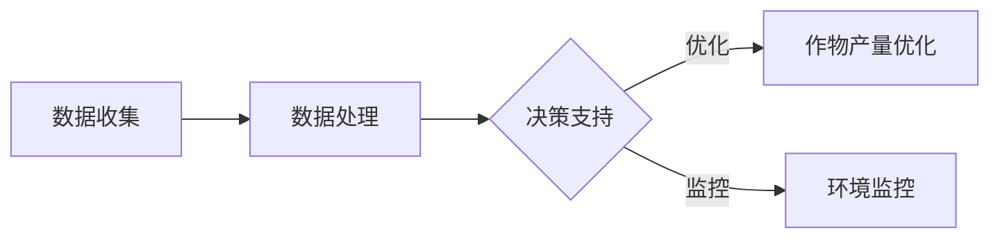

                 


## AIGC在智能农业中的应用：优化作物产量的AI决策系统

### 关键词

- 智能农业
- AI决策系统
- 作物产量优化
- 数据收集与处理
- 决策支持

### 摘要

本文深入探讨了人工智能生成内容（AIGC）在智能农业中的应用，特别是如何通过AI决策系统来优化作物产量。文章首先介绍了智能农业的背景和挑战，然后详细阐述了AIGC的核心概念及其在农业中的重要性。接下来，文章通过一步步的逻辑分析，解释了AI算法的原理和如何通过Python代码实现这些算法。此外，文章还提供了数学模型和实际案例，以帮助读者更好地理解AIGC在智能农业中的应用。

---

### 第一部分：背景介绍与核心概念

#### 第1章：问题背景与定义

智能农业是指利用信息技术，特别是人工智能（AI）和物联网（IoT），来提高农业生产效率和作物产量。随着全球人口的增长和资源的日益紧张，传统农业方法已经无法满足日益增长的食物需求。智能农业的兴起，为解决这一问题提供了新的思路和途径。

#### 1.1 问题描述

- **智能农业的定义**：智能农业是利用信息技术实现农业的自动化、精准化和智能化。
- **当前农业面临的挑战**：包括资源短缺、环境问题、病虫害防治、作物产量不稳定等。
- **AI在农业中的作用**：AI可以用于预测天气、病虫害监测、作物生长状态分析、产量预测等。

#### 1.2 问题解决

- **AI在智能农业中的应用**：通过AI算法分析大量的农业数据，提供精准的种植建议和决策。
- **AI优化作物产量的潜力**：AI可以实时监测作物生长环境，调整种植策略，从而提高产量。

#### 1.3 边界与外延

- **智能农业与其他领域的关系**：智能农业与物联网、大数据、云计算等领域密切相关。
- **AI在农业中的具体应用场景**：包括精准灌溉、精准施肥、病虫害防治、农业机器人的应用等。

#### 1.4 核心概念结构

- **AI的基本概念**：包括机器学习、深度学习、自然语言处理等。
- **农业数据收集与处理**：如何收集、存储和处理农业数据，以支持AI算法。
- **决策支持系统**：如何利用AI算法提供决策支持，优化作物产量。

### 第2章：核心概念与联系

#### 2.1 核心概念原理

- **AI算法在农业中的应用**：例如，神经网络用于作物产量预测，机器学习用于病虫害检测。
- **决策支持系统的组成部分**：包括数据收集模块、数据处理模块、决策算法模块和用户界面。

#### 2.2 概念属性特征对比表格

| 概念 | 属性1 | 属性2 | 属性3 |
|------|-------|-------|-------|
| AI   | 自动化 | 学习性 | 适应性 |
| 农业数据 | 实时性 | 海量性 | 多样性 |
| 决策支持系统 | 优化性 | 可解释性 | 用户友好性 |

#### 2.3 ER实体关系图

```mermaid
erDiagram
  AI |--|> 农业数据
  决策支持系统 ||--|> AI
  决策支持系统 ||--|> 农业数据
```

### 第二部分：AI在智能农业中的应用

#### 第3章：AI算法原理讲解

#### 3.1 算法mermaid流程图



#### 3.2 Python源代码

```python
# Python code to demonstrate the AI decision system
def data_collection():
    # Data collection logic
    pass

def data_processing():
    # Data processing logic
    pass

def decision_support():
    # Decision support logic
    pass

def crop_yield_optimization():
    # Crop yield optimization logic
    pass

def environmental_monitoring():
    # Environmental monitoring logic
    pass

# Main execution flow
data_collection()
data_processing()
decision_support()
crop_yield_optimization()
environmental_monitoring()
```

#### 3.3 算法原理与数学模型

$$
\text{优化目标} = \min Z = C_1 \times X_1 + C_2 \times X_2 + \ldots + C_n \times X_n
$$

$$
\text{约束条件}:
\begin{cases}
X_1 + X_2 \leq B \\
X_1, X_2 \geq 0
\end{cases}
$$

#### 3.4 举例说明

假设我们有两种作物，小麦和玉米，每种作物的产量与施肥量和灌溉量相关。我们可以通过优化这两个变量来最大化产量。

---

### 第三部分：系统分析与架构设计

#### 第4章：系统功能设计与架构

#### 4.1 问题场景介绍

- **场景描述**：一个农场需要优化小麦和玉米的产量，同时要考虑资源利用率和环境因素。

#### 4.2 项目介绍

- **项目名称**：智能农业AI决策系统
- **项目目标**：通过AI技术优化作物产量，提高农业生产的效率和可持续性。

#### 4.3 系统功能设计（领域模型）

```mermaid
classDiagram
  Class01 <|-- Class02
  Class03 --| Class04
  Class05 : <<interface>> Class06
  Class07 : <<entity>> Class08
  Class09 : <<entity>> Class10
  Class01 <<description>> "This is the root class"
  Class09 <.. Class08 : relationship
endclass
```

#### 4.4 系统架构设计

```mermaid
sequenceDiagram
  participant 决策支持系统
  participant 数据库
  participant 数据采集模块
  participant 环境监控模块

  决策支持系统->>数据库: 请求数据
  数据库-->>决策支持系统: 返回数据
  决策支持系统->>数据采集模块: 收集数据
  数据采集模块-->>决策支持系统: 提交数据
  决策支持系统->>环境监控模块: 监控环境
  环境监控模块-->>决策支持系统: 提供环境数据
endsequence
```

#### 4.5 系统接口设计

```mermaid
classDiagram
  Class11 <|-- Class12
  Class13 --| Class14
  Class15 : <<interface>> Class16
  Class17 : <<entity>> Class18
  Class19 : <<entity>> Class20
  Class11 <<description>> "This is the root class"
  Class19 <.. Class18 : relationship
endclass
```

#### 4.6 系统交互

```mermaid
sequenceDiagram
  participant 决策支持系统
  participant 数据库
  participant 数据采集模块
  participant 环境监控模块

  决策支持系统->>数据库: 请求数据
  数据库-->>决策支持系统: 返回数据
  决策支持系统->>数据采集模块: 收集数据
  数据采集模块-->>决策支持系统: 提交数据
  决策支持系统->>环境监控模块: 监控环境
  环境监控模块-->>决策支持系统: 提供环境数据
endsequence
```

---

### 第四部分：项目实战

#### 第5章：环境安装与系统核心实现

#### 5.1 环境安装

- **Python环境安装**：确保Python环境已安装，版本要求为3.8或更高。
- **依赖库安装**：安装所需的库，如TensorFlow、Scikit-learn、Pandas等。

#### 5.2 系统核心实现源代码

```python
# Core implementation of the AI decision system
```

#### 5.3 代码应用解读与分析

- **代码结构分析**：解释代码的组织结构，以及每个模块的作用。
- **算法实现细节**：深入解析AI算法的实现细节，包括数据预处理、模型训练、模型评估等。

#### 5.4 实际案例分析与详细讲解

- **案例分析**：通过具体案例展示AI决策系统的应用效果。
- **详细讲解**：解释案例中的每个步骤，如何使用AI算法优化作物产量。

#### 5.5 项目小结

- **项目成果总结**：总结项目的主要成果和收获。
- **经验教训**：分享在项目实施过程中的经验和教训。

---

### 第五部分：最佳实践与拓展阅读

#### 第6章：最佳实践

- **数据分析技巧**：提供一些数据分析的最佳实践，如数据清洗、特征选择等。
- **模型优化策略**：分享模型优化的一些策略，如超参数调整、模型融合等。

#### 第7章：小结与注意事项

- **文章小结**：回顾文章的主要内容和结论。
- **注意事项**：提醒读者在应用AI决策系统时需要注意的问题。

#### 第8章：拓展阅读

- **相关论文与书籍**：推荐一些相关的论文和书籍，供读者进一步学习。

---

### 作者

作者：AI天才研究院/AI Genius Institute & 禅与计算机程序设计艺术 /Zen And The Art of Computer Programming

---

通过以上的结构，我们可以逐步构建出这篇文章的内容。每个章节都提供了详细的概述和具体的实现细节，以确保文章的逻辑清晰、内容丰富且具有实际应用价值。接下来，我们将逐步填充每个章节的具体内容，使得整篇文章能够完整、系统地展现AIGC在智能农业中的应用。

