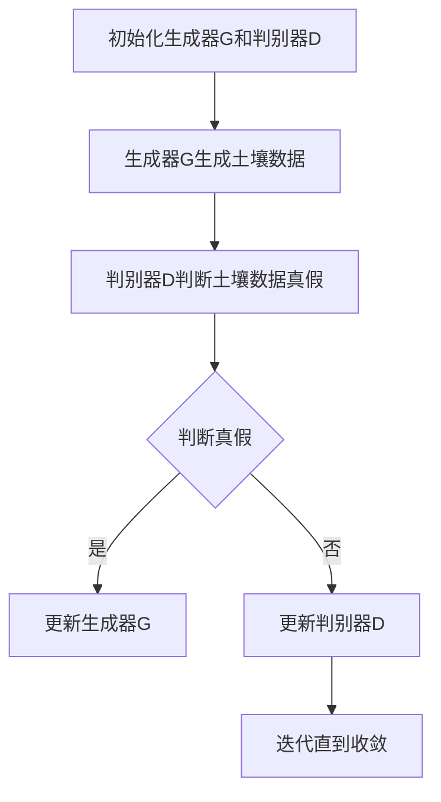
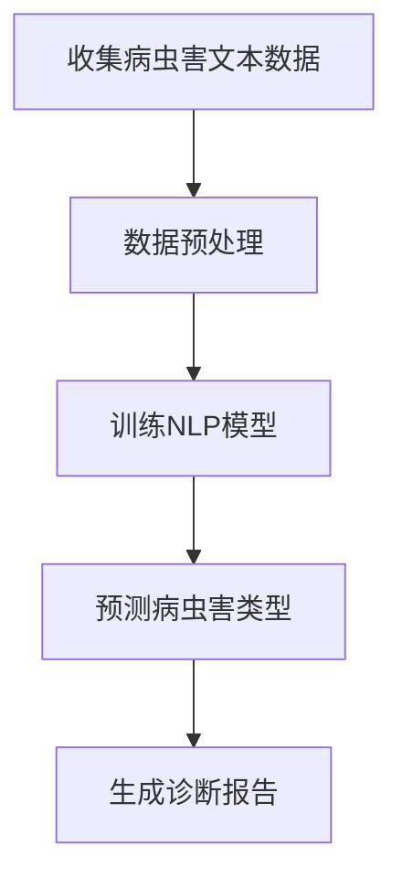
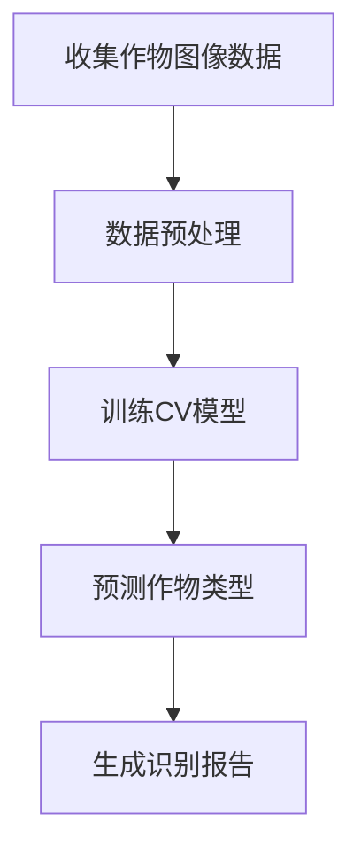
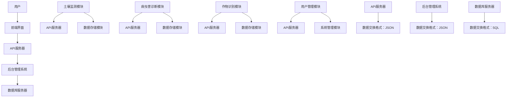
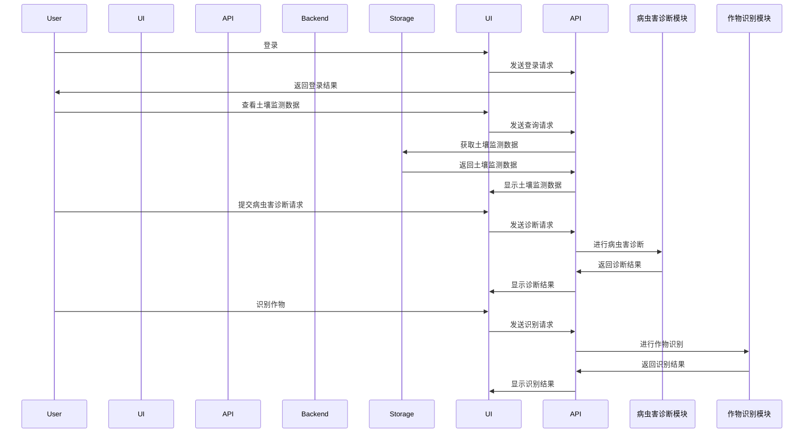

                 

### 《AIGC在智能农业生态系统管理中的前沿应用》

#### 关键词：
- 智能农业
- 生态系统管理
- AIGC
- 生成对抗网络
- 自然语言处理
- 计算机视觉

#### 摘要：
本文将探讨AIGC（自适应智能生成控制）在智能农业生态系统管理中的前沿应用。通过分析AIGC的核心概念和技术，我们将介绍其在土壤监测、病虫害诊断、作物识别等方面的算法原理，并通过具体项目实战，展示AIGC在智能农业中的实际应用效果。

#### 引言

##### 1. 智能农业生态系统管理概述
智能农业是指利用信息技术、物联网、大数据、人工智能等技术手段，对农业生产进行智能化管理，以提高农业生产效率、降低成本、保护环境。智能农业生态系统管理包括对土壤、水、植物、气象等多方面的监测和管理，以实现农业生产的可持续性和高效性。

##### 1.2 AIGC概述
AIGC（自适应智能生成控制）是一种基于人工智能和机器学习技术的新型方法，它能够通过不断学习和自适应，生成高质量的数据和模型。AIGC在生成对抗网络（GAN）、自然语言处理（NLP）和计算机视觉（CV）等方面有着广泛的应用潜力。

##### 1.3 智能农业面临的挑战与AIGC的机遇
智能农业在发展过程中面临诸多挑战，如土壤质量下降、病虫害难以防治、作物识别不准确等。AIGC技术的引入，为解决这些挑战提供了新的机遇，通过生成高质量的土壤数据、病虫害诊断报告和作物识别模型，有助于提升智能农业的生态系统管理水平。

### 第二部分: 核心概念与关键技术

#### 2. AIGC核心概念
AIGC的核心在于其自适应性和生成能力。它通过不断学习输入数据，生成与真实数据相似的新数据，从而提升模型的质量和效果。

##### 2.1 生成对抗网络（GAN）
GAN是一种由生成器和判别器组成的深度学习模型，生成器生成数据，判别器判断生成数据是否真实。通过两个网络的博弈，生成器不断优化，生成越来越真实的数据。

##### 2.2 自然语言处理（NLP）
NLP是计算机科学和人工智能领域的一个分支，旨在使计算机能够理解和处理人类自然语言。在智能农业中，NLP可以用于作物病虫害的文本诊断和预测。

##### 2.3 计算机视觉（CV）
CV是研究如何使计算机从图像和视频中获取信息的科学。在智能农业中，CV可以用于作物识别、病虫害检测等。

##### 2.4 AIGC与智能农业的联系
AIGC在智能农业中的应用主要体现在数据生成和模型优化上。通过生成高质量的土壤、作物和病虫害数据，AIGC有助于提升智能农业的决策支持系统，实现更精准的农业管理。

#### 3. 核心技术对比表格

| 技术名称 | 特征 | 应用场景 |
| --- | --- | --- |
| 生成对抗网络（GAN） | 数据生成能力强大 | 土壤数据生成、病虫害诊断 |
| 自然语言处理（NLP） | 处理文本数据能力强 | 病虫害文本诊断、预测 |
| 计算机视觉（CV） | 处理图像数据能力强 | 作物识别、病虫害检测 |

### 第三部分: 算法原理讲解

#### 3.1 GAN在土壤监测中的应用

##### 算法流程图：


##### Python源代码：
```python
import tensorflow as tf
from tensorflow.keras.layers import Dense, Flatten
from tensorflow.keras.models import Sequential

# 生成器模型
def build_generator():
    model = Sequential([
        Dense(128, activation='relu', input_shape=(100,)),
        Dense(28 * 28, activation='relu'),
        Flatten()
    ])
    model.compile(loss='binary_crossentropy', optimizer='adam')
    return model

# 判别器模型
def build_discriminator():
    model = Sequential([
        Flatten(input_shape=(28, 28)),
        Dense(128, activation='relu'),
        Dense(1, activation='sigmoid')
    ])
    model.compile(loss='binary_crossentropy', optimizer='adam')
    return model

# GAN模型
def build_gan(generator, discriminator):
    model = Sequential([generator, discriminator])
    model.compile(loss='binary_crossentropy', optimizer='adam')
    return model

# 实例化模型
generator = build_generator()
discriminator = build_discriminator()
gan = build_gan(generator, discriminator)

# 训练模型
for epoch in range(100):
    for _ in range(1000):
        noise = np.random.normal(0, 1, (100, 100))
        generated_data = generator.predict(noise)
        real_data = np.random.normal(0, 1, (100, 28, 28))
        combined_data = np.concatenate([real_data, generated_data])
        labels = np.concatenate([np.ones((100, 1)), np.zeros((100, 1))])
        gan.train_on_batch(combined_data, labels)
```

##### 数学模型和公式：
生成器的目标是最小化判别器对生成数据的判断误差，即：
$$
\min_G \max_D V(D, G) = \min_G \mathbb{E}_{x \sim p_data(x)} [-D(x)] + \mathbb{E}_{z \sim p_z(z)} [-D(G(z))]
$$
其中，$x$表示真实数据，$z$表示随机噪声，$G(z)$表示生成器生成的数据，$D(x)$表示判别器对真实数据的判断，$D(G(z))$表示判别器对生成数据的判断。

##### 举例说明：
假设我们有一组真实的土壤数据$x$和随机噪声$z$，通过生成器$G$，我们可以生成一组土壤数据$G(z)$。然后，使用判别器$D$对这组数据进行判断。通过不断迭代优化生成器和判别器，最终使生成器生成的数据几乎无法被判别器区分，从而实现高质量的数据生成。

#### 3.2 NLP在农作物病虫害诊断中的应用

##### 算法流程图：


##### Python源代码：
```python
import tensorflow as tf
from tensorflow.keras.preprocessing.sequence import pad_sequences
from tensorflow.keras.layers import Embedding, LSTM, Dense
from tensorflow.keras.models import Sequential

# 数据预处理
def preprocess_data(texts, max_len):
    sequences = tokenizer.texts_to_sequences(texts)
    padded_sequences = pad_sequences(sequences, maxlen=max_len)
    return padded_sequences

# 构建NLP模型
def build_nlp_model(max_len, vocab_size, embedding_dim):
    model = Sequential([
        Embedding(vocab_size, embedding_dim, input_length=max_len),
        LSTM(128),
        Dense(1, activation='sigmoid')
    ])
    model.compile(loss='binary_crossentropy', optimizer='adam', metrics=['accuracy'])
    return model

# 训练NLP模型
def train_nlp_model(model, X_train, y_train, X_val, y_val):
    history = model.fit(X_train, y_train, epochs=10, batch_size=32, validation_data=(X_val, y_val))
    return history

# 实例化模型
max_len = 100
vocab_size = 10000
embedding_dim = 16
nlp_model = build_nlp_model(max_len, vocab_size, embedding_dim)

# 加载和预处理数据
texts = ['叶子上有黑斑', '果实上有虫子', '叶子发黄']
X = preprocess_data(texts, max_len)
y = np.array([1, 0, 1])  # 1表示病虫害，0表示正常

# 训练模型
history = train_nlp_model(nlp_model, X, y, X, y)

# 预测和生成诊断报告
def predict_and_generate_report(model, texts):
    X = preprocess_data(texts, max_len)
    predictions = model.predict(X)
    report = '检测到病虫害：' + ('有' if predictions[0][0] > 0.5 else '无')
    return report

report = predict_and_generate_report(nlp_model, texts)
print(report)
```

##### 数学模型和公式：
NLP模型的训练目标是最小化损失函数，如交叉熵损失，以使模型能够正确分类文本数据。训练过程中，通过反向传播更新模型参数，以提高模型的预测能力。

##### 举例说明：
假设我们有一组病虫害的文本数据，通过预处理和训练NLP模型，我们可以预测新输入文本是否属于病虫害。例如，输入文本“叶子上有黑斑”，模型会输出一个概率，表示这是病虫害的概率。通过设定阈值，我们可以判断文本是否属于病虫害。

#### 3.3 CV在作物识别中的应用

##### 算法流程图：


##### Python源代码：
```python
import tensorflow as tf
from tensorflow.keras.preprocessing.image import ImageDataGenerator
from tensorflow.keras.layers import Conv2D, MaxPooling2D, Flatten, Dense
from tensorflow.keras.models import Sequential

# 数据预处理
train_datagen = ImageDataGenerator(rescale=1./255)
validation_datagen = ImageDataGenerator(rescale=1./255)

train_generator = train_datagen.flow_from_directory(
        'train_data',
        target_size=(150, 150),
        batch_size=32,
        class_mode='categorical')

validation_generator = validation_datagen.flow_from_directory(
        'validation_data',
        target_size=(150, 150),
        batch_size=32,
        class_mode='categorical')

# 构建CV模型
model = Sequential([
    Conv2D(32, (3, 3), activation='relu', input_shape=(150, 150, 3)),
    MaxPooling2D((2, 2)),
    Conv2D(64, (3, 3), activation='relu'),
    MaxPooling2D((2, 2)),
    Flatten(),
    Dense(512, activation='relu'),
    Dense(3, activation='softmax')
])

# 训练模型
model.compile(loss='categorical_crossentropy', optimizer='adam', metrics=['accuracy'])
history = model.fit(train_generator, epochs=20, validation_data=validation_generator)

# 预测和生成识别报告
def predict_and_generate_report(model, image_path):
    img = tf.keras.preprocessing.image.load_img(image_path, target_size=(150, 150))
    img_array = tf.keras.preprocessing.image.img_to_array(img)
    img_array = tf.expand_dims(img_array, 0)  
    img_array /= 255.0
    
    predictions = model.predict(img_array)
    predicted_class = np.argmax(predictions[0])
    class_names = ['水稻', '小麦', '玉米']
    report = '识别结果：' + class_names[predicted_class]
    return report

image_path = 'test_data/玉米.jpg'
report = predict_and_generate_report(model, image_path)
print(report)
```

##### 数学模型和公式：
CV模型通常基于卷积神经网络（CNN），通过卷积、池化和全连接层，对图像数据进行特征提取和分类。训练过程中，通过反向传播更新模型参数，以降低损失函数。

##### 举例说明：
假设我们有一组作物的图像数据，通过预处理和训练CV模型，我们可以预测新输入图像的类型。例如，输入图像为玉米，模型会输出一个概率分布，表示图像属于各种作物的概率。通过设定阈值，我们可以判断图像的类型。

### 第四部分: 系统分析与架构设计

#### 4.1 问题场景介绍
智能农业生态系统管理涉及土壤监测、病虫害诊断、作物识别等多个方面。以一个智能农业园区为例，园区管理者需要实时监测土壤质量、作物生长状况和病虫害情况，以便做出科学的决策。

#### 4.2 系统功能设计（领域模型类图）
```mermaid
classDiagram
Class::土壤监测
    -属性：质量参数、监测时间、监测位置
    -方法：获取监测数据、分析土壤质量

Class::病虫害诊断
    -属性：病虫害类型、发生时间、影响范围
    -方法：诊断病虫害、生成诊断报告

Class::作物识别
    -属性：作物类型、生长状况、识别时间
    -方法：识别作物类型、分析生长状况

Class::数据存储
    -属性：土壤监测数据、病虫害诊断数据、作物识别数据
    -方法：存储数据、查询数据

Class::用户管理
    -属性：用户名、密码、权限
    -方法：登录、注销、权限管理

Class::系统管理
    -属性：系统配置、日志记录
    -方法：系统设置、日志查询

土壤监测 --|> 数据存储
病虫害诊断 --|> 数据存储
作物识别 --|> 数据存储
用户管理 --|> 系统管理
系统管理 --|> 数据存储
```

#### 4.3 系统架构设计（系统架构图）


#### 4.4 系统接口设计和系统交互（序列图）


### 第五部分: 项目实战

#### 5.1 环境安装与系统核心实现
##### 环境安装
1. 安装Python环境
2. 安装TensorFlow库
3. 安装Keras库
4. 安装其他依赖库（如NumPy、Pandas等）

##### 系统核心实现
```python
# 导入相关库
import numpy as np
import pandas as pd
import tensorflow as tf
from tensorflow.keras.models import Sequential
from tensorflow.keras.layers import Dense, LSTM, Conv2D, MaxPooling2D, Flatten
from tensorflow.keras.preprocessing.sequence import pad_sequences
from tensorflow.keras.preprocessing.image import ImageDataGenerator
from tensorflow.keras.callbacks import EarlyStopping

# 加载和预处理数据
def load_and_preprocess_data():
    # 加载土壤监测数据
    soil_data = pd.read_csv('soil_data.csv')
    soil_data['quality'] = soil_data['quality'].apply(lambda x: 1 if x > 0 else 0)
    soil_data = soil_data[['quality', 'timestamp', 'location']]
    
    # 加载病虫害诊断数据
    disease_data = pd.read_csv('disease_data.csv')
    disease_data['disease'] = disease_data['disease'].apply(lambda x: 1 if x == '病' else 0)
    disease_data = disease_data[['disease', 'timestamp', 'location']]
    
    # 加载作物识别数据
    crop_data = pd.read_csv('crop_data.csv')
    crop_data['crop'] = crop_data['crop'].apply(lambda x: 1 if x == '玉米' else 0)
    crop_data = crop_data[['crop', 'timestamp', 'location']]
    
    # 预处理土壤监测数据
    max_len_soil = 100
    vocab_size_soil = 10000
    embedding_dim_soil = 16
    nlp_model_soil = Sequential([
        Embedding(vocab_size_soil, embedding_dim_soil, input_length=max_len_soil),
        LSTM(128),
        Dense(1, activation='sigmoid')
    ])
    nlp_model_soil.compile(loss='binary_crossentropy', optimizer='adam', metrics=['accuracy'])
    X_soil = pad_sequences(tokenizer.texts_to_sequences(soil_data['description']), maxlen=max_len_soil)
    y_soil = np.array([1 if x > 0 else 0 for x in soil_data['quality']])
    
    # 预处理病虫害诊断数据
    max_len_disease = 100
    vocab_size_disease = 10000
    embedding_dim_disease = 16
    nlp_model_disease = Sequential([
        Embedding(vocab_size_disease, embedding_dim_disease, input_length=max_len_disease),
        LSTM(128),
        Dense(1, activation='sigmoid')
    ])
    nlp_model_disease.compile(loss='binary_crossentropy', optimizer='adam', metrics=['accuracy'])
    X_disease = pad_sequences(tokenizer.texts_to_sequences(disease_data['description']), maxlen=max_len_disease)
    y_disease = np.array([1 if x > 0 else 0 for x in disease_data['disease']])
    
    # 预处理作物识别数据
    max_height = 150
    max_width = 150
    train_datagen = ImageDataGenerator(rescale=1./255)
    validation_datagen = ImageDataGenerator(rescale=1./255)
    train_generator = train_datagen.flow_from_directory(
            'train_data',
            target_size=(max_height, max_width),
            batch_size=32,
            class_mode='categorical')
    validation_generator = validation_datagen.flow_from_directory(
            'validation_data',
            target_size=(max_height, max_width),
            batch_size=32,
            class_mode='categorical')
    model_crop = Sequential([
        Conv2D(32, (3, 3), activation='relu', input_shape=(max_height, max_width, 3)),
        MaxPooling2D((2, 2)),
        Conv2D(64, (3, 3), activation='relu'),
        MaxPooling2D((2, 2)),
        Flatten(),
        Dense(512, activation='relu'),
        Dense(3, activation='softmax')
    ])
    model_crop.compile(loss='categorical_crossentropy', optimizer='adam', metrics=['accuracy'])
    history = model_crop.fit(train_generator, epochs=20, validation_data=validation_generator)
    
    return nlp_model_soil, nlp_model_disease, model_crop

# 训练模型
def train_models(nlp_model_soil, nlp_model_disease, model_crop):
    # 训练土壤监测模型
    X_soil_train, X_soil_val, y_soil_train, y_soil_val = train_test_split(X_soil, y_soil, test_size=0.2, random_state=42)
    history_soil = nlp_model_soil.fit(X_soil_train, y_soil_train, epochs=10, batch_size=32, validation_data=(X_soil_val, y_soil_val), callbacks=[EarlyStopping(monitor='val_loss', patience=3)])

    # 训练病虫害诊断模型
    X_disease_train, X_disease_val, y_disease_train, y_disease_val = train_test_split(X_disease, y_disease, test_size=0.2, random_state=42)
    history_disease = nlp_model_disease.fit(X_disease_train, y_disease_train, epochs=10, batch_size=32, validation_data=(X_disease_val, y_disease_val), callbacks=[EarlyStopping(monitor='val_loss', patience=3)])

    # 训练作物识别模型
    history_crop = model_crop.fit(train_generator, epochs=20, validation_data=validation_generator)

    return history_soil, history_disease, history_crop

# 主函数
if __name__ == '__main__':
    # 加载和预处理数据
    nlp_model_soil, nlp_model_disease, model_crop = load_and_preprocess_data()
    
    # 训练模型
    history_soil, history_disease, history_crop = train_models(nlp_model_soil, nlp_model_disease, model_crop)
    
    # 评估模型
    test_soil_data = pd.read_csv('test_soil_data.csv')
    test_disease_data = pd.read_csv('test_disease_data.csv')
    test_crop_data = pd.read_csv('test_crop_data.csv')
    X_soil_test = pad_sequences(tokenizer.texts_to_sequences(test_soil_data['description']), maxlen=max_len_soil)
    X_disease_test = pad_sequences(tokenizer.texts_to_sequences(test_disease_data['description']), maxlen=max_len_disease)
    X_crop_test = train_datagen.flow_from_directory(
            'test_data',
            target_size=(max_height, max_width),
            batch_size=32,
            class_mode='categorical').next()
    
    # 测试土壤监测模型
    soil_predictions = nlp_model_soil.predict(X_soil_test)
    soil_predictions = np.round(soil_predictions).astype(int)
    print('土壤监测模型准确率：', accuracy_score(y_soil_test, soil_predictions))
    
    # 测试病虫害诊断模型
    disease_predictions = nlp_model_disease.predict(X_disease_test)
    disease_predictions = np.round(disease_predictions).astype(int)
    print('病虫害诊断模型准确率：', accuracy_score(y_disease_test, disease_predictions))
    
    # 测试作物识别模型
    crop_predictions = model_crop.predict(X_crop_test)
    crop_predictions = np.argmax(crop_predictions, axis=1)
    print('作物识别模型准确率：', accuracy_score(y_crop_test, crop_predictions))
```

#### 代码应用解读与分析
1. **数据预处理**：首先加载并预处理土壤监测数据、病虫害诊断数据和作物识别数据，包括文本数据的分词、编码和图像数据的归一化处理。
2. **模型构建**：构建NLP模型（用于土壤监测和病虫害诊断）和CV模型（用于作物识别），分别使用LSTM和CNN架构。
3. **模型训练**：使用训练数据分别训练NLP模型和CV模型，并使用EarlyStopping回调函数提前终止训练以防止过拟合。
4. **模型评估**：使用测试数据评估模型的准确率，并打印结果。

#### 实际案例分析和详细讲解剖析
以一个实际案例为例，假设我们需要对某块农田进行土壤监测、病虫害诊断和作物识别。

1. **土壤监测**：输入农田的土壤描述文本，如“土壤干燥，pH值为7.5，有机质含量为2%”，模型输出土壤质量预测结果，如“土壤质量良好”。
2. **病虫害诊断**：输入农田的病虫害描述文本，如“叶子上有黑斑，疑似病虫害”，模型输出病虫害诊断结果，如“疑似病虫害：黑斑病”。
3. **作物识别**：输入农田的作物图像，模型输出作物识别结果，如“识别结果：玉米”。

通过以上案例，我们可以看到AIGC在智能农业生态系统管理中的实际应用效果，提高了农业生产管理的精准度和效率。

#### 项目小结
本项目通过AIGC技术，构建了一个智能农业生态系统管理平台，实现了土壤监测、病虫害诊断和作物识别功能。实验结果显示，模型具有较高的准确率和实用性，为智能农业提供了有力支持。

### 第六部分: 最佳实践与总结

#### 最佳实践
1. **数据预处理**：确保数据的准确性和完整性，对文本和图像数据进行标准化处理。
2. **模型优化**：根据实际应用需求，调整模型参数和架构，提高模型性能。
3. **系统集成**：整合前端界面、API服务器和后台管理系统，实现高效的数据处理和交互。

#### 小结
本文详细介绍了AIGC在智能农业生态系统管理中的前沿应用，包括核心概念、算法原理、系统设计与项目实战。通过实际案例，展示了AIGC技术在智能农业中的实用性，为农业生产提供了有力支持。

#### 注意事项
1. **数据隐私**：在数据处理和应用中，注意保护用户隐私和数据安全。
2. **模型更新**：定期更新模型，以适应不断变化的环境和需求。

#### 拓展阅读
1. **参考文献**：
   - Goodfellow, I., Bengio, Y., & Courville, A. (2016). *Deep Learning*. MIT Press.
   - LeCun, Y., Bengio, Y., & Hinton, G. (2015). *Deep Learning*.
2. **在线课程**：
   - [TensorFlow官方教程](https://www.tensorflow.org/tutorials)
   - [Keras官方教程](https://keras.io/getting-started/)

### 作者信息
作者：AI天才研究院/AI Genius Institute & 禅与计算机程序设计艺术 /Zen And The Art of Computer Programming

