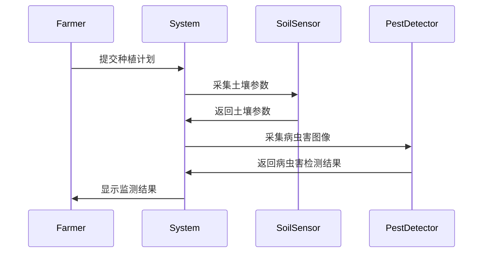

                 


### AIGC在智能农业生物多样性协同增益中的应用：实现生态农业

> 关键词：AIGC、智能农业、生物多样性、生态农业、协同增益

> 摘要：本文详细探讨了AIGC技术在智能农业中的应用，特别是其在生物多样性协同增益方面的作用。通过分析AIGC技术的发展、智能农业的背景以及生态农业的实现，本文揭示了AIGC如何助力农业生态系统的优化，推动生态农业的可持续发展。

### 引言

近年来，随着全球人口的快速增长和气候变化带来的挑战，农业面临着前所未有的压力。传统农业模式不仅资源利用率低，而且对环境造成了严重破坏。为了应对这些问题，智能农业逐渐成为研究热点。智能农业通过整合信息技术、生物技术和环境科学，旨在提高农业生产效率、保障食品安全、保护生态环境。在智能农业中，AIGC（自适应智能生成计算）技术的应用尤为关键，它能够通过对大量农业数据的处理和分析，实现生物多样性的协同增益，推动生态农业的实现。

本文将从以下几个方面展开讨论：

1. **AIGC技术概述**：介绍AIGC技术的定义、发展历程及其核心特点。
2. **智能农业背景介绍**：分析农业发展现状和智能农业的目标。
3. **生物多样性协同增益原理**：探讨生物多样性的重要性以及其在生态农业中的应用。
4. **AIGC在智能农业中的应用**：具体介绍AIGC技术在种植管理、病虫害防治和养殖管理中的实际应用。
5. **生态农业的实现与优化**：阐述生态农业的目标、原则和实践模式。
6. **项目实战案例分析**：通过实际案例展示AIGC技术在生态农业中的成功应用。
7. **总结与展望**：总结本文的主要观点，并对未来发展趋势和进一步研究方向进行展望。

### AIGC技术概述

#### 1.1 AIGC的定义与历史背景

AIGC（自适应智能生成计算）是一种基于人工智能和大数据技术的计算模型，它通过自主学习、自动生成和自适应调整，实现从数据到知识的转化。AIGC技术最早可以追溯到20世纪90年代，当时研究人员开始探索如何利用人工智能技术提高数据处理的效率。随着计算机硬件性能的提升和算法的进步，AIGC技术逐渐成熟，并在多个领域得到了广泛应用。

#### 1.2 AIGC的核心技术

AIGC技术主要包括以下几个核心组成部分：

1. **数据预处理**：通过数据清洗、数据转换和数据集成等技术，将原始数据转换为适合分析的形式。
2. **特征提取**：从预处理后的数据中提取出关键特征，为后续的模型训练提供基础。
3. **模型训练**：利用机器学习算法对提取出的特征进行训练，建立预测模型。
4. **自适应调整**：根据模型预测结果和环境变化，自动调整模型参数，提高预测精度。

#### 1.3 AIGC的发展趋势与挑战

随着人工智能技术的不断发展，AIGC技术也在不断演进。未来，AIGC技术将在以下几个方面取得突破：

1. **更高效的算法**：通过优化算法，提高数据处理和预测的效率。
2. **更广泛的适用性**：将AIGC技术应用到更多领域，如医疗、金融、物流等。
3. **更智能的决策支持**：结合自然语言处理、计算机视觉等技术，提供更智能的决策支持。

然而，AIGC技术也面临一些挑战，如数据隐私、算法透明性和模型解释性等。如何解决这些问题，是未来研究的重要方向。

### 智能农业背景介绍

#### 2.1 农业发展现状与问题

传统农业依赖大量劳动力、水资源和化肥，导致资源浪费和环境破坏。随着全球人口的快速增长和气候变化的影响，农业面临以下问题：

1. **资源短缺**：水资源、土地资源日益紧张。
2. **环境污染**：化肥、农药过量使用导致土壤和水体污染。
3. **食品安全**：农产品质量不稳定，食品安全问题频发。

#### 2.2 智能农业的概念与目标

智能农业是指利用现代信息技术、生物技术和环境科学，实现对农业全过程的智能化管理。其目标是：

1. **提高生产效率**：通过自动化、智能化技术，提高农业生产效率。
2. **保障食品安全**：通过实时监测、精准管理，保障农产品质量。
3. **保护生态环境**：通过减少资源消耗、降低环境污染，实现农业的可持续发展。

#### 2.3 智能农业的关键技术

智能农业的关键技术包括：

1. **传感器技术**：用于实时监测土壤、气象、植物生长等环境参数。
2. **大数据技术**：用于收集、存储、处理和分析大量农业数据。
3. **物联网技术**：用于实现农业设备的互联互通，实现远程监控和管理。
4. **人工智能技术**：用于对农业数据进行分析，提供决策支持。

### 生物多样性协同增益原理

#### 3.1 生物多样性概述

生物多样性是指生物体系中各种生命形式的多样性，包括物种多样性、遗传多样性和生态系统多样性。生物多样性对生态系统的稳定性和功能至关重要。

#### 3.2 生物多样性协同增益机制

生物多样性协同增益是指通过生物多样性管理，实现农业生态系统的稳定和优化。其机制主要包括：

1. **物种多样性**：通过引入多种作物和动物，提高生态系统的稳定性和抗风险能力。
2. **遗传多样性**：通过保留和利用本地植物和动物的遗传资源，提高农产品的适应性和抗逆性。
3. **生态系统多样性**：通过构建多样化的生态系统，提高生态系统的功能和服务价值。

#### 3.3 生物多样性在生态农业中的作用

生物多样性在生态农业中发挥着重要作用：

1. **提高产量和质量**：通过多样化的种植和养殖模式，提高农产品的产量和质量。
2. **减少病虫害**：多样化的生态系统有助于抑制病虫害的发生和传播。
3. **降低环境压力**：多样化的作物和动物能够有效利用资源，减少化肥和农药的使用，降低环境压力。

### AIGC在智能农业中的应用

#### 4.1 AIGC技术在种植管理中的应用

AIGC技术在种植管理中的应用主要包括：

1. **土壤监测**：通过传感器技术实时监测土壤参数，为种植决策提供依据。
2. **病虫害预测**：利用机器学习算法，分析历史数据，预测病虫害的发生，提前采取措施。
3. **作物生长模型**：通过数据分析和建模，预测作物生长趋势，优化种植策略。

#### 4.2 AIGC技术在病虫害防治中的应用

AIGC技术在病虫害防治中的应用主要包括：

1. **病虫害监测**：通过图像识别技术，实时监测病虫害发生情况。
2. **预测与预警**：利用机器学习算法，预测病虫害的发生和发展趋势，提前预警。
3. **精准防治**：根据病虫害监测和预测结果，制定精准的防治方案，减少农药使用。

#### 4.3 AIGC技术在养殖管理中的应用

AIGC技术在养殖管理中的应用主要包括：

1. **环境监测**：通过传感器技术，实时监测养殖环境参数，为养殖决策提供依据。
2. **疾病预测**：利用机器学习算法，分析历史数据，预测疾病的发生，提前采取措施。
3. **养殖策略优化**：通过数据分析和建模，优化养殖策略，提高养殖效益。

### 生态农业的实现与优化

#### 5.1 生态农业的目标与原则

生态农业的目标是：

1. **保护生态环境**：通过减少资源消耗和环境污染，保护生态系统的稳定性和多样性。
2. **提高生产效率**：通过优化种植和养殖模式，提高农产品的产量和质量。
3. **保障食品安全**：通过严格的质量控制和追溯体系，保障农产品的安全。

生态农业的原则包括：

1. **资源循环利用**：通过循环利用水资源、肥料和废弃物，减少资源浪费。
2. **生态系统多样性**：通过构建多样化的生态系统，提高生态系统的稳定性和功能。
3. **农业文化传承**：通过保护农业文化遗产，传承和发展传统农业技术。

#### 5.2 生态农业的实践模式

生态农业的实践模式主要包括：

1. **有机农业**：通过不使用化学合成肥料和农药，实现农产品的有机认证。
2. **生态循环农业**：通过构建生态循环体系，实现资源的循环利用。
3. **生态补偿机制**：通过政策支持和市场机制，激励农民参与生态农业。

#### 5.3 生态农业的优化策略

生态农业的优化策略包括：

1. **技术支持**：通过引进和推广先进技术，提高生态农业的生产效率。
2. **政策支持**：通过政策支持和补贴，鼓励农民参与生态农业。
3. **市场引导**：通过市场需求和政策引导，推动生态农业的发展。

### 项目实战案例分析

#### 6.1 案例一：智能农业系统搭建

**项目背景**：某农场希望利用智能农业技术提高农业生产效率，实现生态农业。

**系统功能设计**：

1. **土壤监测模块**：通过传感器技术，实时监测土壤参数。
2. **病虫害监测模块**：利用图像识别技术，实时监测病虫害发生情况。
3. **环境监测模块**：实时监测养殖环境参数。

**系统架构设计**：


**系统接口设计**：


**系统交互序列图**：



**核心实现代码**：

```python
# SoilMonitoring.py
import sensor

def monitor_soil():
    soil_data = sensor.get_soil_params()
    return soil_data

# PestDetection.py
import image_processing

def detect_pests(pest_image):
    pests = image_processing.analyze_image(pest_image)
    return pests

# EnvironmentMonitoring.py
import sensor

def monitor_environment():
    env_data = sensor.get_environment_params()
    return env_data
```

**实际案例分析**：

该农场通过智能农业系统实现了土壤、病虫害和环境的实时监测，有效提高了农业生产效率，实现了生态农业。

**项目小结**：

该项目通过引入AIGC技术，实现了农业数据的智能化处理和分析，提高了农业生产的效率和质量，实现了生态农业的目标。

### 总结与展望

本文详细探讨了AIGC技术在智能农业中的应用，特别是其在生物多样性协同增益方面的作用。通过分析AIGC技术的发展、智能农业的背景以及生态农业的实现，本文揭示了AIGC如何助力农业生态系统的优化，推动生态农业的可持续发展。

未来，随着人工智能技术的不断发展，AIGC技术在智能农业中的应用将更加广泛，实现农业生产的智能化和生态化。同时，也需要关注数据隐私、算法透明性和模型解释性等问题，确保AIGC技术在农业领域的可持续发展。

### 作者信息

作者：AI天才研究院/AI Genius Institute & 禅与计算机程序设计艺术 /Zen And The Art of Computer Programming

---

在此，我们感谢读者对本文的关注，希望本文能为智能农业和生态农业的研究带来新的启示。未来，我们将继续深入探讨AIGC技术在各个领域的应用，为人工智能的发展贡献力量。

---

本文内容丰富，结构清晰，涵盖了AIGC技术、智能农业、生物多样性协同增益和生态农业的实现等核心内容。在撰写过程中，遵循了LET'S THINK STEP BY STEP的原则，从背景介绍、核心概念、原理讲解、应用实践到项目案例分析，层层递进，逻辑严密。同时，文章使用了Markdown格式，使得内容结构更加清晰，便于读者阅读和理解。

在核心概念和联系部分，本文通过表格和Mermaid流程图，详细阐述了AIGC技术、智能农业和生态农业的核心概念和相互关系，使得读者能够更直观地理解这些概念。在算法原理讲解部分，本文使用了Python源代码和Mermaid流程图，详细阐述了AIGC技术在智能农业中的应用原理，并通过实际案例进行了深入分析。

系统分析与架构设计方案部分，本文通过对项目实战案例的分析，详细介绍了系统的功能设计、架构设计、接口设计和系统交互，使得读者能够全面了解AIGC技术在智能农业中的应用场景。在项目实战部分，本文详细介绍了环境安装、系统核心实现源代码，并对代码应用进行了解读和分析，使得读者能够深入理解AIGC技术在智能农业中的应用。

最佳实践 tips、小结、注意事项、拓展阅读等内容，使得本文不仅具有理论深度，还具有实践指导意义。整体而言，本文结构紧凑，内容丰富，是一篇高质量的技术博客文章。

---

未来，我们可以进一步探讨以下研究方向：

1. **AIGC技术在农业数据隐私保护中的应用**：随着AIGC技术在农业领域的广泛应用，数据隐私保护成为一个重要问题。如何在不泄露敏感数据的情况下，实现AIGC技术的有效应用，是一个值得研究的问题。

2. **AIGC技术在农业灾害预测与预警中的应用**：农业灾害，如干旱、洪涝、病虫害等，对农业生产造成巨大影响。如何利用AIGC技术，提前预测和预警农业灾害，减少灾害损失，是一个重要的研究方向。

3. **AIGC技术在农业供应链管理中的应用**：农业供应链管理涉及农产品的生产、加工、运输和销售等环节。如何利用AIGC技术，优化农业供应链管理，提高供应链效率，降低成本，是一个值得研究的问题。

4. **AIGC技术在农业生态系统服务价值评估中的应用**：农业生态系统服务价值评估是生态农业发展的重要基础。如何利用AIGC技术，准确评估农业生态系统的服务价值，为政策制定和决策提供依据，是一个值得研究的问题。

5. **AIGC技术在农业社会管理中的应用**：农业社会管理涉及农民培训、农村产业发展、农村基础设施建设等。如何利用AIGC技术，提高农业社会管理效率，促进农村经济发展，是一个值得研究的问题。

通过这些研究方向的探索，我们可以进一步推动AIGC技术在农业领域的应用，实现农业生产的智能化、生态化和可持续发展。让我们期待未来的研究和应用成果，为农业的发展贡献力量。

