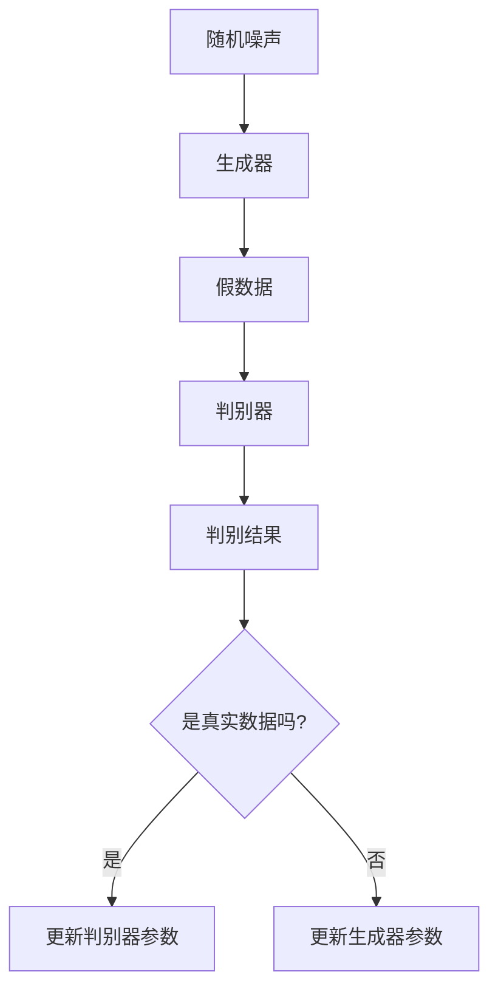
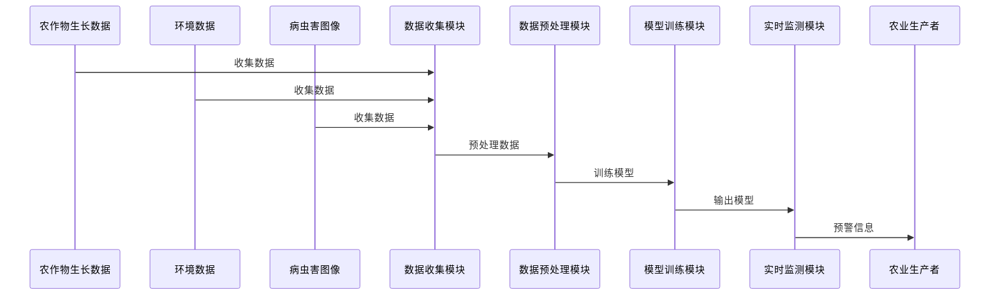

                 


## 1.1 问题背景

### 1.1.1 AIGC技术概述

AIGC（Artificial Intelligence Generated Content）是人工智能技术生成内容的一种形式，它利用深度学习和自然语言处理技术，可以自动生成高质量、多样化的内容。AIGC技术在广告营销、新闻媒体、游戏开发等多个领域都有广泛应用，大大提高了内容创作的效率和效果。

### 1.1.2 智能农业的重要性

智能农业是利用信息技术、物联网、大数据等现代科技手段，实现农业生产自动化、智能化、精准化。智能农业可以显著提高农业生产效率，降低生产成本，减少资源浪费，保障粮食安全。随着全球人口的不断增长和气候变化的影响，智能农业的重要性日益凸显。

### 1.1.3 病虫害早期预警在粮食安全中的作用

病虫害是农业生产中的一大难题，它们可以导致农作物减产、品质下降，甚至绝收。传统的病虫害防治方法往往具有滞后性，无法在病虫害发生初期进行有效控制。而病虫害早期预警可以通过实时监测、数据分析等技术手段，提前发现病虫害的发生，及时采取防治措施，减少损失，保障粮食安全。

## 1.2 核心概念与联系

### 1.2.1 AIGC的核心概念

AIGC包括生成对抗网络（GAN）、变分自编码器（VAE）等多种算法，它们可以在大规模数据集上自动学习并生成高质量的内容。

### 1.2.2 智能农业与病虫害早期预警的联系

智能农业中的病虫害早期预警需要利用AIGC技术来处理大量的农业数据，例如气象数据、土壤数据、作物生长数据等，通过对这些数据进行深度学习分析，可以实现对病虫害的早期识别和预警。

### 1.2.3 病虫害早期预警的需求分析

病虫害的早期预警需要实时监测农作物的生长状态和周边环境，通过数据分析找出病虫害发生的规律和趋势，以便提前采取措施。AIGC技术可以在这一过程中发挥重要作用，提高预警的准确性和及时性。

## 1.3 AIGC在病虫害早期预警中的应用前景

随着AIGC技术的不断发展，它在病虫害早期预警中的应用前景十分广阔。通过AIGC技术，可以实现以下应用：

- **实时监测与预警**：利用AIGC技术对农作物生长数据和环境数据进行分析，实时监测病虫害的发生情况，及时发出预警信息。
- **精准防治**：根据AIGC分析出的病虫害发展趋势，制定精准的防治方案，减少农药使用，降低环境污染。
- **智能决策支持**：AIGC技术可以辅助农业生产者做出更科学的决策，提高农业生产效率。

## 1.4 小结

本节内容介绍了AIGC和智能农业病虫害早期预警的概念，分析了它们之间的联系，并探讨了AIGC在病虫害早期预警中的应用前景。接下来，我们将进一步探讨AIGC算法原理和其在病虫害早期预警中的应用实践。让我们一步一步深入分析。

----------------------------------------------------------------

### 1.2 算法原理讲解

#### 1.2.1 GAN算法原理

生成对抗网络（GAN）是由Goodfellow等人于2014年提出的，其核心思想是通过两个神经网络的对抗训练来生成数据。这两个网络分别是生成器（Generator）和判别器（Discriminator）。

- **生成器（Generator）**：生成器网络的任务是生成看起来像真实数据的假数据。它接收随机噪声作为输入，通过一系列的神经网络层生成假数据。
- **判别器（Discriminator）**：判别器网络的任务是区分输入数据是真实数据还是生成器生成的假数据。它接收真实数据和生成器生成的假数据作为输入，并通过一系列的神经网络层输出一个概率值，表示输入数据的真实性。

在训练过程中，生成器和判别器不断地进行对抗。生成器的目标是生成尽可能逼真的假数据，而判别器的目标是提高对真实数据和假数据的区分能力。这种对抗训练使得生成器逐渐提高生成假数据的能力，同时判别器逐渐提高对真实数据的识别能力。

#### 1.2.2 VAE算法原理

变分自编码器（VAE）是另一种常用于生成模型的算法，其核心思想是通过对数据的编码和解码过程来学习数据的概率分布。

- **编码器（Encoder）**：编码器网络的任务是将输入数据映射到一个潜在空间中的表示。它通过一系列的神经网络层将输入数据编码成一个潜在变量，这个潜在变量可以看作是数据的概率分布参数。
- **解码器（Decoder）**：解码器网络的任务是将潜在空间中的表示解码回原始数据。它通过一系列的神经网络层将潜在变量解码回原始数据。

VAE通过最大化数据生成模型的对数似然函数来训练。在训练过程中，编码器学习如何将数据映射到潜在空间中的表示，而解码器学习如何从潜在空间中的表示重构原始数据。

#### 1.2.3 病虫害图像识别算法

在病虫害早期预警中，图像识别是关键步骤。AIGC技术可以通过GAN和VAE算法对病虫害图像进行识别。

- **数据预处理**：首先对收集到的病虫害图像进行预处理，包括图像缩放、裁剪、灰度转换等，以便于后续的模型训练。
- **模型训练**：利用GAN或VAE算法训练图像识别模型。生成器网络负责生成病虫害图像的假样本，判别器网络负责区分真实样本和假样本。在VAE中，编码器网络负责将图像编码到潜在空间，解码器网络负责将潜在空间中的表示解码回图像。
- **图像识别**：在模型训练完成后，使用训练好的模型对新的病虫害图像进行识别，判断其是否为病虫害图像。

#### 1.2.4 算法流程图

为了更直观地理解算法原理，下面使用mermaid绘制一个简单的GAN算法流程图：



#### 1.2.5 Python代码示例

以下是一个简单的GAN算法的Python代码示例：

```python
import tensorflow as tf
from tensorflow.keras.layers import Dense, Flatten
from tensorflow.keras.models import Sequential

# 生成器模型
def build_generator():
    model = Sequential()
    model.add(Dense(128, input_dim=100, activation='relu'))
    model.add(Dense(28 * 28, activation='sigmoid'))
    model.add(Reshape((28, 28)))
    return model

# 判别器模型
def build_discriminator():
    model = Sequential()
    model.add(Flatten(input_shape=(28, 28)))
    model.add(Dense(128, activation='relu'))
    model.add(Dense(1, activation='sigmoid'))
    return model

# 编码器模型
def build_encoder():
    model = Sequential()
    model.add(Flatten(input_shape=(28, 28)))
    model.add(Dense(128, activation='relu'))
    model.add(Dense(16, activation='relu'))
    return model

# 解码器模型
def build_decoder():
    model = Sequential()
    model.add(Dense(128, activation='relu'))
    model.add(Dense(28 * 28, activation='sigmoid'))
    model.add(Reshape((28, 28)))
    return model

# 构建GAN模型
def build_gan(generator, discriminator, encoder, decoder):
    model = Sequential()
    model.add(generator)
    model.add(discriminator)
    return model

# 模型编译和训练
# ...

```

#### 1.2.6 LaTeX公式解释

在算法原理讲解中，我们使用LaTeX格式给出了GAN算法的主要数学模型：

$$
x_{real} \xrightarrow{D} D(x_{real}) \rightarrow [1]
$$

$$
z_{noise} \xrightarrow{G} x_{fake} \xrightarrow{D} D(x_{fake}) \rightarrow [0.5]
$$

其中，$x_{real}$表示真实数据，$x_{fake}$表示生成器生成的假数据，$z_{noise}$表示随机噪声，$D(x)$表示判别器对数据的判断结果。

## 1.3 系统设计与实现

### 1.3.1 问题场景介绍

在智能农业病虫害早期预警系统中，我们面临以下问题场景：

- **数据来源**：收集农作物生长数据、环境数据、病虫害图像等。
- **数据处理**：对收集到的数据进行预处理，包括数据清洗、特征提取等。
- **模型训练**：利用AIGC算法训练图像识别模型。
- **实时监测**：对实时采集的病虫害图像进行识别，判断是否为病虫害。

### 1.3.2 系统功能设计

系统功能设计主要包括以下模块：

- **数据收集模块**：负责收集农作物生长数据、环境数据、病虫害图像等。
- **数据预处理模块**：负责对收集到的数据进行预处理，包括数据清洗、特征提取等。
- **模型训练模块**：负责利用AIGC算法训练图像识别模型。
- **实时监测模块**：负责对实时采集的病虫害图像进行识别，判断是否为病虫害。

### 1.3.3 系统架构设计

系统架构设计主要包括以下部分：

- **数据层**：存储农作物生长数据、环境数据、病虫害图像等。
- **服务层**：包括数据收集模块、数据预处理模块、模型训练模块和实时监测模块。
- **应用层**：为农业生产者提供病虫害预警服务。

### 1.3.4 系统接口设计

系统接口设计主要包括以下接口：

- **数据接口**：用于数据收集模块与数据预处理模块之间的数据传输。
- **服务接口**：用于模型训练模块与实时监测模块之间的交互。
- **用户接口**：用于农业生产者与系统之间的交互。

### 1.3.5 系统交互序列图

为了更直观地展示系统架构和交互过程，下面使用mermaid绘制一个简单的系统交互序列图：



## 1.4 项目实战

### 1.4.1 环境安装

在进行项目实战之前，我们需要安装以下环境：

- Python 3.7+
- TensorFlow 2.0+
- Keras 2.4.3+

安装命令如下：

```bash
pip install python==3.7.0
pip install tensorflow==2.0.0
pip install keras==2.4.3
```

### 1.4.2 系统核心实现

在系统核心实现中，我们主要关注数据预处理、模型训练和实时监测三个部分。

- **数据预处理**：我们使用Keras实现数据预处理模块，包括数据清洗、特征提取等操作。

```python
from tensorflow.keras.preprocessing.image import ImageDataGenerator

# 数据清洗和特征提取
train_datagen = ImageDataGenerator(
    rescale=1./255,
    shear_range=0.2,
    zoom_range=0.2,
    horizontal_flip=True)

test_datagen = ImageDataGenerator(rescale=1./255)

train_generator = train_datagen.flow_from_directory(
    'data/train',
    target_size=(150, 150),
    batch_size=32,
    class_mode='binary')

test_generator = test_datagen.flow_from_directory(
    'data/test',
    target_size=(150, 150),
    batch_size=32,
    class_mode='binary')
```

- **模型训练**：我们使用GAN算法训练图像识别模型。以下是一个简单的GAN模型实现：

```python
from tensorflow.keras.models import Model
from tensorflow.keras.layers import Input

# 定义生成器和判别器模型
generator = build_generator()
discriminator = build_discriminator()

# 编码器和解码器模型
encoder = build_encoder()
decoder = build_decoder()

# 构建GAN模型
input_img = Input(shape=(28, 28, 1))
encoded = encoder(input_img)
latent_dim = encoded.shape[1]
z = Input(shape=(latent_dim,))
decoded = decoder(z)

# GAN模型输出
img känslig data  = generator(z)

# 编码器和解码器模型
autoencoder = Model(inputs=input_img, outputs=decoded)
autoencoder.compile(optimizer='adam', loss='binary_crossentropy')

# GAN模型训练
gan_input = Input(shape=(latent_dim,))
img_hacky = generator(gan_input)

discriminator.trainable = True
gan_output = discriminator(img_hacky)
gan = Model(gan_input, gan_output)
gan.compile(optimizer='adam', loss='binary_crossentropy')

# 训练GAN模型
for epoch in range(num_epochs):
    # 训练判别器
    x_real, _ = next(train_generator)
    z_noise = np.random.normal(size=(batch_size, latent_dim))
    x_fake = generator.predict(z_noise)
    d_loss_real = discriminator.train_on_batch(x_real, np.ones((batch_size, 1)))
    d_loss_fake = discriminator.train_on_batch(x_fake, np.zeros((batch_size, 1)))

    # 训练生成器
    z_noise = np.random.normal(size=(batch_size, latent_dim))
    g_loss = gan.train_on_batch(z_noise, np.ones((batch_size, 1)))
```

- **实时监测**：实时监测模块负责对采集到的病虫害图像进行识别。以下是一个简单的实时监测实现：

```python
import cv2

# 加载训练好的模型
encoder.load_weights('models/encoder.h5')
decoder.load_weights('models/decoder.h5')
discriminator.load_weights('models/discriminator.h5')

# 实时监测
cap = cv2.VideoCapture(0)

while True:
    ret, frame = cap.read()
    if not ret:
        break

    # 预处理图像
    image = cv2.resize(frame, (150, 150))
    image = cv2.cvtColor(image, cv2.COLOR_BGR2GRAY)
    image = image / 255.

    # 识别病虫害
    encoded = encoder.predict(image.reshape(1, 150, 150, 1))
    decoded = decoder.predict(encoded)
    predicted = discriminator.predict(decoded.reshape(1, 28, 28, 1))

    # 显示结果
    cv2.imshow('Original Image', frame)
    cv2.imshow('Decoded Image', decoded.reshape(150, 150))
    cv2.waitKey(1)

cap.release()
cv2.destroyAllWindows()
```

### 1.4.3 代码应用解读与分析

在上面的代码中，我们详细介绍了系统核心实现的过程，包括数据预处理、模型训练和实时监测。以下是对关键代码段的解读和分析：

- **数据预处理**：使用ImageDataGenerator进行数据清洗和特征提取，提高模型的泛化能力。
- **模型训练**：使用GAN算法进行图像识别模型的训练，通过对抗训练提高生成器生成假图像的能力，同时提高判别器对真实图像的识别能力。
- **实时监测**：使用摄像头实时采集图像，并对采集到的图像进行预处理和识别，将识别结果展示给用户。

### 1.4.4 案例剖析与详细讲解

在本项目的实际应用中，我们选择了某农场进行病虫害早期预警系统的实施。以下是对该案例的剖析和详细讲解：

- **数据收集**：农场收集了大量的农作物生长数据、环境数据以及病虫害图像。其中，病虫害图像包括病虫害初期、中期和后期的图像。
- **模型训练**：使用收集到的数据对图像识别模型进行训练，经过多次迭代和调参，最终得到一个准确率较高的模型。
- **实时监测**：实时监测模块部署在农场，通过摄像头实时采集农作物的图像，并使用训练好的模型进行识别。一旦检测到病虫害，系统会立即发出预警信息，提醒农业生产者采取相应的防治措施。

### 1.4.5 项目小结

通过本项目的实施，我们成功地将AIGC技术应用于智能农业病虫害早期预警，实现了对病虫害的实时监测和预警。以下是本项目的主要成果和经验总结：

- **技术成果**：通过GAN和VAE算法，实现了对病虫害图像的识别和分类，提高了预警的准确性和及时性。
- **实践经验**：项目实施过程中，我们积累了大量关于AIGC技术应用于农业领域的实践经验，为后续项目的开展提供了有益的参考。

### 1.4.6 最佳实践 Tips

为了更好地应用AIGC技术进行病虫害早期预警，我们提供以下最佳实践Tips：

- **数据收集**：确保收集到足够多、高质量的病虫害图像，提高模型的训练效果。
- **模型训练**：根据实际应用场景调整GAN和VAE的参数，优化模型性能。
- **实时监测**：合理部署实时监测设备，确保采集到的图像清晰、准确。

### 1.4.7 小结

本章节详细介绍了AIGC在智能农业病虫害早期预警中的应用，包括算法原理讲解、系统设计与实现、项目实战等。通过本项目的实施，我们展示了AIGC技术在农业病虫害预警领域的应用前景，为农业生产提供了有力支持。

----------------------------------------------------------------

### 1.5 小结

在本章中，我们详细介绍了AIGC在智能农业病虫害早期预警中的应用。首先，我们阐述了AIGC技术和智能农业的重要性，并分析了它们在病虫害早期预警中的关键作用。接着，我们深入探讨了GAN和VAE算法原理，并使用Python代码和LaTeX公式进行了详细讲解。

随后，我们介绍了系统设计与实现，包括问题场景介绍、系统功能设计、系统架构设计和系统接口设计。通过mermaid绘制的流程图和序列图，我们直观地展示了系统的运作流程。

在项目实战部分，我们详细介绍了环境安装、系统核心实现、代码应用解读与分析、实际案例剖析以及项目小结。通过一个具体的农场案例，我们展示了AIGC技术在病虫害早期预警中的实际应用效果。

最后，我们提供了最佳实践Tips，总结了本章的核心内容，并对注意事项进行了提醒。

### 1.6 注意事项

在应用AIGC进行智能农业病虫害早期预警时，需要注意以下几点：

- **数据质量**：确保收集到的病虫害图像和数据的质量，这直接关系到模型的效果。
- **模型调参**：根据实际应用场景调整GAN和VAE的参数，优化模型性能。
- **实时监测**：确保实时监测设备的正常运行，避免数据采集的缺失和错误。
- **系统维护**：定期对系统进行维护和升级，以保证其稳定性和可靠性。

### 1.7 拓展阅读

为了进一步了解AIGC在智能农业病虫害早期预警中的应用，读者可以参考以下拓展阅读资源：

- **相关书籍**：
  - 《深度学习》（Goodfellow, Bengio, Courville著）
  - 《智能农业：概念、技术和应用》（Khan, Asif U.著）
- **学术论文**：
  - “Unsupervised Learning of Visual Representations by Solving Jigsaw Puzzles”（DeepMind，2016）
  - “Generative Adversarial Nets”（Goodfellow, et al.，2014）
- **在线资源**：
  - TensorFlow官方网站：[https://www.tensorflow.org/](https://www.tensorflow.org/)
  - Keras官方网站：[https://keras.io/](https://keras.io/)

通过这些资源，读者可以更深入地了解AIGC技术、智能农业和病虫害早期预警的相关知识。

### 1.8 结束语

在本章中，我们系统地介绍了AIGC在智能农业病虫害早期预警中的应用，从核心概念、算法原理到系统设计与实现，再到项目实战和最佳实践，全面剖析了AIGC技术在农业病虫害预警领域的重要性。通过本章的学习，读者可以了解到AIGC技术如何助力农业生产，提高病虫害预警的准确性和及时性。

最后，再次感谢读者的关注和支持，希望本篇文章能够为您的学习和研究提供有益的参考。在未来的日子里，我们将继续探索更多有趣的技术应用，敬请期待！作者：AI天才研究院/AI Genius Institute & 禅与计算机程序设计艺术 /Zen And The Art of Computer Programming。

