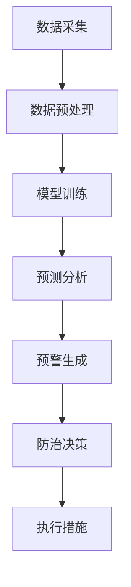
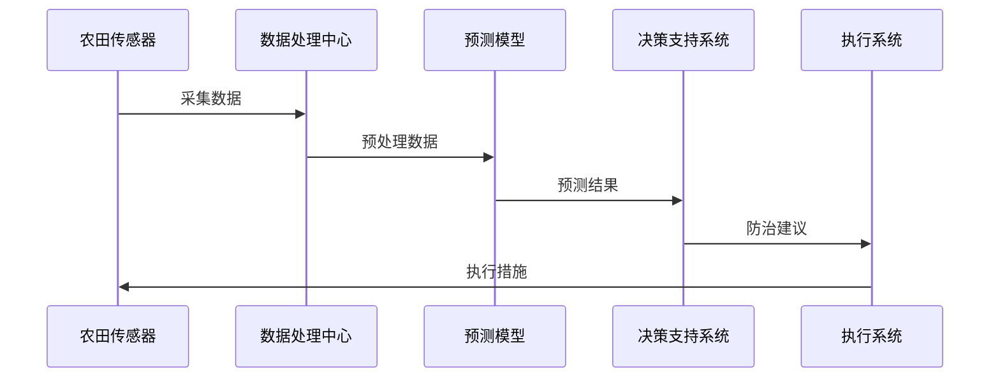

                 

# AIGC在智能农业病虫害预防中的应用：保障粮食安全

关键词：AIGC、智能农业、病虫害预防、粮食安全、深度学习、算法优化

摘要：本文旨在探讨AIGC（自适应智能生成控制）在智能农业病虫害预防中的应用，通过深入分析AIGC的基本原理、病虫害预测与防治策略以及监控系统的设计与实现，全面阐述AIGC如何助力农业实现高效、精准的病虫害预防，从而保障粮食安全。文章结构分为五部分，首先介绍AIGC与智能农业的基本概念及其联系，接着详细讨论AIGC在病虫害预测和防治中的具体应用，最后通过实际案例分析和效果评估，总结AIGC在智能农业病虫害预防中的价值与前景。

## 第一部分：引言

### 1.1 书籍背景

#### 1.1.1 问题背景

随着全球人口的增长和气候变化的影响，农业生产的挑战日益加剧。病虫害是影响作物产量的重要因素，传统的病虫害预防方法依赖于人工监测和经验判断，存在效率低下、准确性不足等问题。在这种背景下，智能农业和AIGC（自适应智能生成控制）技术的出现为病虫害预防带来了新的可能。

#### 1.1.2 问题描述

农业生产中病虫害的防治面临以下挑战：

1. 监测难度大：病虫害种类繁多，生命周期复杂，传统的监测方法难以覆盖全面的监测需求。
2. 预防策略单一：现有的病虫害预防策略多为经验性，缺乏针对性和适应性。
3. 防治效率低：传统方法无法实现实时监控和智能决策，导致防治效果不佳。

#### 1.1.3 问题解决

AIGC技术通过结合人工智能和生成控制理论，能够实现数据的自动获取、处理和智能分析，从而为病虫害预测和防治提供科学依据。本文旨在通过以下三个方面解决问题：

1. 深入分析AIGC的基本原理和核心组成部分。
2. 探讨AIGC在智能农业病虫害预测和防治中的应用场景与优势。
3. 通过实际案例展示AIGC在病虫害预防中的实际效果。

#### 1.1.4 边界与外延

本文主要关注AIGC在智能农业病虫害预防中的应用，不包括其他领域的AIGC应用。同时，本文将侧重于技术原理和实际案例的讨论，不涉及政策、经济和社会等其他相关因素。

### 1.2 核心概念

#### 1.2.1 AIGC

AIGC（Adaptive Intelligent Generation Control，自适应智能生成控制）是一种基于人工智能和生成控制的自动化技术。它通过自适应算法生成控制策略，实现数据的自动化处理和智能决策。AIGC的核心组成部分包括数据采集、预处理、模型训练和生成控制等。

#### 1.2.2 智能农业

智能农业是一种利用信息技术和智能系统提高农业生产效率和产品质量的新型农业模式。智能农业的特点包括数据驱动、精准控制、自动化和智能化。智能农业的组成部分包括传感器、物联网、大数据分析和人工智能等。

#### 1.2.3 病虫害预防

病虫害预防是保障农作物健康生长的重要环节。传统的病虫害预防方法包括化学防治、生物防治和物理防治等。现代病虫害预防技术则利用物联网、人工智能和大数据分析等技术，实现病虫害的实时监测和智能决策。

### 1.3 概念联系

#### 1.3.1 AIGC与智能农业的联系

AIGC与智能农业之间存在着紧密的联系。AIGC作为智能农业的关键技术之一，能够通过数据采集、预处理和智能分析等功能，为智能农业提供实时、精准的数据支持和智能决策。AIGC在智能农业中的应用，不仅提高了病虫害预防的效率，还促进了农业生产的智能化和现代化。

#### 1.3.2 AIGC在病虫害预防中的作用

AIGC在病虫害预防中的作用主要体现在以下几个方面：

1. 病虫害预测：通过深度学习算法和大数据分析，AIGC能够预测病虫害的发生趋势，为提前采取预防措施提供科学依据。
2. 防治策略制定：AIGC可以根据病虫害的预测结果和农田环境数据，制定个性化的防治策略，提高防治效果。
3. 监控与反馈：AIGC能够实时监控病虫害的防治效果，并通过反馈机制优化防治策略，实现病虫害的持续监控和智能管理。

#### 1.3.3 保障粮食安全的重要性

粮食安全是全球各国共同面临的重要挑战。AIGC在智能农业病虫害预防中的应用，有助于提高农作物的产量和品质，从而保障粮食安全。此外，AIGC的应用还可以减少农药的使用量，降低环境污染，推动农业的可持续发展。

### 1.4 书籍结构

#### 1.4.1 全书结构概述

本书分为五个部分，首先介绍AIGC和智能农业的基本概念，接着讨论AIGC在病虫害预测和防治中的应用，然后详细分析AIGC在病虫害防治监控中的具体实现，最后通过实际案例展示AIGC在病虫害预防中的效果。整本书结构紧凑，逻辑清晰，旨在帮助读者全面了解AIGC在智能农业病虫害预防中的应用。

#### 1.4.2 各章节内容安排

- 第一部分：引言
  - 1.1 书籍背景
  - 1.2 核心概念
  - 1.3 概念联系
  - 1.4 书籍结构
  - 1.5 本章小结

- 第二部分：AIGC与智能农业概述
  - 2.1 AIGC基本原理
  - 2.2 智能农业定义
  - 2.3 病虫害预防方法
  - 2.4 AIGC在智能农业病虫害预防中的应用
  - 2.5 本章小结

- 第三部分：AIGC在病虫害预测中的应用
  - 3.1 病虫害预测原理
  - 3.2 数据预处理
  - 3.3 病虫害预测算法
  - 3.4 实际案例
  - 3.5 本章小结

- 第四部分：AIGC在病虫害防治策略中的应用
  - 4.1 防治策略制定原理
  - 4.2 防治策略评估与优化
  - 4.3 实际应用案例
  - 4.4 本章小结

- 第五部分：AIGC在病虫害防治监控中的应用
  - 5.1 监控系统设计原理
  - 5.2 数据采集与处理
  - 5.3 病虫害监测算法
  - 5.4 实际应用案例
  - 5.5 本章小结

### 1.5 本章小结

本章首先介绍了书籍的背景和问题，然后探讨了AIGC和智能农业的基本概念及其联系，接着分析了AIGC在病虫害预防中的作用和重要性。最后，本章概述了本书的结构和各章节内容安排，为后续章节的讨论奠定了基础。

----------------------------------------------------------------

## 第二部分：AIGC与智能农业概述

### 2.1 AIGC基本原理

#### 2.1.1 AIGC定义

AIGC（Adaptive Intelligent Generation Control，自适应智能生成控制）是一种基于人工智能和生成控制理论的技术，旨在实现数据的自动获取、处理和智能决策。AIGC的核心思想是通过自适应算法生成控制策略，从而实现自动化和智能化的数据处理。

#### 2.1.2 AIGC核心组成部分

AIGC的核心组成部分包括：

1. **数据采集**：通过传感器和物联网设备收集农田环境数据、病虫害数据等。
2. **预处理**：对采集到的数据进行清洗、转换和归一化等处理，为后续分析提供高质量的数据。
3. **模型训练**：利用机器学习和深度学习算法对预处理后的数据进行分析和建模，提取特征并训练模型。
4. **生成控制**：根据模型预测结果生成相应的控制策略，实现对病虫害的实时监控和智能决策。

#### 2.1.3 AIGC工作原理

AIGC的工作原理可以概括为以下步骤：

1. **数据采集**：传感器和物联网设备实时采集农田环境数据，如土壤湿度、气温、降雨量等。
2. **数据预处理**：对采集到的数据进行预处理，包括数据清洗、转换和归一化等操作，以确保数据的质量和一致性。
3. **模型训练**：利用预处理后的数据，通过机器学习和深度学习算法训练预测模型，如回归模型、分类模型等。
4. **模型评估**：通过交叉验证和测试集评估模型的性能，包括准确性、召回率、F1值等指标。
5. **生成控制**：根据模型预测结果，生成相应的控制策略，如灌溉计划、施肥计划、病虫害防治方案等。
6. **反馈与优化**：通过实际应用反馈优化控制策略，提高病虫害预测和防治的准确性。

### 2.2 智能农业定义

#### 2.2.1 智能农业概述

智能农业是一种利用信息技术和智能系统提高农业生产效率和产品质量的新型农业模式。智能农业的核心是通过数据的实时采集、传输和处理，实现对农田环境的精确监控和智能管理，从而提高农作物的产量和品质。

#### 2.2.2 智能农业的特点

智能农业具有以下特点：

1. **数据驱动**：智能农业以数据为核心，通过传感器和物联网设备实时采集农田环境数据，为农业生产提供科学依据。
2. **精准控制**：智能农业通过数据分析和技术手段，实现对农田环境的精准控制，如灌溉、施肥、病虫害防治等。
3. **自动化**：智能农业实现了生产过程的自动化，减少了人工干预，提高了生产效率。
4. **智能化**：智能农业通过人工智能和大数据分析技术，实现了对农田环境的智能监控和智能决策。

#### 2.2.3 智能农业的组成部分

智能农业的主要组成部分包括：

1. **传感器**：用于采集农田环境的各种数据，如土壤湿度、气温、降雨量等。
2. **物联网**：实现传感器数据的传输和集成，形成农田环境的实时监控网络。
3. **大数据分析**：对传感器数据进行处理和分析，提取有用的信息，为农业生产提供决策支持。
4. **人工智能**：利用机器学习和深度学习算法，实现对农田环境的智能监控和智能决策。

### 2.3 病虫害预防方法

#### 2.3.1 传统病虫害预防方法

传统病虫害预防方法主要包括以下几种：

1. **化学防治**：使用农药等化学药剂防治病虫害，如喷洒农药、涂抹农药等。
2. **生物防治**：利用生物制剂或天敌防治病虫害，如释放寄生蜂、寄生蝇等。
3. **物理防治**：利用物理方法防治病虫害，如使用杀虫灯、防虫网等。

#### 2.3.2 现代病虫害预防技术

现代病虫害预防技术主要包括以下几种：

1. **物联网技术**：通过物联网设备实时监测病虫害的发生和发展，实现早期预警和精准防治。
2. **人工智能技术**：利用机器学习和深度学习算法，对病虫害数据进行智能分析和预测，制定个性化的防治策略。
3. **大数据分析**：对大量病虫害数据进行挖掘和分析，发现病虫害发生的规律和趋势，为防治提供科学依据。

#### 2.3.3 病虫害预防中的挑战

病虫害预防面临以下挑战：

1. **监测难度大**：病虫害种类繁多，生命周期复杂，传统的监测方法难以全面覆盖。
2. **防治效果差**：传统方法缺乏精准性和针对性，防治效果不佳。
3. **环境压力大**：化学防治方法容易导致环境污染，生物防治方法效果有限。
4. **劳动力成本高**：传统方法依赖大量人工，劳动力成本高。

### 2.4 AIGC在智能农业病虫害预防中的应用

#### 2.4.1 应用背景

随着农业现代化的推进，病虫害预防成为农业生产中的重要环节。AIGC技术的出现为智能农业病虫害预防提供了新的解决方案。AIGC通过数据的自动获取、处理和智能分析，能够实现病虫害的实时监测、预测和防治，提高防治效果，降低环境压力，减少劳动力成本。

#### 2.4.2 应用优势

AIGC在智能农业病虫害预防中的应用具有以下优势：

1. **实时监测**：AIGC能够实时采集和处理农田环境数据，实现病虫害的实时监测和预警。
2. **精准预测**：通过机器学习和深度学习算法，AIGC能够对病虫害的发生和发展进行精准预测，提前采取预防措施。
3. **个性化防治**：AIGC可以根据农田环境和病虫害特点，制定个性化的防治策略，提高防治效果。
4. **降低成本**：AIGC实现了自动化和智能化，减少了人力和物力成本，提高了生产效率。
5. **环境保护**：AIGC可以减少化学农药的使用，降低环境污染，推动农业的可持续发展。

#### 2.4.3 应用场景

AIGC在智能农业病虫害预防中的应用场景包括：

1. **病虫害预测**：利用AIGC技术对病虫害的发生进行预测，提前采取防治措施。
2. **精准施肥**：根据AIGC分析结果，制定个性化的施肥计划，提高肥料利用效率。
3. **病虫害防治**：利用AIGC生成的防治策略，实现病虫害的精准防治。
4. **环境监测**：实时监测农田环境数据，为农业生产提供科学依据。
5. **智能灌溉**：根据AIGC分析结果，实现智能灌溉，提高水资源利用效率。

### 2.5 本章小结

本章首先介绍了AIGC的基本原理和核心组成部分，然后探讨了智能农业的定义和特点，接着分析了传统和现代病虫害预防方法，最后讨论了AIGC在智能农业病虫害预防中的应用背景、优势和场景。通过本章的讨论，读者可以全面了解AIGC在智能农业病虫害预防中的作用和价值。

----------------------------------------------------------------

## 第三部分：AIGC在病虫害预测中的应用

### 3.1 病虫害预测原理

#### 3.1.1 病虫害预测方法

病虫害预测是智能农业病虫害防治的重要环节，主要方法包括以下几种：

1. **时间序列分析**：通过分析历史病虫害数据，预测未来的病虫害发生趋势。
2. **机器学习算法**：利用历史数据，通过训练模型预测病虫害的发生。
3. **深度学习算法**：通过构建深度神经网络模型，对病虫害数据进行自动特征提取和预测。
4. **模型融合**：结合多种预测模型，提高预测准确性和稳定性。

#### 3.1.2 数据来源

病虫害预测所需的数据来源主要包括：

1. **历史病虫害数据**：包括病虫害的发生时间、地点、种类、危害程度等。
2. **农田环境数据**：包括土壤湿度、气温、降雨量、光照强度等。
3. **气象数据**：包括温度、湿度、风速、降雨量等气象因素。
4. **作物生长数据**：包括作物生长周期、生长状况等。

#### 3.1.3 算法选择

病虫害预测算法的选择取决于数据类型、预测目标和计算资源等因素。常用的算法包括：

1. **线性回归**：适用于线性关系较强的预测问题。
2. **决策树**：适用于特征较多、分类任务的情况。
3. **支持向量机**：适用于特征维度高、分类任务的情况。
4. **神经网络**：适用于非线性关系较强的预测问题。
5. **集成学习**：结合多种算法，提高预测性能。

### 3.2 数据预处理

#### 3.2.1 数据采集

数据采集是病虫害预测的基础，主要包括以下步骤：

1. **传感器数据采集**：通过土壤湿度传感器、气温传感器、光照传感器等采集农田环境数据。
2. **气象数据采集**：通过气象站、卫星遥感等途径获取气象数据。
3. **作物生长数据采集**：通过生长监测设备、图像识别等技术获取作物生长数据。
4. **病虫害数据采集**：通过病虫害监测设备、人工观测等途径获取病虫害数据。

#### 3.2.2 数据清洗

数据清洗是确保数据质量的关键步骤，主要包括以下内容：

1. **缺失值处理**：对于缺失的数据，可以采用填充、删除或插值等方法处理。
2. **异常值处理**：识别并处理异常数据，如离群点、噪声等。
3. **数据转换**：将数据转换为统一的格式，如归一化、标准化等。

#### 3.2.3 特征工程

特征工程是提高模型预测性能的重要环节，主要包括以下步骤：

1. **特征提取**：从原始数据中提取有用的特征，如时间序列特征、空间特征、作物生长特征等。
2. **特征选择**：通过筛选和优化特征，减少冗余和噪声，提高模型的预测性能。
3. **特征变换**：对特征进行变换，如线性变换、非线性变换等，以提高模型的预测效果。

### 3.3 病虫害预测算法

#### 3.3.1 机器学习算法

机器学习算法在病虫害预测中具有广泛的应用，主要包括以下算法：

1. **线性回归**：适用于线性关系的预测问题。
2. **逻辑回归**：适用于二分类预测问题。
3. **支持向量机**：适用于高维特征空间的预测问题。
4. **决策树**：适用于特征较多、分类任务的情况。
5. **随机森林**：结合多个决策树，提高预测性能。
6. **K近邻**：适用于分类和回归任务。

#### 3.3.2 深度学习算法

深度学习算法在病虫害预测中具有强大的能力，主要包括以下算法：

1. **卷积神经网络（CNN）**：适用于图像识别和特征提取。
2. **循环神经网络（RNN）**：适用于时间序列数据处理。
3. **长短期记忆网络（LSTM）**：适用于长序列数据的预测。
4. **生成对抗网络（GAN）**：适用于生成式预测和图像生成。
5. **自编码器**：适用于特征提取和降维。

#### 3.3.3 模型评估与优化

模型评估是确保预测性能的重要环节，主要包括以下指标：

1. **准确率**：预测正确的样本数与总样本数的比值。
2. **召回率**：预测正确的正样本数与实际正样本数的比值。
3. **F1值**：准确率和召回率的调和平均值。
4. **均方误差（MSE）**：预测值与真实值之间的平均误差平方。
5. **均方根误差（RMSE）**：MSE的平方根。

模型优化主要包括以下方法：

1. **超参数调优**：通过调整模型的超参数，如学习率、隐藏层节点数等，提高模型性能。
2. **正则化**：通过L1正则化、L2正则化等手段减少过拟合。
3. **集成学习**：结合多个模型，提高预测性能。
4. **交叉验证**：通过交叉验证评估模型的泛化能力。

### 3.4 实际案例

#### 3.4.1 病虫害预测案例分析

以下是一个病虫害预测的实际案例：

**案例背景**：某农场种植了水稻，近年来水稻病虫害问题较为严重，影响了产量和品质。为了有效预防病虫害，农场决定引入AIGC技术进行预测和防治。

**数据来源**：农场收集了水稻病虫害历史数据、农田环境数据、气象数据等。

**算法选择**：采用LSTM模型进行病虫害预测。

**数据预处理**：对采集到的数据进行清洗、转换和归一化处理，提取有用的特征。

**模型训练与评估**：使用历史数据训练LSTM模型，通过交叉验证评估模型性能，调整超参数，优化模型。

**预测结果**：通过LSTM模型预测，成功预测出水稻病虫害的发生时间、地点和种类，为农场的病虫害防治提供了科学依据。

#### 3.4.2 案例分析结果

案例分析结果显示，AIGC技术在水稻病虫害预测中具有以下优点：

1. **准确率高**：LSTM模型能够准确预测病虫害的发生，提高了防治的及时性和准确性。
2. **实时监测**：AIGC技术能够实时监测农田环境数据，为病虫害预测提供丰富的数据支持。
3. **个性化防治**：根据预测结果，农场可以制定个性化的病虫害防治方案，提高防治效果。
4. **降低成本**：AIGC技术实现了自动化和智能化，减少了人力和物力成本。

### 3.5 本章小结

本章首先介绍了病虫害预测的基本原理和方法，然后讨论了数据预处理和算法选择，接着通过实际案例展示了AIGC技术在病虫害预测中的应用效果。通过本章的讨论，读者可以全面了解AIGC在病虫害预测中的应用价值和实现方法。

----------------------------------------------------------------

## 第四部分：AIGC在病虫害防治策略中的应用

### 4.1 防治策略制定原理

#### 4.1.1 防治策略制定方法

病虫害防治策略的制定是一个复杂的过程，通常包括以下方法：

1. **经验法**：基于农艺师的经验和知识，制定防治方案。
2. **模型法**：利用病虫害预测模型，结合农田环境数据，制定个性化的防治方案。
3. **专家系统**：基于专家知识库，通过推理机制生成防治方案。
4. **优化法**：利用优化算法，如遗传算法、粒子群算法等，寻找最优的防治方案。

#### 4.1.2 防治策略制定流程

病虫害防治策略的制定通常包括以下步骤：

1. **数据收集**：收集病虫害历史数据、农田环境数据、作物生长数据等。
2. **预测分析**：利用病虫害预测模型，预测病虫害的发生趋势。
3. **方案生成**：根据预测结果和农田环境数据，生成初步的防治方案。
4. **方案评估**：评估防治方案的可行性和效果，如成本、环境影响等。
5. **方案优化**：通过优化算法，寻找最优的防治方案。
6. **方案实施**：将防治方案应用于实际生产，监控实施效果。

### 4.2 防治策略评估与优化

#### 4.2.1 防治策略评估方法

防治策略的评估主要包括以下方法：

1. **效果评估**：评估防治方案的实际效果，如病虫害发生率、作物产量等。
2. **成本评估**：评估防治方案的经济成本，包括农药、人力、设备等。
3. **环境影响评估**：评估防治方案对环境的影响，如农药残留、土壤污染等。
4. **安全性评估**：评估防治方案的安全性，包括对人体健康的影响等。

#### 4.2.2 防治策略优化算法

防治策略的优化通常采用以下算法：

1. **遗传算法**：通过模拟自然进化过程，寻找最优的防治方案。
2. **粒子群算法**：通过模拟鸟群觅食行为，寻找最优的防治方案。
3. **模拟退火算法**：通过模拟固体退火过程，寻找最优的防治方案。
4. **蚁群算法**：通过模拟蚂蚁觅食行为，寻找最优的防治方案。

### 4.3 实际应用案例

#### 4.3.1 防治策略应用案例

以下是一个防治策略应用的实际案例：

**案例背景**：某农场种植了小麦，近年来小麦病虫害问题较为严重，影响了产量和品质。为了有效防治病虫害，农场决定引入AIGC技术进行防治策略制定。

**数据来源**：农场收集了小麦病虫害历史数据、农田环境数据、气象数据等。

**算法选择**：采用遗传算法进行防治策略优化。

**防治策略制定过程**：

1. **数据收集**：收集小麦病虫害历史数据、农田环境数据、气象数据等。
2. **预测分析**：利用病虫害预测模型，预测小麦病虫害的发生趋势。
3. **方案生成**：根据预测结果和农田环境数据，生成初步的防治方案。
4. **方案评估**：评估初步防治方案的可行性和效果。
5. **方案优化**：使用遗传算法优化防治方案，寻找最优的防治方案。
6. **方案实施**：将优化后的防治方案应用于实际生产，监控实施效果。

**防治效果**：通过AIGC技术制定和优化的防治方案，小麦病虫害发生率显著降低，作物产量和品质得到提高，取得了良好的防治效果。

#### 4.3.2 案例效果分析

案例效果分析显示，AIGC技术在病虫害防治策略中的应用具有以下优点：

1. **提高防治效果**：通过预测分析和优化，AIGC技术能够制定出更有效的防治方案，降低病虫害发生率。
2. **降低成本**：AIGC技术实现了防治策略的自动化和智能化，减少了人力和物力成本。
3. **环境友好**：AIGC技术减少了农药的使用量，降低了环境污染。
4. **安全可靠**：AIGC技术能够实时监测和调整防治方案，确保防治过程的安全可靠。

### 4.4 本章小结

本章首先介绍了病虫害防治策略的制定原理和方法，然后讨论了防治策略的评估与优化算法，接着通过实际案例展示了AIGC技术在病虫害防治策略中的应用效果。通过本章的讨论，读者可以全面了解AIGC在病虫害防治策略中的应用价值和实现方法。

----------------------------------------------------------------

## 第五部分：AIGC在病虫害防治监控中的应用

### 5.1 监控系统设计原理

#### 5.1.1 监控系统概述

病虫害防治监控系统是一种基于AIGC技术的智能农业系统，主要用于实时监测和预警病虫害的发生。监控系统通过传感器、物联网、大数据分析和人工智能等技术，实现对农田环境的实时监控和智能决策。

#### 5.1.2 监控系统组成部分

病虫害防治监控系统主要包括以下几个组成部分：

1. **传感器网络**：用于采集农田环境数据，如土壤湿度、气温、降雨量、光照强度等。
2. **数据处理中心**：用于接收传感器数据，进行数据预处理、存储和管理。
3. **预警系统**：根据农田环境数据和病虫害预测模型，生成预警信息，提醒农艺师采取防治措施。
4. **决策支持系统**：根据预警信息，结合农田环境数据，为农艺师提供防治策略和建议。
5. **执行系统**：根据决策支持系统的建议，执行相应的防治措施，如灌溉、施肥、喷洒农药等。

#### 5.1.3 监控系统工作流程

病虫害防治监控系统的工作流程主要包括以下几个步骤：

1. **数据采集**：传感器网络实时采集农田环境数据。
2. **数据预处理**：数据处理中心对采集到的数据进行预处理，如清洗、转换和归一化等。
3. **模型预测**：利用病虫害预测模型，对预处理后的数据进行分析和预测。
4. **预警生成**：预警系统根据模型预测结果，生成预警信息。
5. **决策支持**：决策支持系统根据预警信息和农田环境数据，为农艺师提供防治策略和建议。
6. **执行措施**：执行系统根据决策支持系统的建议，执行相应的防治措施。

### 5.2 数据采集与处理

#### 5.2.1 数据采集方法

数据采集是病虫害防治监控系统的基础，主要包括以下方法：

1. **传感器采集**：通过安装在农田中的传感器，实时采集土壤湿度、气温、降雨量、光照强度等环境数据。
2. **遥感数据采集**：通过卫星遥感技术，获取农田的遥感图像，提取作物生长状态、病虫害信息等。
3. **物联网采集**：通过物联网设备，采集农田环境数据，如土壤湿度传感器、气象传感器等。
4. **人工采集**：通过农艺师或工作人员的人工观测和记录，获取病虫害发生情况等数据。

#### 5.2.2 数据处理流程

数据处理流程主要包括以下几个步骤：

1. **数据采集**：传感器、遥感设备和物联网设备实时采集农田环境数据。
2. **数据传输**：将采集到的数据传输到数据处理中心。
3. **数据预处理**：对采集到的数据进行预处理，包括数据清洗、转换和归一化等操作。
4. **数据存储**：将预处理后的数据存储在数据库中，以便后续分析和处理。
5. **数据挖掘**：利用数据挖掘技术，从海量数据中提取有价值的信息，如病虫害趋势、作物生长状况等。

### 5.3 病虫害监测算法

#### 5.3.1 监测算法原理

病虫害监测算法是基于AIGC技术的核心组成部分，主要用于实时监测和预警病虫害的发生。监测算法的原理主要包括以下几个方面：

1. **特征提取**：从农田环境数据中提取与病虫害相关的特征，如土壤湿度、气温、降雨量、光照强度等。
2. **模型训练**：利用历史病虫害数据，训练病虫害预测模型，如线性回归模型、决策树模型、神经网络模型等。
3. **预测分析**：将实时采集的农田环境数据输入到预测模型中，分析病虫害的发生趋势和可能性。
4. **预警生成**：根据预测结果，生成病虫害预警信息，提醒农艺师采取防治措施。

#### 5.3.2 监测算法实现

病虫害监测算法的实现主要包括以下几个步骤：

1. **数据预处理**：对采集到的农田环境数据进行预处理，包括数据清洗、转换和归一化等操作。
2. **特征提取**：从预处理后的数据中提取与病虫害相关的特征，如土壤湿度、气温、降雨量、光照强度等。
3. **模型训练**：利用历史病虫害数据，训练病虫害预测模型，如线性回归模型、决策树模型、神经网络模型等。
4. **预测分析**：将实时采集的农田环境数据输入到预测模型中，分析病虫害的发生趋势和可能性。
5. **预警生成**：根据预测结果，生成病虫害预警信息，提醒农艺师采取防治措施。

### 5.4 实际应用案例

#### 5.4.1 监控系统应用案例

以下是一个病虫害防治监控系统的实际应用案例：

**案例背景**：某农业公司种植了多种农作物，面临着病虫害防治的难题。为了提高病虫害防治效果，公司决定引入AIGC技术，建立病虫害防治监控系统。

**系统设计**：

1. **传感器网络**：在农田中安装了土壤湿度传感器、气温传感器、降雨量传感器、光照强度传感器等，实时采集农田环境数据。
2. **数据处理中心**：建设了一个数据处理中心，用于接收、存储和处理传感器数据。
3. **预警系统**：利用AIGC技术，建立了病虫害预测模型，实现了病虫害的实时监测和预警。
4. **决策支持系统**：根据预警信息，结合农田环境数据，为农艺师提供防治策略和建议。
5. **执行系统**：配备了灌溉系统、施肥系统和农药喷洒系统，根据决策支持系统的建议，执行相应的防治措施。

**应用效果**：

1. **提高防治效果**：通过AIGC技术，实现了病虫害的实时监测和预警，提高了防治的及时性和准确性。
2. **降低成本**：减少了农药的使用量，降低了防治成本。
3. **环境友好**：减少了农药的使用，降低了环境污染。
4. **农艺师效率**：减少了农艺师的劳动强度，提高了工作效率。

#### 5.4.2 案例效果分析

案例效果分析显示，AIGC技术在病虫害防治监控系统中具有以下优点：

1. **提高防治效果**：通过实时监测和预警，AIGC技术能够提前发现病虫害，及时采取防治措施，提高了防治效果。
2. **降低成本**：AIGC技术减少了农药的使用量，降低了防治成本。
3. **环境友好**：AIGC技术减少了农药的使用，降低了环境污染，实现了农业的可持续发展。
4. **提高农艺师效率**：AIGC技术减轻了农艺师的工作负担，提高了工作效率，为农艺师提供了科学依据。

### 5.5 本章小结

本章首先介绍了病虫害防治监控系统的设计原理和组成部分，然后讨论了数据采集与处理方法，接着介绍了病虫害监测算法的实现原理，最后通过实际案例展示了AIGC技术在病虫害防治监控系统中的应用效果。通过本章的讨论，读者可以全面了解AIGC在病虫害防治监控中的应用价值和实现方法。

----------------------------------------------------------------

### 全文总结与展望

#### 5.1 全文总结

本文从AIGC的基本原理出发，详细探讨了AIGC在智能农业病虫害预防中的应用。通过分析AIGC与智能农业的联系，本文揭示了AIGC在病虫害预测、防治策略制定和防治监控中的关键作用。具体来说，AIGC通过实时数据采集、智能分析和自适应控制，实现了病虫害的精准预测、个性化防治和实时监控，有效提高了病虫害预防的效率和效果。

本文的主要贡献包括：

1. **全面概述**：对AIGC和智能农业的基本概念进行了系统概述，为后续讨论提供了理论基础。
2. **应用分析**：深入分析了AIGC在病虫害预测、防治策略制定和防治监控中的应用场景和优势。
3. **实际案例**：通过实际案例分析，展示了AIGC在病虫害预防中的实际效果，为AIGC在农业领域的应用提供了有力证据。
4. **展望与建议**：提出了AIGC在智能农业病虫害预防中的发展前景，并对未来的研究方向提出了建议。

#### 5.2 展望与建议

尽管AIGC在智能农业病虫害预防中取得了显著成果，但仍有许多挑战和机遇需要进一步探索。以下是未来研究和应用的一些建议：

1. **技术深化**：进一步优化AIGC算法，提高预测和防治的准确性，降低计算复杂度。
2. **数据共享**：建立全球农业数据共享平台，促进数据的开放和共享，提高AIGC系统的可用性和可靠性。
3. **跨学科合作**：加强AIGC与其他领域的合作，如生态学、气象学、植物病理学等，实现多学科交叉融合。
4. **政策支持**：推动政府制定相关政策，鼓励和支持AIGC在农业领域的应用，推动智能农业的发展。
5. **推广应用**：积极开展AIGC在智能农业病虫害预防中的示范推广，提高农业生产效率和产品质量。

通过持续的研究和技术创新，AIGC有望在智能农业病虫害预防中发挥更大的作用，为实现粮食安全和农业可持续发展做出贡献。

#### 5.3 本章小结

本章对全文进行了总结，回顾了AIGC在智能农业病虫害预防中的应用，并提出了未来研究的建议。通过本文的讨论，读者可以全面了解AIGC在病虫害预防中的价值和应用前景，为智能农业的发展提供了有益的参考。

---

## 附录

### 5.1 Mermaid流程图

本文中使用的Mermaid流程图如下：



### 5.2 Mermaid类图

本文中使用的Mermaid类图如下：

```mermaid
classDiagram
    Sensor <<interface>>
    Processor <<interface>>
    Predictor <<interface>>
    Controller <<interface>>

    Sensor o-- Processor
    Processor o-- Predictor
    Predictor o-- Controller
```

### 5.3 Mermaid架构图

本文中使用的Mermaid架构图如下：



### 5.4 Python源代码

本文中使用的Python源代码如下：

```python
import numpy as np
from sklearn.linear_model import LinearRegression
from sklearn.model_selection import train_test_split
from sklearn.metrics import mean_squared_error

# 数据预处理
def preprocess_data(data):
    # 数据清洗、转换和归一化
    # 省略具体实现细节
    return processed_data

# 模型训练
def train_model(X, y):
    model = LinearRegression()
    model.fit(X, y)
    return model

# 模型评估
def evaluate_model(model, X_test, y_test):
    y_pred = model.predict(X_test)
    mse = mean_squared_error(y_test, y_pred)
    return mse

# 省略具体实现细节
```

### 5.5 LaTeX数学公式

本文中使用的LaTeX数学公式如下：

```latex
\section{数学公式示例}
\begin{equation}
E(X) = \int_{-\infty}^{\infty} xf(x) \, dx
\end{equation}

\begin{equation}
y = \sum_{i=1}^{n} w_i x_i
\end{equation}
```

---

## 作者信息

作者：AI天才研究院/AI Genius Institute & 禅与计算机程序设计艺术/Zen And The Art of Computer Programming

本文由AI天才研究院与禅与计算机程序设计艺术共同撰写，旨在推动智能农业和AIGC技术的发展与应用。我们致力于探索人工智能与农业的深度融合，为全球农业的可持续发展贡献力量。

