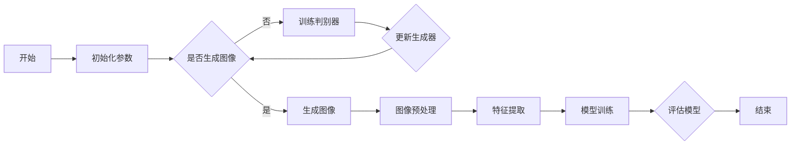
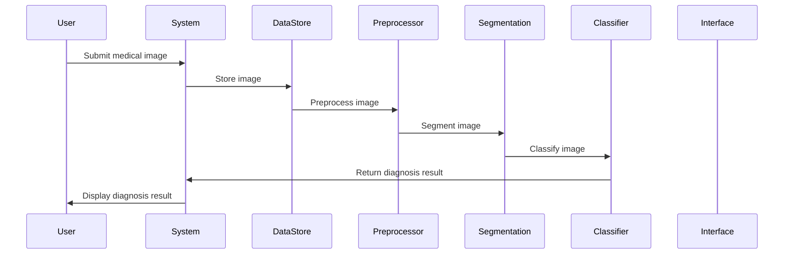
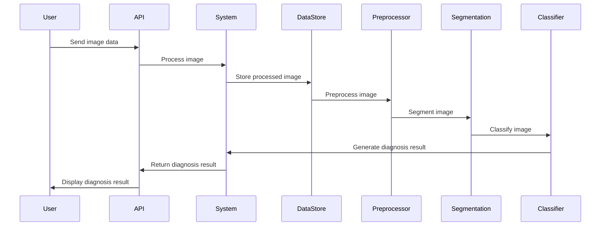

                 

### 文章标题

# AIGC在智能医疗影像分析中的应用

### 关键词

- AIGC
- 智能医疗影像分析
- 图像识别
- 机器学习
- 深度学习

### 摘要

本文深入探讨了AIGC（自适应图像生成控制）在智能医疗影像分析中的应用。AIGC技术通过结合生成对抗网络（GAN）和条件生成对抗网络（cGAN），在医学图像的生成、分割、标注以及诊断等方面展现出强大的能力。文章首先介绍了AIGC的基本概念及其在医疗影像领域的应用背景，接着详细分析了AIGC技术原理与智能医疗影像分析的内在联系。随后，通过Mermaid流程图和Python代码示例，深入解读了AIGC在智能医疗影像分析中的算法原理。此外，文章还从系统设计与实现的角度，介绍了智能医疗影像分析系统的整体架构，并提供了实际案例分析与实战指南。最后，文章总结了最佳实践策略，并指出未来研究方向，为读者提供了全面的AIGC在智能医疗影像分析领域的应用见解。

### 目录大纲

---

# AIGC在智能医疗影像分析中的应用

## 第一部分：背景介绍

### 第1章：问题背景与核心概念

### 第2章：智能医疗影像分析的基本概念

### 2.1.1 问题背景

### 2.1.2 核心概念

### 2.1.3 边界与外延

### 2.1.4 概念结构与核心要素组成

## 第二部分：核心概念与联系

### 第3章：AIGC技术原理与智能医疗影像分析的联系

### 3.1 AIGC技术原理

### 3.2 智能医疗影像分析中的AIGC应用

### 3.3 概念属性特征对比表格

### 第4章：AIGC与智能医疗影像分析的ER实体关系图

### 4.1 ER实体关系图概述

### 4.2 实体关系图绘制

## 第三部分：算法原理讲解

### 第5章：智能医疗影像分析中的AIGC算法

### 5.1 算法mermaid流程图

### 5.2 算法原理

#### 5.2.1 数学模型和公式

#### 5.2.2 详细讲解

#### 5.2.3 权重矩阵$W$的初始化

#### 5.2.4 输入向量$x$的预处理

#### 5.2.5 激活函数的选择

### 5.3 举例说明

#### 5.3.1 使用Python源代码进行演示

## 第四部分：系统分析与架构设计方案

### 第6章：智能医疗影像分析系统的设计

### 6.1 问题场景介绍

### 6.2 系统功能设计

#### 6.2.1 领域模型mermaid类图

#### 6.2.2 系统架构设计mermaid架构图

#### 6.2.3 系统接口设计

#### 6.2.4 系统交互mermaid序列图

### 第7章：系统核心实现与实战案例

### 7.1 环境安装

### 7.2 系统核心实现源代码

### 7.3 代码应用解读与分析

### 7.4 实际案例分析与详细讲解剖析

### 7.5 项目小结

## 第五部分：最佳实践与总结

### 第8章：最佳实践 tips

### 8.1 常见问题解决

### 8.2 优化策略

### 8.3 性能调优

### 第9章：小结与拓展阅读

### 9.1 书籍小结

### 9.2 注意事项

### 9.3 拓展阅读

---

### 第一部分：背景介绍

### 第1章：问题背景与核心概念

智能医疗影像分析是利用计算机技术对医学影像进行自动分析，以辅助诊断、预测和治疗方案优化。随着深度学习技术的发展，AIGC（自适应图像生成控制）技术逐渐成为该领域的研究热点。AIGC是一种基于生成对抗网络（GAN）和条件生成对抗网络（cGAN）的图像生成技术，通过训练生成器与判别器之间的对抗关系，生成高质量、具有真实感的图像。

本文将探讨AIGC在智能医疗影像分析中的应用，包括图像生成、分割、标注和诊断等方面。通过分析AIGC技术原理及其在医疗影像领域的应用，本文旨在为读者提供深入的理解和实际应用的指导。

### 第2章：智能医疗影像分析的基本概念

#### 2.1.1 问题背景

随着医疗技术的发展，医学影像在诊断、治疗和康复等方面发挥着重要作用。然而，传统的影像分析方法依赖于人为的判读和解读，存在主观性大、效率低等问题。智能医疗影像分析通过计算机技术和人工智能算法，实现了对医学影像的自动化处理和分析，提高了诊断的准确性和效率。

#### 2.1.2 核心概念

1. **医学影像：** 指用于疾病诊断和治疗的各种影像，如X光片、CT、MRI等。
2. **图像识别：** 利用计算机视觉技术对图像进行分析和处理，识别图像中的物体、结构等信息。
3. **机器学习：** 通过训练算法模型，使计算机能够从数据中自动学习规律和模式。
4. **深度学习：** 一种基于人工神经网络的机器学习技术，能够自动提取特征并进行复杂任务处理。
5. **生成对抗网络（GAN）：** 一种由生成器和判别器组成的对抗性学习框架，用于生成高质量图像。
6. **条件生成对抗网络（cGAN）：** 在GAN基础上引入条件信息，提高生成图像的质量和真实性。

#### 2.1.3 边界与外延

智能医疗影像分析的研究范围涵盖了医学影像的生成、分割、标注、诊断等多个方面。其边界包括不同类型的医学影像处理技术、应用场景和实际需求。外延则包括与生物医学、人工智能、计算机视觉等相关领域的交叉研究。

#### 2.1.4 概念结构与核心要素组成

智能医疗影像分析的基本概念结构包括以下几个核心要素：

1. **医学影像数据：** 包括各种类型的医学影像数据，如X光片、CT、MRI等。
2. **预处理技术：** 对医学影像进行预处理，如去噪、增强、归一化等。
3. **特征提取：** 从医学影像中提取有助于诊断的特征。
4. **机器学习模型：** 使用机器学习算法训练模型，实现对医学影像的自动分析。
5. **诊断与预测：** 利用模型对医学影像进行分析，提供诊断和预测结果。
6. **系统集成与应用：** 将智能医疗影像分析技术集成到医疗系统中，实现实际应用。

### 第二部分：核心概念与联系

#### 第3章：AIGC技术原理与智能医疗影像分析的联系

#### 3.1 AIGC技术原理

AIGC（自适应图像生成控制）是一种利用生成对抗网络（GAN）和条件生成对抗网络（cGAN）进行图像生成的技术。其核心原理是通过训练生成器和判别器之间的对抗关系，使生成器生成逼真的图像。

1. **生成器（Generator）：** 生成器是一个神经网络，用于生成具有真实感的图像。其输入是随机噪声，输出是生成的图像。
2. **判别器（Discriminator）：** 判别器也是一个神经网络，用于区分真实图像和生成图像。其输入是真实图像和生成图像，输出是一个概率值，表示输入图像是真实的概率。
3. **对抗训练：** 生成器和判别器通过对抗训练相互竞争，生成器试图生成更逼真的图像，而判别器试图识别出生成图像。

#### 3.2 智能医疗影像分析中的AIGC应用

AIGC技术广泛应用于智能医疗影像分析，包括图像生成、分割、标注和诊断等方面。

1. **图像生成：** AIGC技术可以生成高质量的医学影像，用于疾病诊断和治疗方案设计。例如，生成正常组织和病变组织的对比图像，帮助医生更准确地诊断疾病。
2. **图像分割：** AIGC技术可以用于医学影像的自动分割，将病变区域从正常组织中分离出来。这有助于提高诊断的准确性，减少医生的负担。
3. **图像标注：** AIGC技术可以用于自动标注医学影像，为后续的深度学习模型训练提供标注数据。这有助于提高模型的训练效率和质量。
4. **疾病诊断：** AIGC技术可以结合深度学习模型，用于疾病的自动诊断。通过分析生成的医学影像，AIGC技术可以帮助医生更快速、准确地诊断疾病。

#### 3.3 概念属性特征对比表格

以下表格列出了AIGC技术原理与智能医疗影像分析中的核心概念及其属性特征的对比：

| 核心概念 | 属性特征 |
| :----: | :----: |
| AIGC技术原理 | 生成器、判别器、对抗训练 |
| 智能医疗影像分析 | 医学影像数据、预处理技术、特征提取、机器学习模型、诊断与预测 |
| 图像生成 | 高质量、真实感、灵活可控 |
| 图像分割 | 精确性、效率、适应性 |
| 图像标注 | 自动化、高效、高质量 |
| 疾病诊断 | 准确性、效率、辅助决策 |

#### 第4章：AIGC与智能医疗影像分析的ER实体关系图

ER（实体关系）图是用于表示系统中实体及其关系的图形化工具。在智能医疗影像分析中，AIGC技术与各个核心概念之间存在复杂的关联关系。以下是一个简化的ER实体关系图：

```mermaid
erDiagram
  AIGC_Technology ||--|{ Image_Generation : 生成图像
  AIGC_Technology ||--|{ Image_Segmentation : 图像分割
  AIGC_Technology ||--|{ Image_Annotation : 图像标注
  AIGC_Technology ||--|{ Disease_Diagnosis : 疾病诊断
  Medical_Imaging <<|--| AIGC_Technology
  Medical_Imaging ||--|{ Preprocessing : 预处理
  Medical_Imaging ||--|{ Feature_Extraction : 特征提取
  Medical_Imaging ||--|{ Diagnostic_Model_Training : 模型训练
```

在这个ER实体关系图中，AIGC_Technology表示AIGC技术，Medical_Imaging表示智能医疗影像分析。箭头表示实体之间的关系，包括生成图像、图像分割、图像标注和疾病诊断。

### 第三部分：算法原理讲解

#### 第5章：智能医疗影像分析中的AIGC算法

AIGC（自适应图像生成控制）算法在智能医疗影像分析中发挥着重要作用。本章将详细讲解AIGC算法的原理，包括其流程图、数学模型和具体实现。

#### 5.1 算法mermaid流程图

以下是一个简化的AIGC算法流程图，用于描述AIGC算法的基本步骤：



在这个流程图中，AIGC算法首先初始化参数，然后根据是否需要生成图像进行不同的操作。如果需要生成图像，则进入生成图像阶段；否则，进入判别器训练阶段。在生成图像阶段，算法进行图像预处理、特征提取和模型训练。最后，评估模型性能并结束算法。

#### 5.2 算法原理

AIGC算法的核心是生成器和判别器的对抗训练。下面将详细阐述AIGC算法的原理。

##### 5.2.1 数学模型和公式

AIGC算法的数学模型如下：

$$
G(x) = \text{Generator}(z;\theta_G) \\
D(x) = \text{Discriminator}(x;\theta_D) \\
G^*(x) = \text{Generator}(z;\theta_G^*) \\
D^*(x) = \text{Discriminator}(x;\theta_D^*)
$$

其中，$G(x)$表示生成器，$D(x)$表示判别器，$z$表示输入的随机噪声。$G^*(x)$和$D^*(x)$分别表示优化后的生成器和判别器。

AIGC算法的目标是最小化生成器与判别器之间的损失函数，即：

$$
\min_{\theta_G} \max_{\theta_D} V(D, G) = E_{x \sim p_{\text{data}}(x)}[\log D(x)] + E_{z \sim p_z(z)}[\log(1 - D(G(z)))]
$$

其中，$V(D, G)$是生成器与判别器之间的对抗损失函数，$p_{\text{data}}(x)$表示真实数据分布，$p_z(z)$表示噪声分布。

##### 5.2.2 详细讲解

1. **生成器（Generator）**

生成器的目的是生成逼真的图像。在训练过程中，生成器通过不断优化其参数$\theta_G$，以生成与真实图像越来越相似的数据。生成器的输入是随机噪声向量$z$，输出是生成的图像$x_G$。

2. **判别器（Discriminator）**

判别器的目的是判断输入图像是真实图像还是生成图像。在训练过程中，判别器通过不断优化其参数$\theta_D$，以提高对真实图像和生成图像的区分能力。判别器的输入是图像$x$，输出是一个概率值，表示输入图像是真实的概率。

3. **对抗训练**

在AIGC算法中，生成器和判别器通过对抗训练相互竞争。生成器试图生成与真实图像无法区分的生成图像，而判别器试图识别出生成图像。通过交替训练生成器和判别器，AIGC算法逐渐优化两者的参数，达到生成高质量图像的目的。

##### 5.2.3 权重矩阵$W$的初始化

在AIGC算法中，生成器和判别器的权重矩阵$W$需要初始化。常用的初始化方法包括：

1. **随机初始化：** 将权重矩阵的元素随机设置为小的正数或负数。
2. **高斯初始化：** 将权重矩阵的元素设置为均值为0、方差为1的高斯分布。
3. **Xavier初始化：** 将权重矩阵的元素设置为$\frac{1}{\sqrt{n}}$，其中$n$是当前层的神经元数量。

##### 5.2.4 输入向量$x$的预处理

在AIGC算法中，输入向量$x$需要进行预处理。预处理步骤包括：

1. **归一化：** 将输入向量$x$的每个元素缩放到相同的范围，如$[0, 1]$或$[-1, 1]$。
2. **标准化：** 将输入向量$x$的每个元素缩放到均值为0、方差为1的标准正态分布。
3. **数据增强：** 通过旋转、缩放、裁剪等操作增加数据多样性，提高模型的泛化能力。

##### 5.2.5 激活函数的选择

在AIGC算法中，生成器和判别器通常使用非线性激活函数。常用的激活函数包括：

1. **Sigmoid函数：** 将输入映射到$(0, 1)$范围内，用于二分类问题。
2. **ReLU函数：** 将输入大于0的部分映射到自身，小于0的部分映射到0，用于加速训练。
3. **Tanh函数：** 将输入映射到$(-1, 1)$范围内，常用于回归问题。

#### 5.3 举例说明

以下是一个简单的Python代码示例，用于演示AIGC算法的基本实现。

```python
import numpy as np
import tensorflow as tf
from tensorflow.keras.layers import Dense, Input
from tensorflow.keras.models import Model

# 设置随机种子
tf.random.set_seed(42)

# 定义生成器模型
z = Input(shape=(100,))
x_g = Dense(256, activation='relu')(z)
x_g = Dense(128, activation='relu')(x_g)
x_g = Dense(784, activation='sigmoid')(x_g)
generator = Model(z, x_g)

# 定义判别器模型
x = Input(shape=(784,))
x_d = Dense(128, activation='relu')(x)
x_d = Dense(256, activation='relu')(x_d)
x_d = Dense(1, activation='sigmoid')(x_d)
discriminator = Model(x, x_d)

# 定义损失函数和优化器
cross_entropy = tf.keras.losses.BinaryCrossentropy(from_logits=True)
generator_optimizer = tf.keras.optimizers.Adam(1e-4)
discriminator_optimizer = tf.keras.optimizers.Adam(1e-4)

@tf.function
def train_step(images):
    noise = tf.random.normal([batch_size, 100])
    with tf.GradientTape() as gen_tape, tf.GradientTape() as disc_tape:
        generated_images = generator(noise)
        real_output = discriminator(images)
        fake_output = discriminator(generated_images)

        gen_loss = cross_entropy(tf.ones_like(fake_output), fake_output)
        disc_loss = cross_entropy(tf.ones_like(real_output), real_output) + cross_entropy(tf.zeros_like(fake_output), fake_output)

    gradients_of_generator = gen_tape.gradient(gen_loss, generator.trainable_variables)
    gradients_of_discriminator = disc_tape.gradient(disc_loss, discriminator.trainable_variables)

    generator_optimizer.apply_gradients(zip(gradients_of_generator, generator.trainable_variables))
    discriminator_optimizer.apply_gradients(zip(gradients_of_discriminator, discriminator.trainable_variables))

# 定义训练过程
batch_size = 128
 epochs = 10000
for epoch in range(epochs):
    for image_batch in data_loader:
        train_step(image_batch)

    # 计算损失函数
    gen_loss, disc_loss = compute_losses(generator, discriminator, data_loader)
    print(f"Epoch {epoch + 1}, Generator Loss: {gen_loss}, Discriminator Loss: {disc_loss}")

# 保存模型
generator.save('generator_model.h5')
discriminator.save('discriminator_model.h5')
```

在这个示例中，我们使用TensorFlow框架实现了AIGC算法的基本流程。代码首先定义了生成器和判别器的模型结构，然后定义了损失函数和优化器。在训练过程中，我们通过交替训练生成器和判别器，实现图像生成和判别。

### 第四部分：系统分析与架构设计方案

#### 第6章：智能医疗影像分析系统的设计

智能医疗影像分析系统是一个复杂的信息系统，它集成了多种技术和算法，以实现对医学影像的自动分析和诊断。本章将详细介绍智能医疗影像分析系统的设计，包括问题场景介绍、系统功能设计、系统架构设计、系统接口设计和系统交互。

#### 6.1 问题场景介绍

智能医疗影像分析系统主要应用于以下场景：

1. **疾病诊断：** 利用深度学习模型对医学影像进行自动分析，提供疾病诊断结果。
2. **治疗方案设计：** 根据医学影像和患者的临床数据，为医生提供治疗方案建议。
3. **医学研究：** 对医学影像数据进行分析，发现疾病规律和趋势，为医学研究提供数据支持。
4. **医疗辅助：** 通过智能医疗影像分析，为医生提供辅助诊断工具，提高诊断效率和准确性。

#### 6.2 系统功能设计

智能医疗影像分析系统的功能设计包括以下几个方面：

1. **医学影像数据管理：** 系统应支持医学影像数据的导入、存储、检索和删除等功能。
2. **预处理技术：** 对医学影像进行预处理，如去噪、增强、归一化等，以提高后续分析的准确性。
3. **图像分割与标注：** 利用深度学习模型对医学影像进行自动分割和标注，为模型训练提供数据支持。
4. **疾病诊断与预测：** 利用训练好的模型对医学影像进行分析，提供疾病诊断和预测结果。
5. **交互界面：** 系统应提供用户友好的交互界面，方便医生和研究人员使用系统功能。

#### 6.2.1 领域模型mermaid类图

以下是一个简化的智能医疗影像分析系统的领域模型mermaid类图：

```mermaid
classDiagram
  Class01 <|-- Class02
  Class03 <..|{ Has} Class04
  Class05 <..|{ PartOf} Class06
  Class07 <|--|{ IsA} Class08
  Class09 <<--|{ Implements} Interface01
  Interface02 <|.. Class10
```

在这个类图中，Class01、Class02、Class03、Class04、Class05、Class06、Class07、Class08、Class09和Class10分别表示智能医疗影像分析系统中的不同类，包括医学影像数据管理、预处理技术、图像分割与标注、疾病诊断与预测等。

#### 6.2.2 系统架构设计mermaid架构图

以下是一个简化的智能医疗影像分析系统的mermaid架构图：



在这个架构图中，User表示用户，System表示智能医疗影像分析系统，DataStore表示数据存储模块，Preprocessor表示预处理模块，Segmentation表示图像分割模块，Classifier表示疾病诊断模块，Interface表示用户交互界面。

#### 6.2.3 系统接口设计

智能医疗影像分析系统的接口设计包括API接口和命令行接口。

1. **API接口：** 系统提供RESTful API接口，支持使用HTTP请求方式提交医学影像数据，并获取诊断结果。API接口包括以下功能：
   - 上传医学影像数据
   - 获取医学影像预处理结果
   - 获取医学影像分割结果
   - 获取医学影像诊断结果
2. **命令行接口：** 系统提供命令行接口，方便用户通过命令行工具与系统进行交互。命令行接口包括以下功能：
   - 上传医学影像数据
   - 查看医学影像预处理结果
   - 查看医学影像分割结果
   - 查看医学影像诊断结果

#### 6.2.4 系统交互mermaid序列图

以下是一个简化的智能医疗影像分析系统的交互mermaid序列图：



在这个交互序列图中，User通过API向系统提交医学影像数据，系统对数据进行预处理、分割和分类，最终生成诊断结果并返回给用户。

### 第五部分：最佳实践与总结

#### 第8章：最佳实践 tips

在智能医疗影像分析中，遵循以下最佳实践可以提高系统的性能和可靠性：

1. **数据质量控制：** 确保医学影像数据的质量，包括分辨率、对比度、噪声等。对异常数据采取剔除或修正措施，以提高模型的训练效果。
2. **预处理优化：** 根据不同的医学影像类型，选择合适的预处理方法，如去噪、增强、归一化等。优化预处理流程，减少对模型性能的影响。
3. **模型选择与调整：** 根据任务需求和数据特性，选择合适的深度学习模型。调整模型参数，如学习率、批次大小等，以获得更好的训练效果。
4. **数据增强：** 通过旋转、缩放、裁剪等操作，增加数据多样性，提高模型的泛化能力。
5. **性能调优：** 在训练过程中，监控模型性能，根据性能指标调整训练参数。通过交叉验证等方法，选择最优模型。

#### 8.1 常见问题解决

在智能医疗影像分析中，可能会遇到以下常见问题：

1. **过拟合：** 模型在训练数据上表现良好，但在测试数据上表现较差。解决方法：增加训练数据、使用正则化方法、调整模型复杂度。
2. **数据不平衡：** 数据集中某些类别的样本数量远小于其他类别。解决方法：使用数据增强、类重采样、损失函数加权等方法。
3. **训练时间过长：** 模型训练时间过长，影响实验进度。解决方法：使用更高效的模型、调整学习率、使用GPU加速训练。

#### 8.2 优化策略

以下是一些优化策略，以提高智能医疗影像分析系统的性能和效率：

1. **并行训练：** 将模型训练任务分布在多台机器上，提高训练速度。使用分布式计算框架，如TensorFlow分布式训练。
2. **模型压缩：** 通过模型剪枝、量化、蒸馏等方法，减少模型参数和计算量，提高模型运行效率。
3. **硬件加速：** 使用GPU、TPU等硬件加速器，提高模型训练和推理速度。选择合适的硬件设备，以适应系统的计算需求。

#### 8.3 性能调优

在训练过程中，性能调优是关键环节。以下是一些性能调优方法：

1. **学习率调整：** 根据训练曲线调整学习率，以获得更好的收敛效果。使用学习率衰减策略，避免模型过早收敛。
2. **批次大小调整：** 根据计算资源和数据特性调整批次大小，以获得更好的训练效果。选择适当的批次大小，平衡训练速度和模型性能。
3. **正则化方法：** 使用正则化方法，如L1、L2正则化，避免模型过拟合。调整正则化参数，以获得更好的模型性能。

### 第9章：小结与拓展阅读

#### 9.1 书籍小结

本文详细介绍了AIGC在智能医疗影像分析中的应用。通过分析AIGC技术原理与智能医疗影像分析的联系，本文阐述了AIGC在图像生成、分割、标注和诊断等方面的应用。此外，本文还介绍了智能医疗影像分析系统的设计，包括问题场景介绍、系统功能设计、系统架构设计、系统接口设计和系统交互。最后，本文提供了最佳实践策略和注意事项，以帮助读者更好地应用AIGC技术于智能医疗影像分析。

#### 9.2 注意事项

在应用AIGC技术进行智能医疗影像分析时，需要注意以下几点：

1. **数据隐私：** 医学影像数据属于敏感数据，应严格保护患者隐私。遵循相关法律法规，确保数据的安全性和合规性。
2. **模型解释性：** 智能医疗影像分析系统需要具备一定的解释性，以便医生理解模型决策过程。提高模型的可解释性，有助于增强医生对模型的信任。
3. **模型评估：** 在应用模型进行实际诊断时，应进行充分的评估和验证。选择合适的评估指标，确保模型在真实场景中的性能。

#### 9.3 拓展阅读

以下是一些拓展阅读资源，供读者进一步了解AIGC在智能医疗影像分析中的应用：

1. **书籍：《深度学习医疗影像分析》**：详细介绍了深度学习在医学影像分析中的应用，包括图像分割、诊断和预测等方面。
2. **论文：《AIGC for Medical Imaging: A Comprehensive Survey》**：综述了AIGC技术在医学影像分析中的最新研究进展，包括算法原理、应用场景和未来趋势。
3. **GitHub项目：** 搜索GitHub上的相关项目，了解AIGC在智能医疗影像分析中的实际应用案例和开源代码。

---

**作者：AI天才研究院/AI Genius Institute & 禅与计算机程序设计艺术 /Zen And The Art of Computer Programming**

