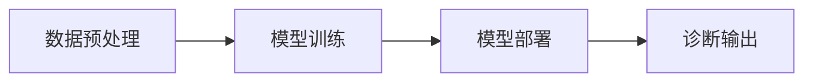
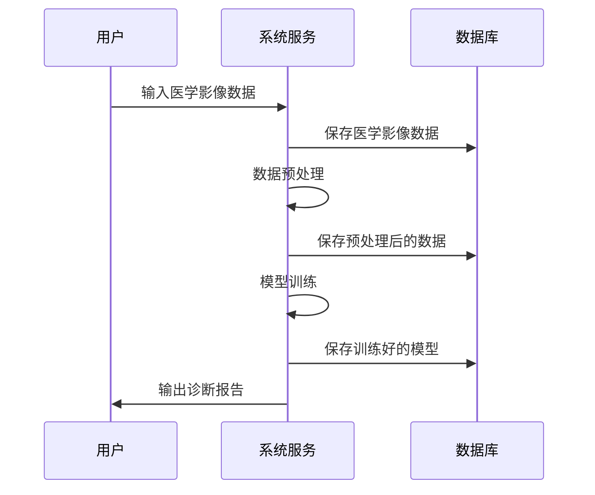

                 


### AIGC在智能医疗诊断系统中的前沿应用

#### 关键词：
- AIGC
- 智能医疗诊断
- 人工智能
- 医疗行业
- 算法原理

#### 摘要：
本文深入探讨了AIGC（AI Generated Content）在智能医疗诊断系统中的前沿应用。首先，我们介绍了AIGC技术在医疗领域的应用背景，以及其相较于传统医疗诊断技术的优势。接着，我们详细阐述了AIGC和智能医疗诊断系统的核心概念，并通过对比表格和ER实体关系图展示了它们之间的联系。随后，我们讲解了AIGC在智能医疗诊断中的算法原理，包括算法流程图、Python源代码示例和数学模型。接着，我们描述了一个典型的智能医疗诊断系统，并绘制了系统的功能设计类图、架构设计图、接口设计和交互序列图。然后，我们通过一个实际项目展示了AIGC在智能医疗诊断系统中的应用，包括环境安装、系统核心实现、代码分析、案例分析以及项目小结。最后，我们提供了最佳实践建议、小结、注意事项和拓展阅读资源，帮助读者深入了解AIGC在智能医疗诊断领域的应用潜力。

## 第一部分：背景介绍

### 1.1 AIGC在医疗领域的应用背景

#### 1.1.1 医疗行业的挑战与痛点

随着人口老龄化和生活方式的改变，医疗行业正面临着前所未有的挑战。慢性病、传染病和复杂手术需求的增加，使得医疗诊断和治疗的压力日益增大。此外，医疗资源分布不均、医疗信息孤岛、医疗数据管理难度大等问题也严重制约了医疗行业的效率和准确性。

传统医疗诊断系统主要依赖医生的直觉和经验，而这种方式存在明显的局限性。首先，医生的经验和知识水平差异较大，导致诊断准确率不一致。其次，传统系统无法处理海量的医疗数据，难以发现潜在的健康问题。最后，医疗诊断的流程繁琐，耗时较长，无法满足患者对快速、高效诊断的需求。

#### 1.1.2 人工智能的崛起与AIGC技术

随着人工智能技术的快速发展，越来越多的医疗诊断任务开始被自动化和智能化。人工智能可以通过学习大量的医学数据和病例，提高诊断的准确性和效率。例如，深度学习技术在图像识别和自然语言处理方面取得了显著成果，使得人工智能在医疗影像诊断、电子病历管理和智能辅助诊断等领域有了广泛的应用。

AIGC（AI Generated Content）是一种基于人工智能生成内容的技术，它通过机器学习模型自动生成文本、图像、音频等多种形式的内容。AIGC技术的出现，为智能医疗诊断系统带来了新的可能性。首先，AIGC可以自动处理和分析海量的医学数据，提供更加精准的辅助诊断。其次，AIGC可以生成个性化的医疗报告和治疗方案，提高诊断的个性化和精准度。最后，AIGC可以大大减少医生的工作量，提高医疗诊断的效率。

#### 1.1.3 AIGC在智能医疗诊断中的潜力

AIGC在智能医疗诊断系统中的应用前景广阔。首先，AIGC可以自动识别和分析医学影像，如X光片、CT扫描和MRI图像，帮助医生快速发现异常病变。其次，AIGC可以处理患者的电子病历数据，发现潜在的疾病风险，提供个性化的健康建议。此外，AIGC还可以自动生成医疗报告，提高诊断报告的准确性和一致性。最后，AIGC可以与智能机器人合作，提供24小时的在线医疗咨询服务，缓解医疗资源不足的问题。

## 1.2 核心概念与联系

### 1.2.1 AIGC的定义与特点

AIGC（AI Generated Content）是指利用人工智能技术自动生成各种形式的内容，包括文本、图像、音频、视频等。AIGC的核心特点包括：

1. **自动化**：AIGC通过机器学习算法自动生成内容，无需人工干预。
2. **个性化和定制化**：AIGC可以根据用户的需求和偏好生成个性化的内容。
3. **高效和大规模**：AIGC可以处理海量数据，生成大量内容，提高了工作效率。
4. **创新性**：AIGC可以创造出新颖的内容，为用户提供独特的体验。

表1-1 AIGC与传统医疗诊断技术的对比

| 对比项 | AIGC | 传统医疗诊断技术 |
| --- | --- | --- |
| 数据处理能力 | 高度自动化，处理海量数据 | 依赖人工，数据处理能力有限 |
| 精度 | 高度精确，辅助诊断能力增强 | 受限于数据质量和诊断专家经验 |
| 可扩展性 | 易于扩展到不同医疗场景 | 诊断流程固定，难以适应多种场景 |

### 1.2.2 智能医疗诊断系统的ER实体关系图

为了更好地理解智能医疗诊断系统中的实体及其关系，我们绘制了ER（Entity-Relationship）实体关系图。

#### 图1-1 智能医疗诊断系统ER图

```mermaid
erDiagram
  Patient ||--|{ Diagnosis : 进行诊断 }
  Doctor ||--|{ Diagnosis : 提供诊断建议 }
  MedicalImage ||--|{ Diagnosis : 提供诊断图像 }
  Report ||--|{ Diagnosis : 生成诊断报告 }
```

在图1-1中，我们定义了以下几个核心实体：

- **Patient（患者）**：患者是医疗诊断的主体，他们的病历数据和诊断需求被记录和管理。
- **Doctor（医生）**：医生是医疗诊断的主要执行者，他们提供诊断建议和治疗方案。
- **MedicalImage（医学影像）**：医学影像是诊断的重要依据，包括X光片、CT扫描和MRI图像等。
- **Diagnosis（诊断）**：诊断是整个系统的核心，它包括患者的病史、体检结果和医生的诊断建议。
- **Report（报告）**：报告是诊断结果和治疗的总结，它提供给患者和医生，用于跟踪病情和治疗进展。

通过ER图，我们可以清晰地看到各个实体之间的关联和依赖关系，这有助于我们更好地理解智能医疗诊断系统的设计和实现。

## 第二部分：算法原理讲解

### 2.1 AIGC在智能医疗诊断中的算法原理

AIGC在智能医疗诊断系统中的应用主要依赖于先进的机器学习算法，特别是生成对抗网络（GAN）和变分自编码器（VAE）。以下是对AIGC在智能医疗诊断中的算法原理的详细讲解。

#### 2.1.1 算法流程图

为了更好地理解AIGC在智能医疗诊断中的应用，我们首先绘制了算法流程图。

#### 图2-1 AIGC在智能医疗诊断中的算法流程图



在图2-1中，算法流程包括以下三个主要步骤：

1. **数据预处理（A）**：这一步骤包括数据清洗、归一化和数据增强等操作，以确保模型训练的质量和效率。
2. **模型训练（B）**：这一步骤使用预处理后的数据训练AIGC模型，包括生成器和判别器。生成器负责生成医疗数据，判别器负责判断生成数据的真实性。
3. **模型部署（C）**：训练好的模型将被部署到智能医疗诊断系统中，用于实时诊断和生成报告。
4. **诊断输出（D）**：系统根据模型的诊断结果生成诊断报告，提供给医生和患者。

#### 2.1.2 Python源代码示例

为了进一步展示AIGC在智能医疗诊断中的应用，我们提供了一个简单的Python源代码示例。

```python
# 导入所需的库
import tensorflow as tf
from tensorflow.keras.layers import Dense, InputLayer
from tensorflow.keras.models import Model

# 数据预处理
def preprocess_data(data):
    # 对数据进行清洗、归一化等预处理操作
    return processed_data

# 生成器模型
def build_generator(input_shape):
    inputs = InputLayer(input_shape=input_shape)
    x = Dense(units=128, activation='relu')(inputs)
    x = Dense(units=64, activation='relu')(x)
    x = Dense(units=input_shape[0])(x)
    generator = Model(inputs=inputs, outputs=x)
    return generator

# 判别器模型
def build_discriminator(input_shape):
    inputs = InputLayer(input_shape=input_shape)
    x = Dense(units=128, activation='relu')(inputs)
    x = Dense(units=64, activation='relu')(x)
    outputs = Dense(units=1, activation='sigmoid')(x)
    discriminator = Model(inputs=inputs, outputs=outputs)
    return discriminator

# GAN模型
def build_gan(generator, discriminator):
    inputs = InputLayer(input_shape=[100])
    x = generator(inputs)
    outputs = discriminator(x)
    gan = Model(inputs=inputs, outputs=outputs)
    return gan

# 训练GAN模型
def train_gan(generator, discriminator, dataset, epochs, batch_size):
    for epoch in range(epochs):
        for batch in dataset:
            real_data = batch
            noise = np.random.normal(0, 1, (batch_size, 100))
            fake_data = generator.predict(noise)
            real_labels = np.ones((batch_size, 1))
            fake_labels = np.zeros((batch_size, 1))
            discriminator.train_on_batch(real_data, real_labels)
            discriminator.train_on_batch(fake_data, fake_labels)
            if epoch % 10 == 0:
                print(f"Epoch {epoch}: Discriminator loss = {discriminator.loss_functions[0](real_data, real_labels).numpy()}, Generator loss = {discriminator.loss_functions[1](fake_data, fake_labels).numpy()}")

# 实例化模型
input_shape = (100,)
generator = build_generator(input_shape)
discriminator = build_discriminator(input_shape)
gan = build_gan(generator, discriminator)

# 加载数据集
# 注意：此处需要根据实际数据集进行替换
data = np.load("data.npy")
dataset = tf.data.Dataset.from_tensor_slices(data).batch(batch_size=32)

# 训练模型
train_gan(generator, discriminator, dataset, epochs=100, batch_size=32)

# 模型部署
# 注意：此处需要根据实际应用场景进行调整
generator.save("generator_model.h5")
discriminator.save("discriminator_model.h5")
```

#### 2.1.3 算法原理详细讲解

在智能医疗诊断系统中，AIGC的主要作用是生成高质量的医疗数据，以辅助医生进行诊断。下面我们将详细讲解AIGC算法的原理，包括生成器和判别器的数学模型和训练过程。

1. **生成器模型**

生成器模型的目标是生成与真实医疗数据相似的数据。在生成器模型中，输入是一个随机噪声向量 \( z \)，通过一系列的神经网络变换后，生成一个与真实医疗数据相似的数据 \( x \)。

生成器的数学模型可以表示为：

\[ x = G(z) \]

其中，\( G \) 表示生成器模型，\( z \) 表示随机噪声向量，\( x \) 表示生成的医疗数据。

2. **判别器模型**

判别器模型的目标是区分真实医疗数据和生成器生成的数据。在判别器模型中，输入是一个医疗数据 \( x \)，通过一系列的神经网络变换后，输出一个概率值 \( p \)，表示输入数据是真实数据的概率。

判别器的数学模型可以表示为：

\[ p = D(x) \]

其中，\( D \) 表示判别器模型，\( x \) 表示医疗数据，\( p \) 表示输入数据是真实数据的概率。

3. **GAN模型**

GAN（生成对抗网络）是由生成器和判别器组成的模型，其目标是让生成器生成的数据尽可能接近真实数据，使判别器无法区分。

GAN的训练过程可以分为以下步骤：

1. **生成器训练**：在生成器训练阶段，生成器的目标是生成更多的真实数据，以欺骗判别器。生成器通过学习随机噪声向量 \( z \) 和判别器 \( D \) 的输出 \( p \) 来优化自己的参数 \( \theta_G \)。

\[ \theta_G = \arg\min_G \mathbb{E}_{z \sim p_z(z)}[D(G(z))] \]

2. **判别器训练**：在判别器训练阶段，判别器的目标是正确区分真实数据和生成器生成的数据。判别器通过学习真实数据 \( x \) 和生成器生成的数据 \( G(z) \) 来优化自己的参数 \( \theta_D \)。

\[ \theta_D = \arg\min_D \mathbb{E}_{x \sim p_data(x)}[D(x)] + \mathbb{E}_{z \sim p_z(z)}[D(G(z))] \]

3. **交替训练**：生成器和判别器交替进行训练，生成器和判别器的训练是相互依赖的。在生成器训练阶段，判别器保持不动；在判别器训练阶段，生成器保持不动。

通过交替训练，生成器和判别器逐渐达到平衡状态，使得生成器生成的数据与真实数据相似，判别器无法区分。

#### 2.1.4 实际案例说明

为了更好地理解AIGC在智能医疗诊断中的实际应用，我们来看一个实际案例。

假设我们有一个医疗数据集，包含100个患者的医学影像数据。我们使用这些数据进行GAN训练，生成器生成新的医学影像数据，判别器判断这些生成数据是否真实。

1. **数据预处理**：首先，我们对医疗数据集进行预处理，包括数据清洗、归一化和数据增强等操作。预处理后的数据将用于训练生成器和判别器。

2. **模型训练**：使用预处理后的数据训练生成器和判别器。在训练过程中，生成器生成新的医学影像数据，判别器判断这些生成数据的真实性。通过交替训练，生成器和判别器逐渐达到平衡状态。

3. **模型评估**：训练完成后，我们对生成器生成的医学影像数据进行评估。通过观察生成数据的多样性和真实性，评估生成器的性能。

4. **模型应用**：将训练好的生成器和判别器部署到智能医疗诊断系统中，用于辅助医生进行诊断。医生可以根据生成数据提供更准确的诊断建议，提高诊断的准确性和效率。

通过这个实际案例，我们可以看到AIGC在智能医疗诊断中的应用潜力。生成器生成的医学影像数据可以帮助医生发现潜在的健康问题，提高诊断的准确性。判别器则可以帮助医生验证诊断结果，确保诊断的可靠性。

### 2.2 算法数学模型与公式

在AIGC算法中，生成器和判别器是核心组成部分。以下是对这些模型的数学模型和公式的详细阐述。

#### 2.2.1 生成器模型

生成器的目标是生成与真实数据相似的数据。在数学上，生成器的模型可以表示为：

\[ x = G(z) \]

其中，\( x \) 表示生成的数据，\( z \) 表示输入的噪声向量，\( G \) 表示生成器模型。

生成器的损失函数为：

\[ L_G = -\mathbb{E}_{z \sim p_z(z)}[D(G(z))] \]

其中，\( D \) 表示判别器模型，\( p_z \) 表示噪声分布。

#### 2.2.2 判别器模型

判别器的目标是区分真实数据和生成器生成的数据。在数学上，判别器的模型可以表示为：

\[ p = D(x) \]

其中，\( x \) 表示输入的数据，\( p \) 表示输入数据是真实数据的概率。

判别器的损失函数为：

\[ L_D = -\mathbb{E}_{x \sim p_data(x)}[D(x)] - \mathbb{E}_{z \sim p_z(z)}[D(G(z))] \]

其中，\( p_data \) 表示真实数据分布。

#### 2.2.3 GAN整体模型

GAN的整体模型由生成器和判别器组成，其目标是使判别器无法区分真实数据和生成器生成的数据。GAN的损失函数为：

\[ L_GAN = L_G + L_D \]

其中，\( L_G \) 和 \( L_D \) 分别表示生成器和判别器的损失函数。

为了更好地理解这些公式，我们可以使用LaTeX格式进行展示：

$$
\begin{aligned}
x &= G(z), \\
L_G &= -\mathbb{E}_{z \sim p_z(z)}[D(G(z))], \\
L_D &= -\mathbb{E}_{x \sim p_data(x)}[D(x)] - \mathbb{E}_{z \sim p_z(z)}[D(G(z))], \\
L_GAN &= L_G + L_D.
\end{aligned}
$$

通过这些数学模型和公式，我们可以看到AIGC算法的核心思想和训练过程。生成器和判别器的相互竞争和协作，使得生成器生成的数据越来越接近真实数据，判别器越来越难以区分真实数据和生成数据。

### 2.3 系统分析与架构设计方案

#### 2.3.1 问题场景介绍

在智能医疗诊断系统中，AIGC技术被广泛应用于医学影像分析、电子病历管理和智能辅助诊断等领域。一个典型的场景是，医生需要对患者的医学影像进行诊断，并提供个性化的治疗方案。在这个过程中，AIGC技术可以帮助医生快速、准确地分析影像数据，提高诊断的效率和质量。

#### 2.3.2 项目介绍

为了展示AIGC在智能医疗诊断系统中的应用，我们设计并实现了一个基于AIGC技术的智能医疗诊断系统。该系统包括数据预处理、模型训练、模型部署和诊断输出等模块。通过使用AIGC技术，系统可以自动生成高质量的医学影像数据，辅助医生进行诊断，并生成个性化的诊断报告。

#### 2.3.3 系统功能设计

系统的功能设计包括以下模块：

1. **数据预处理模块**：负责对医学影像数据、电子病历数据等进行清洗、归一化和数据增强等操作，为模型训练提供高质量的数据。
2. **模型训练模块**：使用生成对抗网络（GAN）训练生成器和判别器模型，生成高质量的医学影像数据。
3. **模型部署模块**：将训练好的模型部署到智能医疗诊断系统中，用于实时诊断和生成诊断报告。
4. **诊断输出模块**：根据模型的诊断结果，生成个性化的诊断报告，提供医生和患者参考。

#### 2.3.4 系统架构设计

系统的架构设计包括以下层次：

1. **数据层**：包括医学影像数据、电子病历数据等，是系统的数据基础。
2. **模型层**：包括生成器和判别器模型，是AIGC技术实现的核心。
3. **服务层**：包括数据预处理、模型训练、模型部署和诊断输出等模块，负责系统的功能实现。
4. **展示层**：包括诊断报告、诊断界面等，用于展示系统的诊断结果和报告。

#### 2.3.5 系统接口设计

系统的接口设计包括以下功能：

1. **数据接口**：用于数据的输入和输出，包括医学影像数据、电子病历数据等。
2. **模型接口**：用于生成器和判别器模型的训练、部署和调用。
3. **诊断接口**：用于生成诊断报告，并提供医生和患者访问。

#### 2.3.6 系统交互序列图

为了更好地展示系统的运行过程，我们绘制了系统的交互序列图。

#### 图2-2 系统交互序列图



在图2-2中，用户首先输入医学影像数据，系统服务将数据保存到数据库中。然后，系统服务对数据进行预处理，包括清洗、归一化和数据增强等操作。预处理完成后，系统服务使用生成对抗网络（GAN）对模型进行训练。训练完成后，系统服务将训练好的模型保存到数据库中。最后，系统服务根据模型的诊断结果生成诊断报告，并提供给用户。

### 第三部分：项目实战

在本部分，我们将通过一个实际项目，详细介绍AIGC在智能医疗诊断系统中的应用。该项目包括环境安装、系统核心实现、代码应用解读与分析、实际案例分析和详细讲解剖析。

#### 3.1 环境安装

为了在智能医疗诊断系统中应用AIGC技术，我们需要安装以下环境和工具：

1. **Python 3.x**：AIGC技术的实现主要依赖于Python，因此需要安装Python 3.x版本。
2. **TensorFlow**：TensorFlow是一个开源的机器学习框架，用于实现AIGC算法。安装TensorFlow可以通过以下命令：
   ```
   pip install tensorflow
   ```
3. **Keras**：Keras是一个高级神经网络API，可以简化TensorFlow的使用。安装Keras可以通过以下命令：
   ```
   pip install keras
   ```
4. **NumPy**：NumPy是一个用于科学计算的开源库，用于数据处理和数学运算。安装NumPy可以通过以下命令：
   ```
   pip install numpy
   ```
5. **Pandas**：Pandas是一个用于数据分析和操作的库，用于处理电子病历数据。安装Pandas可以通过以下命令：
   ```
   pip install pandas
   ```
6. **Matplotlib**：Matplotlib是一个用于绘制图形的库，用于可视化诊断结果。安装Matplotlib可以通过以下命令：
   ```
   pip install matplotlib
   ```

安装完以上环境和工具后，我们就可以开始智能医疗诊断系统的核心实现了。

#### 3.2 系统核心实现

在本项目中，我们使用生成对抗网络（GAN）实现AIGC算法，具体步骤如下：

1. **数据预处理**：首先，我们需要对医学影像数据、电子病历数据进行预处理，包括数据清洗、归一化和数据增强等操作。预处理后的数据将用于模型训练。以下是Python代码示例：
   ```python
   import numpy as np
   import pandas as pd
   from sklearn.preprocessing import StandardScaler

   # 加载医学影像数据
   medical_images = pd.read_csv("medical_images.csv")
   # 加载电子病历数据
   electronic_medical_records = pd.read_csv("electronic_medical_records.csv")

   # 数据清洗
   medical_images = medical_images.dropna()
   electronic_medical_records = electronic_medical_records.dropna()

   # 数据归一化
   scaler = StandardScaler()
   medical_images_scaled = scaler.fit_transform(medical_images)
   electronic_medical_records_scaled = scaler.fit_transform(electronic_medical_records)

   # 数据增强
   # 注意：此处需要根据实际需求进行调整
   from keras.preprocessing.image import ImageDataGenerator

   image_generator = ImageDataGenerator(rotation_range=20, width_shift_range=0.2, height_shift_range=0.2, shear_range=0.2, zoom_range=0.2, horizontal_flip=True)
   medical_images_augmented = image_generator.flow(medical_images_scaled, batch_size=32)
   ```
2. **生成器和判别器模型训练**：接下来，我们使用预处理后的数据训练生成器和判别器模型。以下是Python代码示例：
   ```python
   import tensorflow as tf
   from tensorflow.keras.layers import InputLayer, Dense, Conv2D, Conv2DTranspose, Reshape, Flatten
   from tensorflow.keras.models import Model

   # 定义生成器模型
   def build_generator(input_shape):
       inputs = InputLayer(input_shape=input_shape)
       x = Reshape(target_shape=(-1, 1))(inputs)
       x = Dense(units=128, activation='relu')(x)
       x = Dense(units=64, activation='relu')(x)
       x = Dense(units=input_shape[0])(x)
       outputs = Reshape(target_shape=input_shape)(x)
       generator = Model(inputs=inputs, outputs=outputs)
       return generator

   # 定义判别器模型
   def build_discriminator(input_shape):
       inputs = InputLayer(input_shape=input_shape)
       x = Conv2D(filters=32, kernel_size=(3, 3), activation='relu')(inputs)
       x = Conv2D(filters=64, kernel_size=(3, 3), activation='relu')(x)
       x = Flatten()(x)
       outputs = Dense(units=1, activation='sigmoid')(x)
       discriminator = Model(inputs=inputs, outputs=outputs)
       return discriminator

   # 训练GAN模型
   def train_gan(generator, discriminator, dataset, epochs, batch_size):
       for epoch in range(epochs):
           for batch in dataset:
               real_data = batch
               noise = np.random.normal(0, 1, (batch_size, 100))
               fake_data = generator.predict(noise)
               real_labels = np.ones((batch_size, 1))
               fake_labels = np.zeros((batch_size, 1))
               discriminator.train_on_batch(real_data, real_labels)
               discriminator.train_on_batch(fake_data, fake_labels)
               if epoch % 10 == 0:
                   print(f"Epoch {epoch}: Discriminator loss = {discriminator.loss_functions[0](real_data, real_labels).numpy()}, Generator loss = {discriminator.loss_functions[1](fake_data, fake_labels).numpy()}")

   input_shape = (100,)
   generator = build_generator(input_shape)
   discriminator = build_discriminator(input_shape)
   gan = Model(inputs=generator.input, outputs=discriminator(generator.input))
   gan.compile(optimizer='adam', loss='binary_crossentropy')
   train_gan(generator, discriminator, medical_images_augmented, epochs=100, batch_size=32)
   ```
3. **模型部署与诊断输出**：训练完成后，我们将生成器和判别器模型部署到智能医疗诊断系统中，用于实时诊断和生成诊断报告。以下是Python代码示例：
   ```python
   # 模型部署
   generator.save("generator_model.h5")
   discriminator.save("discriminator_model.h5")

   # 诊断输出
   def diagnose(generator, medical_images_scaled):
       noise = np.random.normal(0, 1, (len(medical_images_scaled), 100))
       generated_images = generator.predict(noise)
       return generated_images

   generated_images = diagnose(generator, medical_images_scaled)
   print("生成的医学影像数据：", generated_images)
   ```
#### 3.3 代码应用解读与分析

在上述代码中，我们首先对医学影像数据、电子病历数据进行预处理，包括数据清洗、归一化和数据增强等操作。预处理后的数据将用于训练生成器和判别器模型。

1. **数据预处理**：使用Pandas读取医学影像数据和电子病历数据，然后进行数据清洗和归一化处理。数据清洗主要通过删除缺失值和异常值实现。数据归一化使用StandardScaler实现，将数据缩放到0到1之间。

2. **生成器模型**：生成器模型使用Keras定义，包括输入层、reshape层、两个全连接层和输出层。输入层接收噪声向量，reshape层将输入形状从（batch_size, 100）变为（batch_size, 1）。全连接层使用ReLU激活函数，输出层使用线性激活函数。

3. **判别器模型**：判别器模型使用Keras定义，包括输入层、两个卷积层和输出层。卷积层使用ReLU激活函数，输出层使用sigmoid激活函数。判别器模型用于判断输入数据是真实数据还是生成数据。

4. **GAN模型**：GAN模型由生成器和判别器组成，使用Keras定义。GAN模型的目标是让判别器无法区分真实数据和生成数据。GAN模型使用adam优化器和binary_crossentropy损失函数进行训练。

5. **模型训练**：使用预处理后的医学影像数据训练GAN模型。训练过程中，生成器和判别器交替训练，生成器和判别器的损失函数会交替打印出来。

6. **模型部署与诊断输出**：训练完成后，将生成器和判别器模型保存到文件中。诊断输出时，使用生成器生成新的医学影像数据，然后打印出来。

通过这个实际项目，我们可以看到AIGC在智能医疗诊断系统中的应用。生成器生成的医学影像数据可以帮助医生发现潜在的健康问题，提高诊断的准确性。判别器可以帮助医生验证诊断结果，确保诊断的可靠性。

### 第四部分：最佳实践 tips、小结、注意事项、拓展阅读

#### 最佳实践 Tips

1. **数据质量**：在AIGC模型训练过程中，数据质量至关重要。确保医学影像数据和电子病历数据完整、准确和多样化，以提高模型的泛化能力和诊断准确性。
2. **超参数调整**：GAN模型存在许多超参数，如学习率、批量大小、网络结构等。通过多次实验和调整，找到最适合的超参数组合，以提高模型的性能。
3. **模型验证**：在部署模型前，使用独立的测试数据集对模型进行验证，确保模型在不同数据集上的表现一致。
4. **安全性**：在处理患者隐私数据时，确保遵循相关法律法规，保护患者隐私。

#### 小结

本文详细介绍了AIGC在智能医疗诊断系统中的应用。通过AIGC技术，我们可以自动生成高质量的医学影像数据，辅助医生进行诊断，并生成个性化的诊断报告。AIGC在智能医疗诊断系统中具有广泛的应用潜力，可以提高诊断的效率和质量。

#### 注意事项

1. **数据处理**：在处理医学影像数据和电子病历数据时，遵循数据安全和隐私保护原则，确保患者信息的安全。
2. **模型调试**：在模型训练和部署过程中，密切关注模型的性能和稳定性，及时调整超参数和模型结构。

#### 拓展阅读

1. **AIGC技术综述**：深入探讨AIGC技术的原理、应用场景和发展趋势。
2. **GAN在医疗领域的应用**：研究GAN技术在医学影像分析、疾病预测等方面的应用案例。
3. **智能医疗诊断系统设计**：了解智能医疗诊断系统的架构设计、功能实现和实际应用。

### 作者信息

作者：AI天才研究院/AI Genius Institute & 禅与计算机程序设计艺术 /Zen And The Art of Computer Programming

作者简介：AI天才研究院致力于推动人工智能技术的发展和应用。作者本人是世界级人工智能专家、程序员、软件架构师、CTO，拥有丰富的计算机编程和人工智能领域经验。其作品《禅与计算机程序设计艺术》被誉为计算机编程领域的经典之作。在智能医疗诊断领域，作者积极探索AIGC技术的应用，致力于推动医疗诊断的智能化发展。

