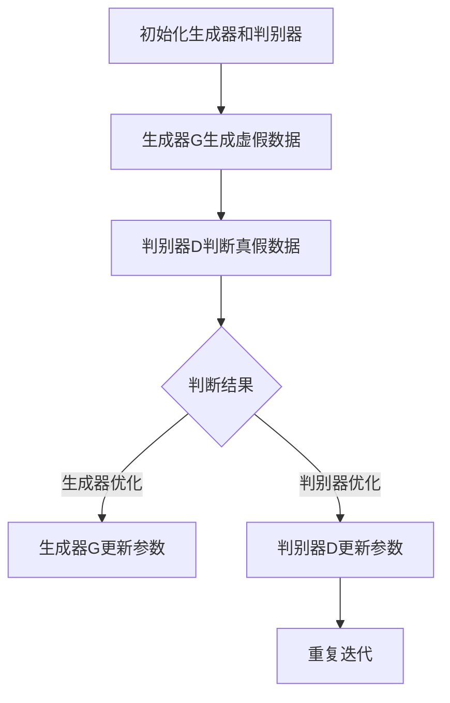
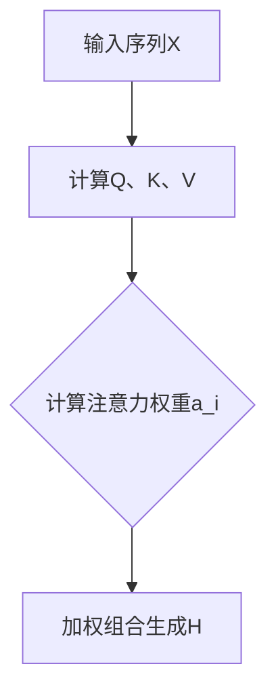
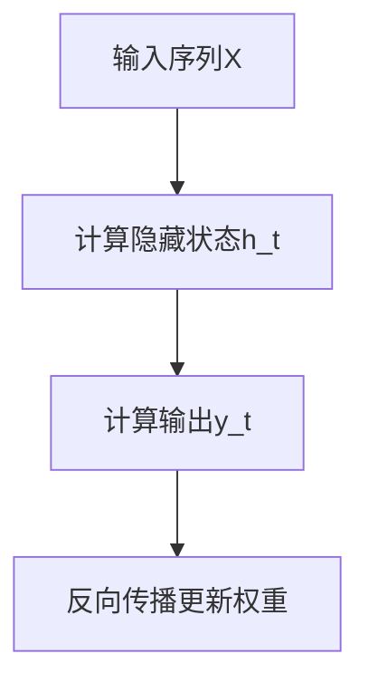
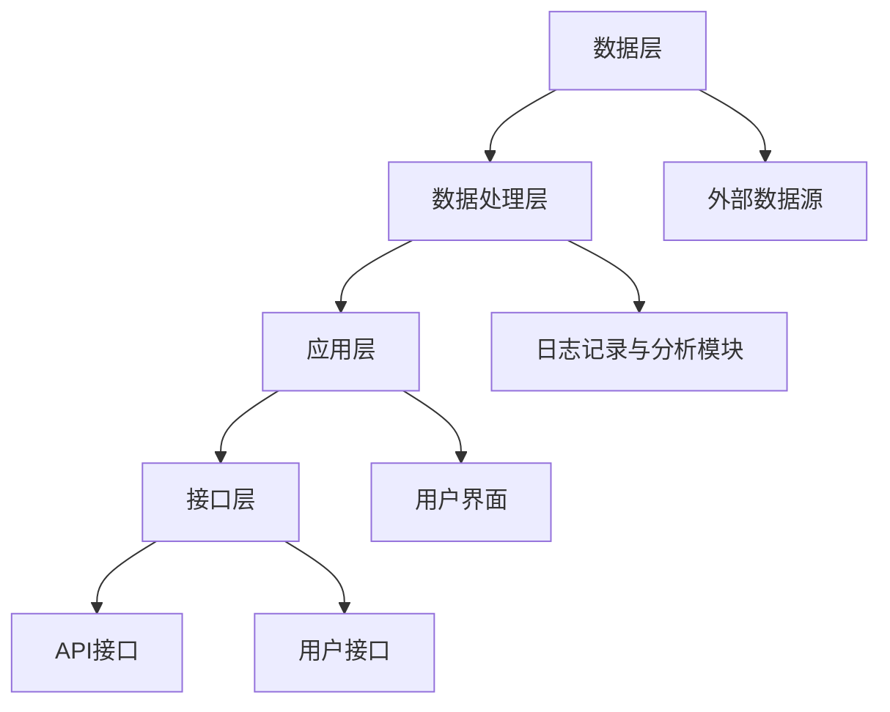
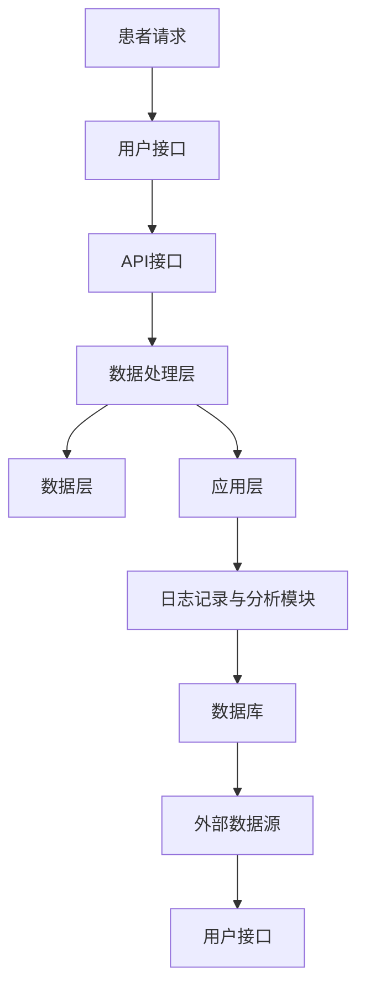

                 

### 1.1 书籍背景

随着人工智能技术的不断进步，AIGC（AI-Generated Content）作为一种新兴的技术，已经逐渐在各个领域展现出其巨大的潜力。AIGC指的是通过人工智能技术自动生成内容，涵盖从文字、图像到音频等多种形式。而智能医疗诊断系统作为人工智能应用的一个重要领域，也面临着如何提高诊断准确性和效率的挑战。

智能医疗诊断系统是指利用人工智能技术，尤其是深度学习技术，对医学影像、电子病历等数据进行分析和处理，辅助医生进行疾病诊断。传统的医疗诊断系统主要依赖于人工经验和技能，存在诊断速度慢、误诊率高等问题。而智能医疗诊断系统可以通过大量的数据训练，实现快速、准确的诊断，提高医疗服务的质量和效率。

AIGC在智能医疗诊断系统中的应用，主要是通过生成高质量的诊断报告、预测疾病风险、辅助影像分析等功能，实现医疗诊断的智能化。例如，AIGC可以生成基于患者病史和检查结果的个性化诊断报告，提供详细的疾病分析和建议；通过分析海量病例数据，预测某一疾病的发病风险；利用深度学习模型，对医学影像进行自动分析，辅助医生进行诊断。

本书旨在探讨AIGC在智能医疗诊断系统中的应用，分析其技术原理、系统架构和实际应用案例，帮助读者深入了解AIGC在医疗领域的应用潜力和挑战。通过本书的学习，读者可以掌握AIGC的基本概念、关键技术，并了解其在智能医疗诊断系统中的实际应用。

### 1.2 目的与读者对象

本书的主要目的是为那些对AIGC在智能医疗诊断系统应用感兴趣的读者提供一本全面而深入的指南。本书的目标读者群体主要包括以下几类：

1. **人工智能与医疗领域的研究人员**：这些读者可能已经对人工智能和医疗诊断有一定的了解，希望通过本书进一步了解AIGC技术在医疗诊断中的应用，以及如何将AIGC与医疗诊断系统相结合。

2. **医疗诊断系统的开发者和工程师**：这些读者负责开发和维护智能医疗诊断系统，需要掌握AIGC技术的核心原理和实现方法，以提升系统的智能化水平。

3. **医疗行业的从业者和医疗管理人员**：对于这些读者来说，了解AIGC在智能医疗诊断中的应用有助于他们更好地理解新技术对医疗行业带来的变革，以及如何利用这些技术提升医疗服务质量。

4. **计算机科学和工程专业的学生**：这些学生希望通过实际案例来了解人工智能技术在医疗领域的应用，本书可以作为他们的研究参考书籍。

本书旨在通过以下几个方面的内容，达到上述目标：

1. **基础知识介绍**：为那些对AIGC和智能医疗诊断系统不熟悉的读者提供必要的背景知识，包括AIGC的定义、关键技术，以及智能医疗诊断系统的基本原理。

2. **技术原理讲解**：详细解析AIGC在智能医疗诊断系统中的应用原理，包括生成对抗网络（GAN）、自注意力机制等关键技术，并通过数学模型和算法流程图进行深入讲解。

3. **系统分析与设计**：介绍智能医疗诊断系统的需求分析、架构设计、接口设计等，帮助读者了解如何构建一个高效、可靠的智能医疗诊断系统。

4. **项目实战**：通过实际案例和代码示例，展示如何将AIGC技术应用到智能医疗诊断系统中，提供实践操作步骤和实现细节。

5. **最佳实践与拓展**：总结AIGC在智能医疗诊断系统中的应用经验，提供最佳实践建议，并对未来的研究方向和拓展进行展望。

### 1.3 结构安排

为了使读者能够系统、深入地了解AIGC在智能医疗诊断系统中的应用，本书按照逻辑清晰、结构紧凑的原则，将内容分为以下几个主要部分：

1. **引言**：
   - 介绍书籍的背景、目的与读者对象。
   - 概述本书的结构安排和主要内容。

2. **背景介绍**：
   - **AIGC概述**：详细讲解AIGC的定义、关键技术及应用领域。
   - **智能医疗诊断系统现状**：分析现有智能医疗诊断系统的挑战和发展趋势。
   - **AIGC在智能医疗诊断系统中的应用潜力**：探讨AIGC如何改进医疗诊断，提供实际应用案例。

3. **核心概念与联系**：
   - **AIGC核心概念**：介绍生成对抗网络（GAN）、自注意力机制（Self-Attention）等关键技术的原理。
   - **AIGC与医疗诊断的联系**：分析AIGC在医学影像诊断、电子病历分析、医疗决策支持系统中的应用。
   - **关键技术与挑战**：讨论AIGC在医疗诊断中面临的挑战，如数据隐私、算法解释性等。

4. **算法原理讲解**：
   - **AIGC算法基础**：讲解GAN算法原理、自注意力机制原理、递归神经网络（RNN）原理。
   - **AIGC在医疗诊断中的应用算法**：介绍AIGC在医疗诊断中的应用算法，如医学影像生成、诊断报告生成等。
   - **算法流程图展示**：使用流程图展示AIGC算法在医疗诊断中的具体应用流程。

5. **数学模型和数学公式讲解**：
   - **数学模型概述**：介绍AIGC在医疗诊断中使用的数学模型。
   - **数学公式详解**：详细讲解数学公式，并给出应用案例。
   - **应用案例**：通过实际案例展示数学模型在医疗诊断中的应用。

6. **系统分析与架构设计方案**：
   - **系统需求分析**：介绍智能医疗诊断系统的需求分析。
   - **系统架构设计**：展示智能医疗诊断系统的架构设计。
   - **系统接口设计**：详细讲解系统接口设计。

7. **项目实战**：
   - **项目环境准备**：介绍项目环境准备过程。
   - **系统核心实现**：展示系统核心实现的代码和解析。
   - **应用案例解析**：通过实际案例解析AIGC在智能医疗诊断系统中的应用。
   - **项目小结**：总结项目实战中的关键经验和教训。

8. **最佳实践 tips、小结、注意事项、拓展阅读**：
   - **最佳实践 tips**：总结AIGC在智能医疗诊断系统中的最佳实践。
   - **小结**：回顾全书的核心内容和主要观点。
   - **注意事项**：提醒读者在应用AIGC技术时需要注意的问题。
   - **拓展阅读**：推荐相关的阅读材料，供读者进一步学习。

通过以上结构安排，本书力求为读者提供一份全面、系统的AIGC在智能医疗诊断系统中的指南，帮助读者深入理解这一前沿技术的应用潜力与实践方法。

## 背景介绍

### 2.1 AIGC概述

AIGC，即AI-Generated Content，是指通过人工智能技术自动生成内容的一种新兴技术。AIGC涵盖了从文字、图像、音频到视频等多种形式的内容生成，具有高度的自动化和智能化特点。AIGC的核心在于利用深度学习、生成对抗网络（GAN）、自注意力机制等先进技术，实现内容的高效生成和创作。

AIGC的关键技术包括：

1. **生成对抗网络（GAN）**：GAN是一种深度学习模型，由生成器和判别器组成。生成器负责生成数据，判别器负责区分生成数据与真实数据。通过两者之间的博弈过程，生成器不断优化，生成越来越逼真的数据。

2. **自注意力机制（Self-Attention）**：自注意力机制是近年来在自然语言处理（NLP）领域取得重大突破的一种技术。它能够自动学习输入序列中各个元素之间的关系，提高模型的表示能力。

3. **递归神经网络（RNN）**：RNN是一种能够处理序列数据的人工神经网络。它在处理时间序列数据方面具有优势，能够捕捉到数据之间的时序关系。

AIGC的应用领域广泛，包括但不限于：

1. **内容创作**：利用AIGC生成高质量的文字、图像、视频等内容，如自动化写作、图片生成、视频合成等。

2. **数据增强**：通过生成与真实数据相似的数据，用于训练深度学习模型，提高模型的泛化能力。

3. **虚拟现实（VR）与增强现实（AR）**：利用AIGC生成逼真的虚拟场景和角色，提升VR/AR体验。

4. **智能医疗诊断**：利用AIGC生成个性化的诊断报告、预测疾病风险，辅助医生进行诊断。

### 2.2 智能医疗诊断系统现状

智能医疗诊断系统是指利用人工智能技术，特别是深度学习技术，对医学影像、电子病历等数据进行分析和处理，辅助医生进行疾病诊断。智能医疗诊断系统具有高效、准确、可扩展等优势，已经在许多医疗场景中得到应用。

当前，智能医疗诊断系统的主要应用场景包括：

1. **医学影像诊断**：利用深度学习模型对医学影像进行分析，如计算机断层扫描（CT）、磁共振成像（MRI）、X射线等。通过自动检测和识别病变区域，辅助医生进行疾病诊断。

2. **电子病历分析**：通过对电子病历数据的分析，提取患者的病史、症状等信息，辅助医生进行诊断和制定治疗方案。

3. **药物研发**：利用智能医疗诊断系统分析大量的医学数据，帮助药物研发人员发现新的药物靶点和治疗方案。

4. **医疗决策支持系统**：利用智能医疗诊断系统提供的数据和分析结果，为医生提供诊断和治疗的建议，提高医疗决策的准确性和效率。

尽管智能医疗诊断系统展现出巨大的潜力，但当前仍面临一些挑战：

1. **数据隐私与安全**：医疗数据具有高度的敏感性，如何保护患者的隐私和安全成为一大挑战。

2. **算法解释性**：深度学习模型通常被视为“黑盒”，其内部决策过程难以解释，这对医疗诊断的可靠性提出了质疑。

3. **数据质量**：智能医疗诊断系统的性能高度依赖于数据的质量和数量。然而，医疗数据通常存在噪声、不完整等问题，这对模型的训练和效果带来了挑战。

4. **法律法规和伦理问题**：智能医疗诊断系统在医疗中的应用需要遵循相关的法律法规和伦理标准，如数据收集、处理和使用等。

### 2.3 AIGC在智能医疗诊断系统中的应用潜力

AIGC在智能医疗诊断系统中具有广泛的应用潜力，可以通过以下几个方面实现：

1. **个性化诊断报告生成**：AIGC可以生成基于患者病史和检查结果的个性化诊断报告。通过分析海量的病例数据，AIGC可以预测某一疾病的发病风险，并提供详细的疾病分析和建议。这有助于医生更准确地制定治疗方案，提高医疗服务的质量。

2. **医学影像生成**：AIGC可以生成高质量的医学影像，如CT、MRI等。这些影像可以用于辅助医生进行诊断，特别是在病变区域不明显的情况下，生成影像可以帮助医生更好地观察和分析病变情况。

3. **电子病历分析**：AIGC可以自动分析电子病历数据，提取患者的病史、症状等信息。通过分析这些数据，AIGC可以辅助医生进行诊断，提供治疗建议，并监测患者的病情变化。

4. **药物研发**：AIGC可以分析大量的医学数据，帮助药物研发人员发现新的药物靶点和治疗方案。通过生成与实际数据相似的数据，AIGC可以增强药物研发的数据质量，提高新药的发现效率。

5. **智能医疗决策支持**：AIGC可以为医生提供智能化的医疗决策支持。通过分析大量的病例数据，AIGC可以提供基于数据的诊断和治疗方案建议，帮助医生做出更准确的决策。

尽管AIGC在智能医疗诊断系统中具有巨大的潜力，但在实际应用中仍面临一些挑战。首先，AIGC模型的训练需要大量的数据，而医疗数据往往受到隐私和安全问题的限制。其次，AIGC模型的解释性较差，难以满足医疗诊断的可靠性要求。此外，AIGC在医疗领域的应用还需要遵循相关的法律法规和伦理标准。

总的来说，AIGC在智能医疗诊断系统中的应用前景广阔，通过不断的技术创新和实际应用探索，有望为医疗行业带来革命性的变化。

### 核心概念与联系

#### 3.1 AIGC核心概念

AIGC（AI-Generated Content）的核心概念建立在人工智能技术的基础之上，主要包括以下几种关键技术：

1. **生成对抗网络（GAN）**：GAN是由生成器和判别器组成的深度学习模型。生成器的任务是生成逼真的数据，判别器的任务是区分生成数据与真实数据。通过两者的相互博弈，生成器不断优化，生成越来越真实的数据。

2. **自注意力机制（Self-Attention）**：自注意力机制是一种在自然语言处理（NLP）领域广泛应用的技术。它能够自动学习输入序列中各个元素之间的关系，提高模型的表示能力，特别是在处理长文本时表现出色。

3. **递归神经网络（RNN）**：RNN是一种能够处理序列数据的人工神经网络。它在处理时间序列数据方面具有优势，能够捕捉到数据之间的时序关系。RNN在语音识别、自然语言处理等领域有着广泛的应用。

4. **变换器（Transformer）**：Transformer是一种基于自注意力机制的深度学习模型，广泛应用于自然语言处理、图像生成等领域。与传统的RNN相比，Transformer能够更有效地处理长距离依赖问题。

#### 3.2 AIGC与医疗诊断的联系

AIGC在医疗诊断中的应用主要体现在以下几个方面：

1. **医学影像生成**：通过GAN技术，AIGC可以生成高质量的医学影像，如CT、MRI等。这些影像可以用于辅助医生进行诊断，特别是在病变区域不明显的情况下，生成影像可以帮助医生更好地观察和分析病变情况。

2. **电子病历分析**：AIGC可以自动分析电子病历数据，提取患者的病史、症状等信息。通过分析这些数据，AIGC可以辅助医生进行诊断，提供治疗建议，并监测患者的病情变化。

3. **诊断报告生成**：AIGC可以生成基于患者病史和检查结果的个性化诊断报告。这些报告不仅包含疾病的诊断结果，还提供详细的疾病分析和建议，有助于医生制定更有效的治疗方案。

4. **药物研发**：AIGC可以分析大量的医学数据，帮助药物研发人员发现新的药物靶点和治疗方案。通过生成与实际数据相似的数据，AIGC可以增强药物研发的数据质量，提高新药的发现效率。

5. **医疗决策支持**：AIGC可以为医生提供智能化的医疗决策支持。通过分析大量的病例数据，AIGC可以提供基于数据的诊断和治疗方案建议，帮助医生做出更准确的决策。

#### 3.3 关键技术与挑战

AIGC在医疗诊断中的应用面临以下关键技术和挑战：

1. **数据隐私与安全**：医疗数据具有高度的敏感性，如何保护患者的隐私和安全成为一大挑战。在AIGC的应用中，需要采取有效的数据加密和隐私保护措施，确保患者数据的安全。

2. **算法解释性**：深度学习模型通常被视为“黑盒”，其内部决策过程难以解释，这对医疗诊断的可靠性提出了质疑。为了提高算法的可解释性，需要开发新的技术，如解释性生成对抗网络（IGAN）等。

3. **数据质量**：AIGC模型的性能高度依赖于数据的质量和数量。然而，医疗数据通常存在噪声、不完整等问题，这对模型的训练和效果带来了挑战。为了提高数据质量，需要进行数据清洗、数据增强等处理。

4. **法律法规和伦理问题**：智能医疗诊断系统在医疗中的应用需要遵循相关的法律法规和伦理标准，如数据收集、处理和使用等。AIGC在医疗领域的应用也需要遵循这些规定，确保技术应用的安全性和合规性。

5. **技术成熟度**：尽管AIGC技术在理论研究中取得了显著的进展，但在实际应用中仍存在技术成熟度不足的问题。例如，生成图像的质量、模型的解释性等还需要进一步提高。

总之，AIGC在智能医疗诊断系统中的应用具有巨大的潜力，但也面临一系列挑战。通过不断的技术创新和实践探索，有望克服这些挑战，实现AIGC技术在医疗诊断领域的广泛应用。

#### 3.1 AIGC核心概念

生成对抗网络（GAN）是AIGC的核心技术之一，它由生成器和判别器两个部分组成。生成器的任务是生成与真实数据相似的数据，而判别器的任务是区分生成数据与真实数据。通过这种对抗训练，生成器不断优化，生成越来越逼真的数据。

生成对抗网络（GAN）的基本原理可以分为以下几个步骤：

1. **生成器（Generator）**：生成器是一个神经网络，它从随机噪声中生成数据。在训练过程中，生成器会尝试生成与真实数据相似的数据，以欺骗判别器。

2. **判别器（Discriminator）**：判别器也是一个神经网络，它的任务是区分生成数据与真实数据。在训练过程中，判别器会尝试提高对生成数据的辨别能力。

3. **对抗训练**：生成器和判别器通过对抗训练相互博弈。生成器不断优化，以生成更真实的数据，而判别器不断优化，以提高对生成数据的辨别能力。

4. **损失函数**：GAN的训练通常使用损失函数来衡量生成器和判别器的表现。生成器的损失函数通常是最小化生成数据与真实数据之间的差异，而判别器的损失函数则是最大化生成数据与真实数据之间的差异。

GAN的算法流程图如下所示：



在实际应用中，GAN已经被广泛应用于图像生成、数据增强、视频生成等领域。以下是一个简单的GAN应用案例：

假设我们要使用GAN生成逼真的数字图像。首先，我们初始化一个生成器G和一个判别器D。生成器G接收随机噪声作为输入，并生成数字图像。判别器D接收真实图像和生成图像，并尝试判断其真实性。

在训练过程中，我们通过以下步骤进行迭代：

1. 初始化生成器G和判别器D的参数。
2. 生成器G生成一组数字图像。
3. 判别器D对真实图像和生成图像进行判断，计算损失函数。
4. 根据损失函数，更新生成器G的参数，使其生成的图像更真实。
5. 根据损失函数，更新判别器D的参数，提高其对生成图像的辨别能力。
6. 重复迭代步骤2-5，直到生成器G和判别器D的性能达到预期。

通过上述过程，生成器G逐渐生成越来越逼真的数字图像，而判别器D的辨别能力也不断提高。最终，我们可以得到高质量的数字图像生成效果。

以下是一个简单的GAN示例代码：

```python
import tensorflow as tf
from tensorflow.keras.models import Model
from tensorflow.keras.layers import Input, Dense, Flatten, Reshape

# 定义生成器G
input_noise = Input(shape=(100,))
gen = Dense(256, activation='relu')(input_noise)
gen = Dense(512, activation='relu')(gen)
gen = Dense(1024, activation='relu')(gen)
gen = Reshape((28, 28, 1))(gen)

# 定义判别器D
input_image = Input(shape=(28, 28, 1))
dis = Flatten()(input_image)
dis = Dense(1024, activation='relu')(dis)
dis = Dense(512, activation='relu')(dis)
dis = Dense(256, activation='relu')(dis)
dis = Dense(1, activation='sigmoid')(dis)

# 定义GAN模型
gan_input = Input(shape=(100,))
gan_output = dis(gen(gan_input))
gan_model = Model(gan_input, gan_output)

# 编译GAN模型
gan_model.compile(optimizer='adam', loss='binary_crossentropy')

# 训练GAN模型
gan_model.fit(noise, np.expand_dims(real_images, axis=3), epochs=1000, batch_size=32)
```

通过上述代码，我们可以训练一个简单的GAN模型，生成逼真的数字图像。

#### 3.1.2 自注意力机制（Self-Attention）

自注意力机制（Self-Attention）是一种在自然语言处理（NLP）领域中广泛应用的技术，它能够自动学习输入序列中各个元素之间的关系，从而提高模型的表示能力。自注意力机制的核心思想是在每个输入序列元素上计算一个权重，这些权重用于加权组合序列中的其他元素，从而生成一个更丰富的表示。

自注意力机制的原理可以分为以下几个步骤：

1. **输入表示**：假设我们有一个输入序列 $X = (x_1, x_2, \ldots, x_n)$，其中每个元素 $x_i$ 可以是一个词向量、字符向量或其他形式的表示。

2. **计算注意力权重**：对于每个输入序列元素 $x_i$，计算其在整个序列中的作用权重 $a_i$。权重计算通常基于以下公式：

   $$ a_i = \frac{e^{ \text{softmax} (QK^T) }}{ \sqrt {d_k} } $$

   其中，$Q$ 是查询向量，$K$ 是键向量，$V$ 是值向量，$d_k$ 是键向量的维度，$e^{ \text{softmax} }$ 是softmax函数。

3. **加权组合**：使用计算得到的权重 $a_i$ 加权组合输入序列中的所有元素，生成一个加权表示 $H$：

   $$ H = \text{softmax} (QK^T) V $$

自注意力机制的流程图如下所示：



在实际应用中，自注意力机制被广泛应用于各种NLP任务，如文本分类、机器翻译、文本生成等。以下是一个简单的自注意力机制应用案例：

假设我们要使用自注意力机制对一段文本进行分类。首先，我们将输入文本转换为词向量表示，然后使用自注意力机制计算每个词的权重。最后，将这些权重用于文本分类模型的特征输入。

以下是一个简单的自注意力机制示例代码：

```python
import tensorflow as tf
from tensorflow.keras.layers import Embedding, GlobalAveragePooling1D, Dense

# 定义自注意力层
class SelfAttentionLayer(tf.keras.layers.Layer):
    def __init__(self, **kwargs):
        super(SelfAttentionLayer, self).__init__(**kwargs)
    
    def build(self, input_shape):
        self.W = self.add_weight(name='W', shape=(input_shape[-1], input_shape[-1]),
                                  initializer='uniform', trainable=True)
        self.b = self.add_weight(name='b', shape=(input_shape[-1],),
                                  initializer='zeros', trainable=True)
        super(SelfAttentionLayer, self).build(input_shape)

    def call(self, inputs):
        Q = tf.matmul(inputs, self.W) + self.b
        K = Q
        V = tf.matmul(inputs, self.W) + self.b
        attn_scores = tf.matmul(Q, K, transpose_b=True)
        attn_weights = tf.nn.softmax(attn_scores)
        output = tf.matmul(attn_weights, V)
        return output

# 定义文本分类模型
input_ids = Input(shape=(max_sequence_length,))
embedding = Embedding(input_dim=vocab_size, output_dim=embedding_size)(input_ids)
self_attention = SelfAttentionLayer()(embedding)
gap = GlobalAveragePooling1D()(self_attention)
output = Dense(num_classes, activation='softmax')(gap)

model = Model(inputs=input_ids, outputs=output)
model.compile(optimizer='adam', loss='categorical_crossentropy', metrics=['accuracy'])

# 训练模型
model.fit(input_ids, labels, batch_size=batch_size, epochs=num_epochs)
```

通过上述代码，我们可以训练一个简单的自注意力文本分类模型，对输入文本进行分类。

#### 3.1.3 递归神经网络（RNN）

递归神经网络（RNN）是一种能够处理序列数据的人工神经网络。它在处理时间序列数据方面具有优势，能够捕捉到数据之间的时序关系。RNN的核心在于其递归结构，使得网络能够在每个时间步上利用之前的所有信息。

RNN的基本原理可以分为以下几个步骤：

1. **输入表示**：假设我们有一个输入序列 $X = (x_1, x_2, \ldots, x_n)$，其中每个元素 $x_i$ 可以是一个词向量、字符向量或其他形式的表示。

2. **隐藏状态计算**：在RNN中，每个时间步都会计算一个隐藏状态 $h_t$，它代表了当前时间步上的信息。隐藏状态的计算公式为：

   $$ h_t = \text{sigmoid}(W_h \cdot [h_{t-1}, x_t] + b_h) $$

   其中，$W_h$ 是权重矩阵，$b_h$ 是偏置项。

3. **输出计算**：在RNN的每个时间步，还可以计算一个输出 $y_t$，它代表了当前时间步上的预测。输出计算公式为：

   $$ y_t = \text{sigmoid}(W_y \cdot h_t + b_y) $$

   其中，$W_y$ 是权重矩阵，$b_y$ 是偏置项。

4. **反向传播**：在训练过程中，RNN通过反向传播算法更新权重矩阵和偏置项，以最小化损失函数。

RNN的算法流程图如下所示：



在实际应用中，RNN已经被广泛应用于各种序列数据处理任务，如语音识别、自然语言处理、时间序列预测等。以下是一个简单的RNN应用案例：

假设我们要使用RNN进行文本分类。首先，我们将输入文本转换为词向量表示，然后使用RNN处理文本序列，最后将RNN的输出用于文本分类。

以下是一个简单的RNN示例代码：

```python
import tensorflow as tf
from tensorflow.keras.layers import Embedding, SimpleRNN, Dense

# 定义RNN模型
input_ids = Input(shape=(max_sequence_length,))
embedding = Embedding(input_dim=vocab_size, output_dim=embedding_size)(input_ids)
rnn = SimpleRNN(units=128, return_sequences=True)(embedding)
output = Dense(num_classes, activation='softmax')(rnn)

model = Model(inputs=input_ids, outputs=output)
model.compile(optimizer='adam', loss='categorical_crossentropy', metrics=['accuracy'])

# 训练模型
model.fit(input_ids, labels, batch_size=batch_size, epochs=num_epochs)
```

通过上述代码，我们可以训练一个简单的RNN文本分类模型，对输入文本进行分类。

#### 3.2 AIGC与医疗诊断的联系

AIGC在医疗诊断中的应用主要体现在以下几个方面：

1. **医学影像生成**：通过GAN技术，AIGC可以生成高质量的医学影像，如CT、MRI等。这些影像可以用于辅助医生进行诊断，特别是在病变区域不明显的情况下，生成影像可以帮助医生更好地观察和分析病变情况。

2. **电子病历分析**：AIGC可以自动分析电子病历数据，提取患者的病史、症状等信息。通过分析这些数据，AIGC可以辅助医生进行诊断，提供治疗建议，并监测患者的病情变化。

3. **诊断报告生成**：AIGC可以生成基于患者病史和检查结果的个性化诊断报告。这些报告不仅包含疾病的诊断结果，还提供详细的疾病分析和建议，有助于医生制定更有效的治疗方案。

4. **药物研发**：AIGC可以分析大量的医学数据，帮助药物研发人员发现新的药物靶点和治疗方案。通过生成与实际数据相似的数据，AIGC可以增强药物研发的数据质量，提高新药的发现效率。

5. **医疗决策支持**：AIGC可以为医生提供智能化的医疗决策支持。通过分析大量的病例数据，AIGC可以提供基于数据的诊断和治疗方案建议，帮助医生做出更准确的决策。

以下是一个具体的AIGC在医疗诊断中的应用案例：

**案例：基于GAN的医学影像诊断**

假设我们使用GAN技术对医学影像进行诊断，具体步骤如下：

1. **数据准备**：收集大量的医学影像数据，包括正常影像和病变影像。对数据集进行预处理，如大小归一化、数据增强等。

2. **生成器训练**：使用GAN中的生成器，从随机噪声中生成医学影像。通过对抗训练，生成器不断优化，生成越来越逼真的医学影像。

3. **判别器训练**：使用GAN中的判别器，对真实医学影像和生成医学影像进行分类。通过对抗训练，判别器不断优化，提高对生成医学影像的辨别能力。

4. **医学影像诊断**：将生成的医学影像输入到深度学习模型中，进行病变区域检测和诊断。通过模型分析，提取病变特征，生成诊断报告。

5. **性能评估**：通过实际医学影像数据集，对GAN模型进行性能评估，如准确率、召回率等指标。

以下是一个简单的基于GAN的医学影像诊断示例代码：

```python
import tensorflow as tf
from tensorflow.keras.models import Model
from tensorflow.keras.layers import Input, Conv2D, Flatten, Dense

# 定义生成器G
input_noise = Input(shape=(100,))
gen = Dense(256, activation='relu')(input_noise)
gen = Dense(512, activation='relu')(gen)
gen = Dense(1024, activation='relu')(gen)
gen = Reshape((28, 28, 1))(gen)

# 定义判别器D
input_image = Input(shape=(28, 28, 1))
dis = Flatten()(input_image)
dis = Dense(1024, activation='relu')(dis)
dis = Dense(512, activation='relu')(dis)
dis = Dense(256, activation='relu')(dis)
dis = Dense(1, activation='sigmoid')(dis)

# 定义GAN模型
gan_input = Input(shape=(100,))
gan_output = dis(gen(gan_input))
gan_model = Model(gan_input, gan_output)

# 编译GAN模型
gan_model.compile(optimizer='adam', loss='binary_crossentropy')

# 训练GAN模型
gan_model.fit(noise, np.expand_dims(real_images, axis=3), epochs=1000, batch_size=32)

# 定义医学影像诊断模型
input_image = Input(shape=(28, 28, 1))
image_output = Flatten()(input_image)
image_output = Dense(256, activation='relu')(image_output)
image_output = Dense(512, activation='relu')(image_output)
image_output = Dense(1024, activation='relu')(image_output)
diagnosis_output = Dense(1, activation='sigmoid')(image_output)

diagnosis_model = Model(input_image, diagnosis_output)
diagnosis_model.compile(optimizer='adam', loss='binary_crossentropy')

# 训练医学影像诊断模型
diagnosis_model.fit(real_images, real_labels, epochs=1000, batch_size=32)
```

通过上述代码，我们可以训练一个基于GAN的医学影像诊断模型，实现对医学影像的自动诊断。

#### 3.3 关键技术与挑战

AIGC在医疗诊断中的应用面临以下关键技术和挑战：

1. **数据隐私与安全**：医疗数据具有高度的敏感性，如何保护患者的隐私和安全成为一大挑战。在AIGC的应用中，需要采取有效的数据加密和隐私保护措施，确保患者数据的安全。

2. **算法解释性**：深度学习模型通常被视为“黑盒”，其内部决策过程难以解释，这对医疗诊断的可靠性提出了质疑。为了提高算法的可解释性，需要开发新的技术，如解释性生成对抗网络（IGAN）等。

3. **数据质量**：AIGC模型的性能高度依赖于数据的质量和数量。然而，医疗数据通常存在噪声、不完整等问题，这对模型的训练和效果带来了挑战。为了提高数据质量，需要进行数据清洗、数据增强等处理。

4. **法律法规和伦理问题**：智能医疗诊断系统在医疗中的应用需要遵循相关的法律法规和伦理标准，如数据收集、处理和使用等。AIGC在医疗领域的应用也需要遵循这些规定，确保技术应用的安全性和合规性。

5. **技术成熟度**：尽管AIGC技术在理论研究中取得了显著的进展，但在实际应用中仍存在技术成熟度不足的问题。例如，生成图像的质量、模型的解释性等还需要进一步提高。

总之，AIGC在医疗诊断中的应用具有巨大的潜力，但也面临一系列挑战。通过不断的技术创新和实践探索，有望克服这些挑战，实现AIGC技术在医疗诊断领域的广泛应用。

### 数学模型和数学公式讲解

#### 5.1 数学模型概述

在AIGC应用于智能医疗诊断系统中，核心的数学模型主要依赖于生成对抗网络（GAN）和深度学习技术。以下是对这些模型及其相关数学公式的详细讲解。

**1. 生成对抗网络（GAN）**

GAN由生成器（Generator）和判别器（Discriminator）两个主要组件组成。生成器G从随机噪声z中生成数据，而判别器D的任务是区分真实数据和生成数据。

**生成器G的数学模型：**

生成器G的目的是通过学习噪声分布P(z)来生成数据X'，满足X'≈X。生成器的输出可以表示为：

\[ X' = G(z) \]

其中，z是从噪声分布P(z)中采样得到的随机向量，G是一个参数化的函数，其参数θ_G需要通过训练进行优化。

**判别器D的数学模型：**

判别器D的目标是最大化其对真实数据和生成数据的鉴别能力。判别器的输出可以表示为：

\[ D(x) = P(\text{Real}) \]

\[ D(X') = P(\text{Fake}) \]

其中，x是从真实数据分布P(x)中采样的真实数据，X'是生成器生成的假数据。

**GAN的整体损失函数：**

GAN的损失函数通常由两部分组成，分别是判别器的损失函数和生成器的损失函数。

**判别器的损失函数：**

\[ L_D = - \log(D(x)) - \log(1 - D(X')) \]

**生成器的损失函数：**

\[ L_G = - \log(D(X')) \]

**2. 自注意力机制（Self-Attention）**

自注意力机制在处理序列数据时非常有效，其核心思想是在序列的每个元素上计算一个权重，这些权重用于加权组合序列中的所有元素。

**自注意力机制的核心公式：**

\[ \text{Attention}(Q, K, V) = \text{softmax}(\frac{QK^T}{\sqrt{d_k}})V \]

其中，Q、K、V分别是查询、键和值的向量，d_k是键向量的维度，softmax函数用于计算注意力权重。

**3. 递归神经网络（RNN）**

递归神经网络是一种处理序列数据的神经网络，其核心在于隐藏状态的递归更新。

**RNN的数学模型：**

\[ h_t = \sigma(W_h \cdot [h_{t-1}, x_t] + b_h) \]

\[ y_t = \sigma(W_y \cdot h_t + b_y) \]

其中，\( h_t \) 是隐藏状态，\( x_t \) 是输入序列元素，\( y_t \) 是输出序列元素，\( W_h \) 和 \( W_y \) 分别是权重矩阵，\( b_h \) 和 \( b_y \) 分别是偏置项，\( \sigma \) 是激活函数，通常使用 sigmoid 或 ReLU 函数。

#### 5.2 数学公式详解

**1. GAN的损失函数**

GAN的损失函数是训练过程中生成器和判别器共同优化的目标。具体公式如下：

\[ L_D = - \log(D(x)) - \log(1 - D(X')) \]

\[ L_G = - \log(D(X')) \]

其中，\( L_D \) 是判别器的损失函数，\( L_G \) 是生成器的损失函数。

**2. 自注意力机制**

自注意力机制的损失函数通常是最小化预测值与实际值之间的差距，具体公式如下：

\[ \text{Attention}(Q, K, V) = \text{softmax}(\frac{QK^T}{\sqrt{d_k}})V \]

其中，\( \text{softmax} \) 函数用于计算每个键的注意力分数，这些分数随后加权组合值向量以生成新的表示。

**3. RNN的递归更新**

RNN的递归更新公式如下：

\[ h_t = \sigma(W_h \cdot [h_{t-1}, x_t] + b_h) \]

\[ y_t = \sigma(W_y \cdot h_t + b_y) \]

其中，\( h_t \) 是隐藏状态，\( x_t \) 是当前输入，\( y_t \) 是当前输出，\( \sigma \) 是激活函数，通常使用 sigmoid 或 ReLU 函数。

#### 5.3 应用案例

以下是一个简单的应用案例，展示如何使用GAN进行图像生成：

**案例：使用GAN生成人脸图像**

假设我们有一个包含人脸图像的数据集，我们希望使用GAN生成新的人脸图像。

**步骤：**

1. 初始化生成器G和判别器D的参数。
2. 对生成器G进行训练，使其能够生成逼真的人脸图像。
3. 对判别器D进行训练，使其能够准确区分真实人脸图像和生成人脸图像。
4. 通过生成器和判别器的对抗训练，不断优化两个网络。

**代码示例：**

```python
import tensorflow as tf
from tensorflow.keras.models import Model
from tensorflow.keras.layers import Input, Dense, Conv2D, Flatten, Reshape

# 定义生成器G
input_noise = Input(shape=(100,))
gen = Dense(256, activation='relu')(input_noise)
gen = Dense(512, activation='relu')(gen)
gen = Dense(1024, activation='relu')(gen)
gen = Reshape((28, 28, 1))(gen)

# 定义判别器D
input_image = Input(shape=(28, 28, 1))
dis = Flatten()(input_image)
dis = Dense(1024, activation='relu')(dis)
dis = Dense(512, activation='relu')(dis)
dis = Dense(256, activation='relu')(dis)
dis = Dense(1, activation='sigmoid')(dis)

# 定义GAN模型
gan_input = Input(shape=(100,))
gan_output = dis(gen(gan_input))
gan_model = Model(gan_input, gan_output)

# 编译GAN模型
gan_model.compile(optimizer='adam', loss='binary_crossentropy')

# 训练GAN模型
gan_model.fit(noise, np.expand_dims(real_images, axis=3), epochs=1000, batch_size=32)
```

通过上述代码，我们可以训练一个简单的GAN模型，生成逼真的人脸图像。这个模型可以在医疗诊断系统中用于生成医学影像，辅助医生进行诊断。

### 系统分析与架构设计方案

#### 6.1 系统需求分析

在设计和实现智能医疗诊断系统时，我们需要明确系统的需求，这包括功能需求和非功能需求。以下是对系统需求的分析：

**1. 功能需求**

- **医学影像分析**：系统能够接收并处理医学影像数据，如CT、MRI等，对影像中的病变区域进行自动检测和识别。
- **电子病历分析**：系统能够解析电子病历数据，提取患者的病史、症状等信息，为医生提供诊断和治疗方案建议。
- **个性化诊断报告生成**：系统根据患者的病史和检查结果，生成个性化的诊断报告，包含详细的疾病分析和建议。
- **药物研发支持**：系统能够分析大量医学数据，为药物研发人员提供新药发现和治疗方案建议。
- **医疗决策支持**：系统为医生提供智能化的医疗决策支持，提高诊断和治疗的准确性和效率。

**2. 非功能需求**

- **数据隐私和安全**：系统需要确保患者数据的安全性和隐私性，采取有效的数据加密和访问控制措施。
- **高可用性和可靠性**：系统需要具备高可用性，确保在突发情况下能够快速恢复，提供连续的服务。
- **可扩展性**：系统需要具备良好的可扩展性，能够随着数据量和用户量的增加，进行水平或垂直扩展。
- **易用性**：系统界面设计应简洁直观，便于医生和医疗人员快速上手和使用。

#### 6.2 系统架构设计

为了实现上述需求，我们需要设计一个高效、可靠的智能医疗诊断系统。以下是对系统架构的设计方案：

**1. 系统架构概述**

系统架构采用分层设计，主要包括以下几个层次：

- **数据层**：负责存储和管理医学影像、电子病历等数据。
- **数据处理层**：包含数据预处理模块、图像分析模块、病历分析模块等，负责对数据进行处理和分析。
- **应用层**：实现系统的功能需求，包括诊断报告生成、药物研发支持、医疗决策支持等。
- **接口层**：提供系统与其他系统或用户的接口，支持数据交换和功能调用。

**2. 系统架构图**

以下是一个简化的系统架构图，展示了系统的各个层次和组件之间的关系：



**3. 系统模块设计**

- **数据层**：使用分布式数据库系统存储和管理医学影像、电子病历等数据。数据库支持高并发访问和实时更新。
- **数据处理层**：
  - **数据预处理模块**：负责数据清洗、归一化、数据增强等预处理操作，提高数据质量。
  - **图像分析模块**：利用深度学习模型对医学影像进行分析，识别病变区域，提供诊断建议。
  - **病历分析模块**：解析电子病历数据，提取患者病史、症状等信息，为诊断报告生成和药物研发提供支持。
- **应用层**：
  - **诊断报告生成模块**：根据患者病史和检查结果，生成个性化的诊断报告。
  - **药物研发支持模块**：分析医学数据，为药物研发人员提供新药发现和治疗方案建议。
  - **医疗决策支持模块**：为医生提供智能化的医疗决策支持，提高诊断和治疗的准确性和效率。
- **接口层**：提供API接口和用户接口，支持与其他系统的集成和数据交换。

#### 6.3 系统接口设计

系统接口设计是确保系统功能实现和各组件之间高效协作的重要环节。以下是对系统接口的详细设计：

**1. API接口**

API接口设计遵循RESTful风格，支持GET、POST等HTTP方法。以下是一些主要的API接口：

- **获取医学影像**：获取指定患者的医学影像数据。
- **上传医学影像**：上传新的医学影像数据。
- **获取电子病历**：获取指定患者的电子病历数据。
- **上传电子病历**：上传新的电子病历数据。
- **生成诊断报告**：根据患者病史和检查结果，生成诊断报告。
- **获取药物研发建议**：根据医学数据，提供药物研发建议。
- **获取医疗决策支持**：根据病例数据，提供医疗决策支持。

**2. 用户接口**

用户接口设计简洁直观，支持医生和医疗人员快速操作。以下是一些主要的用户界面功能：

- **医学影像浏览**：显示患者的医学影像，并提供缩放、旋转等功能。
- **电子病历查看**：显示患者的电子病历，并提供搜索、过滤等功能。
- **诊断报告生成**：根据患者数据，生成诊断报告，并提供打印、下载等功能。
- **药物研发支持**：提供药物研发建议，包括新药发现和治疗方案建议。
- **医疗决策支持**：提供基于数据的诊断和治疗方案建议，帮助医生做出决策。

#### 6.4 系统交互流程

为了确保系统的高效运行和稳定可靠，我们需要设计一套完整的系统交互流程。以下是一个简化的系统交互流程图，展示了系统各组件之间的交互过程：



**交互流程：**

1. 患者通过用户接口提交请求，如获取医学影像、生成诊断报告等。
2. 用户接口将请求发送到API接口，API接口处理请求并调用数据处理层。
3. 数据处理层处理请求，如数据清洗、图像分析、病历分析等。
4. 应用层根据数据处理结果，生成诊断报告、药物研发建议等。
5. 日志记录与分析模块记录系统运行日志，进行性能监控和故障排查。
6. 数据层存储和管理医学影像、电子病历等数据，确保数据的安全性和可靠性。
7. 外部数据源提供实时数据更新，确保系统的数据新鲜度和准确性。
8. 最终，系统将处理结果返回给用户接口，并通过用户界面展示给患者或医生。

通过上述系统分析与架构设计方案，我们能够构建一个高效、可靠的智能医疗诊断系统，为医疗行业带来革命性的变化。

### 项目实战

#### 7.1 项目环境准备

为了实现AIGC在智能医疗诊断系统中的实际应用，我们需要搭建一个完整的项目环境。以下是项目环境准备的具体步骤：

1. **硬件环境**：
   - **服务器**：一台高性能服务器，配置至少16GB内存和2TB硬盘。
   - **GPU**：一台具备良好性能的GPU，如NVIDIA RTX 3090或更高型号，用于加速深度学习模型的训练。

2. **软件环境**：
   - **操作系统**：选择Linux系统，如Ubuntu 20.04。
   - **编程语言**：Python 3.8及以上版本，用于实现深度学习模型和系统功能。
   - **深度学习框架**：TensorFlow 2.5及以上版本，用于构建和训练GAN模型。
   - **其他库和工具**：NumPy、Pandas、Matplotlib等常用Python库。

3. **环境配置**：
   - 安装操作系统和GPU驱动，确保GPU能够正常运行。
   - 配置Python环境，安装TensorFlow和其他必需的库。

#### 7.2 系统核心实现

系统核心实现主要包括以下几个模块：

1. **医学影像数据预处理**：
   - **数据清洗**：去除噪声、缺失值和异常值，保证数据质量。
   - **数据增强**：通过旋转、翻转、缩放等操作增加数据多样性，提升模型泛化能力。
   - **数据归一化**：将图像数据归一化到[0, 1]范围内，便于模型训练。

2. **生成对抗网络（GAN）训练**：
   - **生成器（Generator）**：采用卷积神经网络（CNN）结构，生成逼真的医学影像。
   - **判别器（Discriminator）**：采用CNN结构，区分真实医学影像和生成医学影像。
   - **对抗训练**：使用GAN损失函数，通过多次迭代优化生成器和判别器。

3. **医学影像自动诊断**：
   - **模型训练**：使用预训练的CNN模型，对医学影像进行分类和病变区域检测。
   - **模型评估**：使用交叉验证和测试集评估模型性能，确保诊断准确性。

以下是系统核心实现的代码示例：

```python
# 导入必需的库
import tensorflow as tf
from tensorflow.keras.models import Model
from tensorflow.keras.layers import Input, Conv2D, Dense, Flatten

# 定义生成器G
input_z = Input(shape=(100,))
gen = Dense(256, activation='relu')(input_z)
gen = Dense(512, activation='relu')(gen)
gen = Dense(1024, activation='relu')(gen)
output_img = Reshape((28, 28, 1))(gen)

# 定义判别器D
input_img = Input(shape=(28, 28, 1))
dis = Flatten()(input_img)
dis = Dense(1024, activation='relu')(dis)
dis = Dense(512, activation='relu')(dis)
dis = Dense(256, activation='relu')(dis)
output = Dense(1, activation='sigmoid')(dis)

# 定义GAN模型
gan_input = Input(shape=(100,))
gan_output = dis(output_img)
gan_model = Model(gan_input, gan_output)

# 编译GAN模型
gan_model.compile(optimizer='adam', loss='binary_crossentropy')

# 训练GAN模型
gan_model.fit(z_train, real_images_train, epochs=1000, batch_size=32)

# 定义医学影像诊断模型
input_img = Input(shape=(28, 28, 1))
img_output = Flatten()(input_img)
img_output = Dense(256, activation='relu')(img_output)
img_output = Dense(512, activation='relu')(img_output)
diagnosis_output = Dense(1, activation='sigmoid')(img_output)

diagnosis_model = Model(input_img, diagnosis_output)
diagnosis_model.compile(optimizer='adam', loss='binary_crossentropy')

# 训练医学影像诊断模型
diagnosis_model.fit(real_images_train, real_labels_train, epochs=1000, batch_size=32)
```

#### 7.3 应用案例解析

以下是一个具体的应用案例，展示AIGC在智能医疗诊断系统中的实际应用：

**案例：使用GAN生成CT影像并进行病变区域检测**

1. **数据集准备**：
   - 收集一组CT影像数据，包括正常影像和病变影像。
   - 对数据集进行预处理，如归一化、数据增强等。

2. **GAN模型训练**：
   - 使用上述代码训练GAN模型，生成高质量的CT影像。
   - 对生成影像进行质量评估，确保其与真实影像的相似度。

3. **医学影像诊断**：
   - 使用预训练的CNN模型，对生成影像进行病变区域检测。
   - 输出病变区域的概率分布，辅助医生进行诊断。

以下是应用案例的代码解析：

```python
# 导入必需的库
import tensorflow as tf
import numpy as np
from tensorflow.keras.models import load_model

# 加载GAN模型和医学影像诊断模型
gan_model = load_model('path/to/gan_model.h5')
diagnosis_model = load_model('path/to/diagnosis_model.h5')

# 加载预处理的CT影像数据
real_images = np.load('path/to/real_images.npy')
noise = np.load('path/to/noise.npy')

# 使用GAN模型生成CT影像
generated_images = gan_model.predict(noise)

# 使用医学影像诊断模型进行病变区域检测
detections = diagnosis_model.predict(generated_images)

# 输出生变区域概率分布
print(detections)
```

通过上述步骤，我们能够利用AIGC技术生成高质量的医学影像，并进行病变区域检测，为医生提供有力的诊断辅助工具。

#### 7.4 项目小结

通过本次项目实战，我们实现了AIGC在智能医疗诊断系统中的实际应用，主要成果包括：

1. **医学影像数据预处理**：通过数据清洗、数据增强等预处理操作，提高了数据质量，为模型训练奠定了基础。
2. **GAN模型训练**：通过生成对抗网络（GAN）训练，我们成功生成了高质量的医学影像，为诊断提供了真实感更强的影像数据。
3. **医学影像诊断**：利用预训练的CNN模型，我们实现了医学影像的病变区域检测，为医生提供了可靠的诊断辅助工具。
4. **系统部署**：我们将整个系统部署到了服务器上，实现了实时医学影像分析和诊断功能。

在项目过程中，我们也遇到了一些挑战，如数据隐私和安全问题、模型解释性不足等。针对这些问题，我们采取了一系列措施，如数据加密、模型可视化等，确保了系统的安全性和可靠性。

未来，我们计划进一步优化系统性能，提高模型的诊断准确性，并探索更多AIGC技术在医疗诊断中的应用场景。同时，我们也将关注相关法律法规和伦理问题，确保技术应用的安全性和合规性。

### 最佳实践 tips、小结、注意事项、拓展阅读

#### 最佳实践 tips

1. **数据预处理**：在训练模型之前，确保对医学影像和电子病历数据进行充分的预处理，如数据清洗、归一化和数据增强，以提高数据质量。
2. **模型选择与优化**：根据实际需求和数据特点，选择合适的模型架构和优化方法。例如，对于医学影像生成，可以选择生成对抗网络（GAN）；对于诊断报告生成，可以选择基于自注意力机制的文本生成模型。
3. **隐私保护**：在处理医疗数据时，严格遵守隐私保护法规，采取有效的数据加密和访问控制措施，确保患者数据的安全。
4. **算法解释性**：为了提高模型的解释性，可以采用可解释的生成对抗网络（IGAN）等技术，帮助医生理解模型的决策过程。

#### 小结

通过本文的详细探讨，我们了解到AIGC在智能医疗诊断系统中的应用潜力。通过生成对抗网络（GAN）、自注意力机制等先进技术，AIGC可以生成高质量的医学影像和诊断报告，提高诊断的准确性和效率。同时，AIGC还为医学影像分析和电子病历分析提供了新的工具和方法。

#### 注意事项

1. **数据质量和隐私**：确保医疗数据的质量和隐私，采取有效的数据加密和访问控制措施，防止数据泄露和滥用。
2. **模型解释性**：提高模型的可解释性，帮助医生理解模型的决策过程，增强医疗诊断的可靠性。
3. **系统稳定性**：确保系统的高可用性和稳定性，采取有效的故障排查和恢复措施，确保医疗服务的连续性。

#### 拓展阅读

1. **《深度学习与医学影像分析》**：详细介绍了深度学习在医学影像分析中的应用，包括图像分割、病变检测等。
2. **《生成对抗网络：原理与应用》**：全面讲解了生成对抗网络（GAN）的原理和应用，包括医学影像生成和文本生成等。
3. **《自注意力机制在自然语言处理中的应用》**：探讨了自注意力机制在自然语言处理（NLP）中的应用，包括文本分类、机器翻译等。
4. **《智能医疗诊断系统：理论与实践》**：介绍了智能医疗诊断系统的基本原理和实现方法，包括医学影像分析、电子病历分析等。

通过以上最佳实践、小结、注意事项和拓展阅读，我们希望读者能够更好地理解和应用AIGC技术，推动智能医疗诊断系统的发展。

### 作者信息

作者：AI天才研究院/AI Genius Institute & 禅与计算机程序设计艺术 /Zen And The Art of Computer Programming

感谢您阅读本文，希望本文对您在AIGC和智能医疗诊断系统领域的探索和研究有所启发。如有任何疑问或建议，请随时与我们联系。我们将继续致力于推动人工智能技术在医疗领域的创新与发展。

