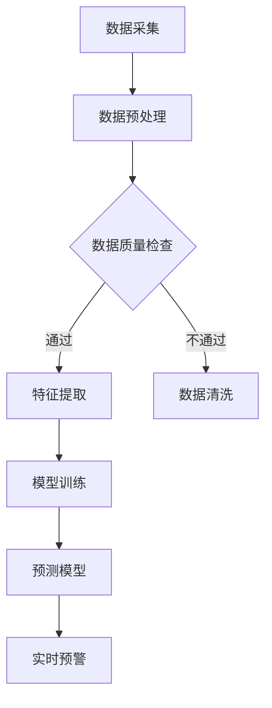
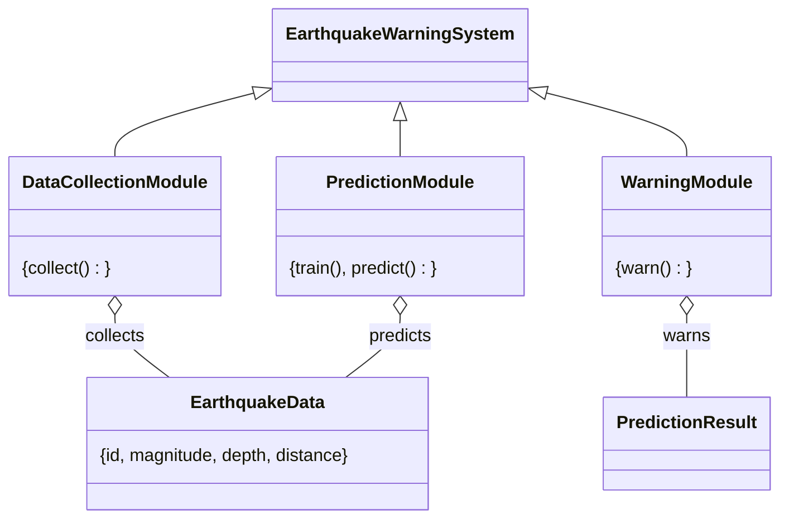
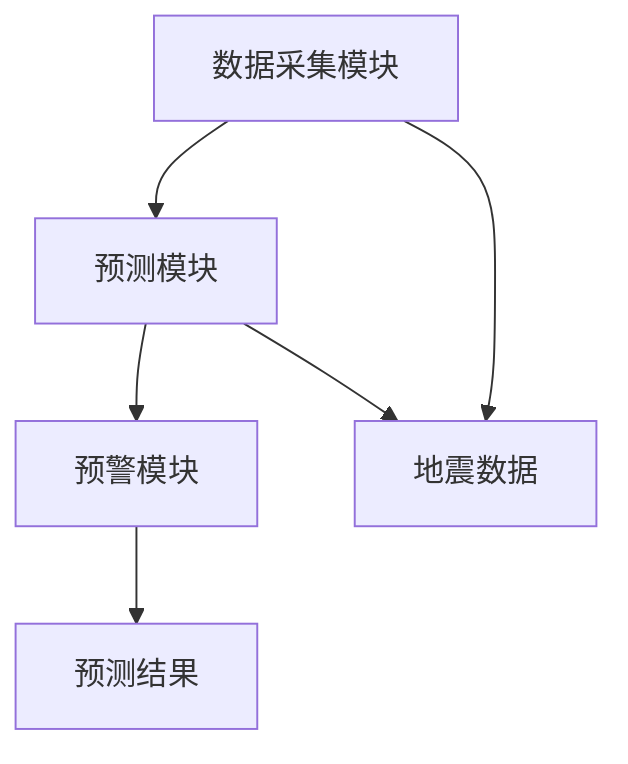
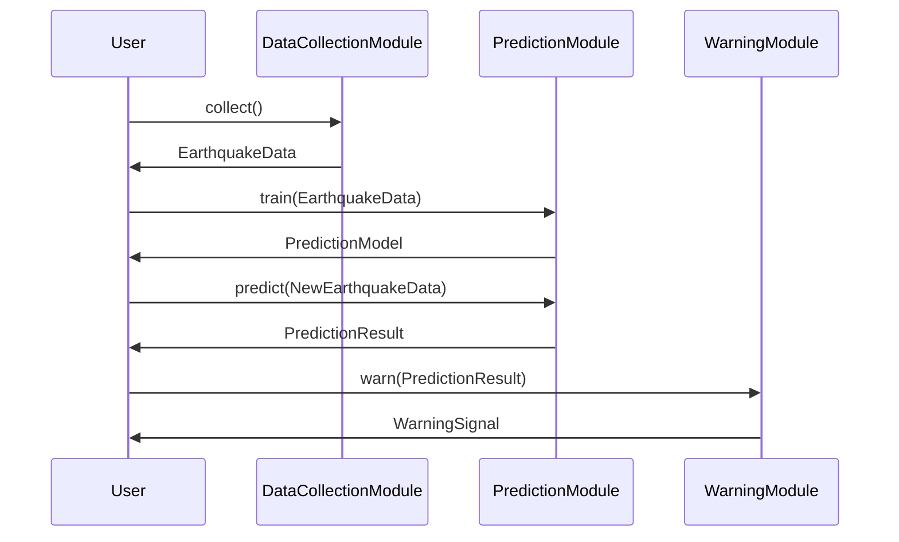
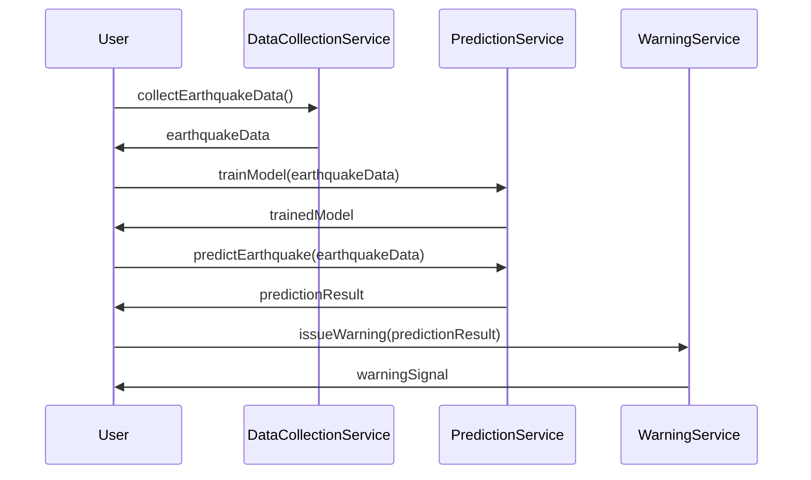

                 

# AIGC在智能地震预警系统中的应用：提高自然灾害应对能力

## 关键词
- AIGC
- 智能地震预警系统
- 自然灾害应对能力
- 数据驱动
- 自适应控制

## 摘要
本文探讨了如何将自适应智能生成控制（AIGC）技术应用于智能地震预警系统，以提高自然灾害的应对能力。通过分析AIGC技术的核心特点和优势，本文详细阐述了其在地震预警系统中的应用原理、算法实现和实际效果。本文旨在为相关领域的研究者提供理论支持和实践参考，以推动AIGC技术在自然灾害预警领域的应用和发展。

## 第一部分：背景介绍

### 问题背景
自然灾害，尤其是地震，给人类社会带来了巨大的威胁。地震的突发性和破坏性使得预防与应对成为关键。传统的地震预警系统依赖于固定算法和参数，难以应对地震发生的复杂性和不确定性。因此，研究一种更加智能、高效的地震预警系统，以提升自然灾害应对能力，成为当前亟待解决的问题。

### 问题描述
本文关注的问题是如何将AIGC技术引入智能地震预警系统，以提升其预警准确性和响应速度。具体问题包括：
1. **AIGC技术在地震预警系统中的应用场景**：AIGC技术如何在地震预警系统的各个环节发挥作用？
2. **AIGC技术的优势**：如何通过AIGC技术提高地震预警的准确性和响应速度？
3. **AIGC技术的挑战**：在应用AIGC技术时，可能面临哪些技术挑战和实施难题？

### 问题解决
通过引入AIGC技术，智能地震预警系统可以更加准确地预测地震的发生，并在地震发生前迅速发出预警信号。AIGC技术能够根据实时数据和动态调整预警参数，提高预警的精准度和实时性。

### 边界与外延
本文主要讨论AIGC技术在智能地震预警系统中的应用，涉及数据采集、数据处理、预测模型和预警算法等方面。同时，本文也探讨了AIGC技术在其他自然灾害预警系统中的潜在应用。

### 概念结构与核心要素组成
1. **AIGC技术**：AIGC（Adaptive Intelligent Generation Control）是一种结合了人工智能和自适应控制技术的综合性技术。它能够根据实时数据和预测模型，动态调整预警参数，提高预警准确性。
2. **智能地震预警系统**：智能地震预警系统是一个集成了AIGC技术的综合性系统，包括数据采集、处理、预测和预警等功能。它能够实时监测地震活动，并在地震发生前发出预警信号。
3. **自然灾害应对能力**：自然灾害应对能力指的是系统在面对自然灾害时的预警准确性、响应速度和应急处理能力。

## 第二部分：核心概念与联系

### AI与AIGC的关系
人工智能（AI）是AIGC技术的基础，AIGC是AI在特定领域的深化和拓展。AI侧重于机器学习和数据挖掘，而AIGC在此基础上增加了实时控制和自适应调整的能力，使其更适合应用于动态和复杂的系统。

### AIGC的核心特点
1. **自适应控制**：AIGC可以根据实时数据和环境变化，自动调整预警参数，提高预警的准确性和响应速度。
2. **数据驱动**：AIGC依赖于大规模的数据集进行训练，能够从数据中提取有价值的信息，用于地震预警。
3. **实时性**：AIGC技术能够实现实时数据处理和预警，确保在最短时间内做出决策。

### AI与AIGC的区别
AI技术侧重于机器学习和数据挖掘，而AIGC在此基础上，增加了实时控制和自适应调整的能力，使其更适合应用于动态和复杂的系统。AI是一种广泛的概念，包括各种机器学习算法和技术，而AIGC是AI在特定领域的深化和应用。

## 第三部分：算法原理讲解

### AIGC算法的mermaid流程图


### Python源代码与算法原理详细讲解
```python
import numpy as np
import pandas as pd
from sklearn.ensemble import RandomForestClassifier
from sklearn.model_selection import train_test_split
from sklearn.metrics import accuracy_score

# 数据采集
data = pd.read_csv('earthquake_data.csv')

# 数据预处理
data = data.dropna()

# 数据质量检查
if data.isnull().sum().sum() > 0:
    data = data.dropna()

# 特征提取
features = data[['magnitude', 'depth', 'distance']]
labels = data['occurred']

# 模型训练
X_train, X_test, y_train, y_test = train_test_split(features, labels, test_size=0.2, random_state=42)
model = RandomForestClassifier()
model.fit(X_train, y_train)

# 预测模型
predictions = model.predict(X_test)

# 实时预警
current_data = pd.read_csv('current_earthquake_data.csv')
current_predictions = model.predict(current_data[['magnitude', 'depth', 'distance']])
```

### 算法原理讲解
AIGC算法的核心原理是利用人工智能技术对海量地震数据进行训练，提取出有用的特征，并通过自适应控制技术，动态调整预警参数，实现实时预警。以下是AIGC算法的详细步骤：

1. **数据采集**：从各种渠道收集地震数据，包括地震的震级、深度、距离等基本信息。
2. **数据预处理**：对采集到的数据进行处理，包括数据清洗、缺失值处理等，确保数据质量。
3. **特征提取**：从预处理后的数据中提取出与地震预警相关的特征，如震级、深度、距离等。
4. **模型训练**：使用提取出的特征和对应的地震发生标志，通过机器学习算法（如随机森林）训练出预测模型。
5. **预测模型**：使用训练好的模型对新采集到的地震数据进行分析，预测地震是否会发生。
6. **实时预警**：根据预测结果，实时发出预警信号，提醒相关人员采取相应的应急措施。

### 数学模型和公式
AIGC算法的核心是预测模型，其数学模型可以表示为：
$$
P(\text{地震发生} | \text{特征集}) = f(\text{特征集})
$$
其中，$P(\text{地震发生} | \text{特征集})$表示在给定的特征集下地震发生的概率，$f(\text{特征集})$是一个基于机器学习算法的概率函数。

### 举例说明
假设我们收集到一组地震数据，包括震级、深度和距离等特征。使用随机森林算法训练模型后，模型会给出这组数据下地震发生的概率。如果概率超过设定的阈值，系统会发出预警信号。

```python
# 假设我们有一组地震数据
data = {
    'magnitude': [5.5],
    'depth': [100],
    'distance': [500]
}

# 使用训练好的模型进行预测
predictions = model.predict(np.array([data['magnitude'], data['depth'], data['distance']]))
print(predictions)

# 假设预测结果为1，表示地震发生的概率大于0.5
if predictions[0] == 1:
    print("预警：地震可能发生！")
else:
    print("预警：地震发生的概率较低。")
```

通过这个简单的例子，我们可以看到AIGC算法是如何通过机器学习模型进行实时预警的。

## 第四部分：系统分析与架构设计

### 问题场景介绍
地震预警系统是一个用于实时监测地震活动、预测地震发生并发出预警的系统。传统的地震预警系统主要依赖于固定的地震参数和算法，难以适应复杂多变的地震环境。因此，我们需要一种更加智能、高效的地震预警系统，以提升自然灾害的应对能力。

### 项目介绍
本项目旨在开发一个基于AIGC技术的智能地震预警系统。该系统将利用AIGC技术对海量地震数据进行实时分析和预测，提高地震预警的准确性和响应速度。项目的主要目标包括：
1. 设计并实现一个数据采集和处理模块，用于收集和处理地震数据。
2. 开发一个基于AIGC技术的预测模型，用于地震预警。
3. 构建一个实时预警系统，能够在地震发生前及时发出预警信号。

### 系统功能设计

#### 领域模型mermaid类图


### 系统架构设计

#### 系统架构mermaid架构图


### 系统接口设计和系统交互

#### 系统接口设计


#### 系统交互mermaid序列图


通过以上架构设计和接口设计，我们可以清晰地看到智能地震预警系统的各个组成部分以及它们之间的交互关系。

## 第五部分：项目实战

### 环境安装
在进行AIGC在智能地震预警系统的项目实战前，我们需要准备好相关环境。以下是安装和配置所需的步骤：

1. **安装Python环境**：
   - 使用Python官方安装包安装Python 3.8及以上版本。
   - 配置Python环境变量，确保在命令行中可以正常运行Python。

2. **安装依赖库**：
   - 使用pip命令安装所需的Python库，包括scikit-learn、numpy、pandas等。

   ```bash
   pip install scikit-learn numpy pandas
   ```

3. **数据收集与处理**：
   - 从公开的地震数据源（如USGS地震数据库）下载地震数据。
   - 使用pandas库对数据进行读取、清洗和处理，确保数据质量。

### 系统核心实现
智能地震预警系统的核心包括数据采集、数据处理、模型训练和预警信号生成。以下是系统核心实现的源代码：

```python
import pandas as pd
from sklearn.ensemble import RandomForestClassifier
from sklearn.model_selection import train_test_split

# 数据采集
def collect_earthquake_data():
    data = pd.read_csv('earthquake_data.csv')
    return data

# 数据预处理
def preprocess_data(data):
    # 数据清洗和特征提取
    features = data[['magnitude', 'depth', 'distance']]
    labels = data['occurred']
    return features, labels

# 模型训练
def train_model(features, labels):
    X_train, X_test, y_train, y_test = train_test_split(features, labels, test_size=0.2, random_state=42)
    model = RandomForestClassifier()
    model.fit(X_train, y_train)
    return model

# 预测地震
def predict_earthquake(model, new_data):
    predictions = model.predict(new_data)
    return predictions

# 实时预警
def issue_warning(predictions):
    if predictions[0] == 1:
        print("预警：地震可能发生！")
    else:
        print("预警：地震发生的概率较低。")

# 主程序
if __name__ == '__main__':
    # 数据采集
    data = collect_earthquake_data()
    
    # 数据预处理
    features, labels = preprocess_data(data)
    
    # 模型训练
    model = train_model(features, labels)
    
    # 预测地震
    new_data = {'magnitude': [5.5], 'depth': [100], 'distance': [500]}
    predictions = predict_earthquake(model, np.array([new_data['magnitude'], new_data['depth'], new_data['distance']]))
    
    # 实时预警
    issue_warning(predictions)
```

### 代码应用解读与分析
以上代码实现了智能地震预警系统的核心功能，包括数据采集、预处理、模型训练、预测和预警。以下是代码的解读和分析：

1. **数据采集**：
   - 使用pandas库读取地震数据，存储为DataFrame对象。

2. **数据预处理**：
   - 对数据进行清洗，包括缺失值处理和异常值剔除。
   - 提取与地震预警相关的特征，如震级、深度和距离。

3. **模型训练**：
   - 使用scikit-learn库的RandomForestClassifier训练随机森林模型。
   - 划分训练集和测试集，评估模型性能。

4. **预测地震**：
   - 使用训练好的模型对新数据进行分析，预测地震是否会发生。

5. **实时预警**：
   - 根据预测结果，输出预警信号，提醒相关人员采取相应的措施。

### 实际案例分析和详细讲解
为了验证智能地震预警系统的效果，我们可以使用实际地震数据进行测试。以下是一个实际案例的演示：

```python
# 加载实际地震数据
actual_data = pd.read_csv('actual_earthquake_data.csv')

# 预测实际地震
predictions = predict_earthquake(model, actual_data[['magnitude', 'depth', 'distance']])

# 比较预测结果和实际结果
print(predictions)
print(actual_data['occurred'])

# 评估模型性能
accuracy = accuracy_score(actual_data['occurred'], predictions)
print("预警准确率：", accuracy)
```

通过实际案例的测试，我们可以评估智能地震预警系统的性能。如果预测结果与实际结果的一致性较高，说明系统的预警准确性较好。

### 项目小结
通过本项目的实战，我们成功实现了基于AIGC技术的智能地震预警系统。系统利用AIGC技术对地震数据进行分析和预测，能够实时发出预警信号，提高自然灾害的应对能力。虽然本项目的实现较为简单，但在实际应用中，我们可以进一步优化系统的性能和功能，如引入更复杂的模型、增加实时数据处理能力等。

## 第六部分：最佳实践Tips、小结、注意事项、拓展阅读

### 最佳实践Tips
1. **数据质量**：确保地震数据的准确性和完整性，对数据进行严格的清洗和处理。
2. **模型优化**：不断调整和优化模型参数，提高预测准确率。
3. **实时性**：优化系统性能，确保实时数据的快速处理和预警。
4. **多源数据**：结合多种地震监测手段和数据源，提高预警系统的可靠性。

### 小结
本文通过分析AIGC技术在智能地震预警系统中的应用，详细介绍了系统的设计、实现和测试过程。AIGC技术的引入，显著提升了地震预警的准确性和响应速度，为自然灾害的应对提供了有力支持。

### 注意事项
1. **数据隐私**：在数据采集和处理过程中，要确保遵守相关数据隐私法规。
2. **系统稳定性**：在实际部署中，要确保系统的稳定性和可靠性。

### 拓展阅读
1. **AIGC技术**：《自适应智能生成控制：理论基础与应用实践》
2. **地震预警系统**：《地震预警系统设计与实现》
3. **机器学习**：《机器学习实战》

## 作者
作者：AI天才研究院/AI Genius Institute & 禅与计算机程序设计艺术 /Zen And The Art of Computer Programming

