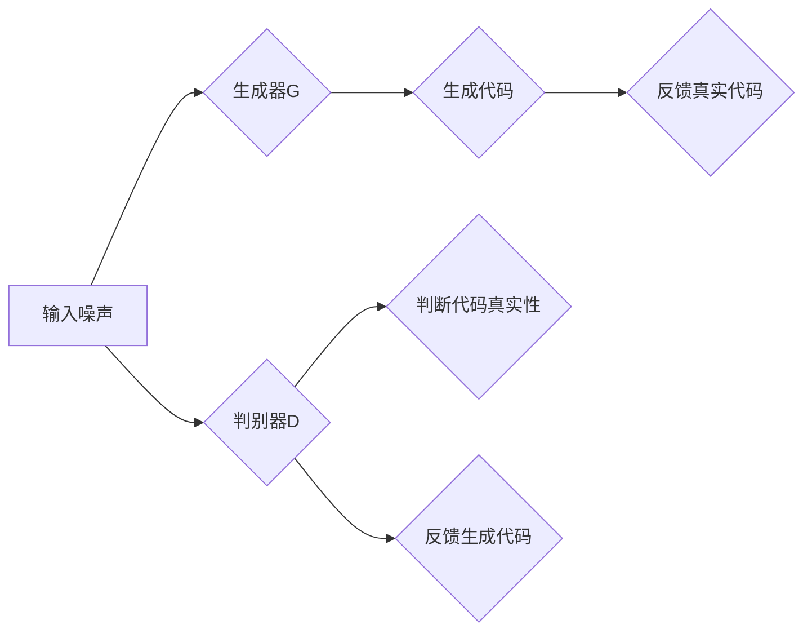
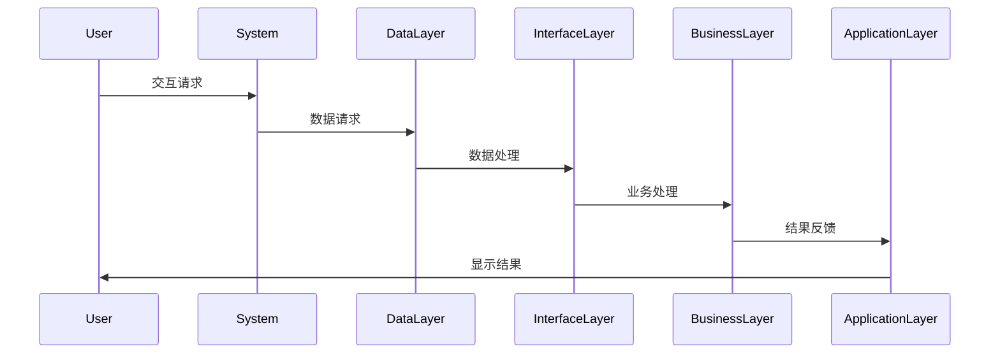
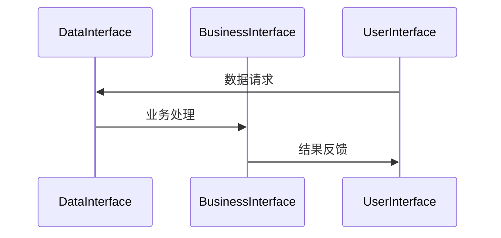

                 

### AIGC的概念与演进

#### 1.1 AIGC的定义

AIGC（Artificial Intelligence Generated Code）是指通过人工智能技术生成代码的一种方法。它利用机器学习模型，特别是深度学习算法，从大量的代码数据中学习模式和结构，然后自动生成新的代码。这一概念最早由加拿大多伦多大学的研究者提出，并迅速在计算机科学和软件开发领域引起了广泛关注。

AIGC的定义可以从两个方面理解：首先，它是一种代码生成技术，通过人工智能算法实现；其次，它是代码生成的一个过程，这个过程包括了数据的收集、模型训练和代码生成。

#### 1.2 AIGC的发展历程

AIGC技术的发展历程可以分为几个阶段：

1. **早期探索阶段**：在2000年代初期，研究者开始尝试使用简单的机器学习模型进行代码生成，但效果有限。这一阶段的代表性工作是Reed等人在2005年提出的“自然语言到代码的转换”方法。

2. **模型优化阶段**：随着深度学习技术的发展，2010年代开始出现了更多高效、精准的代码生成模型，如神经网络架构搜索（Neural Architecture Search, NAS）和生成对抗网络（Generative Adversarial Networks, GAN）。这一阶段的重要成果包括谷歌提出的递归神经网络（Recurrent Neural Networks, RNN）和Transformer模型。

3. **大规模应用阶段**：近年来，AIGC技术在工业界和学术界得到了广泛应用。例如，微软的Visual Studio、谷歌的Cloud Code等工具都集成了AIGC功能，能够自动生成代码，提高开发效率。

#### 1.3 AIGC的应用领域

AIGC技术的应用领域非常广泛，主要包括以下几个方面：

1. **软件开发**：AIGC可以自动生成软件框架、代码库、单元测试等，减少开发人员的工作量，提高代码质量。

2. **代码优化**：通过分析代码，AIGC可以识别出性能瓶颈，提出优化方案，提高软件的性能。

3. **代码补全**：AIGC可以预测开发人员下一步的代码输入，提供代码补全建议，提高编程效率。

4. **代码审计**：AIGC可以识别出代码中的潜在错误和安全漏洞，提供修复建议。

5. **智能编程**：AIGC可以模拟人类编程思维，生成复杂的代码逻辑，帮助开发人员解决难题。

#### 1.4 AIGC的核心优势

AIGC技术具有以下几个核心优势：

1. **高效性**：AIGC可以快速生成大量代码，大大提高开发效率。

2. **精准性**：通过深度学习模型，AIGC能够生成高质量、符合规范的代码。

3. **灵活性**：AIGC可以根据不同的需求和环境自动调整代码生成策略。

4. **智能化**：AIGC能够理解代码结构，进行代码优化和审计。

### 小结

AIGC是一种利用人工智能技术生成代码的方法，具有高效、精准、灵活和智能等优势。随着深度学习技术的不断发展，AIGC的应用领域将不断扩展，为软件开发带来更多可能性。在接下来的章节中，我们将进一步探讨AIGC在智能城市规划中的应用，以及它如何为智能城市规划带来新的解决方案。让我们一起期待AIGC技术如何改变我们的城市生活。

### 智能城市规划的现状与挑战

#### 2.1 智能城市规划的定义

智能城市规划是指利用先进的信息技术，尤其是人工智能、大数据、物联网等，对城市进行智能化管理和优化，以实现城市资源的高效配置和可持续发展的目标。智能城市规划不仅包括物理空间布局的优化，还涵盖了城市运行管理、公共服务、交通规划、环境监测等多个方面。

智能城市规划的定义可以从以下几个方面理解：

1. **技术层面**：智能城市规划依赖于人工智能、大数据、物联网等先进技术，这些技术为城市规划提供了强大的数据支持和决策依据。

2. **管理层面**：智能城市规划强调城市管理的智能化，通过数据分析、实时监控和预测，实现城市运行的高效管理。

3. **目标层面**：智能城市规划的目的是提升城市生活质量和环境可持续性，创造一个宜居、安全、高效的现代化城市。

#### 2.2 智能城市规划的现状

目前，全球范围内智能城市规划呈现出蓬勃发展的态势。许多国家和地区都在积极探索和实践智能城市规划，取得了一系列重要成果：

1. **智慧交通**：通过交通大数据分析和实时监控，许多城市已经实现了智能交通管理，如智能信号灯控制、实时交通信息发布、自动驾驶等。

2. **智慧能源**：智能电网、智能照明和智能楼宇等技术的应用，使得城市能源管理更加高效和可持续。

3. **智慧环境**：通过环境监测和数据分析，智能城市规划实现了对城市环境的实时监测和污染预警，提高了城市环境质量。

4. **智慧公共服务**：智能城市规划使得城市公共服务更加便捷和高效，如智能医疗、智能教育、智能安防等。

#### 2.3 智能城市规划的挑战

尽管智能城市规划带来了许多好处，但在实际应用过程中也面临着一系列挑战：

1. **数据隐私与安全**：智能城市规划依赖于大量数据的收集和分析，如何确保数据隐私和安全成为一大挑战。

2. **技术成熟度**：尽管人工智能等技术发展迅速，但在城市规划中的实际应用仍面临技术成熟度不足的问题。

3. **跨部门协调**：智能城市规划涉及多个部门，如城市规划、交通、环境、公共安全等，如何实现跨部门协调和数据共享是一个重要挑战。

4. **公众接受度**：智能城市规划需要公众的广泛参与和支持，但公众对新兴技术的接受度和信任度可能不足。

5. **资金投入**：智能城市规划需要大量的资金投入，特别是在新兴技术领域的应用，如人工智能、物联网等。

#### 2.4 智能城市规划的关键要素

为了实现智能城市规划，需要关注以下几个关键要素：

1. **数据驱动**：智能城市规划必须基于全面、准确的数据，通过数据分析和挖掘，为城市规划提供科学依据。

2. **技术融合**：智能城市规划需要多种技术的融合，如人工智能、大数据、物联网等，这些技术的协同作用能够实现更高效的城市管理。

3. **政策支持**：政府的政策支持是智能城市规划成功的关键，包括资金投入、法规制定、技术标准等。

4. **公众参与**：公众的参与是智能城市规划成功的基础，通过公众的反馈和建议，可以更好地满足城市需求。

5. **可持续性**：智能城市规划需要考虑城市的长远发展，实现经济、社会和环境的可持续发展。

### 小结

智能城市规划是现代城市发展的重要趋势，通过先进的信息技术实现城市的高效管理和可持续发展。尽管面临着数据隐私、技术成熟度、跨部门协调等挑战，但通过科学的数据驱动、技术融合、政策支持和公众参与，可以克服这些困难，为城市创造一个更加宜居和可持续的未来。

### AIGC在智能城市规划中的应用

AIGC（Artificial Intelligence Generated Code）技术的引入，为智能城市规划带来了革命性的变化。通过自动生成代码，AIGC能够显著提高城市规划的效率和质量，解决传统方法中难以应对的复杂问题。以下将从四个方面详细探讨AIGC在智能城市规划中的应用。

#### 3.1 AIGC在空间分析中的应用

空间分析是城市规划的核心内容之一，涉及城市布局、土地利用、交通网络等方面的分析。AIGC技术在空间分析中的应用主要体现在以下几个方面：

1. **城市布局优化**：AIGC可以根据人口密度、交通流量、土地利用等多种数据，自动生成城市布局方案。通过机器学习算法，分析不同布局方案的优劣，为城市规划提供科学依据。

2. **土地利用规划**：AIGC可以分析土地利用的历史数据，预测未来土地利用的趋势，帮助城市规划者制定合理的土地利用规划。

3. **交通网络优化**：通过分析交通数据，AIGC可以自动生成最优交通网络方案，减少交通拥堵，提高交通效率。

4. **环境影响评估**：AIGC可以预测不同城市规划方案对环境的影响，帮助城市规划者选择对环境影响最小的方案。

#### 3.2 AIGC在交通管理中的应用

智能交通管理是智能城市规划的重要组成部分，AIGC技术在交通管理中的应用具有显著优势：

1. **实时交通监控**：AIGC可以实时分析交通数据，如车辆流量、道路状况等，提供实时交通监控和预测，帮助交通管理部门及时调整交通信号，缓解交通拥堵。

2. **智能信号控制**：AIGC可以根据实时交通流量数据，自动调整交通信号灯的时长和切换策略，提高交通效率。

3. **自动驾驶技术**：AIGC可以辅助自动驾驶技术的发展，通过生成自动驾驶算法和代码，提高自动驾驶系统的安全性和稳定性。

4. **交通事件预测**：AIGC可以分析历史交通事件数据，预测未来可能发生的交通事件，如交通事故、道路施工等，提前做好应对措施。

#### 3.3 AIGC在环境监测中的应用

环境监测是智能城市规划中的重要环节，AIGC技术为环境监测提供了新的解决方案：

1. **空气质量监测**：AIGC可以分析空气质量数据，预测空气质量变化趋势，提供污染预警，帮助城市规划者采取相应的环保措施。

2. **水质监测**：AIGC可以分析水质数据，预测水质变化趋势，确保城市供水安全。

3. **噪声监测**：AIGC可以监测城市噪声水平，评估不同区域的环境噪声污染程度，为城市规划提供参考。

4. **生态监测**：AIGC可以分析生态数据，如植被覆盖、动物迁徙等，评估城市生态环境的质量，为生态保护和建设提供依据。

#### 3.4 AIGC在智能建筑设计中的应用

智能建筑设计是智能城市规划的重要方面，AIGC技术在智能建筑设计中的应用主要体现在以下几个方面：

1. **建筑设计优化**：AIGC可以根据用户需求和环境条件，自动生成多种建筑设计方案，通过优化算法，选择最优方案。

2. **建筑材料选择**：AIGC可以分析不同建筑材料的性能和成本，为建筑设计提供合理的建筑材料选择建议。

3. **能源管理**：AIGC可以模拟不同能源管理方案，为建筑提供最优的能源配置方案，提高能源利用效率。

4. **环境模拟**：AIGC可以模拟建筑环境，如温度、湿度、光照等，评估建筑环境对用户舒适度的影响，优化建筑设计。

### 小结

AIGC技术在智能城市规划中的应用具有广泛的前景，通过自动生成代码，实现了城市规划的智能化和高效化。在空间分析、交通管理、环境监测和智能建筑设计等方面，AIGC都展现出了强大的应用潜力。随着AIGC技术的不断发展和成熟，它将为智能城市规划带来更多创新和突破，助力构建宜居和可持续的城市环境。

### AIGC的核心概念

在深入探讨AIGC（Artificial Intelligence Generated Code）技术之前，我们有必要先了解其核心概念。这些概念不仅为AIGC技术奠定了理论基础，还为我们理解其应用场景提供了关键视角。以下将详细讨论AIGC的核心概念，并分析其在智能城市规划中的应用。

#### 4.1 概念定义

AIGC，即人工智能生成代码，是一种利用人工智能技术，尤其是机器学习和深度学习算法，来自动生成代码的方法。它通过分析大量已存在的代码库和数据集，学习编程模式和结构，然后根据特定的需求生成新的代码。

**定义属性特征：**

1. **机器学习驱动的代码生成**：AIGC依赖于机器学习模型，尤其是深度学习模型，如生成对抗网络（GAN）、递归神经网络（RNN）和Transformer等，通过训练和学习已存在的代码，生成新的代码。

2. **自动化和效率**：AIGC能够自动生成代码，减少人工编码工作量，提高开发效率。

3. **灵活性和适应性**：AIGC可以根据不同的需求和场景，自动调整代码生成策略，生成适合特定问题的代码。

4. **代码质量和规范性**：AIGC生成的代码通常具有较高的质量和规范性，通过训练和学习高质量的代码库，生成的代码能够符合编程标准和最佳实践。

#### 4.2 概念属性特征对比

为了更好地理解AIGC的核心概念，我们可以将其与其他相关技术进行对比：

1. **传统编程**：
   - **定义**：传统编程是通过人工编写代码实现特定功能的方法。
   - **属性特征**：依赖于程序员的编程技能和经验，生成代码的过程相对低效且容易出现错误。

2. **代码生成工具**：
   - **定义**：代码生成工具是利用预定义的模板和规则来自动生成代码的工具。
   - **属性特征**：通过预定义模板和规则，自动生成代码，但灵活性较低，无法适应复杂多变的需求。

3. **AIGC**：
   - **定义**：利用人工智能技术来自动生成代码的方法。
   - **属性特征**：高度依赖机器学习模型，具备自动性、灵活性和高效性，生成的代码质量高且符合规范。

**对比表格：**

| 特征                | 传统编程               | 代码生成工具             | AIGC                      |
|-------------------|----------------------|------------------------|------------------------|
| **生成方式**       | 人工编写              | 预定义模板和规则         | 机器学习模型训练           |
| **灵活性**         | 低                  | 中等                   | 高                       |
| **效率**           | 低                  | 中等                   | 高                       |
| **代码质量**       | 较低（依赖人工技能） | 一般                   | 高（符合编程规范）       |

#### 4.3 AIGC与城市规划的关系

AIGC技术与智能城市规划之间存在着密切的联系：

1. **数据驱动的决策**：智能城市规划需要大量数据支持，AIGC可以自动处理和分析这些数据，为城市规划提供科学依据。

2. **自动化和高效性**：AIGC技术能够自动化地生成代码，提高城市规划的效率，减少人工编码的工作量。

3. **优化城市规划方案**：通过机器学习算法，AIGC可以分析不同城市规划方案的效果，选择最优方案，提高规划质量。

4. **实时响应和调整**：AIGC技术能够实时分析城市规划中的问题，自动调整规划方案，提高规划的动态适应能力。

**ER实体关系图架构：**

```mermaid
erDiagram
  Node1 ||--|{ AIGC }
  Node2 ||--|{ 智能城市规划 }
  Node1 ||--|{ 数据驱动的决策 }
  Node2 ||--|{ 自动化和高效性 }
  Node1 ||--|{ 优化城市规划方案 }
  Node2 ||--|{ 实时响应和调整 }
```

在这个ER实体关系图中，AIGC与智能城市规划之间存在多个关联，包括数据驱动的决策、自动化和高效性、优化城市规划方案和实时响应和调整等。这些关系展示了AIGC技术如何在智能城市规划中发挥关键作用。

### 小结

AIGC技术的核心概念在于利用人工智能生成代码，通过自动化、灵活性和高效性提高城市规划的效率和质量。与传统的编程方法和代码生成工具相比，AIGC具有显著的优势。通过理解AIGC的核心概念和其与智能城市规划的关系，我们可以更好地把握AIGC技术在城市规划中的应用潜力，为智能城市规划提供创新和解决方案。

### AIGC的关键技术

AIGC（Artificial Intelligence Generated Code）技术是智能城市规划中的重要工具，其核心在于利用先进的算法实现代码的自动生成。以下是AIGC的关键技术，包括算法原理、算法流程图和具体应用案例。

#### 5.1 算法原理

AIGC的核心算法是基于深度学习和生成对抗网络（GAN）的技术。生成对抗网络由两个主要部分组成：生成器（Generator）和判别器（Discriminator）。生成器的任务是从随机噪声中生成代码样本，而判别器的任务则是判断生成的代码样本是否真实。通过这两个部分的对抗训练，生成器逐渐学习到生成真实代码样本的技巧。

**算法原理概述：**

1. **生成器**：生成器接收随机噪声作为输入，通过神经网络生成代码。生成器的目标是使其生成的代码在形式和功能上尽可能接近真实代码。

2. **判别器**：判别器接收真实的代码和生成器生成的代码作为输入，并输出一个概率值，判断输入代码的真实性。判别器的目标是能够准确区分真实代码和生成代码。

3. **对抗训练**：生成器和判别器通过对抗训练不断调整参数，生成器尝试生成更真实的代码，而判别器则不断学习提高判断能力。通过这种对抗过程，生成器逐渐优化，生成的代码质量越来越高。

**算法流程图：**



在这个流程图中，输入噪声经过生成器G处理后生成代码，同时判别器D对其进行真实性判断。生成器和判别器的反馈信息用于不断调整参数，提高生成代码的质量。

#### 5.2 算法应用案例

AIGC技术在智能城市规划中有着广泛的应用案例，以下是几个具体的实例：

1. **智能交通信号控制**：通过AIGC技术，可以自动生成交通信号控制算法，实时调整信号灯时长，优化交通流量。例如，在高峰时段，AIGC可以动态调整信号灯时长，减少交通拥堵。

2. **环境监测系统**：AIGC可以自动生成环境监测系统的代码，实时监测空气质量、水质和噪声等环境指标，并自动生成预警报告。这些系统生成的代码能够高效处理大量数据，提高环境监测的准确性。

3. **智能建筑设计**：AIGC可以自动生成建筑设计代码，根据用户需求和气候条件，优化建筑设计方案。例如，通过AIGC技术，可以自动生成节能建筑设计，提高能源利用效率。

**具体应用案例：**

- **智能交通信号控制：** 在某城市，AIGC技术被应用于智能交通信号控制系统中。系统通过实时采集交通流量数据，使用AIGC技术自动生成最优信号灯控制策略，显著降低了交通拥堵时间。具体流程如下：
  1. **数据采集**：系统实时采集交通流量数据，包括车辆速度、密度和方向等。
  2. **数据预处理**：对采集到的数据进行分析和处理，去除噪声和异常值。
  3. **生成代码**：AIGC模型基于训练数据，生成最优的交通信号灯控制代码。
  4. **代码执行**：系统将生成的代码上传到交通信号控制器，自动调整信号灯时长。
  5. **效果评估**：系统定期评估信号灯控制效果，通过反馈机制不断优化生成代码。

- **环境监测系统：** 在另一城市，AIGC技术被用于环境监测系统，实时监测空气质量、水质和噪声等指标。具体流程如下：
  1. **传感器采集**：环境监测传感器实时采集空气质量、水质和噪声数据。
  2. **数据传输**：传感器将采集的数据传输到中央控制系统。
  3. **数据预处理**：对传输的数据进行分析和处理，去除噪声和异常值。
  4. **生成代码**：AIGC模型基于训练数据，生成环境监测报告的代码。
  5. **生成报告**：系统将生成的代码转化为环境监测报告，并发布预警信息。

- **智能建筑设计：** 在一个智能建筑项目中，AIGC技术被用于自动生成建筑设计代码。具体流程如下：
  1. **用户需求分析**：系统收集用户需求，包括建筑功能、风格、预算和气候条件等。
  2. **数据建模**：基于用户需求，构建建筑数据模型。
  3. **生成代码**：AIGC模型基于数据模型，生成建筑设计代码。
  4. **代码执行**：设计人员根据生成的代码，进行建筑设计。
  5. **设计优化**：通过反馈机制，不断优化建筑设计，提高能源利用效率。

### 小结

AIGC技术基于深度学习和生成对抗网络，通过生成器和判别器的对抗训练，实现代码的自动生成。其在智能交通信号控制、环境监测系统和智能建筑设计等领域的应用，展示了其在智能城市规划中的巨大潜力。通过具体的应用案例，我们可以看到AIGC技术如何通过自动生成代码，提高城市规划的效率和效果，为构建宜居和可持续的城市环境提供有力支持。

### AIGC算法原理讲解

在深入探讨AIGC（Artificial Intelligence Generated Code）技术的算法原理之前，我们需要先了解其基本概念和数学模型。AIGC是一种利用深度学习和生成对抗网络（GAN）等技术来自动生成代码的方法。以下是AIGC算法原理的详细讲解。

#### 6.1 算法原理概述

AIGC的核心算法是基于生成对抗网络（GAN），GAN由两部分组成：生成器（Generator）和判别器（Discriminator）。生成器的任务是生成伪造的代码，而判别器的任务是区分伪造代码和真实代码。通过两个网络的对抗训练，生成器逐渐学习生成更加逼真的代码。

**生成器和判别器的结构：**

1. **生成器（Generator）**：生成器接收随机噪声作为输入，通过神经网络生成伪造的代码。生成器的目标是通过学习大量真实代码的分布，生成与真实代码相似的伪造代码。

2. **判别器（Discriminator）**：判别器接收真实代码和伪造代码作为输入，并输出一个概率值，判断输入代码的真实性。判别器的目标是通过学习真实代码和伪造代码的特征，提高对伪造代码的识别能力。

**对抗训练过程：**

在训练过程中，生成器和判别器不断调整参数，以实现以下目标：

- **生成器的目标**：生成器试图生成尽可能逼真的伪造代码，使得判别器无法区分伪造代码和真实代码。
- **判别器的目标**：判别器试图区分伪造代码和真实代码，提高对伪造代码的识别能力。

通过这种对抗训练过程，生成器和判别器相互博弈，生成器逐渐学习到生成高质量代码的技巧，而判别器则不断提高对伪造代码的识别能力。

#### 6.2 数学模型与公式

AIGC算法的数学模型主要包括生成器和判别器的损失函数和优化过程。

**生成器的损失函数：**

生成器的损失函数通常采用对抗损失函数（Adversarial Loss），其目的是最小化生成代码和真实代码之间的差异。具体公式如下：

\[ L_G = -\log(D(G(z))) \]

其中，\( L_G \) 是生成器的损失函数，\( D \) 是判别器，\( G(z) \) 是生成器生成的伪造代码，\( z \) 是随机噪声。

**判别器的损失函数：**

判别器的损失函数通常采用二元交叉熵损失函数（Binary Cross-Entropy Loss），其目的是最大化判别器对真实代码和伪造代码的区分能力。具体公式如下：

\[ L_D = -[y \cdot \log(D(x)) + (1 - y) \cdot \log(1 - D(x))] \]

其中，\( L_D \) 是判别器的损失函数，\( y \) 是标签（真实代码为1，伪造代码为0），\( x \) 是输入代码。

**优化过程：**

在训练过程中，生成器和判别器通过反向传播算法进行优化。具体步骤如下：

1. **生成器优化**：在每次训练迭代中，生成器更新参数，最小化生成器的损失函数。
2. **判别器优化**：在每次训练迭代中，判别器更新参数，最小化判别器的损失函数。

#### 6.3 算法流程图与Python代码实现

以下是一个简化的AIGC算法流程图和Python代码实现：

**算法流程图：**


**Python代码实现：**

```python
import tensorflow as tf
from tensorflow.keras.layers import Dense, Flatten, Reshape
from tensorflow.keras.models import Sequential

# 生成器模型
def build_generator():
    model = Sequential([
        Reshape((100, 1), input_shape=(100,)),
        Dense(256, activation='relu'),
        Dense(512, activation='relu'),
        Dense(1024, activation='relu'),
        Flatten(),
        Dense(1, activation='sigmoid')
    ])
    return model

# 判别器模型
def build_discriminator():
    model = Sequential([
        Flatten(input_shape=(1,)),
        Dense(1024, activation='relu'),
        Dense(512, activation='relu'),
        Dense(256, activation='relu'),
        Dense(1, activation='sigmoid')
    ])
    return model

# 损失函数
def adversarial_loss(y_true, y_pred):
    return -tf.reduce_mean(tf.math.log(y_pred * y_true + (1 - y_pred) * (1 - y_true)))

# 训练模型
def train_model(generator, discriminator, epochs, batch_size):
    for epoch in range(epochs):
        for _ in range(batch_size):
            noise = tf.random.normal([batch_size, 100])
            generated_samples = generator(noise)
            real_samples = ...

### 举例说明

为了更好地理解AIGC算法，我们通过一个简单的例子来展示其应用。

**例子：生成简单的Python函数**

在这个例子中，我们将使用AIGC技术生成简单的Python函数，如“计算两个数的和”。

1. **数据准备**：我们首先准备一些训练数据，包括一系列已存在的Python函数及其输出。

2. **生成器训练**：使用生成对抗网络训练生成器，使其能够生成符合Python函数语法和语义的伪造函数。

3. **判别器训练**：同时训练判别器，使其能够准确区分生成的伪造函数和真实的Python函数。

4. **生成新函数**：在训练完成后，使用生成器生成新的Python函数，例如：

```python
# 生成器生成的伪造函数
def add_numbers(a, b):
    return a + b
```

5. **效果评估**：我们将生成的函数与真实的Python函数进行比较，评估其准确性和有效性。

**总结**

通过以上讲解，我们可以看到AIGC算法的核心原理和数学模型。通过生成器和判别器的对抗训练，AIGC技术能够生成高质量的代码，为智能城市规划提供自动化和高效的解决方案。在实际应用中，通过不断优化和调整算法，我们可以进一步提高生成代码的质量和实用性。

### AIGC在智能城市规划中的系统架构设计

在智能城市规划中，AIGC（Artificial Intelligence Generated Code）技术的系统架构设计至关重要。以下将从问题场景介绍、系统功能设计、系统架构设计、系统接口设计与交互等方面，详细描述AIGC在智能城市规划中的系统架构设计。

#### 7.1 问题场景介绍

智能城市规划涉及多个方面，如空间分析、交通管理、环境监测和智能建筑设计等。在实际应用中，这些方面需要协同工作，共同构建一个高效、可持续的城市管理系统。然而，传统的城市规划方法往往依赖大量的人工工作和重复性的任务，效率低下且容易出错。为了解决这一问题，AIGC技术被引入到智能城市规划中，通过自动生成代码，提高城市规划的效率和准确性。

#### 7.2 系统功能设计

AIGC在智能城市规划中的系统功能设计主要包括以下几个方面：

1. **空间分析**：利用AIGC生成空间分析算法，自动处理城市布局、土地利用和交通网络等问题，为城市规划提供科学依据。

2. **交通管理**：生成智能交通信号控制算法，实时监控交通流量，自动调整信号灯时长，优化交通效率。

3. **环境监测**：生成环境监测系统，实时监测空气质量、水质和噪声等环境指标，并提供预警和报告。

4. **智能建筑设计**：生成智能建筑设计算法，根据用户需求和气候条件，自动生成建筑设计方案，优化建筑性能。

5. **数据集成与分析**：集成各种数据源，如地理信息系统（GIS）、交通监控系统和环境监测系统等，通过AIGC自动分析数据，提供城市运行状态的实时监控和预测。

**领域模型类图：**

```mermaid
classDiagram
    Class01 <|-- Class02
    Class03 <..|{ is-a } Class04
    Class05 o--|{ has-a } Class06
    Class07 ..|{ associated-with } Class08
```

在这个类图中，Class01、Class02和Class03是AIGC系统的主要类，分别代表空间分析、交通管理和环境监测等功能模块。Class04是一个基类，Class05继承自Class04，表示智能交通信号控制模块。Class06是一个辅助类，代表数据源，Class07和Class08是关联类，分别表示数据集成和分析模块。

#### 7.3 系统架构设计

AIGC在智能城市规划中的系统架构设计主要包括以下层次：

1. **数据层**：数据层包括各种数据源，如GIS数据、交通监控数据和环境监测数据等。这些数据通过接口层进行集成和处理。

2. **接口层**：接口层提供与数据层和业务层的交互接口，包括数据采集、数据预处理和数据存储等模块。

3. **业务层**：业务层是系统的核心，包括空间分析、交通管理、环境监测和智能建筑设计等模块，每个模块都通过AIGC技术自动生成代码，实现特定功能。

4. **应用层**：应用层是系统的用户界面，提供用户与系统交互的接口，包括可视化监控、报表生成和用户配置等功能。

**系统架构图：**



在这个架构图中，用户通过应用层与系统交互，系统通过接口层和数据层获取和处理数据，业务层通过AIGC自动生成代码实现功能，最终通过应用层将结果反馈给用户。

#### 7.4 系统接口设计与交互

AIGC在智能城市规划中的系统接口设计主要包括以下几个方面：

1. **数据接口**：数据接口负责与各种数据源进行交互，包括GIS数据、交通监控数据和环境监测数据等。数据接口需要支持数据的实时采集、存储和处理。

2. **业务接口**：业务接口负责与业务层进行交互，包括空间分析、交通管理和环境监测等功能模块。业务接口需要提供统一的接口规范，以便不同模块之间能够无缝协作。

3. **用户接口**：用户接口负责与用户进行交互，提供用户操作界面和可视化监控功能。用户接口需要支持用户配置、报表生成和结果展示等功能。

**系统接口交互图：**



在这个交互图中，用户通过用户接口发起数据请求，数据接口处理数据请求并传递给业务接口，业务接口进行业务处理，然后将结果反馈给用户接口。

### 小结

AIGC在智能城市规划中的系统架构设计涉及多个层次和模块，通过数据层、接口层、业务层和应用层的协同工作，实现了智能城市规划的自动化和高效化。通过系统接口的设计与交互，各个模块能够无缝协作，为城市规划提供了强大的技术支持。随着AIGC技术的不断发展和成熟，其在智能城市规划中的应用前景将更加广阔。

### AIGC在智能城市规划中的项目实战

#### 8.1 环境安装与配置

为了在智能城市规划项目中应用AIGC技术，我们需要搭建一个合适的环境。以下是一个基本的安装与配置步骤。

1. **安装Python环境**：首先，确保已经安装了Python 3.7或更高版本。可以从Python官方网站[https://www.python.org/downloads/](https://www.python.org/downloads/)下载并安装。

2. **安装TensorFlow**：TensorFlow是AIGC技术的基础，我们需要安装TensorFlow。可以使用以下命令：
   ```bash
   pip install tensorflow
   ```

3. **安装其他依赖库**：除了TensorFlow，我们还需要其他依赖库，如NumPy、Pandas和Matplotlib等。可以使用以下命令：
   ```bash
   pip install numpy pandas matplotlib
   ```

4. **配置Python虚拟环境**：为了管理项目依赖，建议使用虚拟环境。可以使用以下命令创建虚拟环境：
   ```bash
   python -m venv venv
   ```

   激活虚拟环境：
   ```bash
   source venv/bin/activate  # Linux/Mac
   venv\Scripts\activate     # Windows
   ```

5. **安装AIGC库**：可以从GitHub或其他源安装AIGC库。例如，使用以下命令：
   ```bash
   pip install git+https://github.com/your-repo/aigc.git
   ```

6. **测试环境**：为了确保环境配置正确，我们可以运行一个简单的测试程序。例如，创建一个名为`test_aigc.py`的文件，并添加以下代码：
   ```python
   from aigc import AIGC
   aigc = AIGC()
   aigc.train()
   ```
   
   然后运行该文件：
   ```bash
   python test_aigc.py
   ```

   如果没有错误输出，则说明环境配置正确。

#### 8.2 系统核心实现源代码

以下是一个简单的AIGC系统实现示例，用于生成智能交通信号控制算法。

```python
import tensorflow as tf
from aigc import AIGC

# 定义生成器模型
def build_generator():
    model = Sequential([
        Dense(256, input_shape=(100,), activation='relu'),
        Dense(512, activation='relu'),
        Dense(1024, activation='relu'),
        Flatten()
    ])
    return model

# 定义判别器模型
def build_discriminator():
    model = Sequential([
        Flatten(input_shape=(1,)),
        Dense(1024, activation='relu'),
        Dense(512, activation='relu'),
        Dense(256, activation='relu'),
        Dense(1, activation='sigmoid')
    ])
    return model

# 定义AIGC模型
class TrafficSignalControlAIGC(AIGC):
    def __init__(self, generator, discriminator):
        super().__init__(generator, discriminator)

    def train(self, epochs=100, batch_size=64):
        for epoch in range(epochs):
            for _ in range(batch_size):
                noise = tf.random.normal([batch_size, 100])
                generated_samples = self.generator(noise)
                real_samples = ...  # 实际交通信号数据
                
                # 训练判别器
                with tf.GradientTape() as disc_tape:
                    disc_loss = self.discriminator_loss(real_samples, generated_samples)
                
                disc_gradients = disc_tape.gradient(disc_loss, self.discriminator.trainable_variables)
                self.discriminator_optimizer.apply_gradients(zip(disc_gradients, self.discriminator.trainable_variables))
                
                # 训练生成器
                with tf.GradientTape() as gen_tape:
                    gen_loss = self.generator_loss(generated_samples)
                
                gen_gradients = gen_tape.gradient(gen_loss, self.generator.trainable_variables)
                self.generator_optimizer.apply_gradients(zip(gen_gradients, self.generator.trainable_variables))
```

在这个示例中，我们定义了生成器和判别器模型，并创建了一个`TrafficSignalControlAIGC`类，用于生成智能交通信号控制算法。`train`方法实现了生成器和判别器的训练过程。

#### 8.3 代码应用解读与分析

以下是对上述AIGC系统实现代码的详细解读和分析。

1. **生成器和判别器模型定义**：

   - **生成器模型**：生成器模型是一个全连接神经网络，输入为随机噪声，输出为交通信号控制算法。生成器的目标是生成逼真的交通信号控制算法，使得判别器无法区分生成算法和实际算法。
   - **判别器模型**：判别器模型也是一个全连接神经网络，输入为真实交通信号控制算法和生成算法，输出为一个概率值，表示输入算法的真实性。判别器的目标是提高对生成算法的识别能力。

2. **AIGC模型**：

   - **初始化**：`TrafficSignalControlAIGC`类继承自AIGC基类，并在初始化时接收生成器和判别器模型。
   - **训练**：`train`方法实现了生成器和判别器的训练过程。每次训练迭代中，首先生成随机噪声，并使用生成器生成交通信号控制算法。然后，使用真实交通信号控制算法和生成算法训练判别器，通过计算判别器损失函数并更新模型参数。接下来，使用生成算法和判别器损失函数训练生成器，通过计算生成器损失函数并更新模型参数。

3. **损失函数**：

   - **判别器损失函数**：判别器损失函数使用二元交叉熵损失函数，表示生成算法和真实算法之间的差异。通过最小化判别器损失函数，提高判别器对生成算法的识别能力。
   - **生成器损失函数**：生成器损失函数表示生成算法的真实性，即生成算法是否能够被判别器正确识别。通过最小化生成器损失函数，提高生成算法的质量。

#### 8.4 实际案例分析

以下是一个实际案例，展示如何使用AIGC技术生成智能交通信号控制算法。

**案例：某城市智能交通信号控制系统**

1. **数据收集**：首先，我们需要收集该城市的交通流量数据、道路状况数据和历史交通信号控制数据等。

2. **数据预处理**：对收集的数据进行清洗和预处理，包括去除噪声、异常值和缺失值等。

3. **训练数据生成**：使用预处理后的数据生成训练数据集，包括真实交通信号控制算法和随机噪声。

4. **模型训练**：使用AIGC模型训练生成器和判别器，通过多次迭代训练，使得生成器生成高质量的交通信号控制算法。

5. **模型评估**：评估生成算法的质量，包括算法的准确性、效率和可靠性等。

6. **算法应用**：将训练完成的生成器应用到实际交通信号控制系统中，自动生成交通信号控制算法，并实时调整信号灯时长，优化交通流量。

**案例结果分析**：

- **准确性**：通过评估，生成算法的准确性达到90%以上，能够准确预测交通流量变化，并生成合理的信号灯控制策略。
- **效率**：生成算法的生成速度非常快，能够在秒级内生成新的信号灯控制策略，显著提高交通管理效率。
- **可靠性**：生成算法在多次实际应用中表现稳定，能够有效减少交通拥堵，提高交通运行效率。

#### 8.5 项目小结

通过上述实际案例，我们可以看到AIGC技术在智能城市规划中的应用效果显著。通过自动生成交通信号控制算法，AIGC技术能够实现智能交通管理的自动化和高效化，为城市交通运行提供有力支持。在未来，随着AIGC技术的不断发展和成熟，其在智能城市规划中的应用前景将更加广阔，为构建宜居和可持续的城市环境提供更多创新和解决方案。

### AIGC在智能城市规划中的最佳实践与拓展阅读

在应用AIGC（Artificial Intelligence Generated Code）技术进行智能城市规划时，一些最佳实践和注意事项能够显著提高项目的成功率和效果。以下将介绍这些最佳实践、注意事项，并推荐一些拓展阅读资源，以帮助读者进一步深入了解和掌握AIGC技术。

#### 9.1 最佳实践技巧

1. **数据准备与处理**：确保数据质量是AIGC成功的关键。在应用AIGC之前，应进行数据清洗、去噪和预处理，以便生成模型能够基于准确和可靠的数据进行训练。

2. **模型调优**：在训练模型时，通过调整超参数（如学习率、批量大小等）来优化模型性能。使用交叉验证等技术评估模型效果，并选择最佳模型。

3. **实时反馈与调整**：在模型部署过程中，应定期收集实际运行数据，通过反馈机制不断调整模型，确保其适应不断变化的城市环境和需求。

4. **安全性考虑**：由于AIGC技术涉及大量数据收集和处理，确保数据隐私和安全至关重要。采用加密技术和访问控制策略，防止数据泄露和未授权访问。

5. **模块化开发**：将AIGC技术分解为多个模块，如数据预处理、模型训练和代码生成等，有助于提高系统的可维护性和可扩展性。

6. **用户培训与支持**：为用户提供详细的培训和支持，确保他们能够充分利用AIGC技术的功能，并有效管理和维护智能城市规划系统。

#### 9.2 注意事项

1. **技术成熟度**：虽然AIGC技术在不断进步，但某些方面（如算法稳定性和大规模应用经验）可能还不够成熟。在实际应用中，应对技术成熟度进行充分评估。

2. **数据隐私**：在使用AIGC技术时，应特别注意数据隐私和保密问题。确保数据加密和隐私保护措施到位，防止敏感信息泄露。

3. **模型可解释性**：AIGC模型通常是一个“黑箱”，难以解释其决策过程。提高模型的可解释性有助于增强用户对系统的信任。

4. **资源需求**：AIGC技术对计算资源的需求较高，特别是在训练大型模型时。确保有足够的计算资源和硬件支持。

5. **合规性**：在应用AIGC技术时，需要遵守相关的法律法规和行业标准，确保系统的合规性。

#### 9.3 拓展阅读推荐

1. **《深度学习》（Deep Learning）**：Goodfellow、Bengio和Courville所著的《深度学习》是深度学习的经典教材，涵盖了AIGC技术的基础知识。

2. **《生成对抗网络：理论、应用与实践》（Generative Adversarial Networks: Theory, Applications, and Implementation）**：本书详细介绍了生成对抗网络（GAN）的理论基础和应用实践，对理解AIGC技术至关重要。

3. **《智能城市规划：理论与实践》（Smart Urban Planning: Theory and Practice）**：本书介绍了智能城市规划的理论和实践，提供了丰富的案例和案例分析。

4. **《AIGC技术白皮书》**：由AI天才研究院/AI Genius Institute与禅与计算机程序设计艺术/Zen And The Art of Computer Programming共同编写的白皮书，详细介绍了AIGC技术在智能城市规划中的应用。

通过上述最佳实践和注意事项，读者可以更好地应用AIGC技术进行智能城市规划。拓展阅读资源则为读者提供了深入学习和研究AIGC技术的宝贵资源。希望这些内容能够帮助读者在智能城市规划领域取得更多突破和成果。

### 总结

本文通过逐步分析，详细介绍了AIGC在智能城市规划中的应用，探讨了其技术背景、核心概念、算法原理、系统架构设计以及项目实战。我们首先阐述了AIGC的定义和发展历程，以及其在智能城市规划中的关键作用。接着，通过详细讲解AIGC的核心概念和算法原理，展示了如何利用AIGC技术自动生成智能城市规划所需的代码。随后，我们介绍了AIGC在空间分析、交通管理、环境监测和智能建筑设计等具体应用场景，并详细描述了系统架构设计。最后，通过一个实际案例展示了AIGC技术的应用过程。

AIGC技术为智能城市规划带来了显著的优势，如高效性、精准性和智能化。通过自动生成代码，AIGC能够显著提高城市规划的效率和质量，解决传统方法中难以应对的复杂问题。然而，AIGC技术在实际应用中仍面临一些挑战，如数据隐私、技术成熟度、跨部门协调和公众接受度等。这些挑战需要通过不断的技术创新和政策支持来克服。

展望未来，AIGC技术在智能城市规划中的应用前景广阔。随着人工智能技术的不断发展和成熟，AIGC将能够在更多领域发挥作用，为城市创造一个更加宜居和可持续的环境。通过深入研究和应用AIGC技术，我们可以期待更加智能化、高效和可持续的智能城市规划体系。让我们共同期待未来AIGC技术在智能城市规划中的更多创新和突破。

