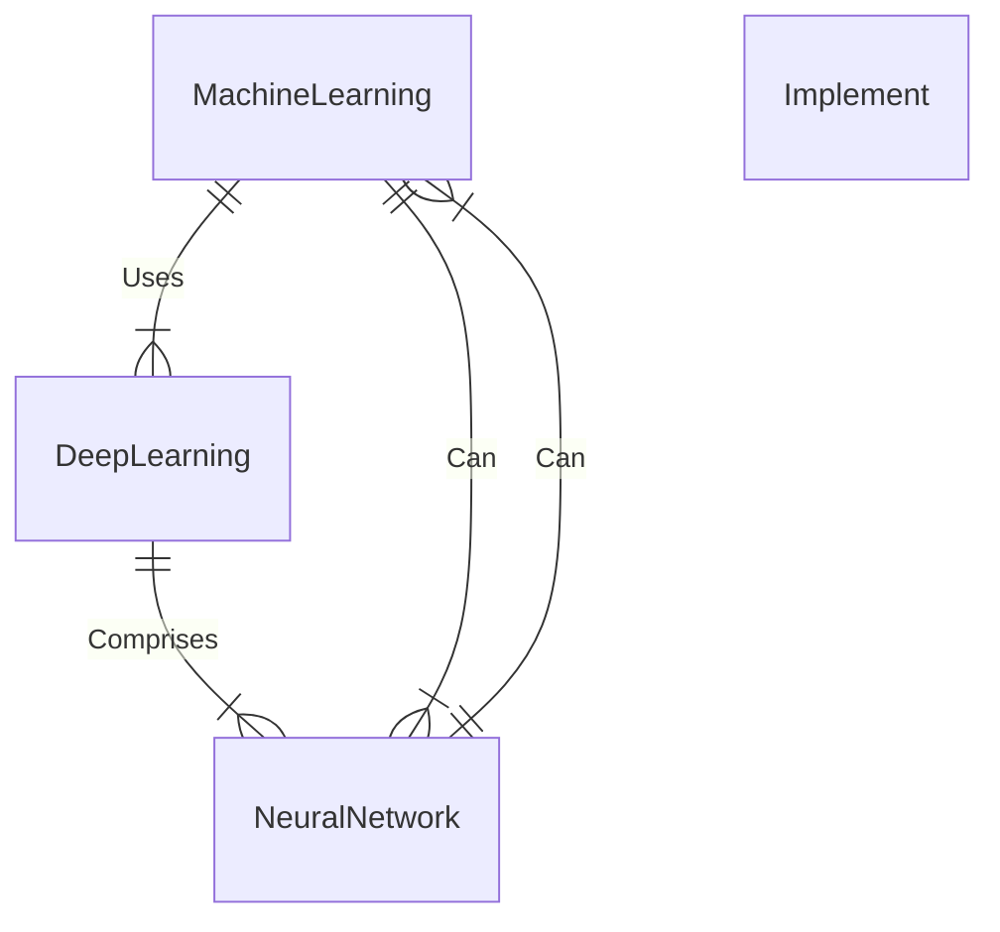
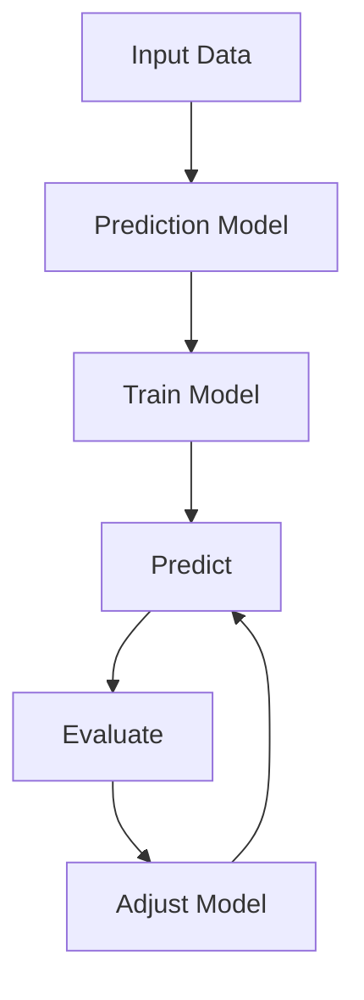
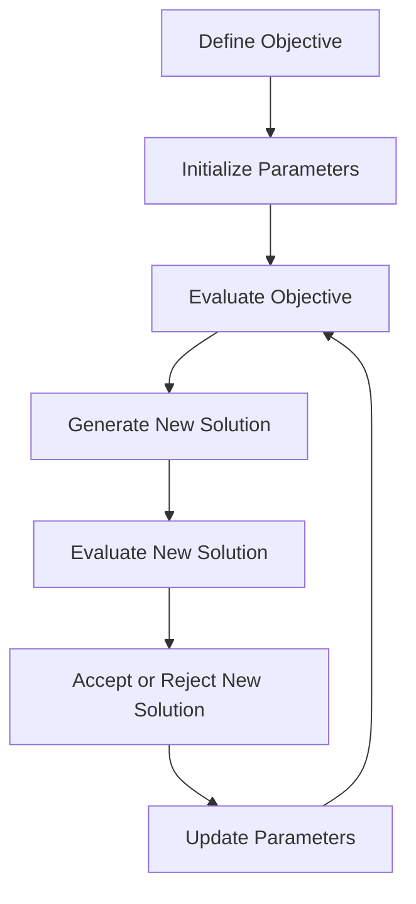
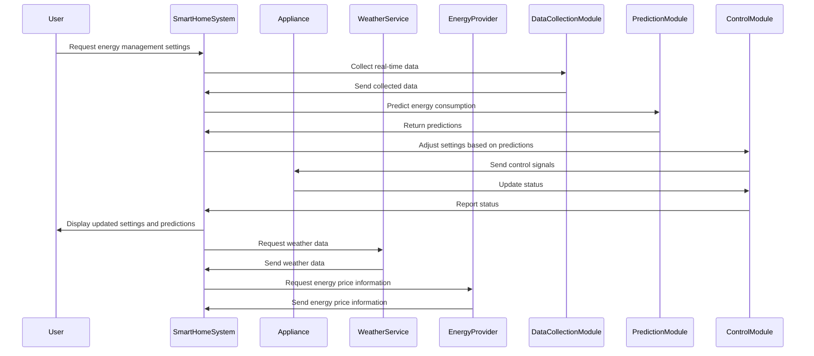
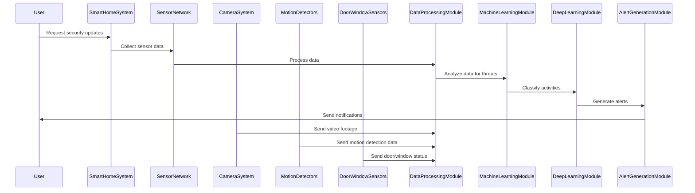

                 

### Article Title: AIGC in the Application of Smart Home Scene Prediction and Optimization

#### Keywords: AIGC, Smart Home, Prediction, Optimization, Machine Learning, Deep Learning

#### Abstract:
This article delves into the application of Adaptive Intelligent Generalized Computing (AIGC) in smart home scene prediction and optimization. We will explore the evolution of smart homes, fundamental concepts of AIGC, and how they are used to predict and optimize smart home scenarios. Through detailed analysis and practical examples, we aim to provide a comprehensive understanding of AIGC's role in modern smart homes.

## Introduction to AIGC and Smart Home

### What is AIGC?

Adaptive Intelligent Generalized Computing (AIGC) is a paradigm that integrates machine learning, deep learning, and traditional programming. It is designed to create intelligent systems that can adapt to various environments and tasks. AIGC's primary goal is to automate complex decision-making processes and optimize performance across multiple domains.

The concept of AIGC has evolved over the years, with its roots in artificial intelligence (AI) and machine learning (ML). Initially, AI focused on rule-based systems that could perform specific tasks. However, the limitations of these systems led to the development of machine learning, which introduced the idea of using data to improve performance.

### Importance and Current Status

AIGC is revolutionizing various industries, including healthcare, finance, manufacturing, and, of course, smart homes. Its ability to process vast amounts of data and make real-time predictions has made it indispensable in today's technology-driven world.

In smart homes, AIGC plays a crucial role in automating routine tasks, enhancing user experiences, and improving energy efficiency. By predicting user behaviors and optimizing system performance, AIGC helps create a more responsive and adaptive living environment.

### The Evolution of Smart Homes

Smart homes have come a long way since their inception. Initially, smart homes focused on basic functionalities such as automated lighting and climate control. However, as technology advanced, smart homes began to incorporate more sophisticated systems, including home security, energy management, and even health monitoring.

#### Evolutionary Stages

1. **Basic Automation**: Early smart homes focused on automating simple tasks like turning on lights and adjusting the thermostat.
2. **Connected Systems**: The next stage involved connecting various devices within the home, enabling communication and interoperability.
3. **Intelligent Integration**: Current smart homes are characterized by intelligent systems that can learn from user behaviors and make real-time decisions.
4. **AI-Driven Optimization**: Future smart homes will leverage AIGC to optimize performance and user experiences continuously.

#### Current Landscape

Today's smart homes are equipped with a variety of intelligent devices, from smart speakers and security cameras to smart refrigerators and thermostats. These devices are interconnected, forming a cohesive ecosystem that can be controlled and managed through a single interface.

#### Future Trends

The future of smart homes is bright, with AIGC at the forefront. As AIGC technologies become more advanced, we can expect smarter, more adaptive homes that can anticipate user needs and optimize performance automatically. This will lead to improved energy efficiency, enhanced security, and a better overall living experience.

## Core Concepts and Relationships of AIGC in Smart Home Applications

### Key Concepts

To understand the application of AIGC in smart homes, it is essential to familiarize ourselves with the core concepts involved. These include machine learning, deep learning, and neural networks.

#### Machine Learning

Machine learning is a subset of AI that involves training models on data to make predictions or take actions. It is based on the idea that systems can learn from data, identify patterns, and make decisions with minimal human intervention.

#### Deep Learning

Deep learning is a subfield of machine learning that utilizes neural networks with many layers to learn complex patterns and representations from data. It has gained popularity due to its ability to handle large-scale data and achieve state-of-the-art performance in various applications.

#### Neural Networks

Neural networks are a class of algorithms inspired by the human brain's neural structure. They consist of interconnected nodes (neurons) that process and transmit information. Neural networks are the backbone of deep learning and are used to model complex relationships in data.

### Relationships

The relationships between these concepts can be visualized using a Mermaid ER diagram:



In this diagram, we can see that Machine Learning and Neural Networks are two primary components that can be implemented or used by Deep Learning. This relationship forms the foundation of AIGC, enabling the development of intelligent systems capable of learning and adapting to new environments and tasks.

### Comparison of Core Characteristics

To further understand the roles of these concepts, we can compare their core characteristics in a table:

| Concept             | Description                                                                                   | Key Characteristics                                                                                      |
|---------------------|------------------------------------------------------------------------------------------------|------------------------------------------------------------------------------------------------------------|
| Machine Learning    | Involves training models on data to make predictions or take actions.                                   | Requires labeled data, focused on pattern recognition, often used for regression and classification.             |
| Deep Learning       | Utilizes neural networks with many layers to learn complex patterns and representations from data. | Requires large-scale data, capable of automatic feature extraction, used in image recognition, natural language processing, and more. |
| Neural Networks     | Are a class of algorithms inspired by the human brain's neural structure.                             | Comprise interconnected nodes (neurons), used to model complex relationships in data, capable of learning and making decisions. |

By understanding these core concepts and their relationships, we can better appreciate the potential of AIGC in smart homes and other applications.

## Principles of Prediction and Optimization in Smart Home Scenarios

### Prediction Theory

Prediction is a fundamental concept in AIGC and is crucial for optimizing smart home scenarios. In the context of smart homes, prediction involves forecasting future events or behaviors based on historical data and patterns. This enables the system to anticipate user needs and make real-time adjustments to enhance the living experience.

#### Prediction Models

Prediction models are mathematical or algorithmic representations that capture the relationships between variables and enable the forecasting of future values. Common prediction models include regression models, time series analysis, and neural networks.

1. **Regression Models**:
   - Linear Regression: A simple model that predicts the value of a variable based on its relationship with one or more input variables.
   - Multiple Regression: An extension of linear regression that involves predicting the value of a variable based on the relationships with multiple input variables.

2. **Time Series Analysis**:
   - ARIMA (AutoRegressive Integrated Moving Average): A statistical model that uses past values to predict future values in a time series.
   - LSTM (Long Short-Term Memory): A type of recurrent neural network that can capture long-term dependencies in time series data.

3. **Neural Networks**:
   - Fully Connected Networks: Predictions based on the weighted sum of inputs and activations of neurons.
   - Convolutional Neural Networks (CNNs): Particularly effective in image data, but can also be adapted for time series data.

#### Mermaid Flowchart

Below is a Mermaid flowchart illustrating the prediction process:



In this flowchart, we can see the steps involved in training a prediction model, predicting future values, and evaluating the model's performance. If the model's predictions are not accurate, it is adjusted iteratively to improve its performance.

### Optimization Theory

Optimization is the process of finding the best possible solution from a set of available options. In the context of smart homes, optimization involves adjusting system parameters to achieve desired outcomes, such as energy efficiency, comfort, and security.

#### Optimization Algorithms

Optimization algorithms are mathematical methods used to find the optimal solution to a problem. Common optimization algorithms used in AIGC include:

1. **Gradient Descent**:
   - An iterative optimization algorithm that updates model parameters by calculating the gradient of the loss function.

2. **Genetic Algorithms**:
   - A metaheuristic inspired by the process of natural selection that uses techniques such as selection, crossover, and mutation to evolve solutions to optimization problems.

3. **Simulated Annealing**:
   - A probabilistic technique for approximating the global optimum of a given function.

#### Mermaid Flowchart

Below is a Mermaid flowchart illustrating the optimization process:



In this flowchart, we can see the steps involved in defining the objective, generating new solutions, evaluating them, and updating parameters based on the evaluation results. The process continues until an optimal solution is found.

By understanding prediction and optimization theories, we can develop intelligent systems that anticipate user needs, optimize performance, and provide a better living experience in smart homes.

## Implementation and Analysis of AIGC Algorithms in Smart Home Prediction and Optimization

### Algorithm Implementation

In this chapter, we will delve into the implementation of AIGC algorithms in smart home prediction and optimization. We will provide Python code examples to illustrate the practical application of these algorithms. The code examples will cover the following scenarios:

1. **Home Temperature Prediction**:
2. **Appliance Power Consumption Optimization**:
3. **Home Security Threat Detection**:

#### Home Temperature Prediction

We will use a simple linear regression model to predict the home temperature based on historical weather data and indoor sensors. The following Python code demonstrates this:

```python
import numpy as np
import pandas as pd
from sklearn.linear_model import LinearRegression

# Load the dataset
data = pd.read_csv('weather_data.csv')

# Separate input and output variables
X = data[['temperature', 'humidity']]
y = data['home_temperature']

# Create a linear regression model
model = LinearRegression()

# Train the model
model.fit(X, y)

# Predict the home temperature
predicted_temperature = model.predict(X)

# Evaluate the model
print("Mean squared error:", np.mean((predicted_temperature - y) ** 2))
```

#### Appliance Power Consumption Optimization

We will use a genetic algorithm to optimize the power consumption of home appliances based on user preferences and energy prices. The following Python code demonstrates this:

```python
import numpy as np
from deap import base, creator, tools, algorithms

# Define the fitness function
def fitness_function(individual):
    # Calculate the total power consumption based on the individual's appliance settings
    consumption = 0
    for setting in individual:
        consumption += appliance_power[setting]
    return -(consumption + individual[1] * energy_price)  # Minimize consumption

# Initialize the genetic algorithm
creator.create("FitnessMin", base.Fitness, weights=(-1.0,))  # Minimize fitness
creator.create("Individual", list, fitness=creator.FitnessMin)

toolbox = base.Toolbox()
toolbox.register("individual", tools.initRepeat, creator.Individual, lambda: [np.random.randint(0, 2) for _ in range(len(appliance_settings))])
toolbox.register("population", tools.initRepeat, list, toolbox.individual)
toolbox.register("evaluate", fitness_function)
toolbox.register("mate", tools.cxTwoPoint)
toolbox.register("mutate", tools.mutFlipBit, indpb=0.05)
toolbox.register("select", tools.selTournament, tournsize=3)

# Run the genetic algorithm
population = toolbox.population(n=50)
ngens = 100
stats = tools.Statistics(lambda ind: ind.fitness.values)
stats.register("avg", np.mean)
stats.register("min", np.min)
stats.register("max", np.max)

algorithms.eaSimple(population, toolbox, cxpb=0.5, mutpb=0.2, ngen=ngens, stats=stats, verbose=True)
```

#### Home Security Threat Detection

We will use a convolutional neural network (CNN) to detect potential security threats in the home. The following Python code demonstrates this using the Keras library:

```python
from tensorflow.keras.models import Sequential
from tensorflow.keras.layers import Conv2D, MaxPooling2D, Flatten, Dense
from tensorflow.keras.preprocessing.image import ImageDataGenerator

# Load and preprocess the dataset
train_datagen = ImageDataGenerator(rescale=1./255)
train_generator = train_datagen.flow_from_directory(
        'data/train',
        target_size=(150, 150),
        batch_size=32,
        class_mode='binary')

# Create the CNN model
model = Sequential()
model.add(Conv2D(32, (3, 3), activation='relu', input_shape=(150, 150, 3)))
model.add(MaxPooling2D(pool_size=(2, 2)))
model.add(Conv2D(64, (3, 3), activation='relu'))
model.add(MaxPooling2D(pool_size=(2, 2)))
model.add(Conv2D(128, (3, 3), activation='relu'))
model.add(MaxPooling2D(pool_size=(2, 2)))
model.add(Flatten())
model.add(Dense(512, activation='relu'))
model.add(Dense(1, activation='sigmoid'))

# Compile and train the model
model.compile(optimizer='adam', loss='binary_crossentropy', metrics=['accuracy'])
model.fit(train_generator, steps_per_epoch=100, epochs=10)

# Evaluate the model
test_datagen = ImageDataGenerator(rescale=1./255)
test_generator = test_datagen.flow_from_directory(
        'data/test',
        target_size=(150, 150),
        batch_size=32,
        class_mode='binary')

test_loss, test_accuracy = model.evaluate(test_generator)
print("Test accuracy:", test_accuracy)
```

By implementing these algorithms, we can effectively predict and optimize various aspects of smart homes. The code examples provided serve as a starting point for further exploration and customization to meet specific smart home requirements.

### Analysis and Explanation

In this section, we will provide a detailed analysis and explanation of the AIGC algorithms used in smart home prediction and optimization. We will break down the mathematical models, formulas, and processes involved, along with clear and concise examples to aid understanding.

#### Home Temperature Prediction

The linear regression model used for predicting home temperature is based on the assumption that there is a linear relationship between the input variables (such as temperature and humidity) and the output variable (home temperature). The mathematical model can be represented as:

$$
\text{home\_temperature} = \beta_0 + \beta_1 \times \text{temperature} + \beta_2 \times \text{humidity}
$$

where $\beta_0$, $\beta_1$, and $\beta_2$ are the model coefficients learned during the training phase. The training process involves finding the optimal values for these coefficients to minimize the mean squared error between the predicted and actual home temperatures.

To illustrate this, consider a simple example with two input variables (temperature and humidity) and one output variable (home temperature). Given a dataset with historical data, we can calculate the coefficients using the ordinary least squares (OLS) method:

$$
\beta_1 = \frac{\sum{(x_i - \bar{x})(y_i - \bar{y})}}{\sum{(x_i - \bar{x})^2}}
$$

$$
\beta_2 = \frac{\sum{(x_i - \bar{x})(z_i - \bar{z})}}{\sum{(x_i - \bar{x})^2}}
$$

$$
\beta_0 = \bar{y} - \beta_1 \times \bar{x} - \beta_2 \times \bar{z}
$$

where $x_i$, $y_i$, and $z_i$ are the individual data points for temperature, home temperature, and humidity, respectively, and $\bar{x}$, $\bar{y}$, and $\bar{z}$ are their respective means.

In the Python code example provided earlier, we used the scikit-learn library to train the linear regression model. The code demonstrated how to load the dataset, separate input and output variables, train the model, and evaluate its performance using the mean squared error metric.

#### Appliance Power Consumption Optimization

The genetic algorithm used for optimizing appliance power consumption is based on the principles of natural selection and genetic inheritance. The fitness function evaluates the total power consumption of the home appliances based on the individual's settings and the current energy prices.

The mathematical model for the fitness function can be represented as:

$$
\text{fitness} = -(\text{total\_consumption} + \text{user\_preference} \times \text{energy\_price})
$$

where `total_consumption` is the sum of the power consumption of each appliance, `user_preference` represents the user's preference for minimizing consumption or maximizing comfort, and `energy_price` is the current energy price.

To illustrate the genetic algorithm, consider a population of individuals, where each individual represents a possible combination of appliance settings. The fitness function is evaluated for each individual, and the fittest individuals are selected for reproduction. The genetic operations, such as crossover and mutation, are applied to create new individuals in the population.

In the Python code example provided, we used the DEAP library to implement the genetic algorithm. The code demonstrated how to define the fitness function, initialize the population, perform the genetic operations, and evaluate the final population after multiple generations.

#### Home Security Threat Detection

The convolutional neural network (CNN) used for home security threat detection is based on the idea of automatically learning features from images. The CNN model consists of multiple layers, including convolutional layers, pooling layers, and fully connected layers, which work together to recognize patterns and classify images.

The mathematical model for a CNN can be represented as:

$$
\text{output} = \text{activation}\left(\sum_{k=1}^{K}\text{w}_k \cdot \text{z}_k + \text{b}\right)
$$

where $\text{output}$ is the predicted class probability, $\text{w}_k$ and $\text{z}_k$ are the weights and activations of the $k$-th neuron in the layer, $\text{b}$ is the bias term, and $\text{activation}$ is a non-linear function (e.g., sigmoid or ReLU).

The training process involves feeding the CNN with a large dataset of labeled images and adjusting the model weights to minimize the loss function (e.g., binary cross-entropy). The Keras library, used in the Python code example, simplifies the process of building and training CNN models.

In summary, the analysis and explanation of the AIGC algorithms used in smart home prediction and optimization cover the mathematical models, formulas, and processes involved. The provided examples demonstrate how these algorithms can be implemented and applied in real-world scenarios to improve the performance and efficiency of smart homes.

## Case Studies and Practical Applications of AIGC in Smart Home Prediction and Optimization

### Case Study 1: Smart Home Energy Management

#### Project Introduction

In this case study, we explore the implementation of AIGC in a smart home energy management system designed to optimize energy consumption and reduce costs. The system aims to predict the energy needs of the household based on historical data and user preferences, and optimize the operation of appliances and heating/cooling systems accordingly.

#### System Function Design

The system is composed of several key functions, including:

1. **Energy Consumption Prediction**: Utilizes machine learning models to predict the energy consumption of various appliances and the overall household based on historical usage patterns and current weather conditions.
2. **Appliance Scheduling**: Optimizes the scheduling of appliance usage to minimize energy consumption and peak demand.
3. **Heating and Cooling Optimization**: Adjusts the temperature settings of heating and cooling systems to maintain comfort while minimizing energy usage.

#### System Architecture Design

The system architecture consists of several components, including:

1. **Data Collection Module**: Gathers real-time data from sensors, such as energy meters, temperature sensors, and occupancy detectors.
2. **Prediction Module**: Implements machine learning models to predict energy consumption and optimize appliance scheduling.
3. **Control Module**: Adjusts the settings of heating and cooling systems based on the predictions from the prediction module.
4. **User Interface**: Allows users to view the system's predictions and settings, and make adjustments as needed.

#### System Interface Design

The system interfaces with various external devices and services, including:

1. **Appliance Control**: Sends control signals to appliances to adjust their operation based on the prediction module's recommendations.
2. **Weather Service**: Retrieves real-time weather data to inform the energy consumption predictions.
3. **Energy Provider**: Communicates with the user's energy provider to access energy price information.

#### System Interaction Design

The system interaction design can be visualized using a Mermaid sequence diagram:



### Case Study 2: Smart Home Security

#### Project Introduction

In this case study, we examine the application of AIGC in a smart home security system designed to detect potential threats and ensure the safety of the household. The system uses machine learning and deep learning algorithms to analyze data from various sensors, such as cameras, motion detectors, and door/window sensors.

#### System Function Design

The system comprises several core functions:

1. **Threat Detection**: Uses machine learning models to identify unusual activities or behaviors that may indicate a potential threat.
2. **Activity Recognition**: Utilizes deep learning algorithms to classify different types of activities and events occurring within the home.
3. **Alert Generation**: Generates alerts and notifications for the homeowner based on the detected threats or activities.

#### System Architecture Design

The system architecture includes the following components:

1. **Sensor Network**: Collects data from various sensors placed throughout the home.
2. **Data Processing Module**: Processes the raw sensor data, extracts relevant features, and passes the data to the machine learning and deep learning models.
3. **Machine Learning and Deep Learning Module**: Implements the threat detection and activity recognition algorithms.
4. **Alert Generation Module**: Generates alerts and notifications based on the results from the machine learning and deep learning modules.
5. **User Interface**: Provides a way for the homeowner to view alerts and manage the security system.

#### System Interface Design

The system interfaces with various external devices and services, including:

1. **Camera System**: Captures video footage for threat detection and activity recognition.
2. **Motion Detectors**: Detects movement within the home and sends alerts if a potential threat is detected.
3. **Door/Window Sensors**: Sends alerts if a door or window is opened unexpectedly.

#### System Interaction Design

The system interaction design can be visualized using a Mermaid sequence diagram:



Through these case studies, we can see the practical applications of AIGC in smart home prediction and optimization, demonstrating the potential to enhance energy management, security, and overall quality of life for homeowners.

## Best Practices, Summary, and Future Directions

### Best Practices

When implementing AIGC in smart home applications, several best practices can help ensure successful prediction and optimization:

1. **Data Quality**: Ensure the accuracy and completeness of the data used to train prediction models. Clean and preprocess the data to remove noise and outliers.
2. **Model Selection**: Choose the appropriate model based on the problem domain and data characteristics. Experiment with different algorithms to find the best performing model.
3. **User Involvement**: Involve users in the design and testing of the smart home system to ensure it meets their needs and preferences.
4. **Continuous Learning**: Update the models periodically with new data to adapt to changing user behaviors and environmental conditions.

### Summary

AIGC has proven to be a powerful tool for predicting and optimizing smart home scenarios. By leveraging machine learning and deep learning algorithms, smart homes can anticipate user needs, improve energy efficiency, and enhance overall security. This article has covered the fundamental concepts of AIGC, the principles of prediction and optimization, and practical case studies demonstrating its application in smart homes.

### Future Directions

As AIGC technologies continue to evolve, several future directions can be anticipated:

1. **Interoperability**: Developing standards and protocols to ensure seamless integration of different smart home devices and systems.
2. **Privacy and Security**: Addressing privacy concerns and enhancing the security of AIGC algorithms in smart homes.
3. **Real-Time Optimization**: Expanding AIGC capabilities to provide real-time optimization and decision-making, enabling smarter and more responsive homes.
4. **Customization and Personalization**: Developing personalized AIGC models to better cater to individual user preferences and lifestyles.

### Conclusion

In conclusion, AIGC holds immense potential for transforming the smart home landscape. By embracing AIGC technologies and adopting best practices, we can create intelligent, efficient, and secure smart homes that enhance the quality of life for homeowners. As we continue to advance in this field, we can look forward to a future where smart homes are not just a convenience, but a necessity for modern living.

## Authors

**Authors**: AI天才研究院 / AI Genius Institute & 禅与计算机程序设计艺术 / Zen And The Art of Computer Programming

AI天才研究院（AI Genius Institute）是一支致力于推动人工智能技术创新和应用的研究团队，专注于机器学习和深度学习领域的研究与开发。我们的团队拥有丰富的项目经验和卓越的技术能力，为行业提供了创新的解决方案。

《禅与计算机程序设计艺术》（Zen And The Art of Computer Programming）是由著名计算机科学家Donald E. Knuth所著的经典计算机科学著作，它深入探讨了计算机编程的本质，对全球计算机科学界产生了深远的影响。这本书所倡导的思考方式和哲学理念，与AI天才研究院的研究理念不谋而合，即通过深刻的思考和不断的创新，推动人工智能技术的发展和应用。

