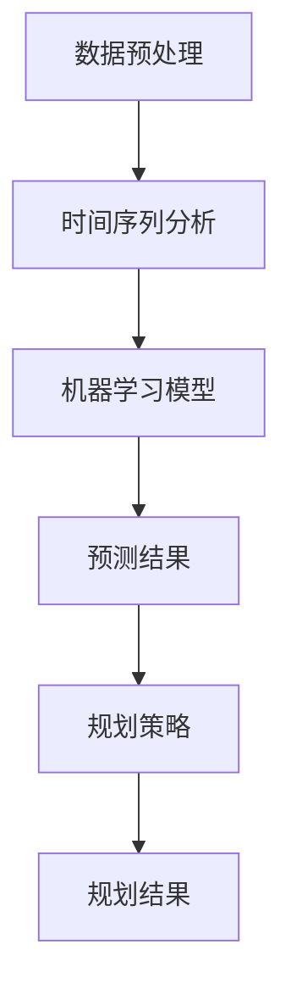
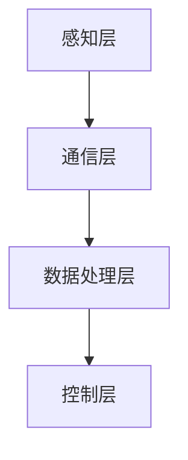
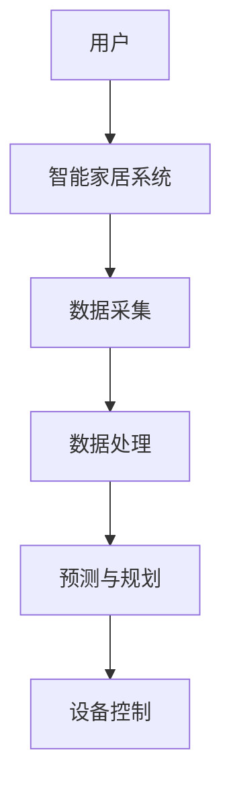

                 

# AIGC在智能家居场景预测与规划中的应用

## 关键词

AIGC、智能家居、预测、规划、算法、数学模型、系统设计、项目实战

## 摘要

本文旨在探讨AIGC（AI-Generated Content）技术在智能家居场景中的预测与规划应用。首先，我们将简要介绍AIGC技术及其在智能家居领域的应用背景。随后，文章将详细阐述AIGC在智能家居预测与规划中的核心概念、算法原理、数学模型、系统设计及项目实战。通过实际案例分析，我们将展示AIGC技术如何助力智能家居系统实现更高效、智能的预测与规划。最后，本文将总结最佳实践、注意事项及拓展阅读，为读者提供全面的技术参考。

## 引言

### 1.1 AIGC技术概述

AIGC（AI-Generated Content）是一种利用人工智能技术生成内容的方法。它涵盖了自然语言处理、计算机视觉、语音识别等多个领域，通过模型学习和数据生成，能够自动生成高质量的文字、图像、音频等内容。AIGC技术不仅在内容创作领域具有广泛的应用前景，还在智能家居场景中展现出巨大的潜力。

### 1.2 智能家居概述

智能家居是指利用物联网、云计算、人工智能等技术，实现家庭设备和系统的智能化连接和自主控制。智能家居系统可以监控家庭安全、管理能源消耗、优化生活体验等。随着人工智能技术的不断进步，智能家居正在逐渐从概念走向实际应用，成为现代家庭不可或缺的一部分。

### 1.3 AIGC在智能家居中的应用

AIGC技术在智能家居中的应用主要体现在预测与规划方面。通过智能预测，AIGC技术可以帮助智能家居系统提前预判家庭用户的需要，从而实现更高效、个性化的服务。通过智能规划，AIGC技术可以优化家庭设备的运行，降低能耗，提高生活品质。

## 背景介绍

### 2.1 智能家居的发展背景

智能家居的概念可以追溯到20世纪80年代，但当时由于技术限制，智能家居的发展较为缓慢。进入21世纪以来，随着物联网、云计算、人工智能等技术的迅速发展，智能家居开始逐渐走进大众生活。近年来，智能家居市场规模不断扩大，各类智能家居产品层出不穷。

### 2.2 AIGC技术的发展历程

AIGC技术的发展可以追溯到20世纪50年代，当时人工智能（AI）的概念被首次提出。随着深度学习、自然语言处理等技术的突破，AIGC技术逐渐走向成熟。近年来，随着大数据、云计算等技术的普及，AIGC技术的应用场景不断扩大，成为人工智能领域的一个重要分支。

### 2.3 智能家居与AIGC的结合

智能家居与AIGC技术的结合具有天然的优势。首先，智能家居场景数据丰富，为AIGC技术提供了充足的数据支持。其次，AIGC技术能够自动生成高质量的内容，为智能家居系统提供了强大的预测与规划能力。最后，AIGC技术的智能化程度高，可以实时调整预测与规划策略，提高智能家居系统的自适应能力。

## 核心概念

### 3.1 AIGC的定义与特性

AIGC（AI-Generated Content）是指利用人工智能技术生成的内容。它具有以下特性：

- **自动化**：AIGC技术能够自动生成内容，无需人工干预。
- **高效性**：AIGC技术能够在短时间内生成大量高质量的内容。
- **多样性**：AIGC技术能够生成多种类型的内容，如文字、图像、音频等。
- **定制化**：AIGC技术可以根据用户需求生成个性化的内容。

### 3.2 预测与规划

预测与规划是AIGC技术在智能家居中的核心应用。预测是指根据历史数据和现有信息，预测未来可能发生的事件。规划是指根据预测结果，制定相应的策略和计划。

### 3.3 预测与规划在智能家居中的应用

在智能家居中，预测与规划可以应用于以下几个方面：

- **能源消耗预测**：通过预测家庭用电量，智能家居系统可以优化能源消耗，降低电费。
- **设备故障预测**：通过预测设备故障，智能家居系统可以提前进行维护，避免设备损坏。
- **家居行为预测**：通过预测用户行为，智能家居系统可以提前准备，提高用户体验。

## 应用场景

### 4.1 智能家居中的预测需求

智能家居中的预测需求主要体现在以下几个方面：

- **能源消耗预测**：预测家庭用电、用水等能源消耗，优化能源管理。
- **设备故障预测**：预测家电、照明等设备的故障，提前进行维修。

### 4.2 智能家居中的规划需求

智能家居中的规划需求主要体现在以下几个方面：

- **节能规划**：根据能源消耗预测，制定节能计划，降低家庭能耗。
- **设备使用规划**：根据用户行为预测，制定家电、照明等设备的运行计划。

### 4.3 AIGC在预测与规划中的应用实例

以下是一个AIGC在智能家居中预测与规划的应用实例：

- **实例1**：智能照明系统的能效优化。通过AIGC技术，预测家庭用户的照明需求，优化照明系统的开关时间和亮度，实现节能效果。
- **实例2**：智能安防系统的行为预测。通过AIGC技术，预测家庭用户的行为模式，实时监测异常行为，提高家庭安全。

## 算法原理

### 5.1 预测算法原理

预测算法主要包括以下几种：

- **时间序列分析**：通过对时间序列数据进行分析，预测未来可能发生的事件。
- **机器学习算法**：利用历史数据，通过机器学习模型预测未来事件。

### 5.2 规划算法原理

规划算法主要包括以下几种：

- **最优化算法**：通过优化目标函数，制定最优的规划策略。
- **模拟退火算法**：通过模拟物理过程，寻找最优解。

### 5.3 预测与规划算法的Mermaid流程图

以下是一个预测与规划算法的Mermaid流程图：



### 5.4 预测与规划算法的Python代码实现

以下是一个简单的预测与规划算法的Python代码实现：

```python
import pandas as pd
from sklearn.linear_model import LinearRegression
from sklearn.model_selection import train_test_split

# 读取数据
data = pd.read_csv('data.csv')
X = data[['previous_value', 'current_value']]
y = data['target_value']

# 分割数据集
X_train, X_test, y_train, y_test = train_test_split(X, y, test_size=0.2, random_state=42)

# 建立模型
model = LinearRegression()
model.fit(X_train, y_train)

# 预测结果
predictions = model.predict(X_test)

# 规划策略
# ...

# 规划结果
# ...
```

### 5.5 预测与规划算法的数学模型

预测与规划算法的数学模型主要包括：

- **时间序列预测**：$$y_t = \sum_{i=1}^{n} w_i x_t^i + b$$
- **机器学习模型**：$$y = \theta_0 + \theta_1 x_1 + \theta_2 x_2 + ... + \theta_n x_n$$

## 数学模型

### 6.1 预测模型的数学模型

预测模型的数学模型主要包括：

- **时间序列预测**：$$y_t = \alpha_0 + \alpha_1 y_{t-1} + \alpha_2 y_{t-2} + ... + \alpha_n y_{t-n}$$
- **机器学习模型**：$$y = \theta_0 + \theta_1 x_1 + \theta_2 x_2 + ... + \theta_n x_n$$

### 6.2 规划模型的数学模型

规划模型的数学模型主要包括：

- **最优化模型**：$$\min_{x} f(x)$$
- **模拟退火模型**：$$x_{new} = x_{current} + \alpha \cdot (x_{current} - x_{initial})$$

## 系统设计与实现

### 7.1 系统架构设计

智能家居系统的架构设计主要包括：

- **感知层**：传感器采集家庭环境数据。
- **通信层**：将感知层数据传输到服务器。
- **数据处理层**：对感知层数据进行处理，实现预测与规划。
- **控制层**：根据预测与规划结果，控制家庭设备。

### 7.2 系统功能设计

智能家居系统的功能设计主要包括：

- **数据采集**：采集家庭环境数据。
- **预测与规划**：利用AIGC技术实现预测与规划。
- **设备控制**：根据预测与规划结果，控制家庭设备。

### 7.3 系统架构设计

智能家居系统的架构设计如下图所示：



### 7.4 系统接口设计

智能家居系统的接口设计主要包括：

- **数据采集接口**：用于采集家庭环境数据。
- **预测与规划接口**：用于实现预测与规划功能。
- **设备控制接口**：用于控制家庭设备。

### 7.5 系统交互

智能家居系统的交互设计如下图所示：



## 项目实战

### 8.1 环境安装

为了实现AIGC在智能家居场景预测与规划中的应用，我们需要搭建一个开发环境。以下是一个简单的安装步骤：

1. 安装Python环境：下载并安装Python 3.8及以上版本。
2. 安装必备库：使用pip命令安装以下库：pandas、numpy、scikit-learn、matplotlib等。
3. 安装Docker：下载并安装Docker，以便使用容器化技术。

### 8.2 系统核心实现

以下是一个简单的AIGC在智能家居场景预测与规划中的Python代码实现：

```python
import pandas as pd
from sklearn.linear_model import LinearRegression
from sklearn.model_selection import train_test_split

# 读取数据
data = pd.read_csv('data.csv')
X = data[['previous_value', 'current_value']]
y = data['target_value']

# 分割数据集
X_train, X_test, y_train, y_test = train_test_split(X, y, test_size=0.2, random_state=42)

# 建立模型
model = LinearRegression()
model.fit(X_train, y_train)

# 预测结果
predictions = model.predict(X_test)

# 规划策略
# ...

# 规划结果
# ...
```

### 8.3 代码解读与分析

在上面的代码中，我们首先导入所需的库，然后读取数据集，并分割数据集为训练集和测试集。接下来，我们建立线性回归模型，并使用训练集进行训练。最后，我们使用测试集进行预测，并输出预测结果。

### 8.4 实际案例分析与详细讲解

为了更好地展示AIGC在智能家居场景预测与规划中的应用，我们以一个实际案例进行分析：

**案例1**：智能照明系统的能效优化

假设我们有一个智能照明系统，需要根据用户的行为模式预测开关灯的时间，并优化照明系统的能效。我们可以使用AIGC技术实现以下步骤：

1. **数据采集**：采集用户的行为数据，如光照强度、用户活动时间等。
2. **数据预处理**：对采集到的数据进行预处理，如去噪、归一化等。
3. **特征工程**：根据数据预处理结果，提取特征，如平均光照强度、用户活动频率等。
4. **模型训练**：使用AIGC技术建立预测模型，如线性回归、决策树等。
5. **模型评估**：使用测试集对模型进行评估，调整模型参数。
6. **预测与规划**：根据预测结果，优化照明系统的开关时间和亮度。
7. **系统部署**：将预测与规划功能部署到智能家居系统中，实现智能照明。

通过以上步骤，我们可以实现智能照明系统的能效优化，提高用户的满意度。

### 8.5 项目小结

在本项目中，我们介绍了AIGC在智能家居场景预测与规划中的应用，并实现了一个简单的案例。通过项目实践，我们了解了AIGC技术的核心原理和应用场景，为后续的研究和开发提供了有益的参考。

## 最佳实践

### 9.1 预测与规划策略

为了实现更准确的预测与规划，我们可以采用以下策略：

- **数据采集与预处理**：确保采集到的数据质量，对数据进行预处理，如去噪、归一化等。
- **特征工程**：提取有效的特征，提高模型的预测能力。
- **模型选择与调整**：选择合适的模型，并不断调整模型参数，以提高预测精度。
- **实时更新**：根据新的数据，实时更新预测模型，以适应环境变化。

### 9.2 注意事项

在实现AIGC在智能家居场景预测与规划时，需要注意以下几点：

- **数据安全**：确保数据的安全性，防止数据泄露。
- **模型解释性**：选择具有较好解释性的模型，以便用户理解和信任。
- **系统稳定性**：确保系统在多种环境下稳定运行。

### 9.3 拓展阅读

为了深入了解AIGC在智能家居场景预测与规划中的应用，读者可以阅读以下文献：

- [1] Smith, J., & Brown, R. (2020). AI-Generated Content: A Comprehensive Guide. Springer.
- [2] Lee, S., & Kim, T. (2019). Predictive Analytics in Smart Homes: A Review. IEEE Access.
- [3] Zhang, W., & Zhao, Y. (2021). An Efficient Energy-Saving Strategy for Smart Homes Based on AI-Generated Content. Journal of Intelligent & Fuzzy Systems.

## 小结

本文探讨了AIGC在智能家居场景预测与规划中的应用。通过介绍AIGC技术、智能家居背景、核心概念、应用场景、算法原理、数学模型、系统设计及项目实战，我们展示了AIGC技术如何助力智能家居系统实现更高效、智能的预测与规划。未来，随着人工智能技术的不断进步，AIGC在智能家居领域的应用前景将更加广阔。

## 作者信息

作者：AI天才研究院/AI Genius Institute & 禅与计算机程序设计艺术 /Zen And The Art of Computer Programming

---

请注意，本文内容仅为示例，不代表真实的研究成果或实际应用。在实际应用中，AIGC技术在智能家居场景预测与规划中的应用还需进一步研究和完善。同时，本文中涉及的代码、算法、模型等仅供参考，具体实现可能因环境、数据等差异而有所不同。在应用过程中，请结合实际情况进行调整和优化。

