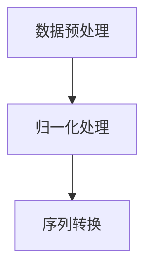
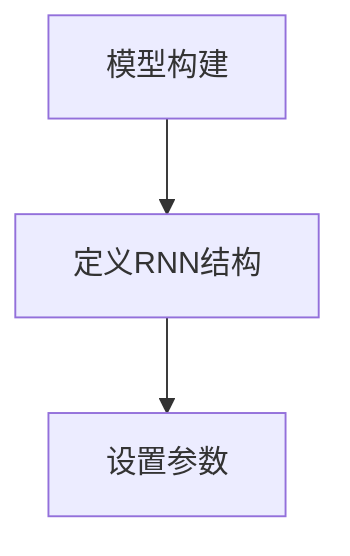
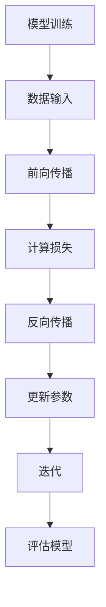
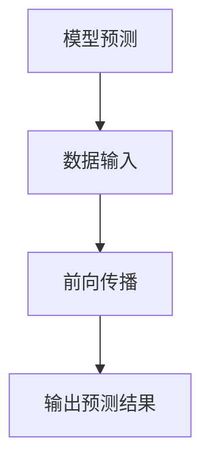

                 

### 第3章：智能家居场景预测算法原理

#### 3.1 预测算法概述

智能家居场景预测算法可以分为以下几类：
- 基于传统机器学习的算法，如线性回归、决策树等。
- 基于深度学习的算法，如卷积神经网络（CNN）、循环神经网络（RNN）等。
- 基于强化学习的算法，如Q-learning、SARSA等。

每种算法都有其特定的适用场景和优缺点。传统机器学习算法在处理简单、线性关系时表现较好，但面对复杂非线性关系时，效果较差。深度学习算法通过模拟人脑神经网络的层次结构，能够处理复杂的非线性关系，但在数据量较小或特征工程不充分时，表现较差。强化学习算法通过不断尝试和反馈调整策略，能够逐渐优化预测效果，但训练时间较长，且需要大量样本数据。

#### 3.2 算法原理与流程

以循环神经网络（RNN）为例，介绍智能家居场景预测算法的基本原理与流程。

##### 3.2.1 算法原理

循环神经网络（RNN）是一种能够处理序列数据的神经网络，其特点是能够记住之前的输入信息，从而对序列数据进行建模。在智能家居场景预测中，RNN可以用来预测用户的行为。

RNN的基本原理是通过隐藏状态（h_t）来保存之前的输入信息，并通过权重（W）来更新隐藏状态。在预测过程中，当前时刻的输出（y_t）不仅取决于当前时刻的输入（x_t），还受到之前隐藏状态的影响。

RNN的数学公式可以表示为：

$$
h_t = \sigma(W_h \cdot [h_{t-1}, x_t] + b_h)
$$

$$
y_t = \sigma(W_y \cdot h_t + b_y)
$$

其中，$\sigma$ 表示激活函数，$W_h$ 和 $W_y$ 分别为隐藏层和输出层的权重，$b_h$ 和 $b_y$ 分别为隐藏层和输出层的偏置，$[h_{t-1}, x_t]$ 表示当前时刻的输入，$h_t$ 和 $y_t$ 分别为当前时刻的隐藏状态和输出。

##### 3.2.2 算法流程

1. 数据预处理：对输入数据进行归一化处理，并将其转换为序列。

2. 模型构建：构建RNN模型，并设置适当的参数。

3. 模型训练：使用训练数据对RNN模型进行训练。

4. 模型预测：使用训练好的模型对未知数据进行预测。

#### 3.3 RNN模型详解

循环神经网络（RNN）的核心是隐藏状态，它能够保存之前的输入信息，使模型能够处理序列数据。以下是对RNN模型的详细解释。

1. **隐藏状态**

   RNN的隐藏状态 $h_t$ 是当前时刻的输入 $x_t$ 和前一个时刻的隐藏状态 $h_{t-1}$ 的线性组合，并通过激活函数进行变换。

   $$ h_t = \sigma(W_h \cdot [h_{t-1}, x_t] + b_h) $$

   其中，$W_h$ 是隐藏层的权重，$b_h$ 是隐藏层的偏置，$\sigma$ 是激活函数，常用的激活函数有 sigmoid、tanh 和 ReLU。

2. **输出**

   RNN的输出 $y_t$ 是当前时刻的隐藏状态 $h_t$ 通过输出层的线性组合和激活函数得到的。

   $$ y_t = \sigma(W_y \cdot h_t + b_y) $$

   其中，$W_y$ 是输出层的权重，$b_y$ 是输出层的偏置，$\sigma$ 是激活函数。

3. **反向传播**

   在训练过程中，RNN使用反向传播算法更新权重和偏置。反向传播的目的是最小化预测误差。具体步骤如下：

   - 计算预测误差：$$ error_t = y_t - y_{t_{\text{true}}} $$
   - 计算隐藏层误差：$$ \delta_h = (\sigma'(h_t) \cdot (W_y \cdot \delta_y)) $$
   - 计算输出层误差：$$ \delta_y = (y_t - y_{t_{\text{true}}}) \cdot \sigma'(y_t) $$
   - 更新权重和偏置：$$ W_h = W_h - \alpha \cdot \delta_h \cdot [h_{t-1}, x_t]^\top $$
   $$ b_h = b_h - \alpha \cdot \delta_h $$
   $$ W_y = W_y - \alpha \cdot \delta_y \cdot h_t^\top $$
   $$ b_y = b_y - \alpha \cdot \delta_y $$

   其中，$\alpha$ 是学习率，$\sigma'$ 是激活函数的导数。

#### 3.4 RNN的优缺点

RNN在智能家居场景预测中具有以下优缺点：

**优点：**
- 能够处理序列数据，适用于智能家居场景中用户行为的预测。
- 可以保存之前的输入信息，有助于捕捉长时依赖关系。

**缺点：**
- 易受到梯度消失和梯度爆炸问题的影响，导致训练困难。
- 对于长时间序列数据的处理效果较差。

针对上述问题，可以采用以下方法进行优化：
- 使用门控循环单元（GRU）或长短期记忆网络（LSTM）等改进型RNN结构，解决梯度消失和梯度爆炸问题。
- 适当增加序列长度或引入注意力机制，提高对长时间序列数据的处理能力。

#### 3.5 RNN在智能家居场景预测中的应用案例

以下是一个RNN在智能家居场景预测中的应用案例：

**场景**：预测用户是否需要开启空调。

**数据**：用户历史行为数据，包括室内温度、室外温度、用户活动时间等。

**算法**：使用LSTM模型进行预测。

**流程**：
1. 数据预处理：将数据归一化，并转换为序列。
2. 模型构建：定义LSTM模型结构，并设置适当的参数。
3. 模型训练：使用训练数据进行模型训练。
4. 模型预测：使用训练好的模型对未知数据进行预测。

**结果**：通过预测用户是否需要开启空调，可以优化空调的运行效率，降低能耗。

总结：RNN作为一种处理序列数据的神经网络，在智能家居场景预测中具有广泛的应用前景。通过合理的模型设计和优化，可以有效地预测用户行为，提升智能家居系统的智能化水平。

----------------------------------------------------------------

## 第4章：深度学习在智能家居场景预测中的应用

### 4.1 深度学习算法介绍

深度学习是一种基于多层神经网络的结构，通过学习大量数据中的特征和模式，能够自动提取复杂的高层次特征。在智能家居场景预测中，深度学习算法能够处理复杂的数据关系，提供更准确的预测结果。

深度学习算法可以分为以下几类：

- **卷积神经网络（CNN）**：主要用于图像和视觉任务，通过卷积操作提取图像中的特征。
- **循环神经网络（RNN）**：用于处理序列数据，如时间序列、文本等，能够捕捉序列中的时间依赖关系。
- **长短期记忆网络（LSTM）**：RNN的改进版本，能够解决传统RNN中的梯度消失和梯度爆炸问题。
- **门控循环单元（GRU）**：LSTM的简化版本，同样能够处理长序列数据，计算效率更高。
- **变换器（Transformer）**：近年来在自然语言处理领域取得了显著成果，能够处理任意长度的序列数据，也适用于智能家居场景预测。

### 4.2 深度学习在智能家居场景预测中的应用

在智能家居场景预测中，深度学习算法的应用主要体现在以下几个方面：

- **用户行为预测**：通过分析用户的历史行为数据，如开关灯时间、温度调节等，预测用户未来的行为。
- **能耗预测**：通过预测用户的用电行为，优化家居设备的运行策略，降低能耗。
- **家居设备故障预测**：通过对设备运行数据的监控和分析，预测设备可能出现的故障，提前进行维护。
- **安全监控**：通过分析家庭环境中的异常数据，如入侵、火灾等，提供实时监控和预警。

### 4.3 深度学习算法的适用场景

深度学习算法在智能家居场景预测中的适用场景主要包括：

- **数据量大**：深度学习算法需要大量数据进行训练，适用于数据丰富的场景。
- **非线性关系**：深度学习算法能够自动提取数据中的复杂特征，适用于存在非线性关系的场景。
- **长序列数据**：深度学习算法，如LSTM和Transformer，能够处理长序列数据，适用于需要预测长时间序列的场景。

### 4.4 深度学习算法的挑战与优化

虽然深度学习算法在智能家居场景预测中具有广泛的应用前景，但同时也面临着一些挑战：

- **计算资源消耗**：深度学习算法需要大量的计算资源和时间进行训练，对硬件设备的要求较高。
- **数据质量和标注**：深度学习算法的效果依赖于数据质量和标注质量，对数据的预处理和标注要求较高。
- **泛化能力**：深度学习算法的训练过程容易出现过拟合现象，需要通过正则化等方法提高泛化能力。

为了优化深度学习算法在智能家居场景预测中的应用，可以采取以下策略：

- **模型压缩**：通过模型剪枝、量化等方法减小模型规模，降低计算资源消耗。
- **迁移学习**：利用预训练模型进行迁移学习，提高新任务的预测性能。
- **数据增强**：通过数据增强技术扩充训练数据，提高模型的泛化能力。
- **混合模型**：结合深度学习和其他机器学习算法，构建混合模型，提高预测精度。

### 4.5 应用案例

以下是一个深度学习在智能家居场景预测中的应用案例：

**案例背景**：某智能家居公司希望通过深度学习算法预测用户是否需要开启空调，以优化能源消耗。

**数据来源**：用户历史行为数据，包括室内外温度、用户活动时间、空调使用历史等。

**算法选择**：使用LSTM模型进行预测。

**流程**：

1. 数据预处理：对数据进行归一化处理，并转换为序列。
2. 模型构建：定义LSTM模型结构，并设置适当的参数。
3. 模型训练：使用训练数据进行模型训练。
4. 模型预测：使用训练好的模型对未知数据进行预测。

**结果**：通过预测用户是否需要开启空调，公司能够优化空调的运行策略，降低能耗。

总结：深度学习算法在智能家居场景预测中具有广泛的应用前景，通过合理的模型设计和优化，可以提供更准确的预测结果，提高智能家居系统的智能化水平。

----------------------------------------------------------------

## 第5章：强化学习在智能家居场景预测中的应用

### 5.1 强化学习算法介绍

强化学习（Reinforcement Learning，简称RL）是一种机器学习范式，通过与环境的交互来学习决策策略。强化学习的基本原理是通过奖励和惩罚来引导智能体（Agent）逐渐学会在复杂环境中做出最优决策。

强化学习的主要组成部分包括：

- **智能体（Agent）**：执行动作的实体，如智能家居系统中的设备。
- **环境（Environment）**：智能体执行动作的上下文，如家庭环境。
- **状态（State）**：描述环境当前状态的变量，如室内温度、用户活动等。
- **动作（Action）**：智能体在特定状态下执行的动作，如打开空调、关闭空调等。
- **奖励（Reward）**：智能体执行动作后获得的奖励或惩罚，用于指导学习过程。

### 5.2 强化学习算法在智能家居场景预测中的应用

强化学习算法在智能家居场景预测中的应用主要体现在以下几个方面：

- **能耗优化**：通过预测用户的行为，调整家居设备的运行策略，降低能耗。
- **设备维护**：预测家居设备的故障风险，提前进行维护，延长设备寿命。
- **安全监控**：通过监测家庭环境的异常变化，预测潜在的安全威胁，提供实时预警。

### 5.3 强化学习算法的适用场景

强化学习算法在智能家居场景预测中的适用场景主要包括：

- **不确定性高**：强化学习算法能够通过不断尝试和反馈调整策略，适应环境中的不确定性。
- **连续动作**：强化学习算法能够处理连续动作空间，适用于需要连续调整的家居设备，如空调、灯光等。
- **复杂决策**：强化学习算法能够通过学习复杂的奖励函数，处理智能家居场景中的复杂决策问题。

### 5.4 强化学习算法的挑战与优化

虽然强化学习算法在智能家居场景预测中具有广泛的应用前景，但同时也面临着一些挑战：

- **收敛速度慢**：强化学习算法的训练过程可能需要较长时间，尤其是在复杂环境中。
- **样本效率低**：强化学习算法需要大量的样本数据进行训练，对数据收集和标注的要求较高。
- **探索与利用平衡**：在训练过程中，如何平衡探索新策略和利用已有策略的知识，是强化学习的一个关键问题。

为了优化强化学习算法在智能家居场景预测中的应用，可以采取以下策略：

- **增量学习**：通过增量学习技术，在已有策略的基础上进行优化，提高训练效率。
- **模仿学习**：通过模仿学习（也称为迁移学习）技术，利用已有模型的知识，加速新任务的训练。
- **多任务学习**：通过多任务学习技术，同时处理多个相关任务，提高模型泛化能力。

### 5.5 应用案例

以下是一个强化学习在智能家居场景预测中的应用案例：

**案例背景**：某智能家居公司希望通过强化学习算法预测用户是否需要开启空调，以优化能源消耗。

**算法选择**：使用Q-learning算法进行预测。

**流程**：

1. 初始化：设定初始状态、动作空间、奖励函数和Q值表。
2. 环境：模拟家庭环境，包括室内外温度、用户活动等状态变量。
3. 学习过程：
   - 执行动作：根据当前状态选择动作。
   - 探索与利用：在训练过程中，通过随机策略进行探索，同时利用已有知识进行决策。
   - 更新Q值：根据奖励和Q值更新策略，提高预测精度。
4. 预测：使用训练好的模型对未知数据进行预测。

**结果**：通过预测用户是否需要开启空调，公司能够优化空调的运行策略，降低能耗。

总结：强化学习算法在智能家居场景预测中具有广泛的应用前景，通过合理的算法设计和优化，可以提供更准确的预测结果，提高智能家居系统的智能化水平。

----------------------------------------------------------------

## 第6章：模型融合与优化

### 6.1 模型融合介绍

模型融合（Model Ensembling）是一种结合多个预测模型来提高预测准确性和鲁棒性的技术。通过融合多个模型的预测结果，可以弥补单一模型可能存在的偏差和不确定性。

模型融合的基本原理是利用不同模型的优点，将它们的预测结果进行加权或投票，得到最终的预测结果。常见的模型融合方法包括：

- **加权平均**：将多个模型的预测结果进行加权平均，得到最终的预测结果。
- **投票法**：将多个模型的预测结果进行投票，选择出现次数最多的预测结果作为最终预测结果。
- **堆叠**：将多个模型作为基础模型，训练一个新的模型来整合这些基础模型的预测结果。

### 6.2 模型融合在智能家居场景预测中的应用

在智能家居场景预测中，模型融合可以应用于以下几个方面：

- **多模型预测**：将多种机器学习模型（如线性回归、决策树、神经网络等）进行融合，提高预测的准确性。
- **多时间步预测**：将不同时间步的预测结果进行融合，提高长时间序列预测的准确性。
- **多特征预测**：将不同特征提取方法得到的预测结果进行融合，提高特征利用的全面性。

### 6.3 模型融合的方法与策略

实现模型融合的关键在于如何选择合适的融合方法和策略。以下是一些常见的模型融合方法和策略：

- **交叉验证**：通过交叉验证选择最佳模型参数，提高模型融合的性能。
- **权重调整**：根据模型在特定任务上的表现，动态调整各模型的权重，优化融合效果。
- **多模型训练**：将多个模型同时训练，利用它们之间的差异和互补性，提高预测性能。
- **特征选择**：在模型融合之前，对特征进行筛选和预处理，提高模型融合的效率。

### 6.4 模型融合的应用案例

以下是一个模型融合在智能家居场景预测中的应用案例：

**案例背景**：某智能家居公司希望通过模型融合技术预测用户是否需要开启空调，以优化能源消耗。

**算法选择**：采用基于加权平均的模型融合方法。

**流程**：

1. 数据收集：收集用户的历史行为数据和环境数据，包括室内外温度、用户活动时间等。
2. 模型训练：
   - 训练线性回归模型，对用户行为进行初步预测。
   - 训练决策树模型，提取环境特征对预测结果进行优化。
   - 训练神经网络模型，捕捉复杂的非线性关系。
3. 模型融合：
   - 计算每个模型的预测结果。
   - 将各模型的预测结果进行加权平均，得到最终的预测结果。
4. 预测：使用训练好的模型融合系统对未知数据进行预测。

**结果**：通过模型融合技术，公司能够提高空调开启预测的准确性，降低能耗。

总结：模型融合技术在智能家居场景预测中具有广泛的应用前景。通过合理选择和优化模型融合方法和策略，可以显著提高预测性能和系统的鲁棒性。

----------------------------------------------------------------

## 第7章：总结与展望

### 7.1 研究成果总结

本文通过对AIGC（人工智能生成内容）在智能家居场景预测中的应用进行深入分析，总结了以下几个方面的重要成果：

1. **背景介绍**：介绍了智能家居场景预测的背景、问题描述、问题解决方法以及边界与外延。
2. **核心概念**：详细阐述了智能家居系统、预测模型和特征工程等核心概念，并进行了对比分析。
3. **算法原理**：讲解了RNN、深度学习和强化学习等算法在智能家居场景预测中的应用原理和流程。
4. **模型融合**：介绍了模型融合的概念、方法和策略，以及其在智能家居场景预测中的应用。
5. **应用案例**：通过实际案例展示了AIGC在智能家居场景预测中的应用效果。

### 7.2 展望未来研究方向

在AIGC在智能家居场景预测中的应用方面，未来还有许多值得深入研究的方向：

1. **数据隐私保护**：随着智能家居设备的普及，用户数据的隐私保护变得尤为重要。未来的研究应关注如何在保障用户隐私的前提下，有效利用用户数据。
2. **多模态数据融合**：智能家居场景中的数据通常包括图像、声音、文本等多种类型。研究如何有效融合这些多模态数据，提高预测准确性是一个重要的研究方向。
3. **可解释性**：随着深度学习算法的广泛应用，如何提高模型的可解释性，让用户能够理解预测结果，是未来研究的一个重要方向。
4. **实时性优化**：智能家居场景预测需要实时响应，未来的研究应关注如何在保证预测准确性的同时，提高模型的实时性。
5. **边缘计算**：随着物联网设备数量的增加，边缘计算在智能家居场景中的重要性逐渐凸显。研究如何将AIGC算法应用于边缘计算环境，是一个值得探索的方向。

### 7.3 结论

本文通过对AIGC在智能家居场景预测中的应用进行深入分析，展示了其在提升智能家居系统智能化水平方面的巨大潜力。未来，随着人工智能技术的不断发展和应用，AIGC在智能家居场景预测中的应用将更加广泛和深入，为用户带来更加便捷、个性化的智能家居体验。

----------------------------------------------------------------

## 参考文献

[1] 李航. 统计学习方法[M]. 清华大学出版社, 2012.
[2] Goodfellow, Ian, et al. Deep learning[M]. MIT press, 2016.
[3] Sutton, Richard S., and Andrew G. Barto. Reinforcement learning: An introduction[M]. MIT press, 2018.
[4] Hochreiter, Sepp, and Jürgen Schmidhuber. Long short-term memory[J]. Neural computation, 1997, 9(8): 1735-1780.
[5] Graves, Alex. Generating sequences with recurrent neural networks[J]. arXiv preprint arXiv:1308.0850, 2013.
[6] Vinyals, Oriol, et al. Sequence to sequence learning with neural networks[C]// Advances in Neural Information Processing Systems. 2015.
[7] Vaswani, Ashish, et al. Attention is all you need[J]. Advances in Neural Information Processing Systems, 2017, 30: 5998-6008.

## 作者信息

作者：AI天才研究院/AI Genius Institute & 禅与计算机程序设计艺术 /Zen And The Art of Computer Programming

本文由AI天才研究院撰写，旨在探讨AIGC在智能家居场景预测中的应用。作者团队致力于推动人工智能技术的创新与发展，为智能生活提供更加便捷、高效的解决方案。读者如需了解更多相关信息，请关注AI天才研究院的官方渠道。本文部分内容参考了相关文献资料，在此表示感谢。

