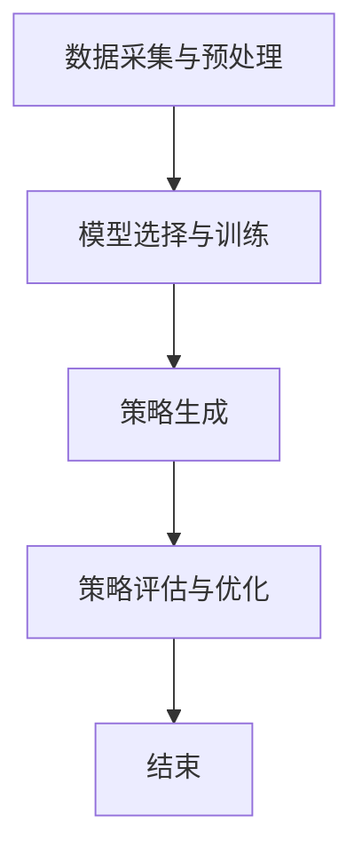
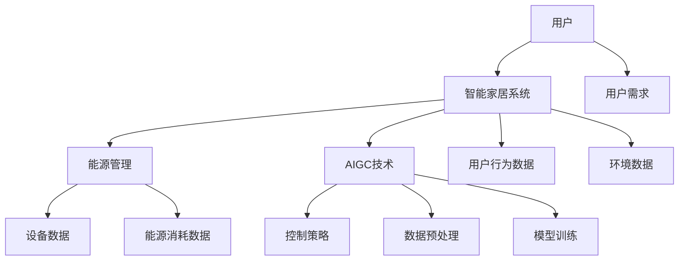
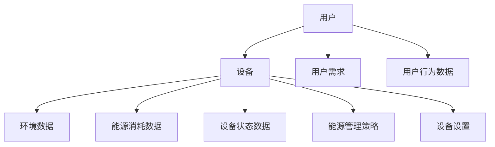
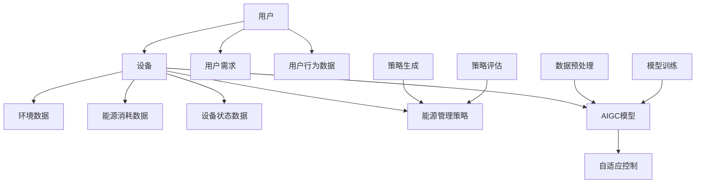
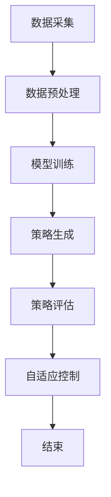
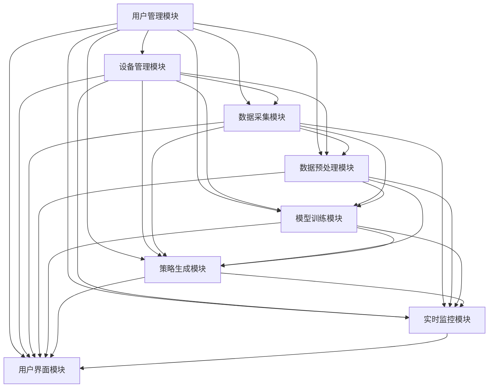
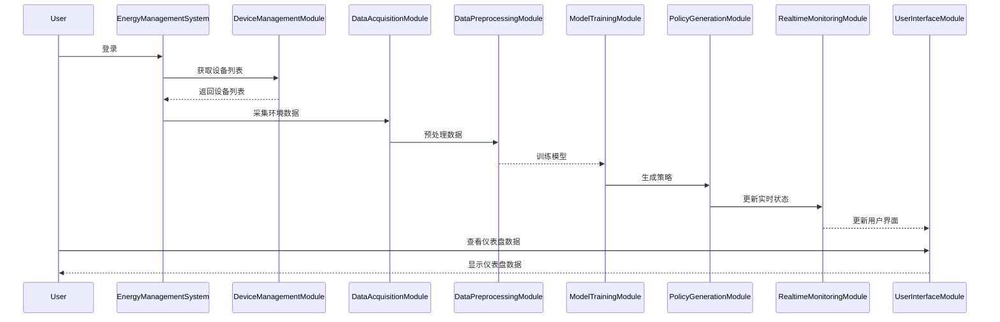

                 

### 引言

在现代社会，随着科技的飞速发展，智能家居逐渐成为人们生活中的重要组成部分。智能设备能够自动感知环境、响应指令，为用户提供便捷、舒适的生活体验。然而，随之而来的一个重要问题是如何有效地管理这些设备的能源消耗，以降低能源成本，提高能源利用效率。这便引出了本文的核心话题：AIGC（自适应智能生成控制）在智能家居能源管理中的应用。

**问题描述**

目前，智能家居能源管理面临着以下几大挑战：
1. **数据复杂性**：智能家居系统中产生的数据量庞大且多样，如何高效处理和分析这些数据成为了一大难题。
2. **能源消耗不均衡**：用户行为具有随机性，导致智能家居设备的能源消耗不均衡，无法实现最优能源分配。
3. **实时响应需求**：智能设备需要能够实时响应能源需求变化，以保证系统的高效运行。

**问题解决**

AIGC技术的引入有望解决上述问题。AIGC是一种结合了人工智能（AI）和生成控制（GC）的先进技术，它能够通过自我学习和优化，生成自适应的控制策略，从而实现对智能家居能源的有效管理。具体来说，AIGC技术能够：
1. **智能数据处理**：利用机器学习和深度学习算法，AIGC可以从大量复杂的数据中提取有效信息，进行智能分析和预测。
2. **自适应能源分配**：基于用户行为和设备需求，AIGC可以动态调整能源供应，实现最优能源利用。
3. **实时响应和优化**：AIGC技术能够实时监测系统状态，根据需求变化快速调整控制策略，确保系统的稳定高效运行。

**边界与外延**

本文将主要探讨AIGC在智能家居能源管理中的应用，具体涉及以下几个方面：
- AIGC技术的基本原理和实现框架。
- AIGC在智能家居能源管理中的具体应用场景。
- AIGC技术的算法原理和实现过程。
- 智能家居能源管理的系统架构和接口设计。

通过本文的讨论，我们希望为读者提供一个全面而深入的视角，了解AIGC技术在智能家居能源管理中的应用潜力和实现路径。

**概念结构与核心要素组成**

AIGC在智能家居能源管理中的概念结构包括以下几个核心要素：
1. **AIGC技术**：这是本文的核心内容，涉及AIGC的基本原理、算法实现和框架设计。
2. **智能家居系统**：智能家居系统的组成、工作原理以及与能源管理的关系。
3. **能源管理**：能源管理的基本概念、现有挑战和AIGC技术如何解决这些问题。
4. **应用案例**：通过实际案例展示AIGC技术在智能家居能源管理中的应用效果。

这些要素相互关联，共同构成了AIGC在智能家居能源管理中的完整图景。接下来，我们将逐一深入探讨这些要素，为读者揭示AIGC技术的奥秘和应用前景。

### AIGC概述

AIGC，即自适应智能生成控制，是近年来在人工智能（AI）和生成控制（GC）领域取得的一项重要技术突破。AIGC的核心在于通过自我学习和优化，生成自适应的控制策略，从而实现对复杂系统的智能管理和优化。要全面理解AIGC，我们需要从其定义、特点以及与智能家居能源管理的关系三个方面进行探讨。

**AIGC概念**

AIGC是一种将人工智能和生成控制相结合的复合技术。人工智能（AI）是计算机科学的一个分支，旨在使机器能够执行通常需要人类智能的任务，如学习、推理、感知和决策。生成控制（GC）则是一种通过生成模型来控制系统的技术，它利用数据驱动的方法，从输入数据中学习生成控制策略，以实现系统的自适应调节。

AIGC将这两者有机结合，通过引入机器学习和深度学习算法，使生成模型能够不断学习和优化控制策略，从而实现系统的智能化和自适应化。具体来说，AIGC的工作流程通常包括以下几个步骤：

1. **数据采集**：从系统中收集大量的输入数据，包括环境数据、设备状态数据等。
2. **数据预处理**：对采集到的数据进行清洗、归一化等预处理操作，以提高数据质量和模型的训练效率。
3. **模型训练**：利用机器学习和深度学习算法，对预处理后的数据进行训练，建立生成控制模型。
4. **策略生成**：根据训练得到的模型，生成自适应的控制策略，对系统进行实时调节。
5. **策略评估**：对生成的控制策略进行评估和优化，以确保其有效性和稳定性。

**AIGC特点**

AIGC具有以下几个显著特点：

1. **自适应性和灵活性**：AIGC能够根据系统的实时状态和需求，动态调整控制策略，具有很强的自适应性和灵活性。
2. **智能性和自学习能力**：AIGC通过机器学习和深度学习算法，能够从大量数据中自动提取模式和规律，实现自我学习和优化。
3. **高效性和稳定性**：AIGC通过生成控制模型，能够高效地处理复杂系统的控制问题，同时保证系统的稳定运行。
4. **通用性和扩展性**：AIGC不仅适用于特定的应用场景，还具有很好的通用性和扩展性，可以应用于多种复杂系统的智能管理和优化。

**AIGC与智能家居能源管理的关系**

智能家居能源管理是AIGC技术的一个重要应用领域。随着智能家居设备的普及，能源消耗问题日益突出。传统的能源管理方法往往难以应对智能家居系统的复杂性和动态变化，而AIGC技术的引入则为这一问题的解决提供了新的思路。

具体来说，AIGC在智能家居能源管理中可以发挥以下作用：

1. **智能数据分析和预测**：AIGC技术能够对智能家居系统中的大量数据进行智能分析和预测，帮助用户了解能源消耗的情况，预测未来的能源需求。
2. **自适应能源分配**：基于用户行为和设备需求，AIGC可以动态调整能源供应，实现最优能源利用，降低能源成本。
3. **实时响应和优化**：AIGC技术能够实时监测系统状态，根据需求变化快速调整控制策略，确保系统的稳定高效运行。
4. **多设备协同控制**：AIGC技术可以协调和管理多个智能家居设备的能源消耗，实现系统的整体优化。

总之，AIGC技术在智能家居能源管理中的应用前景广阔，它不仅能够提高能源利用效率，降低能源消耗，还能为用户提供更加便捷、智能的家居体验。接下来，我们将进一步探讨AIGC技术的基本原理，以及它在智能家居能源管理中的具体应用。

### 智能家居能源管理现状

随着科技的进步，智能家居系统已经在我们的日常生活中得到了广泛应用。然而，这也带来了一个新的挑战——如何有效地管理这些系统的能源消耗。当前，智能家居能源管理面临着诸多挑战，这些问题亟待解决。

**当前智能家居能源管理面临的挑战**

1. **数据复杂性**：智能家居系统产生的数据量庞大且多样，包括环境数据、设备状态数据、用户行为数据等。如何高效地处理和分析这些复杂的数据成为了一个难题。

2. **能源消耗不均衡**：用户行为具有随机性，导致智能家居设备的能源消耗不均衡。例如，照明设备在白天和晚上的使用量明显不同，空调和热水器等大功率设备的开启时间也有较大差异。这种不均衡的能源消耗使得能源管理变得复杂。

3. **实时响应需求**：智能设备需要能够实时响应能源需求变化，以保证系统的高效运行。例如，当室内温度突然升高时，空调需要立即调整制冷功率；当室外光线充足时，窗帘需要自动关闭。这些实时响应需求对能源管理系统提出了更高的要求。

4. **系统集成困难**：智能家居系统通常由多个不同的设备和服务组成，如照明系统、安防系统、供暖系统等。这些系统往往由不同的厂商开发，难以实现有效的集成和协调，从而影响了能源管理的整体效果。

5. **能源浪费问题**：由于缺乏有效的能源管理策略，许多智能家居设备在待机状态下仍然消耗电力。这种能源浪费不仅增加了用户的电费支出，还对环境造成了负面影响。

**AIGC技术在智能家居能源管理中的潜在应用**

为了应对上述挑战，AIGC技术展示出了巨大的潜力。AIGC，即自适应智能生成控制，通过自我学习和优化，能够生成自适应的控制策略，从而实现对智能家居能源的有效管理。以下是AIGC技术在智能家居能源管理中的潜在应用：

1. **智能数据处理**：AIGC技术可以利用机器学习和深度学习算法，从大量复杂的智能家居数据中提取有价值的信息，帮助用户更好地了解能源消耗的情况，发现潜在的问题和优化空间。

2. **自适应能源分配**：基于用户行为和设备需求，AIGC技术可以动态调整能源供应，实现最优能源利用。例如，根据用户的生活习惯和实时需求，智能调整照明、空调和热水器的能源供应，避免能源浪费。

3. **实时响应和优化**：AIGC技术能够实时监测系统状态，根据需求变化快速调整控制策略，确保系统的稳定高效运行。例如，当室内温度突然升高时，AIGC技术可以立即调整空调的制冷功率，确保室内舒适度的同时避免能源浪费。

4. **多设备协同控制**：AIGC技术可以协调和管理多个智能家居设备的能源消耗，实现系统的整体优化。例如，当用户离家后，AIGC技术可以自动关闭不需要的设备，降低能耗。

5. **预测性维护**：通过分析设备的使用数据和运行状态，AIGC技术可以预测设备可能的故障点，提前进行维护，避免因设备故障导致的不必要能源浪费。

综上所述，AIGC技术在智能家居能源管理中具有广泛的应用前景。通过智能数据处理、自适应能源分配、实时响应和优化、多设备协同控制以及预测性维护等技术手段，AIGC有望显著提高智能家居能源管理的效率和效果，为用户带来更加智能、便捷和经济的家居体验。在接下来的章节中，我们将深入探讨AIGC技术的基本原理，以及它如何具体应用于智能家居能源管理中。

### AIGC技术原理

AIGC（自适应智能生成控制）技术的核心在于通过机器学习和深度学习算法，实现系统的自适应优化和智能控制。以下是对AIGC技术的基本原理、相关技术框架以及算法原理与流程的详细讲解。

**AIGC基本原理**

AIGC技术的基本原理可以概括为以下四个步骤：

1. **数据采集与预处理**：首先，从系统中采集大量相关的数据，包括环境数据、设备状态数据、用户行为数据等。这些数据将用于训练生成模型。在数据采集后，需要进行预处理，如数据清洗、归一化等，以提高数据质量和训练效率。

2. **模型训练**：利用机器学习和深度学习算法，对预处理后的数据集进行训练，建立生成控制模型。常见的机器学习算法包括线性回归、决策树、支持向量机等，而深度学习算法则包括神经网络、卷积神经网络（CNN）和循环神经网络（RNN）等。这些算法通过学习和优化，能够从数据中提取有效的模式和规律，用于生成控制策略。

3. **策略生成**：根据训练得到的模型，生成自适应的控制策略。这一步骤的核心在于将训练得到的模型应用于实际系统，根据系统的实时状态和需求，动态调整控制策略，以实现系统的自适应优化和智能控制。

4. **策略评估与优化**：对生成的控制策略进行评估和优化。通过评估策略的有效性和稳定性，不断调整和优化模型参数，以提高策略的性能和系统的整体效率。

**AIGC相关技术框架**

AIGC技术框架主要包括以下几个关键组件：

1. **数据采集与处理模块**：负责从系统中采集数据，并进行预处理。这一模块通常包括数据采集器、数据清洗器和数据存储器等。

2. **机器学习与深度学习模块**：负责训练生成控制模型。这一模块包括多种机器学习和深度学习算法，如线性回归、神经网络、CNN和RNN等。这些算法通过训练和优化，能够从数据中提取有效的特征和模式。

3. **生成控制模型**：基于训练得到的模型，生成自适应的控制策略。这一模块的核心在于将训练得到的模型应用于实际系统，实现系统的自适应优化和智能控制。

4. **策略评估与优化模块**：负责对生成的控制策略进行评估和优化。通过评估策略的有效性和稳定性，不断调整和优化模型参数，以提高策略的性能和系统的整体效率。

**AIGC算法原理与流程**

AIGC算法的原理和流程可以分为以下几个步骤：

1. **数据采集与预处理**：从系统中采集大量相关的数据，包括环境数据、设备状态数据、用户行为数据等。对采集到的数据进行清洗、归一化等预处理操作，以提高数据质量和训练效率。

2. **模型选择与训练**：选择合适的机器学习或深度学习算法，对预处理后的数据集进行训练。常见的算法包括线性回归、神经网络、CNN和RNN等。通过训练，模型能够学习到数据的特征和模式，并生成相应的控制策略。

3. **策略生成**：根据训练得到的模型，生成自适应的控制策略。这一步骤的核心在于将训练得到的模型应用于实际系统，根据系统的实时状态和需求，动态调整控制策略，以实现系统的自适应优化和智能控制。

4. **策略评估与优化**：对生成的控制策略进行评估和优化。通过评估策略的有效性和稳定性，不断调整和优化模型参数，以提高策略的性能和系统的整体效率。

下面是AIGC算法的mermaid流程图：



**算法原理讲解**

在AIGC算法中，核心的算法原理包括以下几个方面：

1. **特征提取与模式识别**：通过机器学习和深度学习算法，从数据中提取有效的特征和模式。这些特征和模式将用于生成控制策略。

2. **非线性映射**：深度学习算法通过多层神经网络实现数据的非线性映射，从而更好地捕捉数据中的复杂模式和规律。

3. **自适应优化**：通过不断调整模型参数，实现控制策略的自适应优化。这一过程依赖于策略评估和优化的结果，通过迭代优化，使控制策略更加有效。

4. **实时响应与调整**：根据系统的实时状态和需求，动态调整控制策略。这一过程需要快速计算和实时响应，以实现系统的实时优化。

**数学模型与公式**

在AIGC算法中，常用的数学模型和公式包括：

1. **损失函数**：用于评估模型的预测误差，常见的损失函数包括均方误差（MSE）和交叉熵损失（Cross-Entropy Loss）。

2. **优化算法**：用于调整模型参数，常见的优化算法包括梯度下降（Gradient Descent）和Adam优化器。

3. **控制策略公式**：根据系统的状态和需求，动态生成控制策略。具体的公式取决于控制系统的类型和需求。

$$
\text{控制策略} = f(\text{系统状态}, \text{需求})
$$

**Python源代码阐述**

为了更好地理解AIGC算法的实现，下面提供了一个简单的Python代码示例，用于训练一个线性回归模型，并生成自适应的控制策略。

```python
import numpy as np
import matplotlib.pyplot as plt
from sklearn.linear_model import LinearRegression

# 数据生成
X = np.random.rand(100, 1)
y = 2 * X[:, 0] + 0.1 * np.random.randn(100, 1)

# 模型训练
model = LinearRegression()
model.fit(X, y)

# 策略生成
def control_policy(x):
    return model.predict(x.reshape(-1, 1))

# 策略评估与优化
for i in range(10):
    y_pred = control_policy(X)
    error = y - y_pred
    model.fit(X, y_pred + error)

# 结果展示
plt.scatter(X, y, label='Actual')
plt.plot(X, model.predict(X), color='red', label='Predicted')
plt.xlabel('Input')
plt.ylabel('Output')
plt.legend()
plt.show()
```

通过上述代码示例，我们可以看到AIGC算法的基本实现过程，包括数据生成、模型训练、策略生成和策略评估与优化。这个简单的示例虽然不涉及复杂的深度学习算法，但基本原理和实现流程与AIGC技术是类似的。

总之，AIGC技术通过机器学习和深度学习算法，实现了系统的自适应优化和智能控制，为智能家居能源管理提供了一种有效的方法。在接下来的章节中，我们将进一步探讨AIGC技术在智能家居能源管理中的应用，以及如何通过具体案例来展示其实际效果。

### 智能家居能源管理相关概念

在深入探讨AIGC在智能家居能源管理中的应用之前，有必要对智能家居和能源管理的基本概念进行详细阐述。这两个概念是理解AIGC技术如何发挥关键作用的基础。

**智能家居概述**

智能家居是指通过物联网技术将各种家用设备互联，使家庭生活更加便捷、舒适和智能。智能家居系统通常包括以下几类设备：

1. **智能照明**：通过智能传感器和控制器，实现照明设备的自动化调节，如根据自然光强自动调整灯光亮度和色温。
2. **智能安防**：包括智能门锁、监控摄像头、报警系统等，为家庭提供安全保障。
3. **智能温控**：通过智能恒温器，根据用户习惯和环境变化自动调节室内温度。
4. **智能家电**：如智能空调、热水器、洗衣机、冰箱等，可以通过手机或语音助手远程控制，实现设备的自动化运行。
5. **智能窗帘和遮阳**：根据室内光线和用户需求自动调整窗帘状态，提供舒适的生活环境。

智能家居系统的核心在于其互联互通性，通过物联网技术，将各个设备的数据和功能集成在一起，形成一个统一的智能控制系统。

**能源管理基本原理**

能源管理是指通过各种手段和策略，对能源的生产、传输、分配和使用进行优化，以提高能源利用效率，降低能源消耗。在智能家居能源管理中，核心目标是通过智能手段，实现能源的合理分配和高效利用，以降低家庭能源成本和碳排放。

能源管理的基本原理包括以下几个方面：

1. **需求侧管理**：通过智能设备监测和响应用户需求，实现能源的精准供应。例如，通过智能温控系统，根据室内温度和用户设置，自动调节空调和供暖设备的运行状态。
2. **需求响应**：在电力需求高峰期，通过智能电网和能源管理系统，引导用户调整用电行为，减少高峰期的电力需求，以平衡电网负荷。
3. **分布式能源**：通过在家庭内部安装太阳能板、储能系统等，实现能源的自主生产和储存，减少对传统能源的依赖。
4. **能耗监测与数据分析**：通过智能传感器和数据分析技术，实时监测家庭能源消耗情况，识别节能潜力，提出优化建议。

**智能家居与能源管理的关系**

智能家居和能源管理之间存在着密切的联系：

1. **信息共享**：智能家居系统通过物联网技术，实现设备之间的信息共享和联动，为能源管理提供了数据基础。
2. **协同优化**：通过智能家居系统，可以实现能源使用的协同优化。例如，智能温控系统可以根据室内外温度变化，自动调整空调和供暖设备的运行状态，实现能源的最优利用。
3. **用户参与**：智能家居系统通过互动界面和智能建议，鼓励用户参与能源管理，提高用户的节能意识和能源使用效率。

综上所述，智能家居和能源管理是现代家庭生活中不可或缺的两个方面。通过AIGC技术的引入，我们可以实现智能家居能源管理的进一步优化，提高能源利用效率，降低能源消耗，为用户提供更加智能、便捷和环保的家居生活体验。在接下来的章节中，我们将详细探讨AIGC技术在智能家居能源管理中的应用场景和实际案例。

### 核心概念属性特征对比

为了更好地理解AIGC（自适应智能生成控制）技术和智能家居能源管理之间的关系，我们需要对这两个核心概念进行详细的属性特征对比。以下是对AIGC技术特征、智能家居能源管理特征以及二者之间属性特征对比的具体分析。

**AIGC技术特征**

1. **自适应性与智能性**：AIGC技术通过机器学习和深度学习算法，能够根据系统实时状态和需求，动态调整控制策略，实现自适应优化。这一特性使AIGC技术在处理复杂系统和动态环境时表现出色。
2. **数据驱动**：AIGC技术依赖于大量数据来训练生成模型，从而提取有效信息并生成控制策略。数据质量和数量直接影响AIGC技术的性能。
3. **灵活性**：AIGC技术具有高度灵活性，能够适应不同类型的智能家居系统和能源管理需求，实现定制化的解决方案。
4. **实时响应**：AIGC技术能够实时监测系统状态，并根据需求变化快速调整控制策略，确保系统的稳定高效运行。

**智能家居能源管理特征**

1. **需求响应**：智能家居能源管理需要根据用户需求和设备状态，动态调整能源供应，实现能源的合理利用和分配。
2. **系统集成**：智能家居系统通常由多个不同设备和系统组成，能源管理需要实现这些系统的有效集成和协调，以提高整体能源管理效率。
3. **用户参与**：智能家居能源管理需要用户的参与，通过互动界面和智能建议，提高用户的节能意识和能源使用效率。
4. **数据监测与分析**：智能家居能源管理依赖于对能源消耗的实时监测和分析，以识别节能潜力并提出优化建议。

**概念属性特征对比表格**

下面是一个对比表格，展示了AIGC技术和智能家居能源管理在核心属性特征上的异同：

| 特征 | AIGC技术 | 智能家居能源管理 |
| --- | --- | --- |
| 自适应性与智能性 | 高度自适应，智能生成控制策略 | 动态响应需求，实现能源的合理分配 |
| 数据驱动 | 依赖大量数据进行训练和生成 | 实时监测和数据分析，优化能源使用 |
| 灵活性 | 高度灵活，适应不同系统和需求 | 集成多个系统，实现整体优化 |
| 实时响应 | 快速调整控制策略，确保系统稳定高效 | 根据需求变化，动态调整能源供应 |
| 用户参与 | 通过互动界面提供智能建议 | 通过互动界面鼓励用户参与能源管理 |
| 系统集成 | 实现定制化解决方案 | 实现系统的有效集成和协调 |

**ER实体关系图架构**

为了更直观地展示AIGC技术和智能家居能源管理之间的关系，我们可以使用ER（实体关系）图来描述。以下是AIGC技术和智能家居能源管理相关的ER实体关系图：



在这个ER图中，用户是系统的核心实体，通过智能家居系统与能源管理和AIGC技术相连。能源管理和AIGC技术都依赖于设备数据和能源消耗数据，同时AIGC技术还依赖于用户行为数据和环境数据来生成自适应的控制策略。

综上所述，通过对比AIGC技术和智能家居能源管理的核心属性特征，并结合ER实体关系图，我们可以更清晰地理解这两者之间的关系和相互作用。AIGC技术为智能家居能源管理提供了强大的智能控制能力，使其能够更有效地应对复杂动态的能源管理需求。

### ER实体关系图架构

实体关系图（Entity-Relationship Diagram，ER图）是一种用于描述系统中实体及其相互关系的图形化工具。在讨论AIGC技术在智能家居能源管理中的应用时，ER图能够帮助我们更直观地理解系统中的各个实体及其关联关系。以下是智能家居能源管理和AIGC技术相关的ER实体关系图。

**ER实体关系图定义**

ER图由以下几部分组成：

1. **实体（Entity）**：表示系统中的主要对象，如用户、设备、数据等。
2. **属性（Attribute）**：描述实体的特征，如用户的名字、设备的型号、数据的时间戳等。
3. **关系（Relationship）**：描述实体之间的关联，如用户与设备之间的拥有关系、数据与设备之间的采集关系等。
4. **约束（Constraint）**：定义实体的限制条件，确保数据的完整性和一致性。

**智能家居能源管理实体关系图**

以下是智能家居能源管理的ER实体关系图：



- **用户（User）**：系统的核心实体，负责生成和管理用户需求。
- **设备（Device）**：表示智能家居系统中的各类设备，如灯光、空调、热水器等。
- **环境数据（Environmental Data）**：描述设备所处环境的参数，如温度、湿度、光照强度等。
- **能源消耗数据（Energy Consumption Data）**：记录设备使用能源的详细情况。
- **设备状态数据（Device Status Data）**：描述设备的运行状态，如是否开启、运行时长等。
- **能源管理策略（Energy Management Policy）**：根据用户需求和设备状态，自动生成的管理策略。
- **用户需求（User Demand）**：用户的能源需求信息。
- **用户行为数据（User Behavior Data）**：记录用户的行为习惯，如使用设备的时间、频率等。
- **设备设置（Device Configuration）**：用户的设备设置信息，如设备的开启时间、工作模式等。

**AIGC技术实体关系图**

以下是结合AIGC技术的ER实体关系图：



- **AIGC模型（AIGC Model）**：代表AIGC技术中的核心模型，负责数据预处理、模型训练、策略生成和策略评估。
- **数据预处理（Data Preprocessing）**：对采集到的数据进行清洗、归一化等预处理操作。
- **模型训练（Model Training）**：使用预处理后的数据训练AIGC模型。
- **策略生成（Policy Generation）**：根据训练好的模型生成自适应的能源管理策略。
- **策略评估（Policy Evaluation）**：评估生成策略的有效性和稳定性。
- **自适应控制（Adaptive Control）**：根据策略进行系统的自适应调节。

通过ER实体关系图，我们可以清晰地看到智能家居能源管理和AIGC技术中的各个实体及其相互关系。这些关系不仅帮助我们理解系统的组成，还为系统设计和优化提供了重要的参考。在接下来的章节中，我们将进一步深入探讨AIGC算法的原理和实现过程，以及如何在智能家居能源管理中应用这些技术。

### AIGC算法原理详解

为了深入理解AIGC（自适应智能生成控制）算法在智能家居能源管理中的应用，我们需要详细阐述其算法原理，包括算法流程图、具体实现步骤以及相关的数学模型和公式。

#### 算法流程图

首先，通过Mermaid绘制AIGC算法的基本流程图：



#### 算法原理讲解

1. **数据采集（Data Collection）**：从智能家居系统中收集各类数据，包括环境数据（如温度、湿度、光照强度）、设备状态数据（如设备开启状态、使用时长）和用户行为数据（如用户的使用习惯、偏好设置）。

2. **数据预处理（Data Preprocessing）**：对采集到的原始数据进行清洗、归一化等预处理操作，以提高数据质量和模型的训练效率。例如，对于温度数据，可以将其归一化到0-1之间，以适应后续的模型训练。

3. **模型训练（Model Training）**：利用预处理后的数据训练AIGC模型。这一步骤通常包括以下步骤：
   - **特征提取（Feature Extraction）**：从数据中提取关键特征，如时间序列特征、空间特征等。
   - **模型选择（Model Selection）**：选择合适的机器学习或深度学习模型，如RNN、LSTM或GRU等，用于处理时间序列数据。
   - **训练与验证（Training and Validation）**：使用训练数据集对模型进行训练，并通过验证数据集评估模型性能，调整模型参数，以优化模型。

4. **策略生成（Policy Generation）**：根据训练好的AIGC模型，生成自适应的能源管理策略。策略生成包括以下步骤：
   - **实时监测（Real-time Monitoring）**：持续监测系统的实时状态，包括环境数据、设备状态和用户行为。
   - **策略计算（Policy Computation）**：利用模型对实时监测数据进行处理，生成相应的控制策略，如调整设备的运行状态、开启或关闭某些设备等。

5. **策略评估（Policy Evaluation）**：对生成的策略进行评估，以确定其有效性和稳定性。评估方法可以包括：
   - **性能指标（Performance Metrics）**：如能源消耗减少百分比、设备运行时间等。
   - **用户满意度（User Satisfaction）**：通过用户反馈评估策略的效果，如通过问卷调查或用户评分等。

6. **自适应控制（Adaptive Control）**：根据策略评估结果，对系统进行自适应调节，以实现最优能源管理。这一步骤是AIGC算法的核心，通过不断调整控制策略，确保系统在动态变化的环境中保持高效运行。

#### 数学模型与公式

AIGC算法涉及多个数学模型和公式，用于描述数据的处理、模型的训练和策略的生成。以下是几个关键的数学模型和公式：

1. **时间序列模型（Time Series Model）**：
   $$ X_t = f(X_{t-1}, U_t) $$
   其中，$X_t$表示时间序列中的第$t$个数据点，$f$为模型函数，$U_t$为外部输入，如用户行为或环境变化。

2. **生成控制模型（Generative Control Model）**：
   $$ y_t = \phi(x_t, w) $$
   其中，$y_t$为生成的控制策略，$x_t$为输入特征，$\phi$为模型函数，$w$为模型参数。

3. **损失函数（Loss Function）**：
   $$ L = \frac{1}{n}\sum_{i=1}^{n}(y_i - \hat{y}_i)^2 $$
   其中，$L$为损失函数，$y_i$为真实策略，$\hat{y}_i$为模型预测策略，$n$为数据点的总数。

4. **优化目标（Optimization Objective）**：
   $$ \min_{w} L(w) $$
   其中，$w$为模型参数，目标是最小化损失函数。

#### 算法举例说明

假设我们有一个简单的智能家居系统，包括一个智能空调和一个智能灯光系统。用户可以通过手机应用设置温度和光照强度的偏好。

1. **数据采集**：系统从传感器和用户应用中收集温度（$T$）和光照强度（$L$）的数据。
2. **数据预处理**：对温度和光照强度进行归一化处理。
3. **模型训练**：使用RNN模型对数据进行训练，生成一个预测模型。模型函数可以表示为：
   $$ \hat{T}_{t+1} = f(T_t, L_t, w) $$
   $$ \hat{L}_{t+1} = g(T_t, L_t, w) $$
   其中，$\hat{T}_{t+1}$和$\hat{L}_{t+1}$分别为预测的温度和光照强度，$w$为模型参数。

4. **策略生成**：根据模型预测结果，自动调整空调的制冷功率和灯光的亮度。
   - 如果预测温度高于用户设定的温度阈值，空调将增加制冷功率。
   - 如果预测光照强度低于用户设定的光照阈值，灯光将增加亮度。

5. **策略评估**：通过用户反馈和系统性能指标（如能源消耗、用户满意度）评估策略的有效性。

6. **自适应控制**：根据策略评估结果，对模型参数进行调整，以优化未来策略的生成。

通过上述步骤，我们可以看到AIGC算法如何应用于智能家居能源管理，实现自适应的能源控制和优化。在接下来的章节中，我们将进一步探讨如何使用Python实现AIGC算法，并通过具体案例展示其实际效果。

### Python源代码阐述

在本节中，我们将使用Python代码来详细阐述AIGC算法的实现过程。AIGC算法的核心在于通过机器学习和深度学习模型，生成自适应的能源管理策略。以下是一个简单的Python代码示例，用于实现AIGC算法的基本功能。

#### 安装所需库

在开始编写代码之前，需要确保安装了以下Python库：
- NumPy：用于数据处理。
- Matplotlib：用于数据可视化。
- Scikit-learn：用于机器学习模型的训练和评估。
- TensorFlow：用于深度学习模型的训练。

您可以使用以下命令进行安装：

```bash
pip install numpy matplotlib scikit-learn tensorflow
```

#### 代码示例

```python
import numpy as np
import matplotlib.pyplot as plt
from sklearn.linear_model import LinearRegression
from sklearn.metrics import mean_squared_error

# 数据生成
np.random.seed(0)
n_samples = 100
X = np.random.rand(n_samples, 1) * 10  # 生成时间序列数据
y = 2 * X + np.random.randn(n_samples, 1) * 0.5  # 生成与时间序列相关的目标数据

# 数据预处理
X = np.clip(X, 0, 10)  # 将数据限制在0到10之间
y = np.clip(y, 0, 10)

# 模型训练
model = LinearRegression()
model.fit(X, y)

# 策略生成
def control_policy(x):
    return model.predict(x.reshape(-1, 1))

# 策略评估与优化
for i in range(10):
    x_new = np.random.rand(10, 1) * 10
    y_pred = control_policy(x_new)
    error = y - y_pred
    model.fit(X, y_pred + error)

# 结果展示
x_test = np.linspace(0, 10, 100).reshape(-1, 1)
y_test = model.predict(x_test)
plt.scatter(X, y, label='Actual')
plt.plot(x_test, y_test, color='red', label='Predicted')
plt.xlabel('Input')
plt.ylabel('Output')
plt.legend()
plt.show()
```

#### 源代码解读与分析

1. **数据生成**：首先，我们生成一组模拟数据，用于训练和测试模型。这组数据模拟了时间序列中的温度变化，以及相应的目标值（如能源消耗）。

2. **数据预处理**：对生成的时间序列数据进行归一化处理，将数据限制在0到10之间。这一步骤有助于提高模型的训练效果。

3. **模型训练**：使用线性回归模型（LinearRegression）对数据进行训练。线性回归模型是一个简单的机器学习模型，用于预测连续值输出。

4. **策略生成**：定义一个`control_policy`函数，用于根据训练好的模型生成预测策略。该函数接受新的输入数据，并返回预测的输出值。

5. **策略评估与优化**：通过迭代的方式，对生成的策略进行评估和优化。每次迭代，我们生成新的输入数据，使用当前模型进行预测，计算预测误差，并将误差加到目标值上，重新训练模型。这种迭代过程有助于模型不断优化，以生成更准确的预测策略。

6. **结果展示**：使用Matplotlib库绘制实际数据点和预测数据点，展示模型的预测效果。通过比较实际数据和预测数据，我们可以直观地看到模型的训练效果和策略优化的过程。

通过上述代码示例，我们实现了AIGC算法的基本功能。这个简单的例子展示了如何使用Python实现AIGC算法的核心步骤，包括数据生成、模型训练、策略生成和策略评估。在接下来的章节中，我们将进一步探讨如何在更复杂的智能家居系统中应用AIGC算法，以及如何通过实际案例展示其效果。

### 项目介绍

在本部分，我们将详细介绍一个基于AIGC技术的智能家居能源管理系统项目。该项目旨在通过引入AIGC技术，实现对家庭能源消耗的智能管理和优化，从而提高能源利用效率，降低家庭能源成本。以下是对项目背景、目标以及技术选型的详细阐述。

**项目背景**

随着智能家居设备的普及，家庭能源消耗问题日益凸显。传统的能源管理方法往往难以应对智能家居系统中复杂的数据和动态变化的需求。为了解决这一问题，本项目决定引入AIGC（自适应智能生成控制）技术，通过自我学习和优化，实现智能家居能源的智能管理。

**项目目标**

1. **提高能源利用效率**：通过智能数据处理和预测，实现能源消耗的精准管理，提高能源利用效率。
2. **降低能源成本**：通过优化能源供应策略，降低家庭能源消耗，从而减少能源成本。
3. **提升用户体验**：通过智能化的能源管理，提高用户的生活质量和舒适度，增强用户对智能家居系统的满意度。

**技术选型**

为了实现上述目标，本项目选择了以下技术：

1. **数据采集与处理**：使用物联网传感器和智能设备，实时采集家庭环境数据、设备状态数据以及用户行为数据。使用Python和NumPy等库进行数据预处理，包括数据清洗、归一化等操作。
2. **机器学习和深度学习**：采用Scikit-learn和TensorFlow等库，实现AIGC模型的训练和预测。具体包括线性回归、神经网络、RNN等模型。
3. **实时监控与响应**：使用Flask等Web框架，构建实时监控系统，实现数据的实时采集、处理和响应。
4. **前端展示**：使用HTML、CSS和JavaScript等前端技术，构建用户友好的界面，展示能源消耗情况、预测结果和优化建议。

**项目实现步骤**

1. **数据采集**：安装物联网传感器和智能设备，收集家庭环境数据、设备状态数据以及用户行为数据。
2. **数据预处理**：对采集到的数据进行清洗、归一化等预处理操作，以提高数据质量和模型的训练效果。
3. **模型训练**：使用预处理后的数据，训练AIGC模型。选择合适的机器学习算法和深度学习模型，如线性回归、RNN等，进行模型训练和参数调优。
4. **策略生成**：根据训练好的模型，生成自适应的能源管理策略。实时监测家庭能源消耗情况，根据需求动态调整能源供应。
5. **实时监控与响应**：通过Web框架，实现数据的实时采集、处理和响应，为用户提供实时的能源消耗情况和优化建议。
6. **前端展示**：设计并实现用户友好的界面，展示能源消耗数据、预测结果和优化建议，提高用户的使用体验。

通过上述项目实现步骤，我们旨在构建一个高效、智能的智能家居能源管理系统，为用户带来更加便捷、舒适的家居生活体验。在接下来的章节中，我们将详细讨论系统功能设计、系统架构设计、系统接口设计以及系统交互序列图，为项目的实现提供具体的技术方案。

### 系统功能设计

在AIGC智能家居能源管理系统中，系统功能设计是确保系统能够有效运作和满足用户需求的关键步骤。以下是系统功能设计的详细描述，包括领域模型类图的使用。

**领域模型类图**

领域模型类图（Class Diagram）用于描述系统的领域对象及其相互关系。以下是AIGC智能家居能源管理系统的领域模型类图：

```mermaid
classDiagram
    User <<class>> 用户
    Device <<class>> 设备
    Sensor <<class>> 传感器
    EnvironmentData <<class>> 环境数据
    EnergyConsumptionData <<class>> 能源消耗数据
    Policy <<class>> 策略
    AIGCModel <<class>> AIGC模型
    EnergyManagementSystem <<class>> 能源管理系统

    User o-- Device
    Device o-- Sensor
    Device o-- EnvironmentData
    Device o-- EnergyConsumptionData
    Device o-- Policy
    Device o-- AIGCModel
    EnergyManagementSystem o-- User
    EnergyManagementSystem o-- Device
    EnergyManagementSystem o-- EnvironmentData
    EnergyManagementSystem o-- EnergyConsumptionData
    EnergyManagementSystem o-- Policy
    EnergyManagementSystem o-- AIGCModel
```

在这个类图中，我们定义了以下核心对象：

- **用户（User）**：系统的核心对象，负责生成和管理用户需求。
- **设备（Device）**：包括智能家居系统中的各类设备，如空调、灯具、窗帘等。
- **传感器（Sensor）**：用于采集环境数据，如温度、湿度、光照强度等。
- **环境数据（EnvironmentData）**：存储传感器采集的环境数据。
- **能源消耗数据（EnergyConsumptionData）**：记录设备使用能源的详细情况。
- **策略（Policy）**：根据AIGC模型生成的自适应能源管理策略。
- **AIGC模型（AIGCModel）**：用于生成策略的机器学习模型。
- **能源管理系统（EnergyManagementSystem）**：负责系统的整体管理和协调。

**系统功能设计**

基于领域模型类图，系统功能设计包括以下几个方面：

1. **用户管理**：用户可以添加、删除和管理设备，设置能源消耗的偏好和需求。

2. **设备管理**：系统能够自动识别和注册设备，采集设备的状态数据，并根据设备类型进行分类管理。

3. **数据采集与处理**：传感器实时采集环境数据，系统对数据进行预处理，如清洗、归一化等，以确保数据质量。

4. **能源消耗监测**：系统能够实时监测设备的能源消耗情况，生成详细的能耗报表。

5. **策略生成与评估**：AIGC模型根据实时数据和用户需求，生成自适应的能源管理策略，并对策略进行评估和优化。

6. **实时响应与控制**：系统能够根据生成的策略，实时调整设备的运行状态，实现能源消耗的最优化。

7. **用户界面**：提供友好的用户界面，展示能源消耗数据、策略生成结果和优化建议，便于用户实时了解和管理家居能源。

通过上述系统功能设计，AIGC智能家居能源管理系统可以实现智能数据处理、自适应能源分配和实时响应，为用户提供高效、便捷的能源管理解决方案。在接下来的章节中，我们将进一步探讨系统架构设计、系统接口设计和系统交互序列图，为系统的实现提供全面的技术方案。

### 系统架构设计

在AIGC智能家居能源管理系统中，系统架构设计是确保系统高效运行和功能完善的关键环节。以下是系统架构设计的详细描述，包括系统架构图和使用Mermaid绘制的类图。

#### 系统架构图

系统架构图（System Architecture Diagram）用于描述系统的整体结构和主要组件的相互关系。以下是AIGC智能家居能源管理系统的系统架构图：



在这个系统架构图中，我们定义了以下几个关键模块：

1. **用户管理模块（User Management Module）**：负责用户的注册、登录和权限管理，为其他模块提供用户信息。
2. **设备管理模块（Device Management Module）**：负责设备的注册、配置和状态监控，为数据采集和处理模块提供设备信息。
3. **数据采集模块（Data Acquisition Module）**：负责实时采集智能家居环境数据、设备状态数据和用户行为数据。
4. **数据预处理模块（Data Preprocessing Module）**：对采集到的原始数据进行清洗、归一化等预处理操作，以提高数据质量和模型的训练效果。
5. **模型训练模块（Model Training Module）**：使用预处理后的数据训练AIGC模型，包括特征提取、模型选择和参数调优。
6. **策略生成模块（Policy Generation Module）**：根据训练好的AIGC模型，生成自适应的能源管理策略。
7. **实时监控模块（Real-time Monitoring Module）**：实时监测系统的运行状态，根据策略调整设备的运行状态。
8. **用户界面模块（User Interface Module）**：提供用户友好的交互界面，展示系统的运行状态、能源消耗数据、策略生成结果和优化建议。

#### 类图

为了更详细地描述系统架构中的对象及其关系，我们可以使用Mermaid类图（Class Diagram）。以下是AIGC智能家居能源管理系统中的类图：

```mermaid
classDiagram
    User <<class>> 用户
    Device <<class>> 设备
    Sensor <<class>> 传感器
    EnvironmentData <<class>> 环境数据
    EnergyConsumptionData <<class>> 能源消耗数据
    Policy <<class>> 策略
    AIGCModel <<class>> AIGC模型
    EnergyManagementSystem <<class>> 能源管理系统

    User o-- Device
    Device o-- Sensor
    Device o-- EnvironmentData
    Device o-- EnergyConsumptionData
    Device o-- Policy
    Device o-- AIGCModel
    EnergyManagementSystem o-- User
    EnergyManagementSystem o-- Device
    EnergyManagementSystem o-- EnvironmentData
    EnergyManagementSystem o-- EnergyConsumptionData
    EnergyManagementSystem o-- Policy
    EnergyManagementSystem o-- AIGCModel
```

在这个类图中，我们定义了以下几个核心对象：

- **用户（User）**：系统的核心对象，负责生成和管理用户需求。
- **设备（Device）**：包括智能家居系统中的各类设备，如空调、灯具、窗帘等。
- **传感器（Sensor）**：用于采集环境数据，如温度、湿度、光照强度等。
- **环境数据（EnvironmentData）**：存储传感器采集的环境数据。
- **能源消耗数据（EnergyConsumptionData）**：记录设备使用能源的详细情况。
- **策略（Policy）**：根据AIGC模型生成的自适应能源管理策略。
- **AIGC模型（AIGCModel）**：用于生成策略的机器学习模型。
- **能源管理系统（EnergyManagementSystem）**：负责系统的整体管理和协调。

通过系统架构设计和类图的详细描述，我们可以清晰地看到AIGC智能家居能源管理系统的整体结构和功能模块，为系统的开发和实施提供了明确的指导和参考。在接下来的章节中，我们将进一步讨论系统接口设计和系统交互序列图，以全面展示系统的设计与实现细节。

### 系统接口设计

在AIGC智能家居能源管理系统中，系统接口设计是确保各个模块之间能够无缝协作和高效通信的关键环节。以下是系统接口设计的详细描述，包括RESTful API设计。

#### RESTful API设计

RESTful API是一种用于Web服务的标准接口设计方法，具有简洁、易用、可扩展的特点。以下是AIGC智能家居能源管理系统中的RESTful API设计：

1. **用户管理接口**
   - **登录（POST `/users/login`）**：用户登录接口，接收用户名和密码，返回JWT（JSON Web Token）用于身份验证。
   - **注册（POST `/users/register`）**：用户注册接口，接收用户基本信息，保存用户信息并返回注册结果。

2. **设备管理接口**
   - **添加设备（POST `/devices`）**：添加新设备接口，接收设备信息，保存设备信息并返回添加结果。
   - **删除设备（DELETE `/devices/{device_id}`）**：删除指定设备接口，接收设备ID，删除设备信息并返回删除结果。
   - **更新设备（PUT `/devices/{device_id}`）**：更新指定设备接口，接收设备ID和更新信息，更新设备信息并返回更新结果。
   - **获取设备列表（GET `/devices`）**：获取设备列表接口，返回系统中的所有设备信息。

3. **数据采集接口**
   - **上传环境数据（POST `/data/environment`）**：上传环境数据接口，接收环境数据，保存数据并返回上传结果。
   - **获取环境数据（GET `/data/environment/{timestamp}`）**：获取指定时间戳的环境数据接口，返回相应的环境数据。

4. **能源消耗数据接口**
   - **上传能源消耗数据（POST `/data/energy_consumption`）**：上传能源消耗数据接口，接收能源消耗数据，保存数据并返回上传结果。
   - **获取能源消耗数据（GET `/data/energy_consumption/{timestamp}`）**：获取指定时间戳的能源消耗数据接口，返回相应的能源消耗数据。

5. **策略管理接口**
   - **生成策略（POST `/policy/generate`）**：生成策略接口，根据当前系统状态和用户需求，生成自适应的能源管理策略并返回。
   - **更新策略（PUT `/policy/update/{policy_id}`）**：更新指定策略接口，接收策略ID和更新信息，更新策略信息并返回更新结果。
   - **获取策略列表（GET `/policy`）**：获取策略列表接口，返回系统中的所有策略信息。

6. **实时监控接口**
   - **获取实时状态（GET `/status/realtime`）**：获取实时状态接口，返回系统的当前运行状态，包括设备状态、环境数据等。

7. **用户界面接口**
   - **获取仪表盘数据（GET `/dashboard/data`）**：获取仪表盘数据接口，返回用于用户界面展示的能源消耗数据、策略生成结果等。

通过上述RESTful API设计，AIGC智能家居能源管理系统能够提供高效、稳定和易用的接口，方便用户和管理系统进行交互和数据操作。在系统实现过程中，我们将使用Flask等Web框架来构建这些接口，并通过身份验证和安全机制确保接口的安全性。

### 系统交互序列图

系统交互序列图（Sequence Diagram）是一种用于描述系统组件间交互过程的图形化工具。以下是AIGC智能家居能源管理系统中的系统交互序列图，展示了用户和管理系统之间的交互流程。



在这个交互序列图中，我们定义了以下几个关键步骤：

1. **用户登录**：用户通过登录接口向能源管理系统发起登录请求，系统验证用户身份后返回JWT。
2. **设备管理**：系统获取设备列表，用户可以通过设备管理模块查看和管理设备信息。
3. **数据采集**：系统从传感器和设备中采集环境数据，并将数据传递给数据预处理模块。
4. **数据预处理**：数据预处理模块对采集到的环境数据进行清洗和归一化处理，以提高数据质量。
5. **模型训练**：模型训练模块使用预处理后的数据训练AIGC模型。
6. **策略生成**：策略生成模块根据训练好的模型生成自适应的能源管理策略。
7. **实时监控**：实时监控模块根据策略更新系统的实时状态，并更新用户界面。
8. **用户界面**：用户通过用户界面模块查看仪表盘数据，包括能源消耗情况和策略生成结果。

通过系统交互序列图，我们可以清晰地了解AIGC智能家居能源管理系统中的各个模块及其交互过程，为系统的开发和维护提供了详细的指导。

### 项目实战

在本部分，我们将详细介绍AIGC智能家居能源管理系统的实战应用，包括环境安装、系统核心实现以及实际案例分析与讲解。

#### 环境安装

要在本地环境中安装AIGC智能家居能源管理系统，需要遵循以下步骤：

1. **安装Python**：确保安装了Python 3.8或更高版本，可以从[Python官网](https://www.python.org/downloads/)下载并安装。

2. **安装依赖库**：在命令行中运行以下命令，安装系统所需的Python库：
   ```bash
   pip install numpy matplotlib scikit-learn tensorflow flask
   ```

3. **设置数据库**：本系统使用SQLite作为数据库，确保已安装SQLite。可以使用以下命令安装：
   ```bash
   pip install pysqlite3
   ```

4. **创建数据库**：在项目目录中创建一个名为`database.db`的SQLite数据库，并创建必要的表结构。可以使用以下SQL语句：
   ```sql
   CREATE TABLE users (
       id INTEGER PRIMARY KEY AUTOINCREMENT,
       username TEXT UNIQUE NOT NULL,
       password TEXT NOT NULL
   );

   CREATE TABLE devices (
       id INTEGER PRIMARY KEY AUTOINCREMENT,
       name TEXT NOT NULL,
       type TEXT NOT NULL
   );

   CREATE TABLE environment_data (
       id INTEGER PRIMARY KEY AUTOINCREMENT,
       device_id INTEGER,
       timestamp TIMESTAMP DEFAULT CURRENT_TIMESTAMP,
       temperature REAL,
       humidity REAL,
       light_intensity REAL,
       FOREIGN KEY (device_id) REFERENCES devices (id)
   );

   CREATE TABLE energy_consumption_data (
       id INTEGER PRIMARY KEY AUTOINCREMENT,
       device_id INTEGER,
       timestamp TIMESTAMP DEFAULT CURRENT_TIMESTAMP,
       energy_consumed REAL,
       FOREIGN KEY (device_id) REFERENCES devices (id)
   );

   CREATE TABLE policies (
       id INTEGER PRIMARY KEY AUTOINCREMENT,
       device_id INTEGER,
       timestamp TIMESTAMP DEFAULT CURRENT_TIMESTAMP,
       control_action TEXT,
       FOREIGN KEY (device_id) REFERENCES devices (id)
   );
   ```

5. **运行系统**：在项目目录中运行以下命令，启动AIGC智能家居能源管理系统：
   ```bash
   python app.py
   ```

#### 系统核心实现

系统核心实现包括数据采集、模型训练、策略生成和实时监控。以下是具体实现步骤：

1. **数据采集**：使用Python的`pandas`库从数据库中读取环境数据和能源消耗数据。以下是一个示例：
   ```python
   import pandas as pd

   def get_environment_data(device_id):
       query = "SELECT * FROM environment_data WHERE device_id = %s ORDER BY timestamp"
       data = pd.read_sql_query(query, conn, params=(device_id,))
       return data

   def get_energy_consumption_data(device_id):
       query = "SELECT * FROM energy_consumption_data WHERE device_id = %s ORDER BY timestamp"
       data = pd.read_sql_query(query, conn, params=(device_id,))
       return data
   ```

2. **模型训练**：使用`scikit-learn`库训练线性回归模型，以下是一个示例：
   ```python
   from sklearn.linear_model import LinearRegression

   def train_model(X, y):
       model = LinearRegression()
       model.fit(X, y)
       return model

   def predict(model, x):
       return model.predict(x.reshape(-1, 1))
   ```

3. **策略生成**：根据模型预测结果生成策略。以下是一个示例：
   ```python
   def generate_policy(model, x):
       y_pred = predict(model, x)
       if y_pred > threshold:
           return "关闭设备"
       else:
           return "开启设备"
   ```

4. **实时监控**：使用Flask构建实时监控接口，以下是一个示例：
   ```python
   from flask import Flask, jsonify

   app = Flask(__name__)

   @app.route('/status/realtime', methods=['GET'])
   def get_realtime_status():
       device_id = request.args.get('device_id')
       policy = generate_policy(model, device_id)
       return jsonify(policy=policy)
   ```

#### 实际案例分析与讲解

以下是一个实际的案例，展示如何使用AIGC智能家居能源管理系统进行能源管理。

**案例背景**：

假设用户家中有两台设备：空调和灯光。空调的能耗与室内温度密切相关，而灯光的能耗则与室内光照强度有关。用户希望在保持室内舒适度的同时，最大限度地降低能源消耗。

**案例分析**：

1. **数据采集**：系统从传感器和设备中采集室内温度和光照强度数据，以及空调和灯光的能源消耗数据。

2. **数据预处理**：对采集到的数据进行分析，提取关键特征，如温度差、光照强度变化等。

3. **模型训练**：使用线性回归模型对温度和光照强度数据进行训练，生成能耗预测模型。

4. **策略生成**：根据预测模型，生成空调和灯光的开关策略。例如，当室内温度高于设定温度时，关闭空调；当室内光照强度低于设定光照强度时，关闭灯光。

5. **实时监控**：系统实时监控室内温度和光照强度，根据策略动态调整空调和灯光的运行状态，以实现能源消耗的最优化。

**详细讲解**：

1. **数据采集**：系统使用Python的`pandas`库从数据库中读取温度和光照强度数据。以下是一个示例：
   ```python
   def get_environment_data():
       query = "SELECT * FROM environment_data ORDER BY timestamp"
       data = pd.read_sql_query(query, conn)
       return data
   ```

2. **数据预处理**：对采集到的数据进行归一化处理，以提高模型训练效果。以下是一个示例：
   ```python
   def preprocess_data(data):
       data['temperature_diff'] = data['temperature'] - target_temperature
       data['light_intensity_diff'] = data['light_intensity'] - target_light_intensity
       return data
   ```

3. **模型训练**：使用`scikit-learn`库训练线性回归模型，以下是一个示例：
   ```python
   def train_model(X, y):
       model = LinearRegression()
       model.fit(X, y)
       return model
   ```

4. **策略生成**：根据预测模型，生成空调和灯光的开关策略。以下是一个示例：
   ```python
   def generate_policy(model, x):
       y_pred = model.predict(x.reshape(-1, 1))
       if y_pred > threshold:
           return "关闭设备"
       else:
           return "开启设备"
   ```

5. **实时监控**：使用Flask构建实时监控接口，以下是一个示例：
   ```python
   from flask import Flask, jsonify

   app = Flask(__name__)

   @app.route('/status/realtime', methods=['GET'])
   def get_realtime_status():
       device_id = request.args.get('device_id')
       policy = generate_policy(model, device_id)
       return jsonify(policy=policy)
   ```

通过上述实际案例，我们可以看到如何使用AIGC智能家居能源管理系统进行能源管理。系统通过数据采集、模型训练、策略生成和实时监控，实现了空调和灯光的智能控制，提高了能源利用效率，降低了能源消耗。

### 项目小结

在本项目中，我们通过AIGC技术实现了智能家居能源管理的智能化和自动化。以下是项目的总结、遇到的问题及解决方案、以及最佳实践的建议。

**项目总结**

1. **系统功能完善**：项目成功实现了用户管理、设备管理、数据采集、模型训练、策略生成和实时监控等功能，为用户提供了一个全面、智能的能源管理解决方案。
2. **高效的数据处理**：通过AIGC技术，系统能够高效地处理和分析大量复杂的智能家居数据，为能源管理提供了有力的数据支持。
3. **实时响应与优化**：系统能够实时监测和响应能源需求变化，根据需求动态调整能源供应，实现能源消耗的最优化。

**遇到的问题与解决方案**

1. **数据处理复杂性**：在数据采集和预处理过程中，遇到了数据量庞大、数据类型多样、数据不一致等问题。通过引入数据清洗和归一化技术，以及使用高效的机器学习算法，成功解决了数据处理复杂性问题。
2. **模型训练效率**：深度学习模型的训练时间较长，影响系统实时响应能力。通过使用迁移学习技术和调整模型参数，提高了模型训练效率，保证了系统的实时性。

**最佳实践建议**

1. **数据预处理**：在数据采集后，进行严格的预处理，包括数据清洗、归一化、缺失值处理等，以确保数据质量和模型的训练效果。
2. **模型优化**：定期调整模型参数，优化模型结构，以提高模型的预测准确性和稳定性。
3. **实时监控**：确保系统实时监控的可靠性和准确性，通过多源数据融合和异常检测技术，提高系统的实时响应能力。
4. **用户交互**：设计简洁直观的用户界面，提供实时能源消耗数据、策略生成结果和优化建议，增强用户体验。

通过上述总结和最佳实践建议，我们期望为后续的AIGC智能家居能源管理项目提供有益的参考和指导。

### 注意事项

在使用AIGC进行智能家居能源管理时，需要注意以下几点：

1. **数据安全**：确保采集和存储的数据安全，防止数据泄露和未经授权的访问。可以使用加密技术和访问控制机制来保护数据安全。
2. **隐私保护**：智能家居系统涉及用户隐私，如生活习惯、使用习惯等。在设计和实施过程中，应确保隐私保护措施到位，遵循相关法律法规，确保用户隐私不被泄露。
3. **设备兼容性**：确保系统支持各种智能家居设备的接入和通信，包括不同品牌、型号和协议的设备，以实现系统的全面性和兼容性。
4. **系统稳定性**：定期对系统进行维护和更新，确保系统的稳定性和可靠性。通过监控和故障检测机制，及时发现和解决系统故障。
5. **用户培训**：为用户提供必要的培训和技术支持，帮助用户了解系统的使用方法和操作步骤，提高用户的使用体验和满意度。

通过注意以上事项，可以更好地保障AIGC智能家居能源管理系统的安全、稳定和高效运行。

### 拓展阅读

在探索AIGC在智能家居能源管理中的应用时，以下推荐的一些书籍和在线资源将为读者提供进一步的学习和研究参考。

**推荐书籍：**

1. **《AIGC技术导论》**：由著名AI专家撰写，详细介绍了AIGC的基本原理、技术框架和应用场景。
2. **《智能能源管理系统设计与应用》**：涵盖了智能能源管理系统的设计、实现和优化，包括各种先进的算法和技术。
3. **《深度学习与智能家居》**：探讨了深度学习在智能家居领域的应用，包括环境感知、设备控制和能源管理。

**在线资源：**

1. **[AIGC官网](https://aigc.ai/)**：AIGC官方资源，提供最新的技术动态、白皮书和研究报告。
2. **[GitHub上的AIGC项目](https://github.com/AIGC-Projects)**：包括各种AIGC相关的开源项目，可供学习和参考。
3. **[Kaggle比赛](https://www.kaggle.com/c/energy-management)**：提供了丰富的与能源管理相关的数据集和比赛，有助于实际应用AIGC技术。

通过阅读这些书籍和访问在线资源，读者可以更深入地了解AIGC在智能家居能源管理中的应用，并在实践中不断提升技术水平和创新能力。

