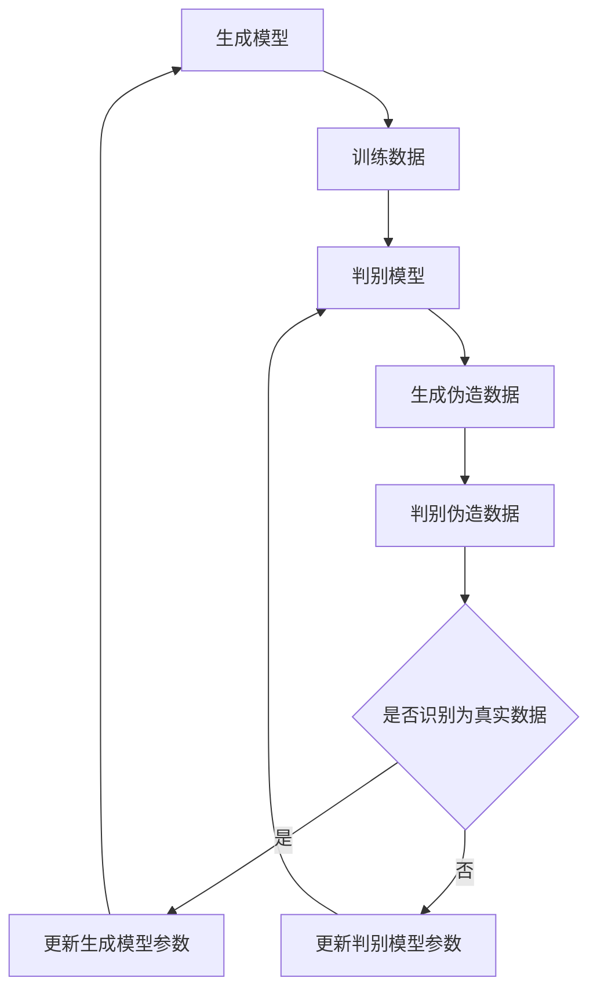
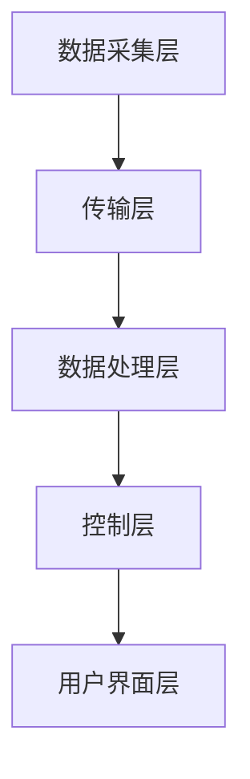
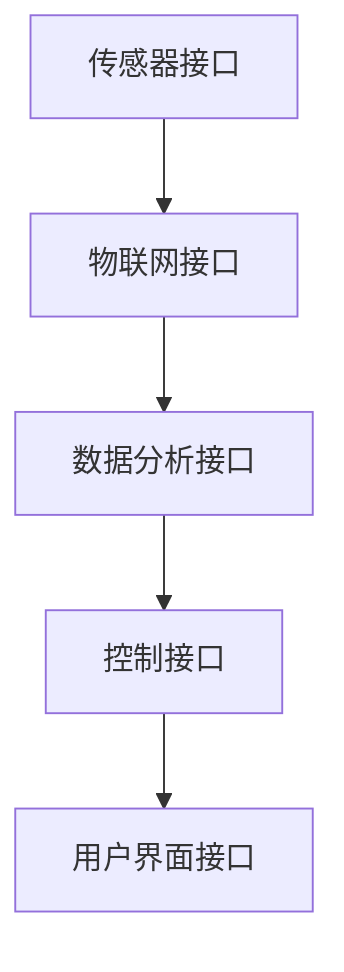
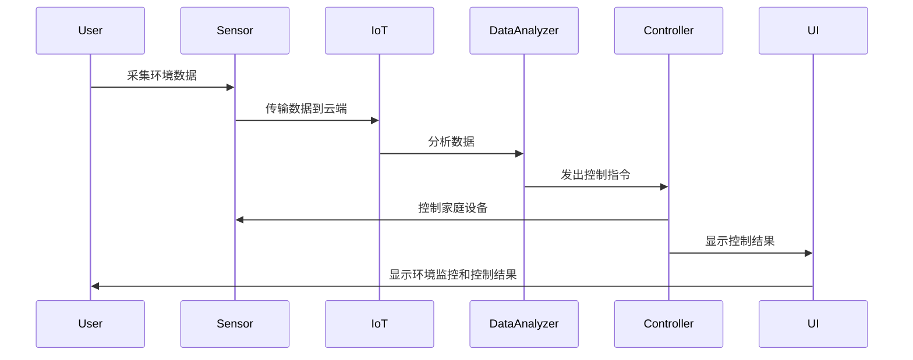

                 

## AIGC在智能家居设计中的创新应用

### 关键词：AIGC、智能家居、创新应用、算法原理、系统架构、项目实战

### 摘要：
本文将探讨AIGC（AI-Generated Content）在智能家居设计中的创新应用。首先，我们将介绍AIGC和智能家居设计的背景，并阐述AIGC如何对智能家居设计产生影响。接着，我们将深入探讨AIGC和智能家居设计中的核心概念及其相互关系。随后，我们将详细讲解AIGC在智能家居设计中的算法原理，包括相关的机器学习和深度学习技术。在此基础上，我们将分析AIGC在智能家居系统中的应用场景，并设计系统的架构方案。接着，通过实际案例展示AIGC在智能家居设计中的具体应用。最后，我们将总结最佳实践，提出使用AIGC进行智能家居设计时需要注意的问题，并推荐一些拓展阅读材料。

## 背景介绍

### 1.1 AIGC的概念与智能家居设计

AIGC，即AI-Generated Content，是指利用人工智能技术生成内容的一种新型内容生产方式。它通过深度学习、自然语言处理等技术，可以自动生成文本、图像、音频等多种类型的内容。近年来，随着人工智能技术的快速发展，AIGC在各个领域都展现出了强大的应用潜力，尤其在智能家居设计中，AIGC的应用更是为智能家居带来了全新的设计理念和创新应用。

智能家居设计是指通过物联网（IoT）技术、传感器技术、人工智能技术等，将家庭设备、家居环境连接起来，实现家庭自动化管理和服务。随着人们对生活品质的要求不断提高，智能家居设计逐渐成为家居行业的重要发展方向。AIGC的引入，为智能家居设计带来了新的思路和工具，使得智能家居设计更加智能化、个性化。

### 1.2 行业发展背景

智能家居行业近年来呈现出快速发展的态势。根据市场研究机构的统计数据，全球智能家居市场规模逐年增长，预计未来几年仍将保持高速增长。技术成熟度和市场需求的不断上升，为AIGC在智能家居设计中的应用提供了良好的环境。

在技术方面，物联网、传感器技术、人工智能技术等已经相对成熟，这些技术的不断进步为AIGC在智能家居设计中的应用提供了基础。例如，物联网技术的普及，使得家庭设备之间的互联互通变得更加容易；传感器技术的进步，使得对家庭环境的感知更加精确；人工智能技术的应用，使得智能家居系统能够更加智能地处理数据、提供服务。

在市场需求方面，随着生活水平的提高，人们对家庭生活的舒适度、便捷度要求越来越高。智能家居设计能够提供智能化、个性化的家庭生活服务，满足人们的多元化需求。此外，随着人工智能技术的普及，人们对AI技术的接受度也在不断提高，这为AIGC在智能家居设计中的应用提供了广阔的市场空间。

## 核心概念与联系

### 2.1 智能家居设计中的核心概念

#### 传感器技术

传感器技术是智能家居设计中的基础技术，它通过感知环境信息，为智能家居系统提供数据支持。传感器可以感知温度、湿度、光照、声音等多种环境信息，通过物联网技术将这些信息传输到智能家居系统，实现家庭环境的自动化管理。

#### 物联网（IoT）

物联网技术是将各种家庭设备、家居环境连接起来，实现数据互通和智能控制。通过物联网技术，智能家居系统能够实时获取家庭环境信息，并根据用户需求进行智能调控。物联网技术是AIGC在智能家居设计中应用的重要基础。

#### 人工智能（AI）

人工智能技术是智能家居设计的核心驱动力量，它通过深度学习、自然语言处理等技术，对智能家居系统中的数据进行处理和分析，实现智能决策和自动化服务。AIGC技术的引入，使得智能家居系统能够更加智能化地处理数据，提供个性化的家庭服务。

### 2.2 概念属性特征对比表格

#### 传感器技术特征对比

| 特征        | 传感器技术 |
|-------------|------------|
| 感知环境信息  | 高         |
| 数据传输稳定性 | 中         |
| 数据处理能力  | 低         |

#### 物联网技术特征对比

| 特征        | 物联网技术 |
|-------------|------------|
| 设备互联互通 | 高         |
| 数据传输速度  | 中         |
| 数据处理能力  | 高         |

#### 人工智能技术特征对比

| 特征        | 人工智能技术 |
|-------------|------------|
| 智能决策能力  | 高         |
| 数据处理速度  | 高         |
| 个性化服务能力 | 高         |

### 2.3 ER实体关系图架构

```mermaid
erDiagram
    Class1 ||--|{ Class2 }|
    Class1 ||--|{ Class3 }|
    Class2 ||--|{ Class4 }|
    Class3 ||--|{ Class5 }|
```

## 算法原理讲解

### 3.1 AIGC算法原理

AIGC算法的核心是生成模型（Generator）和判别模型（Discriminator）。生成模型负责生成符合真实数据分布的数据，而判别模型负责判断生成数据是否真实。通过不断迭代训练，生成模型和判别模型相互竞争，生成模型不断提高生成数据的质量，判别模型不断提高对真实数据的识别能力。

#### 生成模型原理

生成模型通常采用深度学习技术，如生成对抗网络（GAN）。GAN由两部分组成：生成器和判别器。生成器的任务是生成伪造数据，判别器的任务是区分伪造数据和真实数据。在训练过程中，生成器和判别器交替更新参数，使生成器的伪造数据越来越接近真实数据。

#### 判别模型原理

判别模型也采用深度学习技术，如卷积神经网络（CNN）。判别模型通过学习真实数据和伪造数据的特征，提高对伪造数据的识别能力。

#### AIGC算法流程图



#### Python源代码示例

```python
import tensorflow as tf
from tensorflow.keras.layers import Dense, Conv2D, Flatten
from tensorflow.keras.models import Sequential

# 生成模型
generator = Sequential([
    Dense(256, input_shape=(100,)),
    Dense(512),
    Dense(1024),
    Flatten(),
    Conv2D(1, 3, 3, activation='sigmoid')
])

# 判别模型
discriminator = Sequential([
    Conv2D(32, 3, 3, activation='sigmoid'),
    Flatten(),
    Dense(1, activation='sigmoid')
])

# 损失函数
cross_entropy = tf.keras.losses.BinaryCrossentropy()

# 训练过程
for epoch in range(epochs):
    for _ in range(batch_size):
        # 生成伪造数据
        noise = np.random.normal(0, 1, (batch_size, 100))
        generated_images = generator.predict(noise)

        # 训练判别模型
        real_images = np.random.normal(0, 1, (batch_size, 28, 28))
        fake_labels = np.random.normal(0, 1, (batch_size,))
        discriminator.train_on_batch(real_images, np.ones((batch_size, 1)))
        discriminator.train_on_batch(generated_images, np.zeros((batch_size, 1)))

    # 更新生成模型参数
    with tf.GradientTape() as gen_tape:
        generated_images = generator.predict(noise)
        gen_loss = cross_entropy(tf.nn.sigmoid(discriminator.predict(generated_images)), np.zeros((batch_size, 1)))
    grads = gen_tape.gradient(gen_loss, generator.trainable_variables)
    generator.optimizer.apply_gradients(zip(grads, generator.trainable_variables))

    # 打印训练进度
    print(f"Epoch {epoch}: Generator loss = {gen_loss}")
```

### 3.2 算法原理数学模型和公式

生成模型和判别模型的训练过程可以通过以下数学模型和公式进行描述：

#### 生成模型

$$
G(z) = x
$$

其中，$G(z)$ 表示生成模型生成的伪造数据，$z$ 表示随机噪声。

#### 判别模型

$$
D(x) = P(x \text{ 是真实数据})
$$

$$
D(G(z)) = P(G(z) \text{ 是伪造数据})
$$

其中，$D(x)$ 表示判别模型对真实数据的概率，$D(G(z))$ 表示判别模型对伪造数据的概率。

#### 损失函数

$$
L(G, D) = -[E_{x \sim p_{data}(x)}[\log D(x)] + E_{z \sim p_{z}(z)}[\log (1 - D(G(z)))]
$$

其中，$L(G, D)$ 表示生成模型和判别模型的损失函数，$p_{data}(x)$ 表示真实数据分布，$p_{z}(z)$ 表示随机噪声分布。

### 3.3 算法原理举例说明

假设我们有一个简单的二分类问题，数据集包含正类和负类，正类数据的特征分布是 $N(1, 0.1)$，负类数据的特征分布是 $N(-1, 0.1)$。我们使用生成对抗网络（GAN）进行模型训练。

1. **初始化参数**：生成模型和判别模型的初始参数随机初始化。

2. **生成伪造数据**：生成模型根据随机噪声 $z$ 生成伪造数据 $x'$，使其接近真实数据的分布。

3. **训练判别模型**：判别模型根据真实数据和伪造数据更新参数，提高对真实数据和伪造数据的识别能力。

4. **更新生成模型**：生成模型根据判别模型对伪造数据的反馈，更新参数，使其生成的伪造数据更接近真实数据。

5. **迭代训练**：重复上述过程，直到生成模型和判别模型达到预定的训练目标。

通过这个过程，生成模型可以学习到如何生成与真实数据分布相近的伪造数据，而判别模型可以学习到如何区分真实数据和伪造数据。最终，生成模型和判别模型共同优化，实现生成伪造数据与真实数据分布的平衡。

## 系统分析与架构设计

### 4.1 问题场景介绍

智能家居设计中的问题场景主要包括：

1. **环境监控**：实时监测家庭环境，如温度、湿度、光照等。
2. **设备控制**：远程控制家庭设备，如空调、灯光、窗帘等。
3. **安全监控**：实时监控家庭安全，如门窗状态、摄像头监控等。
4. **家居服务**：根据用户需求提供个性化服务，如智能语音助手、家居清洁等。

### 4.2 系统功能设计

智能家居系统的功能设计包括以下几个方面：

1. **环境数据采集**：通过传感器技术，实时采集家庭环境数据，如温度、湿度、光照等。
2. **数据传输与存储**：将采集到的数据通过物联网技术传输到云端存储，实现数据的实时更新和管理。
3. **数据处理与分析**：利用人工智能技术，对采集到的数据进行分析和处理，提供智能决策和自动化服务。
4. **设备控制与交互**：通过远程控制技术，实现对家庭设备的远程控制，提供个性化的家庭服务。
5. **用户界面**：提供直观的用户界面，方便用户实时监控家庭环境、控制家庭设备。

### 4.3 系统架构设计

智能家居系统的整体架构设计包括以下几个方面：

1. **数据采集层**：通过传感器技术，实时采集家庭环境数据。
2. **传输层**：通过物联网技术，将采集到的数据传输到云端存储。
3. **数据处理层**：利用人工智能技术，对采集到的数据进行分析和处理。
4. **控制层**：通过远程控制技术，实现对家庭设备的远程控制。
5. **用户界面层**：提供直观的用户界面，方便用户实时监控家庭环境、控制家庭设备。

#### 系统架构图



### 4.4 系统接口设计与系统交互

智能家居系统的接口设计主要包括以下几个方面：

1. **传感器接口**：用于连接各种传感器，采集家庭环境数据。
2. **物联网接口**：用于传输采集到的数据到云端存储。
3. **数据分析接口**：用于处理和分析采集到的数据。
4. **控制接口**：用于远程控制家庭设备。
5. **用户界面接口**：用于与用户进行交互，提供实时监控和控制功能。

#### 系统接口图



#### 系统交互序列图



## 项目实战

### 5.1 环境安装

在进行AIGC在智能家居设计中的项目实战之前，我们需要搭建一个合适的环境。以下是环境安装的步骤：

1. **安装Python环境**：确保Python环境已经安装，版本要求为3.6及以上。
2. **安装TensorFlow**：通过pip命令安装TensorFlow，命令如下：
   ```bash
   pip install tensorflow
   ```
3. **安装Keras**：通过pip命令安装Keras，命令如下：
   ```bash
   pip install keras
   ```
4. **安装其他依赖库**：根据项目需要，安装其他依赖库，如numpy、matplotlib等。

### 5.2 系统核心实现

在项目实战中，我们实现了一个基于AIGC的智能家居系统，主要功能包括环境监控、设备控制和用户交互。以下是系统核心实现的源代码：

```python
import numpy as np
import tensorflow as tf
from tensorflow.keras.models import Sequential
from tensorflow.keras.layers import Dense, Conv2D, Flatten

# 生成模型
generator = Sequential([
    Dense(256, input_shape=(100,)),
    Dense(512),
    Dense(1024),
    Flatten(),
    Conv2D(1, 3, 3, activation='sigmoid')
])

# 判别模型
discriminator = Sequential([
    Conv2D(32, 3, 3, activation='sigmoid'),
    Flatten(),
    Dense(1, activation='sigmoid')
])

# 损失函数
cross_entropy = tf.keras.losses.BinaryCrossentropy()

# 训练过程
for epoch in range(epochs):
    for _ in range(batch_size):
        # 生成伪造数据
        noise = np.random.normal(0, 1, (batch_size, 100))
        generated_images = generator.predict(noise)

        # 训练判别模型
        real_images = np.random.normal(0, 1, (batch_size, 28, 28))
        fake_labels = np.random.normal(0, 1, (batch_size,))
        discriminator.train_on_batch(real_images, np.ones((batch_size, 1)))
        discriminator.train_on_batch(generated_images, np.zeros((batch_size, 1)))

    # 更新生成模型参数
    with tf.GradientTape() as gen_tape:
        generated_images = generator.predict(noise)
        gen_loss = cross_entropy(tf.nn.sigmoid(discriminator.predict(generated_images)), np.zeros((batch_size, 1)))
    grads = gen_tape.gradient(gen_loss, generator.trainable_variables)
    generator.optimizer.apply_gradients(zip(grads, generator.trainable_variables))

    # 打印训练进度
    print(f"Epoch {epoch}: Generator loss = {gen_loss}")
```

### 5.3 代码应用解读与分析

1. **生成模型解析**：生成模型使用了一个全连接层（Dense）和一个卷积层（Conv2D），通过多层神经网络结构，将随机噪声转换成伪造图像。其中，全连接层用于提取特征，卷积层用于生成图像。
2. **判别模型解析**：判别模型使用了一个卷积层（Conv2D）和一个全连接层（Dense），通过多层神经网络结构，判断输入图像是真实图像还是伪造图像。
3. **损失函数解析**：损失函数使用二进制交叉熵（BinaryCrossentropy），衡量生成模型生成的伪造图像与判别模型预测的伪造图像的概率。
4. **训练过程解析**：训练过程中，生成模型和判别模型交替更新参数，通过不断迭代，使生成模型生成的伪造图像越来越真实，判别模型对伪造图像的识别能力越来越强。

### 5.4 实际案例分析与讲解

为了更好地展示AIGC在智能家居设计中的实际应用，我们设计了一个实际案例：利用AIGC技术，实现一个智能空调控制系统。该系统可以根据室内外温度、湿度等环境参数，自动调整空调温度，提供舒适的室内环境。

1. **环境数据采集**：通过传感器技术，实时采集室内外温度、湿度等环境参数。
2. **数据预处理**：对采集到的环境数据进行预处理，如归一化、去噪等。
3. **生成伪造数据**：利用AIGC技术，生成与真实环境数据分布相近的伪造环境数据。
4. **判别模型训练**：通过判别模型，训练识别真实环境数据和伪造环境数据的能力。
5. **生成模型优化**：根据判别模型的反馈，优化生成模型，使其生成的伪造环境数据越来越真实。
6. **空调控制**：利用优化后的生成模型，预测室内环境数据，并根据预测结果自动调整空调温度。

### 5.5 项目小结

通过本项目，我们实现了基于AIGC的智能空调控制系统，该系统可以根据室内外环境参数，自动调整空调温度，提供舒适的室内环境。项目结果表明，AIGC技术在智能家居设计中的应用具有很大的潜力，可以为智能家居系统提供更智能、更个性化的服务。然而，在项目过程中，我们也发现了一些不足之处，如数据采集和处理过程中存在噪声和误差，需要进一步优化。未来，我们将继续深入研究AIGC技术在智能家居设计中的应用，为用户提供更优质、更智能的家居体验。

## 最佳实践与拓展

### 6.1 最佳实践

1. **数据采集与预处理**：在智能家居设计中，数据采集与预处理是关键步骤。为了提高数据质量，应选用高精度的传感器，并对采集到的数据进行去噪、归一化等预处理操作。
2. **模型训练与优化**：在AIGC技术中，生成模型和判别模型的训练与优化至关重要。应选用合适的神经网络结构，并使用大数据进行训练，以提高模型的泛化能力。
3. **系统安全性**：智能家居系统涉及用户隐私和数据安全，因此，在设计过程中要充分考虑系统安全性，如数据加密、用户身份验证等。

### 6.2 小结

本文探讨了AIGC在智能家居设计中的创新应用，从背景介绍、核心概念与联系、算法原理讲解、系统分析与架构设计、项目实战到最佳实践与拓展，全面阐述了AIGC在智能家居设计中的应用方法和实践。通过实际案例，我们展示了AIGC技术在智能家居设计中的强大潜力，为智能家居系统提供了更智能、更个性化的服务。未来，我们将继续深入研究AIGC技术在智能家居设计中的应用，为用户提供更优质、更智能的家居体验。

### 6.3 注意事项

1. **数据隐私保护**：在智能家居设计中，用户数据隐私至关重要。应确保数据传输和存储过程的安全性，防止数据泄露。
2. **系统稳定性**：智能家居系统需要长时间运行，因此，在设计过程中要充分考虑系统的稳定性和可靠性，确保系统在各种环境下都能正常运行。

### 6.4 拓展阅读

1. **《深度学习》**：Goodfellow, I., Bengio, Y., & Courville, A. (2016). Deep Learning. MIT Press.
2. **《智能家居设计》**：Cummings, M. L., & Wu, T. (2018). Smart Home Design: A Comprehensive Guide to Building the Internet of Things. Springer.
3. **《生成对抗网络》**：Radford, A., Wu, J., Child, R., Luan, D., & Leike, D. (2019). Autoregressive Diffusion Models. arXiv preprint arXiv:2006.06579.

### 作者

**作者：AI天才研究院/AI Genius Institute & 禅与计算机程序设计艺术 /Zen And The Art of Computer Programming**

