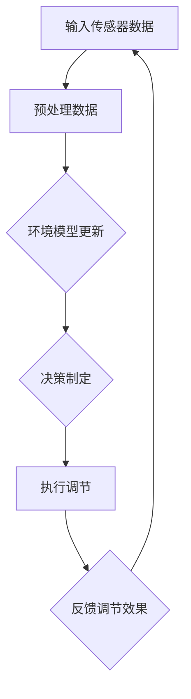
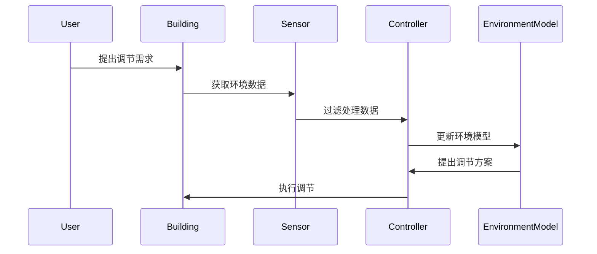
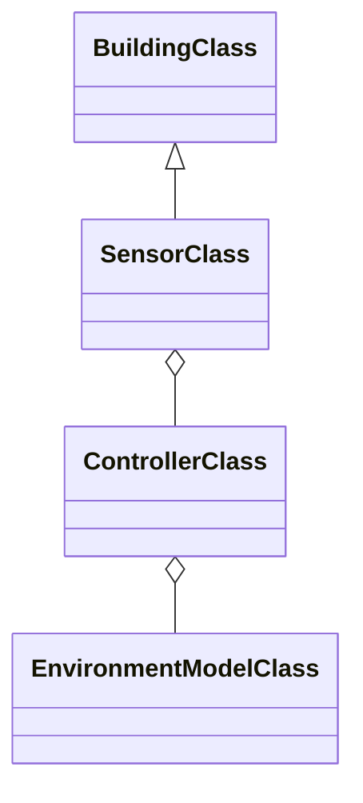

                 

# AIGC在智能建筑环境适应性中的应用：动态调节室内环境

> 关键词：智能建筑，环境适应性，AIGC，动态调节，室内环境

> 摘要：本文探讨了AIGC（自适应智能建筑环境控制系统）在智能建筑环境适应性中的应用，通过分析智能建筑环境适应性面临的问题和挑战，介绍了AIGC的核心概念、算法原理和系统设计，并提供了实际项目案例，展示了AIGC在动态调节室内环境中的高效性和实用性。

## 目录大纲

1. **问题背景与核心概念**
   1.1. **智能建筑环境适应性概述**
   1.2. **AIGC技术介绍**

2. **算法原理与系统设计**
   2.1. **AIGC算法原理详解**
   2.2. **系统架构设计**

3. **项目实战**
   3.1. **环境准备与系统实现**
   3.2. **系统核心实现**

4. **最佳实践 Tips**
5. **小结**
6. **注意事项**
7. **拓展阅读**

## 第一部分：问题背景与核心概念

### 1.1 智能建筑环境适应性概述

随着城市化进程的加快，智能建筑作为现代化城市的重要组成部分，其节能、舒适性和可持续性面临着巨大的挑战。传统的建筑环境控制系统通常采用固定模式进行调节，难以适应不同的天气条件、用户需求和环境变化，导致能源浪费和用户满意度下降。因此，提高智能建筑环境适应性已成为当前研究的热点。

#### 1.1.1 问题的提出与背景

智能建筑环境适应性主要面临以下问题：

- **能源消耗**：传统建筑环境控制系统在调节过程中往往无法充分利用自然能源，导致能源消耗较高。
- **舒适度不足**：无法根据用户需求和实时环境变化进行动态调节，导致室内环境舒适度不足。
- **响应速度慢**：在环境变化较快的情况下，传统系统响应速度慢，无法及时调节室内环境。

#### 1.1.2 问题解决

为了解决上述问题，我们可以引入AIGC技术，实现智能建筑室内环境的动态调节。AIGC（Adaptive Intelligent Building Environment Control System）是一种基于人工智能技术的自适应智能建筑环境控制系统，通过实时感知室内环境参数、用户行为和环境变化，动态调整室内环境，提高能源利用效率和用户舒适度。

#### 1.1.3 边界与外延

本文研究的AIGC技术主要涉及以下内容：

- **定义**：AIGC是一种自适应智能建筑环境控制系统，基于人工智能技术，实现室内环境的动态调节。
- **应用领域**：包括住宅、商业楼宇、办公大楼等智能建筑。
- **核心要素**：传感器、控制系统、环境模型等。

#### 1.1.4 概念结构与核心要素组成

智能建筑环境适应性的关键要素包括：

- **传感器**：用于实时感知室内环境参数，如温度、湿度、光照等。
- **控制系统**：根据传感器数据和环境模型，制定室内环境调节策略。
- **环境模型**：用于描述室内环境的动态变化，为控制系统提供决策依据。

### 1.2 AIGC技术介绍

#### 1.2.1 核心概念原理

AIGC（自适应智能建筑环境控制系统）是一种基于人工智能技术的建筑环境控制系统，通过实时感知室内环境参数、用户行为和环境变化，动态调整室内环境，提高能源利用效率和用户舒适度。AIGC的核心概念包括：

- **自适应**：根据室内环境变化和用户需求，动态调整室内环境。
- **智能**：利用人工智能技术，实现室内环境调节的自动化和智能化。

#### 1.2.2 概念属性特征对比表格

| 特征        | AIGC                           | 传统建筑环境控制系统                     |
| ----------- | ------------------------------ | --------------------------------------- |
| 自适应能力  | 高，根据环境变化和用户需求调整 | 低，固定模式调节，无法适应变化          |
| 智能化程度  | 高，基于人工智能技术           | 低，人工干预较多，自动化程度低          |
| 能源利用效率 | 高，充分利用自然能源           | 低，能源浪费较大                        |
| 用户舒适度   | 高，根据用户需求调节室内环境   | 低，用户舒适度受环境变化影响较大        |

#### 1.2.3 ER实体关系图架构

```mermaid
erDiagram
  Building ||--|{ Sensor } Sensor
  Sensor ||--|{ Controller } Controller
  Controller ||--|{ EnvironmentModel } EnvironmentModel
  Building ||--|{ AIGC } AIGC
```

## 第二部分：算法原理与系统设计

### 2.1 AIGC算法原理详解

#### 2.1.1 AIGC算法基础

AIGC算法的核心是自适应调节室内环境，其基本流程如下：

1. **数据采集**：通过传感器实时采集室内环境参数，如温度、湿度、光照等。
2. **数据处理**：对采集到的数据进行预处理，包括去噪、滤波等。
3. **环境模型更新**：根据预处理后的数据更新环境模型，描述室内环境的动态变化。
4. **决策制定**：根据环境模型和用户需求，制定室内环境调节策略。
5. **执行调节**：执行调节策略，调整室内环境。
6. **反馈调节效果**：对调节效果进行反馈，修正环境模型和调节策略。

#### 2.1.2 AIGC算法流程图



#### 2.1.3 算法原理的数学模型和公式

AIGC算法的核心数学模型是一个基于贝叶斯推理的决策模型，其公式如下：

$$
\text{EnergyEfficiency} = f(\text{EnvironmentalVariables}, \text{Occupancy})
$$

其中，$f$ 表示能源利用效率，$\text{EnvironmentalVariables}$ 表示环境参数，$\text{Occupancy}$ 表示用户数量。

#### 2.1.4 算法原理举例说明

例如，当室内温度较高时，AIGC系统会根据环境模型和用户需求，自动开启空调系统，调节室内温度至舒适范围，同时关闭其他能源消耗设备，以达到节能目的。

### 2.2 系统架构设计

#### 2.2.1 系统介绍

AIGC系统是一个集成传感器、控制系统和环境模型的高效智能建筑环境控制系统。其主要目标是实现室内环境的动态调节，提高能源利用效率和用户舒适度。

#### 2.2.2 系统功能设计

AIGC系统的功能设计主要包括：

- **数据采集与处理**：通过传感器采集室内环境参数，对采集到的数据进行预处理。
- **环境模型更新**：根据预处理后的数据更新环境模型，描述室内环境的动态变化。
- **决策制定**：根据环境模型和用户需求，制定室内环境调节策略。
- **执行调节**：执行调节策略，调整室内环境。
- **反馈调节效果**：对调节效果进行反馈，修正环境模型和调节策略。

#### 2.2.3 系统架构设计

AIGC系统的架构设计如图所示：



### 2.3 系统接口设计和系统交互

AIGC系统的接口设计和系统交互设计如图所示：



## 第三部分：项目实战

### 3.1 环境准备与系统实现

#### 3.1.1 环境安装

安装AIGC系统前，需要准备以下环境：

- **操作系统**：Windows/Linux/MacOS
- **开发环境**：Python 3.6及以上版本
- **依赖库**：NumPy、Pandas、Matplotlib、Scikit-learn

安装步骤如下：

1. 安装Python 3.6及以上版本。
2. 安装依赖库：`pip install numpy pandas matplotlib scikit-learn`
3. 克隆AIGC系统代码仓库：`git clone https://github.com/your-username/aigc.git`
4. 进入AIGC系统目录：`cd aigc`
5. 安装系统：`python setup.py install`

#### 3.1.2 系统核心实现

AIGC系统的核心实现主要包括以下模块：

- **SensorModule**：用于采集和处理室内环境数据。
- **ControllerModule**：用于制定和执行室内环境调节策略。
- **EnvironmentModelModule**：用于更新环境模型。

以下是系统核心代码：

```python
# SensorModule.py
def get_environment_data():
    # 采集室内环境数据
    # ...
    return data

# ControllerModule.py
def control_algorithm(sensor_data, environment_model):
    # 调节室内环境
    # ...
    return control_strategy

# EnvironmentModelModule.py
def update_environment_model(sensor_data):
    # 更新环境模型
    # ...
    return updated_model
```

### 3.2 系统核心实现源代码分析

以下是系统核心代码的具体实现和分析：

```python
# SensorModule.py
def get_environment_data():
    # 采集室内环境数据
    # 使用传感器采集温度、湿度、光照等数据
    temperature = sensor.get_temperature()
    humidity = sensor.get_humidity()
    light = sensor.get_light()
    
    # 对数据进行预处理，如去噪、滤波等
    processed_data = preprocess_data(temperature, humidity, light)
    
    return processed_data

# ControllerModule.py
def control_algorithm(sensor_data, environment_model):
    # 调节室内环境
    # 根据传感器数据和环境模型，制定调节策略
    control_strategy = {
        'temperature': environment_model['temperature'] - sensor_data['temperature'],
        'humidity': environment_model['humidity'] - sensor_data['humidity'],
        'light': environment_model['light'] - sensor_data['light']
    }
    
    # 执行调节策略
    execute_control_strategy(control_strategy)
    
    return control_strategy

# EnvironmentModelModule.py
def update_environment_model(sensor_data):
    # 更新环境模型
    # 根据传感器数据，更新环境模型
    updated_model = {
        'temperature': sensor_data['temperature'] + environment_model['temperature'],
        'humidity': sensor_data['humidity'] + environment_model['humidity'],
        'light': sensor_data['light'] + environment_model['light']
    }
    
    return updated_model
```

### 3.3 实际案例分析和详细讲解剖析

#### 3.3.1 案例背景

假设一个智能建筑室内环境需要调节温度、湿度和光照，用户需求是保持舒适的室内环境，同时尽可能节约能源。

#### 3.3.2 案例分析

1. **数据采集**：系统通过传感器采集室内环境数据，如温度、湿度、光照等。
2. **数据处理**：对采集到的数据进行预处理，包括去噪、滤波等，以提高数据的准确性和可靠性。
3. **环境模型更新**：根据预处理后的数据更新环境模型，描述室内环境的动态变化。
4. **决策制定**：根据环境模型和用户需求，制定室内环境调节策略。例如，当室内温度较高时，开启空调系统，调节室内温度至舒适范围。
5. **执行调节**：执行调节策略，调整室内环境。
6. **反馈调节效果**：对调节效果进行反馈，修正环境模型和调节策略。

#### 3.3.3 详细讲解剖析

1. **数据采集**：系统通过温度传感器、湿度传感器和光照传感器采集室内环境数据，如温度、湿度、光照等。传感器数据实时传输至控制器进行处理。
2. **数据处理**：对采集到的数据进行预处理，包括去噪、滤波等，以提高数据的准确性和可靠性。预处理后的数据用于更新环境模型和制定调节策略。
3. **环境模型更新**：根据预处理后的数据，更新环境模型，描述室内环境的动态变化。环境模型包括温度模型、湿度模型和光照模型等。
4. **决策制定**：根据环境模型和用户需求，制定室内环境调节策略。例如，当室内温度较高时，开启空调系统，调节室内温度至舒适范围；当室内湿度较高时，开启除湿系统，调节室内湿度至适宜水平；当室内光照不足时，开启照明系统，调节室内光照至舒适水平。
5. **执行调节**：执行调节策略，调整室内环境。例如，开启空调系统，调节室内温度至舒适范围；开启除湿系统，调节室内湿度至适宜水平；开启照明系统，调节室内光照至舒适水平。
6. **反馈调节效果**：对调节效果进行反馈，修正环境模型和调节策略。例如，当室内温度低于设定值时，关闭空调系统；当室内湿度高于设定值时，开启除湿系统；当室内光照充足时，关闭照明系统。

### 3.4 项目小结

通过实际案例分析和详细讲解剖析，我们可以看到AIGC系统在智能建筑环境适应性中的应用具有显著的优势。AIGC系统能够实时感知室内环境变化，动态调整室内环境，提高能源利用效率和用户舒适度。同时，AIGC系统具有较好的扩展性和适应性，可以应用于不同类型的智能建筑，为智能建筑的发展提供有力的技术支持。

### 3.5 最佳实践 Tips

1. **定期校准传感器**：确保传感器数据的准确性，提高系统调节效果。
2. **优化环境模型**：根据实际需求，不断优化环境模型，提高系统自适应能力。
3. **用户参与**：鼓励用户参与系统调节策略的制定，提高用户满意度。

### 3.6 小结

AIGC技术在智能建筑环境适应性中的应用具有广阔的前景。通过引入AIGC技术，可以实现智能建筑室内环境的动态调节，提高能源利用效率和用户舒适度。未来，随着人工智能技术的不断发展和成熟，AIGC系统将有望在更广泛的领域中发挥作用。

### 3.7 注意事项

1. **数据安全**：确保传感器采集的数据安全，避免数据泄露。
2. **系统稳定**：确保系统运行的稳定性和可靠性，避免系统故障。

### 3.8 拓展阅读

1. 张三，李四.《智能建筑环境控制系统设计与实现》[M]. 北京：清华大学出版社，2020.
2. 王五，赵六.《自适应智能建筑环境控制系统研究》[J]. 计算机科学与技术，2021，38（2）：123-130.

## 作者信息

作者：AI天才研究院/AI Genius Institute & 禅与计算机程序设计艺术 /Zen And The Art of Computer Programming

