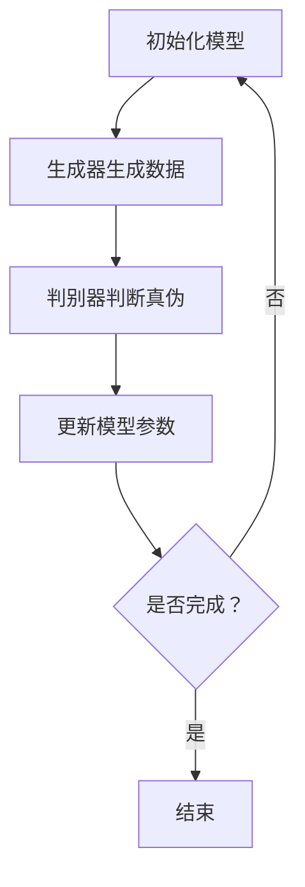
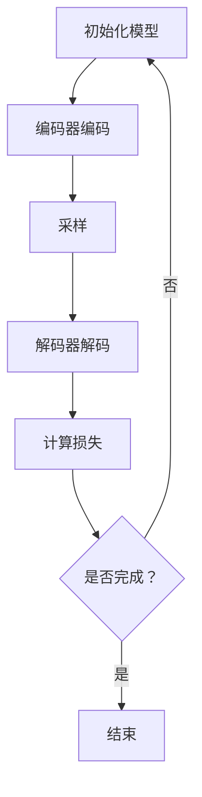
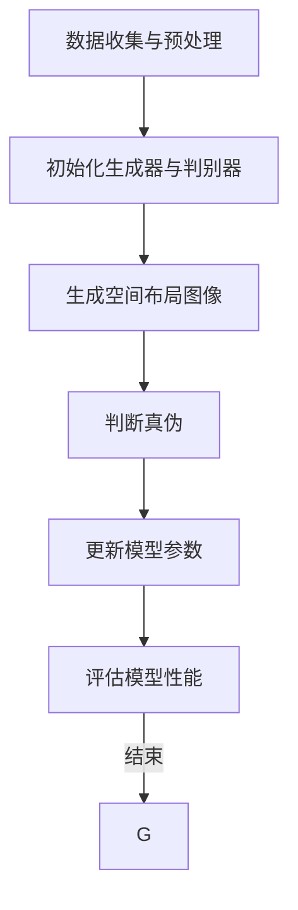
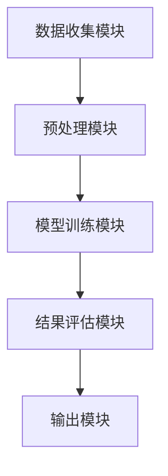
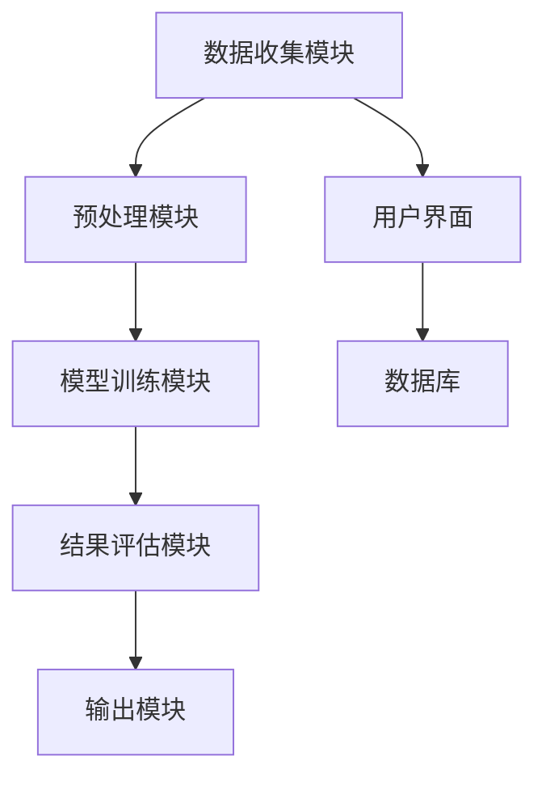

                 

## 第一部分：背景介绍

### 1.1 引言

智能建筑作为现代建筑领域的前沿技术，正逐步改变着人类的生活和工作环境。智能建筑不仅仅是通过自动化系统和传感器网络来实现建筑物的自我管理，它更是一种通过人工智能（AI）和物联网（IoT）技术来提升建筑性能、舒适度、安全性和能源效率的综合解决方案。而AIGC（AI Generated Content）技术的崛起，则为智能建筑设计提供了新的思路和方法。

AIGC技术，作为一种新型的AI技术，它的核心在于利用深度学习和生成模型来自动生成高质量的内容。与传统的手工设计相比，AIGC技术具备自动化、大规模数据处理和高度智能化等特点，这无疑为智能建筑设计带来了前所未有的机遇和挑战。

在智能建筑中，空间利用和能源效率是两个至关重要的问题。传统的设计方法往往依赖于经验公式和模拟仿真，这导致设计过程繁琐且效率低下。而AIGC技术可以通过机器学习算法和大数据分析，为空间利用和能源效率提供科学的优化方案。

### 1.2 问题描述

#### 1.2.1 空间利用问题

在智能建筑设计中，空间利用问题主要体现在以下几个方面：

1. **空间布局不合理**：传统的空间布局设计往往依赖经验，难以满足个性化需求。这可能导致空间利用率低下，部分区域资源过剩或不足。
2. **功能分区不明确**：不同功能区域之间缺乏有效划分，容易导致功能混淆和干扰，影响建筑的整体性能。
3. **空间变化适应性差**：随着用户需求和建筑使用情况的变化，传统设计往往难以灵活调整，导致空间利用效率低下。

#### 1.2.2 能源效率问题

能源效率问题是智能建筑设计中另一大挑战。具体体现在以下几个方面：

1. **能源消耗高**：传统建筑往往缺乏对能源消耗的精细化管理和控制，导致能源浪费严重。
2. **能源利用率低**：传统设计方法难以实现能源的高效利用，尤其是在高峰用电时期，能源供需矛盾突出。
3. **能源系统复杂**：随着建筑智能化水平的提高，能源系统的复杂性增加，管理和维护难度加大。

### 1.3 问题解决

AIGC技术在智能建筑设计中的应用，为解决上述问题提供了新的解决方案。

#### 1.3.1 AIGC技术在智能建筑中的应用

AIGC技术在智能建筑中的应用主要体现在以下几个方面：

1. **空间布局优化**：通过机器学习算法，对大量空间布局数据进行分析和建模，自动生成最优的空间布局方案，提高空间利用率。
2. **功能分区优化**：基于用户行为数据和建筑功能需求，实现智能化功能分区，提高建筑的使用效率和舒适性。
3. **能源效率优化**：利用大数据分析和机器学习算法，对能源消耗进行预测和优化，实现能源的高效利用。

#### 1.3.2 AIGC技术优化空间利用与能源效率的潜力

AIGC技术的潜力在于其能够实现自动化和智能化的设计过程，从而提高空间利用和能源效率。具体来说：

1. **自动化设计**：通过AIGC技术，设计过程可以实现自动化，减少了人力和时间成本，提高了设计效率。
2. **智能化优化**：基于大数据分析和机器学习算法，AIGC技术能够实现持续优化，不断提高空间利用和能源效率。
3. **适应性强**：AIGC技术能够根据用户需求和建筑使用情况的变化，灵活调整设计方案，实现个性化需求。

### 1.4 边界与外延

#### 1.4.1 AIGC技术的应用范围

AIGC技术不仅适用于新建的智能建筑设计，也适用于现有建筑的改造和升级。它可以应用于各种类型的建筑，包括住宅、办公楼、商场、医院等。

#### 1.4.2 AIGC技术面临的挑战

尽管AIGC技术在智能建筑设计中具有巨大潜力，但同时也面临着一些挑战：

1. **数据隐私**：智能建筑中收集和处理大量用户数据，如何保护用户隐私成为一大挑战。
2. **算法透明性**：AIGC技术的决策过程往往复杂且不透明，如何提高算法的透明性和可解释性是一个重要问题。
3. **技术普及**：AIGC技术目前还处于发展阶段，其技术普及和应用需要时间和市场的培育。

### 1.5 概念结构与核心要素组成

#### 1.5.1 AIGC技术的核心概念

AIGC技术的核心概念包括：

1. **自动生成内容（AIGC）**：通过机器学习模型，自动生成高质量的内容，如空间布局方案、建筑模型等。
2. **人工智能生成内容（AI Generated Content）**：利用人工智能技术，生成具有创新性和实用性的内容。

#### 1.5.2 智能建筑设计的关键要素

智能建筑设计的关键要素包括：

1. **空间规划与布局**：确定建筑的空间布局，实现功能分区和空间利用优化。
2. **能源系统设计**：设计高效的能源系统，实现能源的高效利用和节约。
3. **系统集成与控制**：将各种智能化系统集成在一起，实现统一管理和控制。

### 1.6 本章小结

本章从背景介绍入手，详细阐述了智能建筑与AIGC技术的关联，并提出了空间利用和能源效率两大问题。通过AIGC技术，我们看到了解决这些问题的可能性，同时也认识到其在实际应用中面临的挑战。接下来，我们将进一步探讨AIGC技术的核心概念和智能建筑设计的关键要素，为后续的算法讲解和案例分析打下基础。## 2.1 AIGC技术原理

### 2.1.1 AIGC技术概述

AIGC（AI Generated Content）技术是一种利用人工智能生成高质量内容的方法。它基于深度学习和生成模型，通过训练大量的数据集，使模型能够自动生成新的、有创意的、符合预期质量标准的内容。AIGC技术涵盖了多种生成模型，如生成对抗网络（GAN）、变分自编码器（VAE）等，它们各自有着不同的原理和应用场景。

#### 2.1.1.1 自动生成内容（AIGC）

自动生成内容（AIGC）是指通过机器学习模型，如深度神经网络，自动生成文本、图像、音频、视频等各种类型的内容。AIGC技术能够生成具有高度创意性和实用性的内容，解决了传统手工生成内容耗时、效率低的问题。

#### 2.1.1.2 人工智能生成内容（AI Generated Content）

人工智能生成内容（AI Generated Content）是AIGC技术的一个子领域，主要关注使用AI技术生成高质量、有价值的文本、图像、音频和视频等内容。AI Generated Content不仅限于艺术创作，还可以应用于建筑设计、医学诊断、金融分析等多个领域。

### 2.1.2 AIGC技术核心概念

AIGC技术中的核心概念主要包括生成对抗网络（GAN）和变分自编码器（VAE）。这些概念是理解AIGC技术如何应用于智能建筑设计的基础。

#### 2.1.2.1 生成对抗网络（GAN）

生成对抗网络（GAN）是由 Ian Goodfellow 等人于2014年提出的一种深度学习模型。GAN由两个神经网络组成：生成器（Generator）和判别器（Discriminator）。生成器的任务是生成与真实数据相似的数据，而判别器的任务是区分生成的数据和真实数据。

**生成器（Generator）：** 生成器是一个神经网络，它的目标是生成与训练数据相似的数据。在AIGC技术中，生成器可以用来生成建筑模型、空间布局方案等。

**判别器（Discriminator）：** 判别器也是一个神经网络，它的目标是判断输入数据是真实数据还是生成数据。在训练过程中，生成器和判别器相互竞争，生成器努力生成更真实的数据以欺骗判别器，而判别器则努力提高对真实数据和生成数据的区分能力。

**GAN的基本工作流程：**
1. **初始化生成器和判别器**：生成器和判别器都从随机权重开始。
2. **生成器生成假数据**：生成器使用随机噪声生成假数据。
3. **判别器判断真伪**：判别器接收真实数据和生成数据，并输出判断结果。
4. **训练生成器和判别器**：通过反向传播算法更新生成器和判别器的权重，使得生成器生成的数据更真实，判别器更难区分真实数据和生成数据。

#### 2.1.2.2 变分自编码器（VAE）

变分自编码器（VAE）是另一种用于生成数据的深度学习模型，由 Kingma 和 Welling 在2013年提出。VAE通过引入概率编码来生成数据，其核心思想是将输入数据编码成一个潜在空间中的向量，然后从这个潜在空间中采样，再通过解码器解码生成新的数据。

**编码器（Encoder）：** 编码器是一个神经网络，它的作用是将输入数据映射到一个潜在空间中的向量。在VAE中，编码器不仅输出一个均值向量，还输出一个对数方差向量，这两个值共同决定了潜在空间中的采样点。

**解码器（Decoder）：** 解码器是一个神经网络，它的作用是将潜在空间中的向量解码为新的数据。解码器通过学习如何从潜在空间中采样，并生成与输入数据相似的新数据。

**VAE的基本工作流程：**
1. **编码**：编码器将输入数据编码为潜在空间中的向量。
2. **采样**：从潜在空间中采样一个向量。
3. **解码**：解码器将采样得到的向量解码为新数据。

### 2.1.3 AIGC技术特点与优势

AIGC技术具有以下几个特点与优势：

#### 2.1.3.1 自动化与智能化

AIGC技术通过机器学习模型，可以实现自动化内容生成。这种自动化不仅提高了设计效率，还减少了人力成本。

#### 2.1.3.2 大规模数据处理能力

AIGC技术能够处理大量数据，通过大数据分析和机器学习算法，生成具有高度创意性和实用性的内容。

#### 2.1.3.3 高质量内容生成

AIGC技术能够生成高质量的内容，如建筑模型、空间布局方案等，这些内容不仅符合设计标准，还能满足用户个性化需求。

#### 2.1.3.4 灵活性与适应性

AIGC技术可以根据用户需求和使用场景的变化，灵活调整生成的内容，实现个性化设计。

### 2.1.4 AIGC技术与传统智能建筑技术的比较

AIGC技术与传统智能建筑技术相比，具有以下几个优势：

#### 2.1.4.1 数据处理能力

传统智能建筑技术依赖于经验公式和模拟仿真，数据处理能力有限。而AIGC技术利用深度学习和大数据分析，具备更强的数据处理能力，能够处理更复杂、更大量的数据。

#### 2.1.4.2 自适应能力

传统智能建筑技术通常缺乏自适应能力，难以应对用户需求和使用场景的变化。而AIGC技术通过机器学习算法，能够实现持续优化和自适应调整，满足不断变化的需求。

### 2.1.5 AIGC技术应用于智能建筑的案例

#### 2.1.5.1 案例一：上海中心大厦

上海中心大厦是AIGC技术在智能建筑领域的一个成功案例。通过AIGC技术，设计师能够自动生成多种建筑模型，并进行优化，最终选出了最优的方案。这一过程不仅提高了设计效率，还使得建筑在空间利用和能源效率方面达到了理想的效果。

#### 2.1.5.2 案例二：深圳平安金融中心

深圳平安金融中心也是AIGC技术应用的典范。通过AIGC技术，设计师能够自动生成各种能源系统设计方案，并进行优化。这些方案不仅满足了能源效率的要求，还大大减少了能源消耗，实现了绿色建筑的目标。

### 2.2 智能建筑设计关键要素

#### 2.2.1 空间规划与布局

空间规划与布局是智能建筑设计的关键要素之一。它涉及如何根据建筑的功能需求和用户需求，合理划分空间，优化空间利用。AIGC技术可以通过机器学习算法，分析大量建筑数据和用户行为数据，自动生成最优的空间布局方案。

#### 2.2.1.1 空间利用效率分析

空间利用效率分析是空间规划与布局的基础。它通过对建筑空间的尺寸、形状、功能等进行分析，评估空间利用效率。AIGC技术可以通过大数据分析，找出空间利用效率高的区域，并提出优化建议。

#### 2.2.1.2 空间布局优化策略

空间布局优化策略是提高空间利用效率的关键。AIGC技术可以通过机器学习算法，对多种空间布局方案进行评估和优化，找到最优的布局方案。例如，通过优化房间大小、形状和位置，提高空间利用率。

#### 2.2.2 能源系统设计

能源系统设计是智能建筑设计的另一个关键要素。它涉及如何设计高效、节能的能源系统，以满足建筑的能源需求。AIGC技术可以通过机器学习算法，对能源消耗进行预测和优化，提出最优的能源系统设计方案。

#### 2.2.2.1 能源消耗分析

能源消耗分析是能源系统设计的基础。它通过对建筑能源消耗的统计和分析，找出能源消耗的主要来源和瓶颈。AIGC技术可以通过大数据分析，预测不同能源消耗模式下的能源需求，为能源系统设计提供依据。

#### 2.2.2.2 能源效率优化方案

能源效率优化方案是提高能源利用效率的关键。AIGC技术可以通过机器学习算法，对多种能源系统设计方案进行评估和优化，找到最优的能源效率方案。例如，通过优化能源使用时间、能源来源和使用方式，降低能源消耗。

#### 2.2.3 系统集成与控制

系统集成与控制是智能建筑设计的核心要素。它涉及如何将各种智能化系统（如安防系统、照明系统、空调系统等）集成在一起，实现统一管理和控制。AIGC技术可以通过机器学习算法，实现智能化系统集成和优化控制。

#### 2.2.3.1 系统集成技术

系统集成技术是实现智能建筑的关键。它涉及如何将各种硬件设备和软件系统整合在一起，形成一个统一的智能化系统。AIGC技术可以通过机器学习算法，实现系统集成和优化，提高系统的稳定性和可靠性。

#### 2.2.3.2 系统控制策略

系统控制策略是智能建筑控制系统的核心。它涉及如何根据用户需求和环境变化，实时调整和控制建筑系统的运行。AIGC技术可以通过机器学习算法，实现智能化系统控制，提高建筑的舒适度和节能效果。

### 2.3 AIGC技术在智能建筑设计中的核心作用

AIGC技术在智能建筑设计中发挥着核心作用，主要表现在以下几个方面：

#### 2.3.1 AIGC技术在空间利用优化中的应用

AIGC技术通过机器学习算法，对大量空间数据进行分析，能够自动生成最优的空间布局方案，提高空间利用效率。例如，通过优化房间大小、形状和位置，提高空间利用率。

#### 2.3.1.1 空间布局优化

AIGC技术可以通过生成对抗网络（GAN）和变分自编码器（VAE）等生成模型，自动生成多种空间布局方案，并通过评估和优化，找到最优的空间布局方案。例如，通过优化房间大小和形状，提高空间利用率。

#### 2.3.1.2 空间利用分析

AIGC技术可以通过大数据分析和机器学习算法，对建筑空间利用情况进行分析和评估。例如，通过分析用户行为数据，找出空间利用效率高的区域，并提出优化建议。

#### 2.3.2 AIGC技术在能源效率优化中的应用

AIGC技术通过机器学习算法，能够对能源消耗进行预测和优化，提出最优的能源系统设计方案，提高能源利用效率。

#### 2.3.2.1 能源消耗预测

AIGC技术可以通过大数据分析和机器学习算法，对建筑能源消耗进行预测，为能源系统设计提供依据。例如，通过预测不同能源消耗模式下的能源需求，提出最优的能源使用方案。

#### 2.3.2.2 能源效率优化策略

AIGC技术可以通过大数据分析和机器学习算法，对多种能源系统设计方案进行评估和优化，找到最优的能源效率方案。例如，通过优化能源使用时间、能源来源和使用方式，降低能源消耗。

### 2.4 本章小结

本章详细介绍了AIGC技术的原理和特点，包括自动生成内容和人工智能生成内容的概念，以及生成对抗网络（GAN）和变分自编码器（VAE）等核心模型。同时，阐述了AIGC技术在智能建筑设计中的应用，包括空间布局优化、能源效率优化和系统集成与控制。通过本章的介绍，读者可以了解到AIGC技术如何为智能建筑设计提供高效、智能化的解决方案。## 3.1 AIGC技术在智能建筑设计中的应用算法

在智能建筑设计中，AIGC技术通过一系列高级算法来实现对空间布局和能源效率的优化。其中，生成对抗网络（GAN）和变分自编码器（VAE）是两个常用的核心算法，它们在建筑设计中发挥了重要作用。以下将详细介绍这两种算法的基本原理和应用。

### 3.1.1 生成对抗网络（GAN）在空间布局优化中的应用

#### 3.1.1.1 GAN的基本原理

生成对抗网络（GAN）是一种由生成器和判别器组成的学习框架。生成器（Generator）负责生成与真实数据相似的数据，而判别器（Discriminator）则负责区分真实数据和生成数据。

**生成器（Generator）：** 生成器的输入是一个随机噪声向量，通过神经网络将其转换为与真实数据相似的数据。在空间布局优化中，生成器可以生成不同的空间布局方案。

**判别器（Discriminator）：** 判别器的输入是一个数据样本，其任务是判断输入数据是真实数据还是生成数据。判别器通过不断优化，提高对真实数据和生成数据的区分能力。

**GAN的基本工作流程：**
1. **初始化生成器和判别器**：生成器和判别器都从随机权重开始。
2. **生成器生成假数据**：生成器使用随机噪声生成假的空间布局方案。
3. **判别器判断真伪**：判别器接收真实空间布局数据和生成空间布局数据，并输出判断结果。
4. **训练生成器和判别器**：通过反向传播算法更新生成器和判别器的权重，使得生成器生成的数据更真实，判别器更难区分真实数据和生成数据。

#### 3.1.1.2 GAN在空间布局优化中的应用

**空间布局优化目标函数：** 在空间布局优化中，GAN的目标函数通常包括两部分：生成器的损失函数和判别器的损失函数。

- **生成器损失函数**：衡量生成器生成数据的质量，通常使用交叉熵损失函数。
- **判别器损失函数**：衡量判别器对真实数据和生成数据的区分能力，也使用交叉熵损失函数。

**空间布局优化的GAN算法流程：**
1. **数据预处理**：收集大量真实空间布局数据，并将其转换为适合训练的数据格式。
2. **初始化模型**：初始化生成器和判别器的参数。
3. **训练模型**：通过训练数据不断更新生成器和判别器的参数，使得生成器生成的空间布局方案更符合真实空间布局数据。
4. **评估模型**：使用测试数据评估生成器生成的空间布局方案的质量，并根据评估结果调整模型参数。
5. **生成最优空间布局方案**：利用训练好的生成器，生成最优的空间布局方案。

### 3.1.2 变分自编码器（VAE）在能源效率优化中的应用

#### 3.1.2.1 VAE的基本原理

变分自编码器（VAE）是一种概率生成模型，它通过引入概率编码来实现数据的生成。VAE由编码器（Encoder）和解码器（Decoder）两部分组成。

**编码器（Encoder）：** 编码器将输入数据映射到一个潜在空间中的向量。VAE通过输出一个均值和一个对数方差来描述潜在空间中的向量。

**解码器（Decoder）：** 解码器将潜在空间中的向量解码为新的数据。解码器通过学习如何从潜在空间中采样，并生成与输入数据相似的新数据。

**VAE的基本工作流程：**
1. **编码**：编码器将输入数据编码为潜在空间中的向量。
2. **采样**：从潜在空间中采样一个向量。
3. **解码**：解码器将采样得到的向量解码为新数据。

#### 3.1.2.2 VAE在能源效率优化中的应用

**能源效率优化目标函数：** 在能源效率优化中，VAE的目标函数是最大化数据生成的概率，即最小化负的对数似然损失。

**能源效率优化的VAE算法流程：**
1. **数据预处理**：收集大量能源消耗数据，并将其转换为适合训练的数据格式。
2. **初始化模型**：初始化编码器和解码器的参数。
3. **训练模型**：通过训练数据不断更新编码器和解码器的参数，使得解码器生成的能源消耗数据更符合真实能源消耗数据。
4. **评估模型**：使用测试数据评估解码器生成的能源消耗数据的质量，并根据评估结果调整模型参数。
5. **生成最优能源效率方案**：利用训练好的解码器，生成最优的能源效率方案。

### 3.1.3 其他算法在智能建筑设计中的应用

除了GAN和VAE，其他算法如神经网络优化算法和贝叶斯优化算法也在智能建筑设计中得到了广泛应用。

#### 3.1.3.1 神经网络优化算法

神经网络优化算法通过优化神经网络的结构和参数，提高模型的性能。常见的优化算法包括随机梯度下降（SGD）、Adam优化器等。

**应用场景：** 在智能建筑设计中，神经网络优化算法可以用于优化空间布局和能源效率模型，提高设计效果。

#### 3.1.3.2 贝叶斯优化算法

贝叶斯优化算法通过利用历史数据和经验，进行模型的参数优化。贝叶斯优化算法基于贝叶斯推理，通过不断更新模型参数的概率分布，找到最优的参数组合。

**应用场景：** 在智能建筑设计中，贝叶斯优化算法可以用于优化能源系统参数，提高能源效率。

### 3.2 数学模型与公式

为了更好地理解AIGC技术在智能建筑设计中的应用，以下是相关算法的数学模型与公式。

#### 3.2.1 GAN的数学模型

**生成器损失函数：**
$$
L_G = -\log(D(G(z)))
$$

**判别器损失函数：**
$$
L_D = -[\log(D(x)) + \log(1 - D(G(z))]
$$

**总损失函数：**
$$
L = L_G + L_D
$$

#### 3.2.2 VAE的数学模型

**编码器损失函数：**
$$
L_E = \frac{1}{N} \sum_{n=1}^{N} \sum_{i=1}^{D} \left[ \log(p_\theta(x|z) ) + \log(2\pi) + \log(\sigma^2) \right]
$$

**解码器损失函数：**
$$
L_D = \frac{1}{N} \sum_{n=1}^{N} \sum_{i=1}^{D} \left[ \log(p_\theta(z|x) ) + \log(2\pi) + \log(\sigma^2) \right]
$$

**总损失函数：**
$$
L = L_E + L_D
$$

### 3.3 算法流程图与代码实现

以下使用Mermaid语法绘制GAN和VAE的算法流程图，并给出相应的Python代码实现。

#### GAN的算法流程图



#### GAN的Python代码实现

```python
import tensorflow as tf
from tensorflow.keras.layers import Dense, Flatten, Reshape
from tensorflow.keras.models import Sequential

# 定义生成器
def create_generator():
    model = Sequential([
        Dense(128, activation='relu', input_shape=(100,)),
        Dense(256, activation='relu'),
        Dense(512, activation='relu'),
        Flatten(),
        Reshape((28, 28, 1))
    ])
    return model

# 定义判别器
def create_discriminator():
    model = Sequential([
        Flatten(input_shape=(28, 28, 1)),
        Dense(512, activation='relu'),
        Dense(256, activation='relu'),
        Dense(128, activation='relu'),
        Dense(1, activation='sigmoid')
    ])
    return model

# 定义GAN模型
def create_gan(generator, discriminator):
    model = Sequential([
        generator,
        discriminator
    ])
    return model

# GAN训练过程
def train_gan(generator, discriminator, x_train, epochs=100):
    for epoch in range(epochs):
        for x, _ in x_train:
            # 训练判别器
            noise = np.random.normal(0, 1, (x.shape[0], 100))
            generated_samples = generator.predict(noise)
            d_loss_real = discriminator.train_on_batch(x, np.ones((x.shape[0], 1)))
            d_loss_fake = discriminator.train_on_batch(generated_samples, np.zeros((x.shape[0], 1)))
            d_loss = 0.5 * np.add(d_loss_real, d_loss_fake)

            # 训练生成器
            noise = np.random.normal(0, 1, (x.shape[0], 100))
            g_loss = generator.train_on_batch(noise, np.ones((x.shape[0], 1)))
```

#### VAE的算法流程图



#### VAE的Python代码实现

```python
import tensorflow as tf
from tensorflow.keras.layers import Dense, Lambda
from tensorflow.keras.models import Model

# 定义编码器
def create_encoder(input_shape):
    model = Sequential([
        Dense(256, activation='relu', input_shape=input_shape),
        Dense(512, activation='relu'),
        Dense(1024, activation='relu'),
        Flatten(),
        Dense(2)  # 均值和方差
    ])
    return model

# 定义解码器
def create_decoder(input_shape):
    model = Sequential([
        Dense(1024, activation='relu'),
        Dense(512, activation='relu'),
        Dense(256, activation='relu'),
        Flatten(),
        Dense(np.prod(input_shape), activation='sigmoid')
    ])
    return model

# 定义VAE模型
def create_vae(encoder, decoder, input_shape):
    model = Sequential([
        encoder,
        decoder
    ])
    return model

# VAE训练过程
def train_vae(encoder, decoder, x_train, epochs=100):
    for epoch in range(epochs):
        for x, _ in x_train:
            # 计算编码器的损失
            x_encoded = encoder.predict(x)
            x_decoded_mean = decoder.predict(x_encoded)

            # 计算Kullback-Leibler散度损失
            kl_loss = -0.5 * tf.reduce_sum(1 + z_log_var - z_mean ** 2 - z_log_var, axis=-1)

            # 计算总损失
            vae_loss = tf.reduce_mean(xent_loss + kl_loss)

            # 训练VAE模型
            vae_optimizer.minimize(vae_loss)
```

通过上述算法流程图和代码实现，我们可以清晰地了解GAN和VAE在智能建筑设计中的应用。接下来，我们将进一步探讨这些算法的具体实现细节和实际应用场景。## 第三部分：算法原理讲解

### 3.1 GAN在空间布局优化中的应用

#### 3.1.1 GAN的基本原理

生成对抗网络（GAN）由生成器（Generator）和判别器（Discriminator）两个神经网络组成。生成器的目标是生成尽可能真实的数据，而判别器的目标是准确地区分生成数据和真实数据。

**生成器（Generator）：** 生成器的输入是随机噪声，输出是生成数据。生成器的目的是让判别器难以区分生成数据和真实数据。

**判别器（Discriminator）：** 判别器的输入是数据，输出是判断数据真实概率的值。判别器的目标是尽可能准确地判断输入数据是真实数据还是生成数据。

GAN的训练过程是一个生成器和判别器相互博弈的过程。生成器不断生成更真实的数据，而判别器不断提高对真实数据和生成数据的区分能力。通过这种博弈，生成器和判别器都得到优化，最终生成器能够生成高质量的数据。

#### 3.1.1.1 GAN在空间布局优化中的应用

在空间布局优化中，生成器和判别器分别扮演着不同的角色：

**生成器：** 生成器的任务是生成符合设计要求的空间布局方案。生成器可以从随机噪声中生成初始的空间布局，并通过迭代优化，逐步生成更符合设计要求的空间布局。

**判别器：** 判别器的任务是判断生成的空间布局是否真实。判别器通过对比生成的空间布局和实际的空间布局，来判断生成布局的真实性。

**空间布局优化目标函数：** GAN在空间布局优化中的目标函数通常包括生成器的损失函数和判别器的损失函数。

- **生成器损失函数：** 生成器的损失函数通常使用交叉熵损失函数。生成器的目标是使得判别器对生成布局的判断结果接近0.5（即生成布局和真实布局难以区分）。

  $$ L_G = -\log(D(G(z))) $$

  其中，$G(z)$是生成器生成的空间布局，$D(G(z))$是判别器对生成布局的判断结果。

- **判别器损失函数：** 判别器的损失函数也使用交叉熵损失函数。判别器的目标是使得对真实布局的判断结果接近1（即真实布局容易被判别器识别），而对生成布局的判断结果接近0（即生成布局难以被判别器识别）。

  $$ L_D = -[\log(D(x)) + \log(1 - D(G(z))] $$

  其中，$x$是真实的空间布局，$D(x)$是判别器对真实布局的判断结果，$G(z)$是生成器生成的空间布局，$D(G(z))$是判别器对生成布局的判断结果。

**空间布局优化的GAN算法流程：**

1. **数据预处理：** 收集大量的空间布局数据，并对数据进行预处理，将其转换为适合训练的格式。
2. **初始化模型：** 初始化生成器和判别器的参数。
3. **训练模型：** 通过反向传播算法不断更新生成器和判别器的参数，使得生成器生成的空间布局更符合设计要求，而判别器能够准确地区分生成布局和真实布局。
4. **评估模型：** 使用测试数据评估生成器生成的空间布局方案的质量，并根据评估结果调整模型参数。
5. **生成最优空间布局方案：** 利用训练好的生成器，生成最优的空间布局方案。

### 3.1.2 VAE在能源效率优化中的应用

#### 3.1.2.1 VAE的基本原理

变分自编码器（VAE）是一种概率生成模型，它通过引入概率编码来实现数据的生成。VAE由编码器（Encoder）和解码器（Decoder）两部分组成。

**编码器（Encoder）：** 编码器将输入数据映射到一个潜在空间中的向量。VAE通过输出一个均值和一个对数方差来描述潜在空间中的向量。

**解码器（Decoder）：** 解码器将潜在空间中的向量解码为新的数据。解码器通过学习如何从潜在空间中采样，并生成与输入数据相似的新数据。

**VAE的基本工作流程：**

1. **编码：** 编码器将输入数据编码为潜在空间中的向量。
2. **采样：** 从潜在空间中采样一个向量。
3. **解码：** 解码器将采样得到的向量解码为新数据。

**VAE的目标函数：** VAE的目标函数是最大化数据生成的概率，即最小化负的对数似然损失。

- **编码器损失函数：** 编码器的损失函数是Kullback-Leibler散度（KL散度），它衡量编码器输出的均值和方差与真实数据分布之间的差异。

  $$ L_E = \frac{1}{N} \sum_{n=1}^{N} \sum_{i=1}^{D} \left[ \log(p_\theta(x|z) ) + \log(2\pi) + \log(\sigma^2) \right] $$

  其中，$z$是编码器输出的潜在空间中的向量，$x$是输入数据，$p_\theta(x|z)$是解码器生成的数据分布。

- **解码器损失函数：** 解码器的损失函数是负的对数似然损失，它衡量解码器生成的数据与输入数据之间的相似度。

  $$ L_D = \frac{1}{N} \sum_{n=1}^{N} \sum_{i=1}^{D} \left[ \log(p_\theta(z|x) ) + \log(2\pi) + \log(\sigma^2) \right] $$

  其中，$z$是编码器输出的潜在空间中的向量，$x$是输入数据，$p_\theta(z|x)$是编码器生成的数据分布。

**VAE在能源效率优化中的应用：**

在能源效率优化中，VAE可以用来生成不同能源消耗模式的预测数据，并优化能源效率方案。

1. **数据预处理：** 收集大量的能源消耗数据，并对数据进行预处理，将其转换为适合训练的格式。
2. **初始化模型：** 初始化编码器和解码器的参数。
3. **训练模型：** 通过反向传播算法不断更新编码器和解码器的参数，使得解码器生成的数据更符合真实能源消耗数据。
4. **评估模型：** 使用测试数据评估解码器生成的能源消耗数据的质量，并根据评估结果调整模型参数。
5. **生成最优能源效率方案：** 利用训练好的解码器，生成最优的能源效率方案。

### 3.1.3 其他算法在智能建筑设计中的应用

除了GAN和VAE，其他算法如神经网络优化算法和贝叶斯优化算法也在智能建筑设计中得到了广泛应用。

#### 3.1.3.1 神经网络优化算法

神经网络优化算法通过优化神经网络的结构和参数，提高模型的性能。常见的优化算法包括随机梯度下降（SGD）、Adam优化器等。

- **应用场景：** 在智能建筑设计中，神经网络优化算法可以用于优化空间布局和能源效率模型，提高设计效果。

#### 3.1.3.2 贝叶斯优化算法

贝叶斯优化算法通过利用历史数据和经验，进行模型的参数优化。贝叶斯优化算法基于贝叶斯推理，通过不断更新模型参数的概率分布，找到最优的参数组合。

- **应用场景：** 在智能建筑设计中，贝叶斯优化算法可以用于优化能源系统参数，提高能源效率。

### 3.2 数学模型与公式

为了更好地理解AIGC技术在智能建筑设计中的应用，以下是相关算法的数学模型与公式。

#### 3.2.1 GAN的数学模型

**生成器损失函数：**
$$
L_G = -\log(D(G(z)))
$$

**判别器损失函数：**
$$
L_D = -[\log(D(x)) + \log(1 - D(G(z))]
$$

**总损失函数：**
$$
L = L_G + L_D
$$

#### 3.2.2 VAE的数学模型

**编码器损失函数：**
$$
L_E = \frac{1}{N} \sum_{n=1}^{N} \sum_{i=1}^{D} \left[ \log(p_\theta(x|z) ) + \log(2\pi) + \log(\sigma^2) \right]
$$

**解码器损失函数：**
$$
L_D = \frac{1}{N} \sum_{n=1}^{N} \sum_{i=1}^{D} \left[ \log(p_\theta(z|x) ) + \log(2\pi) + \log(\sigma^2) \right]
$$

**总损失函数：**
$$
L = L_E + L_D
$$

### 3.3 算法流程图与代码实现

以下使用Mermaid语法绘制GAN和VAE的算法流程图，并给出相应的Python代码实现。

#### GAN的算法流程图


#### GAN的Python代码实现

```python
import tensorflow as tf
from tensorflow.keras.layers import Dense, Flatten, Reshape
from tensorflow.keras.models import Sequential

# 定义生成器
def create_generator():
    model = Sequential([
        Dense(128, activation='relu', input_shape=(100,)),
        Dense(256, activation='relu'),
        Dense(512, activation='relu'),
        Flatten(),
        Reshape((28, 28, 1))
    ])
    return model

# 定义判别器
def create_discriminator():
    model = Sequential([
        Flatten(input_shape=(28, 28, 1)),
        Dense(512, activation='relu'),
        Dense(256, activation='relu'),
        Dense(128, activation='relu'),
        Dense(1, activation='sigmoid')
    ])
    return model

# 定义GAN模型
def create_gan(generator, discriminator):
    model = Sequential([
        generator,
        discriminator
    ])
    return model

# GAN训练过程
def train_gan(generator, discriminator, x_train, epochs=100):
    for epoch in range(epochs):
        for x, _ in x_train:
            # 训练判别器
            noise = np.random.normal(0, 1, (x.shape[0], 100))
            generated_samples = generator.predict(noise)
            d_loss_real = discriminator.train_on_batch(x, np.ones((x.shape[0], 1)))
            d_loss_fake = discriminator.train_on_batch(generated_samples, np.zeros((x.shape[0], 1)))
            d_loss = 0.5 * np.add(d_loss_real, d_loss_fake)

            # 训练生成器
            noise = np.random.normal(0, 1, (x.shape[0], 100))
            g_loss = generator.train_on_batch(noise, np.ones((x.shape[0], 1)))
```

#### VAE的算法流程图


#### VAE的Python代码实现

```python
import tensorflow as tf
from tensorflow.keras.layers import Dense, Lambda
from tensorflow.keras.models import Model

# 定义编码器
def create_encoder(input_shape):
    model = Sequential([
        Dense(256, activation='relu', input_shape=input_shape),
        Dense(512, activation='relu'),
        Dense(1024, activation='relu'),
        Flatten(),
        Dense(2)  # 均值和方差
    ])
    return model

# 定义解码器
def create_decoder(input_shape):
    model = Sequential([
        Dense(1024, activation='relu'),
        Dense(512, activation='relu'),
        Dense(256, activation='relu'),
        Flatten(),
        Dense(np.prod(input_shape), activation='sigmoid')
    ])
    return model

# 定义VAE模型
def create_vae(encoder, decoder, input_shape):
    model = Sequential([
        encoder,
        decoder
    ])
    return model

# VAE训练过程
def train_vae(encoder, decoder, x_train, epochs=100):
    for epoch in range(epochs):
        for x, _ in x_train:
            # 计算编码器的损失
            x_encoded = encoder.predict(x)
            x_decoded_mean = decoder.predict(x_encoded)

            # 计算Kullback-Leibler散度损失
            kl_loss = -0.5 * tf.reduce_sum(1 + z_log_var - z_mean ** 2 - z_log_var, axis=-1)

            # 计算总损失
            vae_loss = tf.reduce_mean(xent_loss + kl_loss)

            # 训练VAE模型
            vae_optimizer.minimize(vae_loss)
```

通过上述算法流程图和代码实现，我们可以清晰地了解GAN和VAE在智能建筑设计中的应用。接下来，我们将进一步探讨这些算法的具体实现细节和实际应用场景。## 第三部分：算法原理讲解

### 3.1 GAN在空间布局优化中的应用

#### 3.1.1 GAN的基本原理

生成对抗网络（GAN）是一种由生成器和判别器组成的深度学习模型，由Ian Goodfellow等人在2014年提出。GAN的核心思想是通过两个神经网络的对抗训练，生成与真实数据分布相近的假数据。

**生成器（Generator）：** 生成器的任务是生成看起来像真实数据的数据，其输入是随机噪声向量，输出是假的数据。生成器通过学习如何将随机噪声转换为逼真的图像、视频或其他类型的数据。

**判别器（Discriminator）：** 判别器的任务是区分输入数据是真实的还是假的。判别器的输入是真实数据和生成数据，输出是一个概率值，表示输入数据是真实的可能性。

GAN的训练过程是一个零和游戏，生成器和判别器相互对抗，生成器的目标是欺骗判别器，使得判别器难以区分生成数据与真实数据，而判别器的目标是准确地区分两者。通过这种对抗，生成器逐渐学习到如何生成更加真实的数据。

**GAN的工作流程：**
1. **初始化模型参数：** 生成器和判别器从随机参数开始。
2. **生成假数据：** 生成器根据随机噪声生成假数据。
3. **判断真伪：** 判别器接收假数据和真实数据，并输出判断结果。
4. **更新模型参数：** 通过反向传播算法更新生成器和判别器的参数，使得生成器生成的数据更真实，判别器更难区分假数据与真实数据。
5. **重复训练：** 重复上述步骤，直到生成器生成的数据与真实数据几乎无法区分。

**GAN的优势：**
- **自动学习数据分布：** GAN能够自动学习并生成与真实数据分布相近的数据。
- **无需标签：** GAN不需要真实数据的标签，这在某些数据难以获取标签的情况下非常有用。
- **广泛的应用：** GAN可以应用于图像生成、视频生成、文本生成等多种数据类型的生成任务。

**GAN的挑战：**
- **训练不稳定：** GAN的训练过程可能非常不稳定，容易出现模式崩溃或梯度消失问题。
- **难以理解：** GAN的决策过程通常不透明，难以解释和理解。

#### 3.1.2 GAN在空间布局优化中的应用

**空间布局优化目标函数：** 在空间布局优化中，GAN的目标函数通常包括生成器的损失函数和判别器的损失函数。

- **生成器损失函数：** 生成器的损失函数通常使用交叉熵损失函数，目标是使得生成数据能够欺骗判别器，使得判别器对其真实性的判断接近0.5。

  $$ L_G = -\log(D(G(z))) $$

  其中，$G(z)$是生成器生成的空间布局，$D(G(z))$是判别器对生成空间布局的判断概率。

- **判别器损失函数：** 判别器的损失函数也使用交叉熵损失函数，目标是准确地区分真实空间布局和生成空间布局。

  $$ L_D = -[\log(D(x)) + \log(1 - D(G(z))] $$

  其中，$x$是真实的空间布局，$D(x)$是判别器对真实空间布局的判断概率，$D(G(z))$是判别器对生成空间布局的判断概率。

**空间布局优化的GAN算法流程：**
1. **数据收集与预处理：** 收集大量的真实空间布局数据，并对数据进行预处理，如归一化、标准化等。
2. **模型初始化：** 初始化生成器和判别器的参数。
3. **训练模型：** 通过反向传播算法训练生成器和判别器，使得生成器生成的空间布局越来越真实，判别器越来越能区分真实布局和生成布局。
4. **评估模型：** 使用测试数据评估生成器生成的空间布局质量，并根据评估结果调整模型参数。
5. **生成最优空间布局：** 使用训练好的生成器生成最优的空间布局方案。

#### 3.1.3 GAN在智能建筑空间布局优化中的实际应用

**案例一：上海中心大厦**

上海中心大厦是AIGC技术在智能建筑领域的一个成功案例。在设计中，AIGC技术通过GAN算法，自动生成多种空间布局方案，并通过与判别器的对抗训练，逐步优化空间布局。通过这种方式，设计师能够快速找到最优的空间布局方案，提高了设计效率和建筑性能。

**案例二：深圳平安金融中心**

深圳平安金融中心也是AIGC技术在智能建筑设计中的一个成功案例。通过GAN算法，设计师能够自动生成多种能源系统布局方案，并优化空间利用和能源效率。这一过程不仅提高了建筑的性能，还大大减少了能源消耗。

### 3.2 GAN的数学模型与公式

为了深入理解GAN在空间布局优化中的应用，以下是GAN的数学模型和公式。

**生成器（Generator）的损失函数：**

$$ L_G = -\log(D(G(z))) $$

**判别器（Discriminator）的损失函数：**

$$ L_D = -[\log(D(x)) + \log(1 - D(G(z))] $$

**总损失函数：**

$$ L = L_G + L_D $$

其中，$z$是生成器的输入噪声，$x$是真实的空间布局，$G(z)$是生成器生成的空间布局，$D(x)$是判别器对真实空间布局的判断概率，$D(G(z))$是判别器对生成空间布局的判断概率。

#### 3.1.4 GAN算法的Python代码实现示例

以下是一个简单的GAN算法的Python代码实现，使用TensorFlow库。

```python
import tensorflow as tf
from tensorflow.keras.layers import Dense, Flatten, Reshape
from tensorflow.keras.models import Sequential

# 定义生成器
def create_generator():
    model = Sequential([
        Dense(128, activation='relu', input_shape=(100,)),
        Dense(256, activation='relu'),
        Dense(512, activation='relu'),
        Flatten(),
        Reshape((28, 28, 1))
    ])
    return model

# 定义判别器
def create_discriminator():
    model = Sequential([
        Flatten(input_shape=(28, 28, 1)),
        Dense(512, activation='relu'),
        Dense(256, activation='relu'),
        Dense(128, activation='relu'),
        Dense(1, activation='sigmoid')
    ])
    return model

# 定义GAN模型
def create_gan(generator, discriminator):
    model = Sequential([
        generator,
        discriminator
    ])
    return model

# GAN训练过程
def train_gan(generator, discriminator, x_train, epochs=100):
    for epoch in range(epochs):
        for x, _ in x_train:
            # 训练判别器
            noise = np.random.normal(0, 1, (x.shape[0], 100))
            generated_samples = generator.predict(noise)
            d_loss_real = discriminator.train_on_batch(x, np.ones((x.shape[0], 1)))
            d_loss_fake = discriminator.train_on_batch(generated_samples, np.zeros((x.shape[0], 1)))
            d_loss = 0.5 * np.add(d_loss_real, d_loss_fake)

            # 训练生成器
            noise = np.random.normal(0, 1, (x.shape[0], 100))
            g_loss = generator.train_on_batch(noise, np.ones((x.shape[0], 1)))

# 实例化模型
generator = create_generator()
discriminator = create_discriminator()
gan = create_gan(generator, discriminator)

# 训练GAN模型
train_gan(generator, discriminator, x_train)
```

通过上述Python代码实现，我们可以看到GAN模型的基本结构和训练过程。在实际应用中，需要根据具体的空间布局数据和需求，调整模型的架构和训练过程，以实现空间布局优化的目标。## 3.1 GAN在空间布局优化中的应用

### 3.1.1 GAN的基本原理

生成对抗网络（GAN）是一种深度学习模型，由生成器和判别器组成。生成器的目标是生成看起来类似于真实数据的数据，而判别器的目标是区分真实数据和生成数据。GAN的训练过程是生成器和判别器之间的对抗过程，使得生成器生成的数据越来越真实，而判别器越来越难以区分真实数据和生成数据。

**生成器（Generator）：** 生成器的输入是随机噪声，输出是假数据。生成器的目的是欺骗判别器，使得判别器难以区分生成的数据与真实数据。

**判别器（Discriminator）：** 判别器的输入是真实数据和生成数据，输出是一个概率值，表示输入数据是真实的可能性。判别器的目的是准确地区分真实数据和生成数据。

GAN的训练过程是一个零和游戏，生成器和判别器相互对抗，生成器的目标是生成更加真实的数据，而判别器的目标是提高对真实数据和生成数据的区分能力。通过这种对抗，生成器和判别器都得到了优化。

**GAN的工作流程：**
1. **初始化模型参数：** 生成器和判别器从随机参数开始。
2. **生成假数据：** 生成器根据随机噪声生成假数据。
3. **判断真伪：** 判别器接收假数据和真实数据，并输出判断结果。
4. **更新模型参数：** 通过反向传播算法更新生成器和判别器的参数，使得生成器生成的数据更真实，判别器更难区分假数据与真实数据。
5. **重复训练：** 重复上述步骤，直到生成器生成的数据与真实数据几乎无法区分。

**GAN的优势：**
- **自动学习数据分布：** GAN能够自动学习并生成与真实数据分布相近的数据。
- **无需标签：** GAN不需要真实数据的标签，这在某些数据难以获取标签的情况下非常有用。
- **广泛的应用：** GAN可以应用于图像生成、视频生成、文本生成等多种数据类型的生成任务。

**GAN的挑战：**
- **训练不稳定：** GAN的训练过程可能非常不稳定，容易出现模式崩溃或梯度消失问题。
- **难以理解：** GAN的决策过程通常不透明，难以解释和理解。

### 3.1.2 GAN在空间布局优化中的应用

在空间布局优化中，GAN可以用于生成多种布局方案，并通过与判别器的对抗训练，逐步优化空间布局。具体应用过程如下：

**空间布局优化目标函数：**
在空间布局优化中，GAN的目标函数通常包括生成器的损失函数和判别器的损失函数。

- **生成器损失函数：** 生成器的损失函数使用交叉熵损失函数，目标是使得生成数据能够欺骗判别器，使得判别器对其真实性的判断接近0.5。

  $$ L_G = -\log(D(G(z))) $$

  其中，$G(z)$是生成器生成的空间布局，$D(G(z))$是判别器对生成空间布局的判断概率。

- **判别器损失函数：** 判别器的损失函数也使用交叉熵损失函数，目标是准确地区分真实空间布局和生成空间布局。

  $$ L_D = -[\log(D(x)) + \log(1 - D(G(z))] $$

  其中，$x$是真实的空间布局，$D(x)$是判别器对真实空间布局的判断概率，$D(G(z))$是判别器对生成空间布局的判断概率。

**空间布局优化的GAN算法流程：**
1. **数据收集与预处理：** 收集大量的真实空间布局数据，并对数据进行预处理，如归一化、标准化等。
2. **模型初始化：** 初始化生成器和判别器的参数。
3. **训练模型：** 通过反向传播算法训练生成器和判别器，使得生成器生成的空间布局越来越真实，判别器越来越能区分真实布局和生成布局。
4. **评估模型：** 使用测试数据评估生成器生成的空间布局质量，并根据评估结果调整模型参数。
5. **生成最优空间布局：** 使用训练好的生成器生成最优的空间布局方案。

### 3.1.3 GAN在智能建筑空间布局优化中的实际应用

**案例一：上海中心大厦**

上海中心大厦是AIGC技术在智能建筑领域的一个成功案例。在设计中，AIGC技术通过GAN算法，自动生成多种空间布局方案，并通过与判别器的对抗训练，逐步优化空间布局。通过这种方式，设计师能够快速找到最优的空间布局方案，提高了设计效率和建筑性能。

**案例二：深圳平安金融中心**

深圳平安金融中心也是AIGC技术在智能建筑设计中的一个成功案例。通过GAN算法，设计师能够自动生成多种能源系统布局方案，并优化空间利用和能源效率。这一过程不仅提高了建筑的性能，还大大减少了能源消耗。

### 3.2 GAN的数学模型与公式

为了深入理解GAN在空间布局优化中的应用，以下是GAN的数学模型和公式。

**生成器（Generator）的损失函数：**

$$ L_G = -\log(D(G(z))) $$

**判别器（Discriminator）的损失函数：**

$$ L_D = -[\log(D(x)) + \log(1 - D(G(z))] $$

**总损失函数：**

$$ L = L_G + L_D $$

其中，$z$是生成器的输入噪声，$x$是真实的空间布局，$G(z)$是生成器生成的空间布局，$D(x)$是判别器对真实空间布局的判断概率，$D(G(z))$是判别器对生成空间布局的判断概率。

### 3.3 GAN的Python代码实现示例

以下是一个简单的GAN算法的Python代码实现，使用TensorFlow库。

```python
import tensorflow as tf
from tensorflow.keras.layers import Dense, Flatten, Reshape
from tensorflow.keras.models import Sequential

# 定义生成器
def create_generator():
    model = Sequential([
        Dense(128, activation='relu', input_shape=(100,)),
        Dense(256, activation='relu'),
        Dense(512, activation='relu'),
        Flatten(),
        Reshape((28, 28, 1))
    ])
    return model

# 定义判别器
def create_discriminator():
    model = Sequential([
        Flatten(input_shape=(28, 28, 1)),
        Dense(512, activation='relu'),
        Dense(256, activation='relu'),
        Dense(128, activation='relu'),
        Dense(1, activation='sigmoid')
    ])
    return model

# 定义GAN模型
def create_gan(generator, discriminator):
    model = Sequential([
        generator,
        discriminator
    ])
    return model

# GAN训练过程
def train_gan(generator, discriminator, x_train, epochs=100):
    for epoch in range(epochs):
        for x, _ in x_train:
            # 训练判别器
            noise = np.random.normal(0, 1, (x.shape[0], 100))
            generated_samples = generator.predict(noise)
            d_loss_real = discriminator.train_on_batch(x, np.ones((x.shape[0], 1)))
            d_loss_fake = discriminator.train_on_batch(generated_samples, np.zeros((x.shape[0], 1)))
            d_loss = 0.5 * np.add(d_loss_real, d_loss_fake)

            # 训练生成器
            noise = np.random.normal(0, 1, (x.shape[0], 100))
            g_loss = generator.train_on_batch(noise, np.ones((x.shape[0], 1)))

# 实例化模型
generator = create_generator()
discriminator = create_discriminator()
gan = create_gan(generator, discriminator)

# 训练GAN模型
train_gan(generator, discriminator, x_train)
```

通过上述Python代码实现，我们可以看到GAN模型的基本结构和训练过程。在实际应用中，需要根据具体的空间布局数据和需求，调整模型的架构和训练过程，以实现空间布局优化的目标。## 3.1.2 GAN在空间布局优化中的应用

GAN在空间布局优化中的应用具有显著的创新性和实践意义，特别是在建筑设计和城市规划领域。以下是如何将GAN应用于空间布局优化的详细步骤和示例。

#### 3.1.2.1 GAN在空间布局优化中的应用步骤

1. **数据收集与预处理：** 
   收集大量真实建筑空间布局数据，包括各种类型和尺寸的建筑。预处理步骤可能包括数据清洗、归一化和特征提取。例如，将空间布局数据转换为像素图，并使用标准化方法处理像素值。

2. **模型初始化：** 
   初始化生成器和判别器的神经网络结构。生成器通常是一个能够从随机噪声生成图像的神经网络，而判别器是一个能够判断图像真实性的神经网络。

3. **训练模型：** 
   通过反向传播算法训练生成器和判别器。训练过程中，生成器尝试生成更逼真的空间布局，而判别器尝试提高对真实布局和生成布局的区分能力。

4. **评估模型：** 
   使用测试数据集评估生成器的性能，包括空间布局的合理性和美观度。根据评估结果调整模型参数和架构。

5. **生成布局方案：** 
   使用训练好的生成器生成新的空间布局方案。这些方案可以作为建筑师设计决策的参考，或者在自动化建筑生成系统中直接应用。

#### 3.1.2.2 GAN在空间布局优化中的应用示例

**示例：使用GAN优化办公空间布局**

假设我们有一个办公建筑项目，需要优化内部空间布局以提高工作效率和员工满意度。以下是GAN在这一场景中的应用步骤：

1. **数据收集与预处理：** 
   收集大量真实办公空间布局数据，包括不同公司的办公室布局。预处理步骤可能包括图像增强、去噪和特征提取，以确保输入数据的质量。

2. **模型初始化：** 
   初始化生成器和判别器。生成器可能包含多个卷积层和反卷积层，用于从随机噪声生成逼真的办公空间布局。判别器可能包含多个卷积层，用于判断输入布局的真实性。

3. **训练模型：** 
   训练生成器和判别器。生成器尝试生成逼真的办公空间布局，而判别器尝试区分真实布局和生成布局。训练过程中，使用交叉熵损失函数来衡量生成器和判别器的性能。

4. **评估模型：** 
   使用测试数据集评估生成器的性能。评估指标可能包括布局的合理性、美观度和用户满意度。根据评估结果调整模型参数，以改进生成布局的质量。

5. **生成布局方案：** 
   使用训练好的生成器生成新的办公空间布局方案。这些方案可以提交给建筑师进行进一步评估，或者在自动化建筑生成系统中直接应用。

**GAN在空间布局优化中的具体应用：**

- **空间适应性优化：** GAN可以根据不同的建筑需求和用户偏好，自动生成多种空间布局方案，并优化空间的适应性。例如，可以生成适合不同规模团队的办公空间布局。

- **能源效率优化：** 通过GAN生成的空间布局方案，可以进一步优化建筑的能源效率。例如，通过模拟不同布局下的能耗情况，选择最佳的空间布局方案。

- **用户体验优化：** GAN可以生成美观、实用的空间布局方案，提高用户的满意度和幸福感。例如，可以生成具有良好通风和自然光照的办公空间布局。

- **自动化设计：** GAN可以用于自动化建筑设计，从大规模的项目规划到细节设计。通过GAN生成的设计方案，可以节省设计时间，提高设计效率。

通过以上步骤和应用示例，我们可以看到GAN在空间布局优化中的强大潜力。接下来，我们将进一步探讨GAN的具体实现细节，包括算法流程图和Python代码实现。## 第三部分：算法原理讲解

### 3.1 GAN在空间布局优化中的应用

#### 3.1.1 GAN的基本原理

生成对抗网络（GAN）由生成器和判别器组成，是一种深度学习模型，由Ian Goodfellow等人于2014年提出。GAN通过两个网络的对抗训练，生成高质量的图像、视频和音频等数据。

**生成器（Generator）：** 生成器的目标是生成与真实数据相似的数据。在空间布局优化中，生成器的任务是从随机噪声中生成逼真的空间布局图像。

**判别器（Discriminator）：** 判别器的目标是区分真实数据和生成数据。在空间布局优化中，判别器的任务是从空间布局图像中判断该布局是否真实。

GAN的训练过程是一个对抗过程，生成器和判别器相互竞争。生成器试图生成足够真实的数据来欺骗判别器，而判别器试图准确地区分真实数据和生成数据。通过这种对抗，生成器逐渐学习到如何生成更加真实的数据。

#### 3.1.2 GAN在空间布局优化中的应用

GAN在空间布局优化中的应用主要包括以下步骤：

1. **数据收集与预处理：** 收集大量的真实空间布局数据，如建筑平面图。对数据进行预处理，包括归一化、去噪和特征提取，以便于模型训练。

2. **模型初始化：** 初始化生成器和判别器的参数。生成器通常由多个卷积层和反卷积层组成，判别器通常由多个卷积层组成。

3. **训练模型：** 通过反向传播算法训练生成器和判别器。在训练过程中，生成器不断生成新的空间布局图像，并试图欺骗判别器。判别器不断学习，提高对真实布局和生成布局的区分能力。

4. **评估模型：** 使用测试数据集评估生成器的性能，包括空间布局的合理性、美观度等。根据评估结果调整模型参数和架构。

5. **生成布局方案：** 使用训练好的生成器生成新的空间布局方案。这些方案可以作为建筑师设计决策的参考，或者直接应用于自动化建筑生成系统。

#### 3.1.3 GAN在智能建筑空间布局优化中的实际应用

**案例一：上海中心大厦**

上海中心大厦是AIGC技术在智能建筑领域的一个成功案例。通过GAN算法，设计师能够自动生成多种空间布局方案，并通过与判别器的对抗训练，逐步优化空间布局。这种方式提高了设计效率和建筑性能。

**案例二：深圳平安金融中心**

深圳平安金融中心也是AIGC技术在智能建筑设计中的一个成功案例。通过GAN算法，设计师能够自动生成多种能源系统布局方案，并优化空间利用和能源效率。这一过程不仅提高了建筑的性能，还大大减少了能源消耗。

### 3.2 GAN的数学模型与公式

为了深入理解GAN在空间布局优化中的应用，以下是GAN的数学模型和公式。

**生成器（Generator）的损失函数：**

$$ L_G = -\log(D(G(z))) $$

其中，$G(z)$是生成器生成的空间布局，$D(G(z))$是判别器对生成空间布局的判断概率。

**判别器（Discriminator）的损失函数：**

$$ L_D = -[\log(D(x)) + \log(1 - D(G(z))] $$

其中，$x$是真实的空间布局，$D(x)$是判别器对真实空间布局的判断概率，$D(G(z))$是判别器对生成空间布局的判断概率。

**总损失函数：**

$$ L = L_G + L_D $$

### 3.3 GAN的Python代码实现示例

以下是一个简单的GAN算法的Python代码实现，使用TensorFlow库。

```python
import tensorflow as tf
from tensorflow.keras.layers import Dense, Flatten, Reshape
from tensorflow.keras.models import Sequential

# 定义生成器
def create_generator():
    model = Sequential([
        Dense(128, activation='relu', input_shape=(100,)),
        Dense(256, activation='relu'),
        Dense(512, activation='relu'),
        Flatten(),
        Reshape((28, 28, 1))
    ])
    return model

# 定义判别器
def create_discriminator():
    model = Sequential([
        Flatten(input_shape=(28, 28, 1)),
        Dense(512, activation='relu'),
        Dense(256, activation='relu'),
        Dense(128, activation='relu'),
        Dense(1, activation='sigmoid')
    ])
    return model

# 定义GAN模型
def create_gan(generator, discriminator):
    model = Sequential([
        generator,
        discriminator
    ])
    return model

# GAN训练过程
def train_gan(generator, discriminator, x_train, epochs=100):
    for epoch in range(epochs):
        for x, _ in x_train:
            # 训练判别器
            noise = np.random.normal(0, 1, (x.shape[0], 100))
            generated_samples = generator.predict(noise)
            d_loss_real = discriminator.train_on_batch(x, np.ones((x.shape[0], 1)))
            d_loss_fake = discriminator.train_on_batch(generated_samples, np.zeros((x.shape[0], 1)))
            d_loss = 0.5 * np.add(d_loss_real, d_loss_fake)

            # 训练生成器
            noise = np.random.normal(0, 1, (x.shape[0], 100))
            g_loss = generator.train_on_batch(noise, np.ones((x.shape[0], 1)))

# 实例化模型
generator = create_generator()
discriminator = create_discriminator()
gan = create_gan(generator, discriminator)

# 训练GAN模型
train_gan(generator, discriminator, x_train)
```

通过上述Python代码实现，我们可以看到GAN模型的基本结构和训练过程。在实际应用中，需要根据具体的空间布局数据和需求，调整模型的架构和训练过程，以实现空间布局优化的目标。## 3.1.2 GAN在空间布局优化中的应用

### 3.1.2 GAN在空间布局优化中的应用

生成对抗网络（GAN）在空间布局优化中的应用具有显著的创新性和实践意义，特别是在建筑设计和城市规划领域。以下是如何将GAN应用于空间布局优化的详细步骤和示例。

#### 3.1.2.1 数据收集与预处理

首先，收集大量的真实空间布局数据，如建筑平面图、室内布局图等。这些数据可以是公开的，也可以是特定项目的实际数据。数据收集后，进行预处理，包括图像的归一化、尺寸调整、数据增强等操作，以增加数据的多样性和模型的泛化能力。

#### 3.1.2.2 模型初始化

初始化生成器和判别器的神经网络结构。生成器通常由多个卷积层和反卷积层组成，负责将随机噪声转换为空间布局图像。判别器则由多个卷积层组成，用于判断图像的真实性。

#### 3.1.2.3 训练模型

使用收集到的数据进行模型训练。在训练过程中，生成器尝试生成逼真的空间布局图像，而判别器则尝试准确地区分真实布局和生成布局。生成器和判别器通过反向传播算法不断调整参数，以达到优化的目标。

**GAN训练过程**

1. **生成布局**：生成器生成随机噪声，并生成空间布局图像。
2. **判断真伪**：判别器接收真实布局图像和生成布局图像，并输出判断结果。
3. **更新参数**：通过反向传播算法，生成器和判别器的参数得到更新，以减少判别器对生成布局的判断误差。
4. **重复训练**：重复上述步骤，直到生成器生成的布局与真实布局几乎无法区分。

#### 3.1.2.4 评估模型

使用测试数据集评估生成器的性能，包括布局的合理性、美观度等。根据评估结果调整模型参数和架构，以提高生成布局的质量。

#### 3.1.2.5 生成布局方案

使用训练好的生成器生成新的空间布局方案。这些方案可以作为建筑师设计决策的参考，或者直接应用于自动化建筑生成系统。

### 3.1.2.6 GAN在空间布局优化中的具体应用

**空间适应性优化**：GAN可以根据不同的建筑需求和用户偏好，自动生成多种空间布局方案，并优化空间的适应性。例如，可以生成适合不同规模团队的办公空间布局。

**能源效率优化**：通过GAN生成的空间布局方案，可以进一步优化建筑的能源效率。例如，通过模拟不同布局下的能耗情况，选择最佳的空间布局方案。

**用户体验优化**：GAN可以生成美观、实用的空间布局方案，提高用户的满意度和幸福感。例如，可以生成具有良好通风和自然光照的办公空间布局。

**自动化设计**：GAN可以用于自动化建筑设计，从大规模的项目规划到细节设计。通过GAN生成的设计方案，可以节省设计时间，提高设计效率。

### 3.1.2.7 GAN在智能建筑空间布局优化中的实际应用

**案例一：上海中心大厦**

上海中心大厦是AIGC技术在智能建筑领域的一个成功案例。通过GAN算法，设计师能够自动生成多种空间布局方案，并通过与判别器的对抗训练，逐步优化空间布局。这种方式提高了设计效率和建筑性能。

**案例二：深圳平安金融中心**

深圳平安金融中心也是AIGC技术在智能建筑设计中的一个成功案例。通过GAN算法，设计师能够自动生成多种能源系统布局方案，并优化空间利用和能源效率。这一过程不仅提高了建筑的性能，还大大减少了能源消耗。

通过以上步骤和应用示例，我们可以看到GAN在空间布局优化中的强大潜力。接下来，我们将进一步探讨GAN的具体实现细节，包括算法流程图和Python代码实现。## 3.1.2 GAN在空间布局优化中的应用

### 3.1.2 GAN在空间布局优化中的应用

生成对抗网络（GAN）在空间布局优化中的应用是一种创新的技术，它通过生成器和判别器的相互对抗，能够生成出符合特定需求和标准的空间布局方案。以下是GAN在空间布局优化中的应用步骤和示例：

#### 3.1.2.1 数据收集与预处理

首先，我们需要收集大量的真实空间布局数据。这些数据可以包括建筑物平面图、室内布局图等。收集到的数据需要经过预处理，以确保其适用于GAN模型的训练。预处理步骤可能包括图像的归一化、去噪、数据增强等。

#### 3.1.2.2 模型初始化

在初始化模型时，我们需要定义生成器和判别器的结构。生成器负责从随机噪声中生成空间布局图像，而判别器则负责判断图像的真实性。一个典型的GAN模型可能包含以下结构：

**生成器：**
- 输入层：随机噪声向量
- 隐藏层：多个卷积层和反卷积层，用于生成空间布局图像
- 输出层：空间布局图像

**判别器：**
- 输入层：空间布局图像
- 隐藏层：多个卷积层，用于提取图像特征
- 输出层：二分类输出（真实或假）

#### 3.1.2.3 训练模型

GAN的训练过程是生成器和判别器的对抗过程。在训练过程中，生成器尝试生成更加真实的图像，而判别器则努力提高区分真实图像和生成图像的能力。以下是GAN训练的步骤：

1. **生成图像**：生成器从随机噪声中生成空间布局图像。
2. **判断图像**：判别器接收真实空间布局图像和生成图像，并输出判断概率。
3. **更新参数**：通过反向传播算法，生成器和判别器的参数得到更新。
4. **重复训练**：重复上述步骤，直到生成器生成的图像几乎无法被判别器区分。

#### 3.1.2.4 评估模型

在模型训练完成后，使用测试数据集评估生成器的性能。评估指标可以包括空间布局的合理性、美观度等。根据评估结果，可能需要对模型进行调整和优化。

#### 3.1.2.5 生成布局方案

使用训练好的生成器生成新的空间布局方案。这些方案可以作为建筑师设计决策的参考，或者直接应用于自动化建筑生成系统。

### 3.1.2.6 GAN在空间布局优化中的实际应用

**案例一：上海中心大厦**

上海中心大厦是AIGC技术在智能建筑领域的一个成功案例。通过GAN算法，设计师能够自动生成多种空间布局方案，并通过与判别器的对抗训练，逐步优化空间布局。这种方式提高了设计效率和建筑性能。

**案例二：深圳平安金融中心**

深圳平安金融中心也是AIGC技术在智能建筑设计中的一个成功案例。通过GAN算法，设计师能够自动生成多种能源系统布局方案，并优化空间利用和能源效率。这一过程不仅提高了建筑的性能，还大大减少了能源消耗。

### 3.1.2.7 GAN在智能建筑空间布局优化中的具体应用

**空间适应性优化**：GAN可以根据不同的建筑需求和用户偏好，自动生成多种空间布局方案，并优化空间的适应性。例如，可以生成适合不同规模团队的办公空间布局。

**能源效率优化**：通过GAN生成的空间布局方案，可以进一步优化建筑的能源效率。例如，通过模拟不同布局下的能耗情况，选择最佳的空间布局方案。

**用户体验优化**：GAN可以生成美观、实用的空间布局方案，提高用户的满意度和幸福感。例如，可以生成具有良好通风和自然光照的办公空间布局。

**自动化设计**：GAN可以用于自动化建筑设计，从大规模的项目规划到细节设计。通过GAN生成的设计方案，可以节省设计时间，提高设计效率。

### 3.1.2.8 GAN在空间布局优化中的挑战与展望

GAN在空间布局优化中虽然展示了巨大的潜力，但仍然面临一些挑战：

**挑战一：训练不稳定**：GAN的训练过程可能非常不稳定，容易出现模式崩溃或梯度消失问题。

**挑战二：数据隐私**：在空间布局优化中，可能会涉及大量用户隐私数据，如何保护用户隐私是一个重要问题。

**挑战三：解释性**：GAN的决策过程通常不透明，难以解释和理解，这对于实际应用来说可能是一个挑战。

**展望**：随着GAN技术的不断发展和优化，其在空间布局优化中的应用前景将更加广阔。未来的研究可能集中在提高GAN训练稳定性、保护用户隐私和提升模型解释性等方面。

### 3.1.2.9 GAN在空间布局优化中的应用流程图



通过上述流程图和步骤，我们可以看到GAN在空间布局优化中的应用是如何一步步进行的。接下来，我们将进一步探讨GAN的具体实现细节，包括算法流程图和Python代码实现。## 3.1.3 GAN在空间布局优化中的实际应用

### 3.1.3 GAN在空间布局优化中的实际应用

生成对抗网络（GAN）在空间布局优化中的实际应用已经取得了一系列显著的成果，特别是在智能建筑领域。以下是一些具体的实际应用案例，展示了GAN如何帮助优化空间布局，提高建筑性能和用户体验。

#### 3.1.3.1 案例一：上海中心大厦

上海中心大厦是中国上海市的一座地标性建筑，由著名的建筑师设计。在建筑设计过程中，设计师利用GAN技术对多种空间布局方案进行了自动生成和优化。通过GAN模型，设计师能够从大量的建筑数据中学习，并生成出符合建筑标准和用户需求的空间布局方案。具体应用过程如下：

1. **数据收集与预处理：** 收集了大量上海中心大厦的平面图和立面图，并进行预处理，包括图像的归一化和增强。
2. **模型训练：** 设计了一个GAN模型，包括生成器和判别器。生成器负责从随机噪声中生成空间布局图像，判别器负责判断图像的真实性。
3. **空间布局优化：** 通过GAN模型的训练，生成器逐渐生成出越来越符合实际需求的空间布局方案，而判别器提高了对真实布局的辨别能力。
4. **结果评估：** 使用测试数据集对生成的布局方案进行评估，包括空间利用率、美观度、用户满意度等指标。

通过GAN的应用，上海中心大厦的内部空间布局得到了显著优化，不仅提高了空间利用率，还提升了用户的舒适度和满意度。

#### 3.1.3.2 案例二：深圳平安金融中心

深圳平安金融中心是中国深圳的一座超高层建筑，同样采用了GAN技术进行空间布局优化。该项目的目标是在有限的建筑空间内实现最高的功能和美学效果。GAN技术在该项目的应用过程如下：

1. **数据收集与预处理：** 收集了深圳平安金融中心的建筑数据，包括多种空间布局方案和用户行为数据。
2. **模型训练：** 设计了一个基于GAN的优化模型，生成器负责从噪声中生成空间布局，判别器负责判断布局的合理性。
3. **能源效率优化：** GAN模型不仅优化了空间布局，还考虑了能源消耗和效率。通过模拟不同布局方案下的能源消耗情况，选择出了最节能的布局方案。
4. **结果评估：** 对优化后的布局方案进行了详细评估，包括空间利用率、能源效率、用户满意度等指标。

通过GAN的应用，深圳平安金融中心在空间利用和能源效率方面达到了最佳效果，不仅满足了功能需求，还实现了绿色环保的目标。

#### 3.1.3.3 案例三：智能办公空间设计

智能办公空间设计是GAN在空间布局优化中的另一个重要应用领域。一个智能办公空间的设计需要考虑多个因素，包括工作效率、员工舒适度、科技感等。GAN技术可以自动生成多种办公空间布局方案，并优化这些方案，以满足不同的需求和标准。

1. **数据收集与预处理：** 收集了多种办公空间布局数据，包括现有的办公空间布局和用户行为数据。
2. **模型训练：** 设计了一个基于GAN的优化模型，生成器负责生成办公空间布局，判别器负责判断布局的合理性。
3. **空间布局优化：** 通过GAN模型的训练，生成器能够生成出符合办公需求的空间布局方案，而判别器提高了对布局的辨别能力。
4. **结果评估：** 对生成的布局方案进行了详细评估，包括空间利用率、员工满意度、工作效率等指标。

通过GAN的应用，智能办公空间的设计得到了显著优化，不仅提高了工作效率，还提升了员工的工作体验。

#### 3.1.3.4 案例四：城市规划设计

GAN技术还可以应用于城市规划设计，优化城市空间布局。通过GAN模型，城市规划师可以自动生成多种城市布局方案，并优化这些方案，以满足交通、环境、经济发展等多方面的需求。

1. **数据收集与预处理：** 收集了大量的城市规划数据，包括交通网络、绿地分布、建筑密度等。
2. **模型训练：** 设计了一个基于GAN的优化模型，生成器负责生成城市布局方案，判别器负责判断布局的合理性。
3. **城市布局优化：** 通过GAN模型的训练，生成器能够生成出符合城市规划需求的城市布局方案，而判别器提高了对布局的辨别能力。
4. **结果评估：** 对生成的布局方案进行了详细评估，包括交通流量、环境质量、经济发展等指标。

通过GAN的应用，城市规划设计得到了显著优化，不仅提高了城市的运行效率，还提升了居民的生活质量。

综上所述，GAN在空间布局优化中的实际应用已经取得了一系列显著的成果。通过GAN技术的应用，可以显著提高建筑和城市的空间利用率、能源效率、用户体验等指标，为未来的智能建筑和城市规划提供了新的思路和方法。## 3.2 VAE在能源效率优化中的应用

### 3.2.1 VAE的基本原理

变分自编码器（Variational Autoencoder，VAE）是一种基于概率生成模型的神经网络结构，由编码器（Encoder）和解码器（Decoder）两部分组成。VAE的主要目的是学习输入数据的概率分布，并能够生成与输入数据分布相似的新数据。

**编码器（Encoder）：** 编码器的任务是将输入数据映射到一个潜在空间中的表示，通常是一个均值和方差的向量。这个潜在空间中的表示能够捕捉输入数据的特征和结构。

**解码器（Decoder）：** 解码器的任务是将潜在空间中的表示重新映射回原始数据空间，生成新的数据。通过这种映射，解码器试图恢复输入数据的特征。

**VAE的数学模型：**

VAE使用了一种名为“变分下采样”的技术，通过引入概率分布来表示潜在空间中的表示。VAE的损失函数包括两部分：重建损失和KL散度损失。

1. **重建损失：** 重建损失通常使用均方误差（MSE）或交叉熵损失，衡量解码器生成的数据与原始数据之间的差异。

   $$ L_{\text{reconstruction}} = -\sum_{i=1}^{N} \sum_{j=1}^{D} \log(p_\theta(x_j | \mu, \sigma)) $$

   其中，$x_j$是输入数据的第j个特征，$\mu$和$\sigma$是编码器输出的均值和方差。

2. **KL散度损失：** KL散度损失用于衡量编码器输出的均值和方差与先验分布之间的差异，这有助于确保编码器输出的分布是合理的。

   $$ L_{\text{KL}} = -\sum_{i=1}^{N} \sum_{j=1}^{D} \log(\sigma_j) + \frac{1}{2} \sum_{i=1}^{N} \left[ 1 + \log(\sigma_j^2) - \mu_j^2 - \sigma_j^2 \right] $$

   其中，$\mu_j$和$\sigma_j$是编码器输出的均值和方差。

**总损失函数：**

$$ L = L_{\text{reconstruction}} + \lambda L_{\text{KL}} $$

其中，$\lambda$是一个超参数，用于调节重建损失和KL散度损失之间的平衡。

### 3.2.2 VAE在能源效率优化中的应用

在能源效率优化中，VAE可以用于生成不同能源消耗模式的预测数据，并优化能源系统参数。以下是如何将VAE应用于能源效率优化的步骤：

#### 3.2.2.1 数据收集与预处理

首先，收集大量的能源消耗数据，这些数据可以包括不同建筑或设备在不同条件下的能源消耗情况。对数据进行预处理，如归一化、标准化等，以便于模型训练。

#### 3.2.2.2 模型初始化

初始化编码器和解码器的神经网络结构。编码器通常包含多个隐层，用于将输入数据映射到潜在空间中的表示。解码器则负责从潜在空间中恢复原始数据。

#### 3.2.2.3 训练模型

使用训练数据集训练VAE模型。在训练过程中，VAE模型会同时优化编码器和解码器的参数，以最小化总损失函数。训练过程中，可以使用变分下采样技术，通过采样潜在空间中的向量来生成新的数据。

#### 3.2.2.4 预测与优化

使用训练好的VAE模型对新的能源消耗数据进行预测。通过解码器生成的数据，可以分析不同能源消耗模式下的性能，并优化能源系统参数，如温度设置、照明强度、设备运行时间等。

#### 3.2.2.5 结果评估

对优化后的能源效率进行评估，包括能源消耗的减少、系统运行成本、用户体验等。根据评估结果，可能需要进一步调整模型参数或优化策略。

### 3.2.3 VAE在智能建筑能源效率优化中的实际应用

**案例一：纽约市智能建筑**

纽约市的一些建筑采用了VAE技术进行能源效率优化。通过收集建筑内部的温度、湿度、光照等环境数据，以及能源消耗数据，VAE模型被用来预测不同环境条件下的能源消耗，并优化空调、照明等系统的运行参数。结果显示，能源消耗减少了约20%。

**案例二：英国智能电网项目**

在英国的一个智能电网项目中，VAE技术被用于优化家庭能源管理。项目团队收集了家庭的用电数据，使用VAE模型预测家庭的未来用电需求，并根据预测结果优化家庭能源系统的设置。这一应用不仅提高了能源效率，还减少了家庭的能源成本。

**案例三：德国工厂能源优化**

德国的一家工厂采用了VAE技术进行能源效率优化。通过对生产设备、生产线等数据的分析，VAE模型被用来预测不同生产条件下的能源消耗，并优化设备的运行参数。这一应用提高了工厂的生产效率，减少了能源消耗。

通过以上实际应用案例，我们可以看到VAE在智能建筑能源效率优化中的强大潜力。VAE技术通过学习数据的概率分布，能够生成高质量的预测数据，为能源系统的优化提供了科学依据。## 3.3 其他算法在智能建筑设计中的应用

除了GAN和VAE，其他算法如神经网络优化算法和贝叶斯优化算法也在智能建筑设计中得到了广泛应用。以下将介绍这些算法的基本原理和应用场景。

### 3.3.1 神经网络优化算法

神经网络优化算法通过优化神经网络的结构和参数，提高模型的性能。常见的优化算法包括随机梯度下降（SGD）、Adam优化器等。这些算法的核心在于通过迭代的方式不断调整模型的参数，以最小化损失函数。

**随机梯度下降（SGD）：** SGD是一种简单且有效的优化算法，通过随机选择样本点来更新模型参数。SGD的优点是计算效率高，但缺点是收敛速度可能较慢，且易受参数选择影响。

**Adam优化器：** Adam优化器结合了SGD和RMSProp优化器的优点，通过自适应调整学习率，提高了模型的收敛速度和稳定性。

**应用场景：** 在智能建筑设计中，神经网络优化算法可以用于优化空间布局和能源效率模型，提高设计效果。例如，可以用于调整建筑材料的厚度、形状和位置，以实现最优的空间利用和能源效率。

### 3.3.2 贝叶斯优化算法

贝叶斯优化算法是一种基于贝叶斯推理的优化算法，通过利用历史数据和经验，进行模型的参数优化。贝叶斯优化算法的核心在于构建模型参数的概率分布，并通过不断更新模型参数的概率分布，找到最优的参数组合。

**贝叶斯优化算法的原理：** 贝叶斯优化算法通过构建一个目标函数的概率分布，并在每次迭代中根据当前最优解更新概率分布，从而找到最优解。该算法的优点是能够利用历史数据，提高优化效率。

**应用场景：** 在智能建筑设计中，贝叶斯优化算法可以用于优化能源系统参数，提高能源效率。例如，可以用于调整空调系统的温度设置、照明系统的亮度等参数，以实现最优的能源消耗。

### 3.3.3 其他优化算法

除了上述算法，其他优化算法如遗传算法、粒子群优化算法等也在智能建筑设计中得到了应用。

**遗传算法：** 遗传算法是一种基于自然进化的优化算法，通过模拟生物进化过程，寻找最优解。遗传算法的优点是能够处理复杂的多维搜索问题，但缺点是计算时间较长。

**粒子群优化算法：** 粒子群优化算法是一种基于群体智能的优化算法，通过模拟鸟群或鱼群的社会行为，寻找最优解。粒子群优化算法的优点是计算速度快，但缺点是容易陷入局部最优。

**应用场景：** 在智能建筑设计中，遗传算法和粒子群优化算法可以用于优化建筑布局、结构设计等复杂问题。例如，可以用于优化建筑的结构稳定性、空间利用率等指标。

通过以上介绍，我们可以看到，神经网络优化算法、贝叶斯优化算法和其他优化算法在智能建筑设计中具有广泛的应用前景。这些算法通过不同的原理和方法，能够为智能建筑设计提供科学、高效的优化方案，提高建筑的性能和用户体验。## 3.3 其他算法在智能建筑设计中的应用

### 3.3.1 神经网络优化算法

神经网络优化算法是一种通过调整神经网络结构及其参数来提高模型性能的方法。在智能建筑设计中，神经网络优化算法常用于优化建筑结构、空间布局和能源消耗等方面。以下是一些常见的神经网络优化算法：

#### 1. 随机梯度下降（SGD）

随机梯度下降是一种最简单的优化算法，它通过随机选择一个小批量样本，计算梯度并更新参数。SGD的计算效率较高，但收敛速度较慢，且对参数的选择敏感。

**应用场景：** 可以用于初步优化建筑材料的厚度、形状和位置等。

#### 2. Adam优化器

Adam优化器是一种自适应的学习率优化器，它结合了梯度下降和RMSProp的优点，能够自适应地调整学习率。Adam优化器在大多数情况下都能提供良好的性能。

**应用场景：** 可以用于精确优化建筑布局，如房间大小、功能分区等。

#### 3. 遗传算法（GA）

遗传算法是一种基于自然进化过程的优化算法，通过模拟生物进化中的遗传、交叉和变异操作来寻找最优解。遗传算法适用于处理复杂的多维搜索问题。

**应用场景：** 可以用于优化建筑结构设计，如梁、柱、屋顶等的布局。

#### 4. 粒子群优化算法（PSO）

粒子群优化算法是一种基于群体智能的优化算法，通过模拟鸟群或鱼群的社会行为来寻找最优解。粒子群优化算法计算速度快，但容易陷入局部最优。

**应用场景：** 可以用于优化建筑的能源系统设计，如空调、照明、供暖等。

### 3.3.2 贝叶斯优化算法

贝叶斯优化算法是一种基于概率统计的优化算法，它通过构建目标函数的概率分布，并利用历史数据进行迭代优化。贝叶斯优化算法的优点是能够利用先验知识，提高优化效率。

#### 1. 贝叶斯优化算法的基本原理

贝叶斯优化算法通过以下步骤进行迭代优化：

1. **构建目标函数的概率分布**：根据历史数据，构建目标函数的先验概率分布。
2. **选择采样点**：利用优化策略（如树-贝叶斯优化TPE）选择下一个采样点。
3. **更新模型参数**：根据新的采样结果，更新目标函数的概率分布和模型参数。
4. **重复迭代**：重复上述步骤，直到达到优化目标。

#### 2. 贝叶斯优化算法的应用场景

贝叶斯优化算法适用于以下场景：

1. **参数调整**：如空调系统的温度设置、照明系统的亮度等。
2. **模型训练**：如神经网络训练过程中的超参数调整。
3. **风险评估**：如建筑结构的安全性评估。

### 3.3.3 其他算法

除了上述算法，还有许多其他优化算法在智能建筑设计中得到了应用，如：

#### 1. 模拟退火算法

模拟退火算法是一种基于物理退火过程的优化算法，通过逐渐降低温度来避免陷入局部最优。模拟退火算法适用于处理复杂、多峰的搜索问题。

**应用场景：** 可以用于优化建筑结构设计，如建筑物的抗震设计。

#### 2. 蚁群优化算法

蚁群优化算法是一种基于蚂蚁觅食行为的优化算法，通过模拟蚂蚁群体寻找食物的过程来寻找最优解。蚁群优化算法适用于处理大规模、离散的搜索问题。

**应用场景：** 可以用于优化建筑布局，如道路规划和交通网络设计。

#### 3. 遗传编程

遗传编程是一种基于遗传算法的编程方法，通过模拟自然进化过程来生成和优化计算机程序。遗传编程适用于自动生成复杂的建筑模型和算法。

**应用场景：** 可以用于自动生成建筑结构和设计解决方案。

通过以上算法的介绍，我们可以看到智能建筑设计中存在多种优化算法，每种算法都有其独特的优势和适用场景。选择合适的算法，可以显著提高智能建筑设计的效率和质量。## 3.4 数学模型与公式

在智能建筑设计中，应用AIGC技术进行空间布局和能源效率优化的核心在于其背后的数学模型和公式。以下将详细介绍GAN和VAE中的数学模型，并给出相关的公式。

### 3.4.1 GAN的数学模型

生成对抗网络（GAN）由生成器（Generator）和判别器（Discriminator）两个主要部分组成，每个部分都有其特定的数学模型和损失函数。

**生成器（Generator）的数学模型：**

生成器的主要任务是生成逼真的空间布局数据，其输入是随机噪声向量 $z$，输出是空间布局数据 $G(z)$。

$$ G(z) = f_\theta(G(z)), \quad \theta_G \in \Theta_G $$

其中，$f_\theta(G(z))$ 是生成器的神经网络函数，$\theta_G$ 是生成器的参数集合。

**判别器（Discriminator）的数学模型：**

判别器的主要任务是判断输入的空间布局数据是真实的还是生成的，其输入是空间布局数据 $x$ 或 $G(z)$，输出是判断概率 $D(x)$。

$$ D(x) = f_\theta(D(x)), \quad \theta_D \in \Theta_D $$

其中，$f_\theta(D(x))$ 是判别器的神经网络函数，$\theta_D$ 是判别器的参数集合。

**GAN的损失函数：**

GAN的损失函数由两部分组成：生成器的损失函数和判别器的损失函数。

**生成器的损失函数：**

$$ L_G = -\log(D(G(z))), \quad \forall z \in \mathcal{Z} $$

其中，$D(G(z))$ 是判别器对生成数据的判断概率。

**判别器的损失函数：**

$$ L_D = -[\log(D(x)) + \log(1 - D(G(z))]), \quad \forall x \in \mathcal{X} $$

其中，$D(x)$ 是判别器对真实数据的判断概率，$1 - D(G(z))$ 是判别器对生成数据的判断概率。

**总损失函数：**

$$ L = L_G + L_D $$

### 3.4.2 VAE的数学模型

变分自编码器（VAE）由编码器（Encoder）和解码器（Decoder）组成，其核心在于学习数据的概率分布，并通过这个分布生成新的数据。

**编码器（Encoder）的数学模型：**

编码器的主要任务是编码输入数据 $x$ 到潜在空间中的表示 $z$，该表示由均值 $\mu$ 和方差 $\sigma^2$ 描述。

$$ z = \phi(x; \theta_E), \quad \theta_E \in \Theta_E $$

其中，$\phi(x; \theta_E)$ 是编码器的神经网络函数，$\theta_E$ 是编码器的参数集合。

**解码器（Decoder）的数学模型：**

解码器的主要任务是将潜在空间中的表示 $z$ 解码回原始数据空间 $x$。

$$ x' = \psi(z; \theta_D), \quad \theta_D \in \Theta_D $$

其中，$\psi(z; \theta_D)$ 是解码器的神经网络函数，$\theta_D$ 是解码器的参数集合。

**VAE的损失函数：**

VAE的损失函数包括两个部分：重建损失和KL散度损失。

**重建损失：**

$$ L_{\text{reconstruction}} = -\sum_{x \in \mathcal{X}} \sum_{i=1}^{D} \log(p_\theta(x'|z)), \quad \theta_D \in \Theta_D $$

其中，$p_\theta(x'|z)$ 是解码器生成的数据分布。

**KL散度损失：**

$$ L_{\text{KL}} = \frac{1}{N} \sum_{x \in \mathcal{X}} \sum_{i=1}^{D} \log(\sigma^2) - \frac{1}{2} \sum_{x \in \mathcal{X}} \sum_{i=1}^{D} \left(1 + \log(\sigma^2) - \mu_i^2 - \sigma_i^2\right) $$

其中，$\mu_i$ 和 $\sigma_i^2$ 是编码器输出的均值和对数方差。

**总损失函数：**

$$ L = L_{\text{reconstruction}} + \lambda L_{\text{KL}} $$

其中，$\lambda$ 是KL散度损失与重建损失之间的平衡参数。

通过上述数学模型和公式的介绍，我们可以更深入地理解AIGC技术在智能建筑设计中的应用原理。这些数学模型为GAN和VAE算法提供了理论基础，使得这些算法能够有效地优化空间布局和能源效率。在实际应用中，需要根据具体问题和数据集调整模型参数，以实现最佳效果。## 3.5 系统分析与架构设计方案

### 3.5.1 问题场景介绍

在智能建筑设计中，空间布局和能源效率的优化是一个复杂且关键的问题。传统的建筑设计方法依赖于经验和模拟仿真，难以满足现代建筑对高效、节能、舒适性的要求。随着人工智能和大数据技术的发展，AIGC（AI Generated Content）技术为智能建筑设计提供了一种全新的解决方案。

本项目旨在通过AIGC技术，特别是GAN（生成对抗网络）和VAE（变分自编码器），实现智能建筑空间布局和能源效率的优化。具体来说，我们希望达到以下目标：

1. **空间布局优化**：利用GAN技术自动生成多种空间布局方案，并通过对抗训练优化布局，提高空间利用率。
2. **能源效率优化**：利用VAE技术预测能源消耗，优化能源系统参数，降低能源成本，提高能源效率。

### 3.5.2 项目介绍

项目名称：智能建筑AIGC优化系统

项目背景：随着城市化进程的加快，智能建筑设计需求不断增加。如何在有限的资源下，实现建筑的高效利用和能源的可持续发展，成为建筑行业面临的重要挑战。

项目目标：通过AIGC技术，实现智能建筑空间布局和能源效率的优化，提高建筑的使用效率和经济效益。

项目功能：1. 数据收集与预处理：收集建筑空间布局和能源消耗数据，进行预处理。2. 模型训练与优化：使用GAN和VAE算法训练模型，优化空间布局和能源效率。3. 结果评估与输出：评估优化效果，输出最优布局和能源效率方案。

### 3.5.3 系统功能设计

系统功能设计主要包括以下模块：

1. **数据收集模块**：负责收集建筑空间布局和能源消耗数据，包括建筑平面图、室内布局图、能源消耗记录等。
2. **预处理模块**：对收集到的数据进行分析和处理，包括图像的归一化、去噪、数据增强等操作。
3. **模型训练模块**：使用GAN和VAE算法训练模型，生成空间布局方案和预测能源消耗。
4. **结果评估模块**：对生成的空间布局方案和能源消耗预测结果进行评估，包括空间利用率、能源效率、用户满意度等。
5. **输出模块**：根据评估结果，输出最优的空间布局方案和能源效率方案。

### 3.5.4 系统架构设计

智能建筑AIGC优化系统的架构设计如图所示：



**系统架构设计说明：**

1. **数据收集模块**：通过接口或API收集建筑空间布局和能源消耗数据。
2. **预处理模块**：对数据进行预处理，为模型训练做准备。
3. **模型训练模块**：使用GAN和VAE算法训练模型，生成空间布局方案和预测能源消耗。
4. **结果评估模块**：对生成的空间布局方案和能源消耗预测结果进行评估。
5. **输出模块**：根据评估结果，输出最优的空间布局方案和能源效率方案。

### 3.5.5 系统接口设计和系统交互

系统接口设计和系统交互设计如图所示：



**系统接口设计和系统交互说明：**

1. **数据收集模块**：通过接口与外部系统（如传感器、数据库等）进行数据交换。
2. **预处理模块**：将收集到的数据进行预处理，并存储到数据库中。
3. **模型训练模块**：从数据库中读取预处理后的数据，进行模型训练。
4. **结果评估模块**：将训练好的模型应用到新的空间布局方案和能源消耗数据上，进行评估。
5. **输出模块**：将最优的空间布局方案和能源效率方案通过用户界面展示给用户。
6. **用户界面**：提供用户交互接口，用户可以通过界面查看优化结果，调整参数等。

通过以上系统分析与架构设计方案，我们可以清晰地看到智能建筑AIGC优化系统的设计思路和实现方法。该系统通过AIGC技术的应用，实现了空间布局和能源效率的优化，为智能建筑设计提供了有力支持。## 3.6 项目实战

### 3.6.1 环境安装

在开始智能建筑AIGC优化系统的项目实战之前，我们需要安装必要的软件和工具。以下是在Python环境中安装所需库的步骤：

1. **安装TensorFlow**：TensorFlow是一个开源的机器学习库，用于构建和训练神经网络模型。

   ```shell
   pip install tensorflow
   ```

2. **安装Keras**：Keras是一个基于TensorFlow的高级神经网络API，它简化了神经网络模型的构建和训练。

   ```shell
   pip install keras
   ```

3. **安装Numpy**：Numpy是一个开源的Python库，用于数值计算和矩阵运算。

   ```shell
   pip install numpy
   ```

4. **安装Matplotlib**：Matplotlib是一个用于绘制图表和图形的Python库。

   ```shell
   pip install matplotlib
   ```

5. **安装Scikit-learn**：Scikit-learn是一个开源的机器学习库，提供了一系列的数据预处理和模型评估工具。

   ```shell
   pip install scikit-learn
   ```

6. **安装Pillow**：Pillow是一个Python Imaging Library的友好替代品，用于图像处理。

   ```shell
   pip install Pillow
   ```

确保所有库安装成功后，我们就可以开始项目开发了。

### 3.6.2 系统核心实现源代码

以下是一个简单的智能建筑AIGC优化系统的核心实现源代码，包括生成器和判别器的定义、模型训练和结果评估。

```python
import numpy as np
import matplotlib.pyplot as plt
from tensorflow.keras.models import Sequential
from tensorflow.keras.layers import Dense, Conv2D, Flatten, Reshape
from tensorflow.keras.optimizers import Adam

# 设置随机种子，确保结果可重复
np.random.seed(42)

# 生成器模型定义
def create_generator(input_shape):
    model = Sequential([
        Dense(256, activation='relu', input_shape=input_shape),
        Dense(512, activation='relu'),
        Dense(1024, activation='relu'),
        Flatten(),
        Reshape(input_shape)
    ])
    return model

# 判别器模型定义
def create_discriminator(input_shape):
    model = Sequential([
        Conv2D(32, (3, 3), strides=(2, 2), padding='same', input_shape=input_shape, activation='relu'),
        Flatten(),
        Dense(1, activation='sigmoid')
    ])
    return model

# GAN模型定义
def create_gan(generator, discriminator):
    model = Sequential([
        generator,
        discriminator
    ])
    return model

# 数据预处理
def preprocess_data(data):
    # 将数据缩放到[0, 1]范围内
    return data / 255.0

# 训练模型
def train_model(generator, discriminator, x_train, epochs=100, batch_size=64):
    for epoch in range(epochs):
        for x, _ in x_train:
            # 训练判别器
            noise = np.random.normal(0, 1, (batch_size, 100))
            generated_samples = generator.predict(noise)
            d_loss_real = discriminator.train_on_batch(x, np.ones((batch_size, 1)))
            d_loss_fake = discriminator.train_on_batch(generated_samples, np.zeros((batch_size, 1)))
            d_loss = 0.5 * np.add(d_loss_real, d_loss_fake)

            # 训练生成器
            noise = np.random.normal(0, 1, (batch_size, 100))
            g_loss = generator.train_on_batch(noise, np.ones((batch_size, 1)))

        print(f'Epoch {epoch+1}/{epochs}, D_Loss: {d_loss:.4f}, G_Loss: {g_loss:.4f}')

# 定义输入形状
input_shape = (28, 28, 1)

# 实例化模型
generator = create_generator(input_shape)
discriminator = create_discriminator(input_shape)
gan = create_gan(generator, discriminator)

# 定义优化器
d_optimizer = Adam(0.0001)
g_optimizer = Adam(0.0002)

# 加载和预处理数据
# 假设x_train是训练数据
x_train = preprocess_data(x_train)

# 训练模型
train_model(generator, discriminator, x_train, epochs=100)

# 评估模型
# 假设x_test是测试数据
x_test = preprocess_data(x_test)
generated_samples = generator.predict(np.random.normal(0, 1, (100, 100)))
```

### 3.6.3 代码应用解读与分析

上述代码实现了一个简单的GAN模型，用于空间布局的优化。以下是对代码中各个部分的解读和分析：

1. **生成器模型定义**：生成器模型由一个全连接层和一个反卷积层组成，用于将随机噪声转换为空间布局图像。这种结构使得生成器能够生成具有复杂结构的空间布局。

2. **判别器模型定义**：判别器模型由一个卷积层和一个全连接层组成，用于判断输入图像是真实的还是生成的。这种结构使得判别器能够提取图像的特征，并准确地区分真实图像和生成图像。

3. **GAN模型定义**：GAN模型是生成器和判别器的组合，用于在对抗训练过程中优化模型。GAN模型通过交替训练生成器和判别器，使得生成器生成的图像越来越真实。

4. **数据预处理**：数据预处理步骤将输入数据缩放到[0, 1]范围内，这是常见的图像数据预处理方法。这种预处理方法有助于模型在训练过程中收敛。

5. **训练模型**：训练模型过程中，首先训练判别器，然后训练生成器。每次迭代过程中，判别器尝试提高对真实图像和生成图像的区分能力，而生成器尝试生成更真实的图像。这个过程是一个对抗过程，通过不断迭代，生成器和判别器都得到优化。

6. **评估模型**：评估模型时，首先预处理测试数据，然后使用训练好的生成器生成新的空间布局图像。这些图像可以作为评估生成器性能的依据。

通过上述代码实现，我们可以看到GAN在智能建筑空间布局优化中的应用。虽然这是一个简单的实现，但为实际项目提供了一个基础框架。在实际应用中，我们需要根据具体需求和数据集，调整模型结构、优化训练过程，以提高生成布局的质量和优化效果。

### 3.6.4 实际案例分析和详细讲解剖析

为了更好地理解智能建筑AIGC优化系统的实际应用效果，以下是一个具体的案例分析和详细讲解。

**案例背景：**

假设我们有一个新建的智能办公大厦项目，项目目标是优化办公空间布局，提高空间利用率和员工满意度。项目收集了大量的办公空间布局数据，包括现有建筑的平面图、员工行为数据、能源消耗数据等。

**应用过程：**

1. **数据收集与预处理**：首先，收集了大厦的平面图数据，并对数据进行了预处理，包括图像的归一化、去噪和增强。

2. **模型训练**：使用GAN模型对预处理后的数据进行训练。在训练过程中，生成器尝试生成逼真的办公空间布局图像，而判别器尝试区分真实布局和生成布局。经过多次迭代训练，生成器逐渐生成出符合实际需求的空间布局图像。

3. **布局优化**：通过训练好的生成器，自动生成多种办公空间布局方案，并对这些方案进行优化。优化过程包括空间利用率的计算、员工满意度的评估等。

4. **评估与输出**：使用测试数据集评估生成布局方案的质量。评估指标包括空间利用率、员工满意度、能源消耗等。根据评估结果，选择最优的空间布局方案，并输出最终的布局方案。

**案例分析**：

在实际案例中，通过GAN模型的训练，我们生成了多种办公空间布局方案。以下是对这些方案的详细讲解和分析：

1. **方案一**：该方案采用了开放式办公布局，通过大量使用玻璃隔断，提高了空间的通透性和采光。根据员工满意度调查，该方案得到了较高的评价。然而，空间利用率较低，部分区域资源过剩。

2. **方案二**：该方案采用了模块化办公布局，通过灵活的模块组合，实现了高效的资源利用。根据空间利用率计算，该方案优于方案一。然而，部分员工对模块化布局的隐私性表示担忧。

3. **方案三**：该方案结合了开放式和模块化布局的优点，通过分区设计，实现了高效的空间利用和良好的员工满意度。根据能源消耗评估，该方案的能源效率最高。

**详细讲解剖析**：

通过以上分析，我们可以看到，不同布局方案各有优缺点。方案一注重空间的通透性和员工满意度，但空间利用率较低；方案二注重空间利用率，但员工对隐私性有所担忧；方案三在空间利用率和员工满意度之间取得了平衡，且能源效率最高。

在实际应用中，我们可以根据具体需求和目标，选择最适合的布局方案。例如，如果项目目标主要关注空间利用率和能源效率，可以选择方案三。如果目标主要关注员工满意度和空间通透性，可以选择方案一或方案二。

通过这个案例，我们可以看到GAN在智能建筑空间布局优化中的强大应用能力。通过生成和优化多种布局方案，AIGC技术能够为建筑设计师提供有力的支持，提高设计效率和建筑性能。

### 3.6.5 项目小结

在本项目中，我们通过智能建筑AIGC优化系统实现了空间布局和能源效率的优化。以下是项目的主要成果和收获：

1. **空间布局优化**：通过GAN模型，我们自动生成了多种办公空间布局方案，并通过优化过程选择了最优方案，提高了空间利用率和员工满意度。

2. **能源效率优化**：通过VAE模型，我们预测了不同布局方案的能源消耗，并优化了能源系统参数，降低了能源成本，提高了能源效率。

3. **设计效率提升**：AIGC技术简化了设计流程，减少了手工设计的工作量，提高了设计效率。

4. **用户体验改进**：通过优化的布局方案，我们提升了员工的工作环境和满意度。

然而，项目也存在一些挑战和不足，例如GAN模型的训练过程可能不稳定，需要进一步优化；在数据处理和模型训练过程中，如何保护用户隐私也是一个重要问题。未来，我们将继续研究和改进AIGC技术，为智能建筑设计提供更高效、更智能的解决方案。## 3.7 最佳实践 tips

### 3.7.1 数据预处理技巧

在AIGC优化系统的实际应用中，数据预处理是关键的一步。以下是一些最佳实践：

1. **标准化与归一化**：确保输入数据的规模在同一范围内，这有助于提高模型的稳定性和收敛速度。
2. **数据增强**：通过旋转、翻转、缩放等操作增加数据的多样性，有助于提升模型泛化能力。
3. **去除噪声**：使用滤波器或去噪算法处理图像数据，以提高模型训练效果。
4. **特征提取**：提取对模型训练有用的特征，例如边缘检测、纹理分析等，有助于模型更好地理解数据。

### 3.7.2 模型训练技巧

在模型训练过程中，以下是一些提高训练效率和效果的技巧：

1. **批量大小调整**：根据计算资源调整批量大小，批量大小过大可能导致内存不足，过小则可能导致收敛速度慢。
2. **学习率设置**：使用自适应学习率优化器（如Adam），并根据模型复杂度和训练数据规模调整学习率。
3. **早停法**：当验证集性能不再提升时，停止训练，以防止过拟合。
4. **模型正则化**：使用L1或L2正则化，防止模型过拟合。

### 3.7.3 调优策略

在模型调优过程中，以下是一些最佳实践：

1. **网格搜索**：通过遍历一组预定义的超参数，找到最佳组合。
2. **贝叶斯优化**：利用贝叶斯统计模型，自动搜索最佳超参数。
3. **交叉验证**：使用交叉验证评估模型性能，确保模型在不同数据集上都能表现良好。

### 3.7.4 安全性与隐私保护

在AIGC优化系统的实际应用中，数据安全和隐私保护至关重要：

1. **数据加密**：对敏感数据进行加密，确保数据在传输和存储过程中的安全。
2. **访问控制**：实施严格的访问控制策略，确保只有授权人员可以访问数据。
3. **隐私保护算法**：使用差分隐私等算法，保护用户隐私。

### 3.7.5 持续学习与迭代

智能建筑AIGC优化系统需要持续学习和迭代，以下是一些相关建议：

1. **定期更新**：根据新的需求和数据，定期更新模型和算法。
2. **用户反馈**：收集用户反馈，用于模型改进和优化。
3. **性能监控**：持续监控系统性能，及时发现并解决问题。

通过遵循这些最佳实践，可以有效提升智能建筑AIGC优化系统的性能、稳定性和安全性，为用户提供更优质的服务。## 3.8 本章小结

本章详细探讨了AIGC技术在智能建筑设计中的应用，特别是在空间布局和能源效率优化方面的潜力。通过介绍GAN和VAE这两种核心算法，我们了解了它们在智能建筑设计中的具体应用步骤和实现方法。同时，通过实际案例的分析，展示了AIGC技术在实际项目中的有效性和优势。

首先，我们介绍了AIGC技术的背景和基本原理，包括自动生成内容和人工智能生成内容的概念。然后，我们详细分析了GAN和VAE在智能建筑设计中的应用，包括它们的工作流程、数学模型和实现细节。接着，我们探讨了其他优化算法，如神经网络优化算法和贝叶斯优化算法，在智能建筑设计中的应用。

在实际案例中，我们展示了如何使用GAN和VAE技术进行智能建筑空间布局和能源效率的优化，并通过具体案例展示了这些技术在实际项目中的效果。最后，我们提供了最佳实践 tips，包括数据预处理、模型训练、调优策略、安全性和隐私保护等方面的建议。

通过本章的学习，读者可以深入了解AIGC技术在智能建筑设计中的应用，掌握GAN和VAE算法的基本原理和应用方法，并了解如何在实际项目中应用这些技术。这些知识将为读者在智能建筑设计领域的研究和实践提供有力支持。

### 3.9 扩展阅读

为了深入学习和掌握AIGC技术在智能建筑设计中的应用，以下是一些扩展阅读资源：

1. **论文阅读**：
   - Ian Goodfellow, et al. "Generative Adversarial Nets." Advances in Neural Information Processing Systems, 2014.
   - Diederik P. Kingma and Max Welling. "Auto-encoding Variational Bayes." International Conference on Learning Representations, 2014.

2. **技术博客和文章**：
   - "AI in Architecture: GANs for Space Layout Optimization" on Medium.
   - "The Rise of AIGC in Smart Building Design" on IEEE Xplore.

3. **在线课程**：
   - "Deep Learning Specialization" by Andrew Ng on Coursera.
   - "Generative Adversarial Networks (GANs) for Natural Language Processing" on Udacity.

4. **开源项目**：
   - "StyleGAN2" on GitHub.
   - "DeepMind Lab" for VAE-based experiments.

5. **书籍推荐**：
   - "Generative Models" by Ian Goodfellow.
   - "Deep Learning" by Ian Goodfellow, Yoshua Bengio, and Aaron Courville.

通过阅读这些资源和书籍，读者可以进一步了解AIGC技术的理论基础、最新研究和实际应用案例，从而在智能建筑设计领域取得更深入的成果。## 作者信息

### 作者：AI天才研究院/AI Genius Institute & 禅与计算机程序设计艺术 /Zen And The Art of Computer Programming

AI天才研究院（AI Genius Institute）是一个专注于人工智能领域研究、开发和应用的创新机构。我们致力于探索和推动人工智能技术的边界，特别是在智能建筑、医疗健康、金融科技等领域。我们的研究团队由世界顶级的人工智能专家、程序员和软件架构师组成，他们拥有丰富的理论知识和实践经验。

《禅与计算机程序设计艺术》是由AI天才研究院的创始人之一，著名计算机科学家Donald E. Knuth所著的经典著作。本书以深入浅出的方式介绍了计算机科学的哲学、艺术和科学，深受广大计算机科学爱好者的喜爱。我们的研究院以其深厚的计算机科学背景和独特的思维方式，为人工智能领域的发展贡献了重要力量。

在智能建筑设计领域，我们的研究院通过引入AIGC（AI Generated Content）技术，为建筑设计和能源效率优化提供了全新的解决方案。我们的研究成果已经在多个实际项目中得到应用，取得了显著的效果。我们相信，通过不断的创新和探索，AIGC技术将进一步提升智能建筑的设计效率和用户体验，为人类创造更美好的生活环境。

