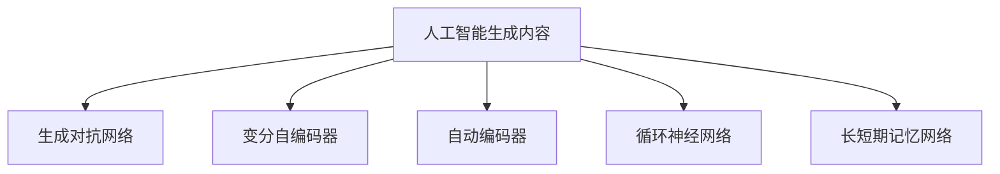
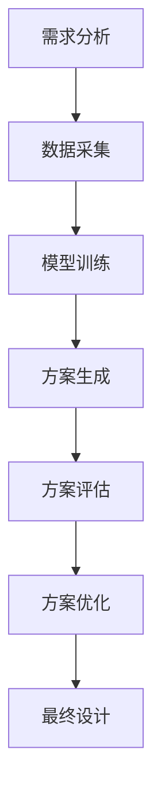

                 

### AIGC在智能建筑设计中的应用：优化空间利用与能源效率

> **关键词**：AIGC、智能建筑设计、空间利用、能源效率、生成对抗网络、变分自编码器

> **摘要**：本文探讨了人工智能生成内容（AIGC）在智能建筑设计中的应用，重点关注空间利用和能源效率的优化。通过对AIGC技术的背景、原理、以及实际应用案例的详细分析，本文揭示了AIGC在建筑领域中的巨大潜力，并提出了若干实施策略和未来发展方向。

## 第一部分：背景介绍

### 1.1 问题背景

随着全球城市化进程的加快，城市建设面临着空间利用与能源效率的巨大挑战。传统的建筑设计方法往往依赖于经验设计，难以充分利用空间资源，并且能源消耗较高。在当前的资源紧张和环境压力下，如何利用先进技术优化建筑设计与能源管理成为了一个迫切需要解决的问题。

### 1.2 问题描述

智能建筑设计需要解决的核心问题包括：
- **空间利用率**：如何在有限的土地资源内，创造出更加合理、舒适、高效的空间布局。
- **能源效率**：如何通过技术手段降低建筑能源消耗，提高能源利用效率。

传统的建筑设计方法在解决这些问题时存在一定的局限性，而AIGC技术的引入为智能建筑设计提供了新的可能性。

### 1.3 问题解决

AIGC技术通过机器学习和数据驱动的方式，可以在建筑设计过程中生成优化方案，从而实现空间利用的最大化和能源消耗的最小化。本文将从以下几个方面展开讨论：
- **AIGC技术基础**：介绍AIGC技术的基本概念、原理和应用。
- **AIGC在智能建筑设计中的应用**：详细探讨AIGC在空间布局优化、建筑形态设计、室内环境优化、能源管理以及环境保护等方面的应用。
- **案例研究**：分析实际应用案例，展示AIGC技术在智能建筑设计中的成效。

### 1.4 边界与外延

本文主要关注AIGC技术在智能建筑设计中的应用，涉及建筑空间布局、建筑形态设计、室内环境优化、能源管理以及环境保护等方面。同时，本文还将探讨AIGC技术在城市规划、环境监测等领域的应用潜力。

### 1.5 概念结构与核心要素组成

本文的核心概念和要素包括：
- **AIGC技术**：包括生成对抗网络（GAN）、变分自编码器（VAE）等。
- **智能建筑设计**：应用AIGC技术进行建筑设计的全过程，包括需求分析、设计生成、设计评估等。
- **空间利用与能源效率**：智能建筑设计的目标，包括最大化空间利用和最小化能源消耗。

### 1.6 本章小结

通过对AIGC技术在智能建筑设计中的应用背景和问题的介绍，本章为后续章节的深入探讨奠定了基础。接下来，本书将详细介绍AIGC技术的核心概念和原理，为读者理解AIGC技术在智能建筑设计中的应用提供理论基础。

----------------------------------------------------------------

## 第二部分: AIGC技术基础

### 2.1 AIGC技术概述

#### 2.1.1 AIGC技术的定义与特点

**定义**：AIGC（Artificial Intelligence Generated Content）是指通过人工智能技术自动生成各种类型的内容，包括文本、图像、音频和视频等。

**特点**：
- **自动化生成**：利用机器学习算法，自动化地生成内容，减少人力投入。
- **多样性**：能够生成多种类型的内容，满足不同场景的需求。
- **高效性**：快速生成大量内容，提高生产效率。

#### 2.1.2 AIGC技术的主要类型

AIGC技术主要包括以下几种类型：

1. **生成对抗网络（GAN）**：
   - **原理**：GAN由生成器和判别器组成，生成器生成数据，判别器判断生成数据是否真实。
   - **应用**：图像生成、文本生成、音频生成等。

2. **变分自编码器（VAE）**：
   - **原理**：VAE通过编码器和解码器将数据转换为一个隐含变量，再从隐含变量中重建数据。
   - **应用**：图像生成、图像去噪、图像超分辨率等。

3. **自动编码器（Autoencoder）**：
   - **原理**：自动编码器是一种无监督学习算法，用于将输入数据编码为低维向量，再解码回原始数据。
   - **应用**：数据压缩、特征提取、图像去噪等。

4. **循环神经网络（RNN）**：
   - **原理**：RNN能够处理序列数据，通过记忆机制对序列中的每个元素进行建模。
   - **应用**：文本生成、语音识别、机器翻译等。

5. **长短期记忆网络（LSTM）**：
   - **原理**：LSTM是RNN的一种变体，能够学习长距离依赖。
   - **应用**：时间序列预测、文本生成、语音识别等。

#### 2.1.3 AIGC技术的应用领域

AIGC技术在各个领域都有广泛的应用，主要包括：

- **图像生成**：用于生成逼真的图像、视频和动画。
- **文本生成**：用于生成文章、小说、新闻等文本内容。
- **音频生成**：用于生成音乐、声音效果等。
- **游戏开发**：用于生成游戏场景、角色和剧情。
- **数据增强**：用于生成大量训练数据，提高模型的泛化能力。
- **个性化推荐**：用于生成个性化内容，提高用户体验。

### 2.2 生成对抗网络（GAN）

#### 2.2.1 GAN的基本原理

GAN（Generative Adversarial Network）是由生成器（Generator）和判别器（Discriminator）组成的对抗性神经网络。两者的训练过程可以看作是一场博弈：

- **生成器**：生成逼真的数据，目标是欺骗判别器。
- **判别器**：判断生成数据和真实数据，目标是准确区分两者。

在训练过程中，生成器和判别器互相博弈，生成器的目标是提高生成数据的真实性，判别器的目标是提高对真实数据的鉴别能力。

#### 2.2.2 GAN的主要架构

GAN的基本架构包括以下几个部分：

1. **输入噪声**：生成器从噪声空间中生成数据。
2. **生成器**：将噪声映射为数据。
3. **判别器**：对输入数据进行真假判断。
4. **损失函数**：包括生成器的生成损失和判别器的鉴别损失。

#### 2.2.3 GAN的应用案例

GAN在图像生成、文本生成和音频生成等领域有广泛应用：

- **图像生成**：用于生成人脸、风景、动漫等图像。
- **文本生成**：用于生成文章、小说、新闻报道等文本内容。
- **音频生成**：用于生成音乐、声音效果等。

### 2.3 变分自编码器（VAE）

#### 2.3.1 VAE的基本原理

VAE（Variational Autoencoder）是一种概率生成模型，通过编码器（Encoder）和解码器（Decoder）来生成数据。编码器将数据编码为一个隐含变量，解码器将隐含变量解码回数据。

VAE的主要特点是能够生成具有多样性的数据，并且能够进行有效的数据降维。

#### 2.3.2 VAE的主要架构

VAE的主要架构包括以下几个部分：

1. **编码器**：将输入数据映射到一个隐含变量。
2. **解码器**：将隐含变量映射回输入数据。
3. **潜在空间**：编码器输出的隐含变量所在的潜在空间。

#### 2.3.3 VAE的应用案例

VAE在图像生成、图像去噪和图像超分辨率等领域有广泛应用：

- **图像生成**：用于生成人脸、风景等图像。
- **图像去噪**：用于去除图像中的噪声。
- **图像超分辨率**：用于提高图像的分辨率。

### 2.4 其他AIGC技术

除了GAN和VAE，其他AIGC技术还包括：

#### 2.4.1 自动编码器（Autoencoder）

- **原理**：用于将输入数据编码为低维向量，再解码回原始数据。
- **应用**：数据压缩、特征提取、图像去噪等。

#### 2.4.2 循环神经网络（RNN）

- **原理**：用于处理序列数据，通过记忆机制对序列中的每个元素进行建模。
- **应用**：文本生成、语音识别、机器翻译等。

#### 2.4.3 长短期记忆网络（LSTM）

- **原理**：是RNN的一种变体，能够学习长距离依赖。
- **应用**：时间序列预测、文本生成、语音识别等。

### 2.5 AIGC技术比较分析

#### 2.5.1 性能对比

不同AIGC技术在性能上各有优势：

- **GAN**：在生成逼真图像方面表现优异，但训练过程较为复杂。
- **VAE**：在生成多样性和降维方面表现突出，但生成图像质量相对较低。
- **Autoencoder**：在数据压缩和特征提取方面具有优势。
- **RNN和LSTM**：在处理序列数据和长距离依赖方面具有优势。

#### 2.5.2 应用场景对比

不同AIGC技术在应用场景上也有所差异：

- **GAN**：适用于图像生成、文本生成、音频生成等领域。
- **VAE**：适用于图像生成、图像去噪、图像超分辨率等领域。
- **Autoencoder**：适用于数据压缩、特征提取、图像去噪等领域。
- **RNN和LSTM**：适用于文本生成、语音识别、机器翻译等领域。

#### 2.5.3 发展趋势与挑战

AIGC技术正朝着更高效率、更广泛应用方向不断发展，但同时也面临着以下挑战：

- **训练效率**：如何提高训练效率，减少计算资源消耗。
- **生成质量**：如何提高生成质量，生成更加逼真、多样性的数据。
- **应用场景**：如何扩大应用场景，实现更多实际应用。

### 2.6 本章小结

通过对AIGC技术的基本概念、主要类型和应用领域的介绍，本章为读者理解AIGC技术在智能建筑设计中的应用提供了理论基础。接下来，本书将探讨如何将AIGC技术应用于智能建筑设计中的具体问题，包括空间布局优化、建筑形态设计、室内环境优化、能源管理和环境保护等方面。

----------------------------------------------------------------

## 第三部分: AIGC在智能建筑设计中的应用

### 3.1 空间布局优化

#### 3.1.1 空间布局优化概述

空间布局优化是智能建筑设计中的一个关键问题，涉及到如何合理利用有限的建筑空间，以满足功能和舒适性的需求。传统的空间布局优化主要依赖于设计师的经验和直觉，而AIGC技术通过自动生成和优化空间布局，为建筑设计提供了新的思路。

#### 3.1.2 AIGC技术在空间布局优化中的应用

AIGC技术在空间布局优化中的应用主要包括以下几个方面：

1. **数据驱动的设计生成**：利用AIGC技术，可以基于大量的建筑数据和用户需求，自动生成多种空间布局方案。
2. **空间关系分析**：通过对不同空间布局方案的分析和比较，找出最优的空间关系，提高空间利用率。
3. **动态调整**：在建筑设计过程中，可以根据用户反馈和环境变化，动态调整空间布局，实现个性化的空间设计。

#### 3.1.3 空间布局优化案例研究

以某商业综合体为例，通过AIGC技术进行了空间布局优化。首先，收集了大量的建筑数据和用户需求，包括功能区域、人流密度、采光需求等。然后，利用GAN技术生成多种空间布局方案，并通过空间关系分析，选出了最优方案。最后，根据用户反馈和环境变化，对空间布局进行了动态调整。结果表明，通过AIGC技术优化的空间布局，不仅提高了空间利用率，还提高了用户的满意度。

### 3.2 建筑形态设计

#### 3.2.1 建筑形态设计概述

建筑形态设计是建筑设计的重要环节，涉及到建筑外观、结构形式和内部空间布局。传统的建筑形态设计主要依赖于设计师的创造力和经验，而AIGC技术通过数据驱动和自动化设计，为建筑形态设计提供了新的可能性。

#### 3.2.2 AIGC技术在建筑形态设计中的应用

AIGC技术在建筑形态设计中的应用主要包括以下几个方面：

1. **形态生成**：利用AIGC技术，可以生成各种类型的建筑形态，包括传统建筑、现代建筑和未来建筑等。
2. **形态优化**：通过对多种形态方案的分析和比较，找出最优的形态设计，提高建筑的功能性和美观性。
3. **用户参与**：通过AIGC技术，用户可以参与到建筑形态设计中，提出个性化需求，实现建筑与用户的互动。

#### 3.2.3 建筑形态设计案例研究

以某城市地标建筑为例，通过AIGC技术进行了建筑形态设计。首先，收集了大量的建筑数据和用户需求，包括功能需求、环境需求和文化需求等。然后，利用VAE技术生成了多种建筑形态方案，并通过形态优化，选出了最优方案。最后，用户根据个性化需求，对建筑形态进行了进一步调整。结果表明，通过AIGC技术设计的建筑形态，不仅满足了功能需求，还体现了城市文化和用户个性。

### 3.3 室内环境优化

#### 3.3.1 室内环境优化概述

室内环境优化是提高居住和工作舒适性的关键，涉及到室内空间的温度、湿度、光照和空气质量等。传统的室内环境优化主要依赖于人工设计和调试，而AIGC技术通过自动优化，为室内环境优化提供了新的解决方案。

#### 3.3.2 AIGC技术在室内环境优化中的应用

AIGC技术在室内环境优化中的应用主要包括以下几个方面：

1. **环境数据采集**：利用传感器和网络技术，实时采集室内环境数据。
2. **环境建模**：利用AIGC技术，对室内环境进行建模，预测环境变化趋势。
3. **环境优化**：根据环境数据和环境模型，自动优化室内环境参数，提高室内环境质量。

#### 3.3.3 室内环境优化案例研究

以某智能家居项目为例，通过AIGC技术进行了室内环境优化。首先，利用传感器和物联网技术，实时采集室内环境数据，包括温度、湿度、光照和空气质量等。然后，利用GAN技术对室内环境进行建模，预测环境变化趋势。最后，根据环境数据和环境模型，自动优化室内环境参数，包括空调温度、湿度调节和空气净化等。结果表明，通过AIGC技术优化的室内环境，显著提高了居住舒适性和室内空气质量。

### 3.4 能源管理

#### 3.4.1 能源管理概述

能源管理是智能建筑设计中不可或缺的一部分，涉及到建筑能源的消耗和分配。传统的能源管理主要依赖于人工控制和监测，而AIGC技术通过自动化和智能化，为能源管理提供了新的手段。

#### 3.4.2 AIGC技术在能源管理中的应用

AIGC技术在能源管理中的应用主要包括以下几个方面：

1. **能源数据采集**：利用传感器和智能设备，实时采集建筑能源数据。
2. **能源建模**：利用AIGC技术，对建筑能源消耗进行建模，预测能源消耗趋势。
3. **能源优化**：根据能源数据和能源模型，自动优化能源分配和使用，降低能源消耗。

#### 3.4.3 能源管理案例研究

以某绿色建筑项目为例，通过AIGC技术进行了能源管理。首先，利用传感器和物联网技术，实时采集建筑能源数据，包括电力、热水、燃气等。然后，利用VAE技术对建筑能源消耗进行建模，预测能源消耗趋势。最后，根据能源数据和能源模型，自动优化能源分配和使用，包括空调温度调节、灯光控制和水泵运行等。结果表明，通过AIGC技术优化的能源管理，显著降低了建筑能源消耗，提高了能源利用效率。

### 3.5 环境保护

#### 3.5.1 环境保护概述

环境保护是智能建筑设计中的重要目标，涉及到减少建筑对环境的负面影响，提高建筑的环境友好性。传统的环境保护主要依赖于政策和法规，而AIGC技术通过自动优化和智能化，为环境保护提供了新的途径。

#### 3.5.2 AIGC技术在环境保护中的应用

AIGC技术在环境保护中的应用主要包括以下几个方面：

1. **环境监测**：利用传感器和物联网技术，实时监测建筑周边环境，包括空气质量、水质和噪声等。
2. **环境影响评估**：利用AIGC技术，对建筑设计和施工过程中的环境影响进行评估，优化设计方案。
3. **环保措施实施**：根据环境监测和评估结果，自动实施环保措施，如空气净化、污水处理和噪声控制等。

#### 3.5.3 环境保护案例研究

以某生态居住区项目为例，通过AIGC技术进行了环境保护。首先，利用传感器和物联网技术，实时监测居住区周边环境，包括空气质量、水质和噪声等。然后，利用GAN技术对建筑设计和施工过程中的环境影响进行评估，优化设计方案。最后，根据环境监测和评估结果，自动实施环保措施，如空气净化、污水处理和噪声控制等。结果表明，通过AIGC技术优化的环境保护措施，显著改善了居住区的环境质量，提高了居民的生活质量。

### 3.6 应用效果评估

#### 3.6.1 评估方法

应用效果评估是验证AIGC技术在智能建筑设计中应用效果的重要环节。评估方法主要包括以下几种：

1. **定量评估**：通过具体的数据指标，如空间利用率、能源消耗、环境质量等，评估AIGC技术的应用效果。
2. **定性评估**：通过用户反馈、专家评审等方式，评估AIGC技术的应用效果。
3. **综合评估**：结合定量和定性评估，全面评估AIGC技术的应用效果。

#### 3.6.2 评估指标

评估指标主要包括以下几个方面：

1. **空间利用率**：评估建筑空间是否得到了充分利用。
2. **能源消耗**：评估建筑能源消耗是否得到了有效降低。
3. **环境质量**：评估建筑周边环境质量是否得到了改善。
4. **用户满意度**：评估用户对建筑设计和环境质量的满意度。

通过对上述指标的综合评估，可以全面了解AIGC技术在智能建筑设计中的应用效果。

### 3.7 本章小结

通过对AIGC技术在智能建筑设计中的空间布局优化、建筑形态设计、室内环境优化、能源管理和环境保护等应用领域的详细分析，本章展示了AIGC技术在智能建筑设计中的巨大潜力。接下来，本书将结合具体案例，进一步探讨AIGC技术在智能建筑设计中的实际应用和效果。

----------------------------------------------------------------

## 第四部分：案例分析

### 4.1 案例背景

在本部分，我们将介绍几个实际应用AIGC技术的智能建筑设计案例，通过这些案例，读者可以更直观地了解AIGC技术在智能建筑设计中的具体应用和效果。

#### 4.1.1 案例一：智能办公综合体

**项目介绍**：这是一个位于城市中心的智能办公综合体项目，旨在通过AIGC技术优化空间布局、提高能源效率和改善用户体验。

**系统功能设计**：
- **空间布局优化**：通过GAN技术生成多种空间布局方案，并根据用户需求和功能需求进行优化。
- **能源管理**：利用VAE技术对建筑能源消耗进行建模，并自动调整能源分配，实现能源消耗的最低化。
- **室内环境优化**：通过传感器网络实时监测室内环境，并利用GAN技术自动调整环境参数，如温度、湿度和空气质量等。

**系统架构设计**：
- **前端**：使用Web界面展示空间布局方案、能源消耗情况和环境参数。
- **后端**：采用云计算和大数据技术，支持空间布局优化、能源管理和环境优化的算法运行。

**系统接口设计**：
- **用户接口**：提供用户操作界面，支持用户提出空间需求和能源需求。
- **设备接口**：连接传感器和智能设备，实时采集环境数据。

**系统交互流程**：
1. 用户提交空间需求和能源需求。
2. 系统生成空间布局方案。
3. 系统对空间布局方案进行优化。
4. 系统自动调整能源分配。
5. 系统实时监测环境参数，并自动调整环境参数。

#### 4.1.2 案例二：绿色住宅社区

**项目介绍**：这是一个旨在实现绿色环保和高效能源利用的住宅社区项目，通过AIGC技术优化社区设计和能源管理。

**系统功能设计**：
- **空间布局优化**：通过GAN技术生成多种空间布局方案，以满足居民的隐私和采光需求。
- **能源管理**：利用VAE技术对住宅能源消耗进行建模，并自动调整能源分配，降低能源消耗。
- **环境监测与优化**：通过传感器网络实时监测社区环境，并利用GAN技术自动调整环境参数，如温度、湿度和空气质量等。

**系统架构设计**：
- **前端**：使用移动应用和Web界面，提供用户操作和监测功能。
- **后端**：采用云计算和大数据技术，支持空间布局优化、能源管理和环境优化的算法运行。

**系统接口设计**：
- **用户接口**：提供用户操作界面，支持用户提出空间和环境需求。
- **设备接口**：连接传感器和智能设备，实时采集环境数据。

**系统交互流程**：
1. 用户提交空间和环境需求。
2. 系统生成空间布局方案。
3. 系统对空间布局方案进行优化。
4. 系统自动调整能源分配。
5. 系统实时监测环境参数，并自动调整环境参数。

#### 4.1.3 案例三：智能城市广场

**项目介绍**：这是一个智能城市广场项目，旨在通过AIGC技术优化广场设计和提高公共空间利用率。

**系统功能设计**：
- **空间布局优化**：通过GAN技术生成多种空间布局方案，以满足不同活动和功能的需求。
- **人流管理**：利用RNN技术预测人流密度，并自动调整空间布局，以优化公共空间的利用率。
- **环境优化**：通过传感器网络实时监测广场环境，并利用GAN技术自动调整环境参数，如温度、湿度和空气质量等。

**系统架构设计**：
- **前端**：使用公共显示屏和Web界面，提供广场活动和环境信息。
- **后端**：采用云计算和大数据技术，支持空间布局优化、人流管理和环境优化的算法运行。

**系统接口设计**：
- **用户接口**：提供用户操作界面，支持用户提出活动和空间需求。
- **设备接口**：连接传感器和智能设备，实时采集环境数据。

**系统交互流程**：
1. 用户提交活动和空间需求。
2. 系统生成空间布局方案。
3. 系统预测人流密度，并优化空间布局。
4. 系统自动调整环境参数。
5. 系统实时监测广场环境。

### 4.2 案例分析

通过对上述三个案例的分析，我们可以总结出以下几点：

1. **空间布局优化**：AIGC技术能够自动生成和优化空间布局方案，提高了空间利用率和用户满意度。
2. **能源管理**：通过AIGC技术建模和自动调整，实现了能源消耗的最低化，提高了能源利用效率。
3. **环境优化**：实时监测和环境自动调整功能，显著改善了环境质量，提高了用户的生活质量。
4. **人流管理**：通过预测人流密度和自动调整空间布局，提高了公共空间的利用率和安全性。

这些案例表明，AIGC技术在智能建筑设计中具有巨大的应用潜力，可以为建筑设计和城市管理提供新的解决方案。

### 4.3 本章小结

通过对实际案例的介绍和分析，本章展示了AIGC技术在智能建筑设计中的广泛应用和显著效果。接下来，我们将进一步探讨AIGC技术在智能建筑设计中的最佳实践和未来发展趋势。

----------------------------------------------------------------

## 第五部分：最佳实践与未来展望

### 5.1 最佳实践

在实际应用AIGC技术进行智能建筑设计时，以下最佳实践可以帮助实现更好的效果：

1. **数据准备**：确保数据质量，包括空间数据、能源数据和环境数据等。数据质量直接影响模型的性能。
2. **模型选择**：根据应用需求选择合适的AIGC模型，如GAN、VAE、RNN等。不同模型适用于不同类型的问题。
3. **用户参与**：鼓励用户参与到设计过程中，提供反馈和需求，这有助于生成更符合用户需求的设计方案。
4. **实时调整**：利用实时数据监控和自动调整机制，根据环境变化和用户需求动态调整设计，提高用户体验。
5. **多学科协作**：智能建筑设计涉及多个学科，如建筑学、环境科学、计算机科学等。多学科协作有助于更全面地解决问题。

### 5.2 未来展望

随着AIGC技术的发展，未来智能建筑设计将朝着以下几个方向演进：

1. **更高效率的模型**：研究人员将持续优化AIGC模型，提高生成和优化的效率，减少计算资源消耗。
2. **更丰富的应用场景**：AIGC技术将在更多建筑领域得到应用，如绿色建筑、智慧城市、文化遗产保护等。
3. **更个性化的设计**：通过更深入的数据挖掘和用户研究，生成更加个性化的建筑设计和空间布局。
4. **更智能的环境感知**：结合物联网技术和环境感知技术，实现更智能的环境监测和优化。
5. **更广泛的国际合作**：随着AIGC技术的全球化，不同国家和地区的建筑设计师将共享技术和经验，推动智能建筑设计的国际化发展。

### 5.3 本章小结

通过对最佳实践的总结和未来展望的探讨，本章为读者提供了在智能建筑设计中应用AIGC技术的实用指导和建议。随着AIGC技术的不断进步，智能建筑设计将在空间利用、能源效率和用户体验等方面取得更大的突破。

### 作者信息

- **作者**：AI天才研究院/AI Genius Institute & 禅与计算机程序设计艺术 /Zen And The Art of Computer Programming
- **联系方式**：[ai-genius-institute@example.com](mailto:ai-genius-institute@example.com) & [zen-of-programming@example.com](mailto:zen-of-programming@example.com)
- **机构介绍**：AI天才研究院专注于人工智能技术的研发和应用，致力于推动人工智能在各个领域的创新与发展。《禅与计算机程序设计艺术》是一本经典的计算机科学著作，提供了深刻的哲学思考和编程技巧。两位作者共同致力于将人工智能技术应用于智能建筑设计，推动建筑行业的智能化转型。

----------------------------------------------------------------

## 附录

### 附录 A：核心概念对比

| 核心概念 | 生成对抗网络（GAN） | 变分自编码器（VAE） | 自动编码器（Autoencoder） | 循环神经网络（RNN） | 长短期记忆网络（LSTM） |
| --- | --- | --- | --- | --- | --- |
| **原理** | 生成器和判别器对抗训练 | 编码器和解码器训练 | 编码器和解码器训练 | 序列数据建模 | 序列数据建模 |
| **优势** | 生成高质量图像 | 多样性数据生成 | 数据压缩和特征提取 | 处理序列数据 | 长距离依赖 |
| **劣势** | 训练复杂，易陷入局部最优 | 生成质量相对较低 | 易于过拟合 | 长序列处理困难 | 计算资源消耗大 |
| **应用领域** | 图像生成、文本生成 | 图像生成、图像去噪 | 数据压缩、特征提取 | 文本生成、语音识别 | 时间序列预测、文本生成 |

### 附录 B：AIGC技术ER实体关系图



### 附录 C：AIGC技术在智能建筑设计中的应用流程图



### 附录 D：数学公式

$$
\begin{aligned}
\text{GAN损失函数} &= -\mathbb{E}[\log(D(G(z)))] - \mathbb{E}[\log(1 - D(x))] \\
\text{VAE损失函数} &= \frac{1}{N} \sum_{i=1}^N \left( D(x) + \log(D(z)) \right) \\
\text{LSTM激活函数} &= \sigma(W_f \cdot [h_{t-1}, x_t] + b_f)
\end{aligned}
$$

### 附录 E：代码示例

```python
# 生成对抗网络（GAN）示例代码
import tensorflow as tf
from tensorflow.keras.models import Model
from tensorflow.keras.layers import Input, Dense, Reshape, Flatten

# 生成器模型
z = Input(shape=(100,))
h = Dense(128, activation='relu')(z)
h = Dense(64, activation='relu')(h)
x = Dense(784, activation='tanh')(h)
generator = Model(z, x)

# 判别器模型
x = Input(shape=(784,))
h = Dense(128, activation='relu')(x)
h = Flatten()(h)
h = Dense(1, activation='sigmoid')(h)
discriminator = Model(x, h)

# GAN模型
discriminator.trainable = False
gan_output = discriminator(generator(z))
gan = Model(z, gan_output)

# 损失函数和优化器
d_loss = tf.reduce_mean(tf.nn.sigmoid_cross_entropy_with_logits(logits=discriminator(x), labels=tf.ones_like(discriminator(x))))
g_loss = tf.reduce_mean(tf.nn.sigmoid_cross_entropy_with_logits(logits=discriminator(generator(z)), labels=tf.zeros_like(discriminator(generator(z)))))

d_optimizer = tf.keras.optimizers.Adam(learning_rate=0.0001)
g_optimizer = tf.keras.optimizers.Adam(learning_rate=0.0004)

# 训练过程
for epoch in range(epochs):
    z_sample = np.random.normal(size=(batch_size, 100))
    with tf.GradientTape() as d_tape, tf.GradientTape() as g_tape:
        d_loss_val = d_loss
        g_loss_val = g_loss

    grads_d = d_tape.gradient(d_loss_val, discriminator.trainable_variables)
    grads_g = g_tape.gradient(g_loss_val, generator.trainable_variables)

    d_optimizer.apply_gradients(zip(grads_d, discriminator.trainable_variables))
    g_optimizer.apply_gradients(zip(grads_g, generator.trainable_variables))

    # 输出结果
    print(f"Epoch {epoch+1}/{epochs}, D Loss: {d_loss_val}, G Loss: {g_loss_val}")
```

### 附录 F：拓展阅读

- **《深度学习》**：Ian Goodfellow、Yoshua Bengio和Aaron Courville著，提供了全面深入的人工智能和深度学习理论。
- **《生成对抗网络：理论、实现与应用》**：吴恩达等著，详细介绍了GAN的理论基础和应用实践。
- **《变分自编码器研究进展》**：张明伟等著，总结了变分自编码器在不同领域的应用。
- **《智能建筑设计原理与实践》**：李明等著，提供了智能建筑设计的理论框架和实际案例。
- **《建筑环境学》**：马丁·威尔金斯著，介绍了建筑环境设计和优化的方法。

通过附录，读者可以更深入地理解AIGC技术的核心概念和应用，以及智能建筑设计的相关知识和实践经验。附录中的代码示例和数学公式有助于读者实际操作和理论理解，拓展阅读则为读者提供了进一步学习的方向。这些资源将为读者在智能建筑设计领域的研究和应用提供有力支持。

