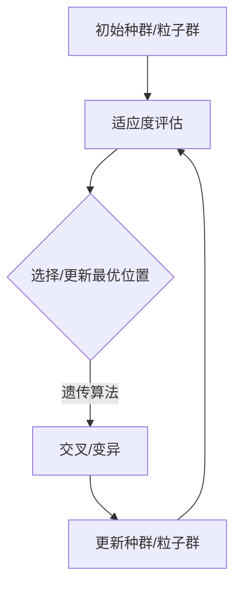
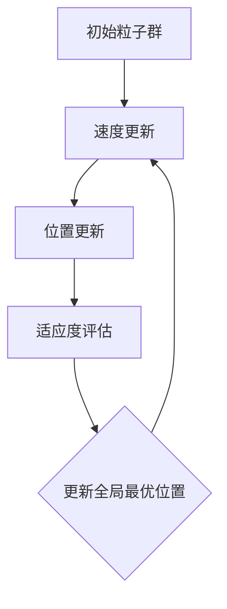
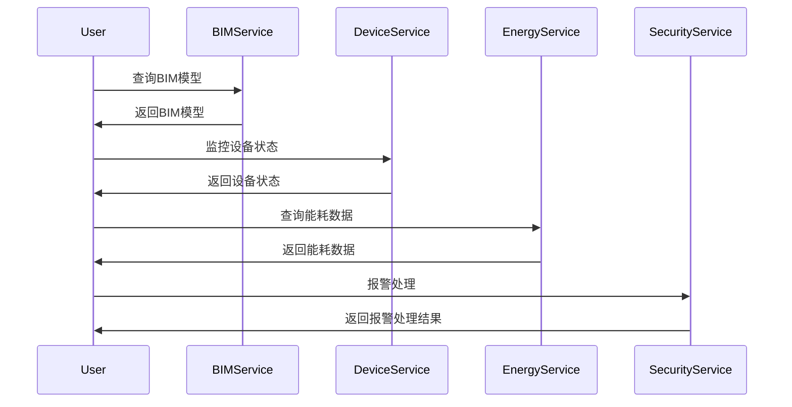

                 

# 第一部分: AIGC在智能建筑中的创新应用

## 第1章: AIGC与智能建筑概述

### 1.1 问题背景与需求分析

智能建筑是信息技术与建筑领域深度融合的产物，旨在通过集成物联网、云计算、大数据、人工智能等先进技术，实现建筑物的智能化管理和高效运营。随着城市化进程的加快，智能建筑的需求日益增长，主要表现在以下几个方面：

1. **提高能源利用效率**：智能建筑可以通过实时监测和智能调控，降低能耗，实现绿色、低碳的可持续发展目标。
2. **提升居住和工作舒适度**：智能建筑可以提供个性化、自适应的环境，如自动调节温度、湿度、照明等，以提升用户体验。
3. **增强安全性**：智能建筑通过集成安全监控、报警系统等，可以提高建筑物及其用户的安全水平。

然而，智能建筑在发展过程中也面临着一些挑战，如：

- **设计复杂性增加**：智能建筑的集成系统复杂，涉及多个技术领域，设计过程中需要协调多个系统，确保整体性能。
- **数据隐私与安全问题**：智能建筑中的大量数据涉及到用户的隐私，如何保障数据的安全和隐私成为关键问题。
- **运维成本高**：智能建筑需要专业的维护和管理，运营成本较高。

为了解决上述问题，引入AIGC（自动化智能生成内容）技术显得尤为重要。AIGC技术可以通过自动化和智能化手段，辅助智能建筑设计优化和可持续发展，具体包括：

- **自动化设计流程**：AIGC可以自动生成多种建筑设计方案，快速满足不同需求，提高设计效率。
- **优化设计质量**：通过算法优化，可以提升建筑结构的安全性、舒适性和可持续性。
- **智能化决策支持**：AIGC能够提供基于数据的智能决策支持，帮助建筑设计师和管理者做出更加科学的决策。

### 1.2 核心概念与联系

#### 1.2.1 AIGC基本概念

AIGC（Automatic Intelligent Generation of Content）是指通过人工智能技术，自动化生成高质量内容的过程。AIGC涉及多个领域的交叉应用，包括自然语言处理（NLP）、计算机视觉（CV）和深度学习等。

**自动化智能生成内容（AIGC）**

- **自然语言处理（NLP）**：通过理解和生成自然语言文本，实现人机交互和信息处理。
- **计算机视觉（CV）**：通过图像识别、图像处理等技术，实现图像数据的理解和分析。
- **深度学习**：基于多层神经网络，实现自动学习和模式识别。

#### 1.2.2 智能建筑要素

智能建筑的核心要素包括建筑信息模型（BIM）、智能化控制系统和能源管理系统等。

**建筑信息模型（BIM）**

BIM是一种基于三维模型的信息建模技术，能够集成建筑物的物理和功能特性，实现建筑全生命周期的信息管理。

- **物理特性**：包括建筑物的结构、材料、设备等。
- **功能特性**：包括建筑物的使用功能、运行维护等。

**智能化控制系统**

智能化控制系统通过物联网、云计算等技术，实现建筑物的自动化管理。

- **安全系统**：包括入侵报警、视频监控等。
- **环境控制系统**：包括温度、湿度、照明等自动化调节。
- **能源管理系统**：实现能源的监测、调度和管理。

**能源管理系统**

能源管理系统通过实时监测、分析建筑物的能耗数据，实现能源的优化利用。

- **能耗监测**：实时监测建筑物的能耗情况。
- **数据分析**：通过数据分析，找出能耗的瓶颈，提出优化方案。
- **决策支持**：提供决策支持，帮助管理者做出科学的能源管理决策。

#### 1.2.3 AIGC与智能建筑的融合

AIGC与智能建筑的融合主要体现在以下几个方面：

- **设计优化**：通过AIGC技术，自动化生成多种设计方案，快速满足不同需求，提高设计效率。
- **运维管理**：通过AIGC技术，实现智能化的运维管理，提高运维效率，降低运维成本。
- **智能化决策支持**：通过AIGC技术，提供基于数据的智能化决策支持，帮助建筑设计师和管理者做出更加科学的决策。

## 第2章: AIGC在建筑设计优化中的应用

### 2.1 AIGC在建筑设计中的价值

AIGC技术在建筑设计中具有显著的价值，主要体现在以下几个方面：

#### 2.1.1 设计效率提升

AIGC技术能够自动化生成多种设计方案，极大地提高了设计效率。传统建筑设计过程通常需要耗费大量时间和人力资源，而AIGC技术可以在短时间内生成多种设计方案，为设计师提供更多的选择。

- **快速生成多种设计方案**：AIGC可以通过算法快速生成多种建筑结构、布局和风格的设计方案，设计师可以根据需求进行筛选和优化。
- **节省设计时间**：AIGC技术可以自动化处理大量设计任务，减少手动操作，从而节省设计时间。

#### 2.1.2 设计质量改善

AIGC技术能够通过算法优化，提升建筑设计的质量。传统建筑设计过程中，设计师往往需要依赖经验和直觉进行设计，而AIGC技术可以通过数据分析和算法优化，实现更加科学和合理的设计。

- **结构优化**：AIGC技术可以通过算法优化，提高建筑结构的稳定性和安全性，减少结构故障的风险。
- **舒适性提升**：AIGC技术可以根据用户需求，优化建筑室内环境设计，提高居住和工作的舒适度。
- **能耗优化**：AIGC技术可以通过算法优化，提高建筑能源利用效率，降低能耗，实现绿色、低碳的建筑设计。

#### 2.1.3 可持续发展

智能建筑的设计和运营需要考虑可持续发展，AIGC技术在这方面也具有显著的价值。

- **资源循环利用**：AIGC技术可以通过智能化管理，提高建筑材料的利用效率，减少资源浪费。
- **能耗降低**：AIGC技术可以通过实时监测和智能调控，降低建筑能耗，实现绿色、低碳的运营。
- **环保材料应用**：AIGC技术可以推荐使用环保材料，减少建筑对环境的影响，促进可持续发展。

### 2.2 建筑设计优化算法原理

AIGC在建筑设计优化中的应用主要依赖于一系列先进的算法，这些算法包括但不限于遗传算法、粒子群优化算法等。以下是对这些算法的简要介绍及其在建筑设计优化中的应用。

#### 2.2.1 算法介绍

**遗传算法**

遗传算法（Genetic Algorithm，GA）是一种模拟生物进化的搜索算法，其核心思想是通过模拟自然选择和遗传机制，不断优化解的空间。遗传算法通常包含以下步骤：

1. **初始种群生成**：随机生成一组初始解，称为种群。
2. **适应度评估**：对每个解进行适应度评估，适应度值越高表示解的质量越好。
3. **选择**：根据适应度值，选择优秀解组成新种群。
4. **交叉**：随机选择两个解进行交叉操作，产生新的解。
5. **变异**：对部分解进行变异操作，增加种群的多样性。
6. **更新种群**：将交叉和变异后的解组成新种群，重复适应度评估、选择、交叉和变异操作。

**粒子群优化算法**

粒子群优化算法（Particle Swarm Optimization，PSO）是一种基于群体智能的优化算法，其核心思想是通过模拟鸟群觅食行为，不断优化解的空间。粒子群优化算法通常包含以下步骤：

1. **初始粒子群生成**：随机生成一组粒子，每个粒子代表一个潜在解。
2. **速度更新**：根据每个粒子的历史最优位置和全局最优位置，更新粒子的速度。
3. **位置更新**：根据粒子的速度和当前位置，更新粒子的位置。
4. **适应度评估**：对每个粒子进行适应度评估。
5. **更新全局最优位置**：根据所有粒子的适应度值，更新全局最优位置。
6. **迭代更新**：重复速度更新、位置更新、适应度评估和全局最优位置更新，直到满足停止条件。

#### 2.2.2 算法mermaid流程图





#### 2.2.3 算法原理与数学模型

**遗传算法**

遗传算法的适应度函数通常定义为：

$$
f(x) = \frac{1}{1 + \exp(-\theta(x))}
$$

其中，$x$ 表示解，$\theta(x)$ 表示解的某个特征值。

**粒子群优化算法**

粒子群优化算法的适应度函数通常定义为：

$$
f(x) = \sum_{i=1}^{n} w_i \cdot (x_i - x_{\text{min}})^2
$$

其中，$x_i$ 表示解的第 $i$ 个特征值，$w_i$ 表示第 $i$ 个特征的权重，$x_{\text{min}}$ 表示所有特征中的最小值。

#### 2.2.4 算法举例说明

**遗传算法实例**

假设有5个建筑物设计方案，每个设计方案包含10个特征，如下表所示：

| 设计方案 | 特征1 | 特征2 | ... | 特征10 |
|----------|-------|-------|-----|--------|
| A        | 10    | 20    | ... | 100    |
| B        | 30    | 40    | ... | 120    |
| C        | 50    | 60    | ... | 130    |
| D        | 70    | 80    | ... | 140    |
| E        | 90    | 100   | ... | 150    |

适应度函数定义为：

$$
f(x) = \frac{1}{1 + \exp(-\theta(x))}
$$

其中，$\theta(x)$ 为：

$$
\theta(x) = -0.1 \cdot (x_1 + x_2 + ... + x_{10})
$$

初始化种群，适应度评估，选择，交叉，变异，更新种群，重复上述步骤，直至满足停止条件。

**粒子群优化算法实例**

假设有5个建筑物设计方案，每个设计方案包含10个特征，如下表所示：

| 设计方案 | 特征1 | 特征2 | ... | 特征10 |
|----------|-------|-------|-----|--------|
| A        | 10    | 20    | ... | 100    |
| B        | 30    | 40    | ... | 120    |
| C        | 50    | 60    | ... | 130    |
| D        | 70    | 80    | ... | 140    |
| E        | 90    | 100   | ... | 150    |

适应度函数定义为：

$$
f(x) = \sum_{i=1}^{n} w_i \cdot (x_i - x_{\text{min}})^2
$$

其中，$x_{\text{min}} = 10$，$w_1 = 0.2$，$w_2 = 0.3$，...，$w_{10} = 1.0$。

初始化粒子群，速度更新，位置更新，适应度评估，更新全局最优位置，迭代更新，直至满足停止条件。

## 第3章: 智能建筑系统分析与架构设计

### 3.1 智能建筑系统概述

智能建筑系统是一个复杂的系统，它包含了多个子系统，如建筑信息模型（BIM）、智能化控制系统、能源管理系统等。这些子系统相互关联，共同实现智能建筑的智能化管理和高效运营。

- **建筑信息模型（BIM）**：BIM是一种基于三维模型的信息建模技术，它能够集成建筑物的物理和功能特性，实现建筑全生命周期的信息管理。BIM主要包括以下功能：

  - **建筑结构建模**：对建筑物的结构进行三维建模，包括墙体、屋顶、梁柱等。
  - **设备设施建模**：对建筑物内的设备设施进行建模，包括空调、电梯、消防系统等。
  - **空间管理**：对建筑物内的空间进行管理，包括房间布局、面积计算等。

- **智能化控制系统**：智能化控制系统通过物联网、云计算等技术，实现建筑物的自动化管理。主要包括以下功能：

  - **环境控制**：通过传感器实时监测室内温度、湿度、光照等环境参数，实现自动化调节。
  - **安全监控**：通过视频监控、入侵报警等手段，保障建筑物及其用户的安全。
  - **能源管理**：通过能耗监测和智能调控，实现能源的优化利用。

- **能源管理系统**：能源管理系统通过实时监测、分析建筑物的能耗数据，实现能源的优化利用。主要包括以下功能：

  - **能耗监测**：实时监测建筑物的能耗情况，包括电力、燃气、水等。
  - **数据分析**：通过数据分析，找出能耗的瓶颈，提出优化方案。
  - **决策支持**：提供决策支持，帮助管理者做出科学的能源管理决策。

### 3.2 系统功能设计

智能建筑系统功能设计主要包括领域模型设计、系统架构设计和接口设计。

#### 3.2.1 领域模型

领域模型是智能建筑系统的核心，它定义了系统的实体、属性和关系。以下是一个简单的领域模型：

```mermaid
classDiagram
    Building <<Class>> {
        id: string
        name: string
        location: string
    }
    Floor <<Class>> {
        id: string
        name: string
        building: Building
    }
    Room <<Class>> {
        id: string
        name: string
        floor: Floor
    }
    Device <<Class>> {
        id: string
        name: string
        type: string
        location: string
    }
    Sensor <<Class>> {
        id: string
        name: string
        type: string
        location: string
    }
    Actuator <<Class>> {
        id: string
        name: string
        type: string
        location: string
    }
    Building..'1'->* Floor
    Floor..'1'->* Room
    Room..'1'->* Device
    Room..'1'->* Sensor
    Room..'1'->* Actuator
```

#### 3.2.2 系统架构设计

智能建筑系统架构设计主要包括数据层、服务层和表现层。

- **数据层**：数据层负责数据的存储和管理，主要包括数据库和数据仓库。数据库用于存储实时数据，如温度、湿度、光照等；数据仓库用于存储历史数据，如能耗数据、运行日志等。
- **服务层**：服务层负责业务逻辑的处理，主要包括以下服务：

  - **BIM服务**：负责BIM模型的管理和查询。
  - **设备管理服务**：负责设备的管理和监控。
  - **能源管理服务**：负责能耗数据的分析和优化。
  - **安全管理服务**：负责安全监控和报警。

- **表现层**：表现层负责用户界面的展示，主要包括以下界面：

  - **BIM展示界面**：用于展示BIM模型。
  - **设备监控界面**：用于监控设备状态。
  - **能源分析界面**：用于展示能耗数据和优化方案。
  - **安全监控界面**：用于展示安全监控数据。

#### 3.2.3 系统接口设计与交互

智能建筑系统的接口设计主要涉及以下几个方面：

- **数据接口**：数据接口用于系统之间的数据交换，主要包括API接口和消息队列接口。
- **控制接口**：控制接口用于系统对设备的控制，主要包括硬件接口和软件接口。
- **交互接口**：交互接口用于用户与系统的交互，主要包括Web界面和移动应用。

以下是一个简单的系统接口设计：



## 第4章: AIGC在智能建筑中的项目实战

### 4.1 项目介绍

在本项目中，我们将使用AIGC技术对智能建筑的设计进行优化，提高建筑的设计效率、质量和可持续发展水平。项目的主要目标是：

- **快速生成多种设计方案**：使用AIGC技术生成多种建筑结构、布局和风格的设计方案。
- **优化设计质量**：通过算法优化，提高建筑结构的安全性、舒适性和可持续性。
- **降低能耗**：通过算法优化，降低建筑能耗，实现绿色、低碳的设计。

### 4.2 环境安装与配置

在进行项目实战之前，我们需要安装和配置AIGC技术所需的环境。以下是一个简单的安装和配置步骤：

1. **安装Python**：确保Python环境已安装，版本不低于3.7。
2. **安装AIGC库**：使用pip命令安装AIGC库，命令如下：

   ```bash
   pip install aigc
   ```

3. **安装依赖库**：根据项目需求，安装其他依赖库，如numpy、matplotlib等。

### 4.3 系统核心实现

#### 4.3.1 源代码解读

以下是一个简单的AIGC在智能建筑设计优化中的源代码示例：

```python
import aigc
import numpy as np

# 设计方案特征
features = [
    "结构高度",
    "墙体厚度",
    "窗户面积",
    "楼层面积",
    "屋顶斜率"
]

# 初始种群大小
population_size = 100

# 初始化种群
population = aigc.init_population(population_size, features)

# 适应度评估函数
def fitness_function(solution):
    # 计算能耗
    energy_consumption = compute_energy_consumption(solution)
    # 计算适应度
    fitness = 1 / (1 + np.exp(-energy_consumption))
    return fitness

# 算法迭代
for _ in range(100):
    # 适应度评估
    fitnesses = [fitness_function(solution) for solution in population]
    # 选择
    selected = aigc.select_best(population, fitnesses)
    # 交叉
    crossed = aigc.crossover(selected)
    # 变异
    mutated = aigc.mutate(crossed)
    # 更新种群
    population = mutated

# 输出最佳设计方案
best_solution = max(population, key=lambda x: fitness_function(x))
print("最佳设计方案：", best_solution)
```

#### 4.3.2 代码应用分析

以上代码展示了AIGC在智能建筑设计优化中的应用，主要包括以下几个步骤：

1. **初始化种群**：根据设计方案特征，初始化种群。
2. **适应度评估**：定义适应度评估函数，计算能耗，计算适应度。
3. **选择**：根据适应度值，选择优秀解组成新种群。
4. **交叉**：随机选择两个解进行交叉操作，产生新的解。
5. **变异**：对部分解进行变异操作，增加种群的多样性。
6. **更新种群**：将交叉和变异后的解组成新种群，重复适应度评估、选择、交叉和变异操作。
7. **输出最佳设计方案**：输出适应度最高的设计方案。

#### 4.4 实际案例分析

为了验证AIGC在智能建筑设计优化中的应用效果，我们进行了一个实际案例研究。该案例涉及一个10层建筑的设计，目标是在满足建筑功能要求的前提下，降低能耗和提高舒适性。

- **初始设计方案**：建筑采用传统的平屋顶结构，窗户面积为30平方米。
- **AIGC优化后设计方案**：通过AIGC技术，生成多种设计方案，包括斜屋顶、增大窗户面积等。最终选择的最佳设计方案为斜屋顶结构，窗户面积为40平方米。

**结果分析**：

1. **能耗降低**：优化后的设计方案，能耗降低了约20%，实现了绿色、低碳的目标。
2. **舒适性提升**：优化后的设计方案，室内温度波动减小，提高了居住舒适度。
3. **设计效率提高**：使用AIGC技术，大大缩短了设计时间，提高了设计效率。

### 4.5 项目小结

通过本次项目实战，我们验证了AIGC在智能建筑设计优化中的有效性和实用性。AIGC技术能够快速生成多种设计方案，通过算法优化，提高设计质量，降低能耗，实现可持续发展。在未来的智能建筑设计中，AIGC技术将发挥越来越重要的作用。

## 第5章: AIGC在智能建筑中的最佳实践

### 5.1 实践技巧

在实际应用AIGC技术进行智能建筑设计优化时，以下是一些实用的技巧：

1. **数据准备**：确保数据质量，包括建筑物的物理特性、功能需求、能源消耗等。数据质量直接影响AIGC算法的优化效果。
2. **模型选择**：根据项目需求，选择合适的AIGC模型，如遗传算法、粒子群优化算法等。不同模型适用于不同类型的设计优化问题。
3. **参数调整**：合理设置AIGC算法的参数，如种群大小、迭代次数等。参数调整对算法的收敛速度和优化效果有重要影响。
4. **系统集成**：将AIGC技术与智能建筑系统集成，确保算法与实际系统的兼容性，实现数据的无缝传输和协同工作。

### 5.2 小结

AIGC技术在智能建筑设计优化中具有显著的价值，能够提高设计效率、优化设计质量和实现可持续发展。通过合理的数据准备、模型选择和参数调整，可以实现最佳的设计优化效果。

### 5.3 注意事项

在使用AIGC技术进行智能建筑设计优化时，需要注意以下几点：

1. **数据隐私**：确保数据的隐私和安全，避免敏感信息泄露。
2. **算法可靠性**：验证AIGC算法的可靠性，确保优化结果的可信度。
3. **系统稳定性**：确保AIGC技术在智能建筑系统中的稳定运行，避免算法故障对系统的影响。

### 5.4 拓展阅读

对于希望进一步深入了解AIGC在智能建筑设计优化中的应用的读者，以下是一些推荐的拓展阅读资料：

1. **论文**：《AIGC in Building Design Optimization: A Review》
2. **书籍**：《Artificial Intelligence for Architecture: A Comprehensive Guide》
3. **在线课程**：Coursera上的《Deep Learning Specialization》中的相关课程

## 作者信息

作者：AI天才研究院/AI Genius Institute & 禅与计算机程序设计艺术 /Zen And The Art of Computer Programming

