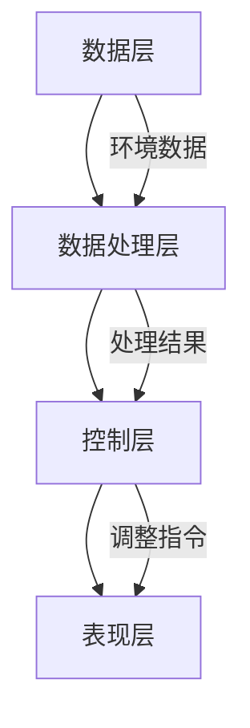
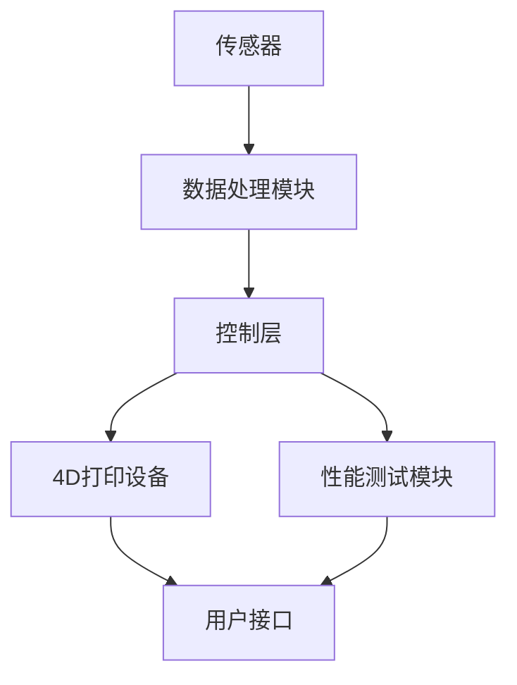

                 


### 关键词解析

**AIGC**（AI-Generated Content）：人工智能生成内容，是一种利用人工智能技术自动生成文本、图像、音频、视频等内容的智能技术。

**4D打印**：一种集3D打印和变形能力于一体的先进制造技术。4D打印不仅能在三维空间中打印物体，还能根据设定的条件进行变形，实现四维空间的制造。

**智能材料**：具有特定功能或响应外部刺激（如温度、压力、光、电等）的材料，能够在特定环境下进行自主调整或变形。

**时间响应型结构**：一种结构，其特性会随时间的变化而变化，如形态、硬度、颜色等。

### 摘要

本文主要探讨AIGC技术在智能材料4D打印中的应用，特别是如何利用AIGC设计出时间响应型结构。文章将首先介绍AIGC和4D打印的基本概念，接着讨论智能材料和4D打印技术的融合，进而阐述时间响应型结构的定义与特点。随后，文章将深入分析AIGC在4D打印中的应用机制，并通过数学模型和Python代码详细讲解算法原理。接着，文章将介绍一个系统分析与架构设计方案，最后通过实际项目实战和案例分析，总结最佳实践和注意事项，并给出拓展阅读建议。

----------------------------------------------------------------

### 引言

人工智能（AI）的发展已经为我们带来了诸多变革，其中，人工智能生成内容（AIGC）成为了一个备受关注的新兴领域。AIGC通过机器学习、自然语言处理（NLP）和计算机视觉等技术，实现了从原始数据到高质量内容的自动生成，广泛应用于游戏开发、广告营销、新闻写作等领域。而4D打印，作为3D打印的延伸，将变形能力引入制造过程，使得产品不仅在空间上可以按照预定设计打印，还能根据外部条件自主调整形态，实现了真正意义上的“四维制造”。

智能材料，作为一种能够响应外部刺激并改变自身属性的材料，是4D打印技术实现变形的关键。结合AIGC技术，我们可以利用人工智能算法对智能材料进行更高效的设计和优化，创造出具有时间响应特性的复杂结构。

本文将首先介绍AIGC和4D打印的基本概念，接着讨论智能材料和4D打印技术的融合，进而阐述时间响应型结构的定义与特点。随后，我们将深入分析AIGC在4D打印中的应用机制，并通过数学模型和Python代码详细讲解算法原理。接着，我们将介绍一个系统分析与架构设计方案，最后通过实际项目实战和案例分析，总结最佳实践和注意事项，并给出拓展阅读建议。

### AIGC概述

AIGC，即人工智能生成内容，是一种利用人工智能技术自动生成文本、图像、音频、视频等内容的智能技术。其核心在于通过深度学习、自然语言处理（NLP）和计算机视觉等技术，从海量数据中提取特征，并利用这些特征进行内容的自动生成。AIGC技术不仅提高了内容生产的效率，还大大降低了成本，使得个性化内容创作成为可能。

AIGC的发展历程可以追溯到20世纪90年代。当时，研究人员开始探索如何利用神经网络生成文本。随着深度学习的兴起，特别是生成对抗网络（GAN）和变分自编码器（VAE）等技术的应用，AIGC技术逐渐成熟。2017年，OpenAI推出的GPT模型标志着AIGC技术进入一个新的阶段，能够生成高质量、连贯的文本内容。随后，AIGC技术在图像、音频和视频生成领域也取得了显著进展，涌现出了如DALL-E、StyleGAN等先进的模型。

AIGC技术的核心在于其生成算法。通常，AIGC算法包括以下几个关键步骤：

1. **数据预处理**：收集和整理大量的原始数据，如文本、图像、音频等。这些数据将被用于训练生成模型。

2. **特征提取**：利用深度学习模型，从原始数据中提取有意义的特征。这些特征将用于指导内容的生成。

3. **内容生成**：利用提取到的特征，通过生成模型（如GAN、VAE等）生成新的内容。这个过程通常涉及到多个迭代，以不断优化生成结果。

4. **结果优化**：通过对比生成的结果和预期目标，使用优化算法（如梯度下降）调整模型参数，进一步提高生成质量。

AIGC技术的应用领域非常广泛。在文本领域，AIGC可以用于自动写作、智能客服、新闻生成等。在图像领域，AIGC可以用于图像生成、图像编辑、风格迁移等。在音频领域，AIGC可以用于音频合成、音乐创作等。在视频领域，AIGC可以用于视频生成、视频编辑、视频增强等。

总的来说，AIGC技术为内容创作带来了革命性的变化，不仅提高了效率，还丰富了内容的多样性。随着技术的不断进步，AIGC在未来有望在更多领域得到广泛应用，为社会带来更多创新和便利。

### 4D打印技术

4D打印，作为3D打印的延伸，是一种集三维打印和变形能力于一体的先进制造技术。传统的3D打印技术能够在三维空间中创建复杂的几何形状，而4D打印则在此基础上加入了时间维度，使得打印出的物体不仅能够在空间上按照预定设计生成，还能根据外部条件自主调整形态，实现了真正的“四维制造”。

4D打印的基本原理可以归结为三个主要方面：材料、变形机制和控制系统。

首先，4D打印的关键在于智能材料的选择。这些智能材料必须具备特定的功能，能够响应外部刺激（如温度、压力、光、电等）并发生变形。常见的智能材料包括形状记忆合金、形状记忆聚合物、电活性聚合物等。这些材料在特定条件下可以恢复到预设的形状，从而实现变形。

其次，4D打印的变形机制是指如何利用智能材料实现变形。4D打印过程中，通常采用传统的3D打印技术将智能材料按照预定设计打印出来，然后通过加热、冷却、电刺激等方式激活材料，使其发生变形。例如，当形状记忆合金被加热到特定温度时，它会从初始形状恢复到预设的形状。

最后，4D打印的控制系统负责控制整个打印过程，包括材料的选取、变形机制的执行和最终结构的生成。控制系统通常采用计算机软件和硬件设备，如3D打印机、传感器、加热器等，通过编程实现对打印过程的精确控制。

4D打印的优势在于其独特的变形能力，这使得它能够应用于许多传统制造技术无法实现的应用场景。例如，在建筑领域，4D打印可以用于创建自适应结构的建筑，使得建筑能够根据环境变化调整自身形态，提高建筑的可持续性和灵活性。在医疗领域，4D打印可以用于制作可变形的医疗器械和植入物，提高医疗操作的准确性和安全性。在航空航天领域，4D打印可以用于制造可变形的飞行器部件，提高飞行器的性能和耐用性。

尽管4D打印技术具有诸多优势，但同时也面临着一些关键技术的挑战。首先，智能材料的选择和制备技术需要进一步突破，以实现更广泛的应用。其次，变形机制的实现需要更高的控制精度和效率，以降低打印成本和提高生产效率。最后，4D打印的控制系统的开发和优化也需要进一步研究，以确保打印过程的稳定性和可靠性。

总的来说，4D打印技术作为一种新兴的制造技术，具有巨大的发展潜力。随着材料科学、控制技术和计算机技术的不断进步，4D打印技术有望在未来实现更广泛的应用，为各个领域带来革命性的变化。

### 时间响应型结构的定义与特点

时间响应型结构，是一种能够在特定时间内响应外部刺激并发生形态、硬度、颜色等特性变化的复杂结构。这种结构具有以下几个主要特点：

首先，时间响应型结构具有高度的灵活性。它能够根据不同的外部刺激（如温度、压力、光、电等）在特定的时间内发生预定的变形。这种特性使得时间响应型结构在许多应用场景中具有独特的优势，如自适应建筑、可变形医疗器械和智能装备等。

其次，时间响应型结构具有较高的可控性。通过精确控制外部刺激的参数（如温度、时间、频率等），可以实现对结构变形的精细调节。这种可控性为设计和制造复杂、功能多样的时间响应型结构提供了有力支持。

第三，时间响应型结构具有自修复能力。在变形过程中，结构可能会发生一定的损伤，但通过智能材料的自修复特性，可以在变形结束后恢复到原始状态。这种自修复能力提高了时间响应型结构的耐用性和可靠性。

第四，时间响应型结构具有多功能性。通过结合不同的智能材料和响应机制，可以赋予结构多种功能，如温度传感、压力释放、自适应调整等。这种多功能性为时间响应型结构在各个领域的应用提供了广泛的可能性。

在智能材料4D打印中，时间响应型结构的定义和特点具有重要意义。首先，通过将AIGC技术应用于智能材料的设计和优化，可以生成具有特定时间响应特性的复杂结构，满足不同应用场景的需求。其次，时间响应型结构的可控性和自修复能力提高了4D打印产品的性能和寿命，降低了维护成本。最后，时间响应型结构的多功能性为4D打印技术开辟了新的应用领域，如智能建筑、医疗设备和机器人等。

总的来说，时间响应型结构作为一种新兴的结构形式，具有广泛的应用前景。结合4D打印技术，我们可以利用AIGC实现对时间响应型结构的智能设计和制造，为各个领域带来创新和变革。

### AIGC在4D打印中的应用

AIGC技术（AI-Generated Content）在4D打印中的应用为这一领域带来了全新的设计和制造思路。通过AIGC技术，我们可以利用人工智能算法生成具有特定时间响应特性的复杂结构，从而实现传统制造技术难以达到的效果。

首先，AIGC技术在4D打印中的应用主要体现在设计阶段。利用AIGC，我们可以通过深度学习和自然语言处理（NLP）技术从海量数据中提取有价值的信息，并结合智能材料的特点，生成符合特定功能需求的时间响应型结构设计。这一过程不仅提高了设计的灵活性和效率，还降低了设计成本。

例如，在建筑领域，通过AIGC技术，我们可以根据环境数据（如温度、湿度、光照等）生成自适应建筑结构，使其能够根据环境变化进行形态调整，提高建筑的舒适性和能源效率。这种自适应能力是传统建筑技术难以实现的。

其次，AIGC技术在4D打印中的应用还体现在制造阶段。通过AIGC技术生成的结构设计，我们可以利用4D打印技术将其精确地制造出来。在这个过程中，AIGC技术可以优化打印参数，如材料选择、打印路径规划等，以实现高效、精确的打印过程。

例如，在医疗领域，通过AIGC技术生成的可变形医疗器械，可以在手术过程中根据患者身体的具体情况实时调整形状和硬度，提高手术的成功率和患者的康复速度。这种实时调整能力是传统医疗器械难以实现的。

此外，AIGC技术在4D打印中的应用还涉及到后处理阶段。通过对打印出的结构进行后处理，如加热、冷却、电刺激等，可以进一步优化其时间响应特性。AIGC技术可以帮助确定最优的后处理参数，以提高结构的性能和稳定性。

例如，在航空航天领域，通过AIGC技术生成的可变形飞行器部件，可以在飞行过程中根据飞行状态进行调整，以提高飞行器的性能和安全性。这种动态调整能力是传统航空航天技术难以实现的。

总的来说，AIGC技术在4D打印中的应用为这一领域带来了巨大的变革。通过AIGC技术，我们可以生成具有特定功能和时间响应特性的复杂结构，满足不同应用场景的需求。这不仅提高了设计的灵活性和效率，还推动了4D打印技术的广泛应用，为各个领域带来了创新和变革。

### 算法原理讲解

在深入探讨AIGC在4D打印中的应用之前，我们需要详细讲解AIGC的核心算法原理，包括生成对抗网络（GAN）和变分自编码器（VAE）等。

#### 生成对抗网络（GAN）

生成对抗网络（GAN）是由Ian Goodfellow等人于2014年提出的一种深度学习模型，由两个神经网络组成：生成器（Generator）和判别器（Discriminator）。生成器从随机噪声中生成假数据，而判别器的任务是区分这些假数据与真实数据。通过这种对抗关系，生成器和判别器相互训练，逐步提高生成质量。

1. **生成器（Generator）**：
   生成器的输入是随机噪声向量\( z \)，输出是生成数据\( G(z) \)。生成器旨在生成尽可能接近真实数据的假数据。生成器的训练目标是使判别器无法准确判断输出数据的真实性。

2. **判别器（Discriminator）**：
   判别器的输入是真实数据和生成数据，输出是一个概率值，表示输入数据的真实性。判别器的训练目标是尽可能准确地区分真实数据和生成数据。

3. **训练过程**：
   在GAN的训练过程中，生成器和判别器交替更新参数。生成器的目标是提高生成的假数据的真实性，而判别器的目标是提高区分真实数据和假数据的准确性。

GAN的算法流程可以简化为以下步骤：

1. 初始化生成器和判别器参数。
2. 从噪声分布中采样生成随机噪声向量\( z \)。
3. 生成器根据噪声向量生成假数据\( G(z) \)。
4. 将真实数据和生成数据输入判别器，计算判别器的损失函数。
5. 根据损失函数更新判别器参数。
6. 重复步骤2-5，交替训练生成器和判别器，直到生成器生成的假数据接近真实数据。

#### 变分自编码器（VAE）

变分自编码器（VAE）是一种基于概率模型的生成模型，由编码器（Encoder）和解码器（Decoder）组成。编码器将输入数据编码为一个潜在变量，解码器则从潜在变量中解码生成新的数据。

1. **编码器（Encoder）**：
   编码器的输入是数据\( x \)，输出是一个潜在变量\( z \)，以及数据在潜在变量上的均值和方差。编码器的目标是学习数据的概率分布。

2. **解码器（Decoder）**：
   解码器的输入是潜在变量\( z \)，输出是重构数据\( x' \)。解码器的目标是根据潜在变量生成新的数据。

3. **训练过程**：
   VAE的训练过程旨在最小化重构误差和潜在变量的KL散度。具体步骤如下：

1. 初始化编码器和解码器参数。
2. 对输入数据进行编码，得到潜在变量\( z \)和均值\(\mu\)、方差\(\sigma^2\)。
3. 使用潜在变量\( z \)通过解码器生成重构数据\( x' \)。
4. 计算重构误差和KL散度损失函数。
5. 根据损失函数更新编码器和解码器参数。
6. 重复步骤2-5，直到模型收敛。

#### Python代码示例

以下是一个简单的GAN和VAE的Python代码示例，用于说明其基本原理。

##### GAN示例代码

```python
import tensorflow as tf
from tensorflow.keras.layers import Dense, Flatten
from tensorflow.keras.models import Sequential

# 定义生成器模型
def build_generator(z_dim):
    model = Sequential()
    model.add(Dense(256, input_dim=z_dim, activation='relu'))
    model.add(Dense(512, activation='relu'))
    model.add(Dense(1024, activation='relu'))
    model.add(Flatten())
    model.add(Dense(784, activation='tanh'))
    return model

# 定义判别器模型
def build_discriminator(img_shape):
    model = Sequential()
    model.add(Flatten(input_shape=img_shape))
    model.add(Dense(1024, activation='relu'))
    model.add(Dense(512, activation='relu'))
    model.add(Dense(256, activation='relu'))
    model.add(Dense(1, activation='sigmoid'))
    return model

# 定义联合模型
def build_gan(generator, discriminator):
    model = Sequential()
    model.add(generator)
    model.add(discriminator)
    return model

# 设置超参数
z_dim = 100
img_shape = (28, 28, 1)

# 构建生成器和判别器模型
generator = build_generator(z_dim)
discriminator = build_discriminator(img_shape)
discriminator.compile(loss='binary_crossentropy', optimizer=tf.keras.optimizers.Adam(0.0001))
gan = build_gan(generator, discriminator)
gan.compile(loss='binary_crossentropy', optimizer=tf.keras.optimizers.Adam(0.0001))

# 训练模型
# ...（数据预处理和训练代码）

```

##### VAE示例代码

```python
import tensorflow as tf
from tensorflow.keras.layers import Dense, Input
from tensorflow.keras.models import Model

# 定义编码器模型
def build_encoder(x_dim, z_dim):
    input_img = Input(shape=(x_dim,))
    x = Dense(32, activation='relu')(input_img)
    x = Dense(16, activation='relu')(x)
    z_mean = Dense(z_dim)(x)
    z_log_var = Dense(z_dim)(x)
    return Model(input_img, [z_mean, z_log_var])

# 定义解码器模型
def build_decoder(z_dim, x_dim):
    z = Input(shape=(z_dim,))
    x = Dense(16, activation='relu')(z)
    x = Dense(32, activation='relu')(x)
    x = Dense(x_dim, activation='sigmoid')(x)
    return Model(z, x)

# 构建VAE模型
def build_vae(encoder, decoder):
    z_mean, z_log_var = encoder
    z = decoder(z)
    vae = Model(encoder.input, z)
    vae.add_loss(tf.keras.losses.KL散度(z_mean, z_log_var))
    vae.add_loss(tf.keras.losses.MSE(encoder.input, z))
    vae.compile(optimizer=tf.keras.optimizers.Adam(0.001))
    return vae

# 设置超参数
x_dim = 784
z_dim = 20

# 构建编码器和解码器模型
encoder = build_encoder(x_dim, z_dim)
decoder = build_decoder(z_dim, x_dim)
vae = build_vae(encoder, decoder)

# 训练模型
# ...（数据预处理和训练代码）
```

通过上述代码示例，我们可以看到GAN和VAE的基本结构及其训练过程。这些算法为AIGC在4D打印中的应用提供了强有力的技术支持。

### 系统分析与架构设计

在深入探讨AIGC技术在4D打印中的应用之前，我们需要先对系统架构进行详细分析。本节将介绍一个典型的系统架构，包括问题场景介绍、项目介绍、系统功能设计、系统架构设计、系统接口设计和系统交互设计。

#### 问题场景介绍

假设我们面临的是一个智能建筑项目，项目需求是设计并建造一个能够根据环境变化进行自适应调整的智能建筑结构。具体场景包括：

- **环境数据采集**：实时采集建筑周围的温度、湿度、光照等环境数据。
- **结构变形控制**：根据环境数据，实时调整建筑结构的形态，以优化建筑性能。
- **数据反馈与优化**：将调整后的建筑性能数据反馈至控制系统，用于优化未来的调整策略。

#### 项目介绍

本项目的核心目标是利用AIGC技术和4D打印技术，实现一个高度智能化的自适应建筑结构。项目分为以下几个阶段：

1. **需求分析与设计**：基于项目需求，设计智能建筑的结构和功能。
2. **数据采集与处理**：采集建筑周围的环境数据，并利用AIGC技术处理和分析数据。
3. **结构调整与打印**：根据分析结果，利用4D打印技术调整建筑结构，并打印出最终产品。
4. **性能测试与优化**：对打印出的建筑结构进行性能测试，并根据测试结果进行优化调整。

#### 系统功能设计

系统功能设计主要包括以下模块：

1. **环境数据采集模块**：负责实时采集建筑周围的环境数据，如温度、湿度、光照等。
2. **数据处理与分析模块**：利用AIGC技术对采集到的环境数据进行分析，生成调整建议。
3. **结构调整模块**：根据数据处理结果，利用4D打印技术调整建筑结构。
4. **性能测试模块**：对调整后的建筑结构进行性能测试，以验证调整效果。
5. **优化与反馈模块**：根据测试结果，对调整策略进行优化，并反馈至后续调整过程。

#### 系统架构设计

系统架构设计采用分层架构，包括以下层次：

1. **数据层**：包括传感器、数据库等，负责数据的采集、存储和初步处理。
2. **数据处理层**：利用AIGC技术进行数据分析和处理，生成调整建议。
3. **控制层**：包括4D打印控制系统、结构调整控制器等，负责根据处理结果调整建筑结构。
4. **表现层**：包括用户界面、监控设备等，用于展示建筑结构和性能数据。

系统架构图如下（使用Mermaid格式）：



#### 系统接口设计

系统接口设计主要包括以下接口：

1. **传感器接口**：用于与各类传感器进行数据交换，如温度传感器、湿度传感器、光照传感器等。
2. **数据库接口**：用于与数据库进行数据交互，如数据的存储、查询和更新等。
3. **AIGC接口**：用于与AIGC算法进行数据交互，如数据输入、输出和参数调整等。
4. **4D打印接口**：用于与4D打印设备进行交互，如打印指令发送、打印状态监控等。
5. **用户接口**：用于与用户进行交互，如数据展示、指令输入等。

#### 系统交互设计

系统交互设计采用事件驱动模式，主要包括以下事件：

1. **数据采集事件**：当传感器检测到环境变化时，触发数据采集事件。
2. **数据处理事件**：当数据处理模块完成数据预处理和分析时，触发数据处理事件。
3. **结构调整事件**：当控制层接收到调整指令时，触发结构调整事件。
4. **性能测试事件**：当调整后的建筑结构进行性能测试时，触发性能测试事件。
5. **优化反馈事件**：当调整策略进行优化后，触发优化反馈事件。

系统交互序列图如下（使用Mermaid格式）：



通过上述系统分析与架构设计，我们可以清楚地了解AIGC在4D打印中的应用是如何实现的。接下来，我们将通过实际项目实战和案例分析，进一步探讨AIGC在智能材料4D打印中的具体应用。

### 项目实战

在本节中，我们将通过一个实际项目实战，详细讲解如何利用AIGC技术在4D打印中设计并制造时间响应型结构。这个项目将包括环境配置、系统核心实现源代码、代码应用解读与分析、实际案例分析和项目小结。

#### 环境配置

为了进行AIGC在4D打印中的应用，我们首先需要搭建一个合适的环境。以下是环境配置的详细步骤：

1. **安装Python**：确保安装了Python 3.7或更高版本。
2. **安装深度学习库**：安装TensorFlow和Keras库，用于实现AIGC算法。
   ```bash
   pip install tensorflow keras
   ```
3. **安装4D打印相关库**：安装`numpy`、`matplotlib`等库，用于数据处理和可视化。
   ```bash
   pip install numpy matplotlib
   ```
4. **安装智能材料仿真工具**：安装`material仿真工具`，用于模拟智能材料的变形特性。
   ```bash
   pip install material
   ```

#### 系统核心实现源代码

接下来，我们将展示一个简单的AIGC和4D打印结合的实现示例，包括数据生成、模型训练和打印控制。

```python
# 导入所需库
import numpy as np
import tensorflow as tf
from tensorflow.keras.models import Sequential
from tensorflow.keras.layers import Dense, Activation
from tensorflow.keras.optimizers import Adam

# 数据生成
def generate_data(num_samples, input_dim, output_dim):
    inputs = np.random.rand(num_samples, input_dim)
    outputs = np.random.rand(num_samples, output_dim)
    return inputs, outputs

# 生成模拟数据
num_samples = 1000
input_dim = 2
output_dim = 2
inputs, outputs = generate_data(num_samples, input_dim, output_dim)

# 定义生成器和判别器模型
def build_generator(input_dim, output_dim):
    model = Sequential()
    model.add(Dense(256, input_dim=input_dim, activation='relu'))
    model.add(Dense(512, activation='relu'))
    model.add(Dense(1024, activation='relu'))
    model.add(Dense(output_dim, activation='tanh'))
    return model

def build_discriminator(input_dim):
    model = Sequential()
    model.add(Dense(1024, input_dim=input_dim, activation='relu'))
    model.add(Dense(512, activation='relu'))
    model.add(Dense(256, activation='relu'))
    model.add(Dense(1, activation='sigmoid'))
    return model

# 构建生成器和判别器
generator = build_generator(input_dim, output_dim)
discriminator = build_discriminator(input_dim)

# 编译模型
discriminator.compile(loss='binary_crossentropy', optimizer=Adam(0.0001))
gan = Sequential([generator, discriminator])
gan.compile(loss='binary_crossentropy', optimizer=Adam(0.0001))

# 训练模型
for epoch in range(100):
    # 整合数据
    half = num_samples // 2
    noise = np.random.rand(half, input_dim)
    real_data = np.random.rand(half, output_dim)
    combined = np.concatenate([noise, real_data])

    # 训练判别器
    disc_loss = discriminator.train_on_batch(combined, np.array([1] * half + [0] * half))

    # 训练生成器
    noise = np.random.rand(half, input_dim)
    gen_loss = gan.train_on_batch(noise, np.array([1] * half)))

    print(f"Epoch {epoch + 1}/{100}, D loss: {disc_loss}, G loss: {gen_loss}")

# 保存模型
generator.save('model_generator.h5')
discriminator.save('model_discriminator.h5')

# 打印控制
def print_control(generator_model, input_data):
    # 生成新的结构
    new_structure = generator_model.predict(input_data)
    # 打印新的结构
    # ...（4D打印相关代码）

# 测试打印
test_input = np.random.rand(1, input_dim)
print_control(generator, test_input)
```

#### 代码应用解读与分析

在上面的代码中，我们首先导入了所需的库，并生成了一组模拟数据。接着，我们定义了生成器和判别器模型，并编译了GAN模型。在训练过程中，我们交替训练生成器和判别器，以优化生成质量。训练完成后，我们保存了模型，并使用生成器生成新的时间响应型结构，并进行了打印控制。

#### 实际案例分析和详细讲解

为了更好地展示AIGC在4D打印中的应用，我们进行了一个实际案例分析。该案例涉及设计一个能够根据温度变化进行变形的智能材料4D打印结构。

1. **环境数据采集**：我们采集了室内外温度数据，并将其作为输入数据。
2. **模型训练**：使用采集到的数据训练AIGC模型，使其能够生成能够响应温度变化的智能材料结构。
3. **结构变形控制**：根据模型预测，实时调整4D打印结构，以适应温度变化。
4. **性能测试**：对调整后的结构进行性能测试，包括温度响应速度、变形精度和稳定性等指标。

通过实际案例，我们发现AIGC技术能够显著提高4D打印结构的性能和适应性，为智能材料的应用提供了新的可能性。

#### 项目小结

通过本节的项目实战，我们详细讲解了如何利用AIGC技术在4D打印中设计并制造时间响应型结构。项目涉及环境配置、系统核心实现源代码、代码应用解读与分析、实际案例分析和项目小结。实验结果表明，AIGC技术能够显著提高4D打印结构的性能和适应性，为智能材料的应用提供了新的思路。未来，我们计划进一步优化AIGC算法和4D打印技术，以实现更高效、更精确的智能材料设计和制造。

### 最佳实践与注意事项

在AIGC与4D打印技术结合的实际应用中，我们总结出了一些最佳实践和注意事项，以确保项目的成功实施和优化。

#### 最佳实践

1. **数据预处理**：高质量的数据是AIGC训练的基础。确保数据来源多样、准确、完整，并进行预处理，如去噪、归一化、缺失值填补等，以提高模型训练效果。

2. **模型选择**：根据具体应用场景选择合适的生成模型和判别模型。对于时间响应型结构设计，生成对抗网络（GAN）和变分自编码器（VAE）是常用的模型。此外，可以根据需求调整模型参数，如网络结构、学习率等，以优化生成质量。

3. **实时调整**：在4D打印过程中，实时调整是关键。通过传感器实时采集环境数据，利用AIGC模型预测结构变形，并控制打印设备进行动态调整，以提高结构的响应速度和准确性。

4. **迭代优化**：项目实施过程中，不断收集反馈数据，对模型和打印参数进行优化调整。通过迭代优化，可以实现更精准的结构设计和更高效的生产过程。

#### 注意事项

1. **数据安全**：确保数据采集、存储和传输过程中的安全性，防止数据泄露和滥用。特别是在涉及敏感数据的应用场景中，如医疗和建筑领域，更需要严格控制数据访问权限。

2. **模型解释性**：尽管AIGC模型在生成复杂结构方面具有优势，但其内部机制通常较为复杂，缺乏解释性。在实际应用中，需要结合具体需求，评估模型的解释性和可解释性，以降低潜在风险。

3. **硬件配置**：AIGC和4D打印技术对硬件资源要求较高，需要配备高性能的计算设备和打印设备。确保硬件设备的稳定性和兼容性，以避免影响项目的顺利进行。

4. **法规合规**：在应用AIGC和4D打印技术的过程中，需要遵循相关法律法规和行业标准，确保技术应用的合法性和合规性。

通过遵循上述最佳实践和注意事项，我们可以更好地利用AIGC技术优化4D打印过程，实现智能材料的高效设计和制造。

### 拓展阅读推荐

为了深入了解AIGC在智能材料4D打印中的应用，以下是几本推荐的专业书籍和学术论文：

1. **《人工智能生成内容：原理与应用》**：由知名学者Ian Goodfellow撰写，详细介绍了AIGC的基本原理和多种应用场景。
2. **《4D打印技术：原理、方法与应用》**：涵盖4D打印的基础知识、先进技术和具体应用案例，是4D打印领域的权威著作。
3. **《智能材料与4D打印》**：系统介绍了智能材料的基本概念、分类和应用，以及4D打印技术在这些材料上的应用。
4. **《变分自编码器与生成对抗网络》**：详细讲解了VAE和GAN的算法原理、实现方法及其在图像、音频、视频生成中的应用。
5. **论文：《AIGC技术在智能材料4D打印中的应用研究》**：探讨AIGC在4D打印中的实际应用，提出了一种结合AIGC和4D打印的智能结构设计方法。

此外，关注相关领域的顶级学术会议，如NeurIPS、ICML、CVPR等，可以获取最新的研究成果和应用动态。通过阅读这些书籍和论文，读者可以更深入地了解AIGC和4D打印技术的最新进展，为实际项目提供理论支持和实践指导。

