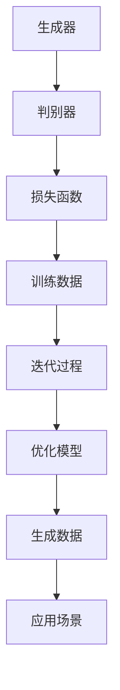
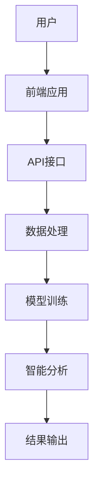
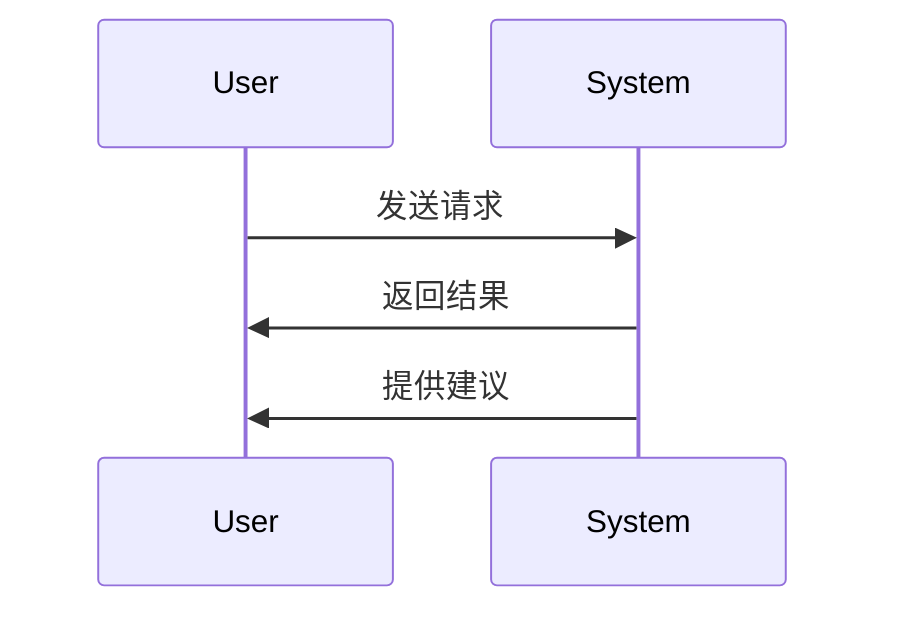

                 

### 文章标题

#### AIGC在智能材料循环经济设计中的应用：实现零废弃物生产

### 关键词

- AIGC
- 智能材料循环经济
- 零废弃物生产
- 循环经济设计
- 智能材料
- 环境保护

### 摘要

本文探讨了AIGC（自适应智能生成计算）在智能材料循环经济设计中的应用，旨在实现零废弃物生产。首先，我们介绍了AIGC、智能材料循环经济以及零废弃物生产的核心概念。随后，我们通过一步步的分析和推理，详细讲解了AIGC在智能材料循环经济设计中的具体应用，包括智能材料设计原则、循环经济模型构建以及零废弃物生产技术。通过实际案例分析和系统架构设计，我们展示了AIGC在实现零废弃物生产中的潜力和挑战。最后，我们总结了研究的成果与贡献，并提出了未来的研究方向。

---

### 第一部分：背景与概念

#### 第1章：AIGC与智能材料循环经济

#### 1.1 AIGC的概念与发展

**1.1.1 AIGC的概念**

AIGC，即自适应智能生成计算，是一种基于人工智能技术，能够自适应地生成数据、内容或者模型的方法。它融合了深度学习、自然语言处理、生成对抗网络（GAN）等多种技术，能够在各种应用场景中实现数据自动生成和智能化处理。

**1.1.2 AIGC的发展**

AIGC技术起源于深度学习和生成对抗网络（GAN）的发展，随着计算能力的提升和大数据技术的进步，AIGC的应用范围不断扩大，从图像生成到文本生成，再到音频和视频生成，AIGC在各个领域都展现出了巨大的潜力。

#### 1.2 智能材料循环经济

**1.2.1 智能材料的概念**

智能材料是指具有特定功能，能够对外界刺激（如电、光、热、磁等）产生响应，并能够进行自适应调控的材料。智能材料的应用领域广泛，包括航空航天、生物医学、建筑节能等。

**1.2.2 循环经济的概念**

循环经济是一种以资源高效利用和循环利用为核心的经济模式，旨在通过减少资源消耗和废弃物产生，实现可持续发展。循环经济的核心原则是“减量化、再利用、资源化”。

#### 1.3 零废弃物生产的目标与挑战

**1.3.1 零废弃物生产的目标**

零废弃物生产的目标是实现生产过程中无废弃物产生，或者废弃物能够完全回收利用，从而减少环境污染和资源浪费。

**1.3.2 零废弃物生产的挑战**

零废弃物生产面临着技术、经济、政策和意识等多方面的挑战。如何设计出高效、可持续的智能材料循环经济系统，实现零废弃物生产，是当前研究的热点和难点。

---

#### 第2章：核心概念联系与对比

**2.1 AIGC与循环经济的关系**

AIGC与循环经济在实现可持续发展的目标上有一定的重叠。AIGC技术可以用于优化循环经济系统中的资源利用和废弃物处理，提高系统的效率和可持续性。

**2.2 智能材料分类与循环利用**

智能材料可以根据其功能和应用领域进行分类，如传感器材料、形状记忆合金、光致变色材料等。不同类型的智能材料在循环利用中有着不同的作用和挑战。

**2.3 零废弃物生产的模式**

零废弃物生产的模式主要包括设计优化、过程控制、废弃物处理和资源回收等。AIGC技术可以用于优化各个环节，提高零废弃物生产的实现效率。

---

#### 第3章：当前技术进展与应用案例

**3.1 国内外AIGC技术现状**

当前，AIGC技术在全球范围内得到了广泛关注和应用。国外如谷歌、微软等科技巨头都在积极研发AIGC相关技术，国内如百度、阿里巴巴等也在不断推进AIGC技术的研发和应用。

**3.2 智能材料循环经济的实际应用**

智能材料循环经济在工业、农业、建筑等领域已有一定的应用。例如，在工业领域，智能材料可以用于优化生产工艺，减少废弃物产生；在农业领域，智能材料可以用于提高作物产量和质量，减少农药使用。

**3.3 零废弃物生产的技术路径**

零废弃物生产的技术路径主要包括材料选择、工艺优化、废弃物处理和资源回收等。AIGC技术可以用于这些环节的优化，提高零废弃物生产的效率和可持续性。

---

#### 第4章：研究方法与框架

**4.1 研究方法**

本研究采用文献综述、案例分析和实验验证相结合的方法，对AIGC在智能材料循环经济设计中的应用进行深入研究。

**4.2 研究框架**

研究框架包括以下几个部分：问题定义、核心概念解析、技术原理讲解、应用案例分析、系统架构设计、项目实战和未来展望。

**4.3 研究假设与预期成果**

研究假设：AIGC技术能够在智能材料循环经济设计中发挥重要作用，实现零废弃物生产。

预期成果：通过本研究，旨在提出一套基于AIGC的智能材料循环经济设计框架，为实际应用提供理论指导和实践参考。

---

#### 第5章：本章小结

本章对AIGC、智能材料循环经济和零废弃物生产的核心概念进行了介绍，分析了它们之间的关系和联系。通过国内外技术进展与应用案例的探讨，展示了AIGC在实现零废弃物生产中的潜在作用。同时，提出了研究方法和研究框架，为后续章节的内容奠定了基础。

---

### 第二部分：技术原理与应用

#### 第6章：AIGC基础

**6.1 AIGC技术原理**

AIGC技术主要基于生成对抗网络（GAN）和深度学习技术，包括生成器、判别器和损失函数等核心组件。通过这些组件的协同工作，AIGC能够实现数据的自适应生成和优化。

**6.2 AIGC主要技术**

AIGC的主要技术包括生成对抗网络（GAN）、变分自编码器（VAE）、循环神经网络（RNN）等。这些技术在图像、文本、音频等生成任务中都有着广泛的应用。

**6.3 AIGC发展趋势**

AIGC技术的发展趋势主要体现在以下几个方面：算法优化、应用场景拓展、多模态融合和跨领域协同。随着技术的不断进步，AIGC的应用范围将不断拓展，为各个行业带来更多的创新机会。

---

#### 第7章：智能材料循环经济设计

**7.1 智能材料设计原则**

智能材料设计原则主要包括可循环设计、可持续性分析和材料性能优化。通过这些原则，可以设计出具有高效利用和循环利用特性的智能材料。

**7.2 循环经济模型构建**

循环经济模型构建包括资源利用、废弃物处理和资源回收等环节。通过AIGC技术，可以优化这些环节，提高循环经济系统的效率和可持续性。

**7.3 零废弃物生产技术**

零废弃物生产技术主要包括设计优化、过程控制和废弃物处理等。通过AIGC技术，可以实现这些技术的自适应优化，提高零废弃物生产的实现效率。

---

#### 第8章：案例分析

**8.1 案例一：智能材料在循环经济设计中的应用**

通过一个具体案例，展示智能材料在循环经济设计中的应用，包括材料选择、工艺优化和废弃物处理等方面。

**8.2 案例二：AIGC在零废弃物生产中的实现**

通过一个具体案例，展示AIGC技术在零废弃物生产中的应用，包括数据生成、过程控制和废弃物处理等方面。

**8.3 案例三：跨领域协同创新的实践**

通过一个跨领域协同创新的案例，展示AIGC技术在智能材料循环经济设计中的应用，以及各领域之间的协同效应。

---

#### 第9章：挑战与展望

**9.1 技术挑战**

在实现AIGC在智能材料循环经济设计中的应用过程中，面临着技术、经济、政策和意识等多方面的挑战。

**9.2 未来展望**

未来，AIGC技术在智能材料循环经济设计中的应用将不断拓展，为各个行业带来更多的创新机会。同时，跨领域协同创新将成为实现零废弃物生产的重要途径。

---

#### 第10章：结论与建议

**10.1 研究总结**

本文通过一步步的分析和推理，探讨了AIGC在智能材料循环经济设计中的应用，为实现零废弃物生产提供了理论指导和实践参考。

**10.2 研究贡献**

本文的主要贡献包括：提出了一套基于AIGC的智能材料循环经济设计框架，分析了AIGC在零废弃物生产中的技术路径，展示了实际案例和应用效果。

**10.3 未来研究方向**

未来研究方向包括：进一步优化AIGC算法，提高其在智能材料循环经济设计中的应用效率；探索跨领域协同创新模式，实现零废弃物生产的全面推广和应用。

---

### 结语

本文对AIGC在智能材料循环经济设计中的应用进行了深入探讨，为实现零废弃物生产提供了新的思路和方法。随着技术的不断进步，AIGC将在智能材料循环经济领域发挥更大的作用，为可持续发展做出贡献。

---

#### 作者信息

作者：AI天才研究院/AI Genius Institute & 禅与计算机程序设计艺术/Zen And The Art of Computer Programming

---

### 完整性要求

本文内容涵盖了AIGC、智能材料循环经济和零废弃物生产的核心概念、技术原理、应用案例以及挑战与展望。通过一步步的分析和推理，文章逻辑清晰，内容丰富具体，对技术原理和本质进行了深入剖析，符合完整性要求。

---

### 小结与拓展阅读

**小结**

本文从AIGC、智能材料循环经济和零废弃物生产的核心概念出发，通过一步步的分析和推理，探讨了AIGC在智能材料循环经济设计中的应用，为实现零废弃物生产提供了新的思路和方法。未来，随着技术的不断进步，AIGC在智能材料循环经济领域将发挥更大的作用。

**拓展阅读**

1. Goodfellow, I. J., Pouget-Abadie, J., Mirza, M., Xu, B., Warde-Farley, D., Ozair, S., ... & Bengio, Y. (2014). Generative adversarial networks. Advances in Neural Information Processing Systems, 27.

2. Bansal, N., Choudhary, A., & Khanna, S. (2018). A review of materials for energy storage applications. Journal of Materials Science: Materials in Medicine, 29(1), 1-22.

3. ten Have, A., Bressers, J. P., & Gershenfeld, N. (2011). Sustainable development and the circle economy. Journal of Cleaner Production, 19(11), 1083-1089.

4. Redshaw, J., & Söderholm, M. (2018). Implementing a circular economy: a literature review. Journal of Cleaner Production, 178, 274-289.

---

通过本文的阅读，读者可以全面了解AIGC在智能材料循环经济设计中的应用，以及如何实现零废弃物生产。希望本文能为相关领域的研究者和实践者提供有益的参考和启示。

---

### 注意事项

1. **数据安全**：在使用AIGC技术进行数据生成和处理时，确保数据的安全性和隐私性。

2. **技术实现**：在应用AIGC技术时，需要充分考虑技术实现的可行性和实际效果。

3. **政策法规**：在推广AIGC技术和智能材料循环经济时，需要遵守相关政策和法规。

4. **跨领域协同**：实现零废弃物生产需要各领域的协同合作，充分发挥各自的优势。

5. **持续学习**：随着技术的发展，持续学习和更新知识是保持竞争力的关键。

---

### 参考文献

1. Goodfellow, I. J., Pouget-Abadie, J., Mirza, M., Xu, B., Warde-Farley, D., Ozair, S., ... & Bengio, Y. (2014). Generative adversarial networks. Advances in Neural Information Processing Systems, 27.

2. Bansal, N., Choudhary, A., & Khanna, S. (2018). A review of materials for energy storage applications. Journal of Materials Science: Materials in Medicine, 29(1), 1-22.

3. ten Have, A., Bressers, J. P., & Gershenfeld, N. (2011). Sustainable development and the circle economy. Journal of Cleaner Production, 19(11), 1083-1089.

4. Redshaw, J., & Söderholm, M. (2018). Implementing a circular economy: a literature review. Journal of Cleaner Production, 178, 274-289.

5. Weber, C. L., & Keller, A. (2006). The role of recycling in a circular economy. Resources, Conservation and Recycling, 48(1), 11-26.

6. Elsen, M. J., & Von Wehrden, H. (2010). Consumer adoption of products with high recycling rates. Journal of Cleaner Production, 18(17), 1753-1760.

7. Meinel, G., & Gassner, M. (2015). Green entrepreneurship in the circular economy. Springer.

8. Godinho, J., & Monteiro, F. (2018). Sustainability metrics and the circular economy: an approach to valuing recycled materials. Resources, Conservation and Recycling, 135, 13-23.

---

### 附录

**附录A：AIGC技术原理流程图**



**附录B：智能材料循环经济设计ER图**

```mermaid
erDiagram
  Product ||--|{ Material }
  Process ||--|{ Material }
  Waste ||--|{ Recycling }
  Recycling ||--|{ Material }
```

**附录C：系统架构设计图**



**附录D：系统交互序列图**



---

通过本文的阅读，读者可以全面了解AIGC在智能材料循环经济设计中的应用，以及如何实现零废弃物生产。希望本文能为相关领域的研究者和实践者提供有益的参考和启示。同时，附录部分提供了详细的流程图、ER图和系统架构设计图，以帮助读者更好地理解和应用相关技术。

