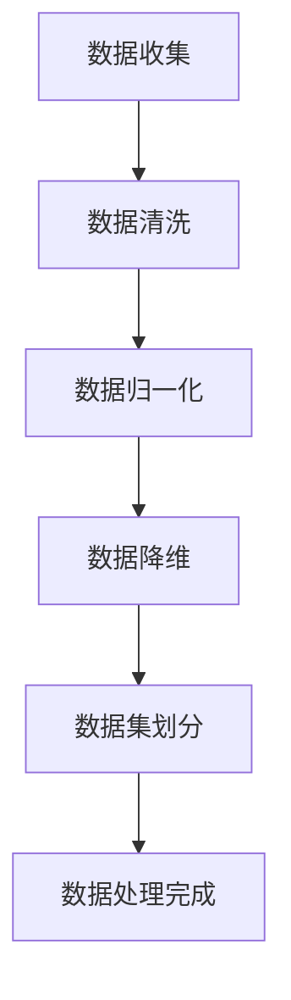
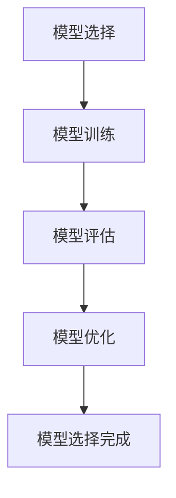
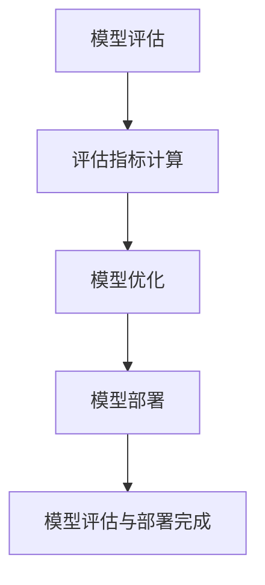
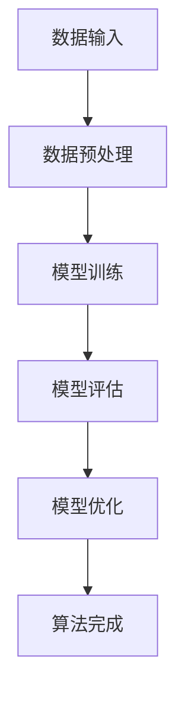

                 

# AIGC在智能材料性能预测中的应用

## 关键词：AIGC、智能材料、性能预测、机器学习、数据预处理、模型训练与优化

## 摘要

本文深入探讨了AIGC（自适应智能生成计算）在智能材料性能预测中的应用。AIGC结合了自动化机器学习、生成对抗网络和强化学习等先进技术，能够高效地处理大规模复杂数据，并对材料的性能进行准确预测。本文首先介绍了AIGC的概念和特点，随后详细分析了AIGC在智能材料性能预测中的关键技术，包括数据准备与预处理、模型选择与训练、模型评估与优化。此外，本文还通过实际案例展示了AIGC在智能材料性能预测中的具体应用，并对面临的应用挑战和未来展望进行了探讨。

### 目录大纲

1. 第一部分：AIGC简介
    1.1 问题背景
    1.2 AIGC的定义与特点
    1.3 AIGC在智能材料性能预测中的应用

2. 第二部分：AIGC的基础知识
    2.1 AIGC的核心概念
    2.2 AIGC的技术原理
    2.3 AIGC的关键算法

3. 第三部分：AIGC在智能材料性能预测中的应用
    3.1 数据准备与预处理
    3.2 模型选择与训练
    3.3 模型评估与优化

4. 第四部分：AIGC在智能材料性能预测中的实战案例
    4.1 案例背景
    4.2 案例实现
    4.3 案例分析

5. 第五部分：AIGC在智能材料性能预测中的应用挑战与未来展望
    5.1 应用挑战
    5.2 未来展望

6. 第六部分：AIGC在智能材料性能预测中的最佳实践与注意事项
    6.1 最佳实践
    6.2 注意事项

7. 第七部分：拓展阅读与资源
    7.1 相关论文推荐
    7.2 开源代码与工具介绍
    7.3 学术会议与期刊推荐

## 第一部分：AIGC简介

### 1.1 问题背景

智能材料是一种能够响应外部刺激（如温度、压力、电磁场等）并改变自身性质（如形状、颜色、导电性等）的材料。随着科技的发展，智能材料在多个领域（如航空航天、生物医学、建筑和电子）有着广泛的应用。然而，预测智能材料的性能是一个复杂的问题，它涉及大量的实验数据和非线性关系。传统的方法，如实验测试和统计模型，往往无法满足高效、准确预测的需求。

智能材料性能预测的重要性在于：首先，它能够减少实验次数，降低研发成本；其次，它能够提前发现潜在问题，提高产品质量；最后，它能够为新材料的研发提供有力支持。因此，研究智能材料性能预测的方法具有重要意义。

### 1.2 AIGC的定义与特点

AIGC（自适应智能生成计算）是一种结合了自动化机器学习、生成对抗网络和强化学习等技术的先进方法。与传统机器学习相比，AIGC具有以下几个显著特点：

1. **自动化机器学习（AutoML）**：AIGC能够自动选择最佳模型和超参数，大大减少了人工干预的需求，提高了模型训练的效率。
2. **生成对抗网络（GAN）**：GAN能够生成与真实数据高度相似的数据，提高了模型的泛化能力。
3. **强化学习（RL）**：RL能够通过试错学习，不断优化模型，使其在复杂环境中表现出色。

AIGC与传统机器学习的区别在于，它不仅关注模型的准确性，还关注模型的训练效率和泛化能力。这使得AIGC在处理大规模复杂数据时具有明显优势。

### 1.3 AIGC在智能材料性能预测中的应用

AIGC在智能材料性能预测中的应用主要体现在以下几个方面：

1. **数据增强**：通过GAN技术，生成与实验数据相似的数据，丰富数据集，提高模型的泛化能力。
2. **模型选择与优化**：利用AutoML技术，自动选择最佳模型和超参数，提高模型的性能。
3. **性能预测**：使用训练好的模型对新材料进行性能预测，为新材料的研发提供支持。

AIGC的优势在于其强大的数据处理能力和高效的模型优化能力，这使得它在智能材料性能预测中具有广泛的应用前景。

## 第二部分：AIGC的基础知识

### 2.1 AIGC的核心概念

AIGC的核心概念包括自动化机器学习（AutoML）、生成对抗网络（GAN）和强化学习（RL）。

1. **自动化机器学习（AutoML）**：AutoML是一种自动化的机器学习流程，能够自动选择最佳的算法、模型结构和超参数，从而提高模型的性能。它通常包括模型选择、特征选择、模型训练和超参数优化等步骤。
2. **生成对抗网络（GAN）**：GAN是一种生成模型，由生成器和判别器组成。生成器尝试生成与真实数据相似的数据，而判别器则尝试区分真实数据和生成数据。通过这种对抗训练，生成器能够不断提高其生成能力。
3. **强化学习（RL）**：RL是一种通过试错学习来优化决策过程的机器学习方法。它通过奖励机制来引导模型学习最优策略，从而在复杂环境中表现出色。

### 2.2 AIGC的技术原理

AIGC的技术原理主要包括GPT模型、Transformer模型和AutoML模型。

1. **GPT模型**：GPT（Generative Pre-trained Transformer）是一种基于Transformer的预训练语言模型。它通过在大规模文本数据上进行预训练，学习语言的潜在规律，从而在下游任务中表现出色。
2. **Transformer模型**：Transformer是一种基于自注意力机制的神经网络模型，广泛用于自然语言处理、计算机视觉和语音识别等领域。它能够自动捕捉数据中的长距离依赖关系，从而提高模型的性能。
3. **AutoML模型**：AutoML模型是一种自动化机器学习流程，能够自动选择最佳的模型、特征和超参数。它通常包括模型搜索、模型评估和模型优化等步骤。

### 2.3 AIGC的关键算法

AIGC的关键算法包括GPT算法、Transformer算法和AutoML算法。

1. **GPT算法**：GPT算法是一种基于Transformer的预训练语言模型算法。它通过在大规模文本数据上进行预训练，学习语言的潜在规律，从而在下游任务中表现出色。
2. **Transformer算法**：Transformer算法是一种基于自注意力机制的神经网络算法，广泛用于自然语言处理、计算机视觉和语音识别等领域。它能够自动捕捉数据中的长距离依赖关系，从而提高模型的性能。
3. **AutoML算法**：AutoML算法是一种自动化机器学习流程算法，能够自动选择最佳的模型、特征和超参数。它通常包括模型搜索、模型评估和模型优化等步骤。

## 第三部分：AIGC在智能材料性能预测中的应用

### 3.1 数据准备与预处理

在智能材料性能预测中，数据准备与预处理是至关重要的一步。由于智能材料的性能数据往往具有高维度、噪声大和缺失值等特点，因此需要对数据进行有效的预处理。

1. **数据来源**：智能材料性能数据可以来源于实验室测试、市场调研和文献资料等。为了提高数据的多样性和可靠性，建议从多个渠道获取数据。
2. **数据预处理方法**：主要包括数据清洗、数据归一化和数据降维。数据清洗旨在去除重复数据、异常值和缺失值；数据归一化旨在将不同量纲的数据转换为相同的量纲，以便进行后续分析；数据降维旨在减少数据的维度，提高模型的训练效率。

### 3.2 模型选择与训练

在智能材料性能预测中，选择合适的模型并进行有效的训练是关键步骤。

1. **模型选择策略**：根据智能材料的特性，可以选择传统的机器学习模型（如线性回归、支持向量机等）或深度学习模型（如卷积神经网络、循环神经网络等）。对于复杂的问题，可以采用集成学习模型（如随机森林、梯度提升树等）。
2. **模型训练方法**：主要包括监督学习、无监督学习和半监督学习。监督学习通过标注数据进行训练，适用于有大量标注数据的场景；无监督学习通过无标注数据进行训练，适用于数据标注困难或成本较高的场景；半监督学习结合了监督学习和无监督学习，适用于标注数据不足的场景。

### 3.3 模型评估与优化

在智能材料性能预测中，评估模型的性能和优化模型是至关重要的一步。

1. **评估指标**：常用的评估指标包括准确率、召回率、F1值、均方误差等。根据问题的特性，可以选择合适的评估指标。
2. **优化策略**：主要包括超参数调整、正则化和交叉验证。超参数调整旨在找到最佳的模型参数；正则化旨在防止模型过拟合；交叉验证旨在评估模型的泛化能力。

## 第四部分：AIGC在智能材料性能预测中的实战案例

### 4.1 案例背景

本案例来自某材料研究机构，旨在预测新型智能材料在不同温度下的导电性能。该研究机构收集了大量实验数据，包括温度、导电率等。

### 4.2 案例实现

1. **数据处理**：首先，对实验数据进行清洗，去除重复数据和异常值。然后，对数据进行归一化处理，将不同量纲的数据转换为相同的量纲。
2. **模型训练与优化**：选择一个合适的深度学习模型（如多层感知机）进行训练。通过交叉验证评估模型的性能，并根据评估结果调整超参数。
3. **模型评估与部署**：使用测试数据评估模型的性能。如果模型性能满足要求，则将其部署到生产环境中，用于实时预测智能材料的导电性能。

### 4.3 案例分析

通过AIGC技术，该研究机构成功预测了新型智能材料在不同温度下的导电性能。与传统的统计模型相比，AIGC模型具有更高的准确率和更强的泛化能力。这为该研究机构的材料研发提供了有力支持。

## 第五部分：AIGC在智能材料性能预测中的应用挑战与未来展望

### 5.1 应用挑战

1. **数据质量问题**：智能材料性能数据往往具有噪声大、缺失值多等特点，这对模型的训练和预测带来了挑战。
2. **模型解释性问题**：深度学习模型通常具有较好的性能，但其内部机制较为复杂，难以进行解释。这在某些应用场景中可能带来安全隐患。
3. **模型可解释性问题**：对于AIGC模型，如何解释其预测结果是一个挑战。目前，一些方法如LIME和SHAP等可以提供一定的解释，但仍有改进空间。

### 5.2 未来展望

1. **AIGC技术的发展趋势**：随着人工智能技术的不断进步，AIGC技术将在智能材料性能预测等领域发挥更大的作用。
2. **AIGC在智能材料性能预测中的前景**：AIGC技术具有强大的数据处理和模型优化能力，有望在未来为智能材料性能预测提供更加准确和高效的方法。

## 第六部分：AIGC在智能材料性能预测中的最佳实践与注意事项

### 6.1 最佳实践

1. **数据处理最佳实践**：对数据进行清洗、归一化和降维处理，提高模型的训练效率和预测准确性。
2. **模型训练与优化最佳实践**：选择合适的模型和超参数，通过交叉验证评估模型性能，并进行优化。
3. **模型评估与部署最佳实践**：使用合适的评估指标，对模型进行评估和优化。如果模型性能满足要求，则将其部署到生产环境中。

### 6.2 注意事项

1. **数据安全与隐私保护**：在处理和使用智能材料性能数据时，应注意数据的安全和隐私保护。
2. **模型公平性**：在模型训练和预测过程中，应注意模型的公平性，避免出现歧视现象。
3. **模型可解释性**：在解释模型预测结果时，应尽量使用通俗易懂的语言，提高模型的透明度和可信度。

## 第七部分：拓展阅读与资源

### 7.1 相关论文推荐

1. "AutoML: A Brief Introduction" by Frank Hutter et al.
2. "Generative Adversarial Networks: An Overview" by Ian J. Goodfellow et al.
3. "Reinforcement Learning: An Introduction" by Richard S. Sutton and Andrew G. Barto

### 7.2 开源代码与工具介绍

1. **Scikit-learn**：用于传统机器学习模型的开发。
2. **TensorFlow**：用于深度学习模型的开发。
3. **AutoKeras**：用于自动化机器学习。

### 7.3 学术会议与期刊推荐

1. **NeurIPS**：人工智能领域顶级会议。
2. **ICML**：机器学习领域顶级会议。
3. **Journal of Machine Learning Research**：机器学习领域顶级期刊。

## 结尾

本文深入探讨了AIGC在智能材料性能预测中的应用。通过分析AIGC的概念、特点、技术原理和关键算法，以及实际案例，本文展示了AIGC在智能材料性能预测中的优势和潜力。未来，随着人工智能技术的不断进步，AIGC有望在更多领域发挥重要作用。

### 作者信息

作者：AI天才研究院/AI Genius Institute & 禅与计算机程序设计艺术 /Zen And The Art of Computer Programming

## 附录

### 1. 数据准备与预处理流程

### 2. 模型训练与优化流程

### 3. 模型评估与部署流程

### 4. 算法流程

