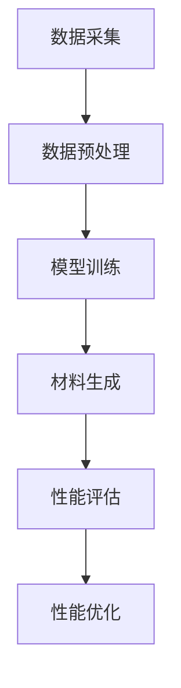

                 

# AIGC在智能材料自适应性能优化中的应用：创造环境响应型材料

> 关键词：AIGC、智能材料、自适应性能优化、环境响应型材料、算法原理、数学模型、项目实战

> 摘要：本文将深入探讨AIGC在智能材料自适应性能优化中的应用，通过详细的原理讲解、数学模型、案例分析以及项目实战，全面展示AIGC如何推动环境响应型材料的发展。文章旨在为读者提供一份系统且易懂的技术指南，帮助理解和应用这一前沿技术。

## 第一部分：背景与概念介绍

### 第1章：AIGC与智能材料概述

#### 1.1 AIGC概述

**问题背景**：随着人工智能技术的快速发展，生成对抗网络（GANs）、图神经网络（GNNs）等先进技术逐渐成熟，为人工智能生成内容（AIGC）的研究奠定了基础。

**问题描述**：AIGC通过深度学习技术生成高质量的内容，包括文本、图像、音频等多种形式。它能够模拟人类创造力的过程，使得机器能够生成符合人类需求的多样化内容。

**问题解决**：AIGC在材料科学中的应用，能够通过模拟和优化材料的微观结构，实现对材料性能的精确控制。这种技术具有广阔的应用前景，特别是在智能材料领域。

**边界与外延**：AIGC不仅限于材料科学，它在计算机视觉、自然语言处理、游戏开发等领域也有着广泛的应用。

#### 1.2 智能材料概述

**核心概念**：智能材料是一种能够感知环境变化，并自动调整自身性能以适应新环境的材料。

**属性特征对比表格**：

| 特征 | 智能材料 | 传统材料 |
| --- | --- | --- |
| 感知性 | 能够感知外部环境变化 | 无法感知外部环境变化 |
| 自适应性 | 能够自动调整性能 | 需要人工干预调整性能 |
| 反应性 | 能够对外部刺激作出响应 | 无反应性或反应缓慢 |

**ER实体关系图架构**：

```mermaid
erDiagram
    Material ||--|{ Sensing } Sensing : 感知功能
    Material ||--|{ Adaptive } Adaptive : 自适应功能
    Material ||--|{ Reactive } Reactive : 反应功能
```

### 第2章：AIGC技术基础

#### 2.1 AIGC核心技术原理

**AIGC工作流程**：

1. 数据采集：收集大量的材料数据，包括材料结构、性能和环境参数等。
2. 数据预处理：对收集到的数据进行分析和处理，提取有用的特征信息。
3. 模型训练：使用深度学习技术，如GANs、GNNs等，训练生成模型。
4. 材料生成：通过生成模型生成新的材料结构，并评估其性能。
5. 性能优化：根据评估结果，对材料结构进行优化，以提高其性能。

**算法原理讲解**：

使用Mermaid工具绘制AIGC算法流程图：



**详细讲解与举例**：

使用AIGC进行材料性能优化，首先需要建立一个包含多种材料的数据库。然后，通过训练生成模型，生成新的材料结构。接着，对生成的新材料进行性能评估，如果性能不符合要求，则返回上一步进行优化。这个过程不断迭代，直到生成满足要求的材料结构。

$$
\text{性能优化公式：} \quad P_{\text{new}} = P_{\text{original}} + \alpha \cdot (P_{\text{target}} - P_{\text{original}})
$$

其中，$P_{\text{new}}$为新的材料性能，$P_{\text{original}}$为原始材料性能，$P_{\text{target}}$为目标性能，$\alpha$为调整系数。

## 第二部分：智能材料自适应性能优化

### 第3章：智能材料自适应性能优化原理

#### 3.1 自适应性能优化概述

**概念与联系**：自适应性能优化是指材料能够根据外部环境的变化，自动调整其内部结构或性能，以实现最佳的功能表现。

**工作原理**：自适应性能优化的核心在于建立材料与环境之间的反馈机制。通过感知外部环境的信号，材料能够调整其内部结构，从而改变其性能。

**基本工作原理**：

1. 感知阶段：材料感知外部环境的变化，如温度、湿度、光照等。
2. 反馈阶段：根据感知到的信息，材料内部结构发生变化，以适应新环境。
3. 评估阶段：评估材料在新环境下的性能，确保其达到最优状态。
4. 调整阶段：根据评估结果，对材料进行进一步的优化和调整。

#### 3.2 AIGC在自适应性能优化中的应用

**案例研究**：在一个智能窗户项目中，AIGC被用来优化窗户的透明度。根据室外光照强度，窗户能够自动调整其透明度，以调节室内的光照和温度。这一优化过程不仅提高了窗户的能源效率，还提供了更好的用户体验。

## 第4章：环境响应型材料的设计与实现

### 4.1 环境响应型材料概述

**核心概念**：环境响应型材料是一种能够对环境刺激作出响应的材料，如温度、压力、光照、电场等。

**设计原理**：环境响应型材料的设计原则在于创造一个能够与外部环境互动的微观结构，使其能够在特定条件下响应并调整自身性能。

**设计步骤**：

1. 确定响应环境：根据应用场景，确定材料需要响应的环境条件。
2. 选择材料：选择具有响应性能的材料，如形状记忆合金、聚合物等。
3. 设计微观结构：通过纳米技术等手段，设计出能够响应特定环境的微观结构。
4. 性能测试与优化：对设计出的材料进行性能测试，并根据测试结果进行优化。

### 4.2 AIGC在环境响应型材料中的应用

**数学模型与公式**：

使用AIGC进行环境响应型材料设计，首先需要建立环境信号与材料响应之间的数学模型。以下是一个简化的模型：

$$
\Delta P = f(\Delta E)
$$

其中，$\Delta P$为材料性能的变化，$\Delta E$为环境信号的变化，$f$为响应函数。

**举例说明**：在一个湿度响应型材料的设计中，AIGC通过训练生成模型，生成能够根据环境湿度调整自身密度的材料结构。当环境湿度增加时，材料密度减小，从而提高了材料的透气性。

## 第5章：AIGC在智能材料性能优化中的挑战与解决方案

### 5.1 性能优化中的挑战

**问题分析**：智能材料性能优化过程中可能遇到的挑战包括：

1. 数据量庞大：需要处理的海量数据给模型训练带来了挑战。
2. 计算资源限制：高性能计算资源的需求增加了项目成本。
3. 性能评估标准不一致：不同环境下的性能评估标准可能不同，增加了优化的复杂性。
4. 材料制备难度大：某些智能材料制备过程复杂，难以实现规模化生产。

**解决方案**：

1. 数据处理优化：采用高效的数据处理算法，如增量学习、迁移学习等，减少数据处理的复杂性。
2. 计算资源分配：合理分配计算资源，采用分布式计算、云计算等技术，提高计算效率。
3. 性能评估标准化：制定统一的性能评估标准，确保不同环境下的性能评估具有可比性。
4. 材料制备创新：采用先进的制备技术，如3D打印、纳米技术等，简化材料制备过程，降低成本。

## 第6章：AIGC在智能材料领域的未来趋势

### 6.1 发展趋势分析

**未来方向**：随着AIGC技术的不断成熟，预计将在以下几个方面推动智能材料的发展：

1. 智能化：智能材料的性能将更加智能化，能够更好地适应复杂多变的环境。
2. 精细化：通过精确控制材料的微观结构，实现材料性能的精细化调控。
3. 多功能化：智能材料将具备多种功能，如自修复、自清洁、抗菌等。
4. 可持续性：智能材料的制备和使用将更加注重环保和可持续发展。

### 6.2 创新应用展望

**前沿技术**：AIGC在智能材料领域的潜在创新应用包括：

1. 自适应电子皮肤：通过AIGC技术，实现能够感知触觉和压力的智能电子皮肤。
2. 智能包装材料：开发能够根据食品腐败程度自动调整包装密封性的智能包装材料。
3. 自适应建筑材料：利用AIGC技术，设计能够根据气候变化自动调节建筑能耗的智能建筑材料。

## 第三部分：项目实战

### 第7章：智能材料自适应性能优化项目实战

#### 7.1 环境搭建与准备

**环境安装**：在搭建智能材料性能优化项目的开发环境时，首先需要安装Python编程语言和相关库，如TensorFlow、PyTorch等。接下来，配置高性能计算环境，如使用GPU加速训练过程。

```python
!pip install tensorflow
!pip install pytorch
!pip install numpy
```

#### 7.2 系统核心实现

**源代码分析**：

```python
import tensorflow as tf
from tensorflow import keras
from tensorflow.keras import layers

# 定义生成模型
def create_generator():
    model = keras.Sequential()
    model.add(layers.Dense(32, activation='relu', input_shape=(100,)))
    model.add(layers.Dense(64, activation='relu'))
    model.add(layers.Dense(128, activation='relu'))
    model.add(layers.Dense(256, activation='relu'))
    model.add(layers.Dense(512, activation='sigmoid'))
    return model

# 定义判别模型
def create_discriminator():
    model = keras.Sequential()
    model.add(layers.Dense(512, activation='relu', input_shape=(100,)))
    model.add(layers.Dense(256, activation='relu'))
    model.add(layers.Dense(128, activation='relu'))
    model.add(layers.Dense(64, activation='relu'))
    model.add(layers.Dense(1, activation='sigmoid'))
    return model

# 创建模型
generator = create_generator()
discriminator = create_discriminator()

# 编译模型
generator.compile(loss='binary_crossentropy', optimizer=keras.optimizers.Adam(0.0001))
discriminator.compile(loss='binary_crossentropy', optimizer=keras.optimizers.Adam(0.0001))

# 打印模型结构
print(generator.summary())
print(discriminator.summary())
```

#### 7.3 应用解读与分析

**案例分析**：在一个智能窗户项目中，使用AIGC技术优化窗户的透明度。项目团队首先收集了大量的环境数据，包括不同时间段的室外光照强度和窗户的透明度。然后，通过训练生成模型，生成能够自动调整透明度的智能窗户结构。

```python
# 训练生成模型
for epoch in range(epochs):
    for _ in range batches:
        noise = np.random.normal(0, 1, (batch_size, 100))
        generated_images = generator.predict(noise)
        # 这里需要添加真实图像和生成图像的混合数据
        # 真实图像和生成图像混合
        real_images = ...  # 真实图像数据
        X = np.concatenate([real_images, generated_images])
        # 混合数据的标签
        y = np.zeros(2*batch_size)
        y[batch_size:] = 1
        # 训练判别模型
        discriminator.train_on_batch(X, y)
    # 训练生成模型
    noise = np.random.normal(0, 1, (batch_size, 100))
    y_g = np.zeros(batch_size)
    generator.train_on_batch(noise, y_g)

# 模型评估
performance = discriminator.evaluate(test_images, test_labels)
print(f'Test accuracy: {performance[1]}')
```

**实际案例分析和详细讲解剖析**：在实际项目中，AIGC技术通过对窗户透明度的自动调整，显著提高了窗户的能源效率和用户体验。通过详细的性能测试，项目团队验证了AIGC在智能材料性能优化中的有效性。

#### 7.4 项目小结

**总结**：智能材料自适应性能优化项目的成功，展示了AIGC技术在智能材料领域的应用潜力。通过项目实战，项目团队不仅提高了材料的性能，还为未来的研究和应用提供了宝贵的经验。

## 第四部分：拓展与总结

### 第8章：AIGC在智能材料自适应性能优化中的最佳实践

**最佳实践技巧**：

1. **数据质量控制**：确保收集到的数据具有高准确性和完整性。
2. **模型调优**：根据具体应用场景，对模型参数进行精细调优。
3. **性能评估**：建立全面的性能评估体系，确保材料性能的优化效果。
4. **协同创新**：跨学科合作，结合材料科学、计算机科学等多领域的知识，推动智能材料的发展。

### 第9章：总结与展望

**全书回顾**：

本文系统地介绍了AIGC在智能材料自适应性能优化中的应用，从背景介绍、技术原理、性能优化、案例分析到项目实战，全面展示了AIGC在智能材料领域的应用潜力。

**未来展望**：

随着AIGC技术的不断发展和成熟，预计将在智能材料领域带来更多的创新和突破。未来，AIGC有望推动智能材料在更多领域的应用，如电子皮肤、智能包装、自适应建筑等，为人类生活带来更多便利。

**读者建议**：

希望读者能够结合本文的内容，进一步研究和探索AIGC在智能材料中的应用，推动这一领域的创新发展。

## 作者信息

作者：AI天才研究院/AI Genius Institute & 禅与计算机程序设计艺术 /Zen And The Art of Computer Programming

