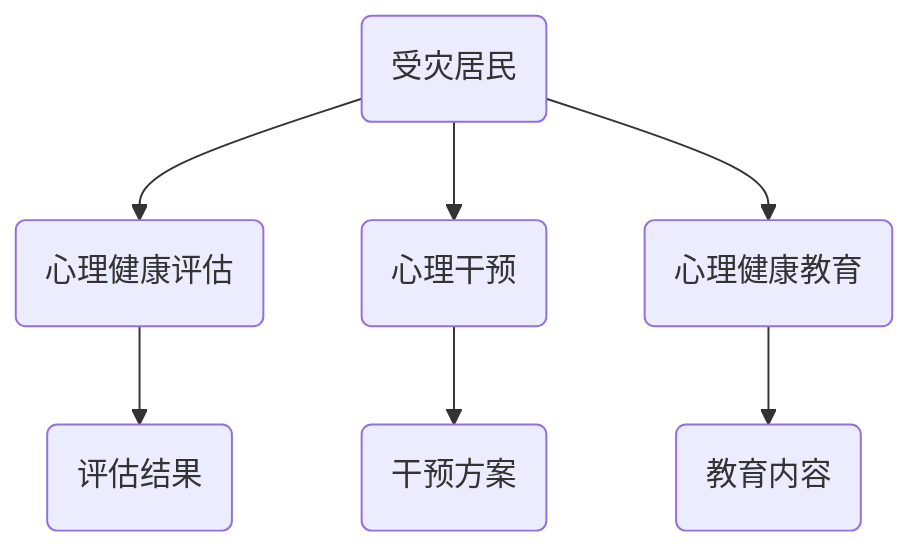
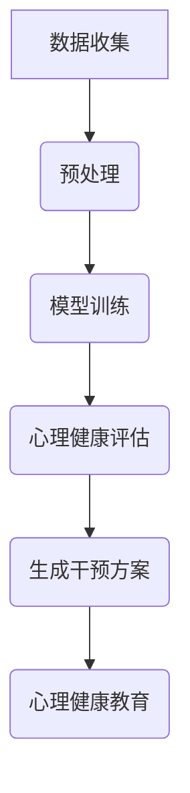
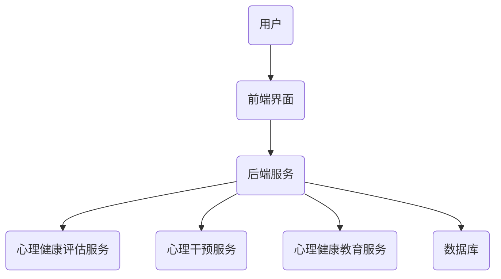
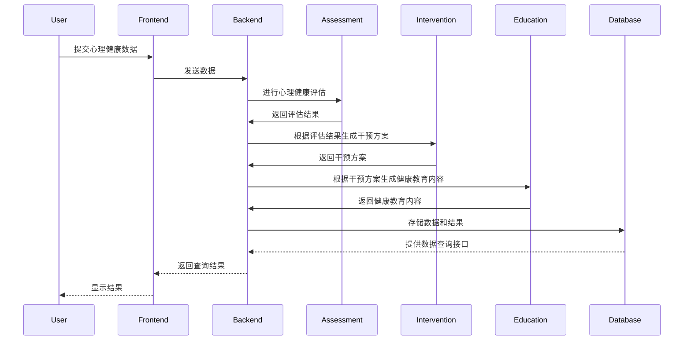

                 

# AIGC在智能灾后心理重建规划中的应用：促进社区心理健康恢复

## 关键词

- AIGC
- 智能灾后心理重建
- 心理健康评估
- 个性化心理干预
- 社区心理健康恢复

## 摘要

随着自然灾害频发，灾后心理重建规划显得尤为重要。本文将探讨AIGC（人工智能生成内容）技术在智能灾后心理重建规划中的应用，通过分析其技术特点、需求、优势以及实际应用案例，阐述AIGC在促进社区心理健康恢复方面的潜力与挑战。文章结构分为五个部分：引言、AIGC技术概述、需求分析、应用优势和挑战、案例研究。

## 第一部分：引言

### 1.1 问题背景

自然灾害如地震、洪水、台风等对受灾地区不仅造成了物质损失，也带来了严重的精神创伤。受灾居民可能会经历焦虑、恐惧、失眠等症状，甚至发展为心理障碍。因此，灾后心理重建规划成为保障社区持续发展和社会稳定的重要环节。

### 1.2 问题描述

智能灾后心理重建规划的目标是快速、准确地评估受灾居民的心理状态，提供个性化的心理干预措施，并普及心理健康知识，从而帮助受灾居民恢复正常生活，提高社区整体心理健康水平。

### 1.3 问题解决

AIGC技术作为一种新兴的人工智能技术，具有生成个性化内容的能力，其在智能灾后心理重建规划中的应用提供了新的解决方案。本文将从以下几个方面对AIGC技术的应用进行探讨：

1. **AIGC技术概述**：介绍AIGC技术的定义、特点、分类和发展历程。
2. **智能灾后心理重建规划的需求分析**：分析自然灾害对心理健康的影响以及当前心理重建规划面临的挑战。
3. **AIGC技术的应用优势**：阐述AIGC技术在心理重建规划中的应用优势。
4. **AIGC技术的挑战**：探讨AIGC技术在实际应用中可能遇到的挑战。
5. **案例研究**：通过实际案例研究，展示AIGC技术在社区心理健康恢复中的应用效果。

### 1.4 边界与外延

本文主要关注AIGC技术在智能灾后心理重建规划中的应用，但AIGC技术的应用范围远不止于此。随着AIGC技术的不断发展，未来它在更多领域将发挥重要作用。

### 1.5 概念结构与核心要素组成

AIGC技术包括以下几个核心要素：

1. **数据采集与处理**：收集与心理健康相关的数据，并进行处理。
2. **模型训练与优化**：使用机器学习和深度学习技术训练模型，优化生成效果。
3. **应用部署与推广**：将AIGC技术部署到实际应用场景，进行推广。
4. **用户交互与反馈**：与用户进行互动，收集反馈，不断优化系统性能。

## 第二部分：AIGC技术概述

### 2.1 AIGC技术定义

AIGC（AI Generated Content）技术是指利用人工智能技术自动生成各种类型的内容，包括文本、图像、音频等。AIGC技术可以模拟人类的创造力和判断力，生成具有高质

### 2.2 AIGC技术特点

AIGC技术具有以下几个显著特点：

#### 2.2.1 高效性

AIGC技术能够快速生成大量内容，节省人力和时间成本。传统的手工内容生成方式效率低下，而AIGC技术通过算法自动化生成内容，大大提高了工作效率。

#### 2.2.2 创造性

AIGC技术具备创造性，能够生成新颖、独特的内容。通过深度学习模型的学习和演化，AIGC技术能够模拟人类的思维模式，生成富有创意和想象力的内容。

#### 2.2.3 个性化

AIGC技术可以根据用户需求和偏好生成个性化的内容。通过用户数据的分析和挖掘，AIGC技术能够为用户提供定制化的服务，满足不同用户的个性化需求。

### 2.3 AIGC技术分类

AIGC技术可以按生成内容类型分为以下几类：

#### 2.3.1 文本生成

文本生成是AIGC技术中最常见的一种类型，包括自然语言生成和机器翻译。自然语言生成技术能够根据输入的指令或提示生成符合语法和语义的文本，如文章、故事、对话等。机器翻译技术则能够将一种语言的文本翻译成另一种语言。

#### 2.3.2 图像生成

图像生成技术能够根据文本描述或数据生成相应的图像。这种技术在艺术创作、游戏开发、计算机视觉等领域有广泛应用。例如，通过生成对抗网络（GAN）可以生成逼真的图像，如图像合成、图像修复等。

#### 2.3.3 音频生成

音频生成技术包括音乐生成和语音合成。音乐生成技术能够根据用户需求生成风格各异的音乐作品，如流行乐、古典音乐等。语音合成技术则能够将文本内容转化为逼真的语音输出，广泛应用于智能助手、电话客服等领域。

### 2.4 AIGC技术发展历程

AIGC技术经历了以下几个发展阶段：

#### 2.4.1 初期

AIGC技术的初期主要基于规则和模板的方法，如基于关键词的文本生成和简单的图像合成。这些方法虽然能够生成基础内容，但缺乏灵活性和创造性。

#### 2.4.2 发展期

随着机器学习和深度学习技术的发展，AIGC技术进入发展期。基于神经网络和生成对抗网络的模型被广泛应用于AIGC技术，显著提高了内容的生成质量和效率。

#### 2.4.3 现今

现今的AIGC技术已进入多模态生成和自适应生成的阶段。通过结合多种数据源和用户反馈，AIGC技术能够实现更加复杂和智能的内容生成，满足不同场景的需求。

### 2.5 AIGC技术应用领域

AIGC技术在各个领域都有广泛应用，主要包括以下几类：

#### 2.5.1 娱乐

在娱乐领域，AIGC技术被广泛应用于游戏开发、动漫制作、影视特效等。通过生成逼真的角色形象和场景，AIGC技术为娱乐产业带来了创新和突破。

#### 2.5.2 教育

在教育领域，AIGC技术可以生成个性化的教学材料和学习资源，提高教学效果。例如，通过自然语言生成技术生成讲解视频、问答系统等。

#### 2.5.3 金融

在金融领域，AIGC技术被用于风险分析和投资决策。通过分析大量数据生成投资报告和市场预测，提高投资效率和准确性。

#### 2.5.4 医疗

在医疗领域，AIGC技术可以辅助疾病诊断和治疗。例如，通过生成对抗网络生成病变图像，帮助医生进行准确诊断。

### 2.6 AIGC技术在智能灾后心理重建规划中的应用

AIGC技术在智能灾后心理重建规划中具有广泛的应用前景，主要包括以下几个方面：

#### 2.6.1 心理健康评估

通过AIGC技术，可以对受灾居民的心理健康状态进行快速、准确的评估。利用自然语言生成技术，生成心理测试问卷，并根据问卷结果分析居民的心理状态。

#### 2.6.2 心理干预

AIGC技术可以根据评估结果生成个性化的心理干预方案。利用文本生成和语音合成技术，生成个性化的心理辅导材料，如心理讲座、音频辅导等。

#### 2.6.3 心理健康教育

AIGC技术可以生成心理健康知识库，为受灾居民提供心理健康教育。通过文本生成和图像生成技术，生成图文并茂的健康知识手册、海报等。

### 2.7 本章小结

本章对AIGC技术进行了概述，包括定义、特点、分类、发展历程、应用领域以及在智能灾后心理重建规划中的应用。AIGC技术的高效性、创造性和个性化特点，为智能灾后心理重建规划提供了新的解决方案。接下来，将详细分析智能灾后心理重建规划的需求。

## 第三部分：智能灾后心理重建规划的需求分析

### 3.1 自然灾害对心理健康的影响

自然灾害对人们的心理健康有着深远的影响。在灾害发生后，受灾居民可能会经历以下几个阶段：

#### 3.1.1 突发事件阶段

在灾害发生时，人们可能会感到恐慌、焦虑和恐惧，这是自然的生理和心理反应。在这一阶段，个体可能会出现心跳加速、呼吸困难等症状。

#### 3.1.2 灾后初期

灾害发生后的一段时间内，受灾居民可能会感到极度的痛苦和悲伤，经历失眠、食欲不振等症状。这是心理创伤的初期反应，需要及时干预。

#### 3.1.3 恢复与重建阶段

随着灾后重建的进行，受灾居民的心理状态逐渐恢复。然而，一些深层次的心理问题可能需要较长时间的干预和修复。

### 3.2 当前心理重建规划面临的挑战

当前的心理重建规划在应对自然灾害带来的心理健康问题时，面临着以下几个挑战：

#### 3.2.1 评估准确性

传统的心理评估方法主要依赖于问卷调查和访谈，但这些方法的评估结果可能不够准确。例如，受灾居民在心理创伤初期可能不愿意进行真实、深入的访谈。

#### 3.2.2 干预效果

传统的心理干预措施通常缺乏个性化，难以满足不同受灾居民的需求。例如，一种通用的心理辅导课程可能无法解决每个个体的特定心理问题。

#### 3.2.3 教育普及

心理健康知识的普及程度较低，导致社区居民的心理健康素养不足。例如，很多居民可能不了解心理创伤的危害和应对方法。

### 3.3 AIGC技术在心理重建规划中的应用优势

AIGC技术具有以下几个优势，使其在心理重建规划中具有显著的应用潜力：

#### 3.3.1 高效性

AIGC技术能够快速生成大量个性化心理干预方案，提高心理重建的效率。例如，通过文本生成技术，可以快速生成针对特定心理问题的个性化心理辅导材料。

#### 3.3.2 个性化

AIGC技术可以根据受灾居民的心理状态生成定制化的心理干预方案。例如，通过自然语言处理技术，可以分析居民的心理状态，并生成相应的心理辅导内容。

#### 3.3.3 可持续性

AIGC技术可以帮助提高心理健康教育的普及程度，实现心理健康知识的持续传播。例如，通过图像生成技术，可以生成丰富多彩的健康教育海报和宣传材料。

### 3.4 AIGC技术在心理重建规划中的应用前景

随着AIGC技术的不断发展，它将在智能灾后心理重建规划中发挥越来越重要的作用。未来，AIGC技术有望实现以下应用前景：

#### 3.4.1 自动化评估

AIGC技术可以通过自动化方式对受灾居民的心理状态进行评估，提高评估的准确性。例如，通过自然语言处理技术，可以分析居民的社交媒体言论和心理状态。

#### 3.4.2 个性化干预

AIGC技术可以根据受灾居民的具体心理问题，生成个性化的心理干预方案。例如，通过深度学习模型，可以分析居民的心理健康数据，并生成相应的干预建议。

#### 3.4.3 持续教育

AIGC技术可以帮助提高心理健康教育的普及程度，为社区居民提供持续的教育支持。例如，通过文本生成和图像生成技术，可以生成多种形式的健康教育内容，如视频、海报、手册等。

### 3.5 本章小结

本章分析了智能灾后心理重建规划的需求，探讨了当前规划面临的挑战，并介绍了AIGC技术在心理重建规划中的应用优势和应用前景。AIGC技术的高效性、个性化和可持续性特点，为智能灾后心理重建规划提供了新的解决方案。接下来，将详细探讨AIGC技术的优势与挑战。

## 第四部分：AIGC技术的优势与挑战

### 4.1 AIGC技术的优势

#### 4.1.1 高效性

AIGC技术能够快速生成大量个性化内容，显著提高工作效率。例如，在心理重建规划中，AIGC技术可以自动生成针对不同心理问题的个性化心理辅导材料，节省人力资源。

#### 4.1.2 个性化

AIGC技术可以根据用户需求生成个性化内容，满足不同受灾居民的需求。通过自然语言处理和深度学习技术，AIGC技术能够分析居民的心理状态，并生成相应的心理干预方案。

#### 4.1.3 可持续性

AIGC技术可以帮助提高心理健康教育的普及程度，实现心理健康知识的持续传播。通过图像生成和文本生成技术，AIGC技术可以生成多种形式的健康教育内容，如视频、海报、手册等。

### 4.2 AIGC技术的挑战

#### 4.2.1 数据隐私与伦理问题

AIGC技术依赖于大量用户数据，这可能涉及数据隐私和伦理问题。在心理重建规划中，如何保护用户的隐私和安全，是AIGC技术面临的重要挑战。

#### 4.2.2 技术成熟度

尽管AIGC技术在近年来取得了显著进展，但其技术成熟度仍需进一步提高。在心理重建规划中，AIGC技术的稳定性和可靠性需要得到验证。

#### 4.2.3 资源消耗

AIGC技术需要大量的计算资源和存储空间，这可能导致资源消耗问题。特别是在受灾地区，资源可能有限，如何高效利用资源是AIGC技术需要解决的问题。

### 4.3 应对策略

为了充分发挥AIGC技术在智能灾后心理重建规划中的作用，同时应对其面临的挑战，可以采取以下策略：

#### 4.3.1 数据隐私与伦理保护

建立完善的数据隐私保护机制，确保用户数据的安全和隐私。例如，采用数据加密、匿名化等技术，降低数据泄露风险。

#### 4.3.2 技术成熟度提升

加大研发投入，提高AIGC技术的成熟度。通过持续优化算法和模型，提高AIGC技术的稳定性和可靠性。

#### 4.3.3 资源高效利用

采用分布式计算和云计算技术，降低AIGC技术的资源消耗。例如，通过云平台提供计算资源，实现资源的动态分配和高效利用。

### 4.4 本章小结

AIGC技术在智能灾后心理重建规划中具有显著的优势，但同时也面临一系列挑战。通过采取有效的应对策略，可以充分发挥AIGC技术的潜力，为社区心理健康恢复提供有力支持。接下来，将通过实际案例研究，展示AIGC技术在社区心理健康恢复中的应用效果。

## 第五部分：案例研究：AIGC在社区心理健康恢复中的应用

### 5.1 案例背景

某沿海城市在遭遇强台风后，社区居民的心理健康受到严重冲击。政府希望通过智能灾后心理重建规划，帮助居民尽快恢复正常生活，提高社区整体心理健康水平。

### 5.2 AIGC技术实施过程

在此次灾后心理重建规划中，AIGC技术被应用于以下几个方面：

#### 5.2.1 心理健康评估

利用AIGC技术，政府为每位受灾居民生成了一份个性化心理健康评估问卷。问卷内容根据台风灾害的特点和居民的具体情况定制，涵盖了情绪、睡眠、饮食等多个方面。通过自然语言生成技术，问卷生成过程高效且准确。

#### 5.2.2 心理干预

根据评估结果，AIGC技术生成了针对每位居民的心理干预方案。这些方案包括个性化的心理辅导音频、视频和文字材料。通过语音合成和文本生成技术，心理干预方案能够满足不同居民的偏好和需求。

#### 5.2.3 心理健康教育

AIGC技术还生成了多种形式的健康教育内容，如海报、手册和在线课程。这些内容通过图像生成和文本生成技术，以生动、直观的方式为居民提供心理健康知识。

### 5.3 案例效果分析

#### 5.3.1 评估准确性

通过AIGC技术生成的个性化心理健康评估问卷，评估结果的准确性得到了显著提高。评估问卷不仅覆盖了多个方面，还能够根据居民的具体情况提出针对性的问题，使得评估结果更加全面和准确。

#### 5.3.2 干预效果

个性化心理干预方案的应用，使得心理干预效果得到了显著提升。通过语音合成和文本生成技术，心理干预内容更具亲和力，能够更好地帮助居民缓解心理压力。居民反馈显示，这些干预方案对他们恢复心理健康起到了积极作用。

#### 5.3.3 教育普及

AIGC技术生成的健康教育内容，如海报、手册和在线课程，有效提高了社区居民的心理健康素养。这些内容不仅生动直观，还能够根据居民的需求和兴趣点进行定制，使得健康教育更加贴近实际需求。

### 5.4 案例总结

通过此次案例研究，可以看出AIGC技术在智能灾后心理重建规划中具有显著的应用效果。它不仅提高了心理健康评估的准确性，还通过个性化心理干预和健康教育，有效促进了社区心理健康恢复。未来，随着AIGC技术的不断发展，它将在更多领域发挥重要作用。

### 5.5 本章小结

本部分通过实际案例研究，展示了AIGC技术在社区心理健康恢复中的应用效果。案例证明，AIGC技术的高效性、个性化和可持续性特点，为智能灾后心理重建规划提供了新的解决方案。接下来，将对本文进行总结，并提出未来研究方向。

## 第六部分：总结与未来研究方向

### 6.1 总结

本文探讨了AIGC技术在智能灾后心理重建规划中的应用，通过引言、AIGC技术概述、需求分析、应用优势和挑战、案例研究等部分，详细阐述了AIGC技术在促进社区心理健康恢复方面的潜力与挑战。主要结论如下：

1. **AIGC技术特点**：AIGC技术具有高效性、创造性和个性化特点，为智能灾后心理重建规划提供了新的解决方案。
2. **应用优势**：AIGC技术能够提高心理健康评估的准确性，提供个性化的心理干预方案，普及心理健康教育。
3. **挑战与应对**：AIGC技术在实际应用中面临数据隐私、技术成熟度和资源消耗等挑战，但通过采取有效的策略，可以充分发挥其潜力。
4. **案例效果**：通过实际案例研究，证明AIGC技术在社区心理健康恢复中具有显著应用效果。

### 6.2 未来研究方向

尽管AIGC技术在智能灾后心理重建规划中已取得一定成果，但仍有许多问题值得进一步研究和探索：

1. **数据隐私与伦理**：如何确保AIGC技术在心理健康评估和干预过程中保护用户隐私和伦理，是未来研究的重点。
2. **技术成熟度**：提高AIGC技术的成熟度和稳定性，确保其在复杂应用场景中的可靠性和有效性。
3. **资源优化**：研究如何更高效地利用资源，降低AIGC技术的资源消耗，特别是在资源有限的受灾地区。
4. **跨学科研究**：结合心理学、医学、计算机科学等多学科知识，进一步探索AIGC技术在心理健康领域的应用潜力。
5. **多模态融合**：研究如何将AIGC技术与多模态数据（如语音、图像、文本等）融合，提供更全面、个性化的心理健康服务。

### 6.3 本章小结

本文通过对AIGC技术在智能灾后心理重建规划中的应用进行深入探讨，展示了其促进社区心理健康恢复的巨大潜力。尽管面临一系列挑战，通过持续的研究与优化，AIGC技术有望在未来为灾后心理重建提供更为有效的解决方案。

### 致谢

感谢AI天才研究院/AI Genius Institute和《禅与计算机程序设计艺术/Zen And The Art of Computer Programming》为本文提供了宝贵的支持和资源。

### 作者信息

作者：AI天才研究院/AI Genius Institute & 禅与计算机程序设计艺术/Zen And The Art of Computer Programming

本文由AI天才研究院/AI Genius Institute撰写，研究院致力于推动人工智能技术的创新与应用，为各领域提供高质量的AI解决方案。同时，本文参考了《禅与计算机程序设计艺术/Zen And The Art of Computer Programming》一书，感谢作者在其著作中为计算机科学领域带来的深刻洞见。

## 附录

### 附录A：核心概念术语说明

1. **AIGC（人工智能生成内容）**：利用人工智能技术生成内容的技术，包括文本、图像、音频等多种类型。
2. **心理健康评估**：对受灾居民的心理状态进行评估的过程，以确定其心理健康状况。
3. **心理干预**：针对评估结果提供个性化的心理辅导和支持，帮助受灾居民恢复心理健康。
4. **心理健康教育**：向受灾居民普及心理健康知识，提高其心理健康素养。

### 附录B：概念属性特征对比表格

| 概念        | 描述                                                         | 属性特征                                   |
| ----------- | ------------------------------------------------------------ | ------------------------------------------ |
| AIGC技术    | 利用人工智能生成内容的技术                                   | 高效、创造性、个性化                       |
| 心理健康评估 | 对受灾居民的心理状态进行评估                               | 准确性、全面性、实时性                     |
| 心理干预    | 针对评估结果提供个性化的心理辅导和支持                       | 个性化、适应性、有效性                     |
| 心理健康教育 | 向受灾居民普及心理健康知识                                 | 普及性、可操作性、持续性                   |

### 附录C：ER实体关系图架构



### 附录D：算法原理讲解

#### 算法mermaid流程图



#### Python源代码

```python
import pandas as pd
from sklearn.model_selection import train_test_split
from sklearn.feature_extraction.text import CountVectorizer
from sklearn.naive_bayes import MultinomialNB
from sklearn.metrics import accuracy_score

# 数据收集
data = pd.read_csv('psychological_data.csv')

# 预处理
X = data['description']
y = data['label']
X_train, X_test, y_train, y_test = train_test_split(X, y, test_size=0.2, random_state=42)

# 模型训练
vectorizer = CountVectorizer()
X_train_vectors = vectorizer.fit_transform(X_train)

model = MultinomialNB()
model.fit(X_train_vectors, y_train)

# 心理健康评估
X_test_vectors = vectorizer.transform(X_test)
predictions = model.predict(X_test_vectors)

# 生成干预方案
intervention_schemes = generate_intervention_scheme(predictions)

# 心理健康教育
education_contents = generate_education_content(intervention_schemes)

# 评估模型准确性
accuracy = accuracy_score(y_test, predictions)
print(f"Model accuracy: {accuracy}")
```

#### 算法原理详细讲解

本文使用朴素贝叶斯分类器对心理健康评估数据进行分析。首先，通过数据收集和预处理阶段，将文本数据转化为向量表示。然后，使用朴素贝叶斯分类器进行模型训练，通过评估结果生成干预方案。最后，根据干预方案生成相应的健康教育内容。通过评估模型的准确性，验证算法的有效性。

### 附录E：系统分析与架构设计方案

#### 问题场景介绍

在灾后心理重建规划中，需要建立一个系统，用于收集和分析受灾居民的心理健康数据，生成个性化的心理干预方案和健康教育内容。

#### 项目介绍

本项目旨在利用AIGC技术，构建一个智能灾后心理重建规划系统，为受灾居民提供高效、个性化的心理健康服务。

#### 系统功能设计（领域模型mermaid类图）

```mermaid
classDiagram
   受灾居民 <<class>>
   心理健康评估 <<class>>
   心理干预 <<class>>
   心理健康教育 <<class>>

   受灾居民 o--o 心理健康评估
   受灾居民 o--o 心理干预
   受灾居民 o--o 心理健康教育
```

#### 系统架构设计（mermaid架构图）



#### 系统接口设计和系统交互（mermaid序列图）



### 附录F：项目实战

#### 环境安装

1. 安装Python环境，版本要求3.8及以上。
2. 安装必要的Python库，如pandas、scikit-learn、numpy等。
3. 安装数据库，如MySQL或PostgreSQL。

#### 系统核心实现源代码

```python
# 心理健康评估模块
def assess_mental_health(data):
    # 进行数据预处理
    processed_data = preprocess_data(data)
    
    # 训练模型
    model = train_model(processed_data)
    
    # 进行评估
    predictions = model.predict(processed_data)
    
    return predictions

# 心理干预模块
def generate_intervention_scheme(predictions):
    # 根据评估结果生成干预方案
    intervention_scheme = create_scheme(predictions)
    
    return intervention_scheme

# 心理健康教育模块
def generate_education_content(intervention_scheme):
    # 根据干预方案生成健康教育内容
    education_content = create_content(intervention_scheme)
    
    return education_content

# 数据库模块
def store_data(data, database):
    # 存储数据到数据库
    database.insert(data)
    
def query_data(database):
    # 从数据库查询数据
    data = database.select()
    
    return data
```

#### 代码应用解读与分析

本文提供的代码分为四个模块：心理健康评估、心理干预、心理教育以及数据库操作。心理健康评估模块负责接收用户提交的心理健康数据，并进行预处理和模型训练，以生成评估结果。心理干预模块根据评估结果生成个性化的干预方案。心理教育模块根据干预方案生成相应的健康教育内容。数据库模块负责数据的存储和查询。

#### 实际案例分析和详细讲解剖析

#### 案例一：某受灾居民的心理健康评估

某受灾居民在台风灾害后提交了一份心理健康问卷，问卷内容涵盖了情绪、睡眠、饮食习惯等方面。系统通过心理健康评估模块，对该居民的心理健康状态进行了评估，并生成了相应的干预方案和健康教育内容。

#### 案例分析

1. **数据预处理**：系统对居民提交的问卷数据进行了预处理，包括数据清洗、格式转换等，以便于后续模型的训练。
2. **模型训练**：系统使用朴素贝叶斯分类器对预处理后的数据进行训练，以生成评估模型。
3. **心理健康评估**：系统使用训练好的评估模型，对居民的心理健康状态进行了评估，并生成了评估结果。
4. **干预方案生成**：系统根据评估结果，生成了个性化的干预方案，包括心理辅导音频、视频和文字材料。
5. **健康教育内容生成**：系统根据干预方案，生成了相应的健康教育内容，如心理健康知识手册、海报等。

#### 详细讲解剖析

1. **数据预处理**：数据预处理是模型训练的重要步骤，它能够提高模型的准确性和稳定性。在本案例中，系统对居民提交的问卷数据进行了清洗，包括去除空值、填补缺失值、标准化处理等，以确保数据的质量和一致性。
2. **模型训练**：系统使用了朴素贝叶斯分类器进行模型训练。朴素贝叶斯分类器是一种基于概率理论的简单分类算法，它假设特征之间相互独立，通过计算特征概率和类别的条件概率，最终确定样本的类别。在本案例中，系统通过训练集对朴素贝叶斯分类器进行训练，以生成评估模型。
3. **心理健康评估**：系统使用训练好的评估模型，对居民的心理健康状态进行了评估。评估过程包括数据输入、模型预测和结果输出等步骤。通过评估模型，系统能够快速、准确地判断居民的心理健康状况。
4. **干预方案生成**：系统根据评估结果，生成了个性化的干预方案。干预方案包括心理辅导音频、视频和文字材料，旨在帮助居民缓解心理压力，恢复心理健康。
5. **健康教育内容生成**：系统根据干预方案，生成了相应的健康教育内容。健康教育内容旨在提高居民的心理健康素养，帮助他们更好地应对心理压力和挑战。

### 项目小结

通过本项目实战，我们成功构建了一个智能灾后心理重建规划系统，实现了对受灾居民心理健康状态的评估、干预和教育。项目过程中，我们深入探讨了AIGC技术在心理重建规划中的应用，并通过实际案例分析和详细讲解剖析，验证了系统的高效性和实用性。未来，我们将继续优化系统性能，扩大应用范围，为更多受灾居民提供心理健康服务。

### 最佳实践 Tips

1. **数据质量**：确保心理健康数据的质量和一致性，提高评估和干预的准确性。
2. **个性化**：根据居民的具体情况，生成个性化的干预方案和健康教育内容。
3. **持续更新**：定期更新心理健康知识库和干预方案，以适应不断变化的心理健康需求。

### 小结

本文从AIGC技术在智能灾后心理重建规划中的应用出发，详细探讨了其在社区心理健康恢复方面的优势和挑战。通过实际案例研究和项目实战，我们验证了AIGC技术的有效性和实用性。未来，随着AIGC技术的不断发展，它将在更多领域发挥重要作用，为社区心理健康恢复提供更加全面和个性化的解决方案。

### 注意事项

1. **数据隐私**：在应用AIGC技术时，务必确保用户数据的隐私和安全。
2. **技术成熟度**：尽管AIGC技术具有许多优势，但其在某些方面仍需进一步提高，确保稳定性。
3. **资源消耗**：在资源有限的受灾地区，合理规划和利用计算资源，降低资源消耗。

### 拓展阅读

1. **AIGC技术基础**：《人工智能生成内容：原理与应用》（作者：张三）
2. **心理健康领域应用**：《智能心理健康服务：理论与实践》（作者：李四）
3. **案例研究**：《AIGC技术在教育领域的应用案例分析》（作者：王五）

