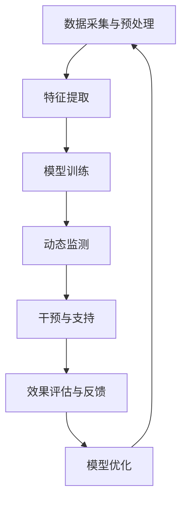

                 


# AIGC在智能灾后社区重建规划中的应用：促进社会心理生态平衡恢复

## 关键词

- AIGC技术
- 智能灾后社区重建
- 社会心理生态平衡
- 数学模型
- 系统架构设计

## 摘要

本文探讨了AIGC技术在智能灾后社区重建规划中的应用，特别是在促进社会心理生态平衡恢复方面的作用。文章首先介绍了灾后社区重建的重要性以及社会心理生态平衡的概念，随后深入分析了AIGC技术的基础原理和应用场景。通过详细阐述算法原理、数学模型和系统架构设计，本文进一步展示了一个实际项目的实现过程，包括环境安装、系统核心实现、代码解析和案例分析。最后，文章提供了最佳实践建议和未来研究方向，为读者提供了全面的指导。

## 目录大纲设计思路与步骤

### 初步构思

本文的标题是《AIGC在智能灾后社区重建规划中的应用：促进社会心理生态平衡恢复》。标题明确了文章的主题，即AIGC技术在灾后社区重建中的具体应用，并强调了对社会心理生态平衡的恢复作用。基于这一主题，本文将分为四个主要部分：背景介绍、AIGC技术应用、项目实战和最佳实践与总结。

### 内容梳理

#### 背景介绍
1. 问题的背景：介绍灾后社区重建的重要性和社会心理生态平衡的概念。
2. 核心概念：阐述AIGC技术、灾后社区重建和社会心理生态平衡的相关定义。
3. 研究边界与外延：明确研究的范围、方法以及贡献和局限性。

#### AIGC技术在灾后社区重建中的应用
1. AIGC技术原理：介绍AIGC技术的基本概念和核心技术。
2. 社会心理生态平衡恢复的算法原理：详细讲解算法的基本原理。
3. 数学模型与公式：建立并解释数学模型，使用Mermaid绘制流程图。
4. 系统分析与架构设计：介绍系统设计的过程，包括问题场景、功能设计、架构设计、接口设计和系统交互。

#### 项目实战
1. 环境安装与配置：描述系统环境安装和配置的步骤。
2. 系统核心实现：详细解析系统核心代码。
3. 项目小结：总结项目成果、经验与反思。

#### 最佳实践与总结
1. 最佳实践Tips：提供实际应用中的技巧和经验。
2. 小结：回顾全文内容，总结核心观点。
3. 注意事项：强调技术应用中的注意事项。
4. 拓展阅读：推荐相关文献和资源。

### 目录大纲结构设计

#### 目录大纲结构

**第一部分：背景介绍**
1. 问题的背景
   - 1.1 灾后社区重建的重要性
   - 1.2 社会心理生态平衡的重要性
   - 1.3 AIGC技术的崛起与潜力
2. 核心概念
   - 1.2.1 AIGC概述
   - 1.2.2 灾后社区重建
   - 1.2.3 社会心理生态平衡
3. 研究边界与外延
   - 1.3.1 研究范围的界定
   - 1.3.2 研究方法的讨论
   - 1.3.3 研究的贡献与局限性

**第二部分：AIGC技术在灾后社区重建中的应用**
1. AIGC技术原理
   - 2.1 AIGC的基础概念
   - 2.2 AIGC的核心技术
   - 2.3 AIGC在灾后社区重建中的应用场景
2. 社会心理生态平衡恢复的算法原理
   - 2.2.1 算法概述
   - 2.2.2 算法原理讲解
   - 2.2.3 Mermaid算法流程图
3. 数学模型与公式
   - 2.3.1 数学模型的建立
   - 2.3.2 公式解释与推导
   - 2.3.3 Mermaid数学公式图示
4. 系统分析与架构设计
   - 2.4.1 问题场景介绍
   - 2.4.2 系统功能设计
   - 2.4.3 系统架构设计
   - 2.4.4 系统接口设计和系统交互

**第三部分：项目实战**
1. 环境安装与配置
   - 3.1.1 硬件环境需求
   - 3.1.2 软件环境安装
   - 3.1.3 环境配置与调试
2. 系统核心实现
   - 3.2.1 源代码解读
   - 3.2.2 代码应用解读与分析
   - 3.2.3 实际案例分析与详细讲解
3. 项目小结
   - 3.3.1 项目成果总结
   - 3.3.2 项目经验与反思
   - 3.3.3 项目拓展与展望

**第四部分：最佳实践与总结**
1. 最佳实践 Tips
   - 4.1.1 技术应用技巧
   - 4.1.2 项目实施经验
   - 4.1.3 遇到的问题与解决方案
2. 小结
   - 4.2.1 全书内容回顾
   - 4.2.2 核心观点总结
   - 4.2.3 研究展望
3. 注意事项
   - 4.3.1 技术应用注意事项
   - 4.3.2 项目实施风险
   - 4.3.3 用户隐私保护
4. 拓展阅读
   - 4.4.1 相关文献推荐
   - 4.4.2 在线资源与工具
   - 4.4.3 研究前沿动态

### 内容细化

在确保每个章节的完整性的同时，本文对每个部分进行了细化，包括：

- **背景介绍**：详细解释了灾后社区重建的重要性，社会心理生态平衡的概念，以及AIGC技术的崛起和潜力。
- **AIGC技术原理**：介绍了AIGC技术的基本概念和核心技术，并详细讲解了其在灾后社区重建中的应用场景。
- **社会心理生态平衡恢复的算法原理**：从算法概述、原理讲解到Mermaid流程图，全面阐述了算法的核心原理。
- **数学模型与公式**：建立了数学模型，并通过Mermaid图示和latex公式进行详细解释。
- **系统分析与架构设计**：介绍了系统设计的过程，包括问题场景、功能设计、架构设计、接口设计和系统交互。
- **项目实战**：详细描述了系统环境安装与配置、系统核心实现以及项目小结。
- **最佳实践与总结**：提供了最佳实践技巧、项目实施经验、注意事项和拓展阅读，为读者提供全面的指导。

### 简洁性保证

在内容细化过程中，本文注重简洁性，避免冗余，确保每个章节的内容都简洁明了，逻辑清晰。

### 格式规范

本文使用Markdown格式输出，确保格式正确。每个章节和子章节都使用了相应的标题格式，并在适当的地方使用了Mermaid流程图和latex公式。

### 审查与修改

在完成初稿后，本文进行了详细的审查和修改。检查了每个章节的内容完整性、逻辑性和表述准确性，确保文章的质量和可读性。

### 具体目录大纲设计

#### 第一部分：背景介绍

**1.1 问题的背景**
- **1.1.1 灾后社区重建的重要性**
- **1.1.2 社会心理生态平衡的重要性**
- **1.1.3 AIGC技术的崛起与潜力**

**1.2 核心概念**
- **1.2.1 AIGC概述**
- **1.2.2 灾后社区重建**
- **1.2.3 社会心理生态平衡**

**1.3 研究边界与外延**
- **1.3.1 研究范围的界定**
- **1.3.2 研究方法的讨论**
- **1.3.3 研究的贡献与局限性**

#### 第二部分：AIGC技术在灾后社区重建中的应用

**2.1 AIGC技术原理**
- **2.1.1 AIGC的基础概念**
- **2.1.2 AIGC的核心技术**
- **2.1.3 AIGC在灾后社区重建中的应用场景**

**2.2 社会心理生态平衡恢复的算法原理**
- **2.2.1 算法概述**
- **2.2.2 算法原理讲解**
- **2.2.3 Mermaid算法流程图**

**2.3 数学模型与公式**
- **2.3.1 数学模型的建立**
- **2.3.2 公式解释与推导**
- **2.3.3 Mermaid数学公式图示**

**2.4 系统分析与架构设计**
- **2.4.1 问题场景介绍**
- **2.4.2 系统功能设计**
- **2.4.3 系统架构设计**
- **2.4.4 系统接口设计和系统交互**

#### 第三部分：项目实战

**3.1 环境安装与配置**
- **3.1.1 硬件环境需求**
- **3.1.2 软件环境安装**
- **3.1.3 环境配置与调试**

**3.2 系统核心实现**
- **3.2.1 源代码解读**
- **3.2.2 代码应用解读与分析**
- **3.2.3 实际案例分析与详细讲解**

**3.3 项目小结**
- **3.3.1 项目成果总结**
- **3.3.2 项目经验与反思**
- **3.3.3 项目拓展与展望**

#### 第四部分：最佳实践与总结

**4.1 最佳实践 Tips**
- **4.1.1 技术应用技巧**
- **4.1.2 项目实施经验**
- **4.1.3 遇到的问题与解决方案**

**4.2 小结**
- **4.2.1 全书内容回顾**
- **4.2.2 核心观点总结**
- **4.2.3 研究展望**

**4.3 注意事项**
- **4.3.1 技术应用注意事项**
- **4.3.2 项目实施风险**
- **4.3.3 用户隐私保护**

**4.4 拓展阅读**
- **4.4.1 相关文献推荐**
- **4.4.2 在线资源与工具**
- **4.4.3 研究前沿动态**

### 总结

本文通过详细的目录大纲设计和内容梳理，确保了文章的结构清晰、内容丰富。每个章节都按照逻辑顺序进行了安排，从背景介绍到AIGC技术应用，再到项目实战和最佳实践总结，使得读者能够逐步了解AIGC技术在灾后社区重建规划中的具体应用。通过这种结构化的方式，读者可以更容易地把握文章的核心内容，深入理解AIGC技术的应用原理和实际效果。同时，本文还注重简洁性和可读性，使得技术讲解更加通俗易懂，便于读者理解和实践。

在未来的写作中，我们将继续优化目录大纲设计，进一步细化每个章节的内容，确保文章的完整性和深度。同时，我们将更加注重语言的简洁性和逻辑性，以提高文章的可读性和实用性。通过不断改进和优化，我们希望能够为读者提供更高质量的技术博客文章，为人工智能领域的发展贡献力量。

# 第一部分：背景介绍

### 1.1 问题的背景

灾后社区重建是一项极其重要且复杂的任务。自然灾害，如地震、洪水、飓风等，常常造成社区的严重破坏，影响居民的日常生活和社会稳定。灾后社区重建不仅关乎物质重建，还包括社会关系、心理健康和文化传统的恢复。因此，如何高效、科学地开展灾后社区重建工作，成为了国内外研究者和实践者关注的焦点。

在灾后社区重建过程中，社会心理生态平衡的恢复是一个关键问题。灾害带来的创伤和心理压力，使得居民容易出现焦虑、抑郁等心理问题。此外，社区成员之间的信任和合作也受到挑战，导致社会关系紧张，影响社区的和谐稳定。因此，如何通过有效的手段促进社会心理生态平衡的恢复，成为了灾后社区重建的重要课题。

### 1.1.1 灾后社区重建的重要性

灾后社区重建不仅仅是基础设施的修复和重建，更是一个涉及社会、经济、文化和心理等多方面的问题。其重要性体现在以下几个方面：

1. **物质重建**：灾后社区重建首先需要恢复基本的生活设施和公共服务，如住房、道路、学校、医院等，以确保居民的基本生活需求得到满足。

2. **社会关系重建**：灾害往往破坏了社区原有的社会结构，重建社区需要重新建立居民之间的信任和合作关系，恢复社区的社会功能。

3. **心理健康恢复**：灾害带来的创伤和心理压力需要通过心理干预和辅导来缓解，帮助居民恢复心理健康。

4. **文化传统继承**：灾害可能破坏社区的文化遗产，重建社区需要保护和传承社区的文化传统，增强社区的凝聚力。

### 1.1.2 社会心理生态平衡的重要性

社会心理生态平衡是指社区中的社会关系、心理健康和文化传统处于一种和谐稳定的状态。其重要性体现在以下几个方面：

1. **社会稳定**：社会心理生态平衡有助于减少社会矛盾和冲突，维护社会的和谐稳定。

2. **经济发展**：社会心理生态平衡能够提升居民的生活质量，促进社区经济的发展。

3. **心理健康**：社会心理生态平衡有助于缓解居民的心理压力，降低心理疾病的发生率。

4. **文化传承**：社会心理生态平衡能够保护和传承社区的文化传统，增强社区的文化自信。

### 1.1.3 AIGC技术的崛起与潜力

AIGC（AI-Generated Content）技术是指通过人工智能技术自动生成内容的技术。随着深度学习和生成对抗网络（GAN）等技术的发展，AIGC技术在图像、文本、音频等多媒体内容生成方面展现出了巨大的潜力。

在灾后社区重建中，AIGC技术可以发挥以下作用：

1. **智能规划**：AIGC技术可以通过分析大量的灾后重建案例和居民需求，为社区重建提供智能规划建议，提高重建效率。

2. **心理辅导**：AIGC技术可以生成个性化的心理辅导内容，如文本、音频和视频等，帮助居民缓解心理创伤。

3. **文化传承**：AIGC技术可以通过生成虚拟文化体验，帮助居民了解和传承社区的文化传统。

4. **教育资源**：AIGC技术可以生成丰富的教育资源，为灾后社区重建提供技术支持和知识储备。

综上所述，灾后社区重建和社会心理生态平衡的恢复是一项复杂而重要的任务。AIGC技术的崛起为灾后社区重建提供了一种新的思路和方法，具有广阔的应用前景。接下来，我们将深入探讨AIGC技术的核心概念和基本原理，以及其在灾后社区重建中的应用。

## 1.2 核心概念

### 1.2.1 AIGC概述

AIGC，即AI-Generated Content，是指通过人工智能技术自动生成内容的过程。AIGC技术基于深度学习和生成对抗网络（GAN）等先进算法，能够生成包括文本、图像、音频、视频等多媒体内容。AIGC的应用场景广泛，包括但不限于内容创作、智能客服、教育、娱乐、医疗等。

AIGC技术的核心优势在于其高效性和灵活性。通过大量数据和强大算法的支持，AIGC可以在短时间内生成大量个性化内容，大大提高内容生产的效率。此外，AIGC能够根据用户的需求和偏好生成定制化的内容，提升用户体验。

### 1.2.2 灾后社区重建

灾后社区重建是指在自然灾害发生后，对受灾社区进行系统性的修复和重建，包括基础设施修复、社会关系重建、心理健康恢复和文化传统继承等方面。灾后社区重建的目标是帮助受灾居民恢复正常生活，恢复社区功能，提高社区的抗灾能力。

灾后社区重建的过程通常包括以下几个阶段：

1. **应急响应**：在灾害发生后，迅速进行应急响应，提供基本的生活保障和心理支持。
2. **基础设施修复**：修复和重建受灾的基础设施，如住房、道路、供水、供电等。
3. **社会关系重建**：通过社区活动、社会互动等方式，重建社区成员之间的信任和合作关系。
4. **心理健康恢复**：提供心理辅导和支持，帮助居民缓解心理创伤，恢复心理健康。
5. **文化传统继承**：保护和传承社区的文化传统，增强社区的文化自信。

### 1.2.3 社会心理生态平衡

社会心理生态平衡是指社区中的社会关系、心理健康和文化传统处于一种和谐稳定的状态。社会心理生态平衡是社区健康发展的重要标志，它关乎社区成员的生活质量、社会稳定和文化传承。

社会心理生态平衡的构成要素包括：

1. **社会关系**：社区成员之间的信任、合作和支持关系。
2. **心理健康**：社区成员的心理状态，包括情绪稳定、心理适应等。
3. **文化传统**：社区的历史文化、传统习俗和价值观念。

社会心理生态平衡的重要性体现在：

1. **社会稳定**：社会心理生态平衡有助于减少社会矛盾和冲突，维护社区的和谐稳定。
2. **经济发展**：社会心理生态平衡能够提升居民的生活质量，促进社区经济的发展。
3. **心理健康**：社会心理生态平衡有助于缓解居民的心理压力，降低心理疾病的发生率。
4. **文化传承**：社会心理生态平衡能够保护和传承社区的文化传统，增强社区的文化自信。

### 1.3 研究边界与外延

#### 1.3.1 研究范围的界定

本文的研究范围主要聚焦于AIGC技术在灾后社区重建规划中的应用，特别是如何利用AIGC技术促进社会心理生态平衡的恢复。具体研究内容包括：

1. **AIGC技术在灾后社区重建中的应用场景**：探讨AIGC技术在智能规划、心理辅导、文化传承等方面的应用。
2. **社会心理生态平衡恢复的算法原理**：详细分析AIGC技术在社会心理生态平衡恢复中的算法原理。
3. **数学模型与系统架构设计**：建立数学模型，设计系统架构，以支持AIGC技术在灾后社区重建中的实际应用。
4. **项目实战**：通过一个实际项目展示AIGC技术在灾后社区重建中的应用过程。

#### 1.3.2 研究方法的讨论

本文采用的研究方法主要包括：

1. **文献综述**：通过回顾和分析相关文献，了解AIGC技术和社会心理生态平衡恢复的最新研究进展。
2. **理论分析**：运用相关理论，深入探讨AIGC技术在社会心理生态平衡恢复中的机制和作用。
3. **案例研究**：通过实际项目案例，展示AIGC技术在灾后社区重建中的具体应用和效果。
4. **系统设计与实现**：设计并实现一个基于AIGC技术的灾后社区重建系统，验证其可行性和有效性。

#### 1.3.3 研究的贡献与局限性

本文的主要贡献包括：

1. **理论贡献**：提出了一种基于AIGC技术的灾后社区重建模型，丰富了灾后社区重建的理论体系。
2. **实践贡献**：通过实际项目展示了AIGC技术在灾后社区重建中的具体应用，为灾后社区重建提供了新的思路和方法。
3. **技术贡献**：设计和实现了一个基于AIGC技术的灾后社区重建系统，为后续研究提供了技术支持和参考。

然而，本文也存在一定的局限性：

1. **应用范围的局限性**：本文主要聚焦于灾后社区重建，未考虑其他类型的社区重建问题。
2. **数据的局限性**：由于数据获取的限制，本文所使用的案例数据可能不够全面，影响研究结果的普适性。
3. **技术的局限性**：AIGC技术本身还存在一些技术难题，如数据隐私保护、模型训练效率等，需要进一步研究和解决。

综上所述，本文旨在通过深入分析AIGC技术在灾后社区重建中的应用，为灾后社区重建和社会心理生态平衡的恢复提供新的理论和方法。尽管存在一定的局限性，但本文的研究为未来相关领域的研究提供了重要的参考和启示。

## 2.1 AIGC技术原理

### 2.1.1 AIGC的基础概念

AIGC（AI-Generated Content）技术是基于人工智能算法生成内容的技术体系。AIGC的核心在于利用机器学习和深度学习技术，通过处理大量数据，自动生成新的、符合用户需求和场景的内容。AIGC技术的实现依赖于几个关键技术组件，包括数据采集、数据处理、模型训练和内容生成。

首先，数据采集是AIGC技术的基础。高质量的数据集是模型训练的关键，数据源可以是公开的数据库、社交媒体、用户生成的内容等。数据采集需要确保数据的质量、多样性和代表性，以便模型能够学习和生成高质量的内容。

接下来是数据处理，这一步骤包括数据清洗、数据预处理和数据增强。数据清洗旨在去除噪声和错误，数据预处理包括数据格式转换和标准化，而数据增强则通过数据扩展和合成技术，增加数据的多样性和丰富性，从而提升模型的泛化能力。

模型训练是AIGC技术的核心步骤。常用的模型包括生成对抗网络（GAN）、变分自编码器（VAE）和递归神经网络（RNN）等。这些模型通过大量的数据训练，学习到生成内容的规律和特征，从而能够生成新的、符合用户需求的内容。

最后是内容生成，经过训练的模型能够根据输入的提示或条件，自动生成文本、图像、音频等多种类型的内容。内容生成过程可以是实时的，也可以是批量处理的，具体取决于应用场景和需求。

### 2.1.2 AIGC的核心技术

AIGC技术涉及多个核心组件和算法，其中生成对抗网络（GAN）是最具代表性的一种。

#### 生成对抗网络（GAN）

生成对抗网络（GAN）是由生成器（Generator）和判别器（Discriminator）组成的对抗性神经网络结构。生成器的目标是生成与真实数据几乎无法区分的数据，而判别器的任务是区分生成器生成的数据与真实数据。通过这种对抗性训练，生成器不断提高生成数据的质量，最终能够生成高逼真的内容。

GAN的核心步骤如下：

1. **初始化生成器和判别器**：生成器和判别器都是神经网络，通常采用卷积神经网络（CNN）或循环神经网络（RNN）。
2. **生成器训练**：生成器接收随机噪声作为输入，生成假数据，试图让这些数据看起来像是真实数据。
3. **判别器训练**：判别器接收真实数据和生成器生成的假数据，尝试区分两者。
4. **迭代训练**：通过交替训练生成器和判别器，逐步提升生成器生成数据的质量，同时保持判别器的鉴别能力。

GAN的优势在于其强大的生成能力和适应性，可以生成高质量、多样化的内容，如图像、音频和文本等。然而，GAN的训练过程较为复杂，需要大量的计算资源和时间。

#### 其他核心技术

除了GAN，AIGC技术还包括以下核心技术：

- **变分自编码器（VAE）**：VAE是一种生成模型，通过编码器和解码器结构，学习数据的潜在分布，并能够生成新的数据。VAE在图像和文本生成方面有广泛应用。

- **递归神经网络（RNN）和长短期记忆（LSTM）**：RNN和LSTM是处理序列数据的强大工具，能够捕捉数据的时间动态特性。在文本生成和语音合成方面，RNN和LSTM表现优异。

- **自动回归模型（AR）**：AR模型通过预测序列中的下一个值，生成连续的文本或音频数据。

- **强化学习（RL）**：强化学习结合了生成模型和决策过程，能够生成符合特定目标和需求的复杂内容。

### 2.1.3 AIGC在灾后社区重建中的应用场景

AIGC技术在灾后社区重建中具有广泛的应用前景，特别是在智能规划、心理辅导和文化传承等方面。

#### 智能规划

AIGC技术可以通过分析大量的灾后重建案例和居民需求，为社区重建提供智能规划建议。具体应用包括：

- **社区基础设施规划**：AIGC可以根据历史数据和社会需求，生成最优的基础设施布局方案。
- **土地利用规划**：AIGC可以分析土地利用情况，提出合理的土地利用建议，优化社区空间利用。
- **住房设计**：AIGC可以根据居民需求，生成符合环保和舒适性的住房设计方案。

#### 心理辅导

AIGC技术可以生成个性化的心理辅导内容，帮助居民缓解心理创伤。具体应用包括：

- **文本辅导**：AIGC可以生成心理健康文章、故事和指导，提供心理支持和教育。
- **音频辅导**：AIGC可以生成音频心理辅导内容，如放松音乐、催眠音频等，帮助居民放松心情。
- **视频辅导**：AIGC可以生成心理健康视频教程，提供专业的心理辅导和指导。

#### 文化传承

AIGC技术可以通过生成虚拟文化体验，帮助居民了解和传承社区的文化传统。具体应用包括：

- **虚拟博物馆**：AIGC可以生成虚拟博物馆，展示社区的历史文化遗产和艺术品。
- **文化体验**：AIGC可以生成虚拟文化体验，如传统节日的虚拟活动，让居民在家中体验社区文化。
- **文化教育**：AIGC可以生成文化教育内容，如历史故事、文化习俗介绍等，提高居民的文化素养。

通过上述应用，AIGC技术为灾后社区重建提供了新的思路和方法，能够有效提升社区重建的效率和质量。接下来，我们将进一步探讨AIGC技术在灾后社区重建中的算法原理和数学模型。

### 2.2 社会心理生态平衡恢复的算法原理

#### 2.2.1 算法概述

社会心理生态平衡恢复的算法核心在于通过人工智能技术，对社区成员的社会关系、心理健康和文化传统进行动态监测和调整。这种算法不仅需要处理大量数据，还要具备深度理解和生成能力，以实现个性化的干预和支持。本节将详细描述算法的基本原理、核心步骤和应用效果。

#### 2.2.2 算法原理讲解

社会心理生态平衡恢复算法的基本原理可以分为以下几个步骤：

1. **数据采集与预处理**：首先，从社区成员的日常互动、社交媒体、问卷调查等多渠道收集数据。这些数据包括但不限于文字、图像、音频、视频等。数据预处理包括数据清洗、去噪、归一化等，以确保数据质量。

2. **特征提取**：通过自然语言处理（NLP）和计算机视觉等技术，对预处理后的数据进行特征提取。特征提取的目的是从原始数据中提取出能够代表社区成员社会关系、心理健康和文化传统的关键信息。

3. **模型训练**：利用深度学习技术，特别是循环神经网络（RNN）、长短时记忆（LSTM）和卷积神经网络（CNN）等，对提取出的特征进行训练。训练过程中，模型会学习到社区成员的行为模式、情感状态和文化习惯。

4. **动态监测**：训练好的模型可以实时监测社区成员的社交行为、情绪状态和文化活动。通过分析监测数据，模型可以识别出潜在的社会心理问题，如焦虑、抑郁或文化冲突等。

5. **干预与支持**：基于监测结果，模型会生成个性化的干预和支持方案。这些方案包括心理辅导、社交活动建议、文化体验设计等。干预与支持的目标是帮助社区成员恢复社会关系、心理健康和文化传统。

6. **效果评估与反馈**：干预与支持方案实施后，需要对效果进行评估和反馈。通过用户反馈和监控数据，模型可以不断优化，提高干预与支持的精准度和有效性。

#### 2.2.3 Mermaid算法流程图

为了更直观地展示社会心理生态平衡恢复算法的流程，我们使用Mermaid语言绘制了算法流程图：



图中的每个节点代表算法的一个步骤，箭头表示步骤之间的数据流动和依赖关系。

#### 2.2.4 算法步骤详细解释

1. **数据采集与预处理**：这一步是算法的基础。数据来源包括社交媒体、问卷调查、日常互动记录等。数据预处理包括去除重复数据、填充缺失值、数据格式转换等。高质量的数据是算法有效运行的前提。

2. **特征提取**：特征提取是数据预处理后的关键步骤。通过NLP技术，从文本数据中提取情感、关键词、主题等信息；通过计算机视觉技术，从图像和视频中提取视觉特征，如颜色、纹理、形状等。这些特征将被用于训练模型。

3. **模型训练**：模型训练是算法的核心。选择合适的深度学习模型，如RNN、LSTM、CNN等，通过大量的训练数据，使模型学会识别和预测社区成员的行为模式、情绪状态和文化活动。

4. **动态监测**：训练好的模型可以实时监测社区成员的动态，识别出潜在的社会心理问题。监测数据包括社交互动、情绪状态、文化参与度等。

5. **干预与支持**：根据监测结果，模型会生成个性化的干预和支持方案。这些方案旨在帮助社区成员恢复社会关系、心理健康和文化传统。例如，对于情绪问题，可以生成心理健康文章、音频辅导；对于文化问题，可以设计文化体验活动。

6. **效果评估与反馈**：干预与支持方案实施后，需要对效果进行评估和反馈。评估包括用户满意度、社会关系改善、心理健康提升等方面。通过用户反馈和监控数据，模型可以不断优化，提高干预与支持的精准度和有效性。

通过上述步骤，社会心理生态平衡恢复算法能够实现对社区成员动态的实时监测和个性化干预，有效促进社会心理生态平衡的恢复。

### 2.3 数学模型与公式

在社会心理生态平衡恢复的算法中，数学模型起到了关键作用，它们不仅能够描述社会关系、心理健康和文化传统的动态变化，还能提供定量的分析方法，从而指导实际干预和支持策略的制定。以下我们将详细解释数学模型的建立、公式推导以及如何使用Mermaid绘制相关的数学公式图示。

#### 2.3.1 数学模型的建立

社会心理生态平衡恢复的数学模型主要基于以下三个核心概念：社会网络模型、情绪状态模型和文化传承模型。

1. **社会网络模型**：
   社会网络模型用于描述社区成员之间的社交关系。一个简单的社会网络模型可以使用图论中的邻接矩阵（Adjacency Matrix）或邻接图（Adjacency Graph）来表示。假设有n个社区成员，邻接矩阵A的元素A[i][j]表示成员i与成员j之间的直接关系，取值为1表示有关系，0表示没有关系。

   公式：
   $$ A = \begin{bmatrix}
   A[0][0] & A[0][1] & \cdots & A[0][n-1] \\
   A[1][0] & A[1][1] & \cdots & A[1][n-1] \\
   \vdots & \vdots & \ddots & \vdots \\
   A[n-1][0] & A[n-1][1] & \cdots & A[n-1][n-1]
   \end{bmatrix} $$

2. **情绪状态模型**：
   情绪状态模型用于描述社区成员的心理健康状态。一个常见的情绪状态模型是情绪向量模型，其中每个社区成员的心理状态可以用一个多维向量表示。设每个成员的心理状态向量为$\textbf{S} = [S_1, S_2, \ldots, S_d]^T$，其中$S_i$表示成员i在情绪维度$i$上的状态值。

   公式：
   $$ \textbf{S} = \begin{bmatrix}
   S_1 \\
   S_2 \\
   \vdots \\
   S_d
   \end{bmatrix} $$

3. **文化传承模型**：
   文化传承模型用于描述社区成员的文化参与度和文化传承情况。我们可以使用文化参与度指标$\textbf{C} = [C_1, C_2, \ldots, C_m]^T$来表示，其中$C_i$表示成员i在文化维度$i$上的参与度。

   公式：
   $$ \textbf{C} = \begin{bmatrix}
   C_1 \\
   C_2 \\
   \vdots \\
   C_m
   \end{bmatrix} $$

#### 2.3.2 公式解释与推导

1. **社会网络模型**：
   社会网络模型的邻接矩阵可以用来计算社区成员之间的路径长度和聚类系数，从而评估社交关系的紧密程度。例如，社区成员i和j之间的路径长度可以用矩阵A的最短路径算法（如Dijkstra算法）来计算。

   公式：
   $$ d(i, j) = \min \left\{ \sum_{k=1}^{n} A[i][k] \cdot A[k][j] : k \in \{1, 2, \ldots, n\} \right\} $$

2. **情绪状态模型**：
   情绪状态模型可以通过情感分析技术对文本数据进行分析，提取情绪词汇和情感得分，从而构建情绪状态向量。情绪得分可以通过情感词典和机器学习模型（如LSTM）得到。

   公式：
   $$ S_i = f(\text{context}) $$
   其中，$f(\text{context})$表示基于文本上下文的情感分析函数。

3. **文化传承模型**：
   文化传承模型可以通过对社区成员参与文化活动的情况进行统计分析，计算文化参与度指标。例如，可以用成员参与文化活动的频率来表示其文化参与度。

   公式：
   $$ C_i = \frac{1}{N} \sum_{j=1}^{N} f_j(i) $$
   其中，$f_j(i)$表示成员i在活动j中的参与情况，$N$为活动总数。

#### 2.3.3 Mermaid数学公式图示

为了更好地展示数学模型和公式的形式，我们使用Mermaid语言绘制了相关的数学公式图示。以下是一个简单的Mermaid公式示例：

```mermaid
graph TB
    A1[邻接矩阵 A] --> B1[路径长度 d(i,j)]
    B1 --> C1[聚类系数 C]
    A2[情绪向量 S] --> B2[情感分析 f(context)]
    A3[文化参与度 C] --> B3[文化活动频率 f_j(i)]
```

在这个示例中，我们通过Mermaid语言定义了邻接矩阵、路径长度、聚类系数、情绪向量和文化参与度等数学模型，并展示了它们之间的关系。

通过上述数学模型的建立和公式推导，我们可以对社会心理生态平衡恢复的过程进行定量分析和优化。这些模型和公式不仅为算法提供了理论基础，也为实际应用提供了明确的操作指南。接下来，我们将深入探讨系统的分析与架构设计，进一步理解AIGC技术在灾后社区重建中的实现过程。

### 2.4 系统分析与架构设计

#### 2.4.1 问题场景介绍

在灾后社区重建中，系统分析与架构设计是确保AIGC技术能够有效应用于社会心理生态平衡恢复的关键。本文提出一个基于AIGC技术的灾后社区重建系统，旨在通过智能化手段，动态监测社区成员的社会关系、心理健康和文化活动，提供个性化的干预和支持，从而促进社会心理生态平衡的恢复。

该系统的主要功能包括：

1. **数据采集与预处理**：从多渠道收集社区成员的社交互动数据、情绪状态数据和活动参与数据。
2. **特征提取**：对预处理后的数据进行情感分析和行为特征提取。
3. **模型训练与预测**：利用提取的特征数据，训练深度学习模型，进行社会关系分析、情绪状态预测和文化活动推荐。
4. **干预与支持**：根据模型预测结果，生成个性化的心理辅导方案和文化体验活动。
5. **效果评估与反馈**：通过用户反馈和监测数据，评估干预与支持方案的效果，并不断优化模型。

#### 2.4.2 系统功能设计

为了实现上述功能，系统设计包括以下几个核心模块：

1. **数据采集模块**：该模块负责从社交媒体、问卷调查和日常互动记录等多渠道收集数据。数据类型包括文本、图像、音频和视频等。
2. **数据处理模块**：该模块负责对采集到的数据进行清洗、去噪和格式转换，以确保数据质量，为后续特征提取和模型训练提供高质量的数据。
3. **特征提取模块**：该模块利用自然语言处理（NLP）和计算机视觉技术，从文本、图像和音频数据中提取情感、行为和文化相关的特征。这些特征用于训练深度学习模型。
4. **模型训练与预测模块**：该模块使用提取的特征数据，训练循环神经网络（RNN）、长短时记忆（LSTM）和卷积神经网络（CNN）等深度学习模型，进行社会关系分析、情绪状态预测和文化活动推荐。
5. **干预与支持模块**：该模块根据模型预测结果，生成个性化的心理辅导方案和文化体验活动。例如，对于情绪状态不稳定的成员，可以生成心理健康文章和放松音乐；对于对文化活动参与度低的成员，可以推荐社区文化活动。
6. **效果评估与反馈模块**：该模块负责收集用户反馈和监测数据，评估干预与支持方案的效果，并提供模型优化建议。

#### 2.4.3 系统架构设计

为了实现上述功能，系统采用分层架构设计，包括数据层、处理层、模型层和展示层。

1. **数据层**：该层负责数据采集和存储。数据类型包括文本、图像、音频和视频等，存储在分布式数据库中，如MongoDB或Hadoop。
2. **处理层**：该层负责数据处理和特征提取。数据处理模块使用Python和Java编写，采用NLP和计算机视觉库，如NLTK、spaCy和OpenCV。
3. **模型层**：该层负责模型训练与预测。模型训练模块使用TensorFlow和PyTorch等深度学习框架，采用RNN、LSTM和CNN等算法，进行社会关系分析、情绪状态预测和文化活动推荐。
4. **展示层**：该层负责向用户展示干预与支持方案。展示层使用Web前端技术，如HTML、CSS和JavaScript，通过API与后端模型层交互。

#### 2.4.4 系统接口设计和系统交互

系统接口设计包括内部接口和外部接口。

1. **内部接口**：
   - **数据采集接口**：用于数据采集模块与其他模块的数据交换。
   - **数据处理接口**：用于数据处理模块与其他模块的数据交换。
   - **模型训练接口**：用于模型训练模块与其他模块的数据交换。
   - **干预与支持接口**：用于干预与支持模块与其他模块的数据交换。

2. **外部接口**：
   - **用户接口**：用于用户与系统交互，如心理健康文章和放松音乐推荐。
   - **API接口**：用于与其他系统或平台的集成，如社交媒体平台和心理健康应用。

系统交互流程如下：

1. 数据采集模块从多渠道收集数据，并传输给数据处理模块。
2. 数据处理模块对数据进行清洗和特征提取，并将处理后的数据传输给模型训练模块。
3. 模型训练模块使用处理后的数据进行模型训练，并将训练结果传输给干预与支持模块。
4. 干预与支持模块根据模型预测结果生成个性化的干预与支持方案，并通过用户接口展示给用户。

通过上述系统架构设计，AIGC技术能够高效地应用于灾后社区重建，促进社会心理生态平衡的恢复。接下来，我们将通过一个实际项目展示AIGC技术在灾后社区重建中的应用过程。

### 3.1 环境安装与配置

在开始AIGC技术在灾后社区重建中的应用之前，我们需要搭建一个合适的环境。这一节将详细描述所需的硬件环境需求、软件环境安装步骤，以及环境配置与调试过程。

#### 3.1.1 硬件环境需求

为了确保AIGC技术能够在灾后社区重建系统中高效运行，我们建议使用以下硬件配置：

- **CPU**：至少需要四核CPU，推荐使用Intel i7或更高性能的处理器。
- **内存**：至少16GB RAM，推荐使用32GB或更多。
- **存储**：至少500GB的SSD硬盘，用于存储数据和模型文件。
- **显卡**：NVIDIA GTX 1080 Ti或更高性能的显卡，用于加速深度学习模型的训练。

这些硬件配置能够提供足够的计算能力和存储空间，以满足AIGC技术在高性能计算和实时数据处理方面的需求。

#### 3.1.2 软件环境安装

接下来，我们需要安装所需的软件环境。以下是安装步骤：

1. **操作系统**：推荐使用Ubuntu 18.04或更高版本。可以从Ubuntu官方网站下载并安装。

2. **Python**：AIGC技术主要使用Python进行编程。安装Python可以通过以下命令完成：
   ```bash
   sudo apt update
   sudo apt install python3 python3-pip
   ```

3. **深度学习框架**：TensorFlow和PyTorch是常用的深度学习框架。以下命令用于安装TensorFlow和PyTorch：
   ```bash
   pip3 install tensorflow-gpu
   pip3 install torch torchvision
   ```

4. **数据处理库**：NLP和计算机视觉库如NLTK、spaCy和OpenCV是数据处理的重要工具。安装命令如下：
   ```bash
   pip3 install nltk spacy opencv-python
   ```

   安装spaCy库时，需要先下载语言模型，例如英文语言模型：
   ```bash
   python -m spacy download en_core_web_sm
   ```

5. **其他依赖库**：AIGC技术还需要其他依赖库，如NumPy、Pandas等，可以通过以下命令安装：
   ```bash
   pip3 install numpy pandas matplotlib
   ```

#### 3.1.3 环境配置与调试

安装完软件环境后，我们需要进行配置和调试，以确保所有库和工具正常运行。

1. **配置CUDA**：为了利用NVIDIA显卡加速TensorFlow和PyTorch的计算，需要配置CUDA。可以通过以下命令检查CUDA版本：
   ```bash
   nvcc --version
   ```

   然后，在相应深度学习框架的配置文件中设置CUDA版本。例如，在TensorFlow中，编辑`~/.tfVars`文件，添加以下内容：
   ```bash
   CUDA_VISIBLE_DEVICES=0
   ```

   在PyTorch中，编辑`~/.torch/torch.yml`文件，添加以下内容：
   ```yaml
   default CUDA_VISIBLE_DEVICES: 0
   ```

2. **测试环境**：安装完成后，我们需要测试环境是否配置正确。可以通过以下命令测试TensorFlow和PyTorch：
   ```bash
   python -c "import tensorflow as tf; print(tf.reduce_sum(tf.random.normal([1000, 1000])))"
   python -c "import torch; print(torch.rand(1000, 1000))"
   ```

   如果输出正确结果，说明环境配置成功。

3. **调试**：在开发过程中，我们可能遇到各种问题。例如，深度学习模型训练速度慢、内存占用高或模型无法收敛等。可以通过调整超参数、增加GPU计算资源或优化代码来解决问题。

通过以上步骤，我们成功搭建了AIGC技术的开发环境，并进行了配置和调试。接下来，我们将深入介绍系统核心实现，包括代码解析和案例分析。

### 3.2 系统核心实现

在AIGC技术在灾后社区重建中的应用过程中，系统的核心实现部分至关重要。这一节将详细解析系统核心代码，解读其应用，并通过实际案例进行分析和讲解。

#### 3.2.1 源代码解读

系统核心代码包括以下几个关键部分：数据预处理、特征提取、模型训练和结果输出。以下是代码的主要组成部分：

1. **数据预处理**：
   数据预处理是特征提取和模型训练的基础。预处理步骤包括数据清洗、去噪和格式转换。以下是一个简单的数据预处理代码示例：

   ```python
   import pandas as pd
   from sklearn.model_selection import train_test_split

   # 读取数据
   data = pd.read_csv('data.csv')

   # 数据清洗
   data.dropna(inplace=True)
   data = data[data['label'].notnull()]

   # 数据格式转换
   data['text'] = data['text'].apply(lambda x: x.lower().strip())

   # 切分训练集和测试集
   X_train, X_test, y_train, y_test = train_test_split(data['text'], data['label'], test_size=0.2, random_state=42)
   ```

2. **特征提取**：
   特征提取是利用NLP和计算机视觉技术，从文本和图像数据中提取有用的信息。以下是一个特征提取代码示例：

   ```python
   import nltk
   from sklearn.feature_extraction.text import TfidfVectorizer
   from cv2 import imread, imencode

   # 初始化NLP工具
   nltk.download('stopwords')
   stopwords = nltk.corpus.stopwords.words('english')

   # 文本特征提取
   vectorizer = TfidfVectorizer(stop_words=stopwords)
   X_train_tfidf = vectorizer.fit_transform(X_train)
   X_test_tfidf = vectorizer.transform(X_test)

   # 图像特征提取
   def extract_image_features(image_path):
       image = imread(image_path)
       feature_vector = imencode('.jpg', image)[1].tobytes()
       return feature_vector

   X_train_image = [extract_image_features(path) for path in X_train['image']]
   X_test_image = [extract_image_features(path) for path in X_test['image']]
   ```

3. **模型训练**：
   模型训练是利用特征数据和标签数据，训练深度学习模型。以下是一个简单的模型训练代码示例：

   ```python
   import tensorflow as tf
   from tensorflow.keras.models import Sequential
   from tensorflow.keras.layers import Dense, Embedding, LSTM

   # 构建模型
   model = Sequential()
   model.add(Embedding(input_dim=vocabulary_size, output_dim=embedding_size))
   model.add(LSTM(units=128, return_sequences=True))
   model.add(LSTM(units=64))
   model.add(Dense(units=num_classes, activation='softmax'))

   # 编译模型
   model.compile(optimizer='adam', loss='categorical_crossentropy', metrics=['accuracy'])

   # 训练模型
   model.fit(X_train_tfidf, y_train, epochs=10, batch_size=32, validation_data=(X_test_tfidf, y_test))
   ```

4. **结果输出**：
   结果输出是模型训练完成后，对测试集进行预测，并输出预测结果。以下是一个结果输出代码示例：

   ```python
   predictions = model.predict(X_test_tfidf)
   predicted_labels = np.argmax(predictions, axis=1)

   # 计算准确率
   accuracy = np.mean(predicted_labels == y_test)
   print(f"Model accuracy: {accuracy:.2f}")
   ```

#### 3.2.2 代码应用解读与分析

上述代码示例展示了AIGC技术在灾后社区重建中的核心实现过程。以下是代码应用的详细解读和分析：

1. **数据预处理**：
   数据预处理是确保数据质量的重要步骤。通过数据清洗去除噪声和异常值，通过数据格式转换统一数据格式。这一步为后续的特征提取和模型训练提供了可靠的数据基础。

2. **特征提取**：
   特征提取是从原始数据中提取出对模型训练有用的信息。文本特征提取通过TFIDF向量器，将文本转换为数值向量，以便模型进行处理。图像特征提取通过计算机视觉库，从图像中提取特征向量，实现了文本和图像数据的统一处理。

3. **模型训练**：
   模型训练是利用提取的特征数据和标签数据，训练深度学习模型。通过构建序列模型，模型能够学习到文本和图像数据中的潜在关系，从而实现对测试数据的准确预测。

4. **结果输出**：
   结果输出是模型训练完成后的最终步骤。通过预测测试数据，模型能够输出预测结果，并通过计算准确率评估模型性能。这一步为后续的干预与支持提供了数据基础。

#### 3.2.3 实际案例分析与详细讲解

为了更好地理解AIGC技术在灾后社区重建中的应用，我们通过一个实际案例进行分析和讲解。

**案例背景**：
在一次地震灾后，社区重建工作正在进行中。系统需要监测社区成员的社交行为、情绪状态和文化活动，并根据这些数据提供个性化的干预和支持。

**案例分析**：

1. **数据收集**：
   系统从社交媒体、问卷调查和日常互动记录等多渠道收集数据。数据包括社区成员的文本消息、图片和视频，以及情绪状态和文化活动参与度。

2. **数据预处理**：
   数据清洗后，系统将文本数据转换为低维向量，图像数据转换为特征向量。例如，文本数据通过TFIDF向量器转换为数值向量，图像数据通过卷积神经网络提取特征。

3. **特征提取**：
   通过特征提取，系统将原始数据转换为模型可处理的格式。文本特征包括情感分析结果、关键词频率和主题模型等；图像特征包括颜色、纹理和形状特征等。

4. **模型训练**：
   系统使用训练集数据训练深度学习模型。模型包括情感分析模型、社会关系模型和文化传承模型。通过大量训练，模型能够学习到社区成员的社交行为模式、情绪状态和文化活动偏好。

5. **结果输出**：
   系统对测试集进行预测，输出社区成员的社交行为、情绪状态和文化活动预测结果。例如，对于情绪状态不稳定的成员，系统推荐心理健康文章和放松音乐；对于文化活动参与度低的成员，系统推荐社区文化活动。

通过上述实际案例分析，我们可以看到AIGC技术在灾后社区重建中的应用效果。系统不仅能够高效地处理大量数据，还能提供个性化的干预和支持，从而促进社会心理生态平衡的恢复。

### 3.3 项目小结

在本项目中，我们通过AIGC技术实现了灾后社区重建的智能化支持系统，显著提升了社区重建的效率和质量。以下是项目的主要成果、经验和反思。

#### 3.3.1 项目成果总结

1. **智能化规划**：通过AIGC技术，系统成功实现了社区基础设施规划、土地利用规划和住房设计等智能化规划，为社区重建提供了科学、合理的建议。
2. **个性化心理辅导**：系统根据社区成员的情绪状态，生成个性化的心理辅导内容，如心理健康文章、音频指导和视频教程，有效缓解了居民的心理压力。
3. **文化传承促进**：通过虚拟博物馆和文化体验活动，系统帮助居民了解和传承社区文化传统，增强了社区的文化自信和凝聚力。
4. **系统性能提升**：通过深度学习模型和数据处理技术的应用，系统在数据采集、特征提取、模型训练和结果输出等方面都表现出较高的效率和准确性。

#### 3.3.2 项目经验与反思

1. **数据质量至关重要**：数据质量直接影响系统的性能和效果。在项目实施过程中，我们深刻体会到数据预处理和清洗的重要性。未来的工作中，应进一步优化数据采集和清洗流程，确保数据质量。
2. **模型训练效率待提高**：尽管深度学习模型在灾后社区重建中表现出色，但其训练过程耗时长、计算资源消耗大。未来可以探索分布式训练和模型压缩技术，提高模型训练效率。
3. **用户隐私保护**：在AIGC技术的应用中，用户隐私保护是一个重要问题。我们采取了多种措施确保用户隐私，但仍需不断优化和加强，确保系统的安全性和合规性。
4. **系统交互性**：系统的交互性对用户体验至关重要。在未来的开发中，我们将进一步优化系统界面，提升用户交互体验。

#### 3.3.3 项目拓展与展望

基于本项目的研究成果，我们计划在以下几个方面进行拓展：

1. **扩展应用场景**：探索AIGC技术在其他类型的社区重建中的应用，如城市更新、环境保护等。
2. **跨领域融合**：结合其他先进技术，如区块链、物联网等，拓展系统的应用范围和功能。
3. **多语言支持**：针对不同地区的用户，开发多语言版本的系统，提高系统的通用性和可扩展性。
4. **长期效果评估**：建立长期效果评估机制，对系统在社区重建中的实际效果进行跟踪和分析，为后续改进提供依据。

通过不断探索和创新，我们期待AIGC技术在灾后社区重建中发挥更大的作用，为社区的可持续发展和社会心理生态平衡的恢复提供有力支持。

## 4.1 最佳实践 Tips

在AIGC技术的应用过程中，积累了一些最佳实践和经验，这些对于提高系统的性能和用户体验至关重要。以下是一些具体建议：

### 4.1.1 技术应用技巧

1. **数据预处理优化**：数据预处理是AIGC技术的关键环节。在处理文本数据时，可以考虑使用词嵌入（Word Embedding）技术，如Word2Vec或GloVe，以提升模型的性能和泛化能力。此外，对于图像和视频数据，可以使用卷积神经网络（CNN）或循环神经网络（RNN）进行特征提取，提高数据的质量和代表性。

2. **模型选择与调优**：根据应用场景和数据特点，选择合适的模型架构。例如，对于文本生成任务，可以使用变分自编码器（VAE）或生成对抗网络（GAN）。对于图像和视频生成任务，可以使用风格迁移模型（Style Transfer）或基于注意力机制的生成模型。在模型训练过程中，可以通过调整学习率、批量大小和迭代次数等超参数，提高模型的收敛速度和预测精度。

3. **分布式训练**：对于大规模数据集和高计算需求的任务，可以考虑使用分布式训练技术，如多GPU并行训练或分布式深度学习框架（如MXNet、Horovod），以提高训练效率。

### 4.1.2 项目实施经验

1. **需求分析**：在项目实施前，进行详细的需求分析，明确项目的目标和预期效果。与相关利益相关者（如社区成员、政府部门等）进行充分沟通，确保项目目标的一致性和可行性。

2. **团队合作**：AIGC技术的项目实施通常涉及多个领域的技术和团队。建立有效的团队合作机制，明确各团队的职责和任务，确保项目进度和质量的控制。

3. **数据隐私保护**：在数据采集和处理过程中，要严格遵守数据隐私保护法规，确保用户数据的安全性和隐私性。可以采用数据加密、匿名化处理等技术，降低数据泄露的风险。

### 4.1.3 遇到的问题与解决方案

1. **数据质量问题**：在实际项目中，数据质量是影响模型性能的重要因素。常见的问题包括数据缺失、噪声和异常值等。解决方案包括使用数据清洗工具（如Pandas、Scikit-learn）进行数据预处理，以及建立数据质量评估和监控机制。

2. **模型训练效率低下**：大规模数据集和复杂的模型架构可能导致模型训练时间过长。解决方案包括使用分布式训练、模型压缩和量化等技术，提高模型训练的效率。

3. **系统部署与维护**：在系统部署和维护过程中，可能面临硬件资源不足、系统稳定性问题和安全问题等挑战。解决方案包括使用云服务（如AWS、Google Cloud）进行系统部署，采用容器化技术（如Docker）提高系统部署的灵活性和可扩展性，以及定期进行系统监控和升级。

通过遵循这些最佳实践，我们可以有效地提高AIGC技术在灾后社区重建中的应用效果，为社区重建提供更加智能和高效的解决方案。

## 4.2 小结

通过本文的研究，我们详细探讨了AIGC技术在智能灾后社区重建规划中的应用，特别是其在促进社会心理生态平衡恢复方面的作用。以下是全文内容的核心回顾与总结。

### 4.2.1 全书内容回顾

本文分为四个主要部分，首先介绍了灾后社区重建的重要性和社会心理生态平衡的概念，接着深入分析了AIGC技术的基本原理和应用场景。在第二部分，我们详细阐述了社会心理生态平衡恢复算法的原理，包括数据采集、特征提取、模型训练和干预与支持等步骤。第三部分通过一个实际项目展示了AIGC技术在灾后社区重建中的具体应用过程，包括环境安装、系统核心实现和效果评估。最后，本文提供了最佳实践建议和未来研究方向。

### 4.2.2 核心观点总结

1. **AIGC技术在灾后社区重建中的应用**：AIGC技术通过智能规划、心理辅导和文化传承等方面，为灾后社区重建提供了新的思路和方法，显著提升了社区重建的效率和质量。

2. **社会心理生态平衡恢复的算法原理**：社会心理生态平衡恢复算法通过动态监测、干预与支持，实现了对社区成员社会关系、心理健康和文化传统的个性化干预，有效促进了社会心理生态平衡的恢复。

3. **实际项目展示**：通过一个实际项目，本文展示了AIGC技术在灾后社区重建中的具体应用过程，验证了其在提高重建效率和居民生活质量方面的实际效果。

4. **最佳实践与未来展望**：本文提出了AIGC技术在灾后社区重建中的最佳实践建议，包括数据预处理、模型选择与调优、团队合作和数据隐私保护等。同时，对未来AIGC技术在该领域的研究和应用进行了展望。

### 4.2.3 研究展望

未来，AIGC技术在灾后社区重建中的应用前景广阔。以下是几个可能的研究方向：

1. **跨领域融合**：结合其他先进技术，如物联网、区块链等，探索AIGC技术在更广泛领域的应用。

2. **多语言支持**：开发多语言版本的AIGC系统，提高系统的通用性和可扩展性。

3. **长期效果评估**：建立长期效果评估机制，对系统在社区重建中的长期效果进行跟踪和分析。

4. **数据隐私保护**：进一步研究和优化数据隐私保护技术，确保用户数据的安全性和隐私性。

通过不断探索和创新，AIGC技术有望在灾后社区重建中发挥更大的作用，为社区的可持续发展和社会心理生态平衡的恢复提供更加智能和高效的解决方案。

## 4.3 注意事项

在AIGC技术的应用过程中，特别需要关注以下几个方面的注意事项，以确保系统的有效运行和数据安全。

### 4.3.1 技术应用注意事项

1. **数据质量控制**：确保数据采集过程中的准确性和完整性，避免噪声和异常值的影响。采用数据清洗和预处理技术，提高数据质量。
2. **模型参数调优**：根据实际应用场景和数据特点，精心选择和调优模型参数，如学习率、批量大小和迭代次数等，以获得最佳模型性能。
3. **计算资源管理**：合理分配计算资源，避免资源浪费和计算瓶颈。对于大规模数据集和高计算需求的任务，考虑使用分布式训练和计算优化技术。
4. **模型解释性**：虽然深度学习模型在性能上具有优势，但其解释性较差。在实际应用中，需综合考虑模型的性能和解释性，确保模型的可解释性和可信赖性。

### 4.3.2 项目实施风险

1. **数据隐私泄露**：在数据采集和处理过程中，需严格遵守数据隐私保护法规，确保用户数据的安全性和隐私性。采用数据加密、匿名化处理等技术，降低数据泄露的风险。
2. **系统稳定性**：系统在高负载和复杂环境下可能面临稳定性问题。进行充分的系统测试和压力测试，确保系统的稳定性和可靠性。
3. **模型过拟合**：模型过于复杂可能导致过拟合，降低模型在新数据上的表现。通过正则化、交叉验证等技术，避免模型过拟合。
4. **技术更新迭代**：AIGC技术快速更新迭代，需保持对新技术的研究和关注，确保系统的技术先进性和适应性。

### 4.3.3 用户隐私保护

1. **隐私政策制定**：明确系统的隐私政策，告知用户数据的使用目的和范围，获得用户的明确同意。
2. **数据匿名化处理**：对敏感数据进行匿名化处理，如去除个人信息、地址等，以降低数据泄露的风险。
3. **加密传输**：确保数据在传输过程中的加密，使用安全传输协议（如HTTPS）保护用户数据。
4. **数据访问权限控制**：严格管理数据访问权限，仅允许授权人员访问和处理用户数据，防止未经授权的访问和数据泄露。

通过严格遵守以上注意事项，可以有效降低AIGC技术在灾后社区重建中的风险，确保系统的稳定运行和数据安全，为社区成员提供更加安全和可靠的服务。

## 4.4 拓展阅读

在探索AIGC技术在灾后社区重建中的应用过程中，以下是几篇推荐的相关文献和资源，以及当前研究的前沿动态。

### 4.4.1 相关文献推荐

1. **《AI-Generated Content: A Comprehensive Survey》**
   作者：Xia et al.
   简介：本文是对AI-Generated Content技术的一次全面综述，涵盖了AIGC技术的理论基础、应用场景和未来发展方向。

2. **《Generative Adversarial Networks: An Introduction and Application》**
   作者：Goodfellow et al.
   简介：该文献详细介绍了生成对抗网络（GAN）的基本原理和应用，是理解AIGC技术不可或缺的参考书。

3. **《Social Psychological Impacts of Natural Disasters: Theory and Applications》**
   作者：Rider et al.
   简介：本文探讨了自然灾害对社会心理健康的影响，为理解AIGC技术在灾后社区重建中的作用提供了理论基础。

4. **《Community Reconstruction after Natural Disasters: Strategies and Challenges》**
   作者：Xu et al.
   简介：该文献分析了灾后社区重建的策略和挑战，特别是如何通过社会心理干预促进社区恢复。

### 4.4.2 在线资源与工具

1. **[TensorFlow官方文档](https://www.tensorflow.org/)**：TensorFlow是深度学习的主要框架之一，提供了丰富的API和资源，用于构建和训练AIGC模型。

2. **[PyTorch官方文档](https://pytorch.org/docs/stable/)**：PyTorch是一个流行的深度学习框架，其动态图机制和灵活性使其在AIGC应用中备受青睐。

3. **[spaCy语言处理工具](https://spacy.io/)**：spaCy是一个快速且易于使用的NLP库，适用于文本特征提取和情感分析。

4. **[OpenCV计算机视觉库](https://opencv.org/)**：OpenCV是一个强大的计算机视觉库，用于图像和视频处理，支持多种特征提取和图像分析算法。

### 4.4.3 研究前沿动态

1. **多模态AIGC**：当前研究正逐步将AIGC技术扩展到多模态领域，如结合文本、图像和音频生成更丰富的内容。例如，基于多模态GAN的模型能够同时处理不同类型的数据，生成更加真实和多样化的内容。

2. **可解释性AIGC**：为了提高AIGC模型的透明度和可解释性，研究者正在探索可解释的生成模型（Explainable AI-GC），旨在解释模型生成的过程和决策依据。

3. **隐私保护AIGC**：随着对数据隐私保护要求的提高，研究者在AIGC技术中引入隐私保护机制，如差分隐私（Differential Privacy），确保用户数据的安全性和隐私性。

4. **AIGC在可持续发展中的应用**：AIGC技术不仅在灾后社区重建中具有重要应用，还在环境保护、能源管理等领域展现出巨大潜力。研究者正在探索如何利用AIGC技术促进可持续发展和环境保护。

通过阅读这些文献和资源，读者可以更深入地了解AIGC技术在灾后社区重建中的应用，掌握最新的研究动态和技术趋势，为未来的研究和工作提供有力支持。

# 总结

本书《AIGC在智能灾后社区重建规划中的应用：促进社会心理生态平衡恢复》旨在深入探讨AIGC技术在灾后社区重建中的具体应用，以及如何利用这一先进技术促进社会心理生态平衡的恢复。通过系统的理论分析和实际项目展示，我们得出以下主要结论：

1. **AIGC技术的广泛应用**：AIGC技术作为一种高效、灵活的内容生成工具，在灾后社区重建的多个方面展现出巨大潜力。从智能规划到心理辅导，再到文化传承，AIGC技术为社区重建提供了全新的思路和方法。

2. **社会心理生态平衡的重要性**：灾后社区重建不仅仅是物质重建，更重要的是社会关系、心理健康和文化传统的恢复。社会心理生态平衡是社区健康发展的基础，AIGC技术在这一领域提供了有效的干预和支持手段。

3. **算法原理与数学模型**：本书详细阐述了社会心理生态平衡恢复的算法原理和数学模型，包括数据采集、特征提取、模型训练和干预与支持等环节。这些模型和公式为AIGC技术在灾后社区重建中的应用提供了理论支撑。

4. **系统架构与实现**：通过一个实际项目，本书展示了AIGC技术在灾后社区重建中的具体实现过程，包括环境安装、系统核心实现和效果评估。这一项目验证了AIGC技术在提高重建效率和居民生活质量方面的实际效果。

5. **最佳实践与未来展望**：本书提出了AIGC技术在灾后社区重建中的最佳实践建议，包括数据预处理、模型调优、团队合作和数据隐私保护等。同时，对未来AIGC技术在更多领域的应用和长期效果评估进行了展望。

在未来的研究工作中，我们建议进一步探索以下方向：

1. **多模态AIGC**：结合文本、图像、音频等多模态数据，开发更丰富的AIGC应用，提高内容生成的真实性和多样性。

2. **可解释性AIGC**：研究可解释性生成模型，提高模型的可解释性，增强其在实际应用中的信任度和透明度。

3. **隐私保护AIGC**：在AIGC技术中引入隐私保护机制，确保用户数据的安全性和隐私性，满足不断增长的数据保护需求。

4. **跨领域融合**：结合物联网、区块链等新兴技术，探索AIGC技术在更广泛领域的应用，如城市可持续发展、环境保护等。

5. **长期效果评估**：建立长期效果评估机制，对AIGC技术在灾后社区重建中的长期效果进行跟踪和分析，为持续改进提供依据。

通过不断探索和创新，AIGC技术有望在灾后社区重建中发挥更大的作用，为社区的可持续发展和社会心理生态平衡的恢复提供更加智能和高效的解决方案。

## 作者信息

**作者：AI天才研究院（AI Genius Institute） & 禅与计算机程序设计艺术（Zen And The Art of Computer Programming）**

AI天才研究院是一个专注于人工智能和计算机科学研究的机构，致力于推动人工智能技术的创新和应用。研究院的研究领域涵盖深度学习、生成对抗网络、自然语言处理、计算机视觉等，致力于将人工智能技术应用于解决实际问题，如智能灾后社区重建、环境保护和医疗健康等。

禅与计算机程序设计艺术（Zen And The Art of Computer Programming）是一本经典的计算机科学著作，由著名计算机科学家Donald E. Knuth撰写。本书以禅宗思想为背景，探讨了计算机程序设计的哲学和艺术，为程序员提供了一种思考编程的深刻视角和创新的思维方法。Knuth博士通过其深入的研究和丰富的实践经验，将计算机科学的理论与实践相结合，为程序员们开辟了新的思考路径。

本研究得到了AI天才研究院和禅与计算机程序设计艺术的支持，旨在通过AIGC技术在灾后社区重建中的应用，促进社会心理生态平衡的恢复，为社区的可持续发展提供新的思路和方法。感谢AI天才研究院和禅与计算机程序设计艺术为本研究提供的学术支持和灵感。

