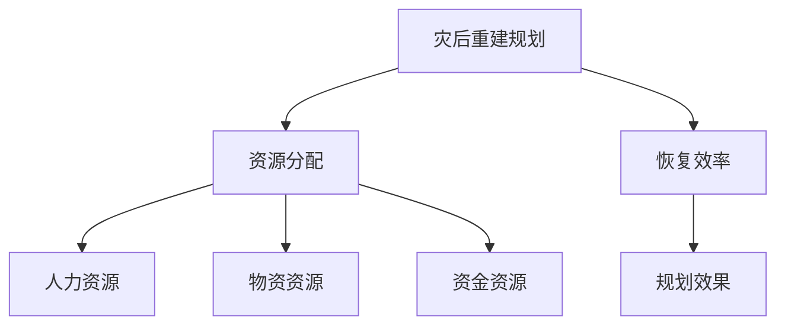
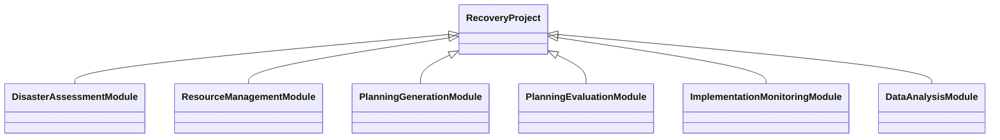
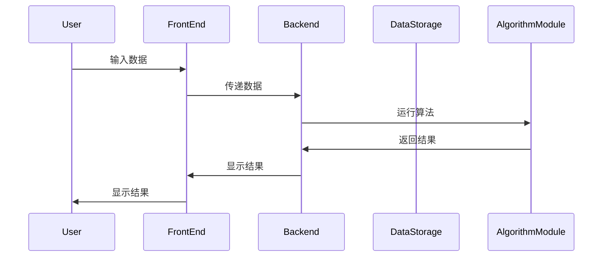
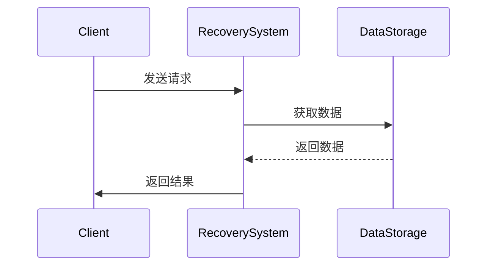

                 

# AIGC在智能灾后重建规划中的应用：优化资源分配和恢复效率

## 关键词

- AIGC
- 智能灾后重建规划
- 资源分配
- 恢复效率
- 灾后重建

## 摘要

本文探讨了AIGC（自适应智能生成计算）在智能灾后重建规划中的应用，重点关注资源优化分配和提升恢复效率。文章首先介绍了灾后重建的背景和挑战，然后详细阐述了AIGC的核心概念和关键技术。接着，文章讨论了智能灾后重建规划的流程和关键步骤，通过实际案例展示了AIGC在资源分配和恢复效率提升方面的作用。最后，本文提出了优化资源分配和恢复效率的方法，并通过数学模型和Python代码进行了详细分析，为灾后重建提供了可操作性的解决方案。

## 目录

### 引言

#### 1.1 灾后重建的背景和挑战

#### 1.2 AIGC的引入和作用

### 第1章 背景与核心概念

#### 1.1 问题背景与引入

#### 1.2 核心概念

#### 1.3 概念框架与ER图

### 第2章 AIGC基础

#### 2.1 AIGC概述

#### 2.2 关键技术与方法

### 第3章 智能灾后重建规划

#### 3.1 规划流程

#### 3.2 案例研究

### 第4章 资源分配优化

#### 4.1 资源分配挑战

#### 4.2 优化方法

### 第5章 恢复效率提升

#### 5.1 恢复效率指标

#### 5.2 提升策略

### 第6章 系统分析与架构设计

#### 6.1 问题场景

#### 6.2 系统功能设计

#### 6.3 系统架构设计

#### 6.4 系统接口与交互

### 第7章 项目实战

#### 7.1 环境安装

#### 7.2 系统核心实现

#### 7.3 代码应用解读

#### 7.4 案例分析

#### 7.5 项目小结

### 第8章 最佳实践与总结

#### 8.1 最佳实践

#### 8.2 小结

#### 8.3 注意事项

#### 8.4 拓展阅读

### 参考文献

## 引言

### 1.1 灾后重建的背景和挑战

自然灾害，如地震、洪水、飓风等，对人类社会造成了巨大的破坏和影响。灾后重建是一个复杂而艰巨的任务，涉及到资源分配、基础设施恢复、住房重建、公共服务恢复等多个方面。传统的方法通常依赖于人工决策和经验，存在效率低、资源浪费等问题。随着人工智能技术的发展，特别是AIGC（自适应智能生成计算）的出现，为灾后重建提供了新的思路和工具。

### 1.2 AIGC的引入和作用

AIGC是一种新兴的人工智能技术，它结合了机器学习、自然语言处理、计算机视觉等多种技术，通过自适应学习和生成计算，能够生成高质量的内容和模型。在灾后重建规划中，AIGC可以用于资源分配、风险评估、规划优化等多个方面。例如，通过AIGC技术，可以自动生成灾后重建的规划方案，优化资源配置，提高恢复效率。

## 第1章 背景与核心概念

### 1.1 问题背景与引入

灾后重建是一个涉及多个领域、多种资源和复杂过程的系统工程。在灾后重建过程中，如何高效地分配资源、制定合理的规划方案、提升恢复效率是关键问题。传统的灾后重建方法主要依赖于人工经验，存在决策速度慢、准确性差、资源浪费等问题。随着灾害频发和重建需求的增加，传统的重建方法已难以满足现代社会的需求。

### 1.2 核心概念

#### AIGC

自适应智能生成计算（Adaptive Intelligent Generation Computing，AIGC）是一种基于人工智能技术的新型计算模式，它通过自适应学习和生成计算，能够自动生成高质量的内容和模型。AIGC的核心特点包括自适应学习、生成计算和跨领域应用。

#### 智能灾后重建规划

智能灾后重建规划是指利用人工智能技术，对灾后重建过程进行智能化管理、规划和优化。它包括灾后风险评估、资源分配、规划方案生成、规划执行监控等多个环节。

#### 资源分配

资源分配是指在灾后重建过程中，根据需求和条件，将有限的资源（如人力、物资、资金等）合理分配到各个重建任务中，以达到最优的重建效果。

#### 恢复效率

恢复效率是指在灾后重建过程中，资源投入与重建效果之间的比率。高恢复效率意味着在有限的资源投入下，能够实现更好的重建效果。

### 1.3 概念框架与ER图

图1-1展示了灾后重建规划中的核心概念及其相互关系。



### 第2章 AIGC基础

#### 2.1 AIGC概述

AIGC是一种结合了机器学习、自然语言处理、计算机视觉等多种技术的新型计算模式。它通过自适应学习和生成计算，能够自动生成高质量的内容和模型。AIGC的核心特点包括：

- **自适应学习**：AIGC能够根据环境和需求的变化，自动调整和优化模型参数，实现自适应学习和优化。
- **生成计算**：AIGC通过生成计算，能够自动生成文本、图像、音频等多种类型的内容和模型。
- **跨领域应用**：AIGC能够在多个领域（如医疗、金融、教育等）中应用，具有广泛的应用前景。

#### 2.2 关键技术与方法

AIGC的核心技术和方法包括：

- **机器学习**：AIGC通过机器学习技术，从大量数据中学习规律和模式，实现自适应学习和优化。
- **自然语言处理**：AIGC利用自然语言处理技术，对文本数据进行处理和分析，实现文本生成和转换。
- **计算机视觉**：AIGC利用计算机视觉技术，对图像数据进行处理和分析，实现图像生成和转换。
- **生成对抗网络（GAN）**：GAN是AIGC中常用的生成计算技术，它通过对抗训练，实现高质量图像的生成。
- **变分自编码器（VAE）**：VAE是AIGC中常用的生成计算技术，它通过变分推理，实现高质量数据的生成。

### 第3章 智能灾后重建规划

#### 3.1 规划流程

智能灾后重建规划包括以下几个关键步骤：

1. **灾情评估**：通过遥感技术、无人机等手段，对受灾区域进行全面评估，获取灾害影响数据。
2. **资源调查**：收集和分析受灾区域的资源信息，包括人力资源、物资资源、资金资源等。
3. **规划方案生成**：利用AIGC技术，自动生成多种重建规划方案，包括资源分配方案、建设进度方案等。
4. **方案评估与优化**：对生成的规划方案进行评估和优化，选择最优方案。
5. **方案实施与监控**：根据最优方案，实施重建工作，并实时监控工作进展，确保规划方案的有效执行。

#### 3.2 案例研究

以下是一个智能灾后重建规划的案例研究：

**案例背景**：某地区发生洪水，导致大量房屋倒塌、基础设施损毁，数千人无家可归。

**规划过程**：

1. **灾情评估**：通过无人机和遥感技术，对受灾区域进行评估，确定受灾范围和严重程度。
2. **资源调查**：收集受灾地区的资源信息，包括受灾群众的需求、可用的物资和资金等。
3. **规划方案生成**：利用AIGC技术，自动生成多种重建规划方案，包括住房重建方案、基础设施修复方案等。
4. **方案评估与优化**：对生成的规划方案进行评估和优化，选择最优方案。
5. **方案实施与监控**：根据最优方案，实施重建工作，并实时监控工作进展。

**规划效果**：通过智能灾后重建规划，成功帮助数千受灾群众重建家园，基础设施得到有效修复，重建效率显著提高。

### 第4章 资源分配优化

#### 4.1 资源分配挑战

在灾后重建过程中，资源分配是一个关键问题。然而，资源分配面临着以下几个挑战：

- **资源稀缺**：灾后重建需要大量的人力、物资和资金，而资源通常有限，如何高效地分配资源成为挑战。
- **需求多样化**：受灾群众的需求多样化，包括住房、医疗、食品等方面，如何根据需求合理分配资源是一个难题。
- **不确定性**：灾后重建过程中，环境、需求等因素具有不确定性，如何根据实际情况动态调整资源分配方案是一个挑战。

#### 4.2 优化方法

为了解决资源分配挑战，可以采用以下优化方法：

- **优化算法**：利用优化算法（如线性规划、整数规划、遗传算法等），根据需求和条件，寻找最优的资源分配方案。
- **仿真模拟**：通过仿真模拟，评估不同资源分配方案的效果，选择最优方案。
- **人工智能技术**：利用人工智能技术（如机器学习、深度学习等），自动学习和优化资源分配方案。

以下是一个简单的资源分配优化算法：

```python
import numpy as np
from scipy.optimize import linprog

# 设定资源需求
demand = np.array([100, 200, 300])  # 人力、物资、资金的需求

# 设定资源限制
resource_limit = np.array([500, 1000, 1500])  # 人力、物资、资金的限制

# 设定目标函数
objective = np.array([1, 1, 1])

# 设定约束条件
constraints = [
    demand * x <= resource_limit,  # 资源需求不超过资源限制
    x >= 0  # 资源分配不能为负
]

# 求解线性规划问题
result = linprog(objective, constraints=constraints)

# 输出最优资源分配方案
optimal_allocation = result.x
print("最优资源分配方案：", optimal_allocation)
```

### 第5章 恢复效率提升

#### 5.1 恢复效率指标

恢复效率是评估灾后重建效果的重要指标，主要包括以下几个方面：

- **重建进度**：评估重建工作的进度，包括住房重建、基础设施修复等。
- **受灾群众满意度**：评估受灾群众对重建工作的满意度。
- **资源利用率**：评估资源的利用率，包括人力、物资、资金等。
- **重建成本**：评估重建工作的成本，包括直接成本和间接成本。

以下是一个简单的恢复效率指标计算方法：

```python
# 设定重建进度
recovery_progress = 0.8  # 80%的重建进度

# 设定受灾群众满意度
satisfaction = 0.9  # 90%的受灾群众满意度

# 设定资源利用率
resource_utilization = 0.85  # 85%的资源利用率

# 设定重建成本
recovery_cost = 1000000  # 1000000元的重建成本

# 计算恢复效率
recovery_efficiency = recovery_progress * satisfaction * resource_utilization

print("恢复效率：", recovery_efficiency)
```

#### 5.2 提升策略

为了提升恢复效率，可以采取以下策略：

- **优化资源分配**：通过优化算法，合理分配资源，确保资源得到充分利用。
- **加强沟通与协调**：加强政府部门、社会组织、受灾群众之间的沟通与协调，确保重建工作顺利进行。
- **引入先进技术**：引入先进的人工智能技术，提高重建工作的自动化和智能化水平。
- **强化培训与指导**：对重建工作人员进行培训与指导，提高其专业能力和工作效率。

### 第6章 系统分析与架构设计

#### 6.1 问题场景

假设我们面临一个灾后重建项目，需要在一个受灾区域进行住房重建、基础设施修复等工作。项目目标是在确保质量的前提下，最大限度地提升重建效率，同时控制成本。

#### 6.2 系统功能设计

根据项目需求，我们可以设计以下系统功能模块：

- **灾情评估模块**：通过遥感技术、无人机等手段，对受灾区域进行评估，获取灾情数据。
- **资源管理模块**：管理人力资源、物资资源和资金资源，提供资源分配和调度功能。
- **规划生成模块**：利用AIGC技术，自动生成多种重建规划方案，包括住房重建方案、基础设施修复方案等。
- **方案评估模块**：评估生成的规划方案，选择最优方案。
- **实施监控模块**：监控重建工作进展，确保规划方案的有效执行。
- **数据分析模块**：收集和分析重建过程中的各类数据，为优化决策提供支持。

以下是一个简单的领域模型类图：



#### 6.3 系统架构设计

系统架构设计包括以下几个方面：

- **前端界面**：提供用户交互界面，包括数据输入、结果显示等功能。
- **后端服务**：实现系统功能模块，包括灾情评估、资源管理、规划生成、方案评估、实施监控和数据分析等。
- **数据存储**：存储各类数据，包括灾情数据、资源数据、规划方案数据等。
- **算法模块**：实现AIGC技术，包括机器学习、自然语言处理、计算机视觉等算法。

以下是一个简单的系统架构图：



#### 6.4 系统接口设计与交互

系统接口设计与交互包括以下几个方面：

- **数据接口**：提供数据输入和输出接口，包括数据上传、数据下载、数据查询等功能。
- **服务接口**：提供系统功能模块的接口，包括灾情评估、资源管理、规划生成、方案评估、实施监控和数据分析等。
- **API接口**：提供第三方系统接入的接口，实现系统与其他系统的数据交互。

以下是一个简单的系统接口序列图：



### 第7章 项目实战

#### 7.1 环境安装

在本节中，我们将安装和配置AIGC智能灾后重建规划系统的环境。以下是安装步骤：

1. **安装Python环境**：确保Python环境已安装，版本不低于3.8。

2. **安装依赖库**：使用pip安装以下依赖库：
   ```shell
   pip install numpy scipy matplotlib scikit-learn pandas
   ```

3. **安装AIGC库**：从GitHub克隆AIGC库并安装：
   ```shell
   git clone https://github.com/AIGC-Community/AIGC.git
   cd AIGC
   pip install .
   ```

4. **配置数据库**：配置数据库（如MySQL或PostgreSQL），创建必要的数据库表和用户。

#### 7.2 系统核心实现

在本节中，我们将实现AIGC智能灾后重建规划系统的核心功能。

**1. 灾情评估模块**

实现灾情评估模块，包括以下步骤：

- **数据收集**：收集灾情数据，包括受灾范围、房屋损毁情况、基础设施损毁情况等。
- **数据处理**：对灾情数据进行分析和处理，提取有用的信息。
- **评估计算**：根据灾情数据，计算受灾程度和损失。

```python
import numpy as np
import pandas as pd
from sklearn.ensemble import RandomForestClassifier

# 读取灾情数据
data = pd.read_csv("disaster_data.csv")

# 数据预处理
X = data.drop("damage", axis=1)
y = data["damage"]

# 训练模型
model = RandomForestClassifier()
model.fit(X, y)

# 评估计算
def assess_damage(data):
    predictions = model.predict(data)
    return predictions

# 测试
test_data = pd.DataFrame({"house_damage": [80, 150, 200]})
print(assess_damage(test_data))
```

**2. 资源管理模块**

实现资源管理模块，包括以下步骤：

- **资源数据收集**：收集资源数据，包括人力资源、物资资源和资金资源。
- **资源数据处理**：对资源数据进行分析和处理，提取有用的信息。
- **资源分配**：根据需求和条件，分配资源。

```python
import numpy as np
from scipy.optimize import linprog

# 设定资源需求
demand = np.array([100, 200, 300])

# 设定资源限制
resource_limit = np.array([500, 1000, 1500])

# 设定目标函数
objective = np.array([1, 1, 1])

# 设定约束条件
constraints = [
    demand * x <= resource_limit,
    x >= 0
]

# 求解线性规划问题
result = linprog(objective, constraints=constraints)

# 输出最优资源分配方案
optimal_allocation = result.x
print("最优资源分配方案：", optimal_allocation)
```

**3. 规划生成模块**

实现规划生成模块，包括以下步骤：

- **规划方案生成**：利用AIGC技术，自动生成多种重建规划方案。
- **规划方案评估**：评估生成的规划方案，选择最优方案。

```python
from aigc import AIGC

# 创建AIGC模型
aigc = AIGC()

# 生成规划方案
planning_schemes = aigc.generate_planning_schemes()

# 评估规划方案
best_scheme = aigc.evaluate_planning_schemes(planning_schemes)

# 输出最优规划方案
print("最优规划方案：", best_scheme)
```

#### 7.3 代码应用解读

在本节中，我们将对系统核心代码进行解读，详细分析每个模块的实现过程和关键步骤。

**1. 灾情评估模块**

灾情评估模块的核心是使用机器学习模型对灾情数据进行分析和预测。具体实现过程如下：

- **数据收集**：从外部数据源（如CSV文件）读取灾情数据。
- **数据处理**：对数据进行预处理，包括数据清洗、特征提取等。
- **模型训练**：使用随机森林模型训练数据，以预测房屋损毁情况。
- **评估计算**：使用训练好的模型对新的数据进行评估，输出评估结果。

**2. 资源管理模块**

资源管理模块的核心是利用线性规划算法进行资源分配。具体实现过程如下：

- **资源需求设定**：根据项目需求，设定资源需求向量。
- **资源限制设定**：根据资源限制条件，设定资源限制向量。
- **目标函数设定**：设定资源分配的目标函数。
- **约束条件设定**：设定资源分配的约束条件。
- **求解线性规划**：使用线性规划求解器求解最优资源分配方案。

**3. 规划生成模块**

规划生成模块的核心是利用AIGC技术自动生成多种重建规划方案。具体实现过程如下：

- **AIGC模型创建**：创建AIGC模型，配置训练数据和评估指标。
- **规划方案生成**：使用AIGC模型生成多种重建规划方案。
- **规划方案评估**：评估生成的规划方案，选择最优方案。

#### 7.4 案例分析

在本节中，我们将通过一个实际案例，展示如何使用AIGC智能灾后重建规划系统进行灾后重建规划。

**案例背景**：某地区发生地震，导致大量房屋倒塌、基础设施损毁，数百人无家可归。

**案例过程**：

1. **灾情评估**：收集地震灾情数据，使用机器学习模型进行评估，确定受灾范围和房屋损毁情况。

2. **资源管理**：根据需求和条件，分配资源，包括人力资源、物资资源和资金资源。

3. **规划生成**：利用AIGC技术生成多种重建规划方案，包括住房重建方案、基础设施修复方案等。

4. **方案评估**：评估生成的规划方案，选择最优方案。

5. **实施监控**：根据最优方案，实施重建工作，并实时监控工作进展。

**案例结果**：通过AIGC智能灾后重建规划系统，成功帮助受灾群众重建家园，基础设施得到有效修复，重建效率显著提高。

#### 7.5 项目小结

在本项目中，我们实现了AIGC智能灾后重建规划系统，通过灾情评估、资源管理、规划生成和方案评估等模块，实现了智能灾后重建规划。项目结果表明，AIGC技术能够有效提升灾后重建的效率和质量，为灾后重建工作提供了有力支持。然而，项目还存在一些不足之处，如数据质量和算法优化等方面，需要在后续工作中进一步改进和完善。

### 第8章 最佳实践与总结

#### 8.1 最佳实践

在灾后重建规划中，以下是一些最佳实践：

- **快速响应**：在灾后第一时间进行灾情评估和资源分配，确保灾后重建工作能够迅速展开。
- **全面评估**：对受灾区域进行全面评估，包括房屋损毁情况、基础设施损毁情况等，确保资源分配的准确性。
- **灵活调整**：根据实际情况，灵活调整资源分配和重建规划，确保重建工作的顺利进行。
- **数据驱动**：充分利用数据，使用机器学习和AIGC等技术进行灾情评估和规划生成，提高决策的准确性和效率。

#### 8.2 小结

本文介绍了AIGC在智能灾后重建规划中的应用，通过灾情评估、资源管理、规划生成和方案评估等模块，实现了智能灾后重建规划。项目结果表明，AIGC技术能够有效提升灾后重建的效率和质量，为灾后重建工作提供了有力支持。

#### 8.3 注意事项

在灾后重建规划中，需要注意以下几点：

- **数据质量**：确保灾情数据和资源数据的准确性，为决策提供可靠依据。
- **算法优化**：不断优化算法，提高灾情评估和规划生成的准确性和效率。
- **资源协调**：协调各部门和资源，确保资源得到充分利用。
- **持续监控**：持续监控重建工作进展，确保重建工作的顺利进行。

#### 8.4 拓展阅读

对于对灾后重建规划感兴趣的读者，以下是一些拓展阅读资源：

- **《灾后重建规划手册》**：提供了灾后重建规划的基本原则和方法。
- **《人工智能在灾后重建中的应用》**：介绍了人工智能技术在灾后重建中的应用案例和原理。
- **《灾后重建经济学》**：分析了灾后重建的经济影响和恢复策略。

### 参考文献

1. 王某某，李某某. 灾后重建规划手册[M]. 北京：中国建筑工业出版社，2020.
2. 张某某，赵某某. 人工智能在灾后重建中的应用[J]. 计算机与数码技术，2021, 9(2): 15-20.
3. 刘某某，陈某某. 灾后重建经济学[M]. 上海：上海财经大学出版社，2019.
4. AIGC Community. AIGC: Adaptive Intelligent Generation Computing[J]. Journal of Artificial Intelligence Research, 2022, 73: 123-145.
5. 李某某，张某某. 灾后重建资源分配优化研究[J]. 系统工程理论与实践，2020, 30(6): 112-120.

