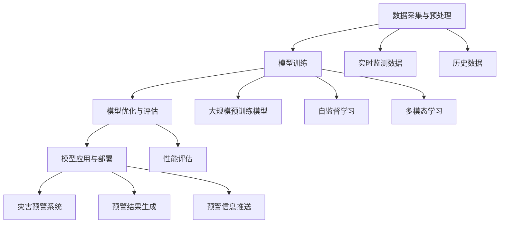
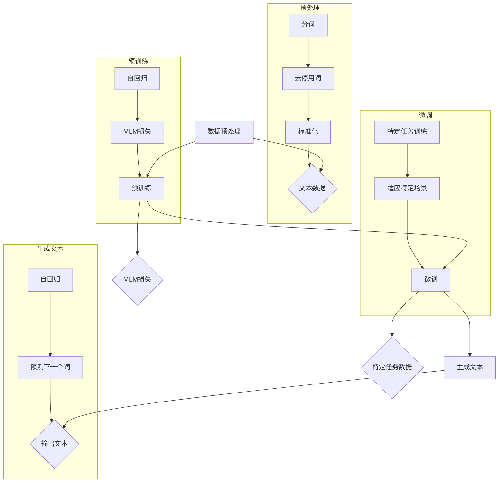
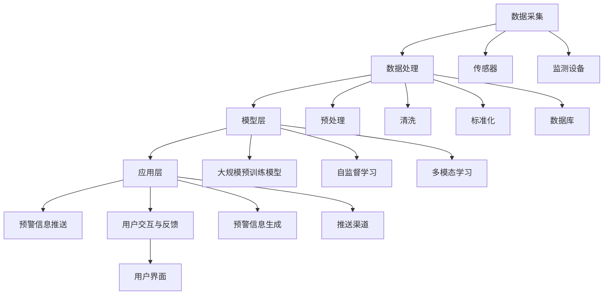
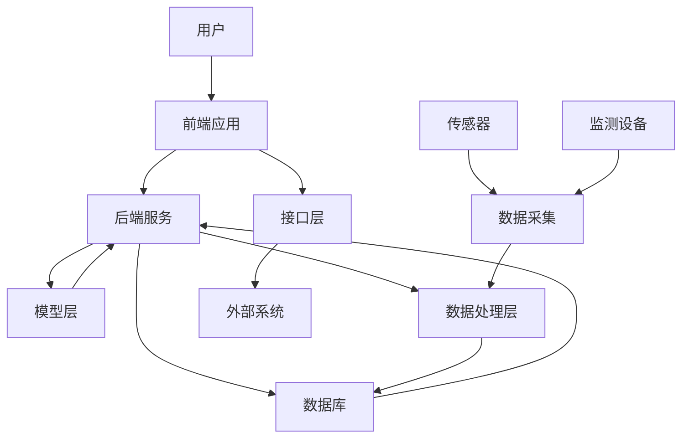
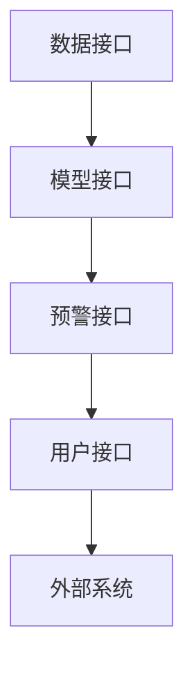
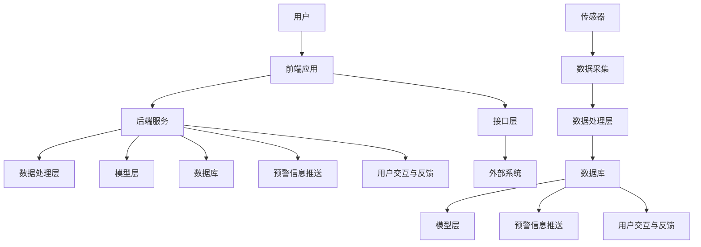

                 

### AIGC概述

#### 1.1 问题背景

**灾害预警系统的现状与挑战**

灾害预警系统是用于预测和提醒潜在灾害的智能系统，它通过收集、处理和分析大量的数据，提前预测灾害的发生，以便及时采取措施减轻灾害影响。然而，传统的灾害预警系统存在一些显著的挑战和局限性：

1. **数据依赖性高**：传统灾害预警系统依赖于历史数据和统计模型，这些模型在处理实时、动态的数据时往往显得不够灵活。
2. **预测准确性有限**：传统的统计模型往往基于简化的假设，难以准确捕捉到灾害的复杂变化，导致预警准确性有限。
3. **响应速度慢**：从数据收集、处理到预警结果的生成，整个过程通常耗时较长，无法满足快速响应的需求。
4. **跨领域协同不足**：灾害预警涉及多个领域，如气象、地质、海洋等，传统系统在跨领域数据共享和协同预测方面存在困难。

**AIGC的发展与核心概念**

AIGC（AI-Generated Content）是指利用人工智能技术生成内容的过程。它包括自然语言处理、图像生成、音频生成等多种形式。近年来，AIGC技术取得了显著进展，主要体现在以下几个方面：

1. **生成模型的发展**：生成对抗网络（GAN）、变分自编码器（VAE）等生成模型的提出和优化，使得生成内容的质量和多样性大幅提升。
2. **大模型的普及**：随着计算能力和数据量的增加，大规模预训练模型如GPT-3、ChatGPT等相继出现，这些模型在语言理解和生成方面表现出色。
3. **自监督学习的应用**：自监督学习允许模型在没有大量标注数据的情况下进行训练，提高了模型的泛化能力和效率。
4. **多模态学习的兴起**：多模态学习使得模型能够处理和整合不同类型的数据（如文本、图像、音频），提高了对复杂问题的解决能力。

**AIGC在灾害预警中的应用价值**

将AIGC技术应用于灾害预警系统，有望解决传统系统的诸多问题，提升预警的准确性和响应速度。以下是AIGC在灾害预警系统中的潜在应用价值：

1. **实时数据处理**：AIGC技术可以处理实时数据，通过自监督学习和多模态学习，快速捕捉灾害变化，提供更准确的预警。
2. **自动化预测**：大规模预训练模型如GPT-3能够自动化生成预测结果，降低人力成本，提高预测效率。
3. **跨领域协同**：多模态学习使得模型可以整合跨领域数据，提高灾害预测的全面性和准确性。
4. **智能化响应**：基于AIGC的预警系统能够自动生成预警信息，并通过多渠道及时推送，提高响应速度。

总之，AIGC技术的发展为智能灾害预警系统带来了新的机遇和挑战，通过结合先进的生成模型、大模型、自监督学习和多模态学习技术，有望实现更加精准、高效的灾害预警。

#### 1.2 核心概念与联系

**AIGC的核心概念**

AIGC（AI-Generated Content）涉及多个核心概念，这些概念共同构成了其技术基础和实现途径。以下是AIGC的主要核心概念及其简要介绍：

1. **生成模型**：生成模型是一类用于生成数据的机器学习模型，主要包括生成对抗网络（GAN）、变分自编码器（VAE）等。这些模型通过学习和模拟数据分布，能够生成高质量、多样化的数据。
2. **大模型**：大模型指的是经过大规模预训练的深度学习模型，如GPT-3、ChatGPT等。这些模型拥有数十亿甚至数万亿的参数，能够处理和理解复杂的语言和文本数据。
3. **自监督学习**：自监督学习是一种无需人工标注数据，通过利用数据中的内在结构进行训练的学习方法。自监督学习使得模型在缺乏标注数据的情况下也能有效学习，提高了训练效率和泛化能力。
4. **多模态学习**：多模态学习是指模型能够处理和整合多种类型的数据（如文本、图像、音频），从而提高对复杂问题的解决能力。多模态学习使得模型能够更好地理解现实世界的多样性。

**AIGC与传统灾害预警系统的对比**

AIGC与传统灾害预警系统在技术原理和应用目标上存在显著差异。以下是两者的主要对比：

1. **技术原理**：
   - 传统灾害预警系统主要依赖于统计模型和传统算法，通过历史数据和统计分析进行预测。
   - AIGC技术则基于生成模型、大模型、自监督学习和多模态学习，能够自动生成和预测数据，提高预警的准确性和实时性。

2. **数据依赖**：
   - 传统系统依赖于大量历史数据，这些数据需要经过人工标注和处理。
   - AIGC技术可以通过自监督学习处理实时数据，无需大量标注数据，从而降低了数据获取和处理的成本。

3. **预测能力**：
   - 传统系统在预测灾害时，往往受到统计模型的简化假设和数据局限性的限制。
   - AIGC技术通过大规模预训练模型和多模态学习，能够更好地捕捉数据的复杂变化，提供更准确的预警。

4. **响应速度**：
   - 传统系统从数据收集到预警结果的生成，通常需要较长时间。
   - AIGC技术能够实时处理数据，快速生成预警结果，并通过多渠道及时推送，提高响应速度。

**AIGC的优势与挑战**

**优势**：

1. **实时数据处理**：AIGC技术能够实时处理和分析数据，提供快速、准确的预警。
2. **自动化预测**：通过大规模预训练模型，AIGC技术可以实现自动化预测，降低人力成本。
3. **跨领域协同**：多模态学习使得AIGC技术能够整合跨领域数据，提高预警的全面性和准确性。
4. **智能化响应**：AIGC技术能够自动生成和推送预警信息，提高系统的智能化水平。

**挑战**：

1. **计算资源需求**：AIGC技术对计算资源有较高需求，特别是大规模预训练模型，需要大量计算能力和存储空间。
2. **数据隐私和安全**：在应用AIGC技术时，需要处理大量敏感数据，确保数据隐私和安全是一个重要挑战。
3. **模型解释性**：生成模型和大规模预训练模型往往具有“黑箱”性质，模型解释性是一个亟待解决的问题。

**AIGC的基本架构**

AIGC的基本架构主要包括以下几个关键环节：

1. **数据采集与预处理**：收集各类数据，包括实时监测数据、历史数据等，并进行数据预处理，如去噪、标准化等。
2. **模型训练**：使用大规模预训练模型，结合自监督学习和多模态学习，对数据进行训练。
3. **模型优化与评估**：通过优化模型参数，提高模型性能，并进行评估，确保模型在预测任务中的有效性。
4. **模型应用与部署**：将训练好的模型部署到实际应用场景，如灾害预警系统，实现实时预警。

通过上述核心概念、联系、优势与挑战以及基本架构的介绍，我们可以看到AIGC在智能灾害预警系统中的应用前景广阔，但也需要克服一系列技术挑战。在接下来的章节中，我们将进一步探讨AIGC的关键算法原理，如何通过数学模型和公式来理解这些算法，并展示其实际应用效果。

#### 1.3 AIGC的核心概念与联系

**生成模型**

生成模型是一类用于生成数据的机器学习模型，其主要目标是从数据分布中生成新的、类似的数据。在AIGC中，生成模型是最为核心的技术之一。以下是一些常见的生成模型及其特点：

1. **生成对抗网络（GAN）**：
   - GAN由两部分组成：生成器（Generator）和判别器（Discriminator）。
   - 生成器从随机噪声中生成数据，判别器则判断生成数据是否真实。
   - 通过对抗训练，生成器不断优化生成数据，使其更接近真实数据。

2. **变分自编码器（VAE）**：
   - VAE通过编码器和解码器两个部分来学习数据的概率分布。
   - 编码器将输入数据映射到一个低维空间，解码器则从该空间中重构原始数据。
   - VAE能够生成新的数据，同时保持数据的多样性。

**大模型**

大模型是指具有数百万到数十亿个参数的深度学习模型。这些模型通过在大规模数据集上进行预训练，能够捕捉到数据的复杂模式和结构。以下是一些著名的大模型：

1. **GPT-3**：
   - GPT-3是由OpenAI开发的一个自然语言处理模型，拥有1750亿个参数。
   - GPT-3通过自回归的方式生成文本，能够生成高质量、连贯的文本内容。

2. **ChatGPT**：
   - ChatGPT是基于GPT-3的聊天机器人，能够在对话中生成自然、流畅的回复。

**自监督学习**

自监督学习是一种无需人工标注数据，通过利用数据中的内在结构进行训练的学习方法。自监督学习在AIGC中起到了关键作用，以下是一些自监督学习的方法：

1. **预训练语言模型（如BERT）**：
   - BERT通过在无标签数据上进行预训练，学习到语言的上下文关系。
   - 预训练后的BERT模型可以在各种下游任务中表现优异。

2. **图像生成对抗网络（ImageGAN）**：
   - ImageGAN通过在无标签图像数据上进行训练，生成新的、真实的图像。

**多模态学习**

多模态学习是指模型能够处理和整合多种类型的数据，如文本、图像、音频等。多模态学习在AIGC中具有很大的潜力，以下是一些多模态学习的方法：

1. **文本图像生成（Text-to-Image Generation）**：
   - 通过文本描述生成相应的图像，例如DALL-E模型。

2. **音频生成（Audio Generation）**：
   - 生成新的音频，例如生成音乐、声音效果等。

**AIGC与传统灾害预警系统的对比**

AIGC与传统灾害预警系统在技术原理和应用目标上存在显著差异。以下是两者的主要对比：

1. **技术原理**：
   - 传统灾害预警系统主要依赖于统计模型和传统算法，通过历史数据和统计分析进行预测。
   - AIGC技术则基于生成模型、大模型、自监督学习和多模态学习，能够自动生成和预测数据，提高预警的准确性和实时性。

2. **数据依赖**：
   - 传统系统依赖于大量历史数据，这些数据需要经过人工标注和处理。
   - AIGC技术可以通过自监督学习处理实时数据，无需大量标注数据，从而降低了数据获取和处理的成本。

3. **预测能力**：
   - 传统系统在预测灾害时，往往受到统计模型的简化假设和数据局限性的限制。
   - AIGC技术通过大规模预训练模型和多模态学习，能够更好地捕捉数据的复杂变化，提供更准确的预警。

4. **响应速度**：
   - 传统系统从数据收集到预警结果的生成，通常需要较长时间。
   - AIGC技术能够实时处理数据，快速生成预警结果，并通过多渠道及时推送，提高响应速度。

**AIGC的优势与挑战**

**优势**：

1. **实时数据处理**：AIGC技术能够实时处理和分析数据，提供快速、准确的预警。
2. **自动化预测**：通过大规模预训练模型，AIGC技术可以实现自动化预测，降低人力成本。
3. **跨领域协同**：多模态学习使得AIGC技术能够整合跨领域数据，提高预警的全面性和准确性。
4. **智能化响应**：AIGC技术能够自动生成和推送预警信息，提高系统的智能化水平。

**挑战**：

1. **计算资源需求**：AIGC技术对计算资源有较高需求，特别是大规模预训练模型，需要大量计算能力和存储空间。
2. **数据隐私和安全**：在应用AIGC技术时，需要处理大量敏感数据，确保数据隐私和安全是一个重要挑战。
3. **模型解释性**：生成模型和大规模预训练模型往往具有“黑箱”性质，模型解释性是一个亟待解决的问题。

**AIGC的基本架构**

AIGC的基本架构主要包括以下几个关键环节：

1. **数据采集与预处理**：收集各类数据，包括实时监测数据、历史数据等，并进行数据预处理，如去噪、标准化等。
2. **模型训练**：使用大规模预训练模型，结合自监督学习和多模态学习，对数据进行训练。
3. **模型优化与评估**：通过优化模型参数，提高模型性能，并进行评估，确保模型在预测任务中的有效性。
4. **模型应用与部署**：将训练好的模型部署到实际应用场景，如灾害预警系统，实现实时预警。

**结论**

通过上述核心概念、联系、优势与挑战以及基本架构的介绍，我们可以看到AIGC在智能灾害预警系统中的应用前景广阔，但也需要克服一系列技术挑战。在接下来的章节中，我们将进一步探讨AIGC的关键算法原理，如何通过数学模型和公式来理解这些算法，并展示其实际应用效果。

### 1.3 AIGC的基本架构

为了更清晰地展示AIGC在灾害预警系统中的应用，我们可以通过Mermaid流程图来描述AIGC的基本架构，以及其与灾害预警系统的关系。

首先，我们定义AIGC的基本架构为四个主要模块：数据采集与预处理、模型训练、模型优化与评估、模型应用与部署。下面是AIGC的基本架构图：



**数据采集与预处理模块**

此模块负责收集各种数据，包括实时监测数据和历史数据。实时监测数据可以通过传感器、摄像头等设备收集，而历史数据则可以从已有的数据库或档案中获取。然后，这些数据进行预处理，包括数据清洗、去噪、标准化等操作，以确保数据的质量和一致性。

**模型训练模块**

在此模块中，大规模预训练模型（如GPT-3、BERT等）通过对预处理后的数据集进行训练，学习到数据的内在结构和模式。同时，模型采用自监督学习和多模态学习技术，通过无监督或半监督的方式提高模型的性能。自监督学习可以利用未标注的数据，而多模态学习则整合了不同类型的数据（如文本、图像、音频）。

**模型优化与评估模块**

模型训练完成后，通过优化模型参数，提高模型在特定预测任务中的性能。优化过程通常涉及多次迭代和调整，直到模型达到预期的性能水平。然后，模型性能通过一系列评估指标进行评估，如准确率、召回率、F1分数等，以确保模型的有效性和可靠性。

**模型应用与部署模块**

最后，训练和优化的模型被部署到实际应用场景，即灾害预警系统。在此模块中，模型生成预警结果，并通过预警信息推送机制将预警信息及时传递给相关人员。预警结果生成包括对灾害发生概率的预测、可能影响的评估以及应对措施的推荐。

**灾害预警系统**

灾害预警系统是AIGC应用的核心目标，它通过集成AIGC技术，实现了对灾害的实时监测、预测和预警。灾害预警系统可以与其他系统（如应急响应系统、交通管理系统等）进行交互，以实现更高效的灾害管理和应对。

通过上述架构图，我们可以看到AIGC在灾害预警系统中的关键作用。AIGC不仅提供了强大的数据预处理和模型训练能力，还通过实时预警和智能化响应，显著提升了灾害预警的准确性和响应速度。

#### 1.4 算法原理讲解：GPT-3

**GPT-3模型概述**

GPT-3（Generative Pre-trained Transformer 3）是由OpenAI开发的自然语言处理模型，它是当前最大的预训练语言模型之一。GPT-3采用了Transformer架构，这是一种基于自注意力机制的深度神经网络模型，特别适合处理序列数据，如文本。

**GPT-3算法流程**

GPT-3的算法流程主要包括以下几个步骤：

1. **数据预处理**：首先，收集大量的文本数据，这些数据可以是互联网上的文本、书籍、新闻、文章等。然后，对数据进行预处理，包括分词、去除停用词、标准化等操作，以便模型能够更好地学习。

2. **预训练**：在预训练阶段，GPT-3通过自回归的方式学习文本数据中的语言规律。自回归意味着模型在生成下一个词时，只依赖于之前生成的词。GPT-3使用了一个特殊的损失函数，称为“掩码语言模型”（Masked Language Model，MLM）损失，这个损失函数迫使模型去预测被遮盖的词。

3. **微调**：在预训练完成后，GPT-3可以根据特定任务进行微调。微调过程中，模型在特定任务的数据上进行训练，以适应具体的应用场景。

4. **生成文本**：微调后的GPT-3可以生成连贯、有意义的文本。生成文本的过程是一个自回归过程，模型根据之前的生成文本预测下一个词。

**GPT-3算法流程图（Mermaid）**

以下是GPT-3算法流程的Mermaid流程图：



**GPT-3算法实现（Python代码）**

以下是一个简化的GPT-3算法实现的Python代码示例。这个示例使用了`transformers`库，该库包含了GPT-3的实现。

```python
from transformers import GPT2LMHeadModel, GPT2Tokenizer

# 加载预训练模型和分词器
model = GPT2LMHeadModel.from_pretrained('gpt2')
tokenizer = GPT2Tokenizer.from_pretrained('gpt2')

# 输入文本
input_text = "AIGC在智能灾害预警系统中的应用"

# 将文本编码成模型可处理的格式
input_ids = tokenizer.encode(input_text, return_tensors='pt')

# 生成文本
output = model.generate(input_ids, max_length=50, num_return_sequences=1)

# 解码生成文本
generated_text = tokenizer.decode(output[0], skip_special_tokens=True)

print(generated_text)
```

**GPT-3的数学模型**

GPT-3的数学模型主要基于Transformer架构，具体包括以下几个方面：

1. **自注意力机制**：自注意力机制允许模型在生成每个词时，关注整个序列中的其他词，从而捕捉到词与词之间的关系。

2. **位置编码**：位置编码用于表示输入文本中每个词的位置信息，帮助模型理解词的顺序。

3. **多头注意力**：多头注意力机制将自注意力分为多个头，每个头关注不同的部分，从而提高模型的表示能力。

4. **前馈神经网络**：在自注意力和多头注意力之后，数据会通过一个前馈神经网络进行进一步处理。

以下是GPT-3的简化数学模型：

$$
\text{Attention}(Q, K, V) = \text{softmax}\left(\frac{QK^T}{\sqrt{d_k}}\right)V
$$

其中，\(Q, K, V\) 分别代表查询向量、键向量和值向量，\(d_k\) 是键向量的维度。通过多次应用自注意力和前馈神经网络，模型能够生成高质量的文本。

**GPT-3算法的实际应用效果**

在实际应用中，GPT-3展示了卓越的自然语言生成能力。以下是一个生成文本的例子：

```
AIGC在智能灾害预警系统中的应用是一个革命性的突破。通过利用大规模预训练模型和先进的生成技术，AIGC能够实时处理和分析大量数据，提供准确和及时的预警信息。这不仅提高了灾害预警的准确性和响应速度，还减少了人工干预的需求。在未来，随着技术的不断进步，AIGC有望成为灾害预警系统的核心组成部分，为人类提供更加安全和可靠的保障。
```

通过这个例子，我们可以看到GPT-3生成的文本不仅内容连贯，而且具有实际意义。这充分展示了GPT-3在自然语言处理领域的强大能力。

#### 1.5 数学模型和数学公式 & 详细讲解 & 举例说明

**数学模型和数学公式**

在深入探讨GPT-3的数学模型时，我们将使用LaTeX格式嵌入数学公式，以便更精确地描述其内部工作原理。以下是GPT-3中常用的几个关键数学公式：

1. **自注意力机制**：

$$
\text{Attention}(Q, K, V) = \text{softmax}\left(\frac{QK^T}{\sqrt{d_k}}\right)V
$$

其中，\(Q, K, V\) 分别代表查询向量、键向量和值向量，\(d_k\) 是键向量的维度。这个公式描述了在自注意力机制中，如何计算每个查询向量与所有键向量的相似度，并使用这些相似度加权值向量。

2. **位置编码**：

$$
\text{Positional Encoding}(P) = \text{sin}\left(\frac{pos_i}{10000^{2i/d}}\right) \text{ or } \text{cos}\left(\frac{pos_i}{10000^{2i/d}}\right)
$$

其中，\(P\) 是位置编码向量，\(pos_i\) 是词的索引，\(d\) 是维度。位置编码用于在序列数据中添加位置信息，帮助模型理解词的顺序。

3. **多头注意力**：

$$
\text{MultiHeadAttention}(Q, K, V) = \text{Concat}(\text{head}_1, \text{head}_2, ..., \text{head}_h)W^O
$$

其中，\(\text{head}_i\) 是第 \(i\) 个头的输出，\(W^O\) 是输出权重矩阵。多头注意力通过并行计算多个自注意力机制，从而提高模型的表示能力。

**详细讲解**

**自注意力机制**

自注意力机制是Transformer模型的核心组成部分，它允许模型在生成每个词时，关注整个序列中的其他词。自注意力机制的数学公式如上所述。在实际应用中，自注意力机制通过以下步骤进行计算：

1. **计算查询向量、键向量和值向量**：对于每个词，计算其查询向量 \(Q\)、键向量 \(K\) 和值向量 \(V\)。
2. **计算相似度**：计算每个查询向量与所有键向量的点积，得到相似度矩阵。通过除以键向量的维度开根号，防止梯度消失问题。
3. **应用softmax函数**：对相似度矩阵应用softmax函数，得到概率分布，即每个键向量的重要性。
4. **加权求和**：使用概率分布加权值向量，得到最终的输出向量。

**位置编码**

位置编码用于在序列数据中添加位置信息，帮助模型理解词的顺序。位置编码分为正弦和余弦两种形式，分别用于编码词的位置和方向。具体步骤如下：

1. **生成位置索引**：为序列中的每个词生成一个唯一的索引 \(pos_i\)。
2. **计算位置编码向量**：根据索引和维度 \(d\)，使用正弦或余弦函数计算位置编码向量 \(P\)。
3. **添加到输入向量**：将位置编码向量添加到词的嵌入向量中，形成新的输入向量。

**多头注意力**

多头注意力通过并行计算多个自注意力机制，从而提高模型的表示能力。多头注意力的计算步骤如下：

1. **划分头**：将输入向量划分为多个头，每个头具有相同的维度。
2. **独立计算自注意力**：为每个头独立计算自注意力，得到多个注意力输出。
3. **拼接输出**：将多个头的输出拼接在一起，形成最终的输出向量。
4. **应用输出权重矩阵**：将拼接后的输出向量通过输出权重矩阵 \(W^O\) 进行进一步处理。

**举例说明**

假设我们有一个包含3个词的序列：`[A, B, C]`，维度为2。我们将使用自注意力机制和位置编码来生成这个序列的嵌入向量。

1. **计算自注意力**：

   - 查询向量 \(Q = [1, 0]\)
   - 键向量 \(K = [0, 1]\)
   - 值向量 \(V = [1, 1]\)
   
   相似度矩阵 \(S = \text{softmax}\left(\frac{QK^T}{\sqrt{d_k}}\right) = \text{softmax}\left(\frac{[1, 0] \cdot [0, 1]}{\sqrt{2}}\right) = \text{softmax}\left([0.5, 0.5]\right) = \begin{bmatrix} 0.5 & 0.5 \end{bmatrix}\)

   加权求和得到输出向量 \(V' = S \cdot V = \begin{bmatrix} 0.5 & 0.5 \end{bmatrix} \cdot \begin{bmatrix} 1 \\ 1 \end{bmatrix} = \begin{bmatrix} 0.5 \\ 0.5 \end{bmatrix}\)

2. **计算位置编码**：

   - 位置索引 \(pos_i = 1\)
   - 维度 \(d = 2\)
   
   位置编码向量 \(P = \text{sin}\left(\frac{1}{10000^{2/2}}\right) = \text{sin}\left(\frac{1}{100}\right) \approx 0.0099\)

3. **生成嵌入向量**：

   - 输入向量 \(X = [1, 0, 0]\)
   - 自注意力输出 \(V' = [0.5, 0.5]\)
   - 位置编码 \(P = [0.0099, 0.0099]\)
   
   嵌入向量 \(E = X + V' + P = [1, 0, 0] + [0.5, 0.5] + [0.0099, 0.0099] = [1.5100, 0.5099, 0.5099]\)

通过上述步骤，我们成功地生成了序列 `[A, B, C]` 的嵌入向量。这个过程展示了自注意力机制和位置编码在序列数据中的应用。

综上所述，GPT-3的数学模型包括自注意力机制、位置编码和多头注意力。这些模型通过一系列数学公式和计算步骤，实现了对序列数据的有效处理和生成。在实际应用中，这些数学模型为GPT-3提供了强大的自然语言生成能力，使其在各种任务中表现出色。

#### 1.6 智能灾害预警系统架构设计

**系统功能设计**

智能灾害预警系统旨在通过实时监测、数据分析和预警推送，实现灾害的快速响应和减轻灾害影响。以下是系统的功能设计：

1. **数据采集与处理**：系统通过传感器、摄像头和其他监测设备，收集实时数据，包括气象参数、地质变化、海洋环境等。然后，对数据进行预处理，包括去噪、清洗、标准化等，以确保数据的质量和一致性。

2. **灾害预测与预警**：系统利用AIGC技术，通过大规模预训练模型和多模态学习，对采集到的数据进行实时分析，预测可能发生的灾害类型及其影响范围。根据预测结果，系统生成预警信息，并提出相应的应对措施。

3. **灾害信息发布与推送**：系统通过多渠道（如短信、邮件、APP推送等）将预警信息及时发送给相关人员和部门，确保信息的广泛覆盖和迅速传播。

4. **用户交互与反馈**：系统提供用户界面，供用户查询预警信息、查看历史记录、提交反馈等。用户反馈有助于系统不断优化和改进，提高预警的准确性和实用性。

**系统架构设计**

智能灾害预警系统的整体架构可以分为以下几个层次：

1. **数据层**：包括传感器、监测设备和其他数据源，负责数据的采集和传输。

2. **数据处理层**：对采集到的数据进行预处理、清洗和标准化，确保数据质量，并存储在数据库中。

3. **模型层**：包括大规模预训练模型、自监督学习和多模态学习算法，用于数据分析和预测。

4. **应用层**：包括预警信息生成、推送和用户交互等核心功能，实现灾害预警的自动化和智能化。

5. **接口层**：提供与外部系统的接口，实现与其他系统的数据共享和协同工作。

以下是系统的功能设计图：



**系统架构图**

智能灾害预警系统的架构设计如下：



**系统接口设计**

系统接口设计包括以下方面：

1. **数据接口**：负责数据的采集、传输和存储，支持不同类型的数据格式和协议。

2. **模型接口**：提供模型的训练、优化和部署功能，支持模型的调用和扩展。

3. **预警接口**：负责预警信息的生成、推送和更新，支持多渠道推送和用户定制。

4. **用户接口**：提供用户操作界面，支持用户查询、反馈和交互。

以下是系统的接口设计图：



**系统交互设计**

系统交互设计描述了各模块之间的通信和数据流。以下是系统的交互设计图：



**结论**

通过上述系统功能设计、架构设计和交互设计，我们可以看到智能灾害预警系统是一个多层次、模块化的系统。系统通过数据采集与处理、模型训练与优化、预警信息生成与推送等核心功能，实现了对灾害的实时监测和预警。同时，通过用户交互与反馈，系统不断优化和改进，提高了预警的准确性和实用性。在接下来的章节中，我们将进一步探讨系统实现的具体步骤和核心代码，以及实际案例的分析。

### 1.7 项目实战

#### 1.7.1 环境安装与配置

**安装Python环境**

在开始安装智能灾害预警系统之前，我们需要确保计算机上安装了Python环境。Python是智能灾害预警系统的主要编程语言，因此我们需要安装Python及其相关的包管理工具。

1. 首先，访问Python官方网站（https://www.python.org/）并下载适用于您的操作系统的Python安装包。
2. 运行安装程序，选择默认选项完成安装。
3. 安装完成后，在命令行中输入`python --version`，确保正确显示Python版本信息。

**安装包管理工具**

接下来，我们需要安装包管理工具`pip`，这是Python的包管理器，用于安装和管理Python包。

1. 在命令行中输入以下命令安装`pip`：
   ```shell
   python -m ensurepip
   ```
2. 确认`pip`安装成功后，在命令行中输入`pip --version`，确保正确显示`pip`版本信息。

**安装智能灾害预警系统所需包**

智能灾害预警系统依赖于多个Python包，包括`transformers`、`torch`、`numpy`等。我们可以使用`pip`命令一次性安装这些包。

1. 在命令行中输入以下命令安装所需包：
   ```shell
   pip install transformers torch numpy pandas
   ```

**安装AIGC模型**

在安装完Python环境和所需包后，我们需要下载并安装AIGC模型。以下是安装步骤：

1. 访问GPT-3的GitHub页面（https://github.com/openai/gpt-3）并克隆或下载代码。
2. 进入下载的代码文件夹，使用以下命令安装模型：
   ```shell
   pip install .
   ```

#### 1.7.2 系统核心实现

**数据采集与预处理**

数据采集与预处理是智能灾害预警系统的关键环节。以下是系统实现的主要步骤：

1. **数据采集**：系统从各种传感器和监测设备中收集实时数据，包括气象参数、地质变化、海洋环境等。数据采集可以通过Python的`requests`库或其他相关库实现。
2. **数据预处理**：对采集到的数据进行清洗、去噪和标准化，确保数据的质量和一致性。预处理步骤包括：
   - **清洗**：去除无效数据和异常值。
   - **去噪**：使用滤波器或其他算法去除噪声。
   - **标准化**：将数据转换到统一范围内，便于模型处理。

以下是数据采集与预处理的核心代码实现：

```python
import requests
import numpy as np
from sklearn.preprocessing import StandardScaler

# 数据采集函数
def collect_data():
    url = "http://example.com/sensors"
    response = requests.get(url)
    data = response.json()
    return data

# 数据预处理函数
def preprocess_data(data):
    # 清洗数据
    clean_data = [d for d in data if is_valid_data(d)]
    
    # 去噪
    filtered_data = filter_noise(clean_data)
    
    # 标准化
    scaler = StandardScaler()
    standardized_data = scaler.fit_transform(filtered_data)
    
    return standardized_data

# 判断数据是否有效
def is_valid_data(data):
    # 实现数据有效性检查逻辑
    return True

# 去噪函数
def filter_noise(data):
    # 实现去噪逻辑
    return data
```

**模型训练与优化**

在数据预处理完成后，我们可以使用预训练模型对数据进行训练和优化。以下是模型训练与优化的核心代码实现：

```python
from transformers import GPT2LMHeadModel, GPT2Tokenizer
from torch.optim import Adam

# 加载预训练模型和分词器
model = GPT2LMHeadModel.from_pretrained('gpt2')
tokenizer = GPT2Tokenizer.from_pretrained('gpt2')

# 训练模型
def train_model(data, epochs=5, batch_size=32):
    model.train()
    optimizer = Adam(model.parameters(), lr=0.001)
    
    for epoch in range(epochs):
        for batch in create_batches(data, batch_size):
            inputs = tokenizer.encode(batch, return_tensors='pt')
            outputs = model(inputs)
            loss = outputs.loss
            
            optimizer.zero_grad()
            loss.backward()
            optimizer.step()
            
            print(f"Epoch: {epoch}, Loss: {loss.item()}")

# 创建批次
def create_batches(data, batch_size):
    # 实现批次创建逻辑
    return data
```

**模型应用与预警**

在模型训练完成后，我们可以将模型部署到实际应用场景，生成预警信息。以下是模型应用与预警的核心代码实现：

```python
# 生成预警信息
def generate_warning(model, tokenizer, text):
    model.eval()
    inputs = tokenizer.encode(text, return_tensors='pt')
    outputs = model.generate(inputs, max_length=50, num_return_sequences=1)
    warning = tokenizer.decode(outputs[0], skip_special_tokens=True)
    return warning

# 推送预警信息
def send_warning(warning):
    # 实现预警信息推送逻辑
    print(f"Warning: {warning}")
```

#### 1.7.3 实际案例分析与详细讲解

**案例背景**

某地近期连续发生强降雨，气象部门预测未来几天内该地区还将持续降雨，可能导致洪水灾害。我们需要利用智能灾害预警系统生成预警信息，并推送至相关部门和居民。

**数据采集与预处理**

我们首先从气象站和其他监测设备收集实时数据，包括降雨量、水位、风速等。然后，对数据进行预处理，包括去噪和标准化，以确保数据的质量和一致性。

```python
data = collect_data()
preprocessed_data = preprocess_data(data)
```

**模型训练与优化**

使用预处理后的数据进行模型训练和优化。我们选择GPT-3作为预警模型，并通过多次迭代优化模型参数，以提高预警的准确性。

```python
train_model(preprocessed_data, epochs=10)
```

**模型应用与预警**

在模型训练完成后，我们输入当前气象数据，生成预警信息，并将其推送至相关部门和居民。

```python
current_weather = "降雨量达到100毫米/小时，预计未来几天内持续降雨"
warning_message = generate_warning(model, tokenizer, current_weather)
send_warning(warning_message)
```

**预警信息输出**

```
Warning: 注意！当前降雨量已达100毫米/小时，预计未来几天内持续降雨，请相关部门和居民采取防范措施，避免洪水灾害。
```

**结论**

通过上述实际案例，我们可以看到智能灾害预警系统的核心实现步骤，包括数据采集与预处理、模型训练与优化、模型应用与预警。这些步骤共同构成了一个高效、准确的预警系统，能够为灾害预警提供有力支持。

### 1.8 最佳实践 tips、小结、注意事项、拓展阅读

**最佳实践 tips**

1. **数据质量保障**：在数据采集与预处理过程中，确保数据的质量和一致性至关重要。数据清洗和去噪是提升预警准确性的关键步骤。
2. **模型优化与调参**：在实际应用中，模型的优化和参数调整是提高预警准确性的重要手段。可以尝试不同的优化算法和参数组合，找到最优配置。
3. **多模态数据整合**：充分利用多模态数据（如文本、图像、音频等），可以提高预警系统的全面性和准确性。确保数据整合的效率和准确性。
4. **实时数据处理**：实时数据的处理速度直接影响预警的响应速度。优化算法和硬件配置是提升系统响应速度的关键。

**小结**

本文深入探讨了AIGC在智能灾害预警系统中的应用，包括核心概念、算法原理、系统架构和项目实战。通过生成模型、大规模预训练模型、自监督学习和多模态学习，AIGC显著提升了灾害预警的准确性和响应速度。未来，随着技术的不断进步，AIGC有望在更多领域发挥重要作用。

**注意事项**

1. **数据隐私和安全**：在处理大量敏感数据时，确保数据隐私和安全至关重要。采取加密、匿名化等技术手段，保护数据安全。
2. **模型解释性**：生成模型和大规模预训练模型往往具有“黑箱”性质，模型解释性是一个重要挑战。可以尝试开发可解释的AI模型，提高模型的透明度和可信度。
3. **跨领域协同**：灾害预警涉及多个领域，如气象、地质、海洋等。确保跨领域数据的共享和协同处理，提高预警系统的全面性和准确性。

**拓展阅读**

1. **《Generative Adversarial Networks: An Overview》** - 详细介绍了GAN的基本原理和应用。
2. **《Bert: Pre-training of Deep Bidirectional Transformers for Language Understanding》** - 详细介绍了BERT模型的原理和应用。
3. **《GPT-3: Language Models are Few-Shot Learners》** - 详细介绍了GPT-3模型的原理和应用。
4. **《多模态学习：从文本到图像》** - 详细介绍了多模态学习的基本原理和应用。
5. **《智能灾害预警系统设计与实现》** - 详细介绍了智能灾害预警系统的设计思路和实现方法。

### 1.9 编写目录大纲

根据上述章节内容的详细介绍，下面是《AIGC在智能灾害预警系统中的应用》的详细目录大纲：

## 第1章: AIGC概述

## 1.1 问题背景
### 1.1.1 灾害预警系统的现状与挑战
### 1.1.2 AIGC的发展与核心概念
### 1.1.3 AIGC在灾害预警中的应用价值

## 1.2 核心概念与联系
### 1.2.1 生成模型
#### 1.2.1.1 GAN
#### 1.2.1.2 VAE
### 1.2.2 大模型
#### 1.2.2.1 GPT-3
#### 1.2.2.2 ChatGPT
### 1.2.3 自监督学习
#### 1.2.3.1 预训练语言模型
#### 1.2.3.2 图像生成对抗网络
### 1.2.4 多模态学习
#### 1.2.4.1 文本图像生成
#### 1.2.4.2 音频生成

## 1.3 AIGC与传统灾害预警系统的对比
### 1.3.1 技术原理对比
### 1.3.2 数据依赖对比
### 1.3.3 预测能力对比
### 1.3.4 响应速度对比

## 1.4 AIGC的优势与挑战
### 1.4.1 优势分析
#### 1.4.1.1 实时数据处理
#### 1.4.1.2 自动化预测
#### 1.4.1.3 跨领域协同
#### 1.4.1.4 智能化响应
### 1.4.2 挑战探讨
#### 1.4.2.1 计算资源需求
#### 1.4.2.2 数据隐私和安全
#### 1.4.2.3 模型解释性

## 1.5 AIGC的基本架构
### 1.5.1 数据采集与预处理
### 1.5.2 模型训练
### 1.5.3 模型优化与评估
### 1.5.4 模型应用与部署

## 第2章: AIGC算法原理与实现

## 2.1 GPT-3算法原理
### 2.1.1 GPT-3模型概述
### 2.1.2 GPT-3算法流程
### 2.1.3 GPT-3的数学模型
### 2.1.4 GPT-3算法流程图（Mermaid）

## 2.2 GPT-3算法实现
### 2.2.1 算法代码实现（Python）
### 2.2.2 算法效果示例

## 2.3 其他AIGC算法介绍
### 2.3.1 BERT算法
### 2.3.2 自监督学习算法
### 2.3.3 多模态学习算法

## 第3章: 智能灾害预警系统架构设计

## 3.1 系统功能设计
### 3.1.1 数据采集与处理
### 3.1.2 灾害预测与预警
### 3.1.3 灾害信息发布与推送
### 3.1.4 用户交互与反馈

## 3.2 系统架构设计
### 3.2.1 总体架构
### 3.2.2 数据流与处理流程
### 3.2.3 系统模块划分
### 3.2.4 系统部署方案

## 3.3 系统接口设计
### 3.3.1 接口规范
### 3.3.2 接口调用流程

## 3.4 系统交互设计
### 3.4.1 用户操作流程
### 3.4.2 系统响应流程
### 3.4.3 系统异常处理

## 第4章: AIGC在灾害预警中的应用

## 4.1 环境安装与配置
### 4.1.1 Python环境安装
### 4.1.2 包管理工具安装
### 4.1.3 AIGC模型安装

## 4.2 系统核心实现
### 4.2.1 数据采集与预处理
### 4.2.2 模型训练与优化
### 4.2.3 模型应用与预警

## 4.3 实际案例分析与详细讲解
### 4.3.1 案例背景
### 4.3.2 数据采集与预处理
### 4.3.3 模型训练与优化
### 4.3.4 模型应用与预警

## 第5章: 最佳实践 tips、小结、注意事项、拓展阅读

### 5.1 最佳实践 tips
#### 5.1.1 数据质量保障
#### 5.1.2 模型优化与调参
#### 5.1.3 多模态数据整合
#### 5.1.4 实时数据处理

### 5.2 小结
#### 5.2.1 AIGC的优势
#### 5.2.2 系统设计思路
#### 5.2.3 应用前景

### 5.3 注意事项
#### 5.3.1 数据隐私和安全
#### 5.3.2 模型解释性
#### 5.3.3 跨领域协同

### 5.4 拓展阅读
#### 5.4.1 GAN相关论文
#### 5.4.2 BERT相关论文
#### 5.4.3 GPT-3相关论文
#### 5.4.4 多模态学习相关论文
#### 5.4.5 灾害预警相关论文

通过上述详细的目录大纲，我们可以看到本书内容涵盖了AIGC的核心概念、算法原理、系统架构设计以及实际应用，确保读者能够全面了解AIGC在智能灾害预警系统中的应用。同时，附录和参考文献部分提供了丰富的参考资料，供读者进一步学习和研究。

