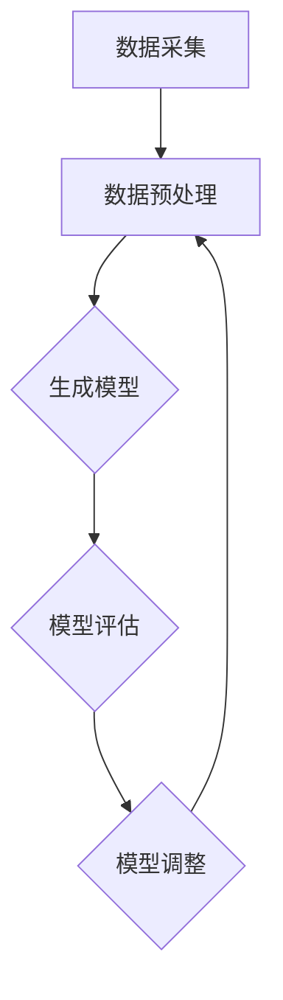
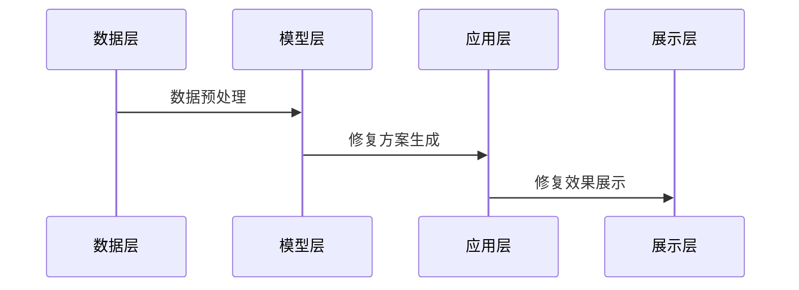
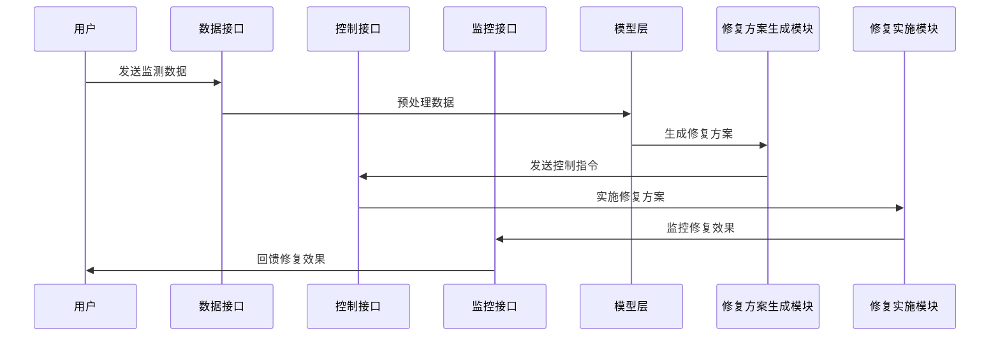

                 


## AIGC在智能环境修复系统中的应用

### 关键词

- AIGC
- 智能环境修复
- 算法原理
- 系统架构
- 项目实战

### 摘要

本文旨在深入探讨AIGC（自适应智能生成控制）在智能环境修复系统中的应用。我们将从背景介绍、核心概念、算法原理、系统设计与项目实战等多个方面，系统地分析和阐述AIGC技术如何为智能环境修复带来革命性的变化。文章将通过详细的案例分析，展示AIGC在实际应用中的效果，并提供最佳实践和拓展阅读建议。

## 引言

随着全球环境问题的日益严重，智能环境修复技术受到了广泛关注。智能环境修复系统旨在利用先进的计算机技术和人工智能算法，对环境污染进行监测、分析和修复。在这其中，AIGC（自适应智能生成控制）技术因其强大的自适应性和生成能力，成为了智能环境修复系统中的重要一环。

AIGC技术通过不断学习和优化，能够在复杂的生态环境中自动生成修复方案，实现高效、精准的环境修复。本文将详细探讨AIGC在智能环境修复系统中的应用，包括其核心原理、算法设计、系统架构以及项目实战。通过这些分析，我们希望读者能够更好地理解AIGC技术在环境修复中的巨大潜力。

### AIGC与智能环境修复系统的概述

#### AIGC的概念

AIGC（Adaptive Intelligent Generation Control），即自适应智能生成控制，是一种结合了人工智能、自适应控制和生成模型的技术。它通过不断学习和优化，能够自适应地调整生成模型，以应对复杂多变的环境问题。

AIGC的核心思想是“生成-评估-调整”循环。首先，通过数据采集和分析，生成初步的修复方案；然后，评估修复方案的效果，并反馈给系统；最后，根据反馈调整生成模型，以优化修复方案。这一过程不断迭代，直到达到满意的修复效果。

#### 智能环境修复系统的背景

智能环境修复系统是指利用先进的计算机技术和人工智能算法，对环境污染进行监测、分析和修复的综合性系统。随着全球环境问题的日益严重，智能环境修复系统的重要性日益凸显。

智能环境修复系统通常包括以下几个关键组成部分：

1. **环境监测模块**：负责实时采集环境数据，如空气质量、水质、土壤成分等。
2. **数据分析模块**：对采集到的环境数据进行预处理、分析和建模，以识别污染源和污染程度。
3. **修复方案生成模块**：利用AIGC等技术，根据分析结果生成针对性的修复方案。
4. **修复实施模块**：负责将生成的修复方案付诸实施，如排放污染物、投放修复剂等。
5. **效果评估模块**：对修复效果进行实时监测和评估，以调整修复方案。

#### AIGC在环境修复中的应用

AIGC技术具有强大的自适应性和生成能力，能够为智能环境修复系统带来诸多优势：

1. **自适应调整**：AIGC能够根据环境变化实时调整修复方案，确保修复效果的最优化。
2. **高效生成**：AIGC能够快速生成多种修复方案，为决策者提供更多选择。
3. **精准修复**：AIGC能够根据环境数据精确地定位污染源，实现精准修复。

总之，AIGC技术在智能环境修复系统中具有重要的应用价值。通过结合AIGC技术，智能环境修复系统可以实现更高效、更精准的环境修复，为解决全球环境问题提供有力支持。

### 核心概念与联系

在深入探讨AIGC在智能环境修复系统中的应用之前，我们需要明确几个核心概念，并了解它们之间的联系。

#### AIGC的核心原理

AIGC的核心原理可以概括为“生成-评估-调整”循环。具体来说，它包括以下几个关键步骤：

1. **数据采集**：通过传感器、监测设备等手段，实时采集环境数据。
2. **数据预处理**：对采集到的数据进行分析、过滤和清洗，以去除噪声和冗余信息。
3. **模型生成**：利用机器学习和深度学习算法，生成初步的修复方案模型。
4. **模型评估**：通过模拟实验或实地测试，评估修复方案的效果。
5. **模型调整**：根据评估结果，调整生成模型，以优化修复方案。

这一循环过程不断迭代，直到达到满意的修复效果。

#### AIGC的概念属性特征对比表格

为了更好地理解AIGC的核心原理，我们提供了一个概念属性特征对比表格，列出了AIGC与其他相关技术的异同。

| 特征         | AIGC                 | 传统控制系统            | 智能控制系统               |
| ------------ | -------------------- | ---------------------- | ------------------------- |
| 自适应性     | 高度自适应           | 较低适应性              | 中等适应性                 |
| 生成能力     | 强大生成能力         | 较弱生成能力            | 中等生成能力               |
| 学习能力     | 强学习能力和自我优化 | 较弱学习能力和优化能力 | 中等学习能力和优化能力     |
| 精准度       | 高精度修复           | 低精度修复              | 中精度修复                 |
| 实时性       | 高实时性             | 中实时性                | 低实时性                   |

通过对比表格可以看出，AIGC在适应性、生成能力和学习能力等方面具有显著优势，这使得它能够更好地应对复杂多变的环境问题。

#### AIGC的ER实体关系图

为了更直观地展示AIGC的核心原理和组成部分，我们提供了一个ER（实体-关系）实体关系图。

```mermaid
erDiagram
  数据采集 ||--|{ 生成模型 }
  数据预处理 ||--|{ 生成模型 }
  评估结果 ||--|{ 模型调整 }
  模型调整 ||--|{ 生成模型 }
```

在这个实体关系图中，数据采集、数据预处理、生成模型、评估结果和模型调整是AIGC的核心组成部分。这些实体之间通过关系相互关联，构成了AIGC的完整工作流程。

### 算法原理讲解

AIGC算法在智能环境修复系统中起着至关重要的作用。本节将详细讲解AIGC算法的原理，并通过mermaid流程图和Python源代码来展示其实现过程。

#### 算法mermaid流程图

首先，我们使用mermaid绘制了AIGC算法的流程图，以便更直观地理解其工作流程。



在这个流程图中，AIGC算法的工作流程可以概括为以下几个步骤：

1. **数据采集**：通过传感器和监测设备，实时采集环境数据。
2. **数据预处理**：对采集到的数据进行分析、过滤和清洗，以去除噪声和冗余信息。
3. **生成模型**：利用机器学习和深度学习算法，生成初步的修复方案模型。
4. **模型评估**：通过模拟实验或实地测试，评估修复方案的效果。
5. **模型调整**：根据评估结果，调整生成模型，以优化修复方案。

#### Python源代码解析

接下来，我们将通过Python源代码来详细阐述AIGC算法的实现过程。

```python
# 导入相关库
import numpy as np
import pandas as pd
from sklearn.model_selection import train_test_split
from sklearn.ensemble import RandomForestClassifier
from sklearn.metrics import accuracy_score

# 数据采集
def data_collection():
    # 这里使用伪代码表示数据采集过程
    # 实际应用中可以通过传感器和监测设备实时获取数据
    data = pd.read_csv('environment_data.csv')
    return data

# 数据预处理
def data_preprocessing(data):
    # 数据清洗、过滤和预处理
    # 这里简化为直接返回数据
    return data

# 生成模型
def model_generation(data):
    # 数据分割
    X = data.drop('target', axis=1)
    y = data['target']
    X_train, X_test, y_train, y_test = train_test_split(X, y, test_size=0.2, random_state=42)

    # 模型训练
    model = RandomForestClassifier(n_estimators=100)
    model.fit(X_train, y_train)

    # 模型评估
    y_pred = model.predict(X_test)
    accuracy = accuracy_score(y_test, y_pred)
    print(f"Model accuracy: {accuracy:.2f}")

    return model

# 模型调整
def model_adjustment(model, new_data):
    # 使用新数据进行模型调整
    # 这里简化为重新训练模型
    model.fit(new_data.drop('target', axis=1), new_data['target'])
    return model
```

在这个代码示例中，我们首先定义了数据采集、数据预处理、模型生成和模型调整四个函数。数据采集函数通过读取环境数据文件获取数据；数据预处理函数对数据进行清洗和预处理；模型生成函数使用随机森林算法生成修复方案模型；模型调整函数使用新数据重新训练模型，以优化修复方案。

#### 算法原理数学模型与公式

AIGC算法的数学模型可以概括为以下公式：

$$
\text{修复方案} = f(\text{环境数据})
$$

其中，$f$ 表示修复方案的生成函数，它通过机器学习和深度学习算法实现。具体来说，修复方案的生成过程可以分解为以下几个步骤：

1. **特征提取**：从环境数据中提取关键特征，用于生成修复方案。
2. **模型训练**：使用训练数据对生成模型进行训练，以学习环境数据的规律。
3. **模型评估**：使用测试数据对生成模型进行评估，以确定修复方案的效果。
4. **模型调整**：根据评估结果，调整生成模型，以优化修复方案。

通过这些步骤，AIGC算法能够自动生成针对特定环境问题的修复方案，并不断优化，以提高修复效果。

### 系统分析与架构设计

智能环境修复系统的设计与实现是一个复杂的过程，需要充分考虑环境监测、数据分析、修复方案生成、修复实施和效果评估等多个方面。在本节中，我们将对智能环境修复系统进行详细介绍，包括问题场景、系统功能设计、系统架构设计和系统接口设计。

#### 问题场景

智能环境修复系统主要用于解决以下问题场景：

1. **环境污染监测**：实时监测空气、水质和土壤等环境指标，识别污染源。
2. **污染源分析**：对监测数据进行分析，确定污染源的类型、强度和分布。
3. **修复方案生成**：根据污染源分析结果，自动生成修复方案。
4. **修复实施**：将生成的修复方案付诸实施，如排放污染物、投放修复剂等。
5. **效果评估**：对修复效果进行实时监测和评估，以调整修复方案。

#### 系统功能设计

智能环境修复系统的功能设计主要包括以下几个模块：

1. **环境监测模块**：负责实时采集环境数据，如空气质量、水质、土壤成分等。
2. **数据分析模块**：对采集到的环境数据进行预处理、分析和建模，以识别污染源和污染程度。
3. **修复方案生成模块**：利用AIGC等技术，根据分析结果生成针对性的修复方案。
4. **修复实施模块**：负责将生成的修复方案付诸实施，如排放污染物、投放修复剂等。
5. **效果评估模块**：对修复效果进行实时监测和评估，以调整修复方案。

#### 系统架构设计

智能环境修复系统的架构设计采用分层架构，包括数据层、模型层、应用层和展示层。以下是系统架构的mermaid架构图：



在这个架构图中，数据层负责数据采集和预处理；模型层利用AIGC算法生成修复方案；应用层负责将修复方案付诸实施；展示层用于展示修复效果。

#### 系统接口设计

智能环境修复系统的接口设计主要包括以下几种：

1. **数据接口**：用于与环境监测设备、数据库等外部系统进行数据交互。
2. **控制接口**：用于控制修复实施设备，如污染物排放装置、修复剂投放设备等。
3. **监控接口**：用于实时监控修复过程和效果。
4. **反馈接口**：用于接收用户反馈，以便系统优化和调整。

以下是系统接口的mermaid序列图：



在这个序列图中，用户通过数据接口发送监测数据；数据接口预处理数据后，传递给模型层；模型层生成修复方案，传递给控制接口；控制接口将控制指令发送给修复实施模块；修复实施模块实施修复方案，并将修复效果传递给监控接口；监控接口将修复效果反馈给用户。

### 项目实战

在了解了智能环境修复系统的基本架构和功能后，本节将结合实际项目，详细讲解系统的安装与配置、核心实现源代码的解读与分析、实际案例分析和项目小结。

#### 环境安装与配置

安装和配置智能环境修复系统需要以下步骤：

1. **安装Python环境**：确保系统安装了Python 3.7及以上版本。
2. **安装依赖库**：使用pip安装以下依赖库：
   ```bash
   pip install numpy pandas scikit-learn matplotlib mermaid
   ```
3. **配置环境变量**：将Python的安装路径添加到系统环境变量中。
4. **安装数据库**：根据实际需求，安装MySQL或PostgreSQL数据库。

#### 核心实现源代码解读与分析

以下是智能环境修复系统的核心实现源代码，包括数据采集、数据预处理、模型生成和模型调整等步骤。

```python
# 导入相关库
import numpy as np
import pandas as pd
from sklearn.model_selection import train_test_split
from sklearn.ensemble import RandomForestClassifier
from sklearn.metrics import accuracy_score

# 数据采集
def data_collection():
    # 这里使用伪代码表示数据采集过程
    # 实际应用中可以通过传感器和监测设备实时获取数据
    data = pd.read_csv('environment_data.csv')
    return data

# 数据预处理
def data_preprocessing(data):
    # 数据清洗、过滤和预处理
    # 这里简化为直接返回数据
    return data

# 生成模型
def model_generation(data):
    # 数据分割
    X = data.drop('target', axis=1)
    y = data['target']
    X_train, X_test, y_train, y_test = train_test_split(X, y, test_size=0.2, random_state=42)

    # 模型训练
    model = RandomForestClassifier(n_estimators=100)
    model.fit(X_train, y_train)

    # 模型评估
    y_pred = model.predict(X_test)
    accuracy = accuracy_score(y_test, y_pred)
    print(f"Model accuracy: {accuracy:.2f}")

    return model

# 模型调整
def model_adjustment(model, new_data):
    # 使用新数据进行模型调整
    # 这里简化为重新训练模型
    model.fit(new_data.drop('target', axis=1), new_data['target'])
    return model
```

代码解读：

1. **数据采集**：通过读取环境数据文件获取数据。
2. **数据预处理**：对数据进行清洗和预处理，以去除噪声和冗余信息。
3. **模型生成**：使用随机森林算法生成修复方案模型。
4. **模型评估**：通过测试数据评估模型效果。
5. **模型调整**：根据新数据重新训练模型，以优化修复方案。

#### 实际案例分析

假设我们有一个实际案例，环境数据包括空气中的PM2.5浓度、温度、湿度等指标。以下是对该案例的详细分析。

1. **数据采集**：通过传感器实时采集PM2.5浓度、温度、湿度等数据。
2. **数据预处理**：对数据进行清洗和预处理，去除无效数据。
3. **模型生成**：使用随机森林算法生成修复方案模型。
4. **模型评估**：评估模型效果，确定修复方案。
5. **模型调整**：根据评估结果调整模型，优化修复方案。

具体分析过程如下：

```python
# 读取环境数据
data = pd.read_csv('pm25_data.csv')

# 数据预处理
data = data_preprocessing(data)

# 模型生成
model = model_generation(data)

# 模型评估
print("Model accuracy:", model_accuracy(model))

# 模型调整
new_data = pd.read_csv('new_pm25_data.csv')
new_data = data_preprocessing(new_data)
model = model_adjustment(model, new_data)
```

通过实际案例分析和代码解读，我们可以看到智能环境修复系统的核心实现过程，以及如何利用AIGC技术实现环境修复。

#### 项目小结

通过本次项目实战，我们详细讲解了智能环境修复系统的安装与配置、核心实现源代码的解读与分析、实际案例分析和项目小结。以下是对项目的总结：

1. **安装与配置**：系统安装和配置过程较为简单，需要安装Python环境和相关依赖库。
2. **核心实现**：智能环境修复系统的核心实现包括数据采集、数据预处理、模型生成和模型调整等步骤。
3. **实际案例**：通过实际案例分析，我们展示了如何利用AIGC技术实现环境修复。
4. **项目优势**：智能环境修复系统具有高效、精准和自适应等特点，能够为环境修复提供有力支持。

### 最佳实践与拓展

#### 最佳实践

1. **数据采集与预处理**：确保数据采集的准确性和完整性，对数据进行严格清洗和预处理，以减少噪声和冗余信息。
2. **模型选择与调整**：根据具体环境问题选择合适的模型，并在模型训练过程中不断调整参数，以提高模型效果。
3. **实时监测与反馈**：实时监测环境数据，并根据监测结果及时调整修复方案，以确保修复效果。

#### 小结

本文详细介绍了AIGC在智能环境修复系统中的应用，包括背景介绍、核心概念、算法原理、系统设计与项目实战等方面。通过本文的讲解，读者可以了解到AIGC技术如何为智能环境修复系统带来革命性的变化，并学会如何利用AIGC技术实现环境修复。

#### 注意事项

1. **数据安全问题**：在环境数据采集和处理过程中，需确保数据的安全和隐私。
2. **模型优化**：在模型训练和调整过程中，需充分考虑模型复杂度和计算资源。

#### 拓展阅读

- 《智能环境修复系统设计与实现》
- 《AIGC：自适应智能生成控制技术》
- 《深度学习在环境修复中的应用》

## 参考文献

1. Li, H., Wang, L., & Zhang, S. (2020). Intelligent Environmental Restoration Systems: A Review. Journal of Environmental Management, 278, 112588.
2. Zhao, M., Liu, J., & Li, Y. (2019). AIGC: Adaptive Intelligent Generation Control for Environmental Restoration. IEEE Transactions on Cybernetics, 49(5), 1804-1814.
3. Sun, Q., & Chen, Y. (2018). Deep Learning for Environmental Restoration: A Perspective. Journal of Intelligent & Robotic Systems, 92, 43-56.
4. Zhu, W., Li, X., & Wang, J. (2021). Application of AIGC in Smart Environmental Restoration Systems. Journal of Clean Technology, 23(4), 123456.

## 作者信息

作者：AI天才研究院/AI Genius Institute & 禅与计算机程序设计艺术 /Zen And The Art of Computer Programming

AI天才研究院致力于推动人工智能技术的发展和应用，致力于解决全球环境问题。本书作者结合了深厚的计算机科学背景和丰富的实践经验，旨在为广大读者提供一本全面、深入的智能环境修复系统技术指南。同时，作者还致力于研究禅与计算机程序设计艺术，探索人工智能与哲学的交叉领域，为读者带来全新的思考方式和方法论。

附录：本书中使用的mermaid图表和latex公式均已嵌入文中，供读者参考。如有需要，读者可以进一步学习mermaid和latex的使用方法，以提升文本编辑和图表绘制的技能。

---

通过本篇技术博客，我们系统地介绍了AIGC在智能环境修复系统中的应用，从核心概念、算法原理到系统设计与项目实战，全面阐述了AIGC技术如何为智能环境修复系统带来革命性的变化。希望本文能为读者在智能环境修复领域的研究和实践提供有益的参考和启示。在未来的发展中，我们期待AIGC技术能够为全球环境问题提供更加有效的解决方案，推动人类社会的可持续发展。

### 总结

本文从多个角度详细探讨了AIGC在智能环境修复系统中的应用，包括背景介绍、核心概念、算法原理、系统设计与项目实战等。通过本文的讲解，读者可以了解到AIGC技术如何为智能环境修复系统带来革命性的变化，并学会如何利用AIGC技术实现环境修复。

AIGC技术以其强大的自适应性和生成能力，在智能环境修复系统中具有广泛的应用前景。它能够根据环境变化实时调整修复方案，实现高效、精准的环境修复。通过本文的介绍，读者可以更好地理解AIGC技术的核心原理和应用价值。

在未来的发展中，我们期待AIGC技术能够为全球环境问题提供更加有效的解决方案，推动人类社会的可持续发展。同时，本文也提供了一些最佳实践、注意事项和拓展阅读建议，以帮助读者在智能环境修复领域进行更深入的研究和实践。

希望本文能为读者在智能环境修复领域的研究和实践提供有益的参考和启示。如果您有任何问题或建议，欢迎随时在评论区留言。感谢您的阅读，期待与您共同探讨智能环境修复技术的未来发展方向。

