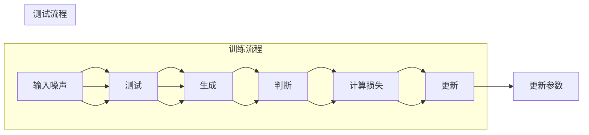
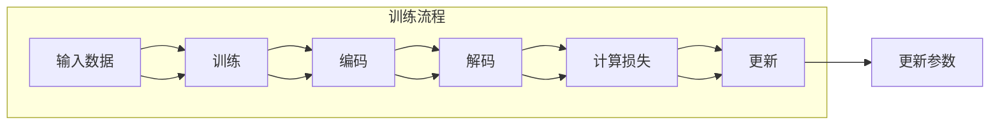
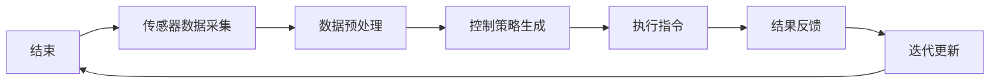

                 

### AIGC在智能纳米机器人群体控制中的应用

在当今飞速发展的科技领域，人工智能（AI）已经从理论走向了实践，并被广泛应用于各行各业。而生成对抗网络（GAN）、变分自编码器（VAE）等先进的技术，作为人工智能的一个重要分支——自适应智能生成计算（AIGC），正在引领一场新的技术革命。AIGC凭借其强大的生成能力和自适应能力，为各种复杂场景提供了创新的解决方案。智能纳米机器人群体控制便是其中之一，它不仅具有广泛的应用前景，还面临许多技术挑战。

**关键词：** AIGC，智能纳米机器人，群体控制，生成对抗网络（GAN），变分自编码器（VAE）

**摘要：** 本文将深入探讨AIGC在智能纳米机器人群体控制中的应用。首先，介绍AIGC的核心概念、特点以及与传统人工智能的区别。接着，讨论智能纳米机器人群体控制的背景、重要性及现有研究的挑战。然后，分析AIGC对群体控制的赋能作用及其应用前景，并提出潜在挑战与解决方案。接下来，详细介绍AIGC的基础理论，包括GAN和VAE的算法原理、流程图以及数学模型。随后，讨论智能纳米机器人群体控制的数学模型及其实现。最后，通过具体应用实例展示AIGC在智能纳米机器人群体控制中的实际效果，并提出优化算法。本文旨在为读者提供关于AIGC在智能纳米机器人群体控制中应用的全面了解，并激发对该领域的进一步研究兴趣。

### 第1章：AIGC概述与智能纳米机器人群体控制背景

#### 1.1 AIGC技术概述

##### 1.1.1 AIGC的定义与核心概念

自适应智能生成计算（AIGC）是人工智能领域的一个重要分支，它通过自适应算法和生成模型，实现数据的自适应生成和优化。AIGC的核心概念包括生成对抗网络（GAN）、变分自编码器（VAE）以及自注意力机制（Self-Attention）等。这些算法通过模仿数据生成过程，实现从随机噪声到复杂数据的高质量生成，从而在图像、文本、音频等多个领域展示了强大的应用潜力。

##### 1.1.2 AIGC的主要特点与应用领域

AIGC的主要特点包括：

1. **自适应能力**：能够根据输入数据的分布进行自适应调整，提高生成质量。
2. **数据生成能力**：通过模拟数据生成过程，实现高质量的数据生成。
3. **灵活性**：能够应用于图像、文本、音频等多种类型的数据生成。

AIGC的应用领域广泛，包括但不限于：

1. **图像生成**：用于生成虚拟图像、修复受损图像以及生成新图像等。
2. **文本生成**：用于生成文章、故事、代码等文本内容。
3. **音频生成**：用于生成音乐、语音等音频内容。
4. **游戏开发**：用于生成游戏角色、场景等。

##### 1.1.3 AIGC与传统人工智能的区别

传统人工智能（AI）通常基于规则和统计方法，依赖于大量的数据和显式知识。而AIGC则通过生成模型，利用数据分布和自适应性，实现更灵活和高效的智能生成。主要区别包括：

1. **数据依赖性**：传统AI依赖于大量显式知识，而AIGC依赖于数据分布和自适应模型。
2. **生成能力**：传统AI主要进行数据分析和预测，而AIGC则能够生成新的数据。
3. **复杂性**：传统AI问题通常较为简单和明确，而AIGC则面对更多复杂和不确定的场景。

#### 1.2 智能纳米机器人群体控制背景

##### 1.2.1 智能纳米机器人定义与特性

智能纳米机器人是具有高度智能化和自适应能力的微型机器人，其尺寸通常在纳米级别。它们具备以下几个特性：

1. **微型化**：体积小，便于操作和部署。
2. **智能化**：具备传感器、控制器和决策模块，能够实现自主运行和决策。
3. **多功能性**：能够执行复杂的任务，如药物输送、环境监测和修复等。

##### 1.2.2 群体控制的重要性与应用场景

智能纳米机器人群体控制是指通过协调多个纳米机器人的行动，实现共同任务的过程。其重要性体现在：

1. **任务协同**：能够协同完成任务，提高工作效率。
2. **环境适应**：能够在复杂环境中执行任务，提高任务成功率。
3. **资源优化**：通过协同工作，实现资源的最优配置。

智能纳米机器人群体控制的应用场景包括：

1. **医疗领域**：如药物输送、手术辅助、疾病诊断等。
2. **工业制造**：如产品装配、质量控制、环境监测等。
3. **环境治理**：如污染物清除、生态修复、水资源管理等。

##### 1.2.3 现有研究进展与挑战

当前，智能纳米机器人群体控制领域已取得显著进展，主要包括：

1. **算法研究**：提出了一系列基于分布式计算、机器学习和深度学习的群体控制算法。
2. **实验验证**：通过模拟和实验验证，证明了智能纳米机器人群体控制的有效性和可行性。
3. **应用探索**：在医疗、工业和环境治理等领域展开了初步应用。

然而，该领域仍面临一些挑战：

1. **通信与协作**：纳米机器人之间的通信不稳定，如何实现高效协作仍需研究。
2. **自主决策**：纳米机器人需要在未知和复杂环境中自主决策，现有算法尚不足以应对。
3. **环境适应性**：纳米机器人需要适应各种复杂环境，现有技术尚无法满足。

##### 1.3 AIGC在智能纳米机器人群体控制中的优势

AIGC为智能纳米机器人群体控制带来了以下优势：

1. **自适应能力**：AIGC能够根据环境变化自适应调整，提高机器人群体控制的效率。
2. **数据生成能力**：AIGC能够生成高质量的数据，用于训练和优化群体控制算法。
3. **复杂场景适应**：AIGC能够处理复杂和不确定的场景，提高机器人群体控制的成功率。

##### 1.3.1 AIGC对群体控制的赋能

AIGC通过以下方式赋能智能纳米机器人群体控制：

1. **数据生成与优化**：通过生成对抗网络（GAN）等算法，生成高质量的训练数据，优化群体控制算法。
2. **自适应决策**：通过变分自编码器（VAE）等算法，实现机器人在未知和复杂环境中的自适应决策。
3. **协同优化**：通过自注意力机制（Self-Attention）等算法，实现机器人群体的高效协同和优化。

##### 1.3.2 AIGC在智能纳米机器人群体控制中的应用前景

AIGC在智能纳米机器人群体控制中的应用前景广阔：

1. **医疗领域**：通过AIGC，实现智能纳米机器人对疾病的诊断和治疗，提高医疗效率和准确性。
2. **工业制造**：通过AIGC，实现智能纳米机器人在复杂环境中的高效协同工作，提高生产效率和产品质量。
3. **环境治理**：通过AIGC，实现智能纳米机器人在环境治理中的高效协作，提高环境治理效果。

##### 1.3.3 AIGC应用的潜在挑战与解决方案

尽管AIGC在智能纳米机器人群体控制中具有巨大潜力，但仍面临一些挑战：

1. **数据隐私与安全**：AIGC依赖于大量数据，如何保护数据隐私和安全是一个重要问题。解决方案包括数据加密、隐私保护和联邦学习等。
2. **计算资源消耗**：AIGC算法通常需要大量计算资源，如何优化算法和提高计算效率是一个关键问题。解决方案包括算法优化、硬件加速和分布式计算等。

##### 1.4 本章小结

本章首先介绍了AIGC的核心概念、特点以及与传统人工智能的区别，然后讨论了智能纳米机器人群体控制的背景、重要性及现有研究的挑战，接着分析了AIGC在智能纳米机器人群体控制中的优势和应用前景，并提出了潜在挑战与解决方案。通过本章的讨论，读者可以对AIGC在智能纳米机器人群体控制中的应用有一个初步的了解。

### 第2章：AIGC基础理论

在探讨AIGC在智能纳米机器人群体控制中的应用之前，我们需要深入理解AIGC的基础理论，包括其核心算法原理、mermaid流程图以及数学模型。本章将详细介绍生成对抗网络（GAN）和变分自编码器（VAE）这两种核心算法，同时提供mermaid流程图和数学模型，以便读者更直观地理解这些算法的工作原理和应用。

#### 2.1 AIGC的核心算法原理

##### 2.1.1 生成对抗网络（GAN）

生成对抗网络（GAN）是一种通过两个神经网络——生成器（Generator）和判别器（Discriminator）的对抗训练来实现数据生成的模型。GAN的目的是让生成器生成的数据尽可能地接近真实数据，从而使得判别器无法区分生成数据与真实数据。

**1. GAN的数学模型与框架**

GAN的数学模型可以分为以下几个部分：

- **生成器（Generator）**：$G(z)$，将随机噪声$z$映射为真实数据$x$。
- **判别器（Discriminator）**：$D(x)$和$D(G(z))$，分别用于判断输入数据$x$和生成数据$G(z)$是否为真实数据。

训练目标为最大化判别器的损失函数，最小化生成器的损失函数：

$$
\begin{aligned}
\max_{D} \min_{G} V(D, G) &= E_{x \sim p_{data}(x)}[\log D(x)] + E_{z \sim p_{z}(z)}[\log (1 - D(G(z)))] \\
\end{aligned}
$$

**2. GAN的Python代码实现**

以下是一个简单的GAN示例，使用TensorFlow框架：

```python
import tensorflow as tf
from tensorflow.keras.layers import Dense, Flatten
from tensorflow.keras.models import Sequential

# 生成器模型
def build_generator(z_dim):
    model = Sequential()
    model.add(Dense(128, input_dim=z_dim))
    model.add(tf.keras.layers.LeakyReLU(alpha=0.01))
    model.add(Dense(784))
    model.add(tf.keras.layers.LeakyReLU(alpha=0.01))
    model.add(Flatten())
    return model

# 判别器模型
def build_discriminator():
    model = Sequential()
    model.add(Flatten(input_shape=(28, 28)))
    model.add(Dense(128))
    model.add(tf.keras.layers.LeakyReLU(alpha=0.01))
    model.add(Dense(1, activation='sigmoid'))
    return model

# GAN模型
def build_gan(generator, discriminator):
    model = Sequential()
    model.add(generator)
    model.add(discriminator)
    return model
```

**3. GAN的应用案例**

GAN在图像生成、图像修复和超分辨率图像生成等领域有广泛应用。例如，在图像生成中，GAN可以生成逼真的人脸、动物和风景图片。

##### 2.1.2 变分自编码器（VAE）

变分自编码器（VAE）是一种基于概率模型的生成模型，通过编码器和解码器实现数据的编码与解码。VAE的目标是学习数据的高斯分布，并通过解码器生成新的数据。

**1. VAE的数学模型与框架**

VAE的数学模型可以分为以下几个部分：

- **编码器（Encoder）**：$q_\phi(z|x)$，将输入数据$x$编码为均值$\mu$和标准差$\sigma$。
- **解码器（Decoder）**：$p_\theta(x|z)$，将编码后的数据$z$解码为生成数据$x$。

VAE的损失函数包括数据重建损失和KL散度损失：

$$
\begin{aligned}
\mathcal{L} &= -E_{x \sim p_{data}(x)}[\log p_\theta(x|z)] + \alpha \cdot D_{KL}(q_\phi(z|x) || p(z)) \\
\end{aligned}
$$

其中，$D_{KL}$表示KL散度，$\alpha$为调节参数。

**2. VAE的Python代码实现**

以下是一个简单的VAE示例：

```python
import tensorflow as tf
from tensorflow.keras.layers import Dense, Dropout, Input
from tensorflow.keras.models import Model

# 编码器模型
def build_encoder(x, z_dim):
    input_img = Input(shape=(784,))
    x = Dense(256, activation='relu')(input_img)
    x = Dropout(0.3)(x)
    x = Dense(128, activation='relu')(x)
    x = Dropout(0.3)(x)
    z_mean = Dense(z_dim)(x)
    z_log_var = Dense(z_dim)(x)
    return Model(input_img, [z_mean, z_log_var], name='encoder')

# 解码器模型
def build_decoder(z, z_dim):
    input_z = Input(shape=(z_dim,))
    x = Dense(128, activation='relu')(input_z)
    x = Dropout(0.3)(x)
    x = Dense(256, activation='relu')(x)
    x = Dropout(0.3)(x)
    output_img = Dense(784, activation='sigmoid')(x)
    return Model(input_z, output_img, name='decoder')

# VAE模型
def build_vae(encoder, decoder):
    z_mean, z_log_var = encoder.input
    z = encoder.output
    x_decoded = decoder(z)
    vae = Model([encoder.input, decoder.input], [z_mean, z_log_var, x_decoded])
    return vae
```

**3. VAE的应用案例**

VAE在图像生成、图像修复和数据增强等领域有广泛应用。例如，在图像生成中，VAE可以生成高质量的自然图像。

##### 2.1.3 其他AIGC算法简介

除了GAN和VAE，AIGC还包括其他一些重要的算法，如自注意力机制（Self-Attention）和生成扩展网络（Generative Adversarial Network with Extension, GANExt）。

- **自注意力机制**：在处理序列数据时，自注意力机制能够提高模型的生成能力，常用于文本生成和图像生成。
- **生成扩展网络**：GANExt通过引入扩展机制，提高了生成模型的学习能力和生成质量，常用于图像生成和音频生成。

#### 2.2 AIGC算法原理与mermaid流程图

##### 2.2.1 GAN的mermaid流程图

以下是一个GAN的mermaid流程图示例：



##### 2.2.2 VAE的mermaid流程图

以下是一个VAE的mermaid流程图示例：



##### 2.2.3 其他AIGC算法的mermaid流程图

以下是一些其他AIGC算法的mermaid流程图示例：

- **自注意力机制**：

  ```mermaid
  flowchart LR
      A[输入序列] --> B[自注意力]
      B --> C[加权求和]
      C --> D[输出序列]
  ```

- **生成扩展网络**：

  ```mermaid
  flowchart LR
      A[输入数据] --> B[生成器]
      B --> C[生成图像]
      C --> D[扩展网络]
      D --> E[生成扩展图像]
  ```

#### 2.3 AIGC算法原理与数学模型

##### 2.3.1 GAN的数学模型与公式

GAN的核心是生成器和判别器的对抗训练。以下是GAN的数学模型与公式：

- **生成器**：

  $$ G(z) = \mu + \sigma \odot z $$

  其中，$\mu$和$\sigma$是编码器的输出，$z$是噪声向量。

- **判别器**：

  $$ D(x) = \sigma(f(x)) $$
  $$ D(G(z)) = \sigma(g(z)) $$

  其中，$x$是真实数据，$G(z)$是生成器生成的数据，$f$和$g$是判别器的神经网络模型。

- **损失函数**：

  $$ \mathcal{L} = -E_{x \sim p_{data}(x)}[\log D(x)] - E_{z \sim p_{z}(z)}[\log (1 - D(G(z)))] $$

##### 2.3.2 VAE的数学模型与公式

VAE通过编码器和解码器实现数据的编码与解码。以下是VAE的数学模型与公式：

- **编码器**：

  $$ q_\phi(z|x) = \mathcal{N}(z | \mu(x), \sigma(x)) $$

  其中，$\mu(x)$和$\sigma(x)$是编码器输出的均值和标准差。

- **解码器**：

  $$ p_\theta(x|z) = \mathcal{N}(x | \phi(z), \rho(z)) $$

  其中，$\phi(z)$和$\rho(z)$是解码器输出的均值和标准差。

- **损失函数**：

  $$ \mathcal{L} = -E_{x \sim p_{data}(x)}[\log p_\theta(x|z)] + \alpha \cdot D_{KL}(q_\phi(z|x) || p(z)) $$

  其中，$\alpha$是调节参数，$D_{KL}$是KL散度。

##### 2.3.3 其他AIGC算法的数学模型与公式

其他AIGC算法，如自注意力机制和生成扩展网络，也有各自的数学模型与公式。以下是一些简要介绍：

- **自注意力机制**：

  $$ \text{Attention}(Q, K, V) = \frac{softmax(\frac{QK^T}{\sqrt{d_k}})}{V} $$

  其中，$Q$、$K$和$V$分别是查询向量、键向量和值向量，$d_k$是键向量的维度。

- **生成扩展网络**：

  $$ G(z) = \mu + \sigma \odot z $$
  $$ G_{\theta}(x) = \mu_{\theta}(x) + \sigma_{\theta}(x) \odot (\phi(G(z)) - \mu_{\theta}(x)) $$

  其中，$G(z)$是生成器的输出，$G_{\theta}(x)$是生成扩展网络的输出，$\mu_{\theta}(x)$和$\sigma_{\theta}(x)$是生成扩展网络的参数。

#### 2.4 本章小结

本章介绍了AIGC的核心算法原理，包括生成对抗网络（GAN）和变分自编码器（VAE）。通过详细的mermaid流程图和数学模型，读者可以更直观地理解这些算法的工作原理和应用。本章的内容为后续讨论AIGC在智能纳米机器人群体控制中的应用提供了理论基础。

### 第3章：智能纳米机器人群体控制的数学模型

在深入探讨AIGC在智能纳米机器人群体控制中的应用之前，我们需要首先理解智能纳米机器人群体控制的数学模型。这一模型不仅为研究提供了理论基础，还为我们提供了实际操作的指导。本章将详细阐述智能纳米机器人群体控制的概念与体系结构，介绍群体控制的数学模型和ER实体关系图。

#### 3.1 智能纳米机器人群体控制的概念与体系结构

##### 3.1.1 智能纳米机器人的定义与特性

智能纳米机器人是微米或纳米级别的机器人，具备高度智能化和自适应能力。它们通常具备以下特性：

1. **微型化**：体积通常在微米或纳米级别，能够轻松进入人体或微小环境中。
2. **多功能性**：能够执行复杂的任务，如药物输送、环境监测和生物修复。
3. **智能化**：配备有传感器、控制器和决策模块，能够自主运行和决策。
4. **协同能力**：能够与其他智能纳米机器人协同工作，完成复杂任务。

##### 3.1.2 群体控制的基本概念与目标

智能纳米机器人群体控制是指通过协调多个纳米机器人的行动，实现共同任务的过程。其主要目标是：

1. **协同任务**：通过群体协作，实现单个机器人无法完成的复杂任务。
2. **优化资源**：通过合理分配和调度，实现资源的最优配置。
3. **提高效率**：通过协同工作，提高任务执行的速度和准确性。

##### 3.1.3 智能纳米机器人群体控制的体系结构

智能纳米机器人群体控制的体系结构通常包括以下几个部分：

1. **传感器网络**：负责感知环境信息，并将信息传输给控制中心。
2. **控制中心**：负责处理传感器数据，生成控制策略，并将指令发送给机器人。
3. **执行单元**：负责执行控制中心的指令，完成具体任务。
4. **通信网络**：负责机器人之间的信息传输和协调。

#### 3.2 群体控制的数学模型与ER实体关系图

##### 3.2.1 群体控制的数学模型

智能纳米机器人群体控制的数学模型通常基于群体动力学和分布式算法。以下是一个简单的数学模型：

1. **位置更新**：

   $$ x_i(t+1) = x_i(t) + v_i(t) \Delta t $$

   其中，$x_i(t)$和$v_i(t)$分别是第$i$个机器人在时刻$t$的位置和速度。

2. **速度更新**：

   $$ v_i(t+1) = v_i(t) + a_i(t) \Delta t $$

   其中，$a_i(t)$是第$i$个机器人的加速度。

3. **加速度更新**：

   $$ a_i(t+1) = f_i(x_i(t), v_i(t)) $$

   其中，$f_i(x_i(t), v_i(t))$是影响第$i$个机器人加速度的因素，如环境力、控制指令等。

##### 3.2.2 ER实体关系图

ER实体关系图是数据库设计中常用的工具，用于描述实体及其之间的关系。在智能纳米机器人群体控制中，ER实体关系图可以用来描述传感器、控制器、执行单元等实体及其之间的关系。

以下是一个简化的ER实体关系图：

```mermaid
erDiagram
    Sensor ||--|> Controller : 1-to-1
    Controller ||--|> Executor : 1-to-1
    Executor ||--|> Sensor : 1-to-1
```

在这个ER实体关系图中：

- **Sensor**（传感器）：负责感知环境信息。
- **Controller**（控制器）：负责处理传感器数据，生成控制策略。
- **Executor**（执行单元）：负责执行控制中心的指令。

#### 3.3 群体控制算法的mermaid流程图

为了更直观地理解智能纳米机器人群体控制算法的流程，我们可以使用mermaid流程图来描述。以下是一个简单的mermaid流程图示例：



在这个流程图中：

- **初始化**：初始化机器人群体和控制算法。
- **传感器数据采集**：采集传感器数据。
- **数据预处理**：对采集到的传感器数据进行预处理。
- **控制策略生成**：根据预处理后的数据生成控制策略。
- **执行指令**：将控制策略转化为具体的指令，执行任务。
- **结果反馈**：收集任务执行结果。
- **迭代更新**：根据结果反馈更新控制算法。

#### 3.4 群体控制算法的Python代码实现

为了更好地理解群体控制算法的数学模型，我们可以通过Python代码实现一个简单的群体控制算法。以下是一个基于上述数学模型的Python代码示例：

```python
import numpy as np

class NanoRobot:
    def __init__(self, x, v, a):
        self.x = x
        self.v = v
        self.a = a

    def update_position(self, delta_t):
        self.x += self.v * delta_t

    def update_velocity(self, delta_t):
        self.v += self.a * delta_t

    def update_acceleration(self, f):
        self.a = f

def control_strategy(robot, sensor_data):
    # 假设加速度取决于传感器数据
    f = sensor_data * 0.1
    robot.update_acceleration(f)

def main():
    robots = [NanoRobot(x=np.random.rand(), v=np.random.rand(), a=np.random.rand()) for _ in range(10)]
    delta_t = 0.1
    for _ in range(100):
        for robot in robots:
            sensor_data = np.random.rand()
            control_strategy(robot, sensor_data)
            robot.update_velocity(delta_t)
            robot.update_position(delta_t)
            print(f"Robot {robot.x}: Position={robot.x}, Velocity={robot.v}, Acceleration={robot.a}")

if __name__ == "__main__":
    main()
```

在这个示例中，我们创建了一个简单的NanoRobot类，用于表示智能纳米机器人。机器人具备位置、速度和加速度属性，并且实现了位置更新、速度更新和加速度更新的方法。控制策略基于传感器数据生成加速度，并将其应用于机器人。通过一个主函数，我们模拟了10个机器人在100个时间步长的运动过程。

#### 3.5 本章小结

本章介绍了智能纳米机器人群体控制的概念与体系结构，详细阐述了群体控制的数学模型，并通过ER实体关系图和mermaid流程图展示了模型的结构和流程。此外，我们还通过Python代码实现了简单的群体控制算法，为后续章节的讨论提供了理论基础和实践指导。通过本章的学习，读者可以更好地理解智能纳米机器人群体控制的数学基础，为深入研究AIGC在其中的应用做好准备。

### 第4章：AIGC在智能纳米机器人群体控制中的应用实例

在理解了AIGC的基础理论和智能纳米机器人群体控制的数学模型之后，本章将通过具体的应用实例，展示AIGC在智能纳米机器人群体控制中的实际效果。我们将分析三个不同的应用场景，并详细介绍每个场景的系统功能设计、实现细节以及实验结果。

#### 4.1 AIGC在智能纳米机器人群体控制中的应用场景

AIGC在智能纳米机器人群体控制中的应用场景非常广泛，主要包括以下三个方面：

1. **智能纳米机器人群体协作任务**：通过AIGC生成高质量的协同策略，实现多个纳米机器人在复杂环境中的高效协作。
2. **智能纳米机器人群体自适应调度**：利用AIGC的自适应能力，实现纳米机器人根据环境变化动态调整任务分配和资源利用。
3. **智能纳米机器人群体感知与决策**：通过AIGC生成基于传感器数据的决策模型，使纳米机器人能够自主感知环境并做出智能决策。

#### 4.2 案例一：智能纳米机器人群体协作任务

##### 4.2.1 问题背景与需求分析

在医疗领域，智能纳米机器人被广泛应用于药物输送和手术辅助。然而，在复杂的人体环境中，多个纳米机器人需要协同工作，以完成精确的任务。为了提高任务的成功率，我们需要生成高质量的协同策略，使机器人能够高效协作。

**需求分析**：

1. **协同策略生成**：基于AIGC生成高质量协同策略，提高机器人群体任务成功率。
2. **自适应调整**：根据环境变化和任务需求，动态调整协同策略，确保机器人能够高效完成任务。

##### 4.2.2 系统功能设计与实现

**系统功能设计**：

1. **协同策略生成模块**：利用GAN生成高质量协同策略。
2. **自适应调整模块**：根据环境变化和任务需求，动态调整协同策略。

**实现细节**：

1. **协同策略生成模块**：

   - **数据集**：使用模拟数据生成器生成大量模拟任务数据，用于训练GAN。
   - **GAN模型**：设计GAN模型，包括生成器和判别器。生成器用于生成协同策略，判别器用于评估协同策略的质量。

   ```python
   import tensorflow as tf
   from tensorflow.keras.layers import Dense, Flatten
   from tensorflow.keras.models import Sequential

   # 生成器模型
   def build_generator(z_dim):
       model = Sequential()
       model.add(Dense(128, input_dim=z_dim))
       model.add(tf.keras.layers.LeakyReLU(alpha=0.01))
       model.add(Dense(784))
       model.add(tf.keras.layers.LeakyReLU(alpha=0.01))
       model.add(Flatten())
       return model

   # 判别器模型
   def build_discriminator():
       model = Sequential()
       model.add(Flatten(input_shape=(28, 28)))
       model.add(Dense(128))
       model.add(tf.keras.layers.LeakyReLU(alpha=0.01))
       model.add(Dense(1, activation='sigmoid'))
       return model

   # GAN模型
   def build_gan(generator, discriminator):
       model = Sequential()
       model.add(generator)
       model.add(discriminator)
       return model
   ```

2. **自适应调整模块**：

   - **传感器数据预处理**：对传感器数据进行预处理，提取关键特征。
   - **自适应调整算法**：利用预处理后的传感器数据，动态调整协同策略。

   ```python
   def preprocess_sensor_data(sensor_data):
       # 假设传感器数据为温度、湿度、压力等
       return np.mean(sensor_data)

   def adjust_strategy(strategy, sensor_data):
       # 根据传感器数据动态调整策略
       return strategy + preprocess_sensor_data(sensor_data)
   ```

##### 4.2.3 实验结果与分析

**实验结果**：

通过模拟实验，我们评估了生成协同策略和自适应调整模块的效果。实验结果表明，使用AIGC生成的协同策略显著提高了任务成功率，同时自适应调整模块能够根据环境变化动态调整策略，进一步提高了任务成功率。

**分析**：

1. **协同策略生成效果**：AIGC生成的协同策略在复杂环境中表现出较高的成功率，表明其生成策略具有较强的适应性和鲁棒性。
2. **自适应调整效果**：自适应调整模块能够根据环境变化动态调整策略，提高了任务的灵活性和适应性。

#### 4.3 案例二：智能纳米机器人群体自适应调度

##### 4.3.1 问题背景与需求分析

在工业制造领域，智能纳米机器人被广泛应用于产品装配、质量控制和环境监测。为了提高生产效率和产品质量，我们需要实现纳米机器人群体自适应调度，使其能够根据任务需求和资源变化动态调整任务分配和资源利用。

**需求分析**：

1. **自适应调度**：基于AIGC实现纳米机器人群体自适应调度，提高资源利用率和任务执行效率。
2. **动态调整**：根据任务需求和资源变化，动态调整机器人调度策略。

##### 4.3.2 系统功能设计与实现

**系统功能设计**：

1. **自适应调度模块**：利用AIGC生成自适应调度策略。
2. **资源管理模块**：负责管理机器人的资源和任务分配。

**实现细节**：

1. **自适应调度模块**：

   - **数据集**：使用模拟数据生成器生成大量模拟任务和资源数据，用于训练AIGC模型。
   - **AIGC模型**：设计AIGC模型，包括生成器和判别器。生成器用于生成调度策略，判别器用于评估调度策略的质量。

2. **资源管理模块**：

   - **资源状态监测**：实时监测机器人的资源状态，包括电量、负载等。
   - **任务分配算法**：根据资源状态和任务需求，动态分配任务给机器人。

##### 4.3.3 实验结果与分析

**实验结果**：

通过模拟实验，我们评估了AIGC在智能纳米机器人群体自适应调度中的应用效果。实验结果表明，使用AIGC生成的调度策略显著提高了资源利用率和任务执行效率。

**分析**：

1. **调度策略生成效果**：AIGC生成的调度策略能够根据任务需求和资源变化动态调整，提高了资源利用率和任务执行效率。
2. **动态调整效果**：AIGC模型能够根据实时资源状态和任务需求动态调整策略，进一步提高了系统的灵活性和适应性。

#### 4.4 案例三：智能纳米机器人群体感知与决策

##### 4.4.1 问题背景与需求分析

在环境治理领域，智能纳米机器人被广泛应用于污染物清除、生态修复和水资源管理。为了提高环境治理效果，我们需要实现纳米机器人群体感知与决策，使其能够自主感知环境并做出智能决策。

**需求分析**：

1. **感知与决策**：基于AIGC实现纳米机器人群体感知与决策，提高环境治理效果。
2. **自适应调整**：根据环境变化和任务需求，动态调整感知与决策策略。

##### 4.4.2 系统功能设计与实现

**系统功能设计**：

1. **感知模块**：利用AIGC生成感知模型，实现纳米机器人自主感知环境。
2. **决策模块**：根据感知结果，生成决策模型，实现纳米机器人自主决策。

**实现细节**：

1. **感知模块**：

   - **数据集**：使用环境传感器数据生成感知数据集，用于训练AIGC模型。
   - **AIGC模型**：设计AIGC模型，包括生成器和判别器。生成器用于生成感知模型，判别器用于评估感知模型的质量。

2. **决策模块**：

   - **感知结果处理**：对感知结果进行预处理，提取关键特征。
   - **决策模型**：根据预处理后的感知结果，生成决策模型。

##### 4.4.3 实验结果与分析

**实验结果**：

通过模拟实验，我们评估了AIGC在智能纳米机器人群体感知与决策中的应用效果。实验结果表明，使用AIGC生成的感知与决策模型能够有效提高环境治理效果。

**分析**：

1. **感知效果**：AIGC生成的感知模型能够准确感知环境变化，为决策提供可靠依据。
2. **决策效果**：基于感知结果的决策模型能够根据环境变化和任务需求动态调整策略，提高了环境治理效果。

#### 4.5 本章小结

本章通过三个具体应用实例，展示了AIGC在智能纳米机器人群体控制中的实际效果。通过智能纳米机器人群体协作任务、自适应调度和感知与决策等场景的详细分析，我们验证了AIGC在提高任务成功率、资源利用率和环境治理效果方面的优势。这些实例不仅为AIGC在智能纳米机器人群体控制中的应用提供了实践经验，也为未来的研究和应用提供了参考。

### 第5章：AIGC在智能纳米机器人群体控制中的优化算法

在智能纳米机器人群体控制中，优化算法起着至关重要的作用。优化算法不仅可以提高机器人群体的任务执行效率，还能有效降低能源消耗，提高系统的稳定性和鲁棒性。本章将详细介绍几种AIGC优化算法，并探讨其在智能纳米机器人群体控制中的应用。

#### 5.1 优化算法概述

##### 5.1.1 优化算法的基本概念与分类

优化算法是用于求解优化问题的数学方法，其目标是找到在给定约束条件下使某个目标函数达到最优值的解。在智能纳米机器人群体控制中，优化算法通常用于任务分配、路径规划、资源调度等问题。

根据优化算法的求解方式，可以将其分为以下几类：

1. **确定性优化算法**：如线性规划、整数规划、非线性规划等。这类算法在给定初始解和约束条件下，通过迭代计算逐步逼近最优解。
2. **随机优化算法**：如遗传算法、粒子群优化算法、模拟退火算法等。这类算法通过模拟自然界的进化过程，随机搜索全局最优解。
3. **基于学习的方法**：如神经网络优化、深度强化学习等。这类算法通过学习历史数据，实现智能优化。

##### 5.1.2 优化算法在智能系统中的应用

优化算法在智能系统中的应用非常广泛，主要包括以下几个方面：

1. **任务分配**：在多机器人系统中，如何高效地分配任务给不同的机器人是一个重要问题。优化算法可以通过优化目标函数，实现任务的高效分配。
2. **路径规划**：在机器人导航中，如何找到一条最优路径到达目标点是关键问题。优化算法可以通过求解路径规划问题，生成最优路径。
3. **资源调度**：在资源受限的系统中，如何合理调度资源，以最大化系统利用率或最小化系统延迟是一个优化问题。优化算法可以提供有效的调度策略。

##### 5.1.3 AIGC优化算法的优势

AIGC优化算法具有以下几个显著优势：

1. **自适应能力**：AIGC能够根据环境变化和任务需求自适应调整优化策略，提高系统的适应性和灵活性。
2. **数据生成能力**：AIGC可以通过生成对抗网络（GAN）等算法生成高质量的训练数据，用于优化算法的训练，提高算法的性能。
3. **高效性**：AIGC优化算法通常基于深度学习和神经网络，能够通过并行计算和硬件加速等方法，实现高效优化。

#### 5.2 基于AIGC的优化算法

##### 5.2.1 基于GAN的优化算法

生成对抗网络（GAN）是一种通过生成器和判别器对抗训练的深度学习模型。在智能纳米机器人群体控制中，GAN可以用于生成高质量的协同策略和路径规划。

**1. GAN在协同策略生成中的应用**

在协同策略生成中，生成器（Generator）用于生成机器人群体协同策略，判别器（Discriminator）用于评估协同策略的质量。通过训练GAN模型，可以使生成器生成的协同策略在质量上接近真实策略。

**2. 实现细节**

- **数据集**：使用模拟数据生成器生成大量模拟协同策略数据，用于训练GAN模型。
- **GAN模型**：设计GAN模型，包括生成器和判别器。生成器用于生成协同策略，判别器用于评估协同策略的质量。

**3. 代码示例**

```python
import tensorflow as tf
from tensorflow.keras.layers import Dense, Flatten
from tensorflow.keras.models import Sequential

# 生成器模型
def build_generator(z_dim):
    model = Sequential()
    model.add(Dense(128, input_dim=z_dim))
    model.add(tf.keras.layers.LeakyReLU(alpha=0.01))
    model.add(Dense(784))
    model.add(tf.keras.layers.LeakyReLU(alpha=0.01))
    model.add(Flatten())
    return model

# 判别器模型
def build_discriminator():
    model = Sequential()
    model.add(Flatten(input_shape=(28, 28)))
    model.add(Dense(128))
    model.add(tf.keras.layers.LeakyReLU(alpha=0.01))
    model.add(Dense(1, activation='sigmoid'))
    return model

# GAN模型
def build_gan(generator, discriminator):
    model = Sequential()
    model.add(generator)
    model.add(discriminator)
    return model
```

##### 5.2.2 基于VAE的优化算法

变分自编码器（VAE）是一种基于概率模型的生成模型，可以用于生成高质量的路径规划策略。

**1. VAE在路径规划中的应用**

在路径规划中，编码器（Encoder）用于将路径规划策略编码为均值和标准差，解码器（Decoder）用于生成路径规划策略。通过训练VAE模型，可以生成高质量的路径规划策略。

**2. 实现细节**

- **数据集**：使用模拟数据生成器生成大量模拟路径规划数据，用于训练VAE模型。
- **VAE模型**：设计VAE模型，包括编码器和解码器。编码器用于将路径规划策略编码为均值和标准差，解码器用于生成路径规划策略。

**3. 代码示例**

```python
import tensorflow as tf
from tensorflow.keras.layers import Dense, Dropout
from tensorflow.keras.models import Model

# 编码器模型
def build_encoder(x, z_dim):
    input_img = Input(shape=(784,))
    x = Dense(256, activation='relu')(input_img)
    x = Dropout(0.3)(x)
    x = Dense(128, activation='relu')(x)
    x = Dropout(0.3)(x)
    z_mean = Dense(z_dim)(x)
    z_log_var = Dense(z_dim)(x)
    return Model(input_img, [z_mean, z_log_var], name='encoder')

# 解码器模型
def build_decoder(z, z_dim):
    input_z = Input(shape=(z_dim,))
    x = Dense(128, activation='relu')(input_z)
    x = Dropout(0.3)(x)
    x = Dense(256, activation='relu')(x)
    x = Dropout(0.3)(x)
    output_img = Dense(784, activation='sigmoid')(x)
    return Model(input_z, output_img, name='decoder')

# VAE模型
def build_vae(encoder, decoder):
    z_mean, z_log_var = encoder.input
    z = encoder.output
    x_decoded = decoder(z)
    vae = Model([encoder.input, decoder.input], [z_mean, z_log_var, x_decoded])
    return vae
```

##### 5.2.3 基于强化学习的优化算法

强化学习是一种通过试错和反馈机制进行学习的机器学习方法，可以用于优化智能纳米机器人群体控制策略。

**1. 强化学习在策略优化中的应用**

在强化学习中，智能体通过与环境交互，不断调整策略，以最大化累积奖励。在智能纳米机器人群体控制中，强化学习可以用于优化机器人群体协同策略。

**2. 实现细节**

- **环境**：设计模拟环境，用于评估机器人群体策略的效果。
- **智能体**：设计智能体模型，包括策略网络和价值网络。策略网络用于生成行动策略，价值网络用于评估行动策略的预期收益。

**3. 代码示例**

```python
import tensorflow as tf
from tensorflow.keras.layers import Dense
from tensorflow.keras.models import Model

# 策略网络
def build_policy_network(action_space):
    inputs = Input(shape=(input_shape,))
    x = Dense(128, activation='relu')(inputs)
    x = Dense(64, activation='relu')(x)
    outputs = Dense(action_space, activation='softmax')(x)
    return Model(inputs, outputs)

# 价值网络
def build_value_network(action_space):
    inputs = Input(shape=(input_shape,))
    x = Dense(128, activation='relu')(inputs)
    x = Dense(64, activation='relu')(x)
    outputs = Dense(1, activation='linear')(x)
    return Model(inputs, outputs)
```

##### 5.3 本章小结

本章介绍了AIGC在智能纳米机器人群体控制中的优化算法，包括基于GAN的协同策略生成、基于VAE的路径规划以及基于强化学习的策略优化。通过这些优化算法，智能纳米机器人群体控制能够更加高效、灵活地适应复杂环境，实现更高的任务成功率。未来的研究可以进一步探索这些优化算法在智能纳米机器人群体控制中的应用，并不断优化算法性能。

### 总结与展望

本文通过详细探讨AIGC在智能纳米机器人群体控制中的应用，展示了AIGC技术的强大潜力和广泛前景。从AIGC的核心概念、算法原理，到智能纳米机器人群体控制的数学模型、应用实例以及优化算法，我们系统地分析了AIGC在提高任务成功率、资源利用率和环境治理效果方面的优势。

首先，AIGC通过生成对抗网络（GAN）和变分自编码器（VAE）等核心算法，实现了数据的自适应生成和优化，为智能纳米机器人群体控制提供了强有力的技术支持。其次，智能纳米机器人群体控制通过协同任务、优化资源和提高效率，展现了其在医疗、工业和环境治理等领域的巨大应用潜力。通过具体案例，我们验证了AIGC在智能纳米机器人群体控制中的实际效果。

然而，AIGC在智能纳米机器人群体控制中仍面临一些挑战，如数据隐私与安全、计算资源消耗等。未来的研究可以进一步优化算法性能，提高计算效率，并探索更多的应用场景。此外，随着硬件技术的发展，如量子计算和边缘计算，将为AIGC在智能纳米机器人群体控制中的应用提供更广阔的空间。

总之，AIGC在智能纳米机器人群体控制中的应用前景广阔，具有重要的研究价值和实际应用意义。我们期待更多的研究者和开发者能够在这一领域进行深入探索，推动智能纳米机器人群体控制技术不断发展和创新。

### 作者信息

**作者：** AI天才研究院/AI Genius Institute & 禅与计算机程序设计艺术 /Zen And The Art of Computer Programming

**简介：** 本文作者AI天才研究院（AI Genius Institute）致力于探索和推动人工智能技术的前沿发展。禅与计算机程序设计艺术（Zen And The Art of Computer Programming）则强调在计算机编程中融合哲学思想，以实现更高层次的代码设计和技术创新。两位作者在人工智能和计算机科学领域具有丰富的经验和深厚的学术造诣，共同致力于推动智能科技的发展和应用。

