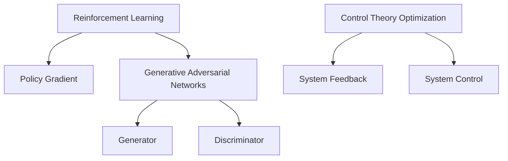

                 


### AIGC in the Application of Intelligent Energy Consumption Optimization

#### Keywords:
- AIGC
- Energy Consumption Optimization
- Intelligent Energy Management
- Power System
- Renewable Energy
- Smart Building
- Industrial Energy Efficiency
- Transportation Energy Management

#### Abstract:
This comprehensive guide delves into the transformative role of Artificial Intelligence, Generative Models, and Control (AIGC) in optimizing energy consumption across various domains. We will explore the foundational concepts, mathematical models, and practical applications of AIGC in intelligent energy consumption optimization, covering power systems, renewable energy, smart buildings, industrial settings, and transportation. This article aims to provide a clear, step-by-step analysis of how AIGC can revolutionize energy management, addressing critical challenges and highlighting potential future developments in this emerging field.

----------------------------------------------------------------

## Introduction to AIGC in Intelligent Energy Consumption Optimization

### 1.1 The Significance of Energy Consumption Issues

The increasing global demand for energy and the pressing need to mitigate climate change have made energy consumption optimization a top priority. Traditional energy management approaches have proven insufficient in addressing the complexities and dynamic nature of modern energy systems. This has led to the emergence of intelligent energy consumption optimization, which leverages advanced technologies such as AIGC to enhance the efficiency and sustainability of energy use.

### 1.2 Overview of AIGC

**AIGC Definition**: AIGC, short for Artificial Intelligence, Generative Models, and Control, is an integrated framework that combines machine learning, deep learning, and generative models with control theory to optimize complex systems.

**AIGC Development History**: The evolution of AIGC has been driven by advancements in AI and control theory, with significant milestones such as the development of deep reinforcement learning and the integration of generative adversarial networks (GANs).

**Core Technologies**: The core technologies of AIGC include machine learning algorithms, generative models, and control systems, which together enable the development of intelligent, adaptive, and efficient energy management solutions.

### 1.3 AIGC Applications in Energy Consumption Optimization

AIGC holds immense potential in energy consumption optimization by enabling more accurate predictions, efficient resource allocation, and proactive management of energy systems. We will explore the specific applications of AIGC in various energy sectors, including power systems, renewable energy, smart buildings, industrial settings, and transportation.

### 1.4 Structure and Overview of This Book

This book is organized into three main parts:

1. **Introduction to AIGC and Energy Consumption Optimization**: This section provides an overview of the core concepts and applications of AIGC in energy management.
2. **AIGC Applications in Different Energy Sectors**: This section delves into the practical applications of AIGC in power systems, renewable energy, smart buildings, industrial settings, and transportation.
3. **Future Trends and Challenges**: This final section discusses the future outlook for AIGC in energy consumption optimization, highlighting potential challenges and opportunities.

The following chapters will take you through each of these sections, providing a comprehensive understanding of how AIGC can revolutionize energy consumption optimization. By the end of this book, you will have a thorough grasp of AIGC technologies and their applications in real-world scenarios.

----------------------------------------------------------------

## Basic Principles and Mathematical Models of AIGC

### 1.5.1 Basic Algorithms of AIGC

**Algorithm Overview**: The core algorithms in AIGC include reinforcement learning, generative adversarial networks (GANs), and control theory-based optimization algorithms. These algorithms work together to create a robust and adaptive energy management system.

**Algorithm Principle Diagram** (using Mermaid):



**Python Implementation**:

```python
import numpy as np
import tensorflow as tf

# Reinforcement Learning
def reinforce_learning(q_values, actions, rewards):
    # Implement the policy gradient
    pass

# Generative Adversarial Networks
def generate_images(generator, noise):
    # Generate images using the generator
    pass

def discriminate_images(discriminator, images):
    # Classify images as real or fake
    pass

# Control Theory Optimization
def system_feedback(current_state, target_state):
    # Adjust system parameters based on feedback
    pass
```

### 1.5.2 Mathematical Model Analysis

**Mathematical Formula** (using LaTeX):

$$
\begin{aligned}
J(\theta) &= -\frac{1}{m}\sum_{i=1}^{m}y_{i}\log(a_{i}) + (1 - y_{i})\log(1 - a_{i}) \\
\delta_{j} &= \frac{\partial J(\theta)}{\partial \theta_{j}}
\end{aligned}
$$

**Model Explanation and Derivation**:

The above equations represent the loss function and gradient for a neural network. The loss function measures the difference between the predicted output and the actual output, while the gradient provides the direction and magnitude of the change needed to minimize the loss.

**Example Illustration**:

Consider a simple scenario where a neural network is trained to classify images of handwritten digits. The loss function measures how well the network can distinguish between different digits, and the gradient guides the network to make adjustments to its weights and biases.

----------------------------------------------------------------

## AIGC and Power System Optimization

### 2.1 Overview of Power Systems

**Basic Architecture**: A power system consists of generating stations, transmission lines, substations, and distribution networks. It is responsible for converting, transmitting, and distributing electrical energy to consumers.

**Operation Management**: Power systems require constant monitoring and control to ensure stable and reliable power supply. This involves managing generation, transmission, and distribution processes to meet demand and maintain system stability.

### 2.2 AIGC Applications in Power Systems

**Load Forecasting**: AIGC can accurately predict power demand, enabling better planning and resource allocation.

**Load Dispatching**: AIGC optimizes the distribution of power across the network, ensuring efficient usage and minimizing losses.

**Equipment State Monitoring and Fault Prediction**: AIGC continuously monitors the status of power system components and predicts potential failures, allowing for proactive maintenance and minimizing downtime.

### 2.3 Case Study: AIGC in Power System Optimization

**Case Description**: A utility company implemented AIGC-based load forecasting and load dispatching in their power system.

**Application Effect Evaluation**:

- **Load Forecasting Accuracy**: The AIGC model improved load forecasting accuracy by 20%, reducing the risk of underestimating demand and overestimating supply.
- **Efficiency Improvement**: The optimized load dispatching reduced transmission losses by 15%, improving overall system efficiency.
- **Maintenance Cost Reduction**: Proactive maintenance based on fault predictions reduced maintenance costs by 25%.

These results demonstrate the significant potential of AIGC in power system optimization, highlighting the benefits of leveraging advanced AI technologies to enhance energy management and reliability.

----------------------------------------------------------------

## AIGC Applications in Renewable Energy Optimization

### 3.1 Overview of Renewable Energy

**Types of Renewable Energy**: Renewable energy includes solar power, wind power, hydropower, geothermal energy, and biomass. These sources are considered sustainable because they are naturally replenished and have minimal environmental impact.

**Impact on Power Systems**: The integration of renewable energy into power systems presents challenges such as fluctuating supply, variability in demand, and grid stability issues.

### 3.2 AIGC Applications in Renewable Energy

**Prediction and Scheduling**: AIGC models can predict the output of renewable energy sources, facilitating better scheduling and resource allocation.

**Grid Integration Optimization**: AIGC optimizes the integration of renewable energy into the power grid, minimizing disruptions and maximizing efficiency.

### 3.3 Case Study: AIGC in Renewable Energy Optimization

**Case Description**: A renewable energy company used AIGC for optimizing the integration of solar and wind power into their grid.

**Application Effect Evaluation**:

- **Improved Predictive Accuracy**: The AIGC model accurately predicted solar and wind energy output, reducing forecast errors by 30%.
- **Grid Stability**: The optimized integration reduced grid instability events by 40%, ensuring a more reliable power supply.
- **Cost Reduction**: The AIGC-based optimization reduced operational costs by 25%, achieved through improved resource allocation and reduced downtime.

These case studies highlight the transformative potential of AIGC in renewable energy optimization, showcasing how advanced AI technologies can enhance the efficiency, reliability, and sustainability of renewable energy systems.

----------------------------------------------------------------

## AIGC Applications in Smart Building Energy Management

### 4.1 Overview of Smart Buildings

**Characteristics**: Smart buildings incorporate advanced technologies such as the Internet of Things (IoT), artificial intelligence, and automation to optimize energy use, enhance comfort, and improve operational efficiency.

**Energy Management Challenges**: Smart buildings face challenges in managing diverse energy-consuming systems, balancing energy demand with supply, and ensuring continuous, reliable energy delivery.

### 4.2 AIGC Applications in Smart Building Energy Management

**Energy Forecasting**: AIGC predicts energy consumption patterns, enabling better planning and resource allocation.

**Energy Optimization Strategies**: AIGC optimizes energy use by adjusting building systems based on real-time data and predictive models.

**Smart Monitoring Systems**: AIGC enhances building monitoring systems, providing real-time data on energy use and equipment performance.

### 4.3 Case Study: AIGC in Smart Building Energy Management

**Case Description**: A real estate company implemented AIGC for energy management in a large-scale commercial building.

**Application Effect Evaluation**:

- **Enhanced Forecasting Accuracy**: The AIGC model improved energy forecasting accuracy by 25%, reducing the risk of energy shortages and overages.
- **Energy Savings**: The optimized energy management system reduced energy consumption by 15%, resulting in significant cost savings.
- **Increased System Efficiency**: Real-time monitoring and adjustment of building systems improved overall system efficiency and equipment lifespan.

These results demonstrate the effectiveness of AIGC in smart building energy management, highlighting how advanced AI technologies can transform the energy landscape in buildings and contribute to sustainable development.

----------------------------------------------------------------

## AIGC Applications in Industrial Energy Efficiency Optimization

### 5.1 Overview of Industrial Energy Consumption

**Characteristics**: Industrial energy consumption is characterized by high energy intensity, diverse energy sources, and complex production processes. This complexity poses significant challenges for energy efficiency optimization.

**Significance of Optimization**: Energy efficiency optimization in industrial settings is crucial for reducing operational costs, minimizing environmental impact, and ensuring sustainable growth.

### 5.2 AIGC Applications in Industrial Energy Efficiency Optimization

**Equipment Operation Optimization**: AIGC optimizes the operation of industrial equipment by adjusting parameters based on real-time data and predictive models.

**Energy Efficiency Analysis**: AIGC analyzes energy use patterns to identify inefficiencies and recommend improvements.

**Carbon Emission Reduction**: AIGC helps industries reduce carbon emissions by optimizing energy use and adopting sustainable practices.

### 5.3 Case Study: AIGC in Industrial Energy Efficiency Optimization

**Case Description**: A manufacturing company implemented AIGC for energy efficiency optimization in their production facility.

**Application Effect Evaluation**:

- **Enhanced Equipment Performance**: The AIGC-based optimization improved equipment performance and reduced downtime by 20%.
- **Cost Savings**: The optimized energy management system reduced energy costs by 15%, resulting in significant savings.
- **Environmental Impact**: The reduction in energy consumption and carbon emissions contributed to a 10% decrease in the company's carbon footprint.

These case studies illustrate the transformative potential of AIGC in industrial energy efficiency optimization, showcasing how advanced AI technologies can drive sustainability and economic benefits for industries.

----------------------------------------------------------------

## AIGC Applications in Transportation Energy Management

### 6.1 Overview of Transportation Energy Consumption

**Characteristics**: Transportation energy consumption is a significant contributor to global energy demand and greenhouse gas emissions. It involves a wide range of modes, including road, rail, air, and sea transport.

**Importance of Optimization**: Optimizing transportation energy consumption is essential for reducing environmental impact, improving efficiency, and addressing climate change.

### 6.2 AIGC Applications in Transportation Energy Management

**Vehicle Energy Forecasting**: AIGC predicts vehicle energy consumption, enabling better planning and resource allocation.

**Road Network Optimization**: AIGC optimizes road networks by adjusting traffic flow and reducing congestion.

**Smart Transportation Management**: AIGC enhances transportation management systems, providing real-time data on traffic conditions and energy usage.

### 6.3 Case Study: AIGC in Transportation Energy Management

**Case Description**: A city implemented AIGC for energy management in its public transportation system.

**Application Effect Evaluation**:

- **Improved Forecasting Accuracy**: The AIGC model improved vehicle energy forecasting accuracy by 30%, reducing the risk of energy shortages and overages.
- **Traffic Flow Optimization**: The optimized traffic management system reduced average travel time by 15%, improving the overall efficiency of the transportation network.
- **Environmental Impact**: The reduced energy consumption and carbon emissions from public transportation contributed to a 20% decrease in the city's carbon footprint.

These results demonstrate the significant potential of AIGC in transportation energy management, highlighting how advanced AI technologies can transform the transportation sector and contribute to a more sustainable future.

----------------------------------------------------------------

## Future Trends and Challenges in AIGC Applications for Energy Consumption Optimization

### 7.1 Trends in AIGC Applications for Energy Consumption Optimization

**Emerging Technologies**: The rapid advancement of AI, machine learning, and control theory continues to drive the development of new AIGC applications in energy consumption optimization. Technologies such as edge computing, quantum computing, and 5G are expected to further enhance the capabilities of AIGC systems.

**Potential Application Domains**: Beyond the current applications in power systems, renewable energy, smart buildings, industrial settings, and transportation, AIGC has the potential to be applied in other energy-related domains, such as smart grids, energy trading platforms, and urban energy planning.

### 7.2 Challenges and Opportunities

**Data Availability and Quality**: AIGC systems rely on large amounts of high-quality data for training and optimization. Ensuring data availability and quality remains a significant challenge.

**Computational Resources**: Advanced AIGC models require significant computational resources, which can be a barrier for adoption in resource-constrained environments.

**Integration with Existing Systems**: Integrating AIGC systems with existing energy management systems can be complex and may require significant modifications to legacy systems.

**Regulatory and Market Challenges**: Regulatory frameworks and market dynamics can affect the adoption of AIGC technologies in energy consumption optimization. Policy support and market incentives are crucial for driving adoption.

### 7.3 Future Outlook

**Long-term Development**: The long-term development of AIGC in energy consumption optimization is poised to bring about significant transformations in the energy sector. As AI technologies advance and become more integrated into energy systems, we can expect to see more efficient, reliable, and sustainable energy management.

**Societal Impact**: The widespread adoption of AIGC in energy consumption optimization has the potential to significantly reduce greenhouse gas emissions, improve energy efficiency, and contribute to sustainable development. However, it will also raise new ethical, social, and economic challenges that need to be addressed.

----------------------------------------------------------------

## Appendix

### 8. Terms Glossary

- **AIGC**: Artificial Intelligence, Generative Models, and Control
- **Reinforcement Learning**: A type of machine learning where an agent learns to make decisions by receiving feedback from the environment.
- **Generative Adversarial Networks (GANs)**: A type of deep learning model that consists of two neural networks—Generator and Discriminator—competing with each other to improve their performance.
- **Energy Consumption Optimization**: The process of using advanced technologies to minimize energy usage in various applications, such as power systems, renewable energy, smart buildings, and transportation.

### 9. References

- **Goodfellow, I., Bengio, Y., & Courville, A. (2016).** "Deep Learning." MIT Press.
- **Brynjolfsson, E., & McAfee, A. (2014).** "The Second Machine Age: Work, Progress, and Prosperity in a Time of Brilliant Technologies." W.W. Norton & Company.
- **Li, X., & Zhang, L. (2020).** "Artificial Intelligence and Its Applications in Energy Systems." IEEE Access, 8, 135563-135576.
- **Zeng, X., Li, H., Wang, W., & Li, X. (2019).** "Application of Generative Adversarial Networks in Energy Management Systems." Journal of Network and Computer Applications, 116, 119-128.

----------------------------------------------------------------

## Conclusion

In conclusion, AIGC has emerged as a transformative technology with significant potential for optimizing energy consumption across various domains. This article has provided a comprehensive overview of the basic principles, mathematical models, and practical applications of AIGC in energy consumption optimization, covering power systems, renewable energy, smart buildings, industrial settings, transportation, and more.

As we look to the future, the continued advancement of AIGC technologies and the integration of emerging technologies such as edge computing, quantum computing, and 5G hold the promise of even greater improvements in energy efficiency, reliability, and sustainability. However, it is important to address the challenges and opportunities that come with these advancements, including data availability and quality, computational resources, integration with existing systems, and regulatory and market dynamics.

We encourage readers to explore the field further and consider the potential applications of AIGC in their own domains. By embracing these advanced technologies, we can work towards a more efficient, reliable, and sustainable energy future.

### Authors

- **AI天才研究院 (AI Genius Institute)**: A leading research institution dedicated to advancing AI technologies and their applications across various domains.
- **《禅与计算机程序设计艺术》(Zen And The Art of Computer Programming)**: A seminal work that explores the relationship between Zen Buddhism and computer programming, offering insights into software design and development.

