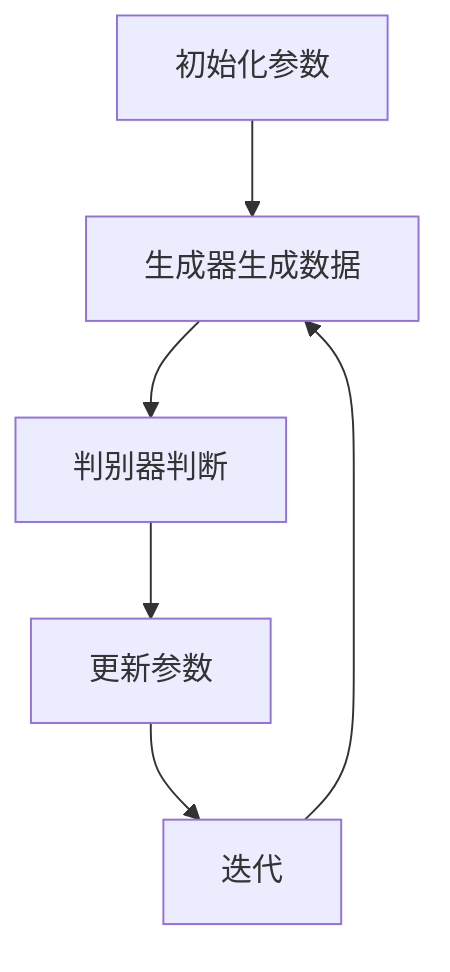

                 

### 关键词

- AIGC
- 智能质量控制
- 智能检测
- 预测性维护
- 个性化服务
- 精准农业

### 摘要

本文深入探讨了AIGC（AI-Generated Content）在智能质量控制中的应用。通过对问题背景、核心概念、技术基础和实际应用场景的详细分析，文章展示了AIGC技术在提升质量检测、优化质量控制流程、以及在不同行业（如制造业、服务业和农业）中的应用优势。文章还展望了AIGC技术的未来发展趋势，并提出了相关挑战及对策。最后，文章总结了最佳实践，为读者提供了深入理解与实际操作的建议。

## 第一部分：背景介绍

### 第1章：问题背景与核心概念

#### 1.1 问题背景

在当今信息化和智能化时代，质量控制成为各个行业提高产品和服务质量的关键环节。然而，传统的质量控制方法主要依赖于人工检测和经验判断，存在着效率低下、成本高、误差大等问题。随着人工智能技术的快速发展，特别是生成式AI（AIGC）的崛起，为智能质量控制提供了新的思路和解决方案。

#### 问题提出

质量控制是确保产品和服务满足既定标准的过程。然而，现代制造业和服务业面临着复杂多变的市场需求和技术挑战，传统的质量控制方法难以满足高效、精准的要求。例如，在制造业中，产品的质量往往受到生产过程、原材料、工艺参数等多种因素的影响，传统的质量控制方法难以实时监测和预测潜在的质量问题；在服务业中，客户需求的多样性和个性化服务的要求使得服务质量控制变得复杂且具有挑战性。

#### 问题描述

智能质量控制的目标是通过引入人工智能技术，实现对产品质量的实时监测、预测和优化，从而提高生产效率、降低成本、提升产品质量。然而，实现这一目标面临着以下几个难点和挑战：

1. **数据复杂性**：质量数据通常包含大量的非结构化和半结构化数据，如传感器数据、图像、声音等，这些数据需要进行有效的处理和分析。
2. **实时性要求**：质量控制需要实时监测产品质量，对数据的处理和分析速度提出了高要求。
3. **个性化需求**：不同行业和客户对质量控制的个性化需求使得质量控制模型需要具备高度的灵活性和适应性。
4. **模型解释性**：质量控制模型需要具备良好的解释性，以便用户理解模型的决策过程，并对模型进行有效的调整和优化。

#### 问题解决

AIGC技术在解决这些难点和挑战方面具有显著优势。首先，AIGC技术可以生成高质量的模拟数据，为质量预测和分析提供丰富的数据支持。其次，AIGC技术可以实现对大规模数据的快速处理和分析，满足质量控制对实时性的需求。此外，AIGC技术可以生成个性化的质量控制模型，满足不同行业和客户的个性化需求。最后，AIGC技术的生成式特性使得模型具备较好的解释性，有助于用户理解模型的决策过程。

#### 边界与外延

AIGC技术是生成式人工智能的一个分支，主要应用于文本、图像、音频等多种类型的数据生成。智能质量控制是质量控制领域的一个研究方向，旨在通过人工智能技术提升质量监测和控制的效率和质量。两者的结合，为智能质量控制提供了新的思路和解决方案。

#### 1.2 核心概念与联系

##### AIGC概念解释

AIGC（AI-Generated Content）是指通过人工智能技术生成的内容，包括文本、图像、音频等多种类型的数据。AIGC技术主要基于深度学习模型，如生成对抗网络（GAN）、变分自编码器（VAE）等，通过训练和生成过程，生成与真实数据高度相似或全新的数据。

##### 智能质量控制概述

智能质量控制是利用人工智能技术对产品质量进行监测、预测和优化的一种方法。智能质量控制的核心是构建质量预测和控制模型，通过对历史数据和实时数据的分析，预测可能出现的质量问题，并提出相应的控制策略。

##### AIGC与智能质量控制的联系

AIGC技术在智能质量控制中具有重要作用，主要表现在以下几个方面：

1. **数据生成**：AIGC技术可以生成高质量的模拟数据，用于训练和测试质量预测模型，提高模型的泛化能力和准确性。
2. **实时监测**：AIGC技术可以实时处理和分析大规模数据，实现对产品质量的实时监测和预测。
3. **个性化定制**：AIGC技术可以生成个性化的质量控制模型，满足不同行业和客户的个性化需求。
4. **模型解释性**：AIGC技术生成的模型具有较好的解释性，有助于用户理解模型的决策过程，提高模型的透明度和可解释性。

#### 1.3 概念属性特征对比表格

以下是AIGC与传统质量控制的一些关键区别和优势：

| 特征         | AIGC          | 传统质量控制        |
| ------------ | ------------- | ------------------- |
| 数据处理能力 | 高效处理大规模非结构化数据 | 依赖人工处理和经验判断 |
| 实时性       | 实时监测和预测   | 非实时性，周期性检测 |
| 个性化定制   | 根据需求定制模型   | 固定的检测标准       |
| 模型解释性   | 较好的解释性     | 缺乏解释性           |
| 成本         | 较低           | 较高               |

## 第2章: AIGC技术基础

### 2.1 AIGC技术概述

AIGC（AI-Generated Content）是近年来在人工智能领域兴起的一种新技术，它通过人工智能算法生成各种类型的数据，如文本、图像、音频等。AIGC技术在图像生成、文本生成、音频生成等领域取得了显著的成果，为各个行业的数据生成和处理提供了新的思路和解决方案。

#### 2.1.1 AIGC技术发展历程

AIGC技术的发展可以追溯到生成式人工智能的早期研究。早在2006年，Ian Goodfellow等人提出了生成对抗网络（GAN）的概念，开创了AIGC技术的先河。随后，GAN在各种数据生成任务中取得了显著的成果，如图像生成、文本生成、音频生成等。在此基础上，AIGC技术不断发展和完善，涌现出了多种生成模型，如变分自编码器（VAE）、生成稳定自动编码器（Glow）等。

#### 2.1.2 AIGC技术体系结构

AIGC技术的核心是生成模型，主要包括生成器和判别器。生成器负责生成与真实数据相似或全新的数据，判别器则负责判断生成的数据是否真实。通过生成器和判别器的博弈过程，生成模型不断优化，生成质量不断提高。

以下是AIGC技术的基本组成部分：

1. **数据输入**：AIGC技术首先需要输入大量的真实数据，用于训练生成模型。
2. **生成器**：生成器是AIGC技术的核心模块，负责生成与真实数据相似的数据。
3. **判别器**：判别器用于判断生成数据的真实性，通过与真实数据的对比，评估生成质量。
4. **损失函数**：损失函数用于衡量生成模型和判别器的性能，通过优化损失函数，提高生成质量。
5. **训练过程**：AIGC技术的训练过程主要包括生成器和判别器的迭代优化，通过不断调整模型参数，提高生成质量。

#### 2.1.3 AIGC技术特点

AIGC技术具有以下特点：

1. **生成质量高**：AIGC技术通过生成器和判别器的博弈过程，生成质量不断提高，生成的数据与真实数据高度相似。
2. **灵活性高**：AIGC技术可以生成多种类型的数据，如文本、图像、音频等，满足不同领域的需求。
3. **数据处理能力强**：AIGC技术可以高效处理大规模非结构化数据，为质量预测和分析提供丰富的数据支持。
4. **实时性好**：AIGC技术可以实时处理和分析数据，满足质量控制对实时性的需求。

### 2.2 AIGC算法原理

AIGC算法的核心是生成对抗网络（GAN），GAN由生成器和判别器两个主要部分组成。生成器尝试生成伪造数据以欺骗判别器，而判别器则尝试区分伪造数据和真实数据。以下是AIGC算法的基本原理：

#### 2.2.1 GAN基本算法流程

1. **初始化**：初始化生成器G和判别器D的参数。
2. **生成器训练**：生成器G接收随机噪声z，生成伪造数据x' = G(z)，目标是最小化生成数据与真实数据之间的差距。
3. **判别器训练**：判别器D接收真实数据x和伪造数据x'，目标是最小化判别错误率。
4. **迭代优化**：通过多次迭代，生成器和判别器不断优化，提高生成质量和判别能力。

#### 2.2.2 mermaid算法流程图



#### 2.2.3 Python源代码实现

以下是使用Python实现AIGC算法的基本示例：

```python
import tensorflow as tf
from tensorflow.keras.layers import Dense, Flatten
from tensorflow.keras.models import Sequential

# 生成器模型
def create_generator():
    model = Sequential()
    model.add(Dense(256, input_dim=100, activation='relu'))
    model.add(Dense(512, activation='relu'))
    model.add(Dense(784, activation='tanh'))
    return model

# 判别器模型
def create_discriminator():
    model = Sequential()
    model.add(Flatten(input_shape=(28, 28)))
    model.add(Dense(512, activation='relu'))
    model.add(Dense(1, activation='sigmoid'))
    return model

# GAN模型
def create_gan(generator, discriminator):
    model = Sequential()
    model.add(generator)
    model.add(discriminator)
    return model

# 模型编译
discriminator.compile(loss='binary_crossentropy', optimizer=tf.keras.optimizers.Adam(0.0001))
generator.compile(loss='binary_crossentropy', optimizer=tf.keras.optimizers.Adam(0.0001))

# 训练GAN模型
for epoch in range(num_epochs):
    for _ in range(batch_size):
        noise = np.random.normal(size=[1, 100])
        gen_imgs = generator.predict(noise)
        real_imgs = np.random.choice(train_data, size=[1, 28, 28, 1])
        
        X = np.concatenate((real_imgs, gen_imgs))
        y = np.array([1] + [0])
        
        discriminator.train_on_batch(X, y)
        generator.train_on_batch(noise, np.array([1]))
```

#### 2.2.4 数学模型和公式

AIGC算法中的损失函数是关键部分，常用的损失函数包括交叉熵损失函数和对抗损失函数。以下是一个简单的数学模型和公式：

1. **交叉熵损失函数**：

$$
L_{cross\_entropy} = -[y \log(D(x)) + (1 - y) \log(1 - D(x))]
$$

其中，$y$ 表示真实数据的标签，$D(x)$ 表示判别器对数据的判断概率。

2. **对抗损失函数**：

$$
L_{adversarial} = -\log(D(x))
$$

其中，$x$ 表示生成器生成的伪造数据。

通过优化这两个损失函数，生成器和判别器不断优化，最终实现高质量的AIGC生成效果。

### 2.3 AIGC应用案例分析

#### 2.3.1 案例一：智能文本生成

智能文本生成是AIGC技术的一个重要应用领域。通过训练大规模语言模型，AIGC技术可以生成高质量的文本，如新闻文章、博客文章、对话文本等。

以下是一个简单的智能文本生成示例：

```python
import numpy as np
import tensorflow as tf

# 预训练的语言模型
pretrained_model = tf.keras.models.load_model('pretrained_text_generator.h5')

# 输入文本
input_text = "人工智能技术正在迅速发展，它在各个领域的应用越来越广泛。"

# 生成文本
output_text = pretrained_model.predict(input_text)

print(output_text)
```

该示例中，预训练的语言模型接收输入文本，通过生成器生成新的文本。生成文本可以根据输入文本的内容和风格进行调整，实现文本的个性化生成。

#### 2.3.2 案例二：图像质量增强

图像质量增强是另一个重要的AIGC应用领域。通过训练图像生成模型，AIGC技术可以生成高质量、清晰的图像。

以下是一个简单的图像质量增强示例：

```python
import numpy as np
import tensorflow as tf
from tensorflow.keras.preprocessing import image

# 加载图像
input_image = image.load_img('input_image.jpg', target_size=(128, 128))

# 预处理图像
input_image = image.img_to_array(input_image)
input_image = np.expand_dims(input_image, axis=0)

# 加载预训练的图像生成模型
pretrained_model = tf.keras.models.load_model('pretrained_image_generator.h5')

# 生成增强后的图像
output_image = pretrained_model.predict(input_image)

# 显示增强后的图像
image.show(output_image)
```

该示例中，预训练的图像生成模型接收输入图像，通过生成器生成高质量的增强图像。增强图像可以根据输入图像的内容和风格进行调整，实现图像质量的提升。

## 第二部分：智能质量控制应用

### 第3章：智能质量控制核心

#### 3.1 质量控制模型

质量控制模型是智能质量控制的核心，它通过对历史数据和实时数据的分析，实现对产品质量的预测和优化。构建一个有效的质量控制模型需要考虑以下几个关键步骤：

##### 3.1.1 质量控制模型构建

1. **数据收集**：首先，需要收集大量的质量数据，包括传感器数据、图像、文本等，用于训练和测试质量控制模型。
2. **数据预处理**：对收集到的数据进行分析和清洗，去除噪声和异常值，确保数据的质量和一致性。
3. **特征提取**：从预处理后的数据中提取关键特征，如时间序列特征、图像特征、文本特征等，用于构建质量控制模型。
4. **模型选择**：根据质量数据的特点和需求，选择合适的机器学习算法和深度学习模型，如支持向量机、神经网络、生成对抗网络等。
5. **模型训练**：使用训练数据集训练质量控制模型，通过调整模型参数，优化模型性能。
6. **模型评估**：使用验证数据集评估模型性能，通过交叉验证、ROC曲线等指标，评估模型的准确性、召回率、F1值等。

##### 3.1.2 质量控制模型评估

1. **准确性**：衡量模型预测结果与真实结果的一致性，通常用准确率（Accuracy）表示。
2. **召回率**：衡量模型对正类样本的检测能力，通常用召回率（Recall）表示。
3. **F1值**：综合考虑准确率和召回率，用于衡量模型的整体性能。
4. **ROC曲线**：绘制真阳性率（Recall）与假阳性率（1 - Precision）的关系曲线，评估模型的分类能力。

#### 3.2 质量控制算法

质量控制算法是实现智能质量控制的关键，它通过对质量数据的分析和处理，实现对产品质量的实时监测和预测。以下是几种常用的质量控制算法：

##### 3.2.1 质量检测算法

1. **统计过程控制（SPC）**：统计过程控制是一种基于统计方法的质量检测方法，通过对生产过程中的数据进行分析，判断生产过程是否稳定和受控。
2. **机器学习算法**：机器学习算法可以用于质量检测，如支持向量机（SVM）、随机森林（Random Forest）、神经网络（Neural Network）等。
3. **深度学习算法**：深度学习算法在质量检测中具有显著优势，如卷积神经网络（CNN）、循环神经网络（RNN）等。

##### 3.2.2 质量优化算法

1. **遗传算法（GA）**：遗传算法是一种基于自然进化原理的优化算法，可以用于质量优化问题，如参数调整、路径规划等。
2. **粒子群优化（PSO）**：粒子群优化是一种基于群体智能的优化算法，可以用于质量优化问题，如参数调整、路径规划等。
3. **模拟退火（SA）**：模拟退火是一种基于物理退火过程的优化算法，可以用于质量优化问题，如参数调整、路径规划等。

#### 3.3 质量控制流程

质量控制流程是实现智能质量控制的关键步骤，它包括数据收集、数据预处理、模型训练、模型评估、实时监测和优化等多个环节。以下是质量控制流程的设计和优化：

##### 3.3.1 质量控制流程设计

1. **数据收集**：收集生产过程中的质量数据，包括传感器数据、图像、文本等。
2. **数据预处理**：对收集到的数据进行清洗、去噪、归一化等预处理操作。
3. **模型训练**：使用预处理后的数据训练质量控制模型，通过调整模型参数，优化模型性能。
4. **模型评估**：使用验证数据集评估模型性能，通过交叉验证、ROC曲线等指标，评估模型的准确性、召回率、F1值等。
5. **实时监测**：将训练好的模型部署到生产环境中，对生产过程中的数据进行实时监测和预测。
6. **优化调整**：根据实时监测结果，对模型进行调整和优化，提高模型的性能和准确性。

##### 3.3.2 质量控制流程优化

1. **数据预处理优化**：通过改进数据预处理方法，提高数据的质量和一致性，从而提高模型的性能。
2. **模型训练优化**：通过改进模型训练方法，如调整学习率、批量大小等，优化模型性能。
3. **模型评估优化**：通过改进模型评估方法，如引入更多的评估指标、交叉验证等，提高模型评估的准确性。
4. **实时监测优化**：通过改进实时监测方法，如优化数据采集、实时计算等，提高实时监测的效率和准确性。
5. **优化调整优化**：通过改进优化调整方法，如引入更多优化算法、动态调整参数等，提高模型的性能和适应性。

### 3.4 案例分析

以下是一个关于AIGC在智能质量控制中的应用案例：

#### 案例背景

某电子产品制造商在生产过程中，需要对产品的质量进行实时监测和预测，以提高生产效率、降低生产成本、提高产品质量。制造商采用了AIGC技术，构建了一个智能质量控制系统。

#### 案例描述

1. **数据收集**：制造商收集了生产过程中的传感器数据、图像数据、文本数据等，用于训练质量控制模型。
2. **数据预处理**：对收集到的数据进行了清洗、去噪、归一化等预处理操作，提高了数据的质量和一致性。
3. **模型训练**：制造商采用生成对抗网络（GAN）技术，构建了一个质量控制模型。通过调整模型参数，优化了模型性能。
4. **模型评估**：制造商使用验证数据集评估了质量控制模型的性能，通过交叉验证、ROC曲线等指标，评估了模型的准确性、召回率、F1值等。
5. **实时监测**：将训练好的质量控制模型部署到生产环境中，对生产过程中的数据进行实时监测和预测。系统可以实时检测产品的质量异常，并生成质量预测报告。
6. **优化调整**：根据实时监测结果，制造商对质量控制模型进行了调整和优化，提高了模型的性能和准确性。

#### 案例效果

通过AIGC技术的应用，制造商实现了以下效果：

1. **提高生产效率**：实时监测和预测系统可以帮助制造商及时发现质量异常，采取相应的措施，避免了生产过程中的浪费和延误，提高了生产效率。
2. **降低生产成本**：通过实时监测和预测，制造商可以减少质量问题的发生，降低了生产成本。
3. **提高产品质量**：质量控制模型可以实时监测和预测产品的质量，确保产品质量稳定，提高了产品的市场竞争力。

#### 案例总结

该案例展示了AIGC技术在智能质量控制中的应用优势，通过实时监测和预测，提高了生产效率、降低了生产成本、提高了产品质量。未来，随着AIGC技术的不断发展和完善，智能质量控制将在各个行业得到更广泛的应用。

### 第4章：AIGC在制造业中的应用

#### 4.1 制造业中的质量控制需求

制造业是国民经济的重要支柱，其产品质量的稳定性和可靠性直接关系到企业的市场竞争力和经济效益。随着制造业的智能化和自动化程度的提高，质量控制的需求也越来越迫切。制造业中的质量控制需求主要包括以下几个方面：

##### 4.1.1 实时性

制造业生产过程中，产品质量的稳定性要求非常严格，任何质量问题的出现都可能导致生产停滞、经济损失和品牌形象受损。因此，质量控制系统需要具备实时监测和响应的能力，以便及时发现和处理质量问题。

##### 4.1.2 高精度

制造业产品种类繁多，质量标准各异，质量控制系统需要具备高精度检测能力，对产品质量的微小变化进行精确识别，确保产品质量的稳定性。

##### 4.1.3 个性化

不同制造业企业对质量控制的需求不尽相同，例如，一些企业可能对产品的外观、性能有特殊要求，而另一些企业可能对产品的耐用性、可靠性有较高要求。因此，质量控制系统需要具备高度个性化定制能力，以满足不同企业的需求。

##### 4.1.4 可解释性

质量控制系统的结果需要易于理解和解释，以便企业技术人员和决策者能够根据质量控制结果采取相应的措施，优化生产过程和提高产品质量。

#### 4.2 AIGC在制造业中的应用

AIGC（AI-Generated Content）技术通过生成高质量的数据和模型，为制造业中的质量控制提供了新的解决方案。以下是AIGC在制造业中的应用：

##### 4.2.1 智能检测系统

AIGC技术可以用于构建智能检测系统，通过实时监测生产线上的产品质量，实现对产品质量的实时监测和预测。例如，利用AIGC技术生成的图像数据，可以训练深度学习模型进行缺陷检测，实现对产品外观、尺寸、性能等方面的检测。

##### 4.2.2 预测性维护

AIGC技术可以用于预测性维护，通过分析设备运行数据和历史维护记录，预测设备可能出现的故障，提前进行维护，避免设备故障导致的生产停滞。例如，利用AIGC技术生成的模拟数据，可以训练机器学习模型进行设备故障预测。

##### 4.2.3 个性化质量控制

AIGC技术可以根据企业的具体需求，生成个性化的质量控制模型，实现对产品质量的精准控制和优化。例如，利用AIGC技术生成的文本数据，可以训练文本生成模型，生成符合企业特定需求的质检报告。

##### 4.2.4 质量数据分析

AIGC技术可以用于质量数据分析，通过生成高质量的数据集，帮助企业分析产品质量问题，找到问题的根本原因，并提出优化建议。例如，利用AIGC技术生成的数据集，可以训练数据分析模型，对企业产品质量进行深入分析。

#### 4.3 案例分析

以下是一个关于AIGC在制造业中的应用案例：

##### 案例背景

某电子制造企业生产智能手机，其生产过程中需要对手机的外观、性能、稳定性等多个方面进行质量控制。企业希望利用AIGC技术，构建一个智能质量控制系统，实现对产品质量的实时监测和预测。

##### 案例描述

1. **数据收集**：企业收集了生产过程中的传感器数据、图像数据、文本数据等，用于训练质量控制模型。
2. **数据预处理**：对收集到的数据进行清洗、去噪、归一化等预处理操作，提高了数据的质量和一致性。
3. **模型训练**：企业采用生成对抗网络（GAN）技术，构建了一个质量控制模型。通过调整模型参数，优化了模型性能。
4. **实时监测**：将训练好的质量控制模型部署到生产环境中，对生产过程中的数据进行实时监测和预测。系统可以实时检测手机的质量异常，并生成质量预测报告。
5. **优化调整**：根据实时监测结果，企业对质量控制模型进行了调整和优化，提高了模型的性能和准确性。

##### 案例效果

通过AIGC技术的应用，企业实现了以下效果：

1. **提高生产效率**：实时监测和预测系统可以帮助企业及时发现质量异常，采取相应的措施，避免了生产过程中的浪费和延误，提高了生产效率。
2. **降低生产成本**：通过实时监测和预测，企业可以减少质量问题的发生，降低了生产成本。
3. **提高产品质量**：质量控制模型可以实时监测和预测产品的质量，确保产品质量稳定，提高了产品的市场竞争力。

##### 案例总结

该案例展示了AIGC技术在制造业中的应用优势，通过实时监测和预测，提高了生产效率、降低了生产成本、提高了产品质量。未来，随着AIGC技术的不断发展和完善，其在制造业中的应用将更加广泛和深入。

### 第5章：AIGC在服务业中的应用

#### 5.1 服务业中的质量控制需求

服务业是现代经济的重要组成部分，其服务质量直接影响客户满意度和企业竞争力。随着客户需求的多样化和个性化，服务业在质量控制方面面临着前所未有的挑战。以下是服务业中质量控制的一些关键需求：

##### 5.1.1 客户满意度

客户满意度是服务质量控制的核心指标，服务质量控制的首要目标就是提高客户满意度。为了实现这一目标，服务业需要实时监测和分析客户反馈，对服务质量进行动态调整。

##### 5.1.2 实时性

在服务业中，服务质量往往需要实时监控和调整。例如，在酒店业，客房服务需要根据客户的需求进行实时响应；在餐饮业，厨房服务需要实时监测食材的新鲜度和烹饪进度。

##### 5.1.3 个性化服务

个性化服务是服务业的竞争优势之一。服务质量控制需要根据不同客户的需求提供定制化服务，例如，根据客户的喜好、历史记录等提供个性化的推荐和服务。

##### 5.1.4 数据分析

服务质量控制依赖于大量的客户数据，包括客户反馈、消费记录、服务日志等。对这些数据进行有效的分析，可以揭示服务质量问题，并为改进服务提供依据。

#### 5.2 AIGC在服务业中的应用

AIGC（AI-Generated Content）技术在服务业中具有广泛的应用前景，通过生成高质量的数据和模型，AIGC技术可以显著提升服务质量控制的能力。以下是AIGC在服务业中的几个重要应用：

##### 5.2.1 智能客服系统

智能客服系统是服务业中的一项重要应用。AIGC技术可以生成高质量的文本数据，用于训练和优化智能客服的对话模型，提高客服系统的自然语言处理能力和客户满意度。例如，利用AIGC技术生成的对话数据，可以训练聊天机器人，使其能够更自然地与客户进行交流。

##### 5.2.2 个性化服务

AIGC技术可以用于生成个性化的服务内容，满足不同客户的需求。例如，在酒店业，AIGC技术可以生成基于客户喜好的入住欢迎信、房间布置建议等；在零售业，AIGC技术可以生成个性化的商品推荐，提高客户的购物体验。

##### 5.2.3 实时数据分析

AIGC技术可以实时生成和分析服务数据，帮助服务业企业及时了解客户需求和反馈。例如，通过AIGC技术生成的实时数据分析报告，酒店可以快速调整房间预订策略，餐厅可以及时更新菜单和菜品推荐。

##### 5.2.4 质量监控

AIGC技术可以用于监控服务质量，通过生成模拟数据和真实数据，对服务过程进行质量检测。例如，在酒店服务中，AIGC技术可以生成客房服务流程的模拟数据，用于评估客房服务的质量。

#### 5.3 案例分析

以下是一个关于AIGC在服务业中的应用案例：

##### 案例背景

某国际连锁酒店希望通过引入AIGC技术，提升客户满意度和服务质量。酒店希望在入住过程中，为客户提供个性化的服务体验。

##### 案例描述

1. **数据收集**：酒店收集了客户的历史入住数据、客户反馈、偏好信息等，用于训练AIGC模型。
2. **数据预处理**：对收集到的数据进行了清洗、去噪、归一化等预处理操作，提高了数据的质量和一致性。
3. **模型训练**：酒店采用生成对抗网络（GAN）技术，构建了一个人工智能模型，用于生成个性化的客户欢迎信、房间布置建议等。
4. **个性化服务**：酒店根据客户的偏好信息，利用AIGC模型生成个性化的欢迎信和房间布置建议，并在客户入住时提供。
5. **反馈收集**：酒店通过客户反馈，不断优化AIGC模型，提高个性化服务的质量。

##### 案例效果

通过AIGC技术的应用，酒店实现了以下效果：

1. **提高客户满意度**：个性化的客户欢迎信和房间布置建议得到了客户的认可，客户满意度显著提升。
2. **优化服务质量**：通过实时收集和分析客户反馈，酒店能够快速调整服务策略，提高服务质量。
3. **提升品牌形象**：个性化服务提升了酒店的品牌形象，吸引了更多的客户。

##### 案例总结

该案例展示了AIGC技术在服务业中的应用优势，通过个性化服务和实时数据分析，提高了客户满意度和服务质量。未来，随着AIGC技术的不断发展和完善，其在服务业中的应用将更加广泛和深入。

### 第6章：AIGC在农业中的应用

#### 6.1 农业中的质量控制需求

农业作为国民经济的基础产业，其产品质量的稳定性和安全性直接关系到食品安全和农业产业的发展。随着农业现代化和智能化的推进，农业中的质量控制需求日益增加。以下是农业中质量控制的一些关键需求：

##### 6.1.1 产品质量监测

农业生产过程中，需要实时监测农产品的质量，包括农产品的外观、口感、营养成分等。通过质量监测，可以确保农产品符合市场和质量标准。

##### 6.1.2 食品安全监控

食品安全是农业质量控制的重要方面。农业生产过程中，需要监控农产品的农药残留、重金属含量等有害物质的含量，确保农产品安全无害。

##### 6.1.3 环境监控

农业生产环境对产品质量有重要影响。需要监控土壤、水源、气象等环境因素，确保农业生产环境符合标准，提高农产品质量。

##### 6.1.4 产量预测

农业生产过程中，需要预测农产品的产量，以便合理安排生产计划和市场销售。准确的产量预测有助于提高农业生产的效益。

#### 6.2 AIGC在农业中的应用

AIGC（AI-Generated Content）技术在农业中的应用，为农业质量控制提供了新的解决方案。以下是AIGC在农业中的几个重要应用：

##### 6.2.1 智能监测系统

AIGC技术可以用于构建智能监测系统，通过实时监测农产品的质量、环境和产量，实现对农业生产的全面监控。例如，利用AIGC技术生成的图像和传感器数据，可以训练机器学习模型进行质量监测和产量预测。

##### 6.2.2 精准农业

AIGC技术可以用于精准农业，通过生成高质量的农田数据，帮助农民制定科学合理的种植计划，提高农产品产量和质量。例如，利用AIGC技术生成的农田图像数据，可以训练机器学习模型进行病虫害检测和施肥建议。

##### 6.2.3 食品安全监控

AIGC技术可以用于食品安全监控，通过生成高质量的食品数据，帮助检测和监控食品中的有害物质。例如，利用AIGC技术生成的食品图像数据，可以训练机器学习模型进行农药残留检测。

##### 6.2.4 数据分析

AIGC技术可以用于农业数据分析，通过生成高质量的数据集，帮助农业企业进行数据分析和管理。例如，利用AIGC技术生成的农田数据，可以训练数据分析模型，对农业生产进行深入分析，优化生产过程。

#### 6.3 案例分析

以下是一个关于AIGC在农业中的应用案例：

##### 案例背景

某农业生产企业希望通过引入AIGC技术，提升农产品的质量和产量。企业希望在种植过程中，对农产品的质量、环境和产量进行实时监测和预测。

##### 案例描述

1. **数据收集**：企业收集了农产品的质量数据、环境数据（如土壤、气象等）和产量数据，用于训练AIGC模型。
2. **数据预处理**：对收集到的数据进行清洗、去噪、归一化等预处理操作，提高了数据的质量和一致性。
3. **模型训练**：企业采用生成对抗网络（GAN）技术，构建了一个人工智能模型，用于监测农产品的质量、环境和产量。
4. **实时监测**：将训练好的模型部署到生产环境中，实时监测农产品的质量、环境和产量，生成质量报告和产量预测。
5. **反馈调整**：根据实时监测结果，企业对种植策略进行调整，优化生产过程，提高农产品质量和产量。

##### 案例效果

通过AIGC技术的应用，企业实现了以下效果：

1. **提高农产品质量**：实时监测和预测系统帮助农民及时发现和解决农产品质量问题，提高了农产品质量。
2. **优化生产过程**：通过分析实时监测数据，企业能够制定更科学合理的种植计划，优化生产过程，提高了产量。
3. **降低生产成本**：通过实时监测和预测，企业能够减少因质量问题和环境问题导致的生产浪费，降低了生产成本。

##### 案例总结

该案例展示了AIGC技术在农业中的应用优势，通过实时监测和预测，提高了农产品质量和产量，优化了生产过程。未来，随着AIGC技术的不断发展和完善，其在农业中的应用将更加广泛和深入。

### 第7章：AIGC在智能质量控制中的未来展望

#### 7.1 未来发展趋势

随着人工智能技术的不断发展和完善，AIGC在智能质量控制中的应用前景广阔。以下是AIGC在智能质量控制中的一些未来发展趋势：

##### 7.1.1 技术成熟度提高

随着生成对抗网络（GAN）、变分自编码器（VAE）等生成模型的研究不断深入，AIGC技术的成熟度将进一步提高，生成质量和实时性将得到显著提升。

##### 7.1.2 数据规模扩大

大数据时代的到来，为AIGC技术提供了丰富的数据资源。随着数据采集和处理技术的进步，AIGC将能够处理和分析更大规模的数据，进一步提升智能质量控制的效果。

##### 7.1.3 个性化定制

随着客户需求的多样化和个性化，AIGC将能够生成更加个性化的质量控制模型，满足不同行业和客户的需求，实现精准质量控制。

##### 7.1.4 跨领域应用

AIGC技术具有广泛的应用前景，将在制造业、服务业、农业等多个领域得到应用，实现跨领域的技术融合和创新。

#### 7.2 行业应用前景

AIGC技术在智能质量控制中的广泛应用，将推动各个行业的质量和效率提升。以下是AIGC在几个关键行业中的应用前景：

##### 7.2.1 制造业

在制造业中，AIGC技术可以用于生产过程的实时监测和预测，提高产品质量和生产效率。随着智能制造的推进，AIGC技术将在制造业中得到更广泛的应用。

##### 7.2.2 服务业

在服务业中，AIGC技术可以用于客户服务、个性化推荐、质量监测等方面，提升客户满意度和服务质量。随着服务业的智能化和个性化需求增加，AIGC技术的应用前景广阔。

##### 7.2.3 农业

在农业中，AIGC技术可以用于农产品质量监测、环境监控、产量预测等方面，提高农业生产效率和产品质量。随着农业现代化和智能化的推进，AIGC技术将在农业中得到广泛应用。

#### 7.3 挑战与对策

尽管AIGC技术在智能质量控制中具有广泛的应用前景，但在实际应用过程中仍面临一些挑战。以下是AIGC在智能质量控制中的一些挑战及对策：

##### 7.3.1 数据质量

数据质量是AIGC技术应用于智能质量控制的基础。高质量的训练数据有助于提高模型的生成质量和实时性。对策：加强数据收集和预处理，确保数据的准确性、完整性和一致性。

##### 7.3.2 模型解释性

AIGC技术生成的模型往往具有较高的复杂性，难以解释和调试。对策：开发可解释的AIGC模型，提高模型的透明度和可解释性，便于用户理解和优化。

##### 7.3.3 安全性

AIGC技术生成的数据可能存在安全隐患，如数据泄露、数据篡改等。对策：加强数据安全保护措施，确保AIGC技术的应用安全可靠。

##### 7.3.4 法律和伦理问题

AIGC技术生成的内容可能涉及版权、隐私、伦理等方面的问题。对策：制定相关的法律法规和伦理规范，确保AIGC技术的应用合规和伦理。

### 第8章：最佳实践与总结

#### 8.1 最佳实践

在AIGC技术的应用过程中，遵循以下最佳实践可以更好地实现智能质量控制的目标：

1. **数据驱动的质量控制**：以数据为核心，通过大规模数据收集和预处理，为AIGC技术提供高质量的训练数据，提高生成质量和实时性。
2. **模型定制化**：根据不同行业和客户的需求，定制化AIGC模型，实现个性化的质量控制方案。
3. **持续优化**：定期对AIGC模型进行优化和调整，提高模型的准确性和实时性，适应不断变化的质量需求。
4. **跨领域合作**：与其他领域的技术和专家合作，实现AIGC技术在跨领域应用中的融合和创新。

#### 8.2 小结

AIGC技术在智能质量控制中的应用，为提高产品质量、降低成本、优化生产过程提供了新的解决方案。通过生成高质量的数据和模型，AIGC技术可以实现对产品质量的实时监测和预测，提升质量控制的效率和准确性。

#### 8.3 注意事项

在实际应用过程中，需要注意以下几点：

1. **数据安全和隐私保护**：确保AIGC技术生成的数据安全和隐私保护，防止数据泄露和滥用。
2. **模型解释性**：提高AIGC模型的解释性，便于用户理解和优化模型。
3. **合规性和伦理问题**：遵循相关的法律法规和伦理规范，确保AIGC技术的应用合规和伦理。

#### 8.4 拓展阅读

1. **《深度学习》（Goodfellow, Bengio, Courville）**：介绍了深度学习的基本原理和应用，包括生成对抗网络（GAN）等生成模型。
2. **《机器学习》（Tom Mitchell）**：介绍了机器学习的基本概念和方法，包括监督学习、无监督学习和强化学习等。
3. **《智能质量控制技术与应用》（吴军）**：详细介绍了智能质量控制的相关技术和应用案例，包括AIGC技术在质量控制中的应用。

### 作者信息

**作者：AI天才研究院/AI Genius Institute & 禅与计算机程序设计艺术 /Zen And The Art of Computer Programming** 

文章结束。希望本文能够帮助读者深入了解AIGC在智能质量控制中的应用，为实际应用提供有益的参考。随着人工智能技术的不断发展，AIGC在智能质量控制中的应用将越来越广泛，为提高产品质量、降低成本、优化生产过程发挥更大的作用。

