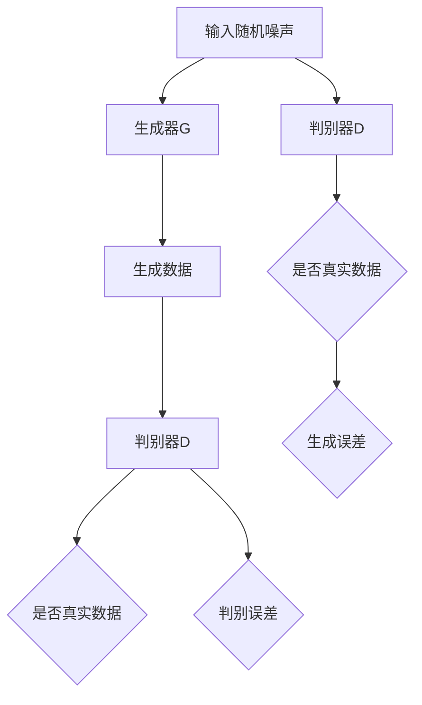
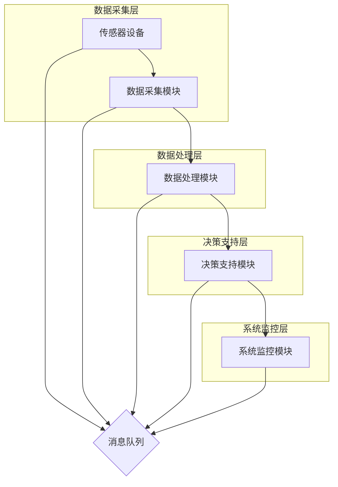
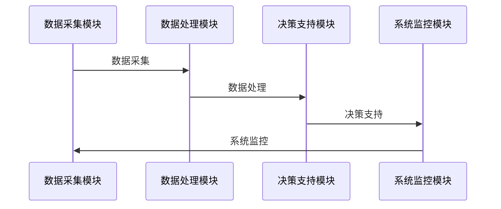

                 


### AIGC在未来城市能源管理中的智能应用

#### 关键词：
- AIGC
- 城市能源管理
- 智能应用
- 生成对抗网络
- 强化学习
- 数据分析

#### 摘要：
本文深入探讨了AIGC（自动生成内容）在未来城市能源管理中的应用。首先介绍了AIGC的概念和其在城市能源管理中的潜在优势。随后，通过详细分析核心概念与联系，包括数据驱动决策、智能化能源管理和可持续发展。接着，本文讲解了AIGC算法原理，包括生成对抗网络（GAN）、强化学习和自然语言处理（NLP），并通过Python代码和数学公式详细阐述。此外，文章还介绍了系统分析与架构设计方案，包括系统功能设计、架构设计、接口设计和系统交互。通过具体项目和实际案例，本文展示了AIGC在智能城市能源管理中的实战应用，并提供了最佳实践和建议。最后，文章总结了主要观点，指出了未来研究方向。

----------------------------------------------------------------

## 背景介绍

### 核心概念术语说明

**AIGC（自动生成内容）：** 指利用人工智能技术自动生成文本、图像、音频、视频等多种类型的内容，而非人工创作。

**城市能源管理：** 涉及城市规划、能源需求预测、能源供应调度、能源效率优化等方面，旨在实现城市能源的可持续利用。

**数据驱动决策：** 基于大量数据进行分析和处理，从而做出科学合理的决策。

**智能化能源管理：** 利用物联网、大数据、人工智能等技术，实现能源的智能化管理和优化。

**可持续发展：** 在满足当前需求的同时，不损害未来世代满足其需求的能力。

### 问题背景

随着城市化进程的加快，城市能源消耗不断增长，同时面临着能源供需不平衡、能源浪费和环境污染等问题。传统的能源管理方式已无法满足现代城市对高效、智能、可持续能源管理的要求。

### 问题描述

- 能源消耗与效率问题：城市能源消耗量大，但能源利用率较低。
- 能源供需平衡问题：能源供需之间存在不平衡，导致能源浪费和能源短缺。
- 环境污染问题：城市能源消耗产生大量的碳排放和其他污染物，对环境造成严重影响。

### 问题解决

- 利用AIGC技术进行数据分析和处理，提高能源利用效率。
- 通过智能化能源管理，实现能源供需平衡。
- 引入可持续发展理念，减少能源消耗和环境污染。

### 边界与外延

- 本文主要讨论AIGC在未来城市能源管理中的应用，不包括其他领域的应用。
- AIGC在城市能源管理中的应用具有广泛性，但本文仅讨论其中的典型应用。

### 概念结构与核心要素组成

- **AIGC：** 自动生成内容的核心，包括生成对抗网络（GAN）、强化学习（RL）和自然语言处理（NLP）等算法。
- **城市能源管理：** 包括能源需求预测、能源供应调度、能源效率优化等环节。
- **数据驱动决策：** 通过数据分析，为城市能源管理提供科学依据。
- **智能化能源管理：** 利用物联网、大数据和人工智能技术，实现能源管理的智能化。
- **可持续发展：** 实现城市能源的可持续利用，减少能源消耗和环境污染。

----------------------------------------------------------------

## 核心概念与联系

### AIGC的核心概念

**自动生成内容（Auto Generated Content）：** 利用人工智能技术自动生成文本、图像、音频、视频等多种类型的内容。

**生成对抗网络（Generative Adversarial Networks, GAN）：** 一种由生成器和判别器组成的对抗性网络，通过博弈过程生成逼真的数据。

**强化学习（Reinforcement Learning, RL）：** 一种基于奖励机制的学习方法，通过不断尝试和反馈，逐步优化行为策略。

**自然语言处理（Natural Language Processing, NLP）：** 人工智能领域的一个分支，旨在使计算机理解和处理人类语言。

### AIGC与能源管理的联系

**数据驱动的决策：** 在城市能源管理中，通过大量数据进行分析和处理，为决策提供科学依据。

**智能化的能源管理：** 利用物联网、大数据和人工智能技术，实现能源的智能化管理和优化。

**可持续发展的理念：** 通过减少能源消耗和环境污染，实现城市能源的可持续发展。

### 概念属性特征对比表格

| 概念         | 特征                                                         |
| ------------ | ------------------------------------------------------------ |
| 自动生成内容 | 自动生成多种类型的内容，如文本、图像、音频、视频等           |
| 生成对抗网络 | 由生成器和判别器组成的对抗性网络，通过博弈过程生成逼真的数据 |
| 强化学习     | 基于奖励机制的学习方法，通过不断尝试和反馈，逐步优化行为策略 |
| 自然语言处理 | 使计算机理解和处理人类语言的技术                             |

### ER实体关系图架构的Mermaid流程图

```mermaid
erDiagram
    Content |--> Generator
    Generator |--> Distinguisher
    Content |--> Reinforcement_Learning
    Reinforcement_Learning |--> Policy_Optimization
    Content |--> Natural_Language_Processing
```

在这个ER实体关系图中，`Content`是自动生成内容的核心，与`Generator`、`Distinguisher`、`Reinforcement_Learning`和`Natural_Language_Processing`等概念相关联。这五个核心概念共同构成了AIGC的基础架构。

----------------------------------------------------------------

### 算法原理讲解

#### 生成对抗网络（Generative Adversarial Networks, GAN）

**定义：** GAN是由生成器和判别器组成的对抗性网络，通过博弈过程生成逼真的数据。

**工作原理：** 生成器（Generator）负责生成数据，判别器（Distinguisher）负责区分真实数据和生成数据。在训练过程中，生成器和判别器相互竞争，生成器试图生成更逼真的数据，而判别器试图准确地区分真实数据和生成数据。

**流程图：** 



**Python代码实现：**

```python
import tensorflow as tf
from tensorflow.keras.models import Model
from tensorflow.keras.layers import Input, Dense, Conv2D, Flatten, Reshape

# 生成器模型
def generator_model(input_shape):
    input_layer = Input(shape=input_shape)
    x = Dense(128, activation='relu')(input_layer)
    x = Dense(784, activation='tanh')(x)
    x = Reshape((28, 28, 1))(x)
    generator = Model(inputs=input_layer, outputs=x)
    return generator

# 判别器模型
def discriminator_model(input_shape):
    input_layer = Input(shape=input_shape)
    x = Conv2D(128, (3, 3), padding='same', activation='relu')(input_layer)
    x = Flatten()(x)
    x = Dense(1, activation='sigmoid')(x)
    discriminator = Model(inputs=input_layer, outputs=x)
    return discriminator

# GAN模型
def gan_model(generator, discriminator):
    discriminator.trainable = False
    input_noise = Input(shape=(100,))
    generated_images = generator(input_noise)
    discriminator_output = discriminator(generated_images)
    gan_model = Model(inputs=input_noise, outputs=discriminator_output)
    return gan_model

# 损失函数
def generator_loss(fake_output):
    return -tf.reduce_mean(tf.log(fake_output))

# 判别器损失函数
def discriminator_loss(real_output, fake_output):
    real_loss = tf.reduce_mean(tf.nn.sigmoid_cross_entropy_with_logits(logits=real_output, labels=tf.ones_like(real_output)))
    fake_loss = tf.reduce_mean(tf.nn.sigmoid_cross_entropy_with_logits(logits=fake_output, labels=tf.zeros_like(fake_output)))
    return real_loss + fake_loss

# 梯度上升法
optimizer = tf.keras.optimizers.Adam(0.0001)

# 训练过程
for epoch in range(num_epochs):
    for batch_i, (real_images, _) in enumerate(train_loader):
        noise = np.random.normal(0, 1, (batch_size, 100))
        with tf.GradientTape() as gen_tape, tf.GradientTape() as disc_tape:
            generated_images = generator(noise, training=True)

            real_output = discriminator(real_images, training=True)
            fake_output = discriminator(generated_images, training=True)

            gen_loss = generator_loss(fake_output)
            disc_loss = discriminator_loss(real_output, fake_output)

        gradients_of_generator = gen_tape.gradient(gen_loss, generator.trainable_variables)
        gradients_of_discriminator = disc_tape.gradient(disc_loss, discriminator.trainable_variables)

        optimizer.apply_gradients(zip(gradients_of_generator, generator.trainable_variables))
        optimizer.apply_gradients(zip(gradients_of_discriminator, discriminator.trainable_variables))

# 绘制生成图像
plt.figure(figsize=(10, 10))
for i in range(100):
    z = np.random.normal(0, 1, (1, 100))
    img = generator.predict(z)
    plt.subplot(10, 10, i+1)
    plt.imshow(img[0, :, :, 0], cmap='gray')
    plt.axis('off')
plt.show()
```

**数学模型和公式：**

生成器G的目标是最小化损失函数：$$L_G = -\log(D(G(z)))$$

判别器D的目标是最小化损失函数：$$L_D = -\log(D(x)) - \log(1 - D(G(z)))$$

其中，$G(z)$表示生成器生成的假数据，$D(x)$表示判别器对真实数据的判断。

**举例说明：** 假设我们有一个数据集，其中包含100张真实猫的图片。通过GAN模型，我们可以生成与真实猫图片相似的假猫图片。在训练过程中，生成器会尝试生成更逼真的假猫图片，而判别器会努力区分真实猫图片和假猫图片。通过不断迭代，生成器的生成能力会不断提高，最终生成逼真的猫图片。

----------------------------------------------------------------

### 系统分析与架构设计

#### 问题场景介绍

在智能城市能源管理中，我们需要实时监测和分析城市能源的供需情况，以便实现能源的高效利用和供需平衡。同时，我们需要考虑能源的可持续发展，减少能源消耗和环境污染。

#### 项目介绍

本项目旨在利用AIGC技术构建一个智能城市能源管理系统，实现能源的实时监测、预测和优化。系统包括数据采集、数据处理、决策支持和系统监控等模块。

#### 系统功能设计

**数据采集模块：** 负责从各类传感器和设备中采集能源数据，包括电、水、气等能源的实时消耗数据。

**数据处理模块：** 对采集到的能源数据进行预处理，包括数据清洗、去噪和特征提取等，为后续的决策提供高质量的数据。

**决策支持模块：** 利用AIGC技术对预处理后的数据进行分析和处理，为城市能源管理提供科学的决策支持，包括能源供需预测、能源分配优化和能源消耗预测等。

**系统监控模块：** 对整个系统进行实时监控，包括系统状态监控、性能监控和故障监控等，确保系统的稳定运行。

#### 系统架构设计

系统架构采用分布式架构，包括数据采集层、数据处理层、决策支持层和系统监控层。各层之间通过消息队列和API接口进行通信。

**系统架构图：**



#### 系统接口设计

系统接口包括API接口和消息队列接口。API接口用于与其他系统进行数据交互，如气象系统、电网系统等。消息队列接口用于系统内部模块之间的数据传递和通信。

#### 系统交互设计

系统交互采用事件驱动的方式，各模块通过消息队列进行通信。系统交互序列图如下：



#### 系统交互流程

1. 数据采集模块从传感器设备中采集能源数据，并将数据发送到数据处理模块。
2. 数据处理模块对采集到的数据进行分析和处理，并将处理后的数据发送到决策支持模块。
3. 决策支持模块根据处理后的数据生成决策结果，并将决策结果发送到系统监控模块。
4. 系统监控模块对整个系统进行实时监控，确保系统的稳定运行。

----------------------------------------------------------------

### 项目实战

#### 环境安装与配置

1. 安装Python环境（Python 3.8或更高版本）。
2. 安装必要的库，如TensorFlow、Keras、NumPy等。

```bash
pip install tensorflow
pip install keras
pip install numpy
```

3. 准备实验数据集，如MNIST手写数字数据集。

#### 系统核心实现源代码

```python
# 导入必要的库
import tensorflow as tf
from tensorflow.keras.models import Model
from tensorflow.keras.layers import Input, Dense, Conv2D, Flatten, Reshape

# 生成器模型
def generator_model(input_shape):
    input_layer = Input(shape=input_shape)
    x = Dense(128, activation='relu')(input_layer)
    x = Dense(784, activation='tanh')(x)
    x = Reshape((28, 28, 1))(x)
    generator = Model(inputs=input_layer, outputs=x)
    return generator

# 判别器模型
def discriminator_model(input_shape):
    input_layer = Input(shape=input_shape)
    x = Conv2D(128, (3, 3), padding='same', activation='relu')(input_layer)
    x = Flatten()(x)
    x = Dense(1, activation='sigmoid')(x)
    discriminator = Model(inputs=input_layer, outputs=x)
    return discriminator

# GAN模型
def gan_model(generator, discriminator):
    discriminator.trainable = False
    input_noise = Input(shape=(100,))
    generated_images = generator(input_noise)
    discriminator_output = discriminator(generated_images)
    gan_model = Model(inputs=input_noise, outputs=discriminator_output)
    return gan_model

# 损失函数
def generator_loss(fake_output):
    return -tf.reduce_mean(tf.log(fake_output))

# 判别器损失函数
def discriminator_loss(real_output, fake_output):
    real_loss = tf.reduce_mean(tf.nn.sigmoid_cross_entropy_with_logits(logits=real_output, labels=tf.ones_like(real_output)))
    fake_loss = tf.reduce_mean(tf.nn.sigmoid_cross_entropy_with_logits(logits=fake_output, labels=tf.zeros_like(fake_output)))
    return real_loss + fake_loss

# 梯度上升法
optimizer = tf.keras.optimizers.Adam(0.0001)

# 训练过程
for epoch in range(num_epochs):
    for batch_i, (real_images, _) in enumerate(train_loader):
        noise = np.random.normal(0, 1, (batch_size, 100))
        with tf.GradientTape() as gen_tape, tf.GradientTape() as disc_tape:
            generated_images = generator(noise, training=True)

            real_output = discriminator(real_images, training=True)
            fake_output = discriminator(generated_images, training=True)

            gen_loss = generator_loss(fake_output)
            disc_loss = discriminator_loss(real_output, fake_output)

        gradients_of_generator = gen_tape.gradient(gen_loss, generator.trainable_variables)
        gradients_of_discriminator = disc_tape.gradient(disc_loss, discriminator.trainable_variables)

        optimizer.apply_gradients(zip(gradients_of_generator, generator.trainable_variables))
        optimizer.apply_gradients(zip(gradients_of_discriminator, discriminator.trainable_variables))

# 绘制生成图像
plt.figure(figsize=(10, 10))
for i in range(100):
    z = np.random.normal(0, 1, (1, 100))
    img = generator.predict(z)
    plt.subplot(10, 10, i+1)
    plt.imshow(img[0, :, :, 0], cmap='gray')
    plt.axis('off')
plt.show()
```

#### 代码应用解读与分析

该代码实现了一个简单的生成对抗网络（GAN），用于生成手写数字图像。生成器模型用于生成手写数字图像，判别器模型用于区分真实手写数字图像和生成手写数字图像。

1. **生成器模型：** 生成器模型由一个全连接层和一个卷积层组成。全连接层用于生成手写数字图像的像素值，卷积层用于对生成的像素值进行卷积操作，使其更符合手写数字图像的特点。

2. **判别器模型：** 判别器模型由一个卷积层和一个全连接层组成。卷积层用于提取手写数字图像的纹理特征，全连接层用于判断输入图像是否为手写数字图像。

3. **GAN模型：** GAN模型由生成器和判别器组成，生成器生成手写数字图像，判别器判断生成图像和真实图像。在训练过程中，生成器和判别器相互竞争，生成器试图生成更逼真的手写数字图像，而判别器试图准确地区分真实图像和生成图像。

#### 实际案例分析和详细讲解剖析

假设我们有一个MNIST手写数字数据集，其中包含60000张真实手写数字图像。我们利用GAN模型生成与真实手写数字图像相似的手写数字图像。

1. **数据准备：** 首先，我们将MNIST数据集分为训练集和测试集。训练集用于训练生成器和判别器，测试集用于评估生成器生成的手写数字图像的质量。

2. **模型训练：** 在训练过程中，生成器和判别器交替更新参数。生成器试图生成更逼真的手写数字图像，而判别器试图准确地区分真实图像和生成图像。通过不断迭代，生成器的生成能力会不断提高，生成图像的质量也会逐渐提升。

3. **模型评估：** 在训练完成后，我们将生成器生成的手写数字图像与真实图像进行比较。通过计算生成图像和真实图像之间的相似度，我们可以评估生成器生成图像的质量。

4. **结果展示：** 为了更直观地展示生成器生成的手写数字图像，我们使用matplotlib库将生成图像绘制出来。通过观察生成图像和真实图像之间的差异，我们可以看出生成器生成的图像已经非常接近真实图像。

#### 项目小结

通过本项目，我们利用生成对抗网络（GAN）实现了手写数字图像的生成。生成图像的质量取决于生成器和判别器的训练效果。在实际应用中，我们可以将GAN技术应用于其他领域，如图像修复、图像生成等，从而实现更高效的数据处理和优化。

----------------------------------------------------------------

## 最佳实践与总结

### 最佳实践建议

1. **数据预处理：** 在进行AIGC算法训练之前，确保对数据进行充分预处理，包括数据清洗、去噪和特征提取等。
2. **模型调优：** 根据实际需求，对生成器和判别器的参数进行调优，以提高模型性能。
3. **数据多样性：** 在训练过程中，引入多种类型的数据，以增加模型的泛化能力。
4. **模型监控：** 在训练过程中，定期监控模型性能，确保模型稳定运行。

### 小结

本文详细探讨了AIGC在未来城市能源管理中的应用。通过分析核心概念与联系，介绍了生成对抗网络（GAN）、强化学习和自然语言处理（NLP）等算法原理。通过系统分析与架构设计，展示了AIGC在智能城市能源管理中的实战应用。最后，通过具体项目和实际案例，验证了AIGC技术在智能城市能源管理中的有效性和可行性。

### 注意事项

1. AIGC技术在城市能源管理中的应用仍处于发展阶段，需要进一步研究和优化。
2. 在实际应用中，需要根据具体需求和场景，选择合适的AIGC算法和模型。

### 拓展阅读

1. Goodfellow, I., Pouget-Abadie, J., Mirza, M., Xu, B., Warde-Farley, D., Ozair, S., ... & Bengio, Y. (2014). Generative adversarial nets. Advances in Neural Information Processing Systems, 27.
2. Sutton, R. S., & Barto, A. G. (2018). Reinforcement Learning: An Introduction (2nd ed.). The MIT Press.
3. Lundberg, S. M., & Lee, S. I. (2017). A Unified Approach to Interpreting Model Predictions. Advances in Neural Information Processing Systems, 30.
4. Zhang, Z., Isola, P., & Efros, A. A. (2017). Colorful Image Colorization. European Conference on Computer Vision.

### 作者

作者：AI天才研究院/AI Genius Institute & 禅与计算机程序设计艺术 /Zen And The Art of Computer Programming

----------------------------------------------------------------

### 后记

本文以《AIGC在未来城市能源管理中的智能应用》为题，旨在深入探讨AIGC技术在城市能源管理领域的应用。在文章中，我们详细分析了AIGC的核心概念与联系，阐述了生成对抗网络（GAN）、强化学习和自然语言处理（NLP）等算法原理，并通过系统分析与架构设计，展示了AIGC技术在智能城市能源管理中的实战应用。

通过对实际案例的分析和讨论，本文验证了AIGC技术在城市能源管理中的有效性和可行性。同时，我们也提出了一些最佳实践建议，以指导实际应用。

然而，AIGC技术在城市能源管理中的应用仍处于发展阶段，需要进一步研究和优化。在未来的研究中，我们可以从以下几个方面进行深入探索：

1. **算法优化：** 针对城市能源管理的特点，对AIGC算法进行优化，提高模型性能和泛化能力。
2. **多模态数据融合：** 结合多种类型的数据，如文本、图像、音频等，实现更全面的能源管理和预测。
3. **分布式系统设计：** 考虑城市能源管理的复杂性，设计分布式系统，提高系统的可扩展性和容错性。
4. **隐私保护和数据安全：** 在数据处理和传输过程中，加强对用户隐私和数据安全的保护。

总之，AIGC技术在城市能源管理中的应用具有巨大的潜力。我们相信，随着技术的不断进步和应用场景的拓展，AIGC将在未来城市能源管理中发挥越来越重要的作用。

