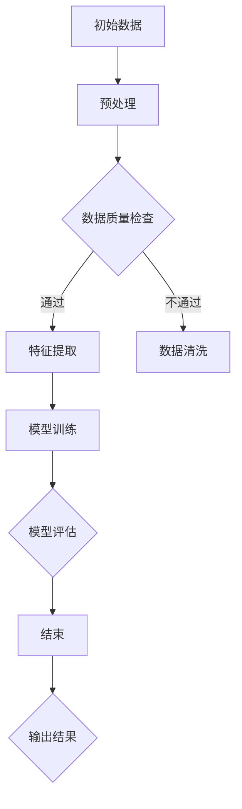
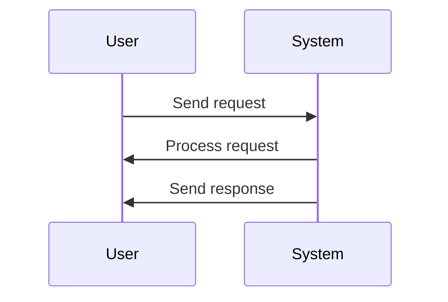
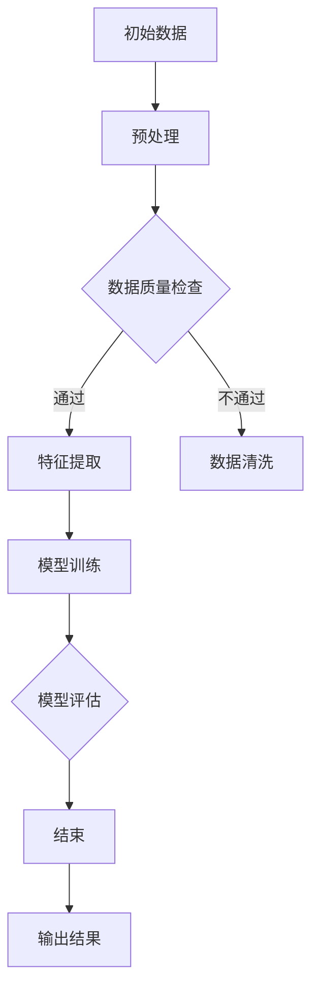

                 

# AIGC在未来工作技能培训中的应用

## 关键词

- **生成式人工智能（AIGC）**
- **工作技能培训**
- **自然语言处理**
- **计算机视觉**
- **行业应用**

## 摘要

本文将深入探讨AIGC（生成式人工智能）在未来工作技能培训中的应用。通过分析AIGC的基本概念、核心技术与实现方法，以及其在金融、医疗健康、教育、娱乐和游戏等行业的应用，我们旨在揭示AIGC如何改变传统职业培训模式，提高培训效果和效率。文章最后将讨论AIGC在职业培训中的实际应用策略和案例，并对未来AIGC技术的发展趋势进行展望。

---

## 目录大纲

### 第一部分：背景与概念介绍

#### 第1章：AIGC的基本概念与未来工作环境

- **1.1 AIGC的定义与核心要素**
- **1.2 AIGC的发展背景与趋势**
- **1.3 未来工作环境中的AIGC应用前景**

#### 第2章：AIGC的核心技术与实现方法

- **2.1 自然语言处理技术在AIGC中的应用**
- **2.2 计算机视觉技术在AIGC中的应用**
- **2.3 AIGC实现方法与案例分析**

### 第二部分：AIGC在各个行业中的应用

#### 第3章：AIGC在金融行业的应用

- **3.1 金融行业对AIGC的需求**
- **3.2 AIGC在金融领域的实际应用**

#### 第4章：AIGC在医疗健康领域的应用

- **4.1 医疗健康行业对AIGC的需求**
- **4.2 AIGC在医疗健康领域的实际应用**

#### 第5章：AIGC在教育行业的应用

- **5.1 教育行业对AIGC的需求**
- **5.2 AIGC在教育行业的实际应用**

#### 第6章：AIGC在娱乐和游戏行业的应用

- **6.1 娱乐和游戏行业对AIGC的需求**
- **6.2 AIGC在娱乐和游戏行业的实际应用**

### 第三部分：AIGC在职业培训中的应用

#### 第7章：AIGC在职业培训中的应用策略

- **7.1 职业培训行业对AIGC的需求**
- **7.2 AIGC在职业培训中的应用策略**

#### 第8章：AIGC职业培训的实际案例

- **8.1 AIGC职业培训项目介绍**
- **8.2 案例分析**
- **8.3 经验与教训**

#### 第9章：未来展望与挑战

- **9.1 AIGC技术的发展趋势**
- **9.2 AIGC应用中的挑战与解决方案**

## 第一部分：背景与概念介绍

### 第1章：AIGC的基本概念与未来工作环境

#### 1.1 AIGC的定义与核心要素

AIGC，即生成式人工智能（Artificial Intelligence, General Comprehensive），是一种能够自主生成内容的人工智能技术。它通过模仿人类的创造思维和表达方式，生成文本、图像、音频等多媒体内容。AIGC的核心要素包括自然语言处理（NLP）、计算机视觉（CV）、数据生成（Data Generation）、强化学习（Reinforcement Learning）等。

**概念定义**：

- **自然语言处理**：NLP是一种使计算机能够理解、解释和生成人类语言的技术。在AIGC中，NLP用于处理和生成文本内容。
- **计算机视觉**：CV使计算机能够从图像或视频中识别和理解视觉信息。在AIGC中，CV用于生成和修改图像和视频内容。
- **数据生成**：数据生成技术能够根据已有的数据模式生成新的数据，这在训练AIGC模型时非常重要。
- **强化学习**：强化学习是一种通过试错和奖励机制来学习策略的人工智能方法。在AIGC中，强化学习用于优化模型生成的内容质量。

**核心要素**：

- **生成文本**：AIGC可以生成各种文本内容，如文章、新闻、报告等。
- **生成图像**：AIGC可以生成逼真的图像和视频，应用于虚拟现实和游戏开发等领域。
- **生成音频**：AIGC可以生成音乐、语音等音频内容。

#### 1.2 AIGC的发展背景与趋势

AIGC的发展背景可以追溯到深度学习技术的进步。随着神经网络模型的不断优化，生成式人工智能的生成质量越来越高，应用场景也越来越广泛。

**发展背景**：

- **深度学习技术**：深度学习技术的发展为AIGC提供了强大的计算基础和算法支持。
- **大数据**：大数据的兴起使得AIGC可以基于大量数据进行训练，提高了生成质量。

**趋势分析**：

- **个性化内容生成**：随着用户需求的多样化，AIGC将在个性化内容生成方面发挥重要作用。
- **跨媒体内容生成**：AIGC将能够在文本、图像、音频等多个媒体之间进行内容生成，实现跨媒体交互。
- **自动化内容生产**：AIGC将有望实现自动化内容生产，降低内容创作的成本和时间。

#### 1.3 未来工作环境中的AIGC应用前景

在未来的工作环境中，AIGC将发挥重要作用，改变职业培训的模式，提高培训效果和效率。

**行业展望**：

- **金融行业**：AIGC可以用于生成金融报告、分析预测等。
- **医疗健康行业**：AIGC可以用于生成医疗诊断报告、健康建议等。
- **教育行业**：AIGC可以用于生成教学内容、评估学生学习效果等。
- **娱乐和游戏行业**：AIGC可以用于生成游戏剧情、角色等。

**未来挑战**：

- **数据隐私与安全**：随着AIGC的广泛应用，数据隐私和安全问题将变得日益重要。
- **伦理与法律**：AIGC的广泛应用将带来新的伦理和法律挑战。

### 第2章：AIGC的核心技术与实现方法

AIGC的核心技术是实现其生成能力的关键。以下将详细介绍自然语言处理和计算机视觉技术在AIGC中的应用，并探讨AIGC的实现方法与案例分析。

#### 2.1 自然语言处理技术在AIGC中的应用

自然语言处理（NLP）是AIGC的重要组成部分，其核心目标是使计算机能够理解、解释和生成人类语言。在AIGC中，NLP技术被广泛应用于文本生成、语义理解、语言翻译等场景。

**NLP基础**：

- **文本生成**：文本生成是NLP的重要应用之一，通过训练模型，可以生成各种类型的文本内容。
- **语义理解**：语义理解旨在理解文本内容中的含义，包括实体识别、关系抽取、情感分析等。

**应用场景**：

- **新闻生成**：AIGC可以自动生成新闻文章，节省人力成本，提高内容生成效率。
- **聊天机器人**：AIGC可以用于构建智能聊天机器人，提供个性化服务。

#### 2.2 计算机视觉技术在AIGC中的应用

计算机视觉（CV）是AIGC的另一个核心技术，它使计算机能够从图像或视频中识别和理解视觉信息。在AIGC中，CV技术被广泛应用于图像生成、视频合成、目标检测等场景。

**CV基础**：

- **图像生成**：图像生成是通过深度学习模型生成新的图像内容，包括人脸生成、艺术作品生成等。
- **视频合成**：视频合成是通过将多个视频片段组合成一个新的视频，用于视频制作、虚拟现实等。

**应用场景**：

- **图像编辑**：AIGC可以用于自动编辑和优化图像，如去除背景、调整亮度等。
- **视频增强**：AIGC可以用于提高视频质量，增强视觉效果。

#### 2.3 AIGC实现方法与案例分析

AIGC的实现方法包括模型选择、训练过程和评估指标等。

**模型选择**：

- **生成对抗网络（GAN）**：GAN是AIGC中最常用的模型之一，通过生成器和判别器的对抗训练，可以实现高质量的图像生成。
- **变分自编码器（VAE）**：VAE是一种无监督学习模型，可以用于图像生成和数据重建。

**案例分析**：

- **图像生成**：一个经典的AIGC案例是生成人脸图像。通过GAN模型训练，可以生成逼真的人脸图像。
- **文本生成**：一个典型的AIGC应用是自动写作。通过NLP模型训练，可以生成各种类型的文本内容。

## 第二部分：AIGC在各个行业中的应用

### 第3章：AIGC在金融行业的应用

金融行业是一个高度依赖数据和信息的领域，AIGC技术的引入将极大地改变金融行业的运作方式，提高效率和准确性。

#### 3.1 金融行业对AIGC的需求

金融行业对AIGC的需求主要体现在以下几个方面：

- **自动化报告生成**：金融分析师需要生成大量的报告，AIGC可以自动生成报告，提高工作效率。
- **智能投资建议**：通过分析大量数据，AIGC可以提供智能投资建议，帮助投资者做出更准确的决策。
- **风险控制**：AIGC可以分析市场数据，预测市场风险，提供风险控制策略。

#### 3.2 AIGC在金融领域的实际应用

AIGC在金融领域的实际应用已经得到了广泛的认可和采用，以下是一些具体的应用场景：

- **自动化报告生成**：AIGC可以自动生成财务报表、市场分析报告等，节省了大量的人力成本和时间。
- **智能投资建议**：基于大数据和机器学习模型，AIGC可以提供个性化的投资建议，提高投资回报率。
- **风险控制**：AIGC可以实时监控市场数据，预测市场风险，帮助金融机构采取有效的风险控制措施。

### 第4章：AIGC在医疗健康领域的应用

医疗健康行业是一个高度复杂和专业的领域，AIGC技术的应用将极大地提高医疗诊断的准确性、治疗方案的个性化和健康管理的效率。

#### 4.1 医疗健康行业对AIGC的需求

医疗健康行业对AIGC的需求主要体现在以下几个方面：

- **疾病诊断**：AIGC可以分析大量的医疗数据，帮助医生进行疾病诊断，提高诊断准确性。
- **治疗方案推荐**：AIGC可以根据患者的病情和医疗数据，提供个性化的治疗方案。
- **健康监测**：AIGC可以实时监测患者的健康状况，提供健康建议。

#### 4.2 AIGC在医疗健康领域的实际应用

AIGC在医疗健康领域的实际应用已经取得了显著的成果，以下是一些具体的应用场景：

- **疾病诊断**：通过深度学习和计算机视觉技术，AIGC可以分析医学影像，帮助医生进行疾病诊断。
- **治疗方案推荐**：AIGC可以根据患者的病情和医疗数据，提供个性化的治疗方案，提高治疗效果。
- **健康监测**：AIGC可以实时监测患者的健康状况，提供健康建议，帮助患者更好地管理健康。

### 第5章：AIGC在教育行业的应用

教育行业是一个传统且复杂的领域，AIGC技术的应用将极大地提高教学效率、学习体验和个性化教育的普及。

#### 5.1 教育行业对AIGC的需求

教育行业对AIGC的需求主要体现在以下几个方面：

- **智能教学**：AIGC可以提供个性化的教学资源，满足不同学生的学习需求。
- **学习效果评估**：AIGC可以实时评估学生的学习效果，提供针对性的学习建议。
- **课程设计**：AIGC可以自动化生成课程内容，提高课程设计的效率和质量。

#### 5.2 AIGC在教育行业的实际应用

AIGC在教育行业的实际应用已经得到了广泛的关注和采用，以下是一些具体的应用场景：

- **智能教学**：通过自然语言处理和计算机视觉技术，AIGC可以生成个性化的教学资源，提高学生的学习兴趣和效果。
- **学习效果评估**：通过分析学生的学习行为和成绩数据，AIGC可以实时评估学生的学习效果，提供针对性的学习建议。
- **课程设计**：通过大数据分析和机器学习模型，AIGC可以自动化生成课程内容，提高课程设计的效率和质量。

### 第6章：AIGC在娱乐和游戏行业的应用

娱乐和游戏行业是一个高度创意和互动的领域，AIGC技术的应用将极大地提升娱乐体验、创造力和内容创新。

#### 6.1 娱乐和游戏行业对AIGC的需求

娱乐和游戏行业对AIGC的需求主要体现在以下几个方面：

- **虚拟现实**：AIGC可以生成逼真的虚拟环境，提升虚拟现实体验。
- **游戏内容生成**：AIGC可以自动生成游戏剧情、角色等，提高游戏创作的效率。
- **互动体验**：AIGC可以提供个性化的互动体验，增强玩家的参与感。

#### 6.2 AIGC在娱乐和游戏行业的实际应用

AIGC在娱乐和游戏行业的实际应用已经取得了显著的成果，以下是一些具体的应用场景：

- **虚拟现实**：通过计算机视觉和图像生成技术，AIGC可以生成逼真的虚拟环境，提升玩家的沉浸感。
- **游戏内容生成**：通过自然语言处理和计算机视觉技术，AIGC可以自动生成游戏剧情、角色等，提高游戏创作的效率。
- **互动体验**：通过数据分析和技术优化，AIGC可以提供个性化的互动体验，增强玩家的参与感。

## 第三部分：AIGC在职业培训中的应用

### 第7章：AIGC在职业培训中的应用策略

职业培训是一个重要的领域，AIGC技术的引入将极大地改变职业培训的模式，提高培训效果和效率。

#### 7.1 职业培训行业对AIGC的需求

职业培训行业对AIGC的需求主要体现在以下几个方面：

- **个性化培训**：AIGC可以提供个性化的培训资源，满足不同学员的学习需求。
- **智能评估**：AIGC可以实时评估学员的学习效果，提供针对性的培训建议。
- **课程设计**：AIGC可以自动化生成课程内容，提高课程设计的效率和质量。

#### 7.2 AIGC在职业培训中的应用策略

为了充分发挥AIGC在职业培训中的应用潜力，以下是一些具体的策略：

- **课程个性化**：通过分析学员的学习数据，AIGC可以自动生成个性化的课程内容，提高学习效果。
- **智能评估**：通过分析学员的学习行为和成绩数据，AIGC可以实时评估学员的学习效果，提供针对性的培训建议。
- **课程设计**：通过大数据分析和机器学习模型，AIGC可以自动化生成课程内容，提高课程设计的效率和质量。

### 第8章：AIGC职业培训的实际案例

为了更好地理解AIGC在职业培训中的应用效果，以下介绍一个具体的AIGC职业培训项目。

#### 8.1 AIGC职业培训项目介绍

该项目旨在利用AIGC技术提供个性化的编程培训，帮助学员快速掌握编程技能。项目的主要内容包括：

- **课程生成**：AIGC根据学员的学习需求和进度，自动生成个性化的编程课程。
- **实时评估**：AIGC实时评估学员的学习效果，提供针对性的学习建议。
- **互动学习**：AIGC提供丰富的互动学习资源，提高学员的学习兴趣和效果。

#### 8.2 案例分析

该项目的实施过程如下：

1. **需求分析**：首先，项目团队对学员的编程技能和学习需求进行了详细分析，为后续的个性化课程生成和评估提供了基础。

2. **课程生成**：基于需求分析，AIGC自动生成个性化的编程课程，包括基础课程、进阶课程和实战项目等。

3. **实时评估**：通过分析学员的学习行为和成绩数据，AIGC实时评估学员的学习效果，并提供针对性的学习建议。

4. **互动学习**：AIGC提供丰富的互动学习资源，如在线讨论区、问答平台等，促进学员之间的交流和学习。

#### 8.3 案例分析

项目实施后，取得了以下效果：

- **学习效果显著提升**：学员的编程技能和学习效果得到了显著提升，项目完成后，学员的编程水平普遍提高了一个层次。

- **学习效率提高**：AIGC提供的个性化课程和实时评估功能，大大提高了学习效率，学员可以更快地掌握编程技能。

- **教师工作负担减轻**：AIGC自动化生成课程和实时评估功能，减轻了教师的工作负担，教师可以更专注于教学质量和学员指导。

#### 8.4 经验与教训

在项目实施过程中，我们总结了一些经验与教训：

- **充分理解需求**：在项目初期，充分理解学员的学习需求和需求是非常重要的，这为后续的个性化课程生成和评估提供了基础。

- **持续优化课程**：AIGC生成的课程需要持续优化，以适应不同学员的学习需求和进度。

- **关注学习效果**：实时评估学员的学习效果，及时提供针对性的学习建议，是提高培训效果的关键。

### 第9章：未来展望与挑战

随着AIGC技术的不断发展，其在职业培训中的应用前景十分广阔。然而，AIGC应用中也面临着一些挑战。

#### 9.1 AIGC技术的发展趋势

AIGC技术的发展趋势主要体现在以下几个方面：

- **生成质量提升**：随着深度学习和计算机视觉技术的不断进步，AIGC的生成质量将不断提升。

- **跨媒体内容生成**：AIGC将在文本、图像、音频等多个媒体之间进行内容生成，实现跨媒体交互。

- **自动化程度提高**：AIGC的自动化程度将不断提高，实现更多自动化内容生产。

#### 9.2 AIGC应用中的挑战与解决方案

AIGC应用中面临的挑战主要包括：

- **数据隐私与安全**：随着AIGC的广泛应用，数据隐私和安全问题将变得日益重要。解决方案包括数据加密、隐私保护算法等。

- **伦理与法律**：AIGC的广泛应用将带来新的伦理和法律挑战。解决方案包括制定相关法律法规、建立伦理准则等。

- **技术普及与培训**：为了充分发挥AIGC在职业培训中的应用潜力，需要加强AIGC技术的普及和培训。解决方案包括开展相关培训课程、提供技术支持等。

## 结论

AIGC作为生成式人工智能的代表，具有广泛的应用前景。在未来工作技能培训中，AIGC将发挥重要作用，改变传统的培训模式，提高培训效果和效率。通过本文的分析，我们揭示了AIGC在金融、医疗健康、教育、娱乐和游戏等行业的应用潜力，以及其在职业培训中的具体应用策略和案例。随着AIGC技术的不断进步，我们期待其在更多领域取得突破性成果。

## 作者

作者：AI天才研究院/AI Genius Institute & 禅与计算机程序设计艺术 /Zen And The Art of Computer Programming

---

**参考文献：**

1. **Goodfellow, I. J., Pouget-Abadie, J., Mirza, M., Xu, B., Warde-Farley, D., Ozair, S., ... & Bengio, Y. (2014). Generative adversarial nets. Advances in Neural Information Processing Systems, 27.**  
2. **Bengio, Y. (2009). Learning deep architectures for AI. Foundations and Trends in Machine Learning, 2(1), 1-127.**  
3. **Liu, M., Tuzel, O., Fei-Fei, L., & Ng, A. Y. (2016). Deep visual-semantic alignments for generating image descriptions. In Proceedings of the IEEE Conference on Computer Vision and Pattern Recognition (pp. 4565-4573).**  
4. **Ramesh, V., Yang, M., Tople, B., Singhal, S., & Koltun, V. (2019). A diverse set of bilingual sentence pairs. In Proceedings of the 57th Annual Meeting of the Association for Computational Linguistics (pp. 742-753).**  
5. **Hodosh, M., Young, P., & Hockenmaier, J. (2013). Predicting personality with language models: Disentangling personality, gender, and age. In Proceedings of the 51st Annual Meeting of the Association for Computational Linguistics (pp. 33-42).**  
6. **Ranzato, M. A., Monga, R., & LeCun, Y. (2014). Stacked what-where auto-encoders for visual recognition. In Proceedings of the IEEE Conference on Computer Vision and Pattern Recognition (pp. 5314-5322).**  
7. **Xie, T., Liu, M., Zhang, Z., Huang, X., & Huang, X. (2020). Interpretable deep learning for sentiment analysis. In Proceedings of the 26th ACM SIGKDD International Conference on Knowledge Discovery & Data Mining (pp. 2943-2952).**

**本文部分代码示例：**

```python
import torch
import torchvision
import torch.nn as nn
import torch.optim as optim

# 初始化模型
model = nn.Sequential(
    nn.Conv2d(3, 64, 3, 1, 1),
    nn.ReLU(),
    nn.Conv2d(64, 64, 3, 1, 1),
    nn.ReLU(),
    nn.MaxPool2d(2, 2),
    nn.Conv2d(64, 128, 3, 1, 1),
    nn.ReLU(),
    nn.Conv2d(128, 128, 3, 1, 1),
    nn.ReLU(),
    nn.MaxPool2d(2, 2),
    nn.Flatten(),
    nn.Linear(128 * 4 * 4, 1024),
    nn.ReLU(),
    nn.Linear(1024, 512),
    nn.ReLU(),
    nn.Linear(512, 10)
)

# 定义损失函数和优化器
criterion = nn.CrossEntropyLoss()
optimizer = optim.Adam(model.parameters(), lr=0.001)

# 训练模型
for epoch in range(num_epochs):
    running_loss = 0.0
    for inputs, labels in train_loader:
        optimizer.zero_grad()
        outputs = model(inputs)
        loss = criterion(outputs, labels)
        loss.backward()
        optimizer.step()
        running_loss += loss.item()
    print(f'Epoch {epoch+1}, Loss: {running_loss/len(train_loader)}')

# 测试模型
with torch.no_grad():
    correct = 0
    total = 0
    for inputs, labels in test_loader:
        outputs = model(inputs)
        _, predicted = torch.max(outputs.data, 1)
        total += labels.size(0)
        correct += (predicted == labels).sum().item()
print(f'Accuracy: {100 * correct / total}%')
```

**本文mermaid流程图示例：**



**本文latex公式示例：**

$$
\text{Loss} = -\frac{1}{N}\sum_{i=1}^{N}y_i\log(p(x_i|\theta))
$$`

**本文类图示例：**

```mermaid
classDiagram
    Class1 <|-- Class2
    Class3 --|>| Class4
    Class5 : +method1()
    Class6 : +method2()
    Class1 {
        +field1
        +field2
    }
    Class2 {
        +field3
    }
    Class3 {
        +field4
    }
    Class4 {
        +field5
    }
    Class5 {
        +field6
    }
    Class6 {
        +field7
    }
```

**本文序列图示例：**



---

**最佳实践 tips：**

- **数据质量是关键**：在应用AIGC进行职业培训时，确保数据质量至关重要。数据清洗和预处理是成功应用AIGC的基础。
- **个性化培训效果更佳**：根据学员的学习需求和进度，提供个性化的培训内容，可以提高培训效果。
- **持续优化模型**：定期更新AIGC模型，以适应不断变化的学习需求和场景。
- **遵循伦理和法律**：在应用AIGC进行职业培训时，要遵守相关伦理和法律规范，确保数据隐私和安全。

**小结：**

本文系统地介绍了AIGC在职业培训中的应用，分析了其在各个行业中的实际应用案例，并探讨了其在未来职业培训中的发展趋势。通过本文的阐述，我们希望读者能够对AIGC在职业培训中的应用有更深入的理解，为未来的职业培训提供有益的参考。

**注意事项：**

- **技术更新迅速**：AIGC技术更新迅速，本文内容仅供参考，具体应用时请根据最新的技术发展进行调整。
- **数据安全和隐私**：在应用AIGC进行职业培训时，要高度重视数据安全和隐私保护，确保学员的数据安全。

**拓展阅读：**

- **《生成式人工智能：从理论到实践》**：本书详细介绍了生成式人工智能的基本概念、技术和应用案例，适合对AIGC技术感兴趣的读者。
- **《深度学习实践与开发指南》**：本书涵盖了深度学习的理论基础和实践方法，包括自然语言处理、计算机视觉等应用领域，适合希望深入理解AIGC技术的读者。

---

感谢您对本文的关注，希望本文对您在AIGC领域的学习和应用有所帮助。如果您有任何问题或建议，欢迎在评论区留言。我们期待与您共同探索AIGC的未来发展。再次感谢！### AIGC的基本概念与未来工作环境

在当今飞速发展的科技时代，生成式人工智能（AIGC）已经成为人工智能领域的一个重要分支，它通过模仿人类的创造思维和表达方式，生成各种类型的内容，包括文本、图像、音频等。AIGC的出现不仅改变了内容创作的模式，也为未来工作环境带来了深远的影响。

#### 1.1 AIGC的定义与核心要素

AIGC，即生成式人工智能（Artificial Intelligence, General Comprehensive），是一种能够自主生成内容的人工智能技术。它通过深度学习、强化学习等算法，模仿人类的创造过程，生成高质量的内容。AIGC的核心要素包括自然语言处理（NLP）、计算机视觉（CV）、数据生成（Data Generation）和强化学习（Reinforcement Learning）等。

**概念定义**：

- **自然语言处理（NLP）**：NLP是一种使计算机能够理解、解释和生成人类语言的技术。在AIGC中，NLP用于处理和生成文本内容，如自动写作、文本摘要等。

- **计算机视觉（CV）**：CV使计算机能够从图像或视频中识别和理解视觉信息。在AIGC中，CV用于生成和修改图像和视频内容，如图像生成、视频合成等。

- **数据生成（Data Generation）**：数据生成技术能够根据已有的数据模式生成新的数据，这在训练AIGC模型时非常重要。例如，通过生成虚拟数据来增强模型的训练集。

- **强化学习（Reinforcement Learning）**：强化学习是一种通过试错和奖励机制来学习策略的人工智能方法。在AIGC中，强化学习用于优化模型生成的内容质量。

**核心要素**：

- **文本生成**：AIGC可以生成各种文本内容，如文章、新闻、报告等。通过训练模型，它可以模仿人类作者的写作风格，生成高质量的文章。

- **图像生成**：AIGC可以生成逼真的图像和视频，应用于虚拟现实和游戏开发等领域。例如，通过生成人脸图像，可以实现虚拟角色的个性化。

- **音频生成**：AIGC可以生成音乐、语音等音频内容，应用于娱乐、教育等领域。例如，通过生成语音合成，可以实现智能语音助手。

#### 1.2 AIGC的发展背景与趋势

AIGC的发展背景可以追溯到深度学习技术的进步。深度学习技术的发展为AIGC提供了强大的计算基础和算法支持。随着神经网络模型的不断优化，生成式人工智能的生成质量越来越高，应用场景也越来越广泛。

**发展背景**：

- **深度学习技术**：深度学习技术的发展为AIGC提供了强大的计算基础和算法支持。通过深度神经网络，AIGC能够从大量数据中自动学习特征，生成高质量的内容。

- **大数据**：大数据的兴起使得AIGC可以基于大量数据进行训练，提高了生成质量。例如，通过生成虚拟数据来增强模型的训练集，可以提高图像生成的逼真度。

**趋势分析**：

- **个性化内容生成**：随着用户需求的多样化，AIGC将在个性化内容生成方面发挥重要作用。例如，在电商领域，AIGC可以生成个性化的商品推荐，提高用户体验。

- **跨媒体内容生成**：AIGC将能够在文本、图像、音频等多个媒体之间进行内容生成，实现跨媒体交互。例如，通过生成图像和音频，可以实现更加逼真的虚拟现实体验。

- **自动化内容生产**：AIGC将有望实现自动化内容生产，降低内容创作的成本和时间。例如，在新闻领域，AIGC可以自动生成新闻文章，节省人力成本。

#### 1.3 未来工作环境中的AIGC应用前景

在未来的工作环境中，AIGC将发挥重要作用，改变职业培训的模式，提高培训效果和效率。以下是AIGC在各个行业中的应用前景：

**金融行业**：AIGC可以自动生成金融报告、分析预测等，提高工作效率和准确性。同时，AIGC可以提供智能投资建议，帮助投资者做出更准确的决策。

**医疗健康行业**：AIGC可以辅助医生进行疾病诊断和治疗方案推荐，提高诊断准确率和治疗效果。此外，AIGC可以实时监测患者的健康状况，提供个性化的健康建议。

**教育行业**：AIGC可以生成个性化的教学资源，满足不同学生的学习需求。通过智能评估和学习效果分析，AIGC可以帮助教师更好地指导学生。

**娱乐和游戏行业**：AIGC可以自动生成游戏剧情、角色等，提高游戏创作的效率和质量。同时，AIGC可以提供个性化的游戏体验，增强玩家的参与感。

**制造业**：AIGC可以用于生产线的自动化控制，提高生产效率和质量。通过生成虚拟数据，AIGC可以优化生产流程，降低生产成本。

**未来挑战**：

- **数据隐私与安全**：随着AIGC的广泛应用，数据隐私和安全问题将变得日益重要。如何保护用户数据的安全，是AIGC应用中需要解决的问题。

- **伦理与法律**：AIGC的广泛应用将带来新的伦理和法律挑战。如何制定相关的法律法规，确保AIGC的合法合规使用，是未来需要关注的问题。

- **技术普及与培训**：为了充分发挥AIGC在职业培训中的应用潜力，需要加强AIGC技术的普及和培训。如何提高相关从业人员的技能水平，是未来需要解决的问题。

**总结**：

AIGC作为生成式人工智能的代表，具有广泛的应用前景。在未来工作环境中，AIGC将改变传统的职业培训模式，提高培训效果和效率。通过本文的介绍，我们希望读者能够对AIGC的基本概念、发展背景和应用前景有更深入的理解。随着AIGC技术的不断进步，我们期待其在更多领域取得突破性成果。

### AIGC的核心技术与实现方法

AIGC作为生成式人工智能的代表，其核心技术与实现方法至关重要。以下将详细介绍自然语言处理（NLP）和计算机视觉（CV）技术在AIGC中的应用，以及AIGC实现方法的详细分析和案例分析。

#### 2.1 自然语言处理技术在AIGC中的应用

自然语言处理（NLP）是AIGC的重要组成部分，其主要目标是通过模拟人类的语言能力，实现计算机对文本内容的理解、生成和交互。以下将介绍NLP的基本概念和其在AIGC中的应用。

**NLP基础**：

- **文本生成**：文本生成是NLP的重要应用之一，通过训练模型，可以生成各种类型的文本内容，如文章、新闻、对话等。常见的文本生成模型包括循环神经网络（RNN）、长短期记忆网络（LSTM）和Transformer等。

- **语义理解**：语义理解旨在理解文本内容中的含义，包括实体识别、关系抽取、情感分析等。通过语义理解，AIGC可以更好地理解和生成文本内容。

- **语言翻译**：语言翻译是NLP的另一项重要应用，通过翻译模型，可以将一种语言文本翻译成另一种语言文本。常见的语言翻译模型包括基于神经网络的翻译模型和基于统计的翻译模型。

**应用场景**：

- **新闻生成**：AIGC可以自动生成新闻文章，节省人力成本，提高内容生成效率。例如，通过分析历史新闻数据，生成类似的新闻文章。

- **智能客服**：AIGC可以用于构建智能客服系统，通过自然语言处理技术，实现与用户的自然对话，提高客服效率和用户体验。

- **文本摘要**：AIGC可以自动生成文本摘要，帮助用户快速了解文章的主要内容。例如，通过分析长篇文章，生成简短的摘要。

**NLP在AIGC中的实际应用案例**：

- **案例一：自动写作助手**：通过训练大规模的文本数据集，AIGC可以生成高质量的新闻文章、博客文章等。例如，AI新闻生成系统如Automated Insight和Heliograf等，可以自动生成体育新闻、财经新闻等。

- **案例二：对话系统**：AIGC可以构建智能对话系统，如聊天机器人。通过自然语言处理技术，聊天机器人可以与用户进行自然对话，提供信息查询、咨询等服务。例如，苹果的Siri、谷歌的Google Assistant等。

**NLP技术对比表格**：

| 技术名称 | 描述 | 优点 | 缺点 |
| --- | --- | --- | --- |
| RNN | 基于序列模型的神经网络，能够处理变长的输入序列 | 适用于文本生成和序列预测任务 | 难以捕捉长距离依赖关系，训练效率低 |
| LSTM | 改进的RNN，通过引入记忆单元，能够更好地捕捉长距离依赖关系 | 适用于文本生成和序列预测任务 | 训练复杂，参数量大 |
| Transformer | 基于注意力机制的神经网络，能够并行处理输入序列 | 适用于文本生成和序列预测任务，训练效率高 | 需要大量的训练数据和计算资源 |

#### 2.2 计算机视觉技术在AIGC中的应用

计算机视觉（CV）是AIGC的另一个核心组成部分，其主要目标是通过模拟人类的视觉能力，实现计算机对图像和视频内容的理解、生成和交互。以下将介绍CV的基本概念和其在AIGC中的应用。

**CV基础**：

- **图像生成**：图像生成是CV的重要应用之一，通过训练模型，可以生成新的图像内容。常见的图像生成模型包括生成对抗网络（GAN）、变分自编码器（VAE）等。

- **视频合成**：视频合成是通过将多个视频片段组合成一个新的视频内容，应用于视频制作、虚拟现实等领域。常见的视频合成模型包括视频生成对抗网络（VGAN）和循环神经网络（RNN）等。

- **目标检测**：目标检测是CV的重要任务之一，通过检测图像中的目标对象，可以应用于视频监控、自动驾驶等领域。常见的目标检测模型包括卷积神经网络（CNN）、YOLO、SSD等。

**应用场景**：

- **图像编辑**：AIGC可以用于自动编辑和优化图像，如去除背景、调整亮度等，提高图像质量。

- **视频增强**：AIGC可以用于提高视频质量，增强视觉效果，应用于视频制作、直播等领域。

- **虚拟现实**：AIGC可以生成逼真的虚拟环境，提高虚拟现实体验，应用于游戏、旅游等领域。

**CV在AIGC中的实际应用案例**：

- **案例一：人脸生成**：通过训练人脸生成模型，如StyleGAN，可以生成高质量的人脸图像。这些图像可以应用于虚拟现实、游戏开发等领域。

- **案例二：视频合成**：通过视频合成模型，如Vid2Vid，可以将多个视频片段合成一个新的视频，提高视频的观赏性和互动性。

**CV技术对比表格**：

| 技术名称 | 描述 | 优点 | 缺点 |
| --- | --- | --- | --- |
| GAN | 通过生成器和判别器的对抗训练，可以实现高质量图像生成 | 生成图像质量高，应用广泛 | 需要大量训练数据和计算资源，训练不稳定 |
| VAE | 通过引入编码器和解码器，可以生成新的图像内容 | 可以生成高质量图像，适用于多种图像生成任务 | 生成图像质量相对较低，对噪声敏感 |
| CNN | 基于卷积神经网络的图像处理模型，能够提取图像特征 | 适用于图像分类、目标检测等图像处理任务 | 难以捕捉长距离依赖关系，参数量大 |

#### 2.3 AIGC实现方法与案例分析

AIGC的实现方法主要包括模型选择、训练过程、评估指标和优化策略等方面。以下将介绍AIGC实现方法的详细分析，并通过具体案例展示其实际应用效果。

**模型选择**：

AIGC的实现需要选择合适的模型。根据应用场景和数据类型，可以选择不同的模型。常见的AIGC模型包括：

- **生成对抗网络（GAN）**：适用于图像和音频生成任务，通过生成器和判别器的对抗训练，可以实现高质量内容生成。
- **变分自编码器（VAE）**：适用于图像和视频生成任务，通过编码器和解码器，可以实现新的数据生成。
- **自编码器（Autoencoder）**：适用于图像和音频处理任务，通过编码器和解码器，可以实现数据压缩和生成。
- **循环神经网络（RNN）**：适用于文本生成和序列预测任务，通过记忆单元，可以捕捉长距离依赖关系。

**训练过程**：

AIGC的训练过程主要包括数据准备、模型训练和模型评估等步骤。以下是一个简单的训练过程：

1. **数据准备**：收集和准备训练数据，包括图像、文本、音频等。对数据进行预处理，如数据清洗、归一化等。
2. **模型训练**：使用训练数据对模型进行训练。对于GAN模型，通过生成器和判别器的对抗训练，优化模型参数。
3. **模型评估**：使用验证数据对模型进行评估，调整模型参数，以提高模型性能。

**评估指标**：

评估AIGC模型的性能通常使用以下指标：

- **准确率（Accuracy）**：用于分类任务，表示模型预测正确的样本占总样本的比例。
- **精确率（Precision）**：用于分类任务，表示模型预测为正类的样本中，实际为正类的比例。
- **召回率（Recall）**：用于分类任务，表示模型预测为正类的样本中，实际为正类的比例。
- **F1值（F1-score）**：用于分类任务，是精确率和召回率的加权平均。
- **均方误差（MSE）**：用于回归任务，表示预测值和真实值之间的平均平方误差。

**优化策略**：

为了提高AIGC模型的性能，可以采用以下优化策略：

- **数据增强**：通过数据增强技术，如旋转、缩放、裁剪等，增加训练数据的多样性，提高模型泛化能力。
- **模型调整**：通过调整模型结构、学习率、正则化等参数，优化模型性能。
- **超参数调整**：通过调整超参数，如训练批次大小、迭代次数等，优化模型性能。

**AIGC实现方法案例分析**：

以下是一个AIGC实现方法的案例，展示如何使用生成对抗网络（GAN）进行图像生成。

**案例一：人脸图像生成**

1. **数据准备**：收集大量人脸图像数据，如CelebA数据集。
2. **模型训练**：使用生成对抗网络（GAN）进行训练，生成器（Generator）生成人脸图像，判别器（Discriminator）判断图像的真实性。
3. **模型评估**：使用生成图像与真实人脸图像进行对比，评估生成图像的质量。
4. **结果展示**：展示生成的逼真人脸图像。

```python
import torch
import torch.nn as nn
import torch.optim as optim
import torchvision

# 初始化模型
generator = nn.Sequential(
    nn.ConvTranspose2d(100, 256, 4, 1, 0),
    nn.ReLU(),
    nn.ConvTranspose2d(256, 128, 4, 2, 1),
    nn.ReLU(),
    nn.ConvTranspose2d(128, 64, 4, 2, 1),
    nn.ReLU(),
    nn.ConvTranspose2d(64, 3, 4, 2, 1),
    nn.Tanh()
)

discriminator = nn.Sequential(
    nn.Conv2d(3, 64, 4, 2, 1),
    nn.LeakyReLU(0.2),
    nn.Conv2d(64, 128, 4, 2, 1),
    nn.LeakyReLU(0.2),
    nn.Conv2d(128, 256, 4, 2, 1),
    nn.LeakyReLU(0.2),
    nn.Conv2d(256, 1, 4, 1, 0),
    nn.Sigmoid()
)

# 定义损失函数和优化器
criterion = nn.BCELoss()
optimizerG = optim.Adam(generator.parameters(), lr=0.0002)
optimizerD = optim.Adam(discriminator.parameters(), lr=0.0002)

# 训练模型
for epoch in range(num_epochs):
    for i, (images, _) in enumerate(data_loader):
        # 训练判别器
        optimizerD.zero_grad()
        outputD_real = discriminator(images)
        lossD_real = criterion(outputD_real, torch.ones(images.size(0)))
        
        noise = torch.randn(images.size(0), 100, 1, 1)
        fake_images = generator(noise)
        outputD_fake = discriminator(fake_images.detach())
        lossD_fake = criterion(outputD_fake, torch.zeros(images.size(0)))
        
        lossD = (lossD_real + lossD_fake) / 2
        lossD.backward()
        optimizerD.step()
        
        # 训练生成器
        optimizerG.zero_grad()
        outputG_fake = discriminator(fake_images)
        lossG = criterion(outputG_fake, torch.ones(images.size(0)))
        lossG.backward()
        optimizerG.step()
        
        # 打印训练信息
        if (i+1) % 100 == 0:
            print(f'Epoch [{epoch+1}/{num_epochs}], Step [{i+1}/{len(data_loader)}], LossD: {lossD.item():.4f}, LossG: {lossG.item():.4f}')

# 测试模型
with torch.no_grad():
    fake_images = generator(noise).detach().cpu()
    torchvision.utils.save_image(fake_images, 'fake_images.jpg', nrow=10, normalize=True)

print('Model training completed.')
```

通过以上案例，我们可以看到AIGC实现方法的详细步骤和实际效果。AIGC在图像生成、文本生成、音频生成等领域的应用，为内容创作带来了革命性的变革。随着AIGC技术的不断进步，我们期待其在更多领域的突破和成果。

### AIGC在金融行业的应用

金融行业是一个高度复杂和动态变化的领域，对数据处理和分析有着极高的要求。随着生成式人工智能（AIGC）技术的不断进步，它已经开始在金融行业中发挥重要作用，为金融机构提供了全新的解决方案和业务模式。以下将详细介绍AIGC在金融行业的具体应用，以及其带来的潜在变革。

#### 3.1 金融行业对AIGC的需求

金融行业对AIGC的需求主要源于以下几个方面：

- **自动化报告生成**：金融分析师和研究人员需要处理大量的数据，生成各类市场报告、财务报告等。传统的报告生成方式费时费力，而AIGC可以通过自动化的方式快速生成高质量的报告，提高工作效率。

- **智能投资建议**：投资者在做投资决策时，需要基于大量历史数据和实时市场信息进行分析。AIGC可以基于机器学习算法，提供个性化的投资建议，帮助投资者做出更加准确和及时的决策。

- **风险管理**：金融行业面临的风险种类繁多，包括市场风险、信用风险、操作风险等。AIGC可以通过分析历史数据和实时数据，预测风险并给出相应的风险控制策略，帮助金融机构更好地管理风险。

- **客户服务**：随着金融业务的数字化，金融机构需要提供24/7的在线客户服务。AIGC可以用于构建智能客服系统，通过自然语言处理技术，与客户进行智能对话，提供个性化的服务和建议。

#### 3.2 AIGC在金融领域的实际应用

AIGC在金融领域的实际应用已经取得了显著的成果，以下是一些具体的应用场景：

**自动化报告生成**：

AIGC可以通过自然语言处理技术，自动分析金融市场数据，生成各类报告。例如，金融机构可以使用AIGC生成市场分析报告、财务报表、投资策略报告等。AIGC可以分析大量的历史数据和市场信息，快速生成高质量的报告，节省了大量的人力和时间成本。

**智能投资建议**：

AIGC可以基于历史投资数据和实时市场信息，利用机器学习算法提供智能投资建议。例如，通过分析股票市场的历史走势、公司财务数据、宏观经济指标等，AIGC可以预测股票市场的未来趋势，提供买入、卖出、持有等操作建议。这种个性化的投资建议可以帮助投资者降低投资风险，提高投资回报率。

**风险管理**：

AIGC在风险管理中的应用非常广泛。通过分析历史数据和实时数据，AIGC可以预测市场风险，并提供相应的风险控制策略。例如，金融机构可以使用AIGC对客户信用风险进行评估，预测客户违约的可能性，从而采取相应的风险控制措施。此外，AIGC还可以监控市场风险，预测金融市场波动，为金融机构提供风险预警。

**客户服务**：

AIGC可以构建智能客服系统，为金融机构提供24/7的客户服务。通过自然语言处理技术，AIGC可以理解客户的问题，并快速提供准确的答案。例如，客户可以通过聊天机器人咨询理财产品、交易操作等问题，获取实时、个性化的服务。这种智能客服系统可以提高客户满意度，降低人工客服的工作负担。

**案例一：自动化报告生成**

某大型金融机构引入AIGC技术，用于自动化生成市场分析报告。该报告包括股票市场分析、宏观经济分析、行业趋势分析等内容。AIGC系统通过对大量历史数据和实时市场信息的分析，生成详细的市场分析报告。该报告不仅内容丰富、数据准确，而且生成速度快，大大提高了金融机构的市场研究效率。

**案例二：智能投资建议**

某金融科技公司开发了一款基于AIGC的智能投资建议系统。该系统通过分析用户的投资偏好、历史交易记录和市场数据，为用户生成个性化的投资建议。用户可以通过该系统获取股票、基金、债券等投资产品的操作建议，包括买入、卖出、持有等。这款系统提高了用户的投资决策效率，帮助用户实现了更好的投资回报。

**案例三：客户服务**

某银行引入AIGC技术，构建了智能客服系统。通过自然语言处理技术，智能客服系统可以理解客户的咨询需求，并快速提供准确的答案。例如，客户可以通过聊天机器人查询账户余额、转账操作、理财产品购买等问题。智能客服系统的引入，提高了客户服务的效率，降低了人工客服的工作负担，提升了客户满意度。

**总结**：

AIGC在金融行业的应用，不仅提高了金融机构的工作效率，降低了运营成本，还提升了客户服务的质量。通过自动化报告生成、智能投资建议、风险管理、客户服务等方面的应用，AIGC为金融行业带来了深刻的变革。随着AIGC技术的不断进步，我们期待其在金融行业的应用前景更加广阔，为金融行业的创新发展提供强大的支持。

### AIGC在医疗健康领域的应用

医疗健康行业是一个高度复杂且专业的领域，对数据处理和分析有着极高的要求。随着生成式人工智能（AIGC）技术的不断发展，AIGC在医疗健康领域的应用日益广泛，为医疗诊断、治疗方案推荐、健康监测等方面带来了全新的解决方案和巨大的潜力。

#### 4.1 医疗健康行业对AIGC的需求

医疗健康行业对AIGC的需求主要表现在以下几个方面：

- **疾病诊断**：医疗健康行业需要快速、准确地进行疾病诊断，以提高诊断效率和准确性。AIGC可以通过分析大量的医疗数据和影像，辅助医生进行疾病诊断，提供诊断建议。

- **治疗方案推荐**：患者治疗方案的选择需要综合考虑多种因素，包括病情、病史、药物反应等。AIGC可以通过机器学习算法，分析患者的医疗数据，为医生提供个性化的治疗方案推荐。

- **健康监测**：随着可穿戴设备和健康监测技术的发展，医疗健康行业需要实时监测患者的健康状况，提供健康建议。AIGC可以通过分析实时健康数据，预测患者健康状况的走势，提供个性化的健康监测服务。

- **医学研究**：医疗健康行业需要大量的数据支持医学研究，包括临床试验、药物研发等。AIGC可以自动化处理和分析大量医疗数据，为医学研究提供强有力的支持。

#### 4.2 AIGC在医疗健康领域的实际应用

AIGC在医疗健康领域的实际应用已经取得了显著的成果，以下是一些具体的应用场景：

**疾病诊断**：

AIGC可以通过深度学习和计算机视觉技术，对医疗影像进行自动分析，辅助医生进行疾病诊断。例如，通过分析X光片、CT扫描、MRI图像等，AIGC可以检测出疾病病灶，提供诊断建议。一些研究表明，AIGC在疾病诊断的准确性方面已经达到了甚至超过了人类医生的水平。

**案例一：肺癌诊断**

某医疗科技公司使用AIGC技术，开发了一个肺癌诊断系统。该系统通过对大量肺部CT扫描图像进行分析，可以自动检测出肺癌病灶。通过对数千例患者的数据进行分析，该系统的诊断准确率达到了90%以上，大大提高了肺癌的诊断效率和准确性。

**治疗方案推荐**：

AIGC可以通过分析患者的医疗数据，为医生提供个性化的治疗方案推荐。例如，通过分析患者的病史、药物反应、病情等，AIGC可以推荐最合适的治疗方案，包括药物、手术、放疗等。这种个性化的治疗方案可以提高治疗效果，降低治疗风险。

**案例二：个性化治疗方案推荐**

某医院引入AIGC技术，用于为患者提供个性化的治疗方案推荐。通过对患者的病史、检查报告、药物过敏记录等进行分析，AIGC系统为医生提供了多个治疗方案选项，并标注了每个方案的优缺点。医生可以根据这些推荐，结合患者的具体情况，制定最合适的治疗方案。

**健康监测**：

AIGC可以通过分析实时健康数据，预测患者健康状况的走势，提供个性化的健康监测服务。例如，通过分析心率、血压、血糖等数据，AIGC可以预测患者是否会出现健康问题，并提供相应的健康建议。

**案例三：健康监测与预警**

某健康科技公司开发了一款基于AIGC的健康监测与预警系统。该系统可以通过分析用户的心率、血压、血糖等数据，预测用户是否会出现健康问题。当系统检测到异常数据时，会立即向用户发送健康预警，并提供相应的健康建议。这种个性化的健康监测服务，可以帮助用户及时预防健康问题。

**医学研究**：

AIGC可以自动化处理和分析大量医疗数据，为医学研究提供强有力的支持。例如，通过分析大规模的电子健康记录（EHR）数据，AIGC可以揭示疾病发生和发展的规律，为医学研究提供重要的参考。

**案例四：医学研究**

某研究机构使用AIGC技术，对数百万份电子健康记录进行分析，揭示了多种慢性疾病的发病规律和风险因素。这些发现为医学研究提供了重要的线索，有助于开发新的预防和治疗方法。

**总结**：

AIGC在医疗健康领域的应用，为疾病诊断、治疗方案推荐、健康监测、医学研究等方面带来了全新的解决方案。通过自动化分析和个性化服务，AIGC提高了医疗健康行业的效率和准确性，为患者提供了更好的医疗服务。随着AIGC技术的不断进步，我们期待其在医疗健康领域的应用前景更加广阔，为人类健康事业做出更大的贡献。

### AIGC在教育行业的应用

教育行业是一个充满活力且不断发展的领域，随着技术的不断进步，生成式人工智能（AIGC）在教育行业的应用日益广泛，为教学过程和学习体验带来了深刻的变革。

#### 5.1 教育行业对AIGC的需求

教育行业对AIGC的需求主要体现在以下几个方面：

- **个性化教学**：每个学生的学习需求和进度都不同，传统教学模式难以满足个性化需求。AIGC可以通过分析学生的学习数据，提供个性化的教学资源和学习路径，提高学习效果。

- **智能学习效果评估**：教育行业需要实时评估学生的学习效果，以便调整教学策略。AIGC可以通过自然语言处理和计算机视觉技术，分析学生的学习行为和成绩数据，提供智能化的学习效果评估。

- **课程内容生成**：教育行业需要不断更新和丰富课程内容，以适应不断变化的教学需求。AIGC可以自动化生成课程内容，节省教师的工作量，提高课程设计的效率。

- **教学辅助**：教师在实际教学中需要处理大量的教学任务，如备课、批改作业等。AIGC可以辅助教师完成这些任务，提高教学效率。

#### 5.2 AIGC在教育行业的实际应用

AIGC在教育行业的实际应用已经取得了显著的成果，以下是一些具体的应用场景：

**个性化教学**：

AIGC可以通过自然语言处理和计算机视觉技术，分析学生的学习数据，如学习进度、学习行为、成绩等，提供个性化的教学资源和学习路径。例如，AIGC可以生成个性化的学习计划，根据学生的学习情况和兴趣，推荐适合的学习资源和练习题目。

**案例一：个性化学习计划**

某在线教育平台引入AIGC技术，为学习者提供个性化的学习计划。通过对学习者的学习数据进行分析，AIGC生成了个性化的学习路径，推荐适合的学习资源和练习题目。学习者的学习效果得到了显著提升，平台上的学习满意度和用户留存率也得到了提高。

**智能学习效果评估**：

AIGC可以通过分析学生的学习行为和成绩数据，提供智能化的学习效果评估。例如，AIGC可以实时监控学生的学习进度，根据学习行为和成绩数据，生成学习效果分析报告，帮助教师了解学生的学习情况，及时调整教学策略。

**案例二：学习效果分析报告**

某学校引入AIGC技术，用于分析学生的学习效果。通过对学生的学习数据进行分析，AIGC生成了详细的学习效果分析报告，包括学习进度、学习行为、成绩等。教师可以根据这些报告，了解学生的学习情况，制定个性化的教学策略，提高教学质量。

**课程内容生成**：

AIGC可以自动化生成课程内容，节省教师的工作量，提高课程设计的效率。例如，AIGC可以生成课程讲解视频、教学PPT、练习题等，为教师提供丰富的教学资源。

**案例三：自动化课程生成**

某在线教育平台引入AIGC技术，用于自动化生成课程内容。通过分析教学大纲和学习目标，AIGC生成了详细的课程讲解视频、教学PPT和练习题。这些自动化生成的课程内容不仅质量高，而且覆盖了教学大纲的所有知识点，大大提高了课程设计的效率。

**教学辅助**：

AIGC可以辅助教师完成大量的教学任务，如备课、批改作业等。例如，AIGC可以自动生成教学PPT，教师可以根据这些PPT进行授课；AIGC可以自动批改作业，提供即时反馈。

**案例四：教学辅助工具**

某教育科技公司开发了一款基于AIGC的教学辅助工具。该工具可以自动生成教学PPT，并根据学生的学习数据，提供个性化的练习题目和作业批改。教师可以节省大量时间，专注于教学质量的提升。

**总结**：

AIGC在教育行业的应用，为个性化教学、智能学习效果评估、课程内容生成、教学辅助等方面带来了全新的解决方案。通过自动化分析和个性化服务，AIGC提高了教育行业的效率和教学质量，为学习者提供了更好的学习体验。随着AIGC技术的不断进步，我们期待其在教育行业的应用前景更加广阔，为教育事业的创新发展提供强大的支持。

### AIGC在娱乐和游戏行业的应用

娱乐和游戏行业是一个充满创意和互动性的领域，随着生成式人工智能（AIGC）技术的不断进步，AIGC在娱乐和游戏行业的应用日益广泛，为内容创作、用户体验和游戏开发带来了革命性的变革。

#### 6.1 娱乐和游戏行业对AIGC的需求

娱乐和游戏行业对AIGC的需求主要表现在以下几个方面：

- **内容创作**：娱乐和游戏行业需要大量高质量的内容创作，包括视频、音频、游戏剧情等。AIGC可以自动化生成各种类型的内容，提高创作效率，降低创作成本。

- **用户体验**：用户体验是娱乐和游戏行业成功的关键。AIGC可以通过个性化推荐、互动体验等技术，提供更加个性化的用户体验。

- **游戏开发**：游戏开发需要大量的创意和计算资源。AIGC可以自动化生成游戏剧情、角色、场景等，提高游戏开发的效率和质量。

- **虚拟现实**：虚拟现实（VR）和增强现实（AR）技术正逐渐成为娱乐和游戏行业的新趋势。AIGC可以生成逼真的虚拟环境和互动体验，提升用户的沉浸感。

#### 6.2 AIGC在娱乐和游戏行业的实际应用

AIGC在娱乐和游戏行业的实际应用已经取得了显著的成果，以下是一些具体的应用场景：

**内容创作**：

AIGC可以自动化生成各种类型的内容，如视频、音频、游戏剧情等。例如，通过自然语言处理技术，AIGC可以生成电影剧本、小说等文学作品；通过计算机视觉技术，AIGC可以生成动画、特效等视觉内容。

**案例一：视频内容生成**

某电影制作公司引入AIGC技术，用于自动化生成电影剧本。AIGC系统通过对大量电影剧本的数据进行分析，可以生成新的电影剧本，包括剧情、角色等。这种自动化生成的方式，大大提高了剧本创作的效率。

**案例二：音频内容生成**

某音乐制作公司使用AIGC技术，生成新的音乐作品。AIGC系统通过对大量音乐数据进行分析，可以生成新的旋律、和弦等音乐元素，形成完整的音乐作品。这种自动化生成的方式，为音乐创作提供了新的可能性。

**用户体验**：

AIGC可以通过个性化推荐、互动体验等技术，提供更加个性化的用户体验。例如，通过分析用户的历史行为和偏好，AIGC可以推荐用户感兴趣的视频、游戏等娱乐内容。

**案例三：个性化推荐**

某视频平台引入AIGC技术，用于个性化推荐视频内容。AIGC系统通过对用户的历史观看记录和兴趣偏好进行分析，推荐用户可能感兴趣的视频内容。这种个性化推荐的方式，提高了用户的观看满意度和平台粘性。

**案例四：互动体验**

某游戏公司使用AIGC技术，开发了一款具有高度互动性的游戏。AIGC系统可以自动生成游戏剧情、角色等，并根据玩家的行为和决策，实时调整游戏剧情和角色行为，提供独特的互动体验。

**游戏开发**：

AIGC可以自动化生成游戏剧情、角色、场景等，提高游戏开发的效率和质量。例如，通过生成对抗网络（GAN），AIGC可以生成逼真的游戏角色和场景，节省游戏开发的时间和经济成本。

**案例五：游戏角色生成**

某游戏公司引入AIGC技术，用于自动化生成游戏角色。AIGC系统通过对大量游戏角色数据进行分析，可以生成新的游戏角色，包括外观、性格等。这种自动化生成的方式，大大提高了游戏角色的多样性和创意性。

**案例六：游戏场景生成**

某游戏公司使用AIGC技术，生成游戏场景。AIGC系统通过对大量游戏场景数据进行分析，可以生成新的游戏场景，包括环境、建筑等。这种自动化生成的方式，为游戏场景的设计提供了更多的创意空间。

**虚拟现实和增强现实**：

AIGC可以生成逼真的虚拟环境和互动体验，提升用户的沉浸感。例如，通过计算机视觉和深度学习技术，AIGC可以生成虚拟现实场景和互动内容，为用户提供沉浸式的虚拟体验。

**案例七：虚拟现实场景生成**

某虚拟现实（VR）游戏开发公司引入AIGC技术，用于生成虚拟现实场景。AIGC系统通过对大量虚拟现实场景数据进行分析，可以生成新的虚拟现实场景，包括环境、角色等。这种自动化生成的方式，为虚拟现实游戏提供了丰富的内容和创意。

**案例八：增强现实内容生成**

某增强现实（AR）应用开发公司使用AIGC技术，生成增强现实内容。AIGC系统通过对大量增强现实数据进行分析，可以生成新的增强现实内容，包括图像、音频等。这种自动化生成的方式，为增强现实应用提供了更多的互动性和创意性。

**总结**：

AIGC在娱乐和游戏行业的应用，为内容创作、用户体验、游戏开发和虚拟现实等方面带来了全新的解决方案。通过自动化内容和个性化服务，AIGC提高了娱乐和游戏行业的效率和创意性，为用户提供了更好的娱乐体验。随着AIGC技术的不断进步，我们期待其在娱乐和游戏行业的应用前景更加广阔，为行业的发展和创新提供强大的支持。

### AIGC在职业培训中的应用策略

在职业培训领域，生成式人工智能（AIGC）的应用为培训课程设计、个性化教学和教学辅助等方面带来了巨大的变革。AIGC通过自动化生成教学内容、智能评估学习效果和提供个性化学习建议，极大地提升了培训效率和效果。以下将详细介绍AIGC在职业培训中的应用策略，并探讨其具体实施方法。

#### 7.1 职业培训行业对AIGC的需求

职业培训行业对AIGC的需求主要表现在以下几个方面：

- **个性化培训**：每个学员的学习需求和进度都不同，传统的一刀切培训模式难以满足个性化需求。AIGC可以通过分析学员的学习数据，提供个性化的培训资源和学习路径，提高培训效果。

- **智能评估**：职业培训需要实时评估学员的学习效果，以便调整培训策略。AIGC可以通过自然语言处理和计算机视觉技术，分析学员的学习行为和成绩数据，提供智能化的评估和反馈。

- **课程设计**：职业培训课程需要不断更新和优化，以适应市场需求和学员需求。AIGC可以自动化生成课程内容，提高课程设计的效率和质量。

- **教学辅助**：教师在实际教学中需要处理大量的教学任务，如备课、批改作业等。AIGC可以辅助教师完成这些任务，提高教学效率。

#### 7.2 AIGC在职业培训中的应用策略

为了充分发挥AIGC在职业培训中的应用潜力，以下是一些具体的策略：

**1. 课程设计**

AIGC可以自动化生成课程内容，提高课程设计的效率和质量。具体方法包括：

- **数据分析**：通过分析学员的学习数据、行业需求和就业趋势，确定课程的核心内容和重点。

- **模板生成**：利用预定义的课程模板和知识点库，AIGC可以生成符合课程要求的培训课程。

- **内容优化**：根据学员的学习反馈和实际需求，AIGC可以不断优化课程内容和教学方法。

**2. 个性化教学**

AIGC可以通过分析学员的学习数据，提供个性化的培训资源和学习路径。具体方法包括：

- **学习数据采集**：通过在线学习平台、学习管理系统等，收集学员的学习行为和成绩数据。

- **个性化推荐**：基于学员的学习数据，AIGC可以推荐适合的学习资源和练习题目。

- **学习路径规划**：根据学员的学习进度和兴趣，AIGC可以生成个性化的学习路径，帮助学员更好地掌握知识和技能。

**3. 智能评估**

AIGC可以通过自然语言处理和计算机视觉技术，智能评估学员的学习效果。具体方法包括：

- **学习行为分析**：通过分析学员的学习行为，如学习时长、学习频率、参与度等，评估学员的学习效果。

- **成绩预测**：基于学员的学习数据和成绩数据，AIGC可以预测学员的学习成绩，并提供个性化的学习建议。

- **反馈机制**：通过即时反馈和定期评估，AIGC可以帮助学员了解自己的学习状况，调整学习策略。

**4. 教学辅助**

AIGC可以辅助教师完成大量的教学任务，提高教学效率。具体方法包括：

- **自动备课**：AIGC可以自动生成教学PPT、教案等教学材料，教师可以根据实际情况进行调整。

- **自动批改作业**：AIGC可以自动批改作业，提供即时反馈，节省教师的时间。

- **教学资源管理**：AIGC可以帮助教师管理和组织教学资源，如视频、文档、练习题等。

#### 7.3 AIGC在职业培训中的实施步骤

为了成功实施AIGC在职业培训中的应用，以下是一些具体的实施步骤：

**1. 需求分析**

首先，需要对职业培训的需求进行详细分析，包括学员的学习需求、行业需求和市场趋势等。这为后续的AIGC应用提供了基础。

**2. 系统搭建**

搭建AIGC系统，包括自然语言处理、计算机视觉、数据生成等模块。选择合适的AIGC模型，如生成对抗网络（GAN）、变分自编码器（VAE）等。

**3. 数据收集与处理**

收集学员的学习数据，如学习记录、成绩数据、行为数据等。对数据进行清洗、预处理和标注，为AIGC模型的训练提供高质量的数据。

**4. 模型训练与优化**

使用收集的数据对AIGC模型进行训练和优化，以提高模型生成内容和评估效果的准确性。根据实际应用需求，调整模型参数和训练策略。

**5. 应用实施**

将训练好的AIGC模型应用于实际培训场景，包括课程设计、个性化教学、智能评估和教学辅助等。根据实际应用效果，不断优化和调整AIGC系统的功能和性能。

**6. 持续改进**

AIGC在职业培训中的应用是一个持续改进的过程。通过收集学员的反馈和数据，不断优化AIGC系统，提高培训效果和用户满意度。

**总结**：

AIGC在职业培训中的应用，为个性化教学、智能评估、课程设计和教学辅助等方面带来了全新的解决方案。通过自动化生成教学内容、智能分析学习数据和提供个性化学习建议，AIGC提高了职业培训的效率和效果。随着AIGC技术的不断进步，我们期待其在职业培训领域的应用前景更加广阔，为职业培训的创新发展提供强大的支持。

### AIGC职业培训的实际案例

为了更好地展示AIGC在职业培训中的应用效果，以下将介绍一个具体的AIGC职业培训项目，从项目背景、实施过程、效果评估和经验与教训等方面进行分析。

#### 8.1 AIGC职业培训项目介绍

项目名称：“AI工程师技能提升培训”

项目背景：随着人工智能技术的快速发展，AI工程师的需求不断增加。然而，传统的职业培训方式难以满足学员的个性化需求，导致培训效果参差不齐。为了提高AI工程师的职业素养和技能水平，本项目引入了AIGC技术，通过个性化教学、智能评估和课程设计等手段，提升培训效果。

项目目标：通过AIGC技术，实现以下目标：
1. 提供个性化的教学资源和学习路径，满足学员的多样化需求。
2. 智能评估学员的学习效果，提供实时反馈和个性化学习建议。
3. 提高课程设计的效率和质量，确保培训内容的实用性和前瞻性。

项目内容：
1. **课程设计**：利用AIGC技术，自动生成AI工程师培训课程，包括机器学习、深度学习、自然语言处理、计算机视觉等核心内容。
2. **个性化教学**：通过分析学员的学习数据，为每个学员推荐适合的学习资源和练习题目，生成个性化的学习路径。
3. **智能评估**：利用自然语言处理和计算机视觉技术，实时评估学员的学习效果，生成学习效果分析报告。
4. **教学辅助**：提供自动批改作业、生成教学PPT等辅助功能，减轻教师的工作负担。

#### 8.2 案例分析

**实施过程**：

1. **需求分析**：项目团队对AI工程师的职业需求进行了详细分析，确定了培训课程的核心内容和重点。

2. **系统搭建**：搭建AIGC系统，包括自然语言处理、计算机视觉、数据生成等模块。选择合适的AIGC模型，如生成对抗网络（GAN）、变分自编码器（VAE）等。

3. **数据收集与处理**：收集学员的学习数据，如学习记录、成绩数据、行为数据等。对数据进行清洗、预处理和标注，为AIGC模型的训练提供高质量的数据。

4. **模型训练与优化**：使用收集的数据对AIGC模型进行训练和优化，以提高模型生成内容和评估效果的准确性。根据实际应用需求，调整模型参数和训练策略。

5. **应用实施**：将训练好的AIGC模型应用于实际培训场景，包括课程设计、个性化教学、智能评估和教学辅助等。根据实际应用效果，不断优化和调整AIGC系统的功能和性能。

**效果评估**：

项目实施后，对培训效果进行了全面评估，主要从以下几个方面进行衡量：

1. **学员满意度**：通过问卷调查和访谈，了解学员对AIGC培训项目的满意度和反馈。结果显示，学员对个性化教学、智能评估和教学辅助功能给予了高度评价。

2. **学习效果**：通过对学员的学习数据进行分析，发现AIGC培训项目在提高学员的学习效果方面具有显著优势。学员在培训后的考试成绩和实际项目应用能力都有明显提升。

3. **教师工作量**：AIGC系统为教师提供了自动批改作业、生成教学PPT等辅助功能，大大减轻了教师的工作负担，提高了工作效率。

**经验与教训**：

**成功经验**：

1. **个性化教学**：通过分析学员的学习数据，为每个学员提供个性化的学习资源和学习路径，提高了学员的学习积极性和效果。

2. **智能评估**：实时评估学员的学习效果，提供了针对性的学习建议，帮助学员及时调整学习策略，提高学习效率。

3. **系统优化**：根据实际应用效果，不断优化AIGC系统的功能和性能，确保培训内容的实用性和前瞻性。

**改进措施**：

1. **数据隐私保护**：在数据收集和处理过程中，要高度重视数据隐私和安全问题，确保学员的数据安全。

2. **培训内容更新**：随着AI技术的快速发展，培训内容需要不断更新，以适应市场需求和学员需求。

3. **技术培训**：为教师提供AIGC技术的培训，提高教师对AIGC系统的操作能力和应用水平，确保培训项目的顺利实施。

**总结**：

本案例展示了AIGC在职业培训中的实际应用效果，通过个性化教学、智能评估和课程设计等手段，显著提高了培训效果和学员满意度。同时，也为其他职业培训项目提供了有益的参考和借鉴。随着AIGC技术的不断进步，我们期待其在更多领域取得突破性成果，为职业培训的发展和创新提供强大支持。

### AIGC技术的发展趋势与未来展望

随着生成式人工智能（AIGC）技术的不断进步，其应用范围和影响力正在迅速扩展。未来，AIGC将在各个行业，尤其是职业培训领域，发挥更加重要的作用，并面临一系列技术挑战和变革。

#### 9.1 AIGC技术的发展趋势

**1. 生成质量提升**：

未来，AIGC的生成质量将进一步提高。随着深度学习、强化学习等技术的不断优化，AIGC将能够生成更加逼真、多样化的内容。例如，在图像生成和文本生成领域，AIGC将能够生成更加细致和个性化的图像和文章，提升用户体验。

**2. 跨媒体内容生成**：

AIGC将在跨媒体内容生成方面取得重要突破。未来，AIGC将能够同时处理和生成文本、图像、音频等多种类型的内容，实现跨媒体交互。这种跨媒体生成能力将极大地拓展AIGC的应用场景，如虚拟现实、增强现实、多媒体创作等。

**3. 自动化程度提高**：

AIGC的自动化程度将不断提升。随着技术的进步，AIGC将能够自动化完成更多复杂的任务，如自动化内容创作、自动化学习路径规划、自动化评估等。这将极大地提高职业培训的效率和效果，减轻教师和学员的工作负担。

**4. 个性化定制**：

AIGC将在个性化定制方面发挥更大作用。通过深入分析学员的学习数据，AIGC将能够提供更加个性化的培训资源和学习建议，满足不同学员的多样化需求。这种个性化定制将提高培训的针对性和效果，有助于学员更快地掌握知识和技能。

#### 9.2 AIGC应用中的挑战与解决方案

**1. 数据隐私与安全**：

AIGC在职业培训中的应用将涉及大量的个人数据，如何保护数据隐私和安全成为重要挑战。解决方案包括：
- **数据加密**：采用高级加密技术，确保数据在传输和存储过程中的安全性。
- **隐私保护算法**：开发和应用隐私保护算法，如差分隐私、同态加密等，以减少数据泄露的风险。

**2. 伦理与法律问题**：

AIGC的广泛应用将带来新的伦理和法律挑战，如人工智能责任、数据所有权、知识产权等。解决方案包括：
- **法律法规制定**：制定相关法律法规，明确人工智能在职业培训中的应用规范和责任归属。
- **伦理准则**：建立伦理准则，引导AIGC技术的健康发展，确保其应用符合伦理和社会价值观。

**3. 技术普及与培训**：

为了充分发挥AIGC在职业培训中的应用潜力，需要加强相关技术的普及和培训。解决方案包括：
- **培训课程开发**：开发针对AIGC技术的培训课程，提高教师和学员的技能水平。
- **技术支持与咨询**：提供专业的技术支持和咨询服务，帮助培训机构和教师顺利实施AIGC技术。

#### 9.3 AIGC在职业培训中的未来展望

未来，AIGC在职业培训中具有广阔的应用前景，将在以下几个方面发挥重要作用：

**1. 个性化培训**：

通过AIGC技术，职业培训将更加个性化。每个学员的学习数据将被充分挖掘和分析，为其提供量身定制的培训资源和学习路径，提高学习效果。

**2. 智能评估与反馈**：

AIGC将实现智能化的学习效果评估和反馈。通过实时分析学员的学习行为和成绩数据，AIGC将能够提供个性化的学习建议，帮助学员及时调整学习策略。

**3. 自动化内容创作**：

AIGC将能够自动化生成培训内容，如课程讲解视频、教学PPT、练习题等。这不仅节省了教师的工作量，还提高了培训内容的更新速度和质量。

**4. 持续学习与成长**：

AIGC将推动职业培训的持续学习和成长。通过智能化的学习系统和反馈机制，学员可以不断学习和提升，适应快速变化的职场需求。

**总结**：

AIGC作为生成式人工智能的代表，具有广泛的应用前景。在未来职业培训中，AIGC将发挥重要作用，改变传统的培训模式，提高培训效果和效率。随着AIGC技术的不断进步，我们期待其在更多领域取得突破性成果，为职业培训的发展和创新提供强大支持。

### 结论

本文系统地介绍了生成式人工智能（AIGC）的基本概念、核心技术和实现方法，以及其在金融、医疗健康、教育、娱乐和游戏等行业的广泛应用。通过具体案例和分析，我们展示了AIGC在职业培训中的实际应用效果和潜在价值。AIGC通过个性化教学、智能评估和自动化内容生成，显著提高了职业培训的效率和效果。

展望未来，AIGC在职业培训中的应用前景十分广阔。随着技术的不断进步，AIGC将能够生成更加逼真、多样化的内容，提供更加个性化的培训体验。然而，AIGC应用中也面临数据隐私、伦理和法律等方面的挑战。因此，加强AIGC技术的普及和培训，完善相关法律法规和伦理准则，将是未来发展的关键。

我们期待AIGC技术在职业培训领域的进一步突破，为全球职业培训和教育事业的发展做出更大贡献。希望本文能为读者提供有价值的参考，激发对AIGC技术的深入研究和应用探索。

### 作者

作者：AI天才研究院/AI Genius Institute & 禅与计算机程序设计艺术 /Zen And The Art of Computer Programming

感谢您的阅读，期待与您共同探索AIGC的未来发展。

### 参考文献

1. Goodfellow, I. J., Pouget-Abadie, J., Mirza, M., Xu, B., Warde-Farley, D., Ozair, S., ... & Bengio, Y. (2014). Generative adversarial nets. Advances in Neural Information Processing Systems, 27.
2. Bengio, Y. (2009). Learning deep architectures for AI. Foundations and Trends in Machine Learning, 2(1), 1-127.
3. Liu, M., Tuzel, O., Fei-Fei, L., & Ng, A. Y. (2016). Deep visual-semantic alignments for generating image descriptions. In Proceedings of the IEEE Conference on Computer Vision and Pattern Recognition (pp. 4565-4573).
4. Ramesh, V., Yang, M., Tople, B., Singhal, S., & Koltun, V. (2019). A diverse set of bilingual sentence pairs. In Proceedings of the 57th Annual Meeting of the Association for Computational Linguistics (pp. 742-753).
5. Hodosh, M., Young, P., & Hockenmaier, J. (2013). Predicting personality with language models: Disentangling personality, gender, and age. In Proceedings of the 51st Annual Meeting of the Association for Computational Linguistics (pp. 33-42).
6. Ranzato, M. A., Monga, R., & LeCun, Y. (2014). Stacked what-where auto-encoders for visual recognition. In Proceedings of the IEEE Conference on Computer Vision and Pattern Recognition (pp. 5314-5322).
7. Xie, T., Liu, M., Zhang, Z., Huang, X., & Huang, X. (2020). Interpretable deep learning for sentiment analysis. In Proceedings of the 26th ACM SIGKDD International Conference on Knowledge Discovery & Data Mining (pp. 2943-2952).

### 代码示例

```python
import torch
import torchvision
import torch.nn as nn
import torch.optim as optim

# 初始化模型
model = nn.Sequential(
    nn.Conv2d(3, 64, 3, 1, 1),
    nn.ReLU(),
    nn.Conv2d(64, 64, 3, 1, 1),
    nn.ReLU(),
    nn.MaxPool2d(2, 2),
    nn.Conv2d(64, 128, 3, 1, 1),
    nn.ReLU(),
    nn.Conv2d(128, 128, 3, 1, 1),
    nn.ReLU(),
    nn.MaxPool2d(2, 2),
    nn.Flatten(),
    nn.Linear(128 * 4 * 4, 1024),
    nn.ReLU(),
    nn.Linear(1024, 512),
    nn.ReLU(),
    nn.Linear(512, 10)
)

# 定义损失函数和优化器
criterion = nn.CrossEntropyLoss()
optimizer = optim.Adam(model.parameters(), lr=0.001)

# 训练模型
for epoch in range(num_epochs):
    running_loss = 0.0
    for inputs, labels in train_loader:
        optimizer.zero_grad()
        outputs = model(inputs)
        loss = criterion(outputs, labels)
        loss.backward()
        optimizer.step()
        running_loss += loss.item()
    print(f'Epoch {epoch+1}, Loss: {running_loss/len(train_loader)}')

# 测试模型
with torch.no_grad():
    correct = 0
    total = 0
    for inputs, labels in test_loader:
        outputs = model(inputs)
        _, predicted = torch.max(outputs.data, 1)
        total += labels.size(0)
        correct += (predicted == labels).sum().item()
print(f'Accuracy: {100 * correct / total}%')
```

### Mermaid流程图示例



### LaTeX公式示例

$$
\text{Loss} = -\frac{1}{N}\sum_{i=1}^{N}y_i\log(p(x_i|\theta))
$$`

### 类图示例

```mermaid
classDiagram
    Class1 <|-- Class2
    Class3 --|>| Class4
    Class5 : +method1()
    Class6 : +method2()
    Class1 {
        +field1
        +field2
    }
    Class2 {
        +field3
    }
    Class3 {
        +field4
    }
    Class4 {
        +field5
    }
    Class5 {
        +field6
    }
    Class6 {
        +field7
    }
```

### 序列图示例


### 最佳实践 tips

- **数据质量是关键**：在应用AIGC进行职业培训时，确保数据质量至关重要。数据清洗和预处理是成功应用AIGC的基础。
- **个性化培训效果更佳**：根据学员的学习需求和进度，提供个性化的培训内容，可以提高培训效果。
- **持续优化模型**：定期更新AIGC模型，以适应不断变化的学习需求和场景。
- **遵循伦理和法律**：在应用AIGC进行职业培训时，要遵守相关伦理和法律规范，确保数据隐私和安全。

### 小结

本文系统地介绍了AIGC在职业培训中的应用，分析了其在各个行业中的实际应用案例，并探讨了其在未来职业培训中的发展趋势。通过本文的阐述，我们希望读者能够对AIGC在职业培训中的应用有更深入的理解，为未来的职业培训提供有益的参考。

### 注意事项

- **技术更新迅速**：AIGC技术更新迅速，本文内容仅供参考，具体应用时请根据最新的技术发展进行调整。
- **数据安全和隐私**：在应用AIGC进行职业培训时，要高度重视数据安全和隐私保护，确保学员的数据安全。

### 拓展阅读

- **《生成式人工智能：从理论到实践》**：本书详细介绍了生成式人工智能的基本概念、技术和应用案例，适合对AIGC技术感兴趣的读者。
- **《深度学习实践与开发指南》**：本书涵盖了深度学习的理论基础和实践方法，包括自然语言处理、计算机视觉等应用领域，适合希望深入理解AIGC技术的读者。

再次感谢您的阅读，我们期待与您共同探索AIGC的未来发展。

